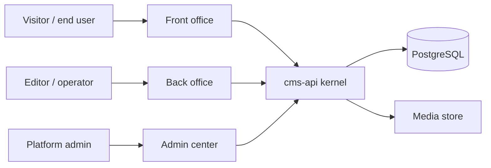
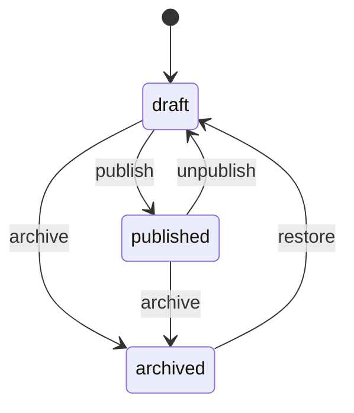

# CMS Scaffold — SDD 總綱

狀態：Draft v0.1  
日期：2026-09-05  
核心方法：Spec-Driven Development（先規格、再任務、後實作）  
本文件凍結。平行窗口只寫自己擁有的衛星規格，不得改切面、不得改技術棧、不得把三個操作面併成一個後台。

## 1. 願景

做一個**可重複使用的 CMS kernel**，不是再做一個 WordPress，也不是三個互不相干的 demo 站。

同一套 kernel 必須同時撐起：

1. **Front office**：給訪客或終端使用者看的公開面。
2. **Back office**：給編輯、診所人員、專案成員做事的作業面。
3. **Admin center**：給平台管理者改內容模型、帳號、權限、系統設定的治理面。

三個 demo 只是證明 kernel 可複用，不是產品本身：

| Demo | 證明什麼 |
| --- | --- |
| 個人相簿 | 媒體庫、相簿/照片內容類型、公開陳列 |
| Pet clinic | 關聯實體、日程/就診紀錄、作業面大於展示面 |
| 專案管理 | 工作項狀態機、成員協作、公開進度頁 |

成功標準：換一套內容類型與權限，不必重寫三個操作面的骨架。

## 2. 問題

常見 CMS 把「給外人看的站」「給內部做事的台」「給管理者改系統的台」揉在同一個 admin。結果是：

- 相簿站把上傳介面和公開 gallery 混在一起。
- Pet clinic 沒有乾淨的作業面，獸醫流程長得像後台表單。
- 專案工具的公開狀態頁與內部看板共用同一套路由權限，最後只能做單租戶玩具。

本專案把三個面拆開，kernel 只提供內容、身份、媒體、發布、權限、稽核。Demo 只註冊內容類型、權限與種子資料。

## 3. 參考對象（功能取捨，不是外觀複製）

對齊的是能力切面，不是品牌或外掛生態。

| 切面 | WordPress | Strapi / Payload | Directus | Ghost | Drupal | 本專案 v1 |
| --- | --- | --- | --- | --- | --- | --- |
| 內容類型 + 欄位 | CPT / ACF | collections | collections | 固定 posts/pages | entities / fields | **要。Kernel 擁有類型登錄** |
| Draft / publish / revision | 有 | 有（深淺不同） | 弱 | 有 | 有 | **要。統一發布狀態機** |
| 媒體庫 | 有 | 有 | files | 圖為主 | media | **要。相簿 demo 的硬依賴** |
| 角色權限 | roles | RBAC | RBAC | roles | permissions | **要。三面共用同一套 RBAC** |
| 公開渲染 | themes | headless | headless | themes | themes | **Front office 自己渲染，REST 先** |
| 編輯作業 | wp-admin 內容 | content manager | app | editor | admin | **Back office，不是 admin** |
| 系統治理 | settings + users | settings | project settings | settings | admin | **Admin center 獨立應用** |
| Preview | 有 | 有 | 弱 | 有 | 有 | **要。草稿只給 back/admin** |
| GraphQL / 外掛市場 / 完整 i18n | 有 | 有 | 有 | 部分 | 有 | **v1 不做** |
| 留言、外掛、主題商店 | 有 | 有 | extensions | 有 | modules | **v1 不做** |

不複製 wp-admin 的資訊架構。三個 React 應用共享 `packages/ui`，路由與權限邊界分開。

## 4. 系統邊界

### In scope（v1）

- 一個 Java 25 API（Spring Boot 3.5+，Gradle，虛擬執行緒可用）。
- 三個 Vite + React + TypeScript 應用，使用 shadcn/ui（Tailwind + Radix），不得自研另一套 CSS 體系。
- Kernel：content type registry、entry CRUD、draft/publish/unpublish、revision、media library、principal/role/permission、navigation、preview token、audit log。
- 三個操作面的資訊架構、路由、API 契約、空狀態與權限失敗行為。
- 三個 demo 的內容類型、種子資料、權限矩陣、代表流程。
- 本機 Docker Compose：API + PostgreSQL + 三個 web。測試可用 Testcontainers 或本機 Postgres；契約測試不依賴人工點擊。
- OpenAPI 為 API 的權威契約。前端不得發明未記載的欄位。

### Out of scope（v1）

- 多租戶 SaaS 計費、外掛市場、主題商店。
- GraphQL、即時協同編輯、全站搜尋引擎。
- 完整 i18n / 多站樹。欄位可先是單一 locale。
- 留言、通知 inbox、email campaign、支付。
- 生產部署、自研物件儲存。本機媒體可落地磁碟；S3 只留介面。
- 把 back office 與 admin center 合成「一個後台，兩個 menu」。
- 在本輪平行窗口寫應用程式碼。本輪只寫規格。

## 5. 三個操作面



| 面 | 誰 | 做什麼 | 不做什麼 |
| --- | --- | --- | --- |
| Front office | 匿名或登入的終端使用者 | 讀已發布內容、公開媒體、公開表單（例如預約） | 改內容類型、看草稿、管使用者 |
| Back office | 編輯、獸醫、專案成員 | 建/改自己權限內的 entry 與媒體、preview、提交發布 | 改 RBAC 模型、註冊新內容類型、系統設定 |
| Admin center | 平台管理者 | 內容類型、角色權限、使用者、審計、系統與儲存設定 | 日常寫文章、看診、搬任務卡。可緊急覆寫，但不是作業面 |

三個應用可同 origin 不同 path，或不同 port。v1 建議三個 Vite app：`apps/web-front`、`apps/web-back`、`apps/web-admin`。Cookie/session 與 CORS 必須寫進身份規格。

## 6. Kernel 對 demo 的關係

Kernel 不知道「相簿」或「寵物」。它知道 `ContentType`、`Field`、`Entry`、`MediaAsset`、`Principal`、`Role`、`Permission`、`PublicationState`。

Demo 是**內容類型包 + 權限 + 種子 + 前端視圖註冊**：

| Demo | 主要類型 | Front | Back | Admin |
| --- | --- | --- | --- | --- |
| 個人相簿 | `album`, `photo` | 相簿列表、相片牆、單張頁 | 上傳、排序、說明、封面 | 儲存配額、可見性預設、使用者 |
| Pet clinic | `owner`, `pet`, `vet`, `visit` | 診所介紹、獸醫列表、（可選）飼主查自己的預約 | 飼主/寵物/就診 CRUD、行程 | 診所設定、班表規則、角色 |
| 專案管理 | `project`, `issue`, `milestone` | 公開專案與里程碑 | 看板、issue、指派 | 組織成員、專案可見性 |

若某個 demo 需要 kernel 沒有的原語，先在該 demo 規格標 **Open / kernel gap**，不得私自加一條只服務該 demo 的後門 API。

## 7. 技術棧（凍結）

| 層 | 選擇 | 理由 |
| --- | --- | --- |
| API | Java 25, Spring Boot 3.5+, Gradle | 語言層級虛擬執行緒；與現有 Java 產品線接近 |
| DB | PostgreSQL 16+ | 關聯 demo（clinic/projects）需要真 FK；不要一開始就上 schemaless |
| 遷移 | Flyway | 內容類型的**系統表**用遷移；demo 類型資料用種子，不手寫 DDL 分叉 |
| Web | React + TypeScript + Vite | 三個操作面獨立建置 |
| UI | shadcn/ui + Tailwind | 使用者指定；共享 `packages/ui` |
| 契約 | OpenAPI 3 | 前後端共同來源 |
| 測試 | JUnit 5 + Testcontainers；前端 Vitest + Testing Library | 規格裡的驗收必須能對到指令 |

禁止：PHP/WordPress fork、Next.js 綁死、自研 CSS 框架、在 v1 引入 Kafka/Redis 作為正確性依賴。

## 8. 資料與發布狀態

Entry 狀態機（v1 最小）：



- Front office 預設只讀 `published`。
- Back office 可讀寫權限內的 `draft` / `published`。
- Revision：每次 publish 留快照；v1 可只保留最近 N 版。
- 刪除：軟刪。硬刪只在 admin 且寫 audit。

系統表與內容表分開。`cms_content_type`、`cms_field`、`cms_entry`、`cms_entry_revision`、`cms_media`、`cms_principal`、`cms_role`、`cms_permission`、`cms_audit_event`。Demo 不得新建平行的 `album` 表來繞過 entry。相簿的 `album` 是 content type，不是獨立 bounded context 資料庫。

例外：若 Pet clinic 的關聯查詢在通用 entry JSON 上不可接受，身份/內容規格必須先寫 **projection 或 typed read model**，仍由 kernel 寫入路徑擁有。

## 9. 權限模型

權限是 `(principal, action, contentType, optional entry predicate)`。

標準 action：`read_published`, `read_draft`, `create`, `update`, `publish`, `unpublish`, `delete`, `manage_media`, `manage_types`, `manage_principals`, `read_audit`。

預設角色：

| 角色 | Front | Back | Admin |
| --- | --- | --- | --- |
| anonymous | 讀 published | 無 | 無 |
| member | 讀 published + 自己的公開資料 | 無或極窄 | 無 |
| editor | 同 member | 自己類型的 CRUD + preview；publish 可關 | 無 |
| operator | 視 demo | 該 demo 作業類型全套 | 無 |
| admin | 可進 front | 可進 back（不當作日常） | 全套治理 |

身份規格必須寫清 session、CSRF、密碼雜湊、種子帳號不得進 Git 明文密碼。

## 10. 品質與驗收（產品級）

規格完成後（本輪之後）才實作。實作時至少：

- `./gradlew test` 通過，含內容發布狀態機與 RBAC 拒絕案例。
- 三個前端 `npm test` / lint / typecheck / build。
- OpenAPI 與實作一致。
- 三個 demo 各有一條可執行的 happy path（API 級即可；UI e2e 可後補）。
- 未授權的 front 請求看不到 draft。

本輪平行窗口的完成定義見共享契約：交出衛星規格，不是交出 Java。

## 11. 倉庫形狀（實作階段，本輪只記載）

```
cms-scaffold/
  docs/sdd/00-overview.md          # 本文件，凍結
  docs/specs/                      # 平行窗口產出
  apps/web-front/
  apps/web-back/
  apps/web-admin/
  packages/ui/
  services/cms-api/
  gradle/
  compose.yaml
  AGENTS.md
```

本輪 git 裡只應出現 `docs/`、`README.md`、`AGENTS.md`。

## 12. 平行窗口所有權（凍結）

| 窗口 | 擁有的權威 | 只寫 |
| --- | --- | --- |
| Content | 內容類型、欄位、entry、狀態機、revision、navigation | `docs/specs/kernel-content.md` |
| Identity | principal、role、permission、session、三面登入邊界 | `docs/specs/kernel-identity.md` |
| Media | 上傳、儲存、衍生圖、與 entry 的附著 | `docs/specs/kernel-media.md` |
| Front | 公開資訊架構、路由、公開 API 使用方式 | `docs/specs/surface-front.md` |
| Back | 作業資訊架構、編輯/preview/publish UI 契約 | `docs/specs/surface-back.md` |
| Admin | 類型登錄、帳號、審計、系統設定 IA | `docs/specs/surface-admin.md` |
| Demos | 三個內容類型包、種子、代表流程、kernel gap | `docs/specs/demo-album.md` `demo-petclinic.md` `demo-projects.md` |
| Synthesis | 對齊矛盾、開放問題、實作波次 | `docs/specs/90-synthesis.md` |

讀別人的規格可以。不得宣稱擁有對方的權威狀態。跨邊預設 Open。

## 13. 原則

1. 規格是意圖來源。沒有驗收條件的功能不實作。
2. Kernel 穩、demo 薄。
3. 三個操作面是產品，不是 CSS 主題切換。
4. 一個 writer 一個 worktree。
5. 便宜模型不做本輪規格。本輪用 Grok 量大平行寫文件。
6. 不為假想外掛預留抽象。
