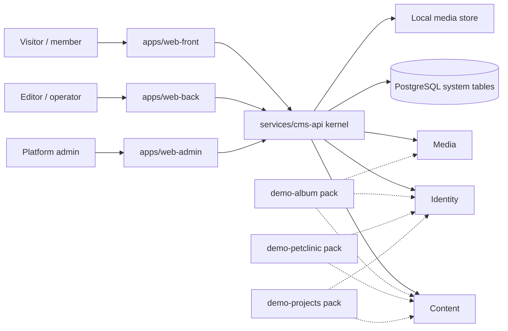
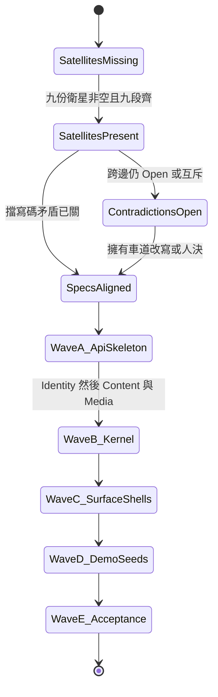
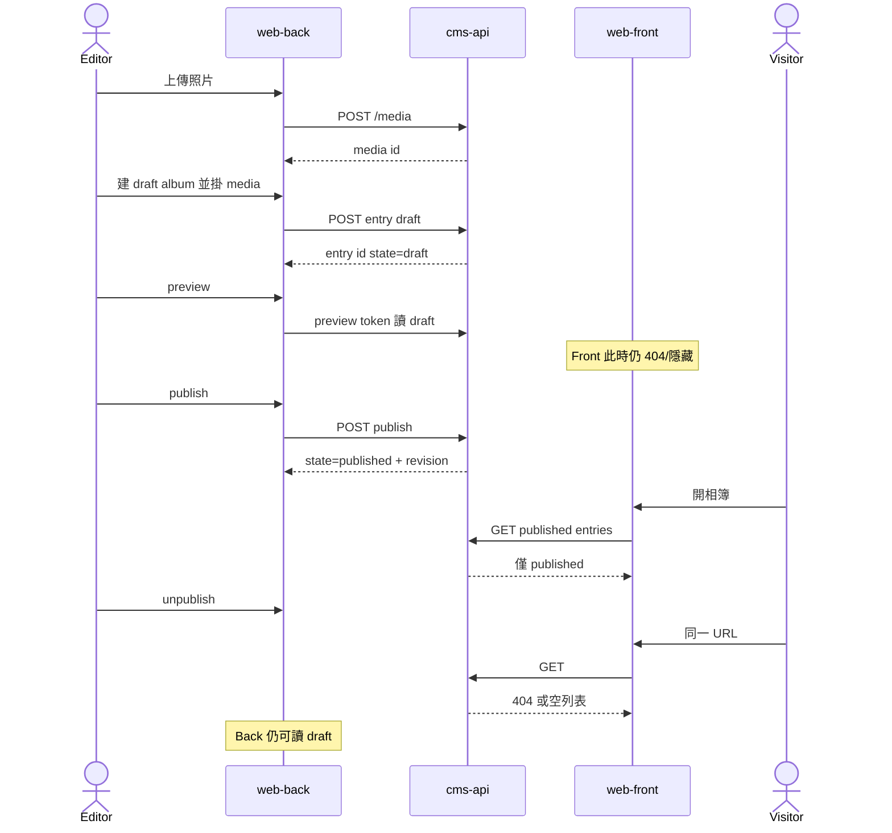
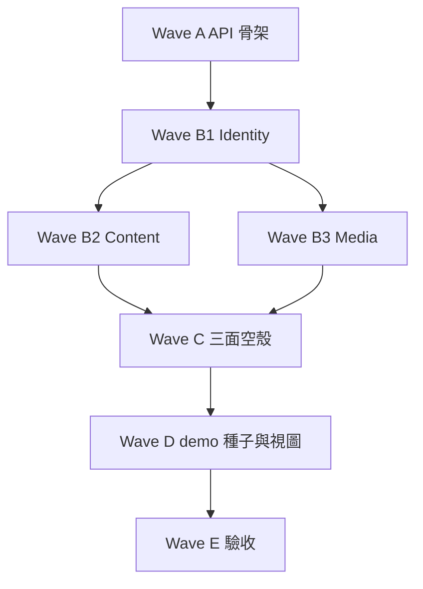

# CMS Scaffold — 規格合成（Wave 3）

狀態：Draft v0.3（九份衛星齊全快照）  
日期：2026-09-05  
車道：Synthesis  
只寫：`docs/specs/90-synthesis.md`  
權威總綱：`docs/sdd/00-overview.md`（本檔不改）

本檔對齊矛盾、彙總 kernel gap、排出實作波次與驗收指令。不是第二份架構，也不代替任何衛星規格。

本快照已讀九份 worktree 衛星（尚未合併進 `main`）。跨邊互斥處由擁有車道勝；合成只選邊、不改對方檔。

證據等級：

| 等級 | 含義 |
| --- | --- |
| **Decided** | 總綱已凍結，或雙方契約欄位都寫清。對端衛星仍可能在落地時否決跨邊欄位。 |
| **Proposed** | 本合成建議；衛星擁有者可改，人決項除外。 |
| **Open** | 衛星未寫、跨邊未對齊、或要實作波才能定。 |

跨車道邊預設 **Open**。已落地衛星的**本車道 UI/pack 裁定**可在本檔引用；跨邊欄位仍 Open，直到對端也寫清。不得把本檔 Proposed 宣稱為未落地車道的權威。未讀到的衛星 ≠ 同意本檔或已落地衛星。

---

## 1. Executive summary

合成窗口讓三層各自得到「何時能開工、什麼衝突要先關、缺了什麼不能假裝已定」：

| 層 | 得到什麼 |
| --- | --- |
| Kernel | 實作波次（API 骨架 → Identity/Content/Media → 空殼 → 種子 → 驗收）、系統表與 action 的凍結清單、必須先關的儲存/權限/媒體張力。 |
| 操作面 | 三面保持三個 Vite 應用；預覽與草稿不進 Front；Back 不是 Admin；寫碼前要有各自 IA 衛星。 |
| Demo | 三個 pack 仍是類型 + 權限 + 種子 + 視圖註冊。官方 kernel gap 要等 Demos 三檔；本檔只列總綱已暴露的候選 gap。 |

本快照結論（對實作）：

1. **Wave A（API 骨架）可以開始**，條件見 §13：九檔齊、無人決項被觸發、三面未合併。Wave B 起必須遵守 §6 的「建議採用」。
2. 產品切面與技術棧已凍結，合成不重開。
3. 九份衛星都維持三面分離、禁止 demo 後門寫入 API。主要剩餘互斥是契約形狀（path、JSON、action 別名），不是產品切面。
4. 三份 Demos 的官方 kernel gap 已進 §7。Typed read model **v1 不做**，除非實作波量測後由合成再開。

---

## 2. Scope / non-goals / 路徑所有權

### In scope（本檔）

- 矛盾表：誰跟誰衝突、建議採用哪邊、是否需人決、是否擋寫碼。
- Kernel gap 彙總（權威來源應為 Demos；本快照標缺失）。
- 實作波次：API 骨架 → Identity/Content/Media → 三面空殼 → demo 種子 → 驗收。
- 測試清單對到 Gradle / npm 指令。
- 「可以開始寫程式」的入口條件。
- 衛星缺失盤點。

### Non-goals

- 不改 `docs/sdd/00-overview.md` 的切面、技術棧、三個操作面。
- 不寫 `apps/`、`services/`、`packages/`、`compose.yaml` 應用程式碼。
- 不代寫 `kernel-*.md`、`surface-*.md`、`demo-*.md`。
- 不把 Front / Back / Admin 合成「一個後台，兩個 menu」。
- 不發明第四個操作面、GraphQL、外掛系統、多租戶計費。
- 不 commit / push。

### 路徑所有權

| 路徑 | 權限 |
| --- | --- |
| `docs/specs/90-synthesis.md` | 本車道可寫 |
| `docs/sdd/00-overview.md` | 只讀 |
| 其他 `docs/specs/*` | 只讀；缺失不補寫 |
| `apps/` `services/` `packages/` | 禁止 |

Worktree：`/home/ckc/test/workspace/worktrees/cms-synthesis`  
Branch：`agent/cms-synthesis`  
發布庫：`/home/ckc/test/workspace/cms-scaffold`（本車道不直接改 `main`）

---

## 3. 衛星盤點（本快照）

檢查時間：2026-09-05（九檔齊全後重掃）。來源：各車道 worktree `docs/specs/`。`main` 已有初始 commit `ef03d38`。發布庫 `main` 仍只有 `.gitkeep`；衛星活在 `agent/cms-*` 分支，尚未合併。

| 檔 | 車道 | worktree | 行數（約） | 本快照 |
| --- | --- | --- | --- | --- |
| `docs/sdd/00-overview.md` | 凍結總綱 | 只讀 | — | **Decided** |
| `docs/specs/kernel-content.md` | Content | `cms-content` | 1117 | 已讀 |
| `docs/specs/kernel-identity.md` | Identity | `cms-identity` | 818 | 已讀 |
| `docs/specs/kernel-media.md` | Media | `cms-media` | 1032 | 已讀 |
| `docs/specs/surface-front.md` | Front | `cms-front` | 907 | 已讀 |
| `docs/specs/surface-back.md` | Back | `cms-back` | 895 | 已讀 |
| `docs/specs/surface-admin.md` | Admin | `cms-admin` | 938 | 已讀 |
| `docs/specs/demo-album.md` | Demos | `cms-demos` | 436 | 已讀 |
| `docs/specs/demo-petclinic.md` | Demos | `cms-demos` | 480 | 已讀 |
| `docs/specs/demo-projects.md` | Demos | `cms-demos` | 473 | 已讀 |
| `docs/specs/90-synthesis.md` | Synthesis | 本 worktree | 本檔 | 本車道 |

九檔皆含共享契約九段。禁止用本檔填補對方欄位。對端合併進 `main` 前，實作波應以各 `agent/cms-*` 內容 + 本檔建議採用為準。

每份衛星落地時仍須自帶共享契約的九段：Executive summary、Scope、模型 + 兩張 Mermaid、API/UI 契約、三 demo 含義、跨邊表、GWT 驗收、Open questions、實作波不該先做的事。缺一段即未滿足 §13。

---

## 4. 凍結對齊（總綱 Decided，合成不重開）

下列已由總綱凍結。衛星若寫反，以總綱為準，列入矛盾表「衛星否決總綱」，需人決或衛星撤回。

| ID | 凍結項 | 含義 |
| --- | --- | --- |
| F-01 | 一個 kernel、三個操作面 | `web-front` / `web-back` / `web-admin` 三個應用。Back 不是 Admin。 |
| F-02 | Demo 不是產品本身 | Demo = 內容類型包 + 權限 + 種子 + 前端視圖註冊。Kernel 不知「相簿」「寵物」。 |
| F-03 | 技術棧 | Java 25、Spring Boot 3.5+、Gradle、PostgreSQL 16+、Flyway、OpenAPI 3、React + TS + Vite、shadcn/ui + Tailwind、JUnit 5 + Testcontainers、Vitest + Testing Library。 |
| F-04 | 禁止項 | PHP/WP fork、Next.js 綁死、自研 CSS、v1 用 Kafka/Redis 當正確性依賴、GraphQL、外掛市場、完整 i18n、多租戶計費、本輪寫應用程式碼。 |
| F-05 | 發布狀態機 | `draft → published → draft`（unpublish）；兩者皆可 `archive`；`archived → draft`（restore）。Front 預設只讀 `published`。 |
| F-06 | Revision / 刪除 | 每次 publish 留快照，v1 可只留最近 N 版。軟刪。硬刪只在 admin 且寫 audit。 |
| F-07 | 系統表 | `cms_content_type` `cms_field` `cms_entry` `cms_entry_revision` `cms_media` `cms_principal` `cms_role` `cms_permission` `cms_audit_event`。Demo 不得平行建 `album` 表當寫入真相。 |
| F-08 | 權限形狀 | `(principal, action, contentType, optional entry predicate)`。 |
| F-09 | 標準 action | `read_published` `read_draft` `create` `update` `publish` `unpublish` `delete` `manage_media` `manage_types` `manage_principals` `read_audit`。增列必須由 Identity 證明三個 demo 需要。 |
| F-10 | 預設角色 | `anonymous` `member` `editor` `operator` `admin`。Admin 可進 Front/Back，但不把 Admin center 當作業面。 |
| F-11 | 契約 | OpenAPI 為 API 權威。前端不得發明未記載欄位。 |
| F-12 | 媒體儲存 | 本機磁碟；S3 只留介面。不自研物件儲存。 |
| F-13 | 遷移 vs 種子 | 系統表用 Flyway。Demo 類型是種子，不手寫 DDL 分叉。 |
| F-14 | Preview | 要。草稿只給 back/admin。 |
| F-15 | 本輪範圍 | 只寫規格。 |

---

## 5. 資訊架構與波次狀態

### 5.1 凍結的系統形狀（總綱，非新架構）

Kernel 原語（總綱 §6，**Decided**）：`ContentType` `Field` `Entry` `MediaAsset` `Principal` `Role` `Permission` `PublicationState`。

Demo 主要類型名（總綱 §6，類型名 **Proposed** 給 Demos 改顯示名，不可改 kernel 原語）：

| Demo | 類型（總綱） | Front | Back | Admin |
| --- | --- | --- | --- | --- |
| 個人相簿 | `album`, `photo` | 列表、相片牆、單張 | 上傳、排序、說明、封面 | 配額、可見性預設、使用者 |
| Pet clinic | `owner`, `pet`, `vet`, `visit` | 介紹、獸醫列表、可選飼主自查 | 飼主/寵物/就診 CRUD、行程 | 診所設定、班表規則、角色 |
| 專案管理 | `project`, `issue`, `milestone` | 公開專案與里程碑 | 看板、issue、指派 | 組織成員、專案可見性 |

PetType：Demos prompt 允許 enum field，不必獨立類型（**Proposed**，等 `demo-petclinic.md`）。

### 5.2 實作波擁有的目錄（總綱 §11，實作階段才建）

```
cms-scaffold/
  docs/sdd/00-overview.md
  docs/specs/                 # 本輪產出
  apps/web-front/
  apps/web-back/
  apps/web-admin/
  packages/ui/
  services/cms-api/
  gradle/
  compose.yaml
```

本輪 git 只應出現 `docs/`、`README.md`、`AGENTS.md`。**Decided**。

### 5.3 Context（三面 + kernel + 三 pack）



虛線 = 種子與視圖註冊，不是平行 API。三個 React 應用共享 `packages/ui`，路由與權限邊界分開。**Decided**（總綱）。

### 5.4 規格 → 實作狀態機



本快照：衛星已齊，矛盾未全部升 Decided（跨邊對端未改檔）。狀態 = `SatellitesPresent` → 部分 `ContradictionsOpen`（契約形狀）→ 產品切面已 `SpecsAligned`。Wave A 可進；Wave B 起跟 §6 建議採用。

### 5.5 對齊後的代表 sequence（總綱流程，欄位 Open）



路徑與錯誤碼形狀 **Open**（Identity / Content / Media / Front / Back）。行為本身來自總綱，合成視為應對齊的最小故事。

---

## 6. 矛盾表

### 6.1 實際衛星衝突（九檔已讀）

已對齊、不再當衝突：三面分離、寫入走 entry、無 `/albums` 後門、看板 ≠ publication state、preview 不進 Front、獨立 `POST /media`、member 不進 Back、種子無明文密碼、v1 不做 impersonation / 排程發布 / 熱加欄位 UI、JSON entry 而非每 type 寫入表。

下列為檔對檔張力。建議欄 = Synthesis **Proposed**。權威仍屬擁有車道。對端未改檔前跨邊不升 Decided。

| ID | 雙方 | 衝突點 | 建議採用 | 需人決 | 擋哪一波 |
| --- | --- | --- | --- | --- | --- |
| A-01 | album vs Back vs Content | 排序：album `sortOrder`；Back 曾寫 `sortIndex` / `photoIds[]`。Content 建議 `sortOrder` + 反查，album **沒有** `photos[]`。 | `sortOrder` int + 反查。Back 綁此欄。 | 否 | 不擋 A |
| A-02 | album vs Content vs Back | cascade publish / 刪。album 不 cascade publish；父 draft 則 published photo Front 404。Content：不預設級聯 unpublish；`photo.publicRequiresPublishedRefs=["album"]`；刪預設 restrict。 | 無 cascade publish。Front 子資源要父 published（Content 旗標）。刪 album：restrict（album Proposed）。 | 否 | B2 |
| A-03 | Back vs Identity vs album | Back 要 `publish-requests` + `publishRequestedAt`。Identity **明確不增** `request_publish`，v1 不做佇列；缺權限仍打 `/publish` → 403。album happy path 是 operator 直接 publish。 | **Identity 勝**。不新增 action、不持久化申請單。Back「Request publish」= 呼叫 `/publish` 顯示 403。Album 以 operator publish 為 API happy path。 | 否 | 不擋 |
| A-04 | 多車道錯誤信封 | album `{code}`；Back problem+json；Identity `UNAUTHENTICATED` / `FORBIDDEN`；Content `ENTRY_NOT_FOUND`。 | problem+json 信封 + `code` 欄。401/403 用 Identity 碼；公開未發布 404 用 Content `ENTRY_NOT_FOUND`。 | 否 | B1 |
| A-05 | album vs Back 視圖 id | `demo.album.back.albumEditor` vs `album.composer` | Back `viewKey` 為準。 | 否 | C |
| A-06 | Content vs Back vs Demos 欄位集 | Content **Decided** 最小集：prompt 七種 + `boolean` + `date` + `principal-ref`；`slug` 是系統列不是 field type。Clinic pack 自稱沒有 date/principal-ref，birthDate 用 datetime，linkedPrincipalId 用 string（gap）。Projects `assigneePrincipalId` string。Back 還要 `text`/`ref[]`。 | **Content 勝 field type**。Pack 可用 string 暫代 principal-ref（G-CLN-2、G-PRJ-2），kernel 仍提供 `principal-ref`。不進最小集：`text`、`ref[]`、`enums`。Clinic `birthDate` 建議改用 Content 的 `date`，不另造第三套時間型別。 | 否 | B2 |
| A-07 | Identity vs Content vs 總綱 action | Identity 增列 `archive`（涵蓋 restore）+ `manage_settings`。Content 還想 `restore`/`purge`/`manage_navigation`。 | **Identity 勝 action 名**：F-09 + `archive` + `manage_settings`。Navigation 寫入走 `manage_settings`（Identity 邊表已寫：nav 若是設定則用此 action）。不增 `manage_navigation`、`request_publish`、`preview`、`impersonate`。硬刪走 Admin 危險操作 + `delete`/`manage_media`，不另做 `purge` action。 | 否 | B1 |
| A-08 | Back vs Identity vs projects | Back 要 `GET /principals/assignable`。Projects v1 用 string assignee，不做 per-project ACL。 | v1 projects 採 pack：string 顯示名，不擋 D。Kernel 仍有 `principal-ref`。Assignable API **Proposed** 給 Identity 做窄讀，不當 Wave B 閘門。禁止把 Admin 使用者頁嵌進 Back。 | 否 | 不擋 A–C |
| A-09 | Back vs Content 再編輯 | Back 問 PATCH published 原地改還是新 draft。Content：**工作 `payload` + `published_payload`**；Front 只讀後者；再編輯不洩漏到 Front，直到下一次 publish。 | **Content 勝**。Back 編的是工作副本。測試：dirty 不洩漏。 | 否 | B2 |
| A-10 | Content vs Media vs album JSON | Content：payload 裡 media-ref = **UUID 字串**。Media/album/Back 示意 `{mediaId}`。Front 要公開投影含 variants。 | **寫入 UUID 字串**（Content）。**讀取**可展開 `{mediaId, variants}`（Media/Front 公開通道）。Entry 不存 URL。 | 否 | B2/B3 |
| A-11 | album/clinic/projects `slug` 欄 vs Content 系統列 | Pack 把 slug 當 string 欄。Content：slug 是 entry 系統列。 | **Content 勝**：slug 系統列。Pack 種子填系統列，不要再做同名 field。Front 用 `type + slug`。 | 否 | B2 |
| A-12 | album `photo.media` vs Content `photo.image` | 建議鍵不同。 | **Demos pack 勝欄位 key**（Content §7 是建議）。album 用 `media`。實作種子對齊 pack。 | 否 | D |
| A-13 | 公開 API 前綴 | Content/Front：`/api/v1/public/...`，工作面 `/entries`。Identity AUTH-01 用匿名 `GET /api/v1/entries/{id}` 200。 | **Content/Front 勝**：公開只走 `/public`。Front origin 打工作 `/entries` → 403 `SURFACE_FORBIDDEN`。Identity 驗收應改打 public 前綴。 | 否 | B1/B2 |
| A-14 | clinic 403 vs 公開 404 | Clinic：anonymous 讀 owner **即使 published** 也 403（無 `read_published`）。Content：未發布公開 GET 404。Identity：predicate 失敗 403，不把 403 改寫 404。 | **分開**：無 grant / predicate 失敗 → 403（或空列表）。公開前綴下**未發布或不存在** → 404。兩者相容。 | 否 | B1/B2 |
| A-15 | issue enum 值 | Back `todo\|in_progress\|blocked\|done`；Content `todo\|in_progress\|done`；projects `backlog\|ready\|in_progress\|in_review\|done`。 | **Demos pack 勝值**。看板仍是 enum 不是 publication state。Back widget 綁 pack 的 enum。 | 否 | D |
| A-16 | Front vs Identity cookie | Front 邊表曾登記「Front 獨立 cookie 名」。Identity：**一顆** `cms_session` httpOnly，surface 由 Origin 判定。 | **Identity 勝**。三面同一 cookie，靠 CORS Origin 當 surface。 | 否 | B1/C |
| A-17 | Front 預約 vs clinic pack | Front：member Front command，建議類型 `appointment_request`，永不 publish。Identity 允許 member `create` visit 且 `allowedSurfaces=[front]`。Clinic pack：**不做** anonymous create；happy path 不依賴飼主預約表單。Content 預設 public 只讀。 | v1 **不做** Front 預約寫入（降級為介紹 + 獸醫列表 +「請致電／登入看自己的行程」）。不新增 `appointment_request`、不開 `/public` 通用 create。若後日要做，用 `create` + 獨立類型 draft，不當 visit 原語。 | 否 | 不擋（Front clinic 預約非閘門） |
| A-18 | Admin inspector vs Back「Admin 無編輯器」 | Admin **Decided** 有 Entry inspector（metadata / 強制狀態 / 硬刪），**沒有** schema 欄位編輯器、媒體選擇器、preview token。 | 接受為緊急覆寫，不是作業面。Admin UI 不得長成通用 editor。Back 零治理選單仍成立。 | 否 | C |
| A-19 | Media vs Content 附件 | Media 有 `cms_media_attachment` 與 `replaceAttachments`。Content 用 `cms_entry_ref` `to_kind=media`。 | 附著真相走 Content ref 抽出表 + Media 位元組。實作可一張 attachment 表，但 **不要兩套寫入**。跨邊 Open 到實作波選一張表，契約仍是「entry 只存 media UUID」。 | 否 | B3 |

### 6.2 總綱張力（衛星落地後的收斂）

權威仍屬擁有車道。多數已由擁有車道拍板，與 §6.1 建議採用一致。跨邊未雙方改檔前不升 Decided。

| ID | 雙方 | 衝突點 | 建議採用 | 需人決 | 擋寫碼 |
| --- | --- | --- | --- | --- | --- |
| C-01 | 總綱 §7–§8 vs Content | JSON vs 每 type 表 vs 真 FK。 | **Content 已 Decided**：`cms_entry` JSONB + `cms_entry_ref` + `cms_entry_index`。v1 **不建** typed read model。禁止 `CREATE TABLE album`。H-01 未觸發。 | 否 | 已關 |
| C-02 | 總綱項目狀態機 vs Back / Demos | 專案「工作項狀態機」易被寫進 `PublicationState`。Back prompt 強制選：看板欄 = field/enum 還是 publication state。 | **Back 已 Decided**：看板欄 = `issue.fields.status` enum，禁止當 publication state。album pack 的共享表同意。合成採此邊。enum 值 **Proposed** `todo \| in_progress \| blocked \| done`（Demos 可改 label）。`demo-projects.md` 仍缺失，Content 仍 Open（可改 slug，不可改「欄 ≠ 發布狀態」除非改總綱）。 | 若 Content/Demos 把看板做成 publication state，要人決。 | 是 |
| C-03 | 總綱 archive vs 軟刪 | 兩者是否同一。 | **Content 已分開**：`archived` 狀態 + `deleted_at` 軟刪。公開查詢兩者都看不見。Restore 用 `archive` action（Identity：同一 action 涵蓋 restore）。硬刪只 Admin。 | 否 | 已關 |
| C-04 | Content vs Admin | 熱新增 vs 種子啟停。 | **Admin UI Decided** 種子 + 啟停，無「新增類型」按鈕。Content API 可給種子/測試用登錄，**UI 不暴露**。停用：Front 404、Back 409 `TYPE_DISABLED`。 | 否 | 已關 |
| C-05 | Content vs Front vs Admin | Navigation 形態。 | **Content Decided**：`NavigationMenu` 設定資源，不是 content type。Admin 寫（`manage_settings`，見 A-07）、Front 讀已發布、Back 不編。 | 否 | 已關 |
| C-06 | Front vs Identity vs Content vs clinic | 公開預約。 | 見 A-17：v1 **降級**，不做 Front 寫入。不開第四面。H-02 未觸發。 | 否 | 已關（功能延期） |
| C-07 | Identity vs Front | 「飼主看自己的寵物」：member predicate vs 另開 portal 角色 vs 第四應用。 | 留在 Front。`member` + entry predicate（owner.principal = me）。不開第四操作面、不開 clinic portal app。**Back 已 Decided**：member/anonymous 不能用 Back。album：member = anonymous，無上傳。 | 若有車道要獨立 portal 應用，要人決（違反 F-01）。 | 是 |
| C-08 | 總綱 Preview vs Back vs Front | Preview token 是否讓 Front 以訪客視角渲染草稿。總綱：草稿只給 back/admin。Identity 代表流程：已登入 Back 的人打 Front draft URL 仍失敗。 | **Back 已 Decided**，album 同意：preview 只在 `web-back`（`/entries/:type/:id/preview` 與 `/preview/t/:token`）。Front 無 `?preview=`。Token TTL **Proposed** 15 分鐘、`aud=preview`、過期 410。Front 衛星仍缺失，但產品規則視為應對齊。 | 若 Front 要把 token 接到公開 app，要人決。 | 是 |
| C-09 | Identity vs 三面 | Session / CORS。 | **Identity Decided**：`cms_session` httpOnly + double-submit CSRF；三 origin 5173/5174/5175；API 8080；測試可用 Bearer。見 A-16。 | 否 | 已關 |
| C-10 | Identity vs Content（錯誤碼） | 404 藏資源 vs 403。 | 見 A-14：**未發布/不存在** 公開 GET → 404。**無 grant / predicate 失敗** → 403。Front surface 打 draft API → 403 `SURFACE_FORBIDDEN`。 | 否 | 已關 |
| C-11 | Media vs Content vs Front | 上傳與公開位元組。 | **Media Decided**：獨立 `POST /media`；公開 `GET /api/v1/public/media/{id}/file/{variant}`；未發布 **404**；非靜態目錄、v1 非簽名 URL。衍生 thumbnail 320 / web 1600 同步。配額預設 15MiB / 庫 2GiB。 | 否 | 已關 |
| C-12 | Media vs Identity vs Admin | 誰能上傳；配額。 | Identity：editor/operator/admin 有 `manage_media`。Media 配額 **Decided**：單檔 15MiB、庫 2GiB、1e4 檔、每 principal 2000。Admin `manage_settings` 可改。 | 否 | 已關 |
| C-13 | Admin vs Back vs 總綱 | Admin「可緊急覆寫」vs「不是作業面」vs Admin prompt 建議 v1 不做 impersonation。 | **Back 已 Decided**：零條 Admin 導航、不呼叫治理 API。album Admin 畫面不含日常貼 caption。合成採此邊。Admin 角色進 Back 做事；Admin center 不做第二套編輯器。v1 不做 impersonation。Admin 衛星仍缺失。 | 若 Admin IA 放進通用 entry editor，要人決。 | 是 |
| C-14 | 總綱 clinic Admin「班表規則」vs Demos prompt | 總綱表格寫診所設定、班表規則。Demos：clinic 不是完整病歷、不做排班最佳化。 | v1 最多 `clinic_settings` 類內容（營業資訊、可見性）。**不做**排班引擎。總綱該格當「治理面有設定、不是作業面」而非功能承諾。 | 若要把班表規則當 kernel 原語，要人決。 | 否（標 gap 即可開工骨架） |
| C-15 | Back 自訂視圖 vs kernel 寫入 | clinic 時間線、projects 看板：前端組合 vs 後端專用 query。總綱禁止 demo 後門寫入 API。 | **Back 已 Decided**：閉集三視圖、compile-time registry、預設 front-end composition；寫入禁止 `/clinic/visits`、`/issues/{id}/move`、`/albums/{id}/photos:reorder`。album 同意用 PATCH `sortOrder`。只讀 projection 僅在 N+1 或看板 >100 時向 Content 請求，v1 demo 先不依賴。 | 若後續 Demos 要求專用寫入路徑，要人決。 | 是 |
| C-16 | Front `/` 路由 | Front prompt 建議 `/` 為 demo 選擇器，`/album` `/clinic` `/projects` 為入口。總綱未鎖。 | 採 Front prompt：**Proposed** `/` 選擇器 + 三個 demo 入口。不是三個部署。權限模型仍一套。 | 否。Front 擁有 IA，合成只擋「做成三個獨立站」。 | 否 |
| C-17 | 種子帳號 | 明文密碼。 | **Identity Decided**：只列 username+角色；`CMS_SEED_PASSWORD_*`；否則生成寫入 gitignore 檔。Argon2id。album/clinic/projects 種子帳號皆無密碼。 | 否 | 已關 |

### 6.3 處理規則（Decided，本車道）

1. 總綱 F-* 勝過任何衛星。
2. 原語（狀態機、action 名、系統表、三面邊界）以擁有車道為準，但不得推翻 F-*。
3. 跨邊欄位雙方都寫清才能在本檔改標 Decided，並註明對端可否決。
4. 兩邊都 Decided 且互斥、又都符合總綱 → 人決。合成不偷偷選邊寫進對方檔。
5. 缺失 ≠ 同意本檔 Proposed。

---

## 7. Kernel gap 彙總

權威來源是 Demos 三檔的 **Open / kernel gap** 段。本快照只有 `demo-album.md`。clinic / projects 仍是候選，不得冒充 Demos 權威。

### 7.1 官方（來自 `demo-album.md` §11）

| ID | 缺口 | album 暫行作法 | 合成建議 | 歸屬 | 擋哪一波 |
| --- | --- | --- | --- | --- | --- |
| G-ALB-1 | 有序 `ref[]` collection | `sortOrder` int + 查詢排序 | **接受暫行**。不要 `/albums/{id}/photos:reorder`。若 Content 後來提供有序 `ref[]`，合成可改，不擋 v1。 | Content | B2 需支援 int 排序過濾 |
| G-ALB-2 | EXIF 自動擷取 / `json` 欄位 | v1 不做；`takenAt` 手填可空 | **接受延期**。不進 v1。 | Media/Content | 不擋 |
| G-ALB-3 | 媒體可見性隨 entry 發布狀態 | 無任何「呼叫者可讀的 published 參照」則位元組不可匿名讀 | **接受為 Media 必做**。禁止公開靜態目錄無授權直出。 | Media | B3 |
| G-ALB-4 | 欄位級過濾（`visibility=public`） | 若列表 API 不能濾欄位，Front 不得下載全部再藏 | **接受為 Content 必做**（至少 published 列表可濾 enum）。Front 不當授權層。 | Content | B2 / C Front |
| G-ALB-5 | slug 唯一 | 種子避開衝突；422 由 Content 定 | **Proposed** Content 在同 contentType 內 unique。不要 demo unique index 表。 | Content | B2 |
| G-ALB-6 | singleton / 站台 About | 本 pack 不做 About 頁 | **接受不做**。不要另做 `page` 除非跨 pack 共用並人決。 | — | 不擋 |

album 另外把「刪 album restrict、不 cascade publish、封面可漂移」寫成 **Proposed** 刪除/發布規則，跨邊 Open 向 Content（見 A-02）。

### 7.2 Back 向 kernel 登記的缺口（非 Demos 權威，但會卡住作業面）

| ID | 缺口 | 來源 | 合成建議 | 擋哪一波 |
| --- | --- | --- | --- | --- |
| G-BACK-1 | 欄位 schema 投影：`role=title`、`listable`、`filterable` | Back | Content 種子/類型 API 帶這些 annotation。沒有則通用列表無法 schema 驅動。 | B2 / C |
| G-BACK-2 | `q` title contains、offset 分頁、`filter.<field>`、`include=refTitles` | Back | 屬查詢能力不是搜尋引擎。v1 要做 title contains + 分頁；`include=refTitles` 可後補，時間線需要時再加。 | B2 分頁/q 必做 |
| G-BACK-3 | entry `version` 樂觀鎖 | Back | **Proposed** 做。409 衝突。 | B2 |
| G-BACK-4 | preview token 資源 | Back + 總綱 | 總綱已要。形狀採 Back Proposed，Identity/Content 可改數值。 | B2 |
| G-BACK-5 | `GET /principals/assignable` | Back | 見 A-08。 | D projects |
| G-BACK-6 | `principal-ref` 或等價 | Back | 見 A-06。 | D projects |
| G-BACK-7 | `archive` / `restore` action | Back vs F-09 | 見 A-07。 | B1/B2 |
| G-BACK-8 | publish-request 旗標 | Back | 見 A-03：可選，不新增 action。 | 不擋 A–C |
| G-BACK-9 | 只讀 projection `/projections/clinic/schedule` 等 | Back | v1 demo **先不依賴**。需要時 kernel 擁有，禁止寫入。 | 不擋 |

### 7.3 官方（來自 `demo-petclinic.md` §11）

| ID | 缺口 | 暫行作法 | 合成建議 | 擋哪一波 |
| --- | --- | --- | --- | --- |
| G-CLN-1 | singleton 類型 | slug=`home` 種子一筆 `clinic_profile` | **接受暫行**。不做 `clinic_profile` 表。 | 不擋 |
| G-CLN-2 | `principal-ref` | `linkedPrincipalId` string | Kernel 已有 `principal-ref`（Content）。Pack 可繼續用 string；實作波鼓勵改 principal-ref。 | 不擋 A–C |
| G-CLN-3 | 關聯行走 predicate | 冗餘 `ownerPrincipalId` | **接受**。寫入由 kernel 填並防偽造，不能只靠 React。Identity predicate 只看當筆。 | B2 校驗 |
| G-CLN-4 | multi-enum specialties | 單一 `specialty` | **接受延期**。不複製 `vet_specialties` join 表。 | 不擋 |
| G-CLN-5 | visit.owner == pet.owner | Back 同時寫 | Kernel 校驗 **Proposed** 做；禁止 demo 服務層繞過。 | B2 最好有 |
| G-CLN-6 | 按日/按 owner 查詢 | 先通用過濾 | Content v1 不做 typed read model。先 `cms_entry_index`。不夠再投影。禁止 clinic 專用 write。 | 不擋 |
| G-CLN-7 | date vs datetime | datetime | 見 A-06：可用 Content `date`；不另造 clinic 時間型別。 | 不擋 |

Clinic **不做** Front anonymous 預約寫入（A-17）。飼主 member 入口可選，happy path 不依賴。

### 7.4 官方（來自 `demo-projects.md` §11）

| ID | 缺口 | 暫行作法 | 合成建議 | 擋哪一波 |
| --- | --- | --- | --- | --- |
| G-PRJ-1 | issue.milestone.project == issue.project | Back 帶欄位 | Kernel 校驗 **Proposed**。禁止看板服務第二份 graph。 | D 最好有 |
| G-PRJ-2 | principal-ref / 專案 ACL | 平台角色 + string assignee | 見 A-08。v1 不做 Jira permission scheme。 | 不擋 |
| G-PRJ-3 | 欄位級 predicate（visibility=public） | 後端強制 | 與 G-ALB-4 同類。Content 列表必須能濾 enum。Front 不當授權層。 | B2 |
| G-PRJ-4 | 看板 query | 通用 list + 客戶端分桶 | 與 Back 閉集視圖一致。禁止 `/boards/{id}` write。 | 不擋 |
| G-PRJ-5 | 欄內排序原子性 | last-write-wins | **接受**。不引入 Redis/Kafka。 | 不擋 |

Issue 看板 enum 值見 A-15（採 pack）。

### 7.5 已收斂、不再當 gap 的候選

| 原候選 | 收斂 |
| --- | --- |
| G-04 typed read model | Content **v1 不做**；G-CLN-6 先 index。 |
| G-07 工作項 enum | C-02 已關。 |
| G-11 班表引擎 | C-14 + Admin 拒絕設定鍵。clinic `hours` 是 markdown 內容。 |
| G-13 Navigation | C-05 已關。 |
| G-16 衍生圖 | Media 已定尺寸。 |

**明確不是 gap（拒絕擴核，Proposed）**

| 要求 | 原因 |
| --- | --- |
| 人臉辨識、Instagram 動態、讚、留言 | album non-goal（已落地） |
| 完整電子病歷、排班最佳化 | clinic non-goal（prompt；等 pack 確認） |
| Gantt、Jira 工作流、WIP 上限、多人拖卡 WebSocket | Back 已拒絕；projects prompt |
| GraphQL、外掛、主題商店、即時協同、通知 inbox | 總綱 v1 out of scope |
| Demo 專用後門 REST、`AlbumEntity` 表 | 總綱 §6 + album A-TYPE-1 |
| 第四個 Back 視圖插件 API | Back 閉集三視圖 |

---

## 8. API / UI 契約對照（資源清單，非新架構）

本車道不擁有欄位級契約。下表把總綱已點名的系統表對到**預期**資源群，供波次與 OpenAPI 對帳。HTTP path、JSON 欄位、錯誤 envelope：**Open**，由 Identity/Content/Media 寫，Front/Back/Admin 不得發明。

### 8.1 資源群（Proposed path 前綴 `/api/v1`，可被 Identity/Content 改）

| 資源群 | 擁有車道 | 系統表 / 原語 | 標準 action | 三面誰打 |
| --- | --- | --- | --- | --- |
| Sessions / CSRF / me | Identity | `cms_principal` | 認證本身 | 三面登入邊界 |
| Principals | Identity | `cms_principal` | `manage_principals` | Admin 寫；Back/Front 讀 me |
| Roles / permissions | Identity | `cms_role` `cms_permission` | `manage_principals` | 僅 Admin |
| Content types / fields | Content | `cms_content_type` `cms_field` | `manage_types` | Admin 啟停；Back 讀 schema 畫表單；Front 不管理 |
| Entries CRUD | Content | `cms_entry` | `create` `update` `read_*` `delete` | Back 寫；Front 只 `read_published`；Admin 不日常寫 |
| Publish / unpublish / archive / restore | Content | `cms_entry` | `publish` `unpublish` | Back；Front 無 |
| Revisions | Content | `cms_entry_revision` | `read_draft` 或同等 | Back/Admin |
| Preview token | Content + Identity | （非表或短表，Open） | `read_draft` | 僅 Back/Admin |
| Navigation | Content | Open（C-05） | 視 C-05 | Admin 寫、Front 讀 |
| Media upload / metadata / bytes | Media | `cms_media` | `manage_media` + 公開讀 | Back 上傳；Front 讀已發布位元組 |
| Audit | Identity 或 Admin 讀模型 | `cms_audit_event` | `read_audit` | 僅 Admin |
| Health | API 骨架 | — | 匿名 | Compose / 測試 |

Front 公開查詢必須在**查詢層**強制 `published`，不是靠藏按鈕（總綱 Content prompt / §8）。**Decided** 行為；實作位置屬 Content。

### 8.2 錯誤與權限（對齊 C-10，Proposed）

| 情況 | HTTP | 備註 |
| --- | --- | --- |
| 未登入打需認證端點 | 401 | Identity |
| 已登入缺 action | 403 | 含 editor 無 `publish` |
| Front GET 未發布或不存在的單篇 | 404 | 不洩漏草稿 |
| Back GET 無 `read_draft` 的草稿 | 403 | 不當 404 |
| 媒體未發布/軟刪後直連 | 404 或 410 | Media 選一個 |
| 驗證失敗 | 422 | problem+json（A-04）；欄位錯誤不回堆疊 |
| 樂觀鎖 / 非法狀態 | 409 | `type` 區分 version vs illegal_state |
| Preview token 過期 | 410 | Back |
| CSRF 失敗 | 403 | Identity |

種子帳號：規格只列 username + 角色。**Decided**（F 精神 + C-17）。

### 8.3 UI 契約（只鎖邊界，不鎖頁面樹）

| 面 | 應用 | 合成鎖住的 | 仍 Open |
| --- | --- | --- | --- |
| Front | `apps/web-front` | 只讀 published；bundle 不含 draft 欄位、不含 preview-tokens；shadcn 不引入第二套 UI kit | 路由樹、空狀態文案、SEO（`surface-front.md` 缺失） |
| Back | `apps/web-back` | 見 `surface-back.md`：schema 驅動列表/表單；閉集三視圖 `album.composer` / `clinic.schedule` / `projects.board`；preview 只在 Back；**沒有**治理選單；member/anonymous 不可進 | Request publish 旗標（A-03）；port 最終值 |
| Admin | `apps/web-admin` | 類型啟停、權限矩陣、使用者、審計、配額/儲存設定；**沒有**日常寫作/看診/看板 | 危險操作確認流、審計保留期限（`surface-admin.md` 缺失） |

三面可同 origin 不同 path 或不同 port。v1 **Proposed** 不同 port（C-09）。

---

## 9. 對三個 demo 的含義

Kernel 無感「相簿 / 寵物 / issue」。三份 pack 均已落地。

| Demo | 來源 | Kernel 含義 | Pack 自備 | 合成備註 |
| --- | --- | --- | --- | --- |
| 個人相簿 | `demo-album.md` | 不新增原語。禁止 `album` 表與 `/albums`。 | `album`/`photo`、`sortOrder`、`visibility` unlisted、種子 editor 無 publish | T-AL-*。member 本 pack 不使用。 |
| Pet clinic | `demo-petclinic.md` | 關聯圖 + **published ≠ 全世界可讀**（owner/pet/visit 匿名無 `read_published`）。 | `clinic_profile` singleton、`owner`/`pet`/`vet`/`visit`；PetType=enum | 飼主不進 Back。Front 預約寫入 v1 不做（A-17）。`hours` 是 markdown 不是班表引擎。 |
| 專案管理 | `demo-projects.md` | 發布狀態機 ⊥ issue enum。匿名不讀 issue。 | `project`/`milestone`/`issue`；issue.status 五段 enum；assignee string | 看板 PATCH enum。private+published 證明欄位 ≠ 狀態機（同 unlisted）。 |

三個 demo 應共享：同一套 entry API、同一套 media 上傳、同一套角色引擎、同一套三面骨架。album 已明示不與另外兩個共享類型名。若某 pack 長平行 CRUD，擋 Wave D。

---

## 10. 跨車道邊表

跨邊預設 **Open**，直到雙方欄位一致。本快照九檔都在，但互斥處見 §6.1 建議採用（擁有車道勝）。下列「狀態」指是否已雙方同義，不是檔案是否存在。

| 邊 | 必須對齊的契約 | 本檔建議 | 狀態 |
| --- | --- | --- | --- |
| Content ↔ Identity | action 名稱；`publish` 可關；predicate；`archive`/`restore`（A-07）；assignable（A-08） | F-09 + 建議增列 archive/restore | Open（兩端都缺失） |
| Content ↔ Media | media-ref 形狀；entry 只存 id | album/Back 示意 `{ "mediaId": "…" }`；不存 blob | Open（兩端缺失；消費側已同邊） |
| Content ↔ Front | 公開查詢參數；未發布 404；欄位過濾 G-ALB-4 | 查詢層強制 published | Open（兩端缺失） |
| Content ↔ Back | schema 投影、`q`、分頁、filter、preview、version、enum≠state | 寫入走 entry；讀側可投影。Back 需求已列，Content 未應。 | **單側 Back**；跨邊 Open |
| Content ↔ Admin | 類型啟停，非熱加欄 | C-04 | Open |
| Content ↔ Demos | 類型名、欄位、gap、無 cascade publish | album 已 Proposed `album`/`photo` + G-ALB-* | **單側 album**；Content 未應 |
| Identity ↔ Media | 誰 `manage_media`；公開讀 | C-12；album：editor/operator 可上傳 | Open |
| Identity ↔ Front/Back/Admin | 登入、cookie、CORS、登出；member 禁 Back | C-09；Back 已 Decided member 禁入 | **單側 Back** |
| Identity ↔ Demos | 角色顯示名；不可第四套引擎 | album：`album.editor` / `album.operator` / `admin`；member=anonymous | **單側 album** |
| Media ↔ Front | 公開傳遞方式 | C-11 / G-ALB-3 | Open |
| Media ↔ Back | 選擇器、先上傳再掛、草稿縮圖授權 URL | 兩邊消費契約已齊；Media 未應 | **單側 Back** |
| Media ↔ Admin | 配額與儲存設定 | G-09 | Open |
| Media ↔ Demos | album 硬依賴；未發布位元組不可猜 | G-ALB-3 | **單側 album** |
| Front ↔ Demos | 各 demo 首頁區塊；`/album` 入口 | Front 擁有骨架；album 要求列表/牆/單張/404/unlisted | **單側 album** |
| Back ↔ Demos | 自訂視圖清單與排序欄 | 合成採 `album.composer` + `sortOrder`（A-01、A-05）。clinic/projects pack 缺失。 | **album↔Back 產品規則對齊；欄位名等 Content** |
| Back ↔ Admin | 導航隔離 | Back **Decided** 零連到 Admin | **單側 Back**；Admin 未應 |
| Admin ↔ Demos | 哪些設定是 demo 不是 kernel | album：配額引用 Media；可見性預設應少 | **單側 album** |

---

## 11. 實作波次

規格波（本輪）完成後才進入下列實作波。指令在 repo 落地後才存在；本節鎖**順序與完成定義**，不鎖 class 名以外的實作細節。



Content 與 Media 在 Identity 之後可平行，但 media-ref 與 `manage_media` 契約必須先凍結（C-11、C-12）。**Proposed**。

### Wave A — API 骨架

| | |
| --- | --- |
| 做 | `services/cms-api` Spring Boot 3.5+ / Java 25 / Gradle。Flyway 可連 PostgreSQL 16。`compose.yaml`：API + Postgres。Health。OpenAPI 空殼（info + health）。虛擬執行緒可用但不把正確性建立在上面。 |
| 不做 | 業務表以外的假架構、Redis、GraphQL、三個 web。 |
| 完成 | `./gradlew test` 能跑（可先只有 context load）。`docker compose` 起 API + DB。 |
| 依賴 | §13 入口條件。 |

### Wave B1 — Identity

| | |
| --- | --- |
| 做 | principal/role/permission、session cookie、CSRF、密碼雜湊、RBAC 拒絕、種子使用者規則。三面 CORS allowlist。 |
| 不做 | 內容狀態機、媒體位元組、UI。 |
| 完成 | `./gradlew test` 含 RBAC 拒絕與 401/403。無明文密碼進 git。 |
| 依賴 | Wave A；`kernel-identity.md`。 |

### Wave B2 — Content

| | |
| --- | --- |
| 做 | 類型登錄（種子）、field 最小集（A-06）、entry CRUD、F-05 狀態機、revision（最近 N）、軟刪、Front 查詢層強制 published、preview 快照、`q`/分頁/`filter`、slug 唯一（G-ALB-5）、enum 欄位過濾（G-ALB-4）。Navigation 依 C-05。Projection 僅在宣告需要時。 |
| 不做 | 每 demo 一張寫入表、排程發布、全文搜尋、cascade publish、有序 `ref[]`（v1 用 int）。 |
| 完成 | 狀態機測試；未授權 Front 讀不到 draft；OpenAPI 含 entries；無 `album` 實體表。 |
| 依賴 | B1；`kernel-content.md`；C-01/C-02/C-03/A-06/A-07/A-09 已關。 |

### Wave B3 — Media

| | |
| --- | --- |
| 做 | `POST /media`、本機磁碟、MIME allowlist、thumbnail/web 同步衍生、與 entry 附著、公開 vs 私有 URL、軟刪後直連失效、配額介面。S3 port 空實作。 |
| 不做 | 病毒掃描產品、自研物件儲存、公開可猜靜態目錄。 |
| 完成 | 上傳→掛 draft→publish→Front 取縮圖；unpublish 後舊 URL 失敗；draft 媒體匿名直連失敗（G-ALB-3）。 |
| 依賴 | B1；`kernel-media.md`；C-11、G-ALB-3 已關。 |

### Wave C — 三面空殼

| | |
| --- | --- |
| 做 | `packages/ui`（shadcn）。三個 Vite app：路由、登入/拒絕、空狀態、權限失敗。Back 依 `surface-back.md`：schema 驅動列表/表單、preview 隔離、零 Admin 導航。Admin：類型啟停/使用者/審計/配額入口。Front：只打公開 API。Compose 加上三個 web。 |
| 不做 | 把 Back 與 Admin 做成一個 app 兩個 menu。第二套 CSS。Next.js。UI e2e（可後補）。先做三張自訂視圖卻沒有通用編輯器。 |
| 完成 | 各 app `npm test` `lint` `typecheck` `build`。未登入 Back/Admin 進不了作業/治理路由。Front 畫面不含 draft 欄位。member 進不了 Back。 |
| 依賴 | B1–B3；三份 `surface-*.md`（Back 已有，Front/Admin 仍缺）。 |

### Wave D — Demo 種子與視圖

| | |
| --- | --- |
| 做 | 三個內容類型包種子、權限矩陣、代表資料。Front/Back 註冊視圖。Back 最後才掛 `album.composer` / `clinic.schedule` / `projects.board`，寫入仍 entry API。Album 種子見 `demo-album.md`。 |
| 不做 | 平行資料庫、Gantt、排班引擎、人臉、留言、`/albums` API。 |
| 完成 | 三條 API happy path 測試綠（含 T-AL-01…06）。 |
| 依賴 | C；三份 `demo-*.md`（album 已有）；§7 官方 gap 已接受或明確延期。 |

### Wave E — 驗收

| | |
| --- | --- |
| 做 | 跑 §12 全表。OpenAPI 與實作一致。補 RBAC 拒絕與「Front 看不到 draft」。 |
| 不做 | 生產部署、S3 實作當必過項、UI e2e 當 v1 閘門（總綱允許後補）。 |

排程發布、熱加欄位、impersonation、GraphQL、全文搜尋、e2e、S3 實作：皆非 A–E 的前置。

---

## 12. 測試清單 ↔ 指令

實作階段倉庫形狀見總綱 §11。前端 **Proposed** 在各 app 目錄跑 npm；若改 workspace 根腳本，以落地後的 `package.json` 為準，不得另發明測試跑者。

契約測試不依賴人工點擊。**Decided**。

### 12.1 後端（JUnit 5 + Testcontainers 或本機 Postgres）

| ID | 對應規格行為 | 指令 | 波次 |
| --- | --- | --- | --- |
| T-API-01 | 應用可啟動、health | `./gradlew test` | A |
| T-ID-01 | 未登入受保護端點 → 401 | `./gradlew test` | B1 |
| T-ID-02 | editor 無 `publish` → 403 | `./gradlew test` | B1 |
| T-ID-03 | 種子使用者無明文密碼在 git | `./gradlew test` + 檔案檢查 | B1 |
| T-ID-04 | CSRF 失敗 → 403（若採 cookie） | `./gradlew test` | B1 |
| T-CT-01 | F-05 狀態機合法轉移 | `./gradlew test` | B2 |
| T-CT-02 | 非法轉移被拒（published→published 再 publish 等） | `./gradlew test` | B2 |
| T-CT-03 | 匿名/Front 查詢看不到 draft | `./gradlew test` | B2 |
| T-CT-04 | unpublish 後公開 GET 單篇 404 | `./gradlew test` | B2 |
| T-CT-05 | publish 寫 revision；超過 N 丟最舊（N 由 Content 定） | `./gradlew test` | B2 |
| T-CT-06 | 軟刪後 Front 不可見；硬刪僅 admin 且 audit | `./gradlew test` | B2 |
| T-MD-01 | MIME 不在 allowlist 拒絕 | `./gradlew test` | B3 |
| T-MD-02 | 未發布媒體直連失敗 | `./gradlew test` | B3 |
| T-MD-03 | publish 後可取衍生圖；unpublish 後舊 URL 失效 | `./gradlew test` | B3 |
| T-OA-01 | OpenAPI 與實作一致 | `./gradlew test`（契約測試或 springdoc 生成 diff） | B 起，E 必過 |
| T-AL-01 | album happy path：operator 建 draft → 上傳 3 圖 → photo sortOrder → cover → preview → publish photo+album → Front 列表/牆/單張；無 `/albums` API | `./gradlew test` | D |
| T-AL-02 | `album.editor` POST publish → 403，state 仍 draft；anonymous GET 該 id → 404 不含 caption/media URL | `./gradlew test` | D |
| T-AL-03 | photo published 但父 album draft → Front GET photo 404（A-PUB-1） | `./gradlew test` | D |
| T-AL-04 | `unlisted-proof` published：Front 列表不含；詳情 slug 200（A-VIS-1） | `./gradlew test` | D |
| T-AL-05 | draft album 的 media 匿名直連 404/410（A-MED-1 / G-ALB-3） | `./gradlew test` | B3/D |
| T-AL-06 | 資料庫無 `album`/`photo` 實體表（A-TYPE-1） | `./gradlew test` | D |
| T-PC-01 | petclinic：operator 建 owner/pet/visit → publish vet → Front 獸醫列表；anonymous GET owner → 403；無 `/clinic/*` 寫入 API | `./gradlew test` | D |
| T-PC-02 | 軟刪仍有 pet 的 owner → 409 constraint | `./gradlew test` | D |
| T-PJ-01 | projects：PATCH issue.status 不改 publicationState；Front 只見公開 project/milestone；draft project 404；無 `/boards` 寫入 | `./gradlew test` | D |
| T-PJ-02 | PATCH status=`epic` → 422 | `./gradlew test` | D |
| T-RBAC-F | 未授權 Front 請求看不到 draft | `./gradlew test` | B2 起，E 必過 |

模組路徑 **Proposed**：`./gradlew :services:cms-api:test` 等價於上表 `./gradlew test`（單模組時）。

### 12.2 前端（Vitest + Testing Library）

每個應用：

```bash
npm --prefix apps/web-front test
npm --prefix apps/web-front run lint
npm --prefix apps/web-front run typecheck
npm --prefix apps/web-front run build

npm --prefix apps/web-back test
npm --prefix apps/web-back run lint
npm --prefix apps/web-back run typecheck
npm --prefix apps/web-back run build

npm --prefix apps/web-admin test
npm --prefix apps/web-admin run lint
npm --prefix apps/web-admin run typecheck
npm --prefix apps/web-admin run build
```

若 `packages/ui` 有獨立測試：`npm --prefix packages/ui test` 與 `typecheck`。

| ID | 行為 | 指令 | 波次 |
| --- | --- | --- | --- |
| T-FO-01 | 未發布 URL 空狀態/404，畫面無 draft 欄 | `npm --prefix apps/web-front test` | C |
| T-FO-02 | 公開列表只打 published API | `npm --prefix apps/web-front test` | C |
| T-BO-01 | 無「內容類型 / 系統設定 / Admin」導航（AC-NAV-01） | `npm --prefix apps/web-back test` | C |
| T-BO-02 | editor 無 Publish 按鈕；仍 POST /publish → 403（AC-PUB-01） | `npm --prefix apps/web-back test` | C |
| T-BO-03 | member 進 Back `/` → 401/403（AC-AUTH-01） | `npm --prefix apps/web-back test` | C |
| T-BO-04 | preview 停在 web-back 路由，不含 Front origin（AC-PREV-01） | `npm --prefix apps/web-back test` | C |
| T-BO-05 | 看板挪卡只 PATCH enum，零次 publish（AC-BOARD-01） | `npm --prefix apps/web-back test` | D |
| T-FO-03 | unlisted 不在索引、直連可讀 | `npm --prefix apps/web-front test` | D |
| T-AC-01 | 無日常看板/看診/寫作工作台 | `npm --prefix apps/web-admin test` | C |
| T-AC-02 | 未授權審計/使用者路由失敗 | `npm --prefix apps/web-admin test` | C |
| T-UI-01 | 三 app typecheck/lint/build | 上列 npm | C、E |

UI e2e：**Proposed** 後補，不當 Wave E 閘門（總綱：API 級 happy path 即可）。

### 12.3 本機編排

| ID | 行為 | 指令 | 波次 |
| --- | --- | --- | --- |
| T-DC-01 | API + PostgreSQL 可起 | `docker compose -f compose.yaml up --wait`（檔名總綱為 `compose.yaml`） | A |
| T-DC-02 | 三 web + API | 同上，服務含三個 web | C |

---

## 13. 可以開始寫程式的入口條件

**本快照：Wave A 滿足。Wave B 起必須遵守 §6.1 建議採用。**

尚未把九份衛星合併進 `main`；實作應在合成/整合分支上進行，或先合併規格。本輪仍不在本 worktree 寫 `apps/` `services/`。

### 13.1 MUST — Wave A（API 骨架）

本快照狀態：

| # | 條件 | 本快照 |
| --- | --- | --- |
| 1 | 九份衛星 `test -s` 非空 | **滿足**（各 agent worktree） |
| 2 | 每檔含共享契約九段 | **滿足** |
| 3 | 無衛星推翻 F-01…F-15 | **滿足**（無人把三面合併、無人改技術棧） |
| 4 | 人決項 H-* 未被觸發 | **滿足**（附錄 A 全未觸發） |
| 5 | 三面仍是三個應用；Back 無類型登錄；Admin 無日常作業台 | **滿足** |
| 6 | 官方 kernel gap 已列出且無未標的後門 API | **滿足**（§7）；typed read model v1 不做 |

因此 **可以開始 Wave A**：Gradle / Spring Boot / Flyway / Postgres / health / OpenAPI 空殼 / `compose.yaml`（API+DB）。仍禁止在規格波 worktree 偷寫業務程式，應另開實作波。

### 13.2 MUST — Wave B 之前再鎖的契約（建議採用，不需人決）

實作 Identity/Content/Media 時以擁有車道為準，遇到互斥跟本表：

| 項 | 採用 |
| --- | --- |
| Session | Identity：`cms_session` + CSRF + Origin→surface |
| Action | F-09 + `archive` + `manage_settings` |
| 公開 API | `/api/v1/public/**`；Front 不打工作 `/entries` |
| 未發布公開 GET | 404 |
| 無 grant | 403 |
| Entry 儲存 | JSONB + ref/index 表 |
| 工作/已發布 | `payload` / `published_payload` |
| media-ref 寫入 | UUID 字串 |
| 上傳 | `POST /media`，公開 API 流，未發布 404 |
| slug | 系統列 |
| Navigation | 設定資源 + `manage_settings` |
| Request publish | 無新 action、無佇列 |
| 預約表單 | v1 不做公開寫入 |

### 13.3 MUST — Wave C / D

- C：三份 surface 已存在；Front 只 import public/me/auth；Back 零 Admin 導航；Admin 無 schema 編輯器。
- D：三份 demo pack 已存在；欄位 key 以 pack 為準（A-12、A-15）；無平行表。

### 13.4 SHOULD（不擋 Wave A，擋進入標註波次）

| 項 | 擋哪一波 |
| --- | --- |
| 衍生尺寸 / 配額數字 | 不擋（Media 已 Decided） |
| revision N=20 | 不擋（合成採納 Content Proposed） |
| 審計 90 天 | 不擋（Admin 已 Decided） |
| EXIF | 不進 v1 |
| `GET /principals/assignable` | 不擋 v1（pack 用 string） |
| Request publish 旗標 | 不進 v1（A-03） |

### 13.5 開工後仍禁止

見 §16。違反即停波次，回到規格。

### 13.6 本輪規格波完成定義

本輪規格波 **完成**（九衛星 + 本合成）。**可以寫 Wave A 程式** 見 §13.1。合併九個 agent 分支進可建置分支是實作波的 git 手續，不是再寫一套架構。

---

## 14. 驗收條件（本合成檔）

| ID | Given | When | Then |
| --- | --- | --- | --- |
| S-01 | 九份衛星在各 agent worktree | 讀各車道 worktree | §3 盤點為齊全；本 worktree 無代寫對方權威檔 |
| S-02 | 總綱凍結三個操作面 | 讀本檔波次與 UI 邊界 | 無「單一後台兩個 menu」的實作建議 |
| S-03 | 讀者要開工 | 讀 §13 | Wave A 可開始；B 起跟建議採用表 |
| S-04 | 實作者要寫測試 | 讀 §12 | 每條能對到 `./gradlew test` 或 `npm --prefix apps/web-*` |
| S-05 | 三份 Demos 已落地 | 讀 §7 | album/clinic/projects 官方 gap 分表；不冒充未寫的原語 |
| S-06 | 兩車道未來互斥 | 讀 §6.3 | 有人決規則，合成不改對方檔 |
| S-07 | 本檔寫完 | 跑 `test -s docs/specs/90-synthesis.md` | 檔案非空 |

---

## 15. Open questions

產品切面已關。下列是實作波仍可微調、**不擋 Wave A** 的殘項。

1. Preview token：解出最新 draft 還是 mint 拷貝？Back 傾向最新 draft + TTL 15 分。Content/Identity 可改數值。
2. problem+json 的 `type` URI 與 `code` 欄最終名（A-04）。
3. `cms_media_attachment` 與 `cms_entry_ref` 是否同一張表（A-19）。
4. Revision N。Content **Proposed 20**，合成採納。
5. Pack 何時把 string 身份欄升成 `principal-ref`（G-CLN-2 / G-PRJ-2）。
6. G-CLN-5 / G-PRJ-1 跨欄不變量：v1 kernel 校驗做到哪裡。
7. `GET /principals/assignable` 是否做（A-08，不擋 v1 projects string 指派）。
8. OpenAPI：手寫 yaml 為權威 vs springdoc 生成再 diff。**Proposed** 前者。
9. 九個 agent 分支如何合併進可建置 `main`（git 手續，不是架構）。
10. 生產單 mount 把某一 demo 掛在 `/`（Front Open；v1 種子三站全開）。

---

## 16. 實作波不該先做的事

1. 在本規格波（本 round）寫任何 `apps/` `services/` `packages/` 程式。Wave A 屬**下一波**，且須另開實作工作區。
2. 為 album/clinic/projects 建平行寫入表或後門 API。
3. 把 Back 與 Admin 合成一個後台。
4. 發明第四操作面或 clinic portal app。
5. 把 issue 看板做成 `PublicationState`。
6. 讓 Front 讀 draft，或把 preview token 當公開 cookie。
7. 把未發布媒體放到可猜的靜態路徑。
8. GraphQL、Kafka、Redis 正確性依賴、Next.js、自研 CSS、PHP/WordPress fork。
9. 外掛系統、主題商店、完整 i18n、多租戶計費、通知 inbox、支付、留言。
10. 生產部署、S3 當 v1 必過、UI e2e 當第一個閘門。
11. Admin GUI 熱加欄位（除非人決推翻 C-04）。
12. Impersonation、排程發布、全文搜尋引擎、排班最佳化、Gantt、人臉、EXIF 產品化。
13. 在測試裡用人工點擊代替契約測試。
14. 把本合成檔的 Proposed 路徑/JSON 當成已凍結 OpenAPI。
15. 先做三張 Back 自訂視圖、卻還沒有 schema 驅動列表/表單（`surface-back.md` §11）。
16. 為排序發明唯一寫入手段 `photos:reorder`（album + Back 都禁止）。

---

## 附錄 A — 人決清單（本快照全未觸發）

| ID | 題目 | 觸發條件 | 狀態 |
| --- | --- | --- | --- |
| H-01 | 每 type 一張寫入表 | Content Decided 與 F-07 精神衝突 | 未觸發 |
| H-02 | anonymous 公開預約 create | Identity/Front/Demos 要求匿名寫入 | 未觸發 |
| H-03 | Front 主題預覽草稿 | Back/Front 要把 token 用在 Front | 未觸發 |
| H-04 | 同 origin 反代 vs 三 port cookie | Identity 改 C-09 | 未觸發 |
| H-05 | 第四面或 Admin 作業台 | 任何衛星合併面或新增 app | 未觸發 |
| H-06 | v1 熱新增欄位 | Admin 推翻種子+啟停 | 未觸發 |
| H-07 | 班表引擎當 kernel 原語 | Demos/Admin 當必須 | 未觸發 |
| H-08 | `request_publish` 新 action | 任何衛星把申請單加成 F-09 | 未觸發（A-03 預設不加） |
| H-09 | Identity 拒絕 assignable 又要真指派 | Identity 否決 A-08 且 Demos 要 principal 指派 | 未觸發 |

---

## 附錄 B — 合成再跑檢查表

合併進 `main` 或實作波改衛星時：

1. 更新 §3 路徑（從 worktree 變發布庫）。
2. 對端若改檔對齊 §6.1 建議採用，把該列升 Decided。
3. 若有車道推翻已關的 C-02/C-08/C-11/C-01，標人決。
4. 不要在實作波把 A-17 的預約表單默默做回來。
