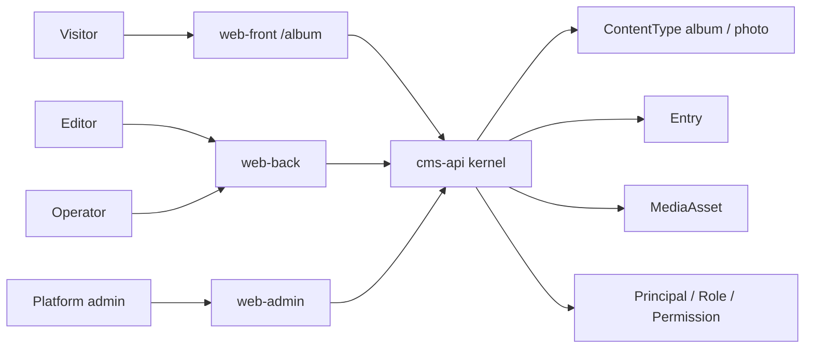
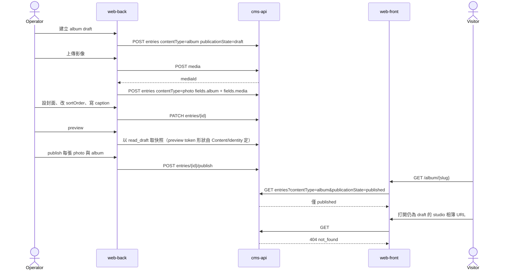

# Demo pack — 個人相簿（album）

- 狀態：Draft v0.1
- 日期：2026-09-05
- 車道：Demos（demo pack owner）
- 權威檔：本檔 `docs/specs/demo-album.md`
- 對齊總綱：`docs/sdd/00-overview.md`（只讀，切面與技術棧 **Decided**）
- 證據規則：本 pack 的類型、欄位、種子、畫面、happy path 為 **Proposed**（合成窗口可改）。跨車道邊預設 **Open**。只有總綱已寫死的三面分離、kernel 原語名稱、技術棧，才在本檔標 **Decided**。
- 本輪只寫規格。不寫應用程式碼、不改總綱、不擁有 kernel / surface 權威。

---

## 1. Executive summary

個人相簿是 **kernel 可複用** 的第一個證明：同一套 `ContentType` / `Entry` / `MediaAsset` / RBAC / 三個操作面，就能做出「公開陳列 + 內部上傳」，而不是再做一個相簿站。

| 層 | 這個 pack 給它什麼 |
| --- | --- |
| Kernel | 不新增原語。只登錄 `album`、`photo` 兩個內容類型，用既有 `ref`、`media-ref`、`int` 表達「有序相片列表 + 封面」。禁止 `album` 表或 `/albums` 專用 API。 |
| 操作面 | Front 只渲染已發布相簿/相片；Back 負責上傳、排序、caption、封面、preview、提交發布；Admin 只管類型啟停、使用者、儲存配額、可見性預設、審計。三面不是 CSS 主題切換。 |
| Demo | 一份薄的類型包 + 權限矩陣 + 種子 + 視圖註冊。證明媒體庫是硬依賴，且草稿絕不能出現在 Front。 |

對齊對象是「相簿有序、有說明、有封面」的能力，不是 Instagram：沒有追蹤、讚、限時動態、留言、人臉。

---

## 2. Scope / non-goals / 路徑所有權

### 2.1 In scope（本 pack v1）

- 內容類型 `album`、`photo` 的欄位、必填、關聯、發布規則。
- 種子資料形狀（username / 角色 / 樣本 entry；**不含明文密碼**）。
- 角色映射到總綱 `anonymous | member | editor | operator | admin`。
- Front / Back / Admin 各 3–6 個代表畫面（視圖註冊，不擁有骨架路由權威）。
- 一條 API 級 happy path、一條權限失敗 path。
- 與 clinic / projects 共享的 kernel 能力清單，以及本 pack 的 **kernel gap**。

### 2.2 Non-goals（明確不做）

- 人臉辨識、物件偵測、自動標籤、智慧相簿。
- Instagram / 社群：追蹤、讚、留言、限時動態、私訊、探索演算法。
- 多攝影者協作工作流、客戶端選片、外發審核。
- RAW 沖洗、濾鏡市場、浮水印商用授權、付費圖庫。
- 完整 EXIF 展示與編輯（**Open**，v1 不做；見 §11）。
- 獨立 bounded context：不得建 `album` / `photo` 表繞過 `cms_entry`。
- 第四個操作面、或把上傳介面嵌進 Front。
- GraphQL、即時協同、通知、email campaign。

### 2.3 路徑所有權

| 路徑 | 權限 |
| --- | --- |
| `docs/specs/demo-album.md` | 本車道擁有 |
| `docs/specs/demo-petclinic.md`、`docs/specs/demo-projects.md` | 同車道、分檔；不得合併 |
| `docs/specs/kernel-*.md`、`docs/specs/surface-*.md` | 只讀引用，不改 |
| `docs/sdd/00-overview.md` | 只讀 |
| `apps/`、`services/`、`packages/` | 本輪禁止 |

Front / Back / Admin 的路由樹、OpenAPI 路徑、session/CORS 分別由對應車道擁有。本檔提出 **Proposed** 視圖與資源用法，對端仍可能否決。

---

## 3. 資訊架構與資料模型

### 3.1 內容類型與欄位

假設 Content 車道 v1 欄位最小集為：`string`、`markdown`、`ref`、`media-ref`、`datetime`、`enum`、`int`（Content prompt 所列；本檔 **Open** 直到 `kernel-content.md` 定案）。不夠的能力標 kernel gap，不私自發明 field type。

#### `album`

| 欄位 key | 類型 | 必填 | 說明 |
| --- | --- | --- | --- |
| `title` | string | 是 | 顯示名。列表與 `<title>` 用。 |
| `slug` | string | 是 | URL 段。同類型唯一。**Open**：kernel 是否有獨立 slug 型別 / 唯一約束。 |
| `description` | markdown | 否 | 相簿說明。Front 渲染為唯讀。 |
| `cover` | media-ref | 否 | 封面。指向 `MediaAsset`，不是 photo entry。Back 可「從某張 photo 設封面」（複製該 photo 的 media id）。 |
| `visibility` | enum `public \| unlisted` | 是 | 預設 `public`。`unlisted` = 已 publish 但不出現在索引；知道 slug 才看得到。這是**欄位**，不是 publication state。 |
| `sortMode` | enum `manual \| captured_at` | 否 | 預設 `manual`。v1 實際排序仍以 photo.`sortOrder` 為準；`captured_at` 為 **Proposed**，依賴 `takenAt`。 |

不把「相片 id 有序列表」做成 album 上的 list-of-ref：最小集沒有有序 collection。改由 photo.`album` + photo.`sortOrder` 反查。若 Content 後來提供有序 `ref[]`，合成窗口可改，本檔不擋。

#### `photo`

| 欄位 key | 類型 | 必填 | 說明 |
| --- | --- | --- | --- |
| `album` | ref → `album` | 是 | 所屬相簿。沒有相簿的 photo 不合法。 |
| `media` | media-ref | 是 | 影像本體。上傳走 Media API，本類型只存 id。 |
| `caption` | string | 否 | 短說明。不是 markdown、不是留言串。 |
| `sortOrder` | int | 是 | 相簿內順序。允許間隔（10, 20, 30）以便插入。同 album 內不必連續，但 Back 排序 UI 必須能重寫。 |
| `takenAt` | datetime | 否 | 拍攝時間。v1 手填或留空。從 EXIF 自動填為 **Open**。 |

沒有 `alt` 獨立欄：v1 用 `caption`，空則 Front 用檔名 / 「photo」。無 tags、無 GPS、無人臉框。

### 3.2 關聯與刪除

```text
album 1 ──< photo.album
photo.media ──> MediaAsset
album.cover ──> MediaAsset
```

| 規則 | 證據 | 說明 |
| --- | --- | --- |
| 刪 album | **Proposed** | 預設 **restrict**：仍有未軟刪 photo 時不可軟刪 album。不 cascade 硬刪媒體。 |
| 軟刪 photo | **Proposed** | 從該相簿牆消失；不自動硬刪 `MediaAsset`（Media 擁有軟刪）。 |
| 發布連動 | **Proposed** | kernel **不**提供 cascade publish。Back happy path 依序 publish 各 photo 再 publish album（或相反，但 Front 牆只列 published photo）。 |
| 封面漂移 | **Proposed** | 允許 `cover` 指向未掛在任何 photo 的媒體；Back 不強制。 |

級聯策略對端（Content）仍可能否決，故跨邊 **Open**。

### 3.3 發布規則（套用 kernel 狀態機，不另造）

總綱狀態機 **Decided**：`draft → published → draft`（unpublish）、`* → archived`、`archived → draft`。

| 類型 | Front anonymous / member | Back editor / operator | 備註 |
| --- | --- | --- | --- |
| `album` | 只讀 `published`。索引再過濾 `visibility=public`。 | 權限內可讀寫 draft/published。 | unlisted + published：詳情可讀、列表不可見。 |
| `photo` | 只讀 `published`，且父 album 必須 `published`。父未發布則 photo 詳情 **404**。 | 可編 draft。 | 避免「相簿 404 但直連 photo 還在」。 |

Revision：每次 publish 留快照，v1 保留最近 N 版（N 由 Content 定）。相簿 demo 用它證明「改 caption 再發布」可回溯，不自建版本表。

### 3.4 Context



Kernel 不知道「相簿」。Front 的 lightbox、Back 的排序、Admin 的配額都是對通用原語的視圖。

### 3.5 Sequence — 草稿上傳到公開牆



---

## 4. 種子資料形狀

密碼不得進 Git。文件只列 username 與角色；密碼來自啟動環境變數或一次性生成（Identity 擁有規則，本檔 **Open** 對齊）。

### 4.1 帳號（Proposed usernames）

| username | 角色 | 用途 |
| --- | --- | --- |
| `album.editor` | editor | 可建草稿、上傳、preview；**不能** publish |
| `album.operator` | operator | 相簿作業全套含 publish / unpublish |
| `admin` | admin | 平台治理；可進 Back 但不當日常上傳帳 |

`member` 在本 pack **極窄**：與 anonymous 相同，只讀 published。個人相簿不是社群，不設「每個訪客一個相簿」。

### 4.2 內容種子

| contentType | slug / 識別 | publicationState | 重點欄位 |
| --- | --- | --- | --- |
| album | `coast-light-2026` | published | title `Coast Light 2026`，visibility `public`，有 cover |
| album | `private-studio` | draft | title `Studio (unpublished)`，visibility `public`（仍因 draft 不出現在 Front） |
| album | `unlisted-proof` | published | visibility `unlisted`，證明索引隱藏、直連可讀 |
| photo × 6 | 掛 `coast-light-2026` | published | sortOrder 10..60，至少 3 張有 caption |
| photo × 2 | 掛 `private-studio` | draft | Front 任何路徑都不可見 |

媒體種子：對應檔案由 Media 車道的 fixture / 本機磁碟種子提供。本 pack 只要求每張 photo 有合法 media-ref，封面指向其中一個已發布 media。

### 4.3 視圖註冊（Proposed，Front/Back/Admin 可改路徑）

Pack id：`demo.album`。

| viewId | 面 | 資料 |
| --- | --- | --- |
| `demo.album.front.list` | Front | published + public albums |
| `demo.album.front.detail` | Front | album + ordered published photos |
| `demo.album.front.photo` | Front | 單張 + prev/next |
| `demo.album.back.albums` | Back | 各 state 列表 |
| `demo.album.back.albumEditor` | Back | 欄位 + 排序 + 封面 |
| `demo.album.back.photoEditor` | Back | caption / sortOrder / media |
| `demo.album.admin.quota` | Admin | 引用 Media 配額設定，不是獨立服務 |

---

## 5. 權限矩陣

對齊總綱 action：**Decided** 名稱為 `read_published`、`read_draft`、`create`、`update`、`publish`、`unpublish`、`delete`、`manage_media`、`manage_types`、`manage_principals`、`read_audit`。本 pack **不**新增 action。Preview 用 `read_draft` + preview token（形狀 **Open** / Content+Identity）。

權限是 `(principal, action, contentType, optional predicate)`。

| 角色 | album | photo | media | 系統 |
| --- | --- | --- | --- | --- |
| anonymous | `read_published` | `read_published`（且父 album published） | 讀「被至少一個 published、且呼叫者可讀的 entry 參照」的位元組 | 無 Back / Admin |
| member | 同 anonymous | 同 anonymous | 同 anonymous | 無上傳 |
| editor | `read_published`、`read_draft`、`create`、`update`、`delete` | 同左 | `manage_media` | 無 `publish` / `unpublish`；無 `manage_types` |
| operator | editor 全部 + `publish` + `unpublish` | 同左 | `manage_media` | 無治理 action |
| admin | 可緊急覆寫所有 entry action，但 UI 不把相簿編輯當首頁 | 同左 | 配額、硬刪（Media+Audit） | `manage_types`、`manage_principals`、`read_audit` |

predicate：**Proposed** v1 本 pack 不做「只編自己建的相簿」。editor/operator 看到整個 album 類型。個人相簿是單租戶證明，不是多攝影者 ACL。若 Identity 堅持 owner predicate，標合成議題，不在本 pack 發明第四套權限引擎。

Front 查詢層必須強制 `publicationState=published`（總綱 **Decided**）。未授權者看不到 draft 欄位；bundle 不得依賴 draft-only 欄位（Front 擁有如何保證，本檔只要求驗收）。

---

## 6. 三面代表畫面

路徑為 **Proposed**，權威在 `surface-front.md` / `surface-back.md` / `surface-admin.md`。Front 總入口建議 `/album`（Front prompt 的 `/` demo 選擇器之下）。

### 6.1 Front office（5）

| # | 畫面 | 目的 | 空狀態 / 失敗 |
| --- | --- | --- | --- |
| 1 | 相簿列表 | 訪客看 `published` + `visibility=public` 的封面卡 | 無相簿：空狀態「還沒有公開相簿」，不是後台上傳鈕 |
| 2 | 相片牆 | 有序縮圖、caption 截斷、封面 hero | 相簿 published 但 0 張 published photo：空牆 + 說明 |
| 3 | 單張頁 | 大圖、caption、上一張/下一張 | 非法 id：404 |
| 4 | 未發布 URL | 證明草稿隔離 | `private-studio` → **404**（藏存在，Content 代表流程） |
| 5 | Unlisted 直連 | 證明 visibility 欄位 | 列表沒有 `unlisted-proof`；知 slug 可打開 |

不做：Front 上傳、喜歡、分享面板、EXIF 地圖。

### 6.2 Back office（6）

| # | 畫面 | 目的 | 權限失敗 |
| --- | --- | --- | --- |
| 1 | 相簿列表 | 篩 publication state、title contains | 未登入 401；無任何 album action 則整頁不可進 |
| 2 | 相簿編輯 | schema 驅動：title/slug/description/visibility/cover | 無 `update` 則唯讀 |
| 3 | 相片排序 | 拖曳或數字改 `sortOrder`；寫入仍 PATCH photo entry | 不是專用 reorder API（沒有就 **kernel gap**，見 §11） |
| 4 | 上傳 / 媒體選擇器 | `POST media` 再掛 media-ref | 無 `manage_media` → 選擇器 403 |
| 5 | 單張 caption | 編 caption、takenAt、抽換 media | 同 update |
| 6 | Preview + 提交發布 | Preview 不進 Front origin；publish 按鈕 | editor 看見 publish 但送出 **403**（失敗 path） |

Back **沒有**「內容類型」「角色矩陣」「儲存配額」選單（那些在 Admin）。

### 6.3 Admin center（5）

| # | 畫面 | 目的 | 不做 |
| --- | --- | --- | --- |
| 1 | 類型登錄 | 啟停 `album` / `photo` | 日常貼 caption |
| 2 | 使用者與角色 | 指派 editor / operator | 模擬登入 impersonation（v1 建議不做，Identity **Open**） |
| 3 | 儲存配額 | 引用 Media 配額；預設數字由 Media 定 | 自研物件儲存 UI |
| 4 | 可見性預設 | 新 album 的 `visibility` 預設值（demo 設定，應盡量少） | 做一套獨立設定服務 |
| 5 | 審計 | 誰 publish / unpublish / 硬刪 | 不在這裡排相片 |

---

## 7. API / UI 契約草案

OpenAPI 權威在 API 車道；下列資源名 **Proposed**。前端不得發明未記載欄位。

### 7.1 使用的 kernel 資源（不新增）

| 方法 | 資源（示意） | 誰呼叫 | 本 pack 用法 |
| --- | --- | --- | --- |
| `GET` | `/entries?contentType=album&publicationState=published` | Front | 列表；再於欄位過濾 `visibility=public`（欄位過濾能力 **Open** / Content） |
| `GET` | `/entries?contentType=photo&fields.album={id}&publicationState=published&sort=sortOrder` | Front | 牆。ref 過濾與 sort **Open** / Content |
| `GET` | `/entries/{id}` | 三面 | Front 若非 published → 404 |
| `POST` | `/entries` | Back | body：`contentType` + `fields` |
| `PATCH` | `/entries/{id}` | Back | 部分欄位；不可直接把 state 改成 published |
| `POST` | `/entries/{id}/publish` 等 | Back | 狀態轉換；非法 409 |
| `POST` | `/media` | Back | 先拿 media id，再寫 photo |
| `GET` | 媒體位元組 URL | Front | 僅當參照它的 photo/album 對呼叫者可讀（Media **Open**） |

Entry 示意（Proposed）：

```json
{
  "id": "uuid",
  "contentType": "album",
  "publicationState": "published",
  "fields": {
    "title": "Coast Light 2026",
    "slug": "coast-light-2026",
    "description": "Sea and concrete.",
    "cover": { "mediaId": "uuid" },
    "visibility": "public",
    "sortMode": "manual"
  }
}
```

`media-ref` 與 `ref` 的 JSON 形狀由 Content/Media 定；本 pack 只要求能存 id。

### 7.2 錯誤

| 情境 | HTTP | `code` | 誰定案 |
| --- | --- | --- | --- |
| Front 讀 draft / 未發布 | 404 | `not_found` | 跟 Content 代表流程；Identity 若反對用 404 藏資源，合成處理（**Open**） |
| 已登入但缺 action | 403 | `forbidden` | 需帶 `action`、`contentType` |
| Back 未登入 | 401 | `unauthenticated` | Identity |
| 非法狀態轉換 | 409 | `illegal_state` | Content |
| 缺必填 / 壞 ref | 422 | `validation_failed` | Content |
| 配額用盡 | 409 或 422 | `quota_exceeded` | Media **Open** |

### 7.3 UI 契約要點（消費 shadcn，不自研 CSS）

- Front：Card 列表、圖片牆、Dialog 或頁面級單張、Button 導航。
- Back：schema 驅動表單 + 少量自訂「排序」視圖。寫入仍走 entry API。
- 不得為相簿引入第二套 UI kit。

---

## 8. 對三個 demo 的含義（證明可複用）

| Kernel 能力 | 本 pack | Pet clinic | 專案管理 |
| --- | --- | --- | --- |
| 內容類型登錄 | `album` `photo` | `owner` `pet` `vet` `visit`（+ `clinic_profile`） | `project` `issue` `milestone` |
| 通用 entry + 狀態機 | 公開陳列靠 published | 作業紀錄用同一狀態機，但 anonymous **沒有** owner 的 `read_published` | issue **永不**給 anonymous 讀 |
| `ref` | photo → album | pet → owner，visit → pet/vet | issue/milestone → project |
| `media-ref` | **硬依賴**（每張相片） | vet/pet 頭像、診所 hero | 專案封面（輕依賴） |
| `enum` + `int` | visibility、sortOrder | petType、visitKind | issue.status（看板欄，**不是** publication state） |
| RBAC 同一套 action | editor 無 publish | operator 看診；member 可選入口 | operator 看板；Front 只讀里程碑 |
| 三面骨架 | 列表/牆/單張 vs 上傳 vs 配額 | 介紹/獸醫 vs 病歷作業 vs 診所設定 | 公開進度 vs 看板 vs 成員/可見性 |
| Preview / audit / 軟刪 | 用 kernel | 用 kernel | 用 kernel |

本 pack **不**與另外兩個共享類型名稱。沒有 `album` 出現在 clinic。可複用的是 kernel，不是「相簿外掛」。

---

## 9. 跨車道邊表

| 邊 | 本檔登記 | 證據 | 對端仍可能否決 |
| --- | --- | --- | --- |
| Content | 類型名 `album` `photo`；欄位表；反查排序；無 cascade publish | 類型名 **Proposed**；狀態機 **Decided**（總綱） | 欄位 JSON 形狀、slug 唯一、查詢參數 |
| Content | Front 未發布 → 404 | 跟 Content 代表流程 | Identity 錯誤碼哲學 |
| Identity | 不新增 action；editor 無 publish；member=anonymous | **Proposed** 映射 | session、predicate、種子密碼機制 |
| Media | 先 `POST /media` 再寫 media-ref；未發布相簿的位元組不可猜 URL | 相簿硬依賴 | 衍生尺寸、公開傳遞、410 vs 404 |
| Front | 視圖：列表、牆、單張；無上傳 | **Proposed** | 路由樹、SEO、`/` 選擇器 |
| Back | 自訂視圖僅「排序」；寫入走 entry | **Proposed** | 通用 editor 深度、preview token |
| Admin | 配額與可見性預設；不當作業面 | **Proposed** | 類型熱新增 vs 種子+啟停 |
| 其他 demo | 共享 kernel 原語，不共享類型 | 本車道 | 合成窗口對齊命名 |

---

## 10. 驗收條件

將來應對到契約測試 / API 測試，不依賴人工點擊。UI e2e 可後補。

### 10.1 Happy path

**Given** 種子已載入，`album.operator` 已登入 Back，且 Media 上傳可用。  
**When** 其建立 `album` draft → 上傳 3 張圖並建立 3 筆 `photo`（sortOrder 10,20,30，寫 caption）→ 設 cover → preview 成功看到草稿 → 將 3 張 photo 與 album `publish`。  
**Then**

1. Front 列表出現該相簿封面與 title。
2. Front 相片牆依 sortOrder 顯示 3 張，caption 可見。
3. 單張頁可讀大圖 URL。
4. `GET` 同一 album 在 `publicationState=draft` 的舊 id 若已發布則為 published；另建未發布相簿在 Front **404**。
5. `cms_entry_revision`（或 Content 等價資源）至少為該 album 留一筆 publish 快照。
6. 全程沒有呼叫 `/albums` 這類 demo 專用 API。

### 10.2 權限失敗 path

**Given** `album.editor` 已登入 Back，對 `album` **沒有** `publish`。存在一筆屬於該 editor 的 album draft。  
**When** 其對該 entry `POST .../publish`（或 UI 送出發布）。  
**Then** API **403** `forbidden`，`action=publish`，`contentType=album`；publicationState 仍為 `draft`；Front 仍 404。  
**And** 同一時間 anonymous `GET` 該 draft id → **404**，回應不含 title/caption/media URL。

### 10.3 其他必須可測

| ID | Given / When / Then |
| --- | --- |
| A-PUB-1 | Given 僅 photo published 但父 album draft。When Front GET photo。Then 404。 |
| A-VIS-1 | Given `unlisted-proof` published。When Front 列表。Then 不含該 slug。When GET 詳情 slug。Then 200。 |
| A-MED-1 | Given draft album 的 media id。When 未授權直接打位元組 URL。Then 404 或 410（Media 定；不得 200）。 |
| A-ADM-1 | Given editor。When GET Admin 類型登錄。Then 401/403，Back 選單無「內容類型」。 |
| A-TYPE-1 | Given 資料庫。When 列出使用者資料表。Then **沒有** `album` / `photo` 實體表（只有 `cms_entry` 等系統表）。 |

---

## 11. Kernel gaps（Open）

| ID | 缺口 | 本 pack 的暫行作法 | 不得做的事 |
| --- | --- | --- | --- |
| G-ALB-1 | 有序 `ref[]` collection | `sortOrder` int + 查詢排序 | 不要為相簿加 `/albums/{id}/photos:reorder` 後門 |
| G-ALB-2 | EXIF 自動擷取 / `json` 欄位 | v1 不做；`takenAt` 手填可空 | 不要在 demo 解析 EXIF 寫進未記載欄位 |
| G-ALB-3 | 媒體可見性隨 entry 發布狀態 | 要求 Media：無任何「呼叫者可讀的 published 參照」則位元組不可匿名讀 | 不要公開靜態目錄無授權直出 |
| G-ALB-4 | 欄位級過濾（`visibility=public`） | 若 Content 列表 API 不能濾欄位，Front 不得下載全部 draft 再藏；必須後端濾 | 不要讓 Front 當授權層 |
| G-ALB-5 | slug 唯一 | 種子避開衝突；422 由 Content 定 | 不要 demo 自己建 unique index 表 |
| G-ALB-6 | singleton / 站台 About | 本 pack 不做 About 頁 | 不要另做 `page` 除非合成同意跨 pack 共用 |

---

## 12. Open questions

1. Content 是否保證 `GET entries` 可依 `ref` 與 `int` 欄位排序過濾？沒有則相片牆無法在 API 級驗收。
2. 未發布資源 Front 用 404 還是 403？本檔跟 Content 代表流程用 404，等 Identity 對齊。
3. `unlisted` 是否值得 v1 做，還是只保留 `public` + publication state？本檔 **Proposed** 保留，因能證明「欄位 ≠ 狀態機」。
4. 封面要用 `media-ref` 還是 `ref → photo`？本檔選 media-ref，避免循環（photo 又指向 album）。
5. editor 的 `delete` 是否限自己建立的 entry？本檔 v1 不限。
6. 種子影像版權與 fixture 路徑由誰放？（Media）
7. 三個 demo pack 同進程同時啟用時，Front `/` 選擇器由 Front 擁有；本 pack 只要求 `/album` 入口可註冊。

衝突時本檔停在自己的類型與種子，不改對方規格。

---

## 13. 實作波不該先做的事

1. 不要先畫 Instagram 風格 Front，再倒推類型——先登錄 `album`/`photo` 與 RBAC 測試。
2. 不要建 `AlbumEntity` / `albums` 表或 `/api/albums`。
3. 不要把上傳表單放進 `web-front`。
4. 不要做人臉、EXIF 面板、讚、留言、分享短鏈。
5. 不要為排序發明獨立 write API；先 PATCH `sortOrder`。
6. 不要把 Back 與 Admin 合成「一個後台兩個 menu」。
7. 不要在實作波開頭做主題商店、多 locale、S3 生產化。
8. 不要把本 pack 做成必須先於 clinic/projects 的特殊 kernel 分支；三個 pack 應能同一 kernel 啟停。
