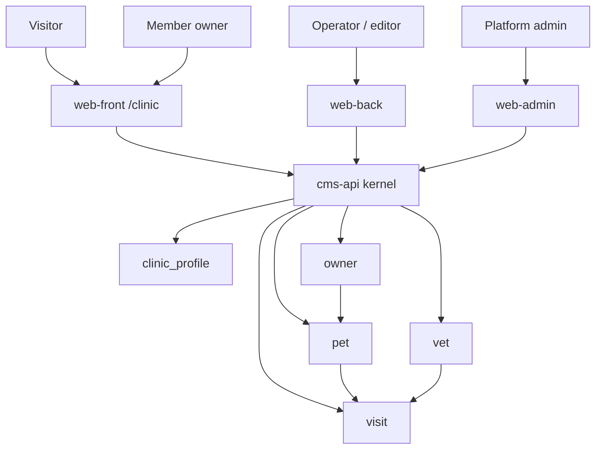
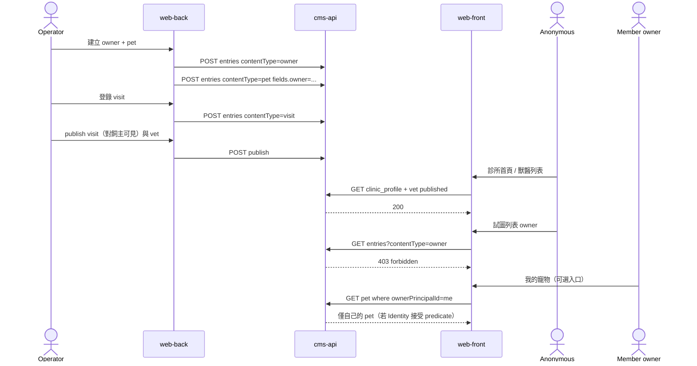

# Demo pack — Pet clinic（petclinic）

- 狀態：Draft v0.1
- 日期：2026-09-05
- 車道：Demos（demo pack owner）
- 權威檔：本檔 `docs/specs/demo-petclinic.md`
- 對齊總綱：`docs/sdd/00-overview.md`（只讀，切面與技術棧 **Decided**）
- 證據規則：本 pack 的類型、欄位、種子、畫面、流程為 **Proposed**。跨車道邊預設 **Open**。總綱凍結的三面分離與 kernel 原語為 **Decided**。
- 對齊對象：經典 Spring PetClinic 的 Owner / Pet / PetType / Vet / Visit。PetType **不是**獨立內容類型，而是 `pet.petType` enum。不是電子病歷產品。

---

## 1. Executive summary

Pet clinic 證明 kernel 能撐 **關聯實體 + 作業面大於展示面**：訪客只看診所介紹與獸醫；飼主/寵物/就診是 Back 的日常工作，不是公開 CRUD。

| 層 | 這個 pack 給它什麼 |
| --- | --- |
| Kernel | 不新增「寵物」原語。用 `ref` 表達 owner–pet–visit–vet。若通用 entry JSON 讓「某日所有就診」不可接受，標 **projection / typed read model** gap，寫入路徑仍歸 kernel。 |
| 操作面 | Front：介紹、獸醫列表、（可選）飼主看自己的預約。Back：飼主/寵物/就診 CRUD、當日行程、就診時間線。Admin：類型啟停、角色、使用者、診所簡設、審計。Admin **不是**看診台。 |
| Demo | 類型包 + 權限（anonymous 不能列出飼主）+ 種子（經典樣本名）+ 少量 Back 自訂視圖。 |

成功看起來像：換掉這些類型，三面骨架還在；失敗看起來像：為 visit 開了 `/visits` 專用後門或把 Back 做成 wp-admin 表單堆。

---

## 2. Scope / non-goals / 路徑所有權

### 2.1 In scope（本 pack v1）

- 類型：`clinic_profile`（單例介紹）、`owner`、`pet`、`vet`、`visit`。
- `petType` 為 pet 上的 enum，不做成 `pet_type` 內容類型。
- 權限矩陣：公開行銷內容 vs 作業紀錄分開授權。
- Front / Back / Admin 各 3–6 畫面。
- Happy path：作業人員登錄飼主/寵物/就診；Front 只公開獸醫與介紹。
- 權限失敗：anonymous 讀 owner/pet/visit 被拒。
- 可選 member 入口：飼主看**自己的**寵物與預約（依賴 Identity predicate；**Open**）。

### 2.2 Non-goals（明確不做）

- 電子病歷：診斷編碼、檢驗、處方、疫苗批次、過敏史時間線、附件病歷包。
- 排班最佳化、班表引擎、診間/住院、候診叫號、庫存耗材。
- 收費、保險、請款、多診所租戶。
- 遠距看診、即時訊息、通知 inbox、email campaign。
- 把 Vet 做成完整 HR（薪資、執照到期工作流）。
- 公開「全站可搜尋所有飼主」——那是作業資料，不是行銷頁。
- 獨立 `owner` / `pet` / `visit` 表或 PetClinic Spring 樣本的 JPA 實體複製。

### 2.3 路徑所有權

| 路徑 | 權限 |
| --- | --- |
| `docs/specs/demo-petclinic.md` | 本車道擁有 |
| 其他 demo 檔 | 同車道分檔，不合併 |
| kernel / surface 規格 | 只讀引用 |
| `apps/` `services/` | 本輪禁止 |

預約公開表單是 Front command 還是只讀+連 Back：Front 擁有選定。本檔 **Proposed**：v1 Front **不做**匿名公開掛號；未登入者只讀介紹/獸醫。Member 建立 `visit` draft 為可選、標 **Open**。

---

## 3. 資訊架構與資料模型

### 3.1 內容類型與欄位

欄位類型對齊 Content 最小集：`string`、`markdown`、`ref`、`media-ref`、`datetime`、`enum`、`int`（**Open** 直到 Content 定案）。沒有 `date-only`、沒有 multi-enum、沒有 `principal-ref`——缺的標 gap。

#### `clinic_profile`（pack 新增，總綱未列；**Proposed**）

Front「診所介紹」需要一塊 published 內容。不用 kernel 內建 `page`（kernel 無感頁類型）。

| 欄位 | 類型 | 必填 | 說明 |
| --- | --- | --- | --- |
| `name` | string | 是 | 診所名 |
| `slug` | string | 是 | 種子固定 `home`。v1 以「唯一 slug」模擬單例 |
| `intro` | markdown | 是 | 公開介紹 |
| `address` | string | 否 | |
| `telephone` | string | 否 | |
| `hours` | markdown | 否 | 人工寫的看診時間，**不是**班表規則引擎 |
| `hero` | media-ref | 否 | |

單例約束是 **kernel gap**（G-CLN-1）。種子只插一筆。

#### `owner`（經典 Owner）

| 欄位 | 類型 | 必填 | 說明 |
| --- | --- | --- | --- |
| `firstName` | string | 是 | |
| `lastName` | string | 是 | |
| `address` | string | 否 | |
| `city` | string | 否 | |
| `telephone` | string | 否 | 經典欄位；格式不在 v1 強校驗 |
| `email` | string | 否 | 便於種子對到 member，非通知系統 |
| `linkedPrincipalId` | string | 否 | 對到可登入飼主。型別是 string 不是 principal-ref（**gap G-CLN-2**） |

無病歷號、無身分證、無付款資料。

#### `pet`（經典 Pet；PetType 為 enum）

| 欄位 | 類型 | 必填 | 說明 |
| --- | --- | --- | --- |
| `name` | string | 是 | |
| `petType` | enum | 是 | `cat \| dog \| bird \| hamster \| lizard \| snake \| other`（經典樣本取向） |
| `birthDate` | datetime | 否 | 當日期用；date-only **Open** / Content |
| `owner` | ref → `owner` | 是 | |
| `ownerPrincipalId` | string | 否 | 從 owner 冗餘複製，供扁平 predicate（**gap G-CLN-3**） |
| `notes` | markdown | 否 | 短註，不是病歷 |
| `photo` | media-ref | 否 | |

#### `vet`（經典 Vet；Specialty 壓成單一 enum）

| 欄位 | 類型 | 必填 | 說明 |
| --- | --- | --- | --- |
| `firstName` | string | 是 | |
| `lastName` | string | 是 | |
| `specialty` | enum | 是 | `general \| radiology \| surgery \| dentistry`。多專科是 **gap G-CLN-4**（經典 many-to-many） |
| `bio` | markdown | 否 | 公開簡介 |
| `photo` | media-ref | 否 | |

「是否在職」用 publication state：unpublish 的 vet 從 Front 列表消失，Back 仍見。不另做 `active` boolean（最小集無 boolean）。

#### `visit`（經典 Visit，略增 kind / vet，仍非 EMR）

| 欄位 | 類型 | 必填 | 說明 |
| --- | --- | --- | --- |
| `pet` | ref → `pet` | 是 | |
| `owner` | ref → `owner` | 是 | 必須等於該 pet 的 owner（不變量 **gap G-CLN-5**，v1 Back 寫入時帶上） |
| `vet` | ref → `vet` | 否 | |
| `scheduledAt` | datetime | 是 | 經典 `visit.date`；可表已發生或預約時點 |
| `description` | string | 否 | 經典 description |
| `visitKind` | enum | 否 | `checkup \| vaccine \| surgery \| other`；預設 `checkup` |
| `ownerPrincipalId` | string | 否 | 同 pet，供 member predicate |

**沒有**體重序列、體溫、診斷碼、處方、附件病歷。

### 3.2 關聯與刪除

```text
clinic_profile          （單例，無子）
owner 1 ──< pet.owner
pet   1 ──< visit.pet
owner 1 ──< visit.owner   （冗餘，便於列表）
vet   1 ──< visit.vet     （可空）
```

| 規則 | 證據 | 說明 |
| --- | --- | --- |
| 刪 owner | **Proposed** | **restrict**：仍有 pet 則不可軟刪 |
| 刪 pet | **Proposed** | **restrict**：仍有 visit 則不可軟刪 |
| 刪 vet | **Proposed** | 允許軟刪；visit.vet 變成懸空 ref，Back 顯示「原獸醫已封存」 |
| 級聯硬刪 | **Decided** 不做 | 硬刪只在 Admin 且寫 audit（總綱） |

### 3.3 發布規則（同一狀態機，不同授權）

| 類型 | anonymous Front | member Front | Back operator |
| --- | --- | --- | --- |
| `clinic_profile` | `read_published` | 同左 | 編輯介紹；editor 也可 |
| `vet` | `read_published` | 同左 | CRUD + publish |
| `owner` | **無任何 read** | 可選：predicate 讀自己 | 全套作業 |
| `pet` | **無** | 可選：自己的 | 全套 |
| `visit` | **無** | 可選：自己的 published visit =「已確認給飼主看的預約/紀錄」 | 全套；publish 的語意是「對連結飼主可見」，不是「上公開首頁」 |

這是本 pack 對 kernel 的壓力測試：`published` ≠ `全世界可讀`。可見性 = 狀態機 **且** RBAC。anonymous 沒有 `read_published` on `owner|pet|visit`，因此即使誤 publish 一筆 owner，公開 API 仍必須 403（或空集合，不得把資料漏出）。

### 3.4 Context



### 3.5 Sequence — 作業登錄 vs 公開面



---

## 4. 種子資料形狀

密碼不進 Git。Username + 角色 only。

### 4.1 帳號（Proposed）

| username | 角色 | 用途 |
| --- | --- | --- |
| `clinic.editor` | editor | 診所介紹、vet 文案、preview；**無** owner/pet/visit 的作業全套（見矩陣） |
| `clinic.operator` | operator | 飼主/寵物/就診/行程全套 |
| `clinic.owner` | member | 連結到種子飼主 George Franklin；可選 Front 入口 |
| `admin` | admin | 治理 |

### 4.2 內容種子（經典人名，非 GPL 原始碼）

| 類型 | 樣本 | state |
| --- | --- | --- |
| clinic_profile | slug `home`，name `Cedar Pet Clinic` | published |
| vet | James Carter / radiology；Helen Leary / dentistry；Linda Douglas / surgery | 前兩 published，Douglas draft（證明 Front 不見 draft vet） |
| owner | George Franklin（city Madison，telephone 6085551023，linkedPrincipalId → `clinic.owner`）；Betty Davis；Eduardo Rodriquez | published（對 Front 仍不可讀） |
| pet | Leo cat → Franklin；Basil hamster → Davis；Jewel dog → Rodriquez | published |
| visit | Leo + Carter，過去一筆 description `rabies shot`；Leo 一筆未來 checkup | 一 published、一 draft |

媒體：vet/pet 可無圖；profile 可有可無 hero。不阻塞 API happy path。

### 4.3 視圖註冊（Proposed）

Pack id：`demo.petclinic`。

| viewId | 面 |
| --- | --- |
| `demo.petclinic.front.home` | Front 介紹 |
| `demo.petclinic.front.vets` | Front 獸醫列表 |
| `demo.petclinic.front.vetDetail` | Front 獸醫詳情 |
| `demo.petclinic.front.myPets` | Front member 可選 |
| `demo.petclinic.back.owners` | Back 搜尋飼主 |
| `demo.petclinic.back.ownerEditor` | Back 飼主 + 寵物列表 |
| `demo.petclinic.back.petEditor` | Back 寵物 |
| `demo.petclinic.back.visitTimeline` | Back 自訂視圖（仍 GET entries） |
| `demo.petclinic.back.daySchedule` | Back 自訂視圖：按 `scheduledAt` 日過濾 |
| `demo.petclinic.admin.settings` | Admin 啟停類型 / 簡設 |

---

## 5. 權限矩陣

不新增 action。Preview = `read_draft`。

| 角色 | clinic_profile | vet | owner | pet | visit | media | 系統 |
| --- | --- | --- | --- | --- | --- | --- | --- |
| anonymous | `read_published` | `read_published` | — | — | — | 只讀 published 行銷圖（profile/vet） | — |
| member | 同 anonymous | 同 anonymous | **可選** `read_published` predicate `linkedPrincipalId=me` | **可選** `read_published` predicate `ownerPrincipalId=me` | **可選** `read_published` 同 predicate；**可選** `create` 預約 draft（**Open**） | 讀自己 pet 圖（若授權） | 無 Back |
| editor | `read_draft` `create` `update` `publish` `unpublish` | 同左 | — | — | — | `manage_media`（行銷圖） | 無治理 |
| operator | `read_published`（可不編介紹） | 全套 CRUD + publish | 全套 CRUD + publish | 全套 | 全套 | `manage_media` | 無 `manage_types` |
| admin | 緊急覆寫 | 同左 | 同左 | 同左 | 同左 | 配額/硬刪 | `manage_types` `manage_principals` `read_audit` |

**Proposed** 把「行銷類型」與「作業類型」拆給 editor vs operator，證明同一 RBAC 引擎可按 `contentType` 切開，而不需要第四個操作面。

Member 入口整列可在 Identity 否決後降級為 v1 不做；屆時 member 列改為與 anonymous 相同，驗收 10.3 C-MEM-* 標 skip。**Happy path 10.1 不依賴 member。**

---

## 6. 三面代表畫面

路徑 **Proposed**。建議 Front 入口 `/clinic`。

### 6.1 Front office（5）

| # | 畫面 | 誰 | 失敗 / 空 |
| --- | --- | --- | --- |
| 1 | 診所首頁 | anonymous | 無 published profile：空狀態，不露 Back 連結當主 CTA |
| 2 | 獸醫列表 | anonymous | 只 published；Douglas draft 不出現 |
| 3 | 獸醫詳情 | anonymous | draft / 未知 id：404 |
| 4 | 未授權作業 URL | anonymous | `/clinic/owners` 若誤註冊 → 403/404，且 API 無資料 |
| 5 | 我的寵物 / 預約 | member 可選 | 未登入 401；看別人的 pet **403** |

不做：匿名公開掛號大表單、線上付費、症狀 checker。

### 6.2 Back office（6）

| # | 畫面 | 目的 | 自訂視圖？ |
| --- | --- | --- | --- |
| 1 | 飼主列表 | title/姓名 contains、城市篩選（欄位過濾 **Open**） | 否，通用列表 |
| 2 | 飼主編輯 + 寵物一覽 | 經典 find-owner 後的頁 | 組合視圖，寫入仍 entry API |
| 3 | 寵物編輯 | petType enum、owner ref 選擇器 | schema 驅動 |
| 4 | 就診時間線 | 某 pet 的 visit 依 `scheduledAt` | **是**；query 通用 entries |
| 5 | 當日行程 | 某日所有 visit | **是**；若 JSON 查詢不可接受 → gap G-CLN-6 projection |
| 6 | 新 visit 表單 | 選 pet（帶出 owner）、選 vet、時間、description | schema 驅動 |

Back 選單 **沒有** 內容類型登錄、權限矩陣、系統儲存。Editor 登入 Back 只看到 profile/vet，看不到飼主模組（無 action 則不渲染）。

### 6.3 Admin center（5）

| # | 畫面 | 目的 | 不做 |
| --- | --- | --- | --- |
| 1 | 類型啟停 | owner/pet/vet/visit/clinic_profile | 填 visit description |
| 2 | 角色矩陣 | 把 operator 只授作業類型 | 日常看診 |
| 3 | 使用者 | 建 `clinic.operator`、把 member 對到飼主（對帳規則 Identity） | impersonation |
| 4 | 診所簡設 | 若不只 profile：預約窗口說明文字。班表**規則引擎**不做 | 最佳化排班 |
| 5 | 審計 | 誰建了 visit、誰 publish vet | 把審計當病歷 |

總綱 Admin「班表規則」在本 pack 降級為 hours markdown + 不做引擎，並寫入 non-goals，避免範圍膨脹。

---

## 7. API / UI 契約草案

不新增 demo 資源。示意路徑 **Proposed**。

### 7.1 讀寫

| 呼叫者 | 操作 | 期望 |
| --- | --- | --- |
| Front anon | `GET /entries?contentType=vet&publicationState=published` | 200 列表，不含 draft |
| Front anon | `GET /entries?contentType=owner` | **403** `forbidden`（即使部分 owner published） |
| Front anon | `GET /entries/{ownerId}` | 403 或 404；**不得 200** |
| Back operator | `POST /entries` `contentType=visit` | 201 draft |
| Back operator | `POST /entries/{id}/publish` on visit | 200；Front anon 仍不能讀 |
| Front member | `GET /entries?contentType=pet&fields.ownerPrincipalId={me}` | 僅自己的（若 predicate 落地） |
| Back editor | `POST publish` on owner | **403**（無 action） |

Visit 示意：

```json
{
  "contentType": "visit",
  "publicationState": "published",
  "fields": {
    "pet": { "entryId": "uuid" },
    "owner": { "entryId": "uuid" },
    "vet": { "entryId": "uuid" },
    "scheduledAt": "2026-09-12T09:00:00Z",
    "description": "rabies shot",
    "visitKind": "vaccine",
    "ownerPrincipalId": "uuid-of-clinic.owner"
  }
}
```

### 7.2 錯誤

| 情境 | HTTP | code |
| --- | --- | --- |
| 未登入打 Back | 401 | `unauthenticated` |
| anonymous 讀 owner | 403 | `forbidden`（作業類型不藏成「沒有這個功能的 200 空陣列夾帶欄位」） |
| member 讀他人 pet | 403 | `forbidden` |
| Front 讀 draft vet | 404 | `not_found` |
| pet 無 owner ref | 422 | `validation_failed` |
| 軟刪仍有子 pet 的 owner | 409 | `constraint_conflict`（名稱 **Open** / Content） |

列表空與 403 的區別：**有權限但零筆**才 200 `[]`。anonymous 對 owner 是無權限，不是零筆。

### 7.3 UI

- shadcn：Card、Table/列表、Select（enum、ref picker）、Dialog、Button、Textarea。
- 時間線與當日行程是 Back **自訂視圖**，不是新 app。
- 寫入禁止走自訂 `/clinic/visits`。

---

## 8. 對三個 demo 的含義（證明可複用）

| Kernel 能力 | 相簿 | **本 pack** | 專案 |
| --- | --- | --- | --- |
| 類型登錄 | album/photo | owner/pet/vet/visit/profile | project/issue/milestone |
| `ref` | photo→album | **主證明**：pet→owner，visit→pet/vet | issue→project |
| 狀態機 + RBAC 正交 | draft 圖不上 Front | **published owner 仍不給 anonymous** | published 只給專案/里程碑，issue 永不給 anon |
| media-ref | 硬依賴 | 輕：頭像/hero | 輕：封面 |
| enum | visibility | petType、specialty、visitKind | issue.status 看板 |
| Back 自訂視圖 | 相片排序 | 時間線、當日行程 | 看板 |
| member predicate | 不用 | 可選飼主入口 | v1 不用（專案成員 = operator） |

Kernel 無感「寵物」。Clinic 若需要 kernel 沒有的原語，只准標 gap，不准開 `/owners:find` 這種只服務本 demo 的 API。

---

## 9. 跨車道邊表

| 邊 | 本檔登記 | 證據 | 對端可否決 |
| --- | --- | --- | --- |
| Content | 五個類型與欄位；PetType 為 enum；restrict 刪除；visit 不變量 | **Proposed** | JSON vs 強型別表、projection |
| Content | 關聯查詢不足時要 **typed read model**，寫入仍 kernel | 總綱例外條款 | 何時做 projection |
| Identity | 不新增 action；editor≠operator 按類型切；member predicate 可選 | **Proposed** | 「飼主入口」做不做、predicate 語法 |
| Identity | anonymous 讀 owner → 403 | **Proposed** | 與 404 藏資源政策 |
| Media | 可選頭像；作業媒體不可匿名讀 | 同相簿可見性規則 | MIME、衍生圖 |
| Front | `/clinic` 介紹+獸醫；公開掛號 v1 不做 | **Proposed** | 路由、SEO、公開表單決策 |
| Back | 兩個自訂視圖；寫入 entry | **Proposed** | 通用 editor 深度 |
| Admin | 類型啟停+角色；班表引擎不做 | **Proposed** | 熱新增欄位 |
| 其他 demo | 只共享 kernel | | 命名衝突（`owner` 過泛） |

`owner` 類型名過泛是合成議題：可改 `clinic_owner` 而不改 kernel。本檔跟總綱用 `owner`，標 **Open**。

---

## 10. 驗收條件

### 10.1 Happy path（不依賴 member 入口）

**Given** 種子可載入，`clinic.operator` 登入 Back。  
**When** 建立 owner `Maria Santos` → 建立 pet `Nala` `petType=cat` 指向該 owner → 建立 visit（description `annual checkup`，vet 指向已 published 的 Carter）→ publish 該 visit。  
**Then**

1. Back 飼主詳情看得到 Nala 與一筆 visit。
2. Front `/clinic` 與獸醫列表仍只顯示 clinic_profile 與 published vets。
3. anonymous `GET entries?contentType=owner` → **403**，body 不含 Maria。
4. anonymous `GET entries?contentType=visit` → **403**。
5. 無 `owners` / `pets` / `visits` 專用表或專用 write API。
6. 同一 kernel 仍能同時載入 album/projects 類型（啟停由 Admin；本測至少類型登錄不衝突）。

### 10.2 權限失敗 path

**Given** anonymous、種子含 George Franklin（published owner）與 draft vet Linda Douglas。  
**When** Front 或直接 API：`GET` Franklin 的 entry id，以及 `GET` Douglas 的 entry id。  
**Then** Franklin → **403**（或 Identity 規定的等價「無權且不漏欄位」）；Douglas → **404** `not_found`。回應不得含 telephone、pet 列表、bio。  
**And** `clinic.editor` `POST publish` 一筆 visit → **403** `action=publish` 或無 visit 的 publish（矩陣規定 editor 無 visit action）。

### 10.3 其他

| ID | Given / When / Then |
| --- | --- |
| C-VET-1 | Given Douglas draft。When Front 獸醫列表。Then 不含 Linda Douglas。 |
| C-DEL-1 | Given owner 仍有 pet。When 軟刪 owner。Then 409 constraint。 |
| C-ED-1 | Given editor。When GET Back 飼主列表 API。Then 403。 |
| C-MEM-1 | Given `clinic.owner` 登入 Front（可選）。When GET 自己的 pet。Then 200 含 Leo。When GET Jewel。Then 403。Identity 否決入口則 skip。 |
| C-PROJ-1 | Given 當日行程視圖。When operator 打開。Then 只經 entries 查詢或 Content 記載的 projection，無 `/clinic/schedule` 後門。 |

---

## 11. Kernel gaps（Open）

| ID | 缺口 | 暫行作法 | 禁止 |
| --- | --- | --- | --- |
| G-CLN-1 | singleton 類型 | slug=`home` 種子一筆 | 不要 `clinic_profile` 表 |
| G-CLN-2 | `principal-ref` 欄位 | `linkedPrincipalId` string | 不要 demo 直連 `cms_principal` FK 表 |
| G-CLN-3 | 關聯行走 predicate（pet.owner.linkedPrincipalId） | 冗餘 `ownerPrincipalId` | 不要信任瀏覽器自己寫的 principal id 當授權（寫入必須 server 校驗，**Open** / Content） |
| G-CLN-4 | multi-enum specialties | 單一 `specialty` | 不要複製 PetClinic `vet_specialties` join 表當平行模型 |
| G-CLN-5 | 跨欄位不變量 visit.owner == pet.owner | Back 同時寫入；kernel 校驗 **Open** | 不要在 demo 服務層繞過 entry |
| G-CLN-6 | 按日、按 owner 的關聯查詢效能 | 先通用過濾；不夠則 Content 寫 projection | 不要 clinic 專用 read API 卻用另一套 write |
| G-CLN-7 | date vs datetime | datetime | 不要第三套時間型別只為 clinic |

---

## 12. Open questions

1. Identity：飼主看自己的寵物是 member predicate，還是不做？本檔可選、happy path 不依賴。
2. 冗餘 `ownerPrincipalId` 由誰在寫入時填且防偽造？（必須 kernel / Content，不能只靠 React。）
3. `owner` 是否改名 `clinic_owner` 以免未來 generic owner？
4. Front 公開預約 command 是否要 `create` on visit for anonymous？本檔 v1 **否**。
5. visit 的 publish 語意是否讓作業人員困惑？備選：visit 永遠 draft、member 改授 `read_draft` predicate——更怪。維持 publish=對飼主可見。
6. Content 若選「每類型強型別表」，仍必須由 registry 生成，不可手寫 `Vet.java` 當 demo 邊界。
7. Admin「班表規則」與本 pack non-goals 衝突：合成應把總綱該句解釋成「可有設定、無最佳化」。

---

## 13. 實作波不該先做的事

1. 不要 fork Spring PetClinic 的 schema / UI 當本系統。
2. 不要先做病歷、處方、排班最佳化。
3. 不要為 clinic 開獨立微服務。
4. 不要把飼主 CRUD 放進 Front 或 Admin。
5. 不要用 publication state 假裝 RBAC（把 owner 留 draft 當「安全」——匿名列表仍須 403）。
6. 不要把 Back 與 Admin 合成一個後台。
7. 不要在 projection 還沒被 Content 記載前，先寫 clinic 專用 SQL 給前端。
8. 不要做人臉辨識寵物、晶片全國查詢、保險理賠。
