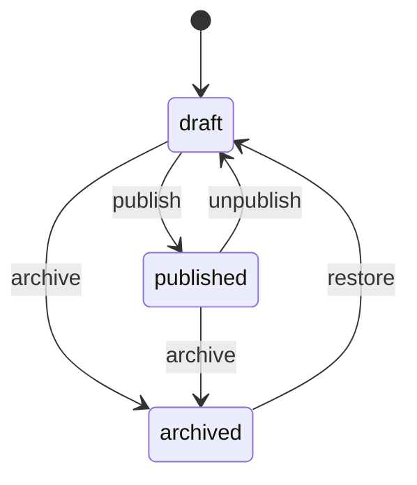
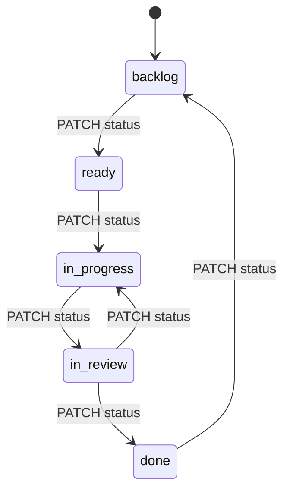
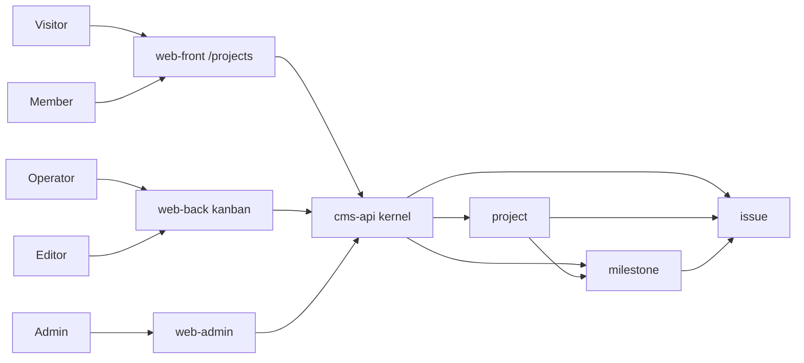
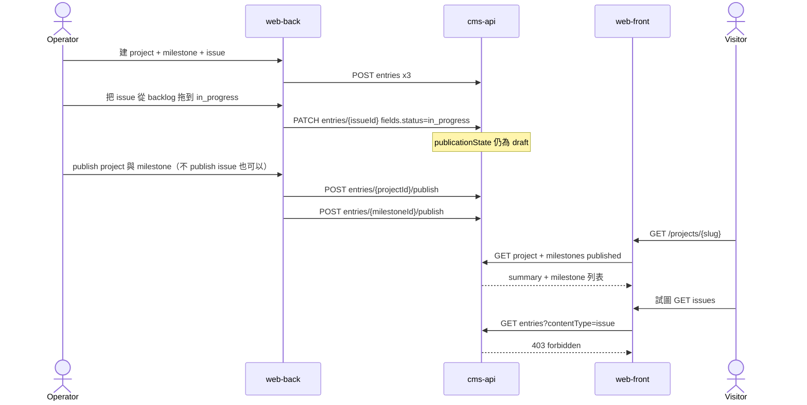

# Demo pack — 專案管理（projects）

- 狀態：Draft v0.1
- 日期：2026-09-05
- 車道：Demos（demo pack owner）
- 權威檔：本檔 `docs/specs/demo-projects.md`
- 對齊總綱：`docs/sdd/00-overview.md`（只讀，切面與技術棧 **Decided**）
- 證據規則：本 pack 類型、欄位、種子、畫面、流程為 **Proposed**。跨車道邊預設 **Open**。
- 對齊對象：最小 Project / Issue（status enum）/ Milestone。不是 Jira。公開面**只讀**專案說明與里程碑。

---

## 1. Executive summary

專案管理證明兩件 kernel 必須分清的事：

1. **內容發布狀態機**（draft/published/…）管「能不能出現在 Front」。
2. **工作項 enum**（backlog → done）管「卡片在哪一欄」。兩者不是同一條狀態機。

| 層 | 這個 pack 給它什麼 |
| --- | --- |
| Kernel | 不新增「看板」原語。`issue.status` 是 enum 欄位；搬卡片 = `PATCH` entry。`project` / `milestone` 才走 publish 給 Front。 |
| 操作面 | Front：公開專案列表與里程碑進度。Back：看板、issue、指派、里程碑編輯。Admin：組織成員（角色）、專案可見性預設、類型啟停、審計。Admin **不是**日常看板。 |
| Demo | 三類型 + 權限（anonymous **沒有** issue 的 `read_published`）+ 種子 + 一個 Back 自訂看板視圖。 |

若實作把 issue.status 映射成 publication state，或把公開進度頁與內部看板做成同一套路由權限，本 pack 就算失敗。

---

## 2. Scope / non-goals / 路徑所有權

### 2.1 In scope（本 pack v1）

- 類型 `project`、`milestone`、`issue`。
- `issue.status` 固定 enum，當看板欄。不是可程式化 Jira workflow。
- `project.visibility` 欄位（public/private）與 publication state 正交。
- 指派：`assigneePrincipalId` string（**gap**，非 principal-ref）。
- Front 只讀已發布且 public 的專案說明 + 里程碑。
- Back 看板自訂視圖；寫入仍走 entry API。
- Happy path：建專案/里程碑/issue → 搬卡片 → publish 專案與里程碑 → Front 可見、issue API 對 anonymous 仍拒絕。
- 權限失敗：anonymous 讀 issue 或 private 專案。

### 2.2 Non-goals（明確不做）

- Jira / Linear 克隆：自訂 workflow、SLA、服務台、權限 scheme 每專案一份。
- Gantt、關鍵路徑、產能、故事點、sprint 儀式、epic/sub-task 樹。
- Git / CI 整合、PR 連結、程式碼審查。
- 即時協同編輯、通知 inbox、@mention、留言（總綱 v1 不做留言）。
- 工時、計費、發票。
- 多組織租戶、SaaS 計費。
- 獨立 `issue` 表、`/kanban` write API、WebSocket 看板。

### 2.3 路徑所有權

| 路徑 | 權限 |
| --- | --- |
| `docs/specs/demo-projects.md` | 本車道擁有 |
| 其他 demo 檔 | 分檔、不合併 |
| kernel / surface | 只讀引用 |
| 應用程式碼 | 本輪禁止 |

Back prompt 要求選定：搬卡片是 field/enum 還是 publication state。**本檔選定：enum 欄位。** 跨 Content / Back 標 **Open**（對端可否決，但否決不得把看板欄做成 unpublish）。

Per-project 成員 ACL（只看自己被加入的專案）為 **Open**，v1 **Proposed** 不做：operator 可作業所有 project/issue/milestone。Admin「組織成員」= 指派 operator / editor 角色，不是 Jira 式 project role。

---

## 3. 資訊架構與資料模型

### 3.1 內容類型與欄位

對齊 Content 最小集（**Open** 直到 Content 定案）。

#### `project`

| 欄位 | 類型 | 必填 | 說明 |
| --- | --- | --- | --- |
| `title` | string | 是 | |
| `slug` | string | 是 | Front `/projects/{slug}` |
| `summary` | markdown | 是 | 公開說明。Front 只讀這份，不是 issue 列表 |
| `cover` | media-ref | 否 | 輕依賴媒體庫 |
| `visibility` | enum `public \| private` | 是 | 預設 `public`。private 即使 published 也不給 anonymous（靠 RBAC 或查詢過濾，見 §5） |
| `lifecycle` | enum `active \| completed` | 否 | 預設 `active`。這是專案生命週期，**不是** publication state，也**不是** issue.status |

不用 `archived` 當欄位：封存走 kernel `archived` 狀態。

#### `milestone`

| 欄位 | 類型 | 必填 | 說明 |
| --- | --- | --- | --- |
| `project` | ref → `project` | 是 | |
| `title` | string | 是 | |
| `description` | markdown | 否 | 可公開 |
| `dueDate` | datetime | 否 | |
| `status` | enum `planned \| reached \| missed` | 是 | 預設 `planned` |
| `sortOrder` | int | 是 | 公開頁時間序；允許間隔 |

里程碑**沒有**進度百分比自動計算（那會變成 Gantt/報表）。Front 只展示欄位本身。

#### `issue`

| 欄位 | 類型 | 必填 | 說明 |
| --- | --- | --- | --- |
| `project` | ref → `project` | 是 | |
| `milestone` | ref → `milestone` | 否 | 必須同 project（不變量 **gap G-PRJ-1**） |
| `title` | string | 是 | |
| `body` | markdown | 否 | 內部描述，Front 不渲染 |
| `status` | enum | 是 | 看板欄：`backlog \| ready \| in_progress \| in_review \| done`。預設 `backlog` |
| `assigneePrincipalId` | string | 否 | 指派。非安全邊界（v1 operator 看到全部） |
| `sortOrder` | int | 否 | 欄內順序。缺省則按更新時間。**Proposed** |

無 priority、label、sprint、estimate、watcher、parent issue。

### 3.2 關聯與刪除

```text
project 1 ──< milestone.project
project 1 ──< issue.project
milestone 1 ──< issue.milestone   （可空）
```

| 規則 | 證據 | 說明 |
| --- | --- | --- |
| 刪 project | **Proposed** | **restrict**：仍有 milestone 或 issue |
| 刪 milestone | **Proposed** | 允許；issue.milestone 清空或 422 直到人工改（本檔選：restrict if any issue still points to it） |
| 刪 issue | **Proposed** | 軟刪；看板消失 |
| 硬刪 | 總綱 **Decided** | 僅 Admin + audit |

### 3.3 兩條狀態機（必須分開）

**A. Kernel publication（總綱 Decided）** — 每個 entry 都有：



**B. Issue 作業 enum（本 pack Proposed；不是 kernel 新原語）**



v1 **允許**任意 enum 值跳轉（不做 Jira 轉移規則）。Back 看板只是把五個值排成欄。`PATCH status` **不得**改變 `publicationState`。

Front 規則：

| 類型 | anonymous | 說明 |
| --- | --- | --- |
| project | 僅 `published` **且** `visibility=public` | private：403/404，不出現在列表 |
| milestone | 僅 `published`，且父 project 對呼叫者可讀 | 父 private / draft → 里程碑不可公開讀 |
| issue | **無** `read_published` | 即使誤 publish 也不上 Front、API 拒絕 anonymous |

### 3.4 Context



Member 在本 pack = 與 anonymous 相同（只讀公開專案）。「專案成員協作」落在 Back 的 operator，不開第四面。

### 3.5 Sequence — 搬卡片不發布；發布不上 issue



---

## 4. 種子資料形狀

密碼不進 Git。

### 4.1 帳號（Proposed）

| username | 角色 | 用途 |
| --- | --- | --- |
| `proj.editor` | editor | 可編 project/milestone 文案並 publish；**無** issue 全套（見矩陣） |
| `proj.operator` | operator | 看板、issue、指派、里程碑、publish 專案 |
| `admin` | admin | 成員角色、可見性預設、審計 |
| member 無特製帳 | member | 與 anonymous 相同 |

### 4.2 內容種子

| 類型 | 樣本 | publicationState | 其他 |
| --- | --- | --- | --- |
| project | slug `cms-scaffold`，title `CMS Scaffold` | published | visibility `public`，lifecycle `active` |
| project | slug `internal-ops`，title `Internal Ops` | published | visibility `private`（Front 不可見） |
| project | slug `draft-lab` | draft | visibility `public`（仍因 draft 不上 Front） |
| milestone | `M1 Specs` planned；`M2 Kernel` planned；`M3 Surfaces` planned | published | 皆屬 cms-scaffold；sortOrder 10,20,30 |
| issue | `Write album pack` done；`Visit timeline query` in_progress；`Kanban DnD` ready；`Private project leak test` backlog | **draft**（即使 done 也不給 Front） | 屬 cms-scaffold；一筆可掛 M1 |
| issue | `Secret infra task` | draft | 屬 internal-ops |

封面媒體可空。

### 4.3 視圖註冊（Proposed）

Pack id：`demo.projects`。

| viewId | 面 |
| --- | --- |
| `demo.projects.front.list` | 公開專案卡 |
| `demo.projects.front.detail` | 說明 + 里程碑 |
| `demo.projects.back.projects` | 專案列表含 private/draft |
| `demo.projects.back.projectEditor` | 欄位編輯 |
| `demo.projects.back.kanban` | 自訂視圖：五欄 issue |
| `demo.projects.back.issueEditor` | 詳情 / 指派 / milestone |
| `demo.projects.back.milestones` | 里程碑編輯 |
| `demo.projects.admin.members` | 角色指派 |
| `demo.projects.admin.visibility` | 預設 visibility |

---

## 5. 權限矩陣

不新增 action。

| 角色 | project | milestone | issue | media | 系統 |
| --- | --- | --- | --- | --- | --- |
| anonymous | `read_published` **且** 僅 `visibility=public`（predicate 或查詢強制，**Open** / Identity+Content） | `read_published` 且父 project 可讀 | — | 讀公開專案 cover | — |
| member | 同 anonymous | 同 anonymous | — | 同 anonymous | 無 Back |
| editor | `read_draft` `create` `update` `publish` `unpublish` | 同左 | — | `manage_media`（封面） | — |
| operator | 全套含 publish | 全套 | 全套 CRUD；**不需要** publish 也能在看板工作（issue 可長期 draft） | `manage_media` | 無治理 |
| admin | 緊急覆寫 | 同左 | 同左 | 配額 | `manage_types` `manage_principals` `read_audit` |

**Proposed**：operator 對 issue 仍給 `publish` 以免通用 UI 壞掉，但 Front 永不授 anonymous `read_published` on issue。即使有人 publish 所有 issue，公開進度頁也不渲染它們；API 拒絕匿名列表。

private project：anonymous 的 `read_published` predicate 失敗 → 403/404，列表不含。operator/admin Back 可見。

Per-project ACL、`project_member` 類型：**Open / 不做 v1**（G-PRJ-2）。指派欄位只供過濾與顯示。

---

## 6. 三面代表畫面

路徑 **Proposed**。Front 入口 `/projects`。

### 6.1 Front office（5）

| # | 畫面 | 目的 | 空 / 失敗 |
| --- | --- | --- | --- |
| 1 | 公開專案列表 | published + public | 無專案：空狀態。不含 Internal Ops、draft-lab |
| 2 | 專案頁 | summary、cover、lifecycle | private/draft slug：404 或 403（與 Content/Identity 對齊） |
| 3 | 里程碑區 | 標題、dueDate、status | 無里程碑：空列表，不是看板 |
| 4 | 不存在的「公開 issue」 | 若路由被誤註冊 | 必須不出現在導航；API 403 |
| 5 | 未發布專案 URL | 隔離草稿 | 404 |

不做：Front 報工、留言、登入才能看進度（公開進度就是給外人看的）。

### 6.2 Back office（6）

| # | 畫面 | 目的 | 寫入 |
| --- | --- | --- | --- |
| 1 | 專案列表 | 含 private/draft、state 篩選 | 通用列表 |
| 2 | 專案編輯 | schema 驅動 | PATCH project |
| 3 | 看板 | 五欄、拖曳改 status、欄內 sortOrder | **只** PATCH issue fields |
| 4 | Issue 詳情 | body、assignee、milestone ref | PATCH |
| 5 | 里程碑編輯 | dueDate、status enum | PATCH + publish 才上 Front |
| 6 | Preview 公開頁 | 用 preview token 看 draft project 的 Front 構圖 | 不把 draft 洩到 web-front 無 token 路由 |

Editor 登入 Back：**沒有**看板模組（無 issue action）。Operator **沒有**「內容類型」選單。

### 6.3 Admin center（5）

| # | 畫面 | 目的 | 不做 |
| --- | --- | --- | --- |
| 1 | 類型啟停 | project/milestone/issue | 搬卡片 |
| 2 | 組織成員 | 把人設成 operator/editor | 每專案 role scheme |
| 3 | 可見性預設 | 新 project.visibility 預設 | 多租戶組織樹 |
| 4 | 審計 | 誰 publish 了專案、誰刪 issue | 看板歷史當產品功能（revision 夠用） |
| 5 | 緊急覆寫入口 | 可連到 entry，但不當日常 | impersonation |

---

## 7. API / UI 契約草案

### 7.1 使用的資源（不新增）

| 呼叫者 | 操作 | 期望 |
| --- | --- | --- |
| Front | `GET /entries?contentType=project&publicationState=published` | 只 public；private 不得出現 |
| Front | `GET /entries?contentType=milestone&fields.project={id}&publicationState=published&sort=sortOrder` | 200 |
| Front | `GET /entries?contentType=issue` | **403** |
| Back operator | `PATCH /entries/{issueId}` `{ "fields": { "status": "in_progress" } }` | 200；`publicationState` 不變 |
| Back operator | `POST /entries/{projectId}/publish` | Front 可見 summary |
| Back editor | `PATCH` issue | **403** |
| anonymous | `GET` private project id | 403 或 404，無 summary |

Issue 示意：

```json
{
  "contentType": "issue",
  "publicationState": "draft",
  "fields": {
    "project": { "entryId": "uuid" },
    "milestone": { "entryId": "uuid" },
    "title": "Kanban DnD",
    "body": "PATCH status only.",
    "status": "ready",
    "assigneePrincipalId": "uuid-of-proj.operator",
    "sortOrder": 20
  }
}
```

### 7.2 錯誤

| 情境 | HTTP | code |
| --- | --- | --- |
| anonymous 列 issue | 403 | `forbidden` |
| anonymous 讀 draft/private project | 404 或 403 | 對齊 Content/Identity（**Open**） |
| 非法 publication 轉換 | 409 | `illegal_state` |
| 把 issue.status 設成未知 enum | 422 | `validation_failed` |
| 刪仍有 issue 的 project | 409 | `constraint_conflict` |
| editor publish issue（若 UI 露出） | 403 | `forbidden` |

搬卡片到任意 enum **不是** 409：v1 無 workflow 規則。

### 7.3 UI

- Front：Card、Typography、簡單 Timeline/列表展示里程碑。
- Back 看板：可用 shadcn + 排序互動；**禁止**引入第二套看板庫作為資料層。
- 拖曳失敗（403）時卡片必須彈回，並顯示權限錯誤。

---

## 8. 對三個 demo 的含義（證明可複用）

| Kernel 能力 | 相簿 | Pet clinic | **本 pack** |
| --- | --- | --- | --- |
| 類型登錄 | album/photo | owner/pet/… | project/milestone/issue |
| 發布狀態機 | 相片上牆 | vet 上公開列表 | **只有** project/milestone 上公開頁 |
| 作業 enum ≠ 發布 | visibility 欄位 | petType / visitKind | **主證明**：issue.status 看板 |
| `ref` | photo→album | pet→owner | issue→project/milestone |
| media-ref | 硬依賴 | 頭像 | 封面輕依賴 |
| RBAC 按類型 | editor 無 publish | anonymous 無 owner | anonymous 無 issue |
| Back 自訂視圖 | 排序 | 時間線 / 當日 | **看板** |
| 三面分離 | 上傳不在 Front | 看診不在 Admin | 看板不在 Admin、不在 Front |

Kernel 無感「issue」。看板不是第四個操作面，也不是 kernel 新模組。

---

## 9. 跨車道邊表

| 邊 | 本檔登記 | 證據 | 對端可否決 |
| --- | --- | --- | --- |
| Content | 三類型；issue.status 為 enum；搬移=PATCH；無 cascade publish | **Proposed** | 欄位過濾、ref 完整性 |
| Content / Back | 看板是自訂視圖不是新 write API | **Proposed** | 是否要專用 query |
| Identity | 不新增 action；private 用 predicate；v1 無 per-project ACL | **Proposed** | cookie、403 vs 404 |
| Media | 可選 cover；private 專案封面不可匿名讀 | 同其他 pack 的媒體可見性 | 傳遞方式 |
| Front | 只讀專案+里程碑；無 issue 路由 | **Proposed** | `/` 選擇器 |
| Back | 選定 enum 而非 publication 當看板欄 | **Proposed** 必須留下 | 通用 editor 是否夠拖曳 |
| Admin | 成員=平台角色；可見性預設 | **Proposed** | 熱新增 enum 值？v1 不做自訂 workflow |
| 其他 demo | 共享 kernel 不共享類型 | | `status` 欄位名在 milestone 與 issue 皆有，靠 contentType 區分 |

---

## 10. 驗收條件

### 10.1 Happy path

**Given** `proj.operator` 登入 Back，種子可載入。  
**When** 建立 project `Harbor Lights`（visibility=public）→ 建立 milestone `M1 Launch` → 建立 issue `Paint the hull` status=`backlog` → PATCH 該 issue `status=in_progress` → publish project 與 milestone（issue 保持 draft）。  
**Then**

1. Front 列表出現 Harbor Lights；專案頁可見 summary 與 M1 Launch。
2. Front HTML/JSON **不含** `Paint the hull`、不含 issue.status。
3. anonymous `GET entries?contentType=issue` → **403**。
4. Back 看板該卡在 `in_progress` 欄；`publicationState` 仍為 `draft`。
5. 無 `issues` 表、無 `POST /kanban/move`。
6. 同一測試行程式可在同一 kernel 登錄 album/clinic 類型而不衝突。

### 10.2 權限失敗 path

**Given** 種子 `internal-ops`（published + private）與其 issue `Secret infra task`；呼叫者 anonymous。  
**When** `GET` internal-ops entry 以及 `GET` 該 issue entry。  
**Then** 皆不得 200 帶欄位。專案：403 或 404；issue：**403** `forbidden`。Front 列表不含 Internal Ops。  
**And** `proj.editor` `PATCH` `Secret infra task` 的 status → **403**（無 issue action）。

### 10.3 其他

| ID | Given / When / Then |
| --- | --- |
| P-COL-1 | Given issue in_progress。When PATCH status=done。Then 200 且 publicationState 不變。 |
| P-DRAFT-1 | Given `draft-lab`。When Front GET slug。Then 404。 |
| P-MS-1 | Given milestone published 但父 project unpublish。When Front 讀該 milestone。Then 404/403。 |
| P-ADM-1 | Given operator。When 開 Admin 角色矩陣。Then 401/403。 |
| P-ENUM-1 | Given PATCH status=`epic`。Then 422。 |

---

## 11. Kernel gaps（Open）

| ID | 缺口 | 暫行作法 | 禁止 |
| --- | --- | --- | --- |
| G-PRJ-1 | 跨 ref 不變量（issue.milestone.project == issue.project） | Back 帶欄位；kernel 校驗 **Open** | 不要看板服務自己維護第二份 graph |
| G-PRJ-2 | principal-ref、專案成員表、per-project ACL | v1 平台角色 + string assignee | 不要做 Jira permission scheme |
| G-PRJ-3 | 欄位級 predicate（visibility=public） | 必須後端強制 | 不要 Front 下載全部 project 再 filter |
| G-PRJ-4 | 看板 query（按 project + status 分桶） | 通用 list + 客戶端分桶可接受 v1 小數據；大了再 projection | 不要 `/boards/{id}` write 模型 |
| G-PRJ-5 | 欄內排序原子性（兩人同時拖） | last-write-wins；不做即時協同 | 不要為此引入 Redis/Kafka 正確性依賴 |

---

## 12. Open questions

1. Content/Back 是否接受「看板 = enum PATCH」？若有人想用 publication 欄當看板，本檔反對並留給合成記錄。
2. private + published 用 predicate 還是「private 禁止 publish」？本檔允許 published+private，以證明欄位與狀態機正交（與相簿 unlisted 同類）。
3. issue 是否永遠 draft？允許 publish 但不授匿名讀，較能測「RBAC ≠ state」。
4. editor 能否 publish milestone？本檔 **是**，讓行銷/PM 文案與工程看板分離。
5. assignee 顯示名如何從 Identity 解析？列表是否允許 `?assignee=` 過濾？
6. Front 是否顯示「N issues done」計數？**Proposed 否**（會逼出匿名可讀的聚合，易漏）。
7. 類型名 `issue` 是否過泛？總綱使用它，維持到合成改名。

---

## 13. 實作波不該先做的事

1. 不要先做 Gantt、sprint、工時、Git 整合。
2. 不要把 issue.status 接上 draft/published。
3. 不要把公開進度頁與看板放進同一個 React app 用 menu 切換權限。
4. 不要寫 `IssueBoardController` 當唯一寫入路徑。
5. 不要在 Admin 做日常搬卡。
6. 不要做留言、通知、即時游標。
7. 不要為一個 demo 引入 Kafka/Redis。
8. 不要複製 Jira 資訊架構或商標資產。
