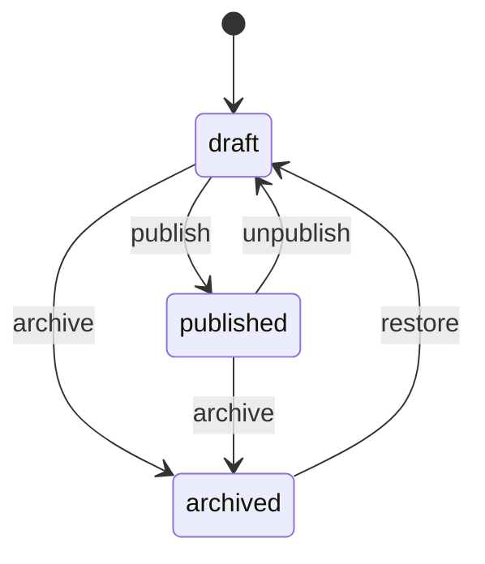
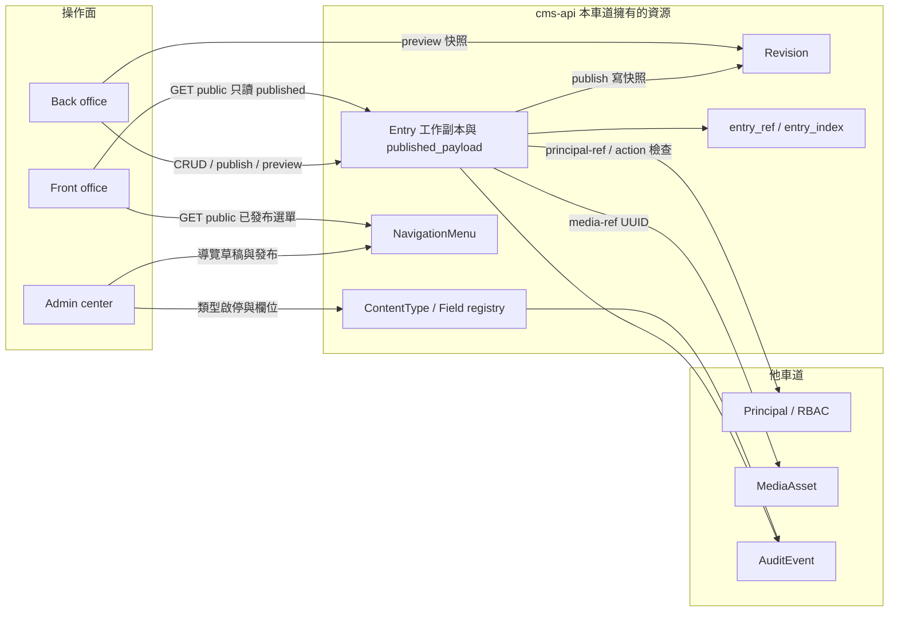
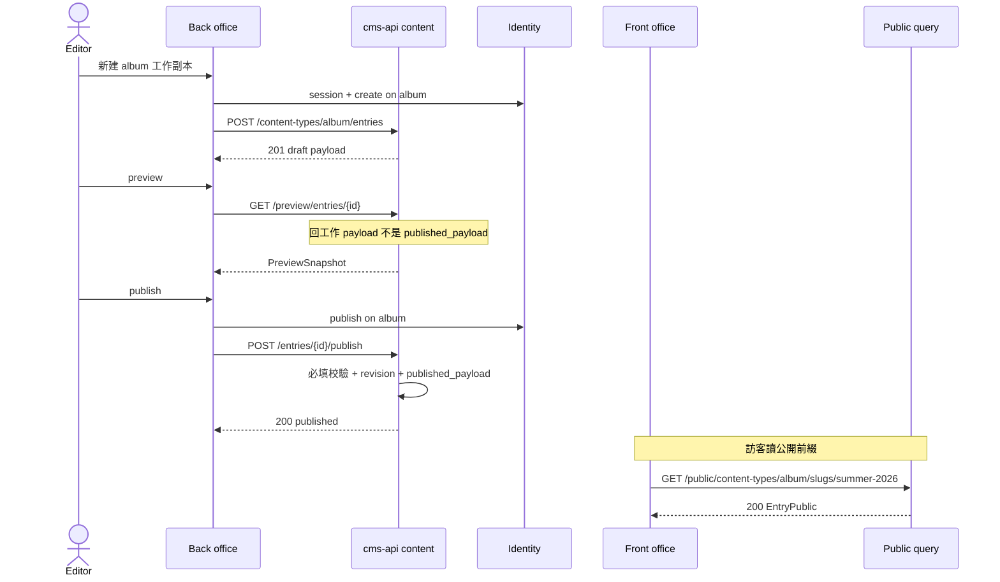
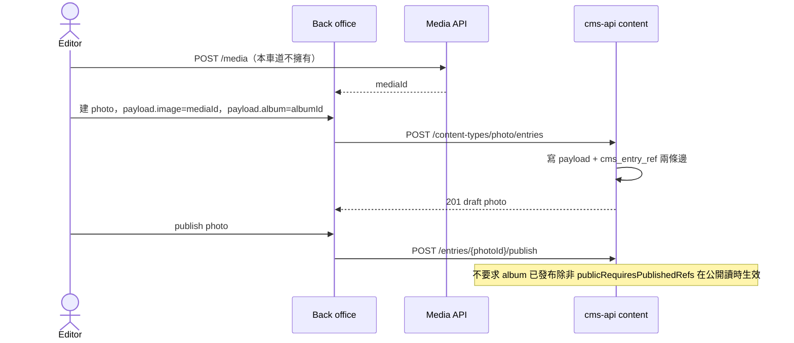
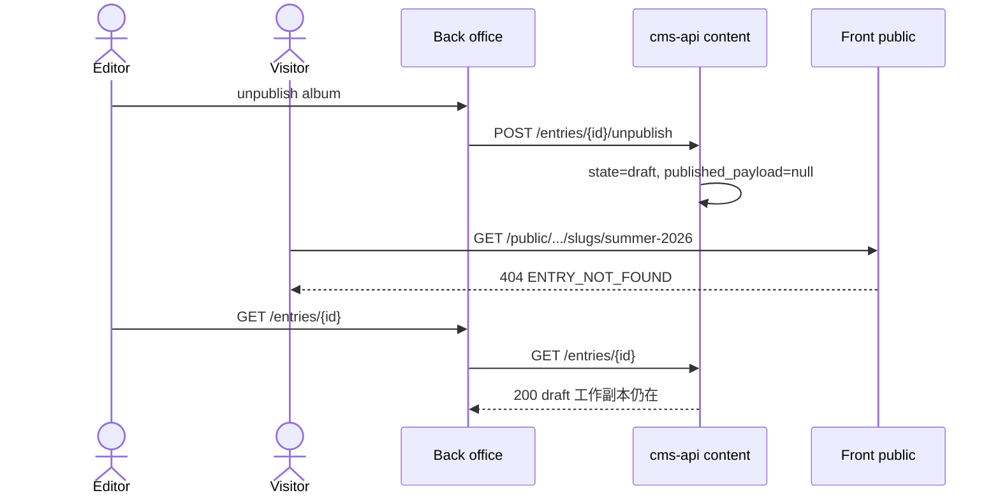

# Kernel Content — 內容類型、Entry、發布狀態機

狀態：Draft v0.1  
日期：2026-09-05  
車道：Content  
權威檔：本文件  
凍結總綱：[`docs/sdd/00-overview.md`](../sdd/00-overview.md)  
本輪只寫規格，不寫應用程式碼。

證據等級：

| 等級 | 含義 |
| --- | --- |
| **Decided** | 總綱已凍結，或本車道給出可驗收契約 |
| **Proposed** | 本車道建議，合成窗口可改 |
| **Open** | 要其他車道或實作波才能定 |

跨車道邊預設 **Open**。本檔標 Decided 的跨邊欄位，對端仍可能否決。

---

## 1. Executive summary

本車道把「相簿 / 寵物 / issue」收成同一套 kernel 原語：`ContentType`、`Field`、`Entry`、`PublicationState`、`Revision`、`NavigationMenu`。Demo 只登錄類型與種子，不得為某個 demo 開平行表或後門 CRUD。

| 消費者 | 得到什麼 |
| --- | --- |
| **Kernel** | 單一寫入路徑：類型登錄、通用 entry（JSONB 載荷 + 類型約束）、統一發布狀態機、publish 修訂快照、關聯索引、Front 查詢層強制只讀 published、preview 工作副本快照、Front 導覽為獨立設定資源 |
| **操作面** | Front：公開投影與公開查詢（無 draft）。Back：工作投影、preview、publish/unpublish。Admin：類型/欄位登錄與啟停、Front 導覽草稿/發布。三面都不在本車道畫頁面 IA |
| **Demo** | 建議類型鍵 `album`/`photo`、`owner`/`pet`/`vet`/`visit`、`project`/`issue`/`milestone`。顯示名可由 Demos 改；kernel 原語不可改。領域狀態（issue 看板欄）是 **enum 欄位**，不是發布狀態 |

成功標準（對齊總綱）：換一套內容類型與權限，不必重寫三個操作面的骨架，也不必為相簿或寵物長出第二套 API。

---

## 2. Scope / non-goals / 路徑所有權

### 2.1 本車道擁有（Decided）

- Content type registry 與 field 定義（系統表 + API）
- Entry 生命週期：create / update / 軟刪 / 硬刪契約形狀
- 發布狀態機：`draft` / `published` / `archived` 與 `publish` / `unpublish` / `archive` / `restore`
- Revision：每次成功 publish 留快照；preview 所需的**工作副本**快照形狀
- 關聯如何進 payload、如何查、級聯刪除預設
- Front 只讀 published 的**查詢層**強制方式
- Navigation / menu 的定位：**獨立設定資源**，不是內容類型（§5.6）

### 2.2 本車道不擁有

| 主題 | 擁有者 |
| --- | --- |
| 誰能 publish、session、CSRF、predicate 語言 | Identity |
| 檔案位元組、衍生圖、公開 URL、配額 | Media |
| 三個 React 應用的頁面級 IA、路由樹、元件 | Front / Back / Admin |
| Demo 顯示名、種子資料、代表畫面 | Demos |
| 審計表結構與保留期限 | Identity / Admin（本車道只登記要發出的事件名） |

### 2.3 只寫路徑

- 本 worktree 只寫：`docs/specs/kernel-content.md`
- 不得改：`docs/sdd/00-overview.md`、其他車道規格、`apps/`、`services/`、`packages/`

### 2.4 Non-goals（v1，Decided）

- 排程發布、審核佇列、`pending_review` / `scheduled` 狀態
- GraphQL、即時協同編輯、全站搜尋引擎
- 完整 i18n / 欄位級 locale（單一隱含 locale）
- 每個內容類型一張強型別業務表、或 demo 手寫 DDL 分叉
- 外掛式自訂欄位執行期、為假想外掛預留 SPI
- 把 Back 與 Admin 合成一個後台
- 公開 API 預設開放 `create`（預約表單是否寫入 entry：Open，見 §11）
- 第四個操作面

---

## 3. 必須回答（本車道裁決）

### 3.1 Field 類型最小集

總綱提示集：`string`、`markdown`、`ref`、`media-ref`、`datetime`、`enum`、`int`。

**裁決：提示集足夠「做出」三個 demo，但不足以做出乾淨的產品級模型。** 缺的不是第三套 CRUD，而是日期、布林、身份參照與 URL slug。

| 類型 | 證據 | 三個 demo 若缺少 |
| --- | --- | --- |
| `string` | **Decided** | 做不出標題、姓名、電話、地址 |
| `markdown` | **Decided** | 相簿說明、就診筆記、issue 本文會退化成純字串；可湊合，品質不夠 |
| `int` | **Decided** | 相簿照片排序、里程碑順序做不出穩定排序 |
| `datetime` | **Decided** | 系統時間戳是欄位外系統列；領域上 `takenAt` 需要它 |
| `enum` | **Decided** | issue 看板狀態、寵物種類、可見性做不出；**不可**用發布狀態機冒充看板 |
| `ref` | **Decided** | `photo→album`、`pet→owner`、`issue→project` 全部失敗 |
| `media-ref` | **Decided** | 相簿硬依賴；clinic/project 封面/肖像失敗 |
| `boolean` | **Decided（本車道新增）** | 沒有也能用 `enum` 假裝；三個 demo 都有旗標（featured / active / public）。列入最小集以免各 demo 自創 yes/no |
| `date` | **Decided（本車道新增）** | `pet.birthDate`、經典 Visit 日期、`milestone.dueDate` 若只用 `datetime` 會把時區洩進「日曆日」。缺它 clinic/projects 能做但不正確 |
| `principal-ref` | **Decided（本車道新增）** | 專案「指派」會逼 demo 建平行使用者表或把人名當 string。Kernel 已有 Principal，必須能參照，不擁有帳號 |
| `slug` | **Decided 為 Entry 系統列，不是 field type** | Front 用 `type + slug` 讀公開資源。缺了只能暴露 UUID，公開面不可用 |

**Proposed（非最小集，缺了 demo 仍能做）：**

| 類型 | 用途 | 缺了怎麼辦 |
| --- | --- | --- |
| `refs`（多值 entry 參照） | 少見；v1 用子 entry + 反查即可 | 單 `ref` + 反查 |
| `enums`（多值 enum） | 經典 Vet specialties | 單值 `enum`，或 Demos 標 kernel gap |
| `decimal` | 診療費用 | v1 不做支付/帳務 |
| `text`（長純文字） | 與 `string`(maxLength) 或 `markdown` 重疊 | 不單列 |

**v1 不做的 field type（Decided）：** rich-text HTML、JSON blob、geo、money、file-bytes（那是 Media）、computed、i18n locale map、repeatable component（改用子 entry）。

Field type 的機器名用上表英文鍵，OpenAPI `enum` 對齊。

### 3.2 Entry 儲存模型（選定一個）

**Decided：通用 JSON document + 類型約束 + 抽出的關聯/索引表。不是每個 type 生成強型別表。**

| 層 | 放什麼 | 遷移含義 |
| --- | --- | --- |
| Flyway 系統表 | `cms_content_type`、`cms_field`、`cms_entry`、`cms_entry_revision`、`cms_entry_ref`、`cms_entry_index`、`cms_navigation_menu` | 唯一允許的 DDL。與總綱「系統表用遷移、demo 類型用種子」一致 |
| `cms_entry.payload` | 工作副本 JSONB，鍵 = field key | 無 DDL 分叉 |
| `cms_entry.published_payload` | 最近一次成功 publish 的 JSONB；Front **只讀這份** | 編輯已發布 entry 不會把草稿洩到 Front |
| `cms_entry_ref` | 從 `ref` / `media-ref` / `principal-ref` 抽出的邊 | 關聯查詢不掃 JSON |
| `cms_entry_index` | 宣告 `indexed: true` 的純量 | 篩選/排序不掃 JSON；增刪索引欄位不發 Flyway |
| Demo 種子 | 類型列、欄位列、entry 列 | **禁止** `CREATE TABLE album` |
| Typed read model | 總綱允許的例外 | **v1 不建**。若 clinic 關聯查詢被證明不可接受，再由 kernel 寫入路徑同步 projection，仍禁止 demo 寫入 |

為什麼不選「每 type 一張強型別表」：那會在登錄 `visit` 時發 DDL，demo 變成 schema 擁有者，三個操作面骨架無法換類型包複用，且與 Flyway 所有權衝突。

PostgreSQL 16 JSONB 足夠 v1。`cms_entry_ref` + `cms_entry_index` 解決 petclinic「按飼主列寵物、按日列就診」與 projects「按 project+status 列 issue」。若之後不夠，**Open（實作波量測後）** 才加 projection，契約見 §11。

### 3.3 關聯：表示、查詢、級聯刪除

**表示（Decided）**

- 單值 `ref` / `media-ref` / `principal-ref`：payload 裡存 **UUID 字串**，不是 URL、不是 embed 物件。
- 多值（若採用 Proposed `refs`）：UUID 字串陣列。
- 寫入時 kernel 同步 `cms_entry_ref(from_entry_id, field_key, to_id, to_kind, sort_position)`，`to_kind` ∈ `entry | media | principal`。
- 目標內容類型由 `cms_field.ref_target_type_key` 約束。`media-ref` 的目標不是 content type；存在性由 Media 邊確認（Open 對端）。
- 反查不把「一對多」存成父 entry 陣列。`album` **沒有** `photos: uuid[]`；照片是 `photo.album` ref，列表用反查。排序用子 entry 的 `int` 欄位（建議鍵 `sortOrder`）。

**查詢（Decided）**

- 正向：讀 payload 或 `embed`（Proposed，深度 1）。
- 反向：`GET .../content-types/{childType}/entries?ref.{fieldKey}={parentId}`。
- 例：`GET /api/v1/public/content-types/photo/entries?ref.album={albumId}&sort=sortOrder:asc`。
- 公開面仍套 published 過濾；未發布父節點的子節點不會因為「掛在某個 id 上」而繞過狀態機。

**級聯刪除預設（Decided）**

| 欄位 | 預設 `onDelete` | 行為 |
| --- | --- | --- |
| 必填 `ref` | `restrict` | 父仍被引用則軟刪/硬刪回 `409 REF_CONSTRAINT` |
| 選填 `ref` | `set_null` | 父軟刪後子欄位清空並重寫索引 |
| 明確設定 | `cascade_soft` | 父軟刪時子一併軟刪（相簿刪除照片可用；**預設不開**） |

補充：

- **不**預設級聯 unpublish、**不**預設級聯 archive、**不**預設硬刪子節點。
- 取消發布相簿後，已發布 photo 是否仍能用直接 URL 打到：見 `publicRequiresPublishedRefs`（§5.5）。
- 硬刪只走 Admin purge，且仍先套 `restrict`。

### 3.4 排程發布

**Decided：v1 不做排程發布。**

- 狀態集合只有 `draft | published | archived`。沒有 `scheduled`，沒有 `publishAt` 驅動的狀態轉移。
- Entry **沒有** kernel 級 `scheduledPublishAt` 系統列。
- 類型上的 `date` / `datetime` 是**領域資料**（就診時間、里程碑到期），不是發布排程。
- 實作波不得用 cron「到點呼叫 publish」冒充產品功能。需要時另開規格，不在本狀態機暗加。

### 3.5 Front 只讀 published：查詢層強制

**Decided：用 audience 分流的 API 前綴 + repository 強制過濾。不是前端藏按鈕，也不是「同一支 endpoint 看 principal 再決定」。**

1. 公開讀只走 `/api/v1/public/...`。
2. 該前綴的查詢**永遠**帶：`publication_state = 'published' AND deleted_at IS NULL AND content_type.enabled = true`，回傳 **`published_payload`**（不是工作 `payload`）。
3. 公開 API **拒絕** `state`、`includeDraft`、`asOf` 等參數（`400 AUDIENCE_PARAM_REJECTED`），不得默默忽略以免客戶端以為生效。
4. 公開 GET 打到 draft / archived / 軟刪 / 停用類型：一律 **`404 ENTRY_NOT_FOUND`**，與真的不存在相同。不回 403（避免探測）。這是內容車道對 Identity 提示「Front 可否 404 藏資源」的答案：**必須 404**。
5. 管理員 cookie 打公開前綴**仍然**只見 published。治理面不能把 Front 變成 Back。Preview 走 `/api/v1/preview/...`，要 `read_draft` 或 preview token（token 鑄造屬 Identity）。
6. 測試必須用 API 級斷言：未授權（含匿名、含已登入但只有 `read_published`）讀 draft → 404 且 body 不含 payload 鍵。

### 3.6 Navigation：內容類型還是設定資源？

**Decided：獨立 kernel 設定資源 `NavigationMenu`，不是 content type。**

理由：

- 總綱把 navigation 列為 kernel 原語，與類型登錄並列，而不是「再一種 entry」。
- Back / Admin 的資訊架構是應用 + RBAC，不該出現在內容列表裡和 `album` 混在一起。
- 整份選單需要一次草稿/發布，避免 Front 讀到半改的樹。這與單筆 entry 狀態機相似，但資源生命週期是「一份選單文件」，不是「N 筆 menu-item entry」。

誰讀誰寫：

| 面 | 讀 | 寫 |
| --- | --- | --- |
| Admin | 草稿 + 已發布 | 是（`manage_navigation`） |
| Front | 只讀已發布，走 public API | 否 |
| Back | 可讀已發布，供 preview 鉻架（chrome）；**不**編輯站台導覽 | 否（Decided） |

v1 只服務 **Front office 選單**（`front.primary`、`front.footer`）。Back/Admin 導覽不是內容。

---

## 4. 資訊架構與資料模型

### 4.1 Kernel 原語

Kernel **不知道** album/pet/issue。它只知道：

| 原語 | 一句話 |
| --- | --- |
| `ContentType` | 已登錄的類型，`typeKey` 不可變 |
| `Field` | 類型上的欄位定義與約束 |
| `Entry` | 一筆內容；工作副本 +（可空）已發布副本 + 發布狀態 |
| `PublicationState` | `draft \| published \| archived` |
| `Revision` | 一次成功 publish 的不可變快照 |
| `EntryRefEdge` | 抽出的關聯邊 |
| `NavigationMenu` | 具名選單文件（設定，非類型） |
| `PreviewSnapshot` | 工作副本的預覽形狀；不含媒體位元組 |

`MediaAsset`、`Principal`、`Role`、`Permission`、`AuditEvent` 本車道只**引用 id**。

### 4.2 系統表（Flyway，Decided）

總綱已列的內容相關表，本車道補齊索引/導覽表。`cms_media` / `cms_principal*` / `cms_audit_event` 不在本車道擁有。

#### `cms_content_type`

| 欄 | 型別 | 說明 |
| --- | --- | --- |
| `id` | UUID PK | |
| `type_key` | varchar(63) unique | `^[a-z][a-z0-9_]{1,62}$`，建立後不可改 |
| `display_name` | varchar | 可由 Demos/Admin 改 |
| `plural_display_name` | varchar | |
| `description` | text | |
| `title_field` | varchar | payload 裡哪個 `string`/`slug-like` 當列表標題 |
| `slug_policy` | enum | `required \| optional \| none` |
| `singleton` | boolean | 預設 false；true 時第二筆 `409 SINGLETON_EXISTS` |
| `enabled` | boolean | 預設 true；停用後 public 404 |
| `previewable` | boolean | 預設 true |
| `public_requires_published_refs` | jsonb | field key 陣列，見 §5.5 |
| `default_sort` | jsonb | `[{"field":"sortOrder","dir":"asc"}]`，field 可為系統列 `publishedAt`/`updatedAt` |
| `created_at` / `updated_at` | timestamptz | |

v1 所有類型皆可草稿（不另設 `draftable=false`）。

#### `cms_field`

| 欄 | 型別 | 說明 |
| --- | --- | --- |
| `id` | UUID PK | |
| `content_type_id` | FK | |
| `field_key` | varchar(63) | 同 type_key 語法；**不可改** |
| `field_type` | varchar | §3.1 |
| `required` | boolean | 只在 **publish** 強制；草稿可缺 |
| `unique_in_type` | boolean | 對非刪除 entry 生效，寫入即檢查 |
| `indexed` | boolean | 寫入時維護 `cms_entry_index` |
| `visibility` | enum | `public \| back \| internal`，預設 `public` |
| `sort_order` | int | 表單順序 |
| `default_value` | jsonb | 可空 |
| `validations` | jsonb | `maxLength`、`min`、`max`、`pattern`、`format`(email/uri/tel) |
| `ref_target_type_key` | varchar | `ref` 必填 |
| `on_delete` | enum | `restrict \| set_null \| cascade_soft` |
| `media_accept` | jsonb | 例 `["image/*"]`；Media 對端可否決 |
| `enum_values` | jsonb | `[{"key":"todo","label":"Todo"}]` |
| `help_text` | text | |

Unique：`(content_type_id, field_key)`。

**保留鍵（不可當 field_key，Decided）：** `id`、`slug`、`contentType`、`publicationState`、`version`、`createdAt`、`updatedAt`、`publishedAt`、`deletedAt`、`createdBy`、`updatedBy`、`payload`。  
`title` **可以**當 field_key（三個 demo 的 titleField 預設就是它）。資源根上的 `title` 是投影，從 `payload[title_field]` 複製，不是獨立儲存列。

#### `cms_entry`

| 欄 | 型別 | 說明 |
| --- | --- | --- |
| `id` | UUID PK | **Proposed：** UUID v4；v7 可合成改 |
| `content_type_id` | FK | |
| `slug` | varchar(160) null | 在 `(content_type_id)` 下、`deleted_at IS NULL` 時唯一 |
| `publication_state` | varchar | `draft \| published \| archived` |
| `version` | int | 樂觀鎖；每次成功 PATCH 工作副本 +1 |
| `payload` | jsonb not null | 工作副本，預設 `{}` |
| `published_payload` | jsonb null | 僅 `published` 時非空 |
| `published_at` | timestamptz null | 最近一次成功 publish |
| `archived_at` | timestamptz null | |
| `deleted_at` | timestamptz null | 軟刪 |
| `created_by` / `updated_by` | UUID | Principal id，Identity 擁有 |
| `created_at` / `updated_at` | timestamptz | |

`dirty` **不存欄**：`publication_state = published` 且 `payload` ≠ `published_payload` 即為有未發布變更。Front 仍讀 `published_payload`。

Slug 軟刪後是否可復用：**Proposed 否**，直到 purge。合成可改。

#### `cms_entry_revision`

| 欄 | 說明 |
| --- | --- |
| `id` | UUID PK |
| `entry_id` | FK |
| `revision_no` | 該 entry 從 1 遞增 |
| `slug` | 發布當下 slug |
| `payload` | 發布當下完整工作副本快照 |
| `published_at` | |
| `published_by` | Principal id |
| `content_type_key` | 冗餘，避免改名歷史遺失（type_key 本就不可變） |

**Decided：** 只在成功 `publish` 寫入。unpublish / archive / 普通 PATCH **不**寫 revision。  
**Proposed：** 保留最近 N=20；超出刪最舊。N 不作 Admin 設定直到 Admin 車道要。

`revertToRevision`：把該快照拷進 **工作** `payload`，`version+1`，**不**自動 publish，**不**改 `publication_state`（archived 仍 archived，須先 `restore`）。權限：`update`。

#### `cms_entry_ref`

| 欄 | 說明 |
| --- | --- |
| `from_entry_id` | |
| `field_key` | |
| `to_id` | 對端 UUID |
| `to_kind` | `entry \| media \| principal` |
| `sort_position` | 多值時用；單值 0 |

寫入 entry 時重算該 entry 該 field 的邊。供「哪些 entry 引用這張 media / 這個 owner」與反向列表。

#### `cms_entry_index`

| 欄 | 說明 |
| --- | --- |
| `entry_id` | |
| `field_key` | |
| `value_kind` | `string \| int \| bool \| date \| datetime \| enum` |
| `value_string` / `value_int` / `value_bool` / `value_ts` | 擇一 |

預設應索引：`title_field`、所有 `enum`、所有 `date`/`datetime`、所有 `boolean`、所有 `int` 排序欄。`ref` 走 ref 表不走本表。

#### `cms_navigation_menu`

| 欄 | 說明 |
| --- | --- |
| `id` | UUID PK |
| `menu_key` | unique，如 `front.primary` |
| `surface` | v1 只允許 `front` |
| `publication_state` | `draft \| published`（無 archive；不用 entry 狀態機全套） |
| `version` | 樂觀鎖 |
| `document` | jsonb 工作樹 |
| `published_document` | jsonb，published 時非空 |
| `updated_by` / `updated_at` | |

`document` 形狀（Decided）：

```json
{
  "items": [
    {
      "id": "uuid",
      "label": "Albums",
      "kind": "path",
      "path": "/album",
      "children": []
    },
    {
      "id": "uuid",
      "label": "Summer",
      "kind": "entry_ref",
      "contentType": "album",
      "entryId": "uuid",
      "children": []
    }
  ]
}
```

`kind` ∈ `path | entry_ref | url`。`entry_ref` 在 Front 渲染時若目標未發布則**跳過該項**（不 500）。發布選單不會連帶發布 entry。

### 4.3 發布狀態機

總綱最小狀態機 **凍結遵守**，本車道只加「已發布後仍可改工作副本」的 `dirty` 旗標，**不加新狀態**。



轉移規則（Decided）：

| 動作 | 合法來源 | 效果 |
| --- | --- | --- |
| create | — | 永遠 `draft`，`published_payload = null` |
| PATCH | draft / published（權限內） | 只改工作 `payload`/`slug`；published 時 Front 不變 |
| publish | draft 或 published（含 dirty） | 校驗必填 → 寫 revision → `published_payload = payload` → `published` |
| publish（已發布且未 dirty） | published | **Proposed** 200 no-op，不新增 revision |
| unpublish | published | `draft`，`published_payload = null`，工作 payload 保留 |
| archive | draft 或 published | `archived`，`published_payload = null` |
| restore | archived | `draft`，不清 payload |
| 軟刪 | 非已刪 | `deleted_at = now()`；public 404；預設列表隱藏 |
| undelete | 已軟刪 | Admin；清 `deleted_at` |
| purge | 已軟刪或 Admin 強制 | 硬刪 + audit；仍受 `restrict` |

非法轉移（例：publish archived、unpublish draft、restore published）→ `409 INVALID_STATE_TRANSITION`。

已發布 entry 的繼續編輯 **不必**先 unpublish（否則改相簿說明會讓 Front 整本消失）。這與總綱「Back 可讀寫 draft/published」相容，且讓 preview 有意義。

### 4.4 發布狀態 ≠ 領域狀態（Decided）

| 概念 | 存在哪 | 例子 | 誰改 |
| --- | --- | --- | --- |
| 發布狀態 | 系統列 `publication_state` | draft / published / archived | `POST .../publish` 等 |
| 領域狀態 | payload 的 `enum` 欄位 | issue：`todo \| in_progress \| done`；visit 可有 `scheduled \| completed` | `PATCH` payload |

Back 的看板移動是 PATCH `status` enum，**不是** publish。Front 公開進度頁仍只列出 `publication_state=published` 的 project/milestone/issue。Demos 若把看板做成「未發布 issue」，那是權限/種子選擇，不是第二套狀態機。

### 4.5 驗證何時發生（Decided）

| 時機 | 規則 |
| --- | --- |
| PATCH draft / 已發布工作副本 | 出現的欄位必須型別正確、enum 在集合內、unique 衝突要擋；**必填可缺** |
| publish | 必填齊、`slug_policy=required` 則 slug 非空、`ref` 目標存在且類型正確、`media-ref` 存在（Media 對端）、`principal-ref` 存在（Identity 對端） |
| 公開讀 | 不再校驗，只過濾狀態 |

不在 publish 時要求「所有 ref 目標已發布」（clinic 建 visit 時 pet 可能仍是作業草稿）。公開讀對未發布目標的 embed 選擇：省略或標 unavailable，不 500。

### 4.6 Context



### 4.7 代表性流程 sequence

#### A. 編輯建立 draft album → preview → publish → Front 可見



#### B. 新增 photo 並掛到 album（media id 來自 Media）



#### C. unpublish 後 Front 404/隱藏，Back 仍看得到



---

## 5. API 契約草案

OpenAPI 為實作階段權威。本節是規格契約；前端不得發明未記載欄位。Base：`/api/v1`。

Audience 用**路徑前綴**，不用「同一資源看角色」：

| 前綴 | Audience | 查詢強制 |
| --- | --- | --- |
| `/public` | Front | 只 published + 未刪 + 類型 enabled；body 用 published_payload + visibility=public |
| `/preview` | Back/Admin 或 token | 工作 payload；要 `read_draft` 或有效 preview token |
| `/admin` | Admin center | 類型、導覽、undelete、purge |
| 無前綴（`/content-types/...`、`/entries/...`） | Back office | RBAC；可依 `state` 過濾 |

### 5.1 共用錯誤形狀（Content 擁有的業務碼）

**Proposed** 與 Identity 共用 envelope（對端可改欄名，但要有穩定 `code`）：

```json
{
  "error": {
    "code": "ENTRY_NOT_FOUND",
    "message": "Entry not found",
    "details": [
      { "field": "slug", "code": "SLUG_CONFLICT", "message": "Slug already used in this type" }
    ]
  }
}
```

| code | HTTP | 何時 |
| --- | --- | --- |
| `AUDIENCE_PARAM_REJECTED` | 400 | public 帶 `state` 等 |
| `ENTRY_NOT_FOUND` | 404 | 不存在、公開面未發布、軟刪、停用類型。公開面**不要**用 `ENTRY_NOT_PUBLISHED` |
| `CONTENT_TYPE_NOT_FOUND` | 404 | |
| `NAVIGATION_NOT_FOUND` | 404 | |
| `FIELD_VALIDATION` | 422 | 型別/pattern/enum |
| `SLUG_REQUIRED` | 422 | publish 時缺 slug |
| `REF_TARGET_NOT_FOUND` | 422 | |
| `REF_TARGET_WRONG_TYPE` | 422 | |
| `MEDIA_REF_UNRESOLVED` | 422 | Media 對端說不存在（Open 對齊） |
| `PRINCIPAL_REF_UNRESOLVED` | 422 | Identity 對端（Open 對齊） |
| `INVALID_STATE_TRANSITION` | 409 | |
| `SLUG_CONFLICT` | 409 | |
| `VERSION_CONFLICT` | 409 | `version` 不符 |
| `REF_CONSTRAINT` | 409 | `onDelete=restrict` |
| `TYPE_IN_USE` | 409 | 刪類型仍有 entry |
| `TYPE_KEY_IMMUTABLE` / `FIELD_KEY_IMMUTABLE` | 409 | |
| `SINGLETON_EXISTS` | 409 | |
| `TYPE_DISABLED` | 409 | Back 對停用類型 `create`；public 則 404 |

401 / 403 的形狀與「未登入 vs 沒 action」由 **Identity** 定。本車道要求：公開面藏 draft 用 404 不是 403。

樂觀鎖：寫入帶 `version`（body 或 `If-Match`）。**Proposed：** body `version` 即可，免雙通道。

分頁（Decided）：`offset`+`limit`，預設 20，max 100。

```json
{ "items": [], "total": 0, "offset": 0, "limit": 20 }
```

Cursor 分頁：Open（v1 不做）。

### 5.2 公開查詢參數（登記給 Front）

`GET /api/v1/public/content-types/{typeKey}/entries`

| 參數 | 證據 | 說明 |
| --- | --- | --- |
| `ref.{fieldKey}` | **Decided** | 等於某 UUID |
| `sort` | **Decided** | `{fieldKey|publishedAt|updatedAt}:{asc\|desc}`；field 必須 indexed 或系統列 |
| `offset` `limit` | **Decided** | |
| `embed` | **Proposed** | 逗號分隔 ref 欄位，深度 1，只 embed 已發布目標的公開投影 |
| `q` | **Proposed** | `title_field` contains，大小寫不敏感；不是搜尋引擎 |
| `state` | **Decided 拒絕** | 400 |
| `field.{fieldKey}` | **Decided** | 只對 indexed 純量；enum/boolean/date 等 |

`GET /api/v1/public/content-types/{typeKey}/entries/{id}`  
`GET /api/v1/public/content-types/{typeKey}/slugs/{slug}`

單筆公開資源：id 或 slug。未命中 published → 404。

`GET /api/v1/public/content-types`：啟用中類型的**公開欄位 schema**（Front 渲染用）。不含 back/internal 欄位。

`GET /api/v1/public/navigation/{menuKey}`：已發布選單。沒發布過 → 404（Front 空狀態由 surface 處理）。

公開 API **v1 無 POST/PATCH/DELETE**（預約是否例外見 §11）。

### 5.3 Back office Entry API

| 方法 | 路徑 | action | 說明 |
| --- | --- | --- | --- |
| GET | `/content-types/{typeKey}/entries` | `read_draft` 或 `read_published` | 列表；`state` 合法；無 `read_draft` 時不得回 draft 列 |
| POST | `/content-types/{typeKey}/entries` | `create` | 201，永遠 draft |
| GET | `/entries/{id}` | 視狀態：published 要 `read_published` 或 `read_draft`；draft 要 `read_draft` | 工作投影 |
| PATCH | `/entries/{id}` | `update` | 改 slug 與 payload |
| POST | `/entries/{id}/publish` | `publish` | |
| POST | `/entries/{id}/unpublish` | `unpublish` | |
| POST | `/entries/{id}/archive` | `archive` | |
| POST | `/entries/{id}/restore` | `restore` | archived→draft |
| DELETE | `/entries/{id}` | `delete` | 軟刪 |
| GET | `/entries/{id}/revisions` | `read_draft` | |
| POST | `/entries/{id}/revisions/{revisionNo}/revert` | `update` | 只改工作副本 |
| GET | `/preview/entries/{id}` | `read_draft` | 同 session preview |
| GET | `/content-types/{typeKey}` | 登入且對該類型任一 read | 編輯器 schema（含 back 欄位，不含 internal） |

列表額外參數：`state=draft|published|archived`（可重複或逗號）、`includeDeleted=false` 預設。`q` 對 title contains。

**Proposed 批次排序**（相簿硬需求，合成可改成多次 PATCH）：

`POST /content-types/{typeKey}/entries/reorder` + `update`

```json
{ "parentField": "album", "parentId": "uuid", "orderedIds": ["uuid"] }
```

把 `orderedIds` 寫成 `sortOrder` 0..n-1。目標類型須有 `int` 欄位鍵 **`sortOrder`**（Demos 可改顯示名，建議不要改鍵）。若 Demos 不用這個鍵，本 endpoint 回 422。

建立請求：

```json
{
  "slug": "summer-2026",
  "payload": {
    "title": "Summer 2026",
    "description": "Coast trip",
    "cover": "3fa85f64-5717-4562-b3fc-2c963f66afa6"
  }
}
```

`cover` 是 media UUID 字串，不是上傳。

### 5.4 Admin：類型與導覽

| 方法 | 路徑 | action |
| --- | --- | --- |
| GET/POST | `/admin/content-types` | `manage_types` |
| GET/PATCH | `/admin/content-types/{typeKey}` | `manage_types`；不可改 `typeKey` |
| POST | `/admin/content-types/{typeKey}/enable` 與 `/disable` | `manage_types` |
| POST | `/admin/content-types/{typeKey}/fields` | `manage_types` |
| PATCH | `/admin/content-types/{typeKey}/fields/{fieldKey}` | 可改 display 類屬性、`required`、`indexed`、`enabled` 式隱藏；不可改 `fieldKey`/`field_type`/`ref_target_type_key`（v1 **Decided** 防遷移災難） |
| DELETE | `/admin/content-types/{typeKey}` | 僅當零 entry（含軟刪仍算 in use，須先 purge）；否則 409 |
| GET/PATCH | `/admin/navigation/{menuKey}` | `manage_navigation` |
| POST | `/admin/navigation/{menuKey}/publish` | `manage_navigation` |
| POST | `/admin/entries/{id}/undelete` | `purge` 或 Proposed 併入 `delete`+admin 角色 |
| POST | `/admin/entries/{id}/purge` | `purge` |

**類型熱新增：** Kernel API **支援** 執行期登錄類型與欄位（種子走同一 API）。Admin UI 是「種子 + 啟停」還是「熱新增表單」由 Admin 車道選；本車道不把 registry 做成必須重啟的 classpath 掃描。

停用欄位：**Proposed** `cms_field` 加 `enabled boolean`，停用後編輯器與 public 投影省略，JSON 資料仍留。v1 不提供「從 JSON 抹掉欄位值」的自動遷移。

### 5.5 公開讀與未發布關聯

內容類型選項 `publicRequiresPublishedRefs: ["album"]`：

- 公開 GET 該 entry 時，列出的每個 ref 欄位目標必須是 published 且未刪。
- 任一失敗 → 公開 404（與未發布自身相同）。
- **建議** `photo` 設 `["album"]`，避免相簿下架後單張仍可猜 UUID。
- `visit` / `issue` 預設不設（作業資料本來就不該 public；若 public 再由 Demos 決定）。

此選項是查詢層行為，不是狀態機轉移。

### 5.6 Preview 快照形狀（本車道擁有）

Identity 擁有 token 鑄造、TTL、是否綁 entry+version。Content 擁有 body：

```json
{
  "snapshotVersion": 1,
  "audience": "preview",
  "generatedAt": "2026-09-05T12:00:00Z",
  "entry": {
    "id": "uuid",
    "contentType": "album",
    "slug": "summer-2026",
    "publicationState": "draft",
    "version": 3,
    "title": "Summer 2026",
    "payload": { "title": "Summer 2026", "cover": "uuid" }
  },
  "contentType": {
    "key": "album",
    "titleField": "title",
    "fields": []
  },
  "embeds": {
    "cover": { "kind": "media-ref", "mediaId": "uuid" },
    "album": { "kind": "ref", "entryId": "uuid", "contentType": "album" }
  }
}
```

規則（Decided）：

- Preview **永遠**用工作 `payload`，即使用戶正在看已發布且 dirty 的 entry。
- 不含媒體位元組、不含簽名 URL（Media 擁有）。
- 不得出現於 `/public`。
- 預設 preview 在 Back 應用內用 session 打 `/preview`。可分享 token URL 是否掛在 Front 的隱藏路由：Open（Front + Identity）。總綱：草稿只給 back/admin，**不**把 draft 放到公開 IA。

### 5.7 權限 action 名稱（登記給 Identity）

總綱清單本車道採用，並補狀態機缺口。Identity 仍是否決者。

| action | 證據 | 本車道用途 |
| --- | --- | --- |
| `read_published` | 總綱 **Decided** | 讀 published entry（Back 列表、Front 對應 public 不必逐筆授，anonymous 預設有） |
| `read_draft` | 總綱 **Decided** | 讀 draft/archived 工作副本與 preview 快照；涵蓋 revision 列表 |
| `create` | 總綱 | 新建 draft |
| `update` | 總綱 | PATCH 工作副本、revert revision、Proposed reorder |
| `publish` | 總綱 | 含再發布 dirty |
| `unpublish` | 總綱 | |
| `delete` | 總綱 | 軟刪 |
| `manage_types` | 總綱 | 類型/欄位 CRUD、啟停 |
| `archive` | **Decided 本車道新增** | 與 update 分開；editor 可關 archive |
| `restore` | **Decided 本車道新增** | archived→draft；與軟刪 undelete 不同 |
| `manage_navigation` | **Decided 本車道新增** | Front 選單；不是 `manage_types` |
| `purge` | **Decided 本車道新增** | 硬刪與 undelete；只該給 admin |

不另設 `preview` action：preview = `read_draft`（或 Identity 的 token 視同）。

本車道**不**定義但會碰到的總綱 action：`manage_media`、`manage_principals`、`read_audit`。

授權檢查輸入（給 Identity predicate，Open 語言本身）：

```text
EntryAuthorizationContext {
  entryId, contentType, publicationState,
  createdBy, payload, slug
}
```

例：「飼主看自己的寵物」不是 Content 的角色。Content 只保證公開查詢沒有 draft，並把 `owner` ref / 可選 `principal-ref` 交給 Identity predicate。

### 5.8 審計事件名（登記，不擁有表）

| 事件 | 何時 |
| --- | --- |
| `content_type.created` / `updated` / `disabled` / `enabled` / `deleted` | Admin registry |
| `entry.created` / `updated` / `published` / `unpublished` / `archived` / `restored` / `deleted` / `undeleted` / `purged` | |
| `navigation.updated` / `published` | |

payload 最小：actor、contentType、entryId、revisionNo（publish 時）。完整稽核模型 Open 給 Admin/Identity。

---

## 6. 三個操作面的讀寫投影

本車道不畫路由樹，只定 API 投影。頁面 IA 屬各 surface。

### 6.1 `EntryPublic`（Front）

| 欄 | 來源 |
| --- | --- |
| `id` | 系統 |
| `contentType` | type_key |
| `slug` | 系統 |
| `title` | `payload[title_field]` 的已發布值 |
| `publishedAt` | 系統 |
| `payload` | **published_payload** 且僅 `visibility=public` 欄位 |

**禁止出現：** `publicationState`、`version`、`dirty`、`createdBy`、工作 payload、`deletedAt`、internal/back 欄位、revision 陣列。

Front bundle 不得依賴這些鍵。契約測試：公開 JSON schema 不含 `publicationState`。

### 6.2 `EntryWork`（Back）

含 EntryPublic 能有的全部，加上：

| 欄 | 說明 |
| --- | --- |
| `publicationState` | |
| `version` | |
| `payload` | 工作副本（含 back 欄位；不含 internal） |
| `publishedPayload` | 可空；供 diff |
| `dirty` | 衍生 boolean |
| `createdAt` `updatedAt` `publishedAt` | |
| `createdBy` `updatedBy` | Principal id |
| `validation` | `{ "canPublish": false, "errors": [ { "field", "code" } ] }` |

### 6.3 `ContentTypePublic` / `ContentTypeSchema` / `ContentTypeAdmin`

| 投影 | 給誰 | 內容 |
| --- | --- | --- |
| Public | Front | key、displayName、titleField、slugPolicy、public fields（key/type/enumValues/required） |
| Schema | Back 通用編輯器 | 上者 + back 欄位 + validations + ref 目標 + media_accept。**Decided：** v1 通用表單由 schema 驅動 |
| Admin | Admin | Schema + enabled、entryCount、singleton、內部選項、停用欄位 |

自訂視圖（clinic 時間線、projects 看板）是 **Back composition**：讀列表 + PATCH 同一套 entry API。v1 允許少量自訂視圖，**禁止**專用寫入 endpoint。看板篩選用 `field.status` indexed enum。若 Back 需要「某 vet 當週 visit」：`ref.vet` + `field.visitDate` 範圍。範圍過濾 **Proposed**：`field.{key}.from` / `.to` 對 date/datetime indexed 欄。

### 6.4 Admin 與日常 entry

Admin 的 IA 不該以寫文章為主。Kernel 仍允許 admin 角色打 Back API（總綱：可緊急覆寫，不是作業面）。本車道不提供「Admin 內嵌完整編輯器」的第三套 entry API。

### 6.5 Navigation 投影

- Public：`{ menuKey, items: published tree }`，已去掉指向未發布 entry 的項。
- Admin：工作樹 + published 樹 + version + dirty。

---

## 7. 對三個 demo 的含義

Kernel 無感類型名；下列為**建議鍵**。Demos 可改顯示名，不可把 `album` 做成獨立 bounded context 表，不可改 kernel 原語。

### 7.1 個人相簿 — kernel 有感（媒體 + 有序子 entry）

| typeKey | 建議欄位 | field type |
| --- | --- | --- |
| `album` | `title` | string, required, titleField |
| | `description` | markdown |
| | `cover` | media-ref（image） |
| | `visibility` | enum `public\|unlisted`（unlisted：有連結者能否看是 Front/Identity Open；kernel 仍是 published 才出現在 public list **Proposed：** unlisted 用 enum + 公開列表預設排除，細節 Open 給 Demos） |
| `photo` | `album` | ref→album, required, onDelete `cascade_soft` 或 `restrict`（Demos 選；本車道預設 restrict） |
| | `image` | media-ref required |
| | `caption` | string |
| | `sortOrder` | int indexed |
| | `takenAt` | datetime optional |

`photo.publicRequiresPublishedRefs = ["album"]`。Slug：`album` required；`photo` 可 none（用 id）。

EXIF、人臉、社交互動：非目標。

### 7.2 Pet clinic — kernel 有感（關聯圖）

對齊經典 Spring PetClinic 的 Owner / Pet / Vet / Visit。`PetType` **不是**獨立內容類型，是 `pet.petType` enum。

| typeKey | 建議欄位 | field type |
| --- | --- | --- |
| `owner` | `firstName` `lastName` `address` `city` `telephone` | string |
| | `principal` | principal-ref optional（member 看自己的寵物；Identity predicate） |
| `pet` | `name` | string, titleField |
| | `birthDate` | date |
| | `petType` | enum |
| | `owner` | ref→owner required, onDelete restrict |
| | `photo` | media-ref optional |
| `vet` | `firstName` `lastName` | string |
| | `bio` | markdown |
| | `photo` | media-ref |
| | `specialties` | enum 或 Proposed `enums` |
| `visit` | `pet` | ref→pet required |
| | `vet` | ref→vet optional |
| | `visitDate` | date 或 datetime（Demos 選；行程若要鐘點用 datetime） |
| | `notes` | markdown |

Front：診所介紹可用 singleton `clinic_profile`（markdown + 封面）；獸醫列表 = published `vet`。飼主看自己的寵物：**不是** public list，是 Identity member predicate + Back 或受限 Front。本車道不開 portal 角色。

班表最佳化、完整病歷、計費：非目標。若「按日列某 vet 的 visit」在 JSON+index 上不可接受 → kernel gap：typed read model（仍由 kernel 寫入）。

### 7.3 專案管理 — kernel 有感（enum 領域狀態 + 指派）

| typeKey | 建議欄位 | field type |
| --- | --- | --- |
| `project` | `title` | string |
| | `description` | markdown |
| | `visibility` | enum `public\|private`（private 的 published 仍可能不進匿名 public list：Open Identity/Demos predicate） |
| `milestone` | `project` | ref required |
| | `title` | string |
| | `dueDate` | date |
| | `description` | markdown |
| `issue` | `project` | ref required |
| | `milestone` | ref optional, onDelete set_null |
| | `title` | string |
| | `body` | markdown |
| | `status` | enum `todo\|in_progress\|done` **領域狀態** |
| | `assignee` | principal-ref optional |
| | `sortOrder` | int optional |

Front 只讀已發布 project/milestone（及 Demos 決定是否公開 issue）。Gantt、即時協同、Jira workflow 引擎：非目標。

### 7.4 三個 demo 共享的 kernel 能力（複用證明）

同一套：類型登錄、JSONB entry、發布狀態機、revision、ref 反查、media-ref、public 查詢強制、preview 快照、Front 導覽設定。差別只在種子類型與權限矩陣。

### 7.5 Kernel 無感

留言、通知、支付、多租戶計費、外掛、主題商店、GraphQL。Clinic 的「班表規則」若不是內容類型而是系統設定，屬 Admin/Demos，不是本車道原語。

---

## 8. 跨車道邊表

| 邊 | 本車道登記 | 證據 | 對端仍可否決 |
| --- | --- | --- | --- |
| Identity | action 名見 §5.7；公開 draft 用 404 不 403；授權上下文見 §5.7；`principal-ref` 存 UUID | 名稱 **Decided** 本側；predicate 語言 **Open** | 是 |
| Identity | preview token 鑄造、TTL、cookie 打 `/preview` | **Open** | — |
| Identity | 401/403 envelope 與本檔 error 物件對齊 | **Open** | — |
| Media | `media-ref` = UUID 字串；`media_accept` 提示；存在性在 publish 時問 Media；entry 不存 URL | **Decided** 本側 | 是（Media 可要求物件形狀） |
| Media | `cms_entry_ref.to_kind=media` 供「媒體被誰引用」 | **Proposed** | 是 |
| Media | 未發布 album 的 bytes 不可猜 URL | 本車道用 `publicRequiresPublishedRefs` 藏 **entry**；bytes 屬 Media | **Open** Media |
| Front | `/public` 查詢參數 §5.2；`EntryPublic` 不含 draft 欄；導覽 public GET；unpublished URL → 404 | **Decided** 本側 | 是 |
| Front | `/` 是否 demo 選擇器、公開預約 POST | **Open** Front | — |
| Back | `EntryWork` + schema 驅動表單；看板=PATCH enum；preview 走 `/preview`；不編輯 navigation | **Decided** 本側 | 是 |
| Back | 自訂視圖清單、是否要 `field.from/to` | **Open** Back | — |
| Admin | 類型 API 可熱登錄；UI 可只做啟停；危險：刪類型、purge；導覽在 Admin | **Decided** API；UI **Open** Admin | 是 |
| Admin | 審計保留與查詢 IA | **Open** Admin | — |
| Demos | 建議 typeKey/欄位 §7；不可改原語；領域狀態是 enum | 建議 **Proposed**；原語 **Decided** | 顯示名可改 |
| Demos | `visibility=unlisted/private` 與 public list 交集 | **Open** Demos+Identity | — |
| Synthesis | JSONB vs 日後 projection；revision N=20；UUID v4；reorder endpoint | **Proposed** | 合成可改 |

---

## 9. 驗收條件（Given / When / Then）

實作波應對到 `./gradlew test`（及契約測試）。不依賴人工點擊。下列皆為本車道承諾。

### 9.1 發布與 Front 隔離

1. **Given** 匿名呼叫者與一筆 `publication_state=draft` 的 album（已知 id 與 slug）  
   **When** `GET /api/v1/public/content-types/album/entries/{id}` 或 `.../slugs/{slug}`  
   **Then** `404`，body `code=ENTRY_NOT_FOUND`，不含 `payload` 與工作欄位。

2. **Given** 同上 draft  
   **When** `GET /api/v1/public/content-types/album/entries?state=draft`  
   **Then** `400 AUDIENCE_PARAM_REJECTED`。

3. **Given** 具 admin session 的呼叫者與同一 draft  
   **When** 打 **public** 前綴 GET  
   **Then** 仍 `404`（audience 是路徑，不是角色）。

4. **Given** editor 已 publish album  
   **When** 匿名 `GET /public/.../slugs/{slug}`  
   **Then** `200 EntryPublic`，`payload` 為發布時內容，無 `publicationState`。

5. **Given** 已發布 album，editor PATCH 了 `title` 尚未再 publish（dirty）  
   **When** 匿名讀 public  
   **Then** 仍見**舊** title；Back `GET /entries/{id}` 見新 title 且 `dirty=true`。

6. **Given** 已發布 album  
   **When** `POST /entries/{id}/unpublish`（具 `unpublish`）後匿名再 GET public  
   **Then** `404`；Back GET 仍 `200` 且 `publicationState=draft`。

### 9.2 Preview

7. **Given** draft album 與具 `read_draft` 的 back session  
   **When** `GET /api/v1/preview/entries/{id}`  
   **Then** `200`，`entry.payload` 為工作副本。

8. **Given** 匿名  
   **When** `GET /api/v1/preview/entries/{id}`  
   **Then** Identity 規定的 401/403，**不是**把草稿當 EntryPublic 回。

### 9.3 關聯與媒體 ref

9. **Given** published album A 與 published photo P，`P.payload.album = A.id`，`P.payload.image = M`（M 為 Media 已接受的 id）  
   **When** `GET /public/content-types/photo/entries?ref.album={A.id}&sort=sortOrder:asc`  
   **Then** 列表含 P，`payload.image` 為 UUID 字串不是 URL。

10. **Given** album 已 unpublish，photo 仍 published，且 `publicRequiresPublishedRefs=["album"]`  
    **When** 匿名 GET 該 photo  
    **Then** `404`。

11. **Given** pet 必填 `owner` ref，`onDelete=restrict`，仍有未刪 pet  
    **When** 軟刪該 owner  
    **Then** `409 REF_CONSTRAINT`。

12. **Given** photo.album 指向 `owner` 類型的 id  
    **When** POST/PATCH 或 publish  
    **Then** `422 REF_TARGET_WRONG_TYPE`。

### 9.4 狀態機與 revision

13. **Given** archived entry  
    **When** publish  
    **Then** `409 INVALID_STATE_TRANSITION`；先 restore 再 publish 可成功。

14. **Given** 成功 publish 兩次（第二次有 dirty）  
    **When** `GET /entries/{id}/revisions`  
    **Then** 至少兩筆，序號遞增；最新 payload 等於當前 published_payload。

15. **Given** revision 1 與已改過的工作副本  
    **When** revert 到 revision 1  
    **Then** 工作 payload 回到舊快照、`publicationState` 不變、Front 在再 publish 前不變。

16. **Given** v1 API  
    **When** 搜尋規格與 OpenAPI（實作後）  
    **Then** 不存在 `scheduledPublishAt`、不存在狀態 `scheduled`。

### 9.5 類型登錄與儲存模型

17. **Given** 空庫（僅 Flyway 系統表）  
    **When** 以種子/API 登錄 `album` 與 `photo`  
    **Then** information_schema **沒有** `album`/`photo` 業務表；entry 落在 `cms_entry`。

18. **Given** 已有 `album` 類型  
    **When** PATCH `typeKey`  
    **Then** `409 TYPE_KEY_IMMUTABLE`。

19. **Given** singleton `clinic_profile` 已有一筆  
    **When** 再 POST  
    **Then** `409 SINGLETON_EXISTS`。

20. **Given** 類型 disabled  
    **When** 匿名讀先前 published 的該類型 entry  
    **Then** `404`。

### 9.6 權限與刪除

21. **Given** 只有 `create`+`update`、沒有 `publish` 的 editor  
    **When** `POST /entries/{id}/publish`  
    **Then** 403（Identity）且 `publication_state` 仍 draft，Front 仍 404。

22. **Given** 具 `delete` 者軟刪 published album  
    **When** 匿名 GET public；Back 預設列表  
    **Then** public 404；預設 Back 列表不含該筆；Admin undelete 後可恢復（未 purge）。

23. **Given** 非 admin 呼叫 purge  
    **When** `POST /admin/entries/{id}/purge`  
    **Then** 403。

### 9.7 Navigation

24. **Given** `front.primary` 僅有 draft、從未 publish  
    **When** `GET /public/navigation/front.primary`  
    **Then** 404。

25. **Given** 已發布選單含 `entry_ref` 指向 draft album  
    **When** Front 拉 public navigation  
    **Then** 200，該項被省略，其餘項仍在。

26. **Given** Back 操作者無 `manage_navigation`  
    **When** PATCH `/admin/navigation/front.primary`  
    **Then** 403。

### 9.8 領域狀態不是發布狀態

27. **Given** published issue，`payload.status=todo`  
    **When** 具 `update` 者 PATCH `status=in_progress`（不呼叫 publish）  
    **Then** Back `EntryWork.payload.status` 為 `in_progress` 且 `dirty=true`；public 投影仍為 `todo`，直到再 publish。看板移動不是 `POST .../publish`。

若 Demos 要「看板一改 Front 立刻變」，應在 demo 規格標 gap，不得讓 PATCH 偷偷寫 `published_payload`。

### 9.9 必填只在 publish

28. **Given** album.title required  
    **When** POST 空 payload 的 draft  
    **Then** 201。  
    **When** 立刻 publish  
    **Then** 422，狀態仍 draft。

---

## 10. Open questions

1. **公開寫入（預約）：** Front 是否 POST 建立 `visit` draft？本車道預設 public 只讀。若需要，應是受約束 command + 獨立 action，不是把 `/public` 打開通用 create。等 Front/Demos。
2. **Preview token 掛在哪個 app：** 隱藏的 Front 路由 vs 只在 Back iframe。總綱傾向草稿不進 Front IA。
3. **`principal-ref` 校驗：** 停用帳號、已刪 principal 是否 422。Identity。
4. **Media 軟刪後的 media-ref：** publish 是否失敗；已發布 entry 的 public 投影是否變成缺圖。Media。
5. **private/unlisted 與 public list：** kernel 只懂 published。列表排除要靠 enum 過濾還是 Identity predicate？
6. **Typed read model：** v1 不做。誰有權在實作波根據量測打開？Synthesis。
7. **Revision N、UUID 版本、slug 回收、publish no-op：** 皆 Proposed。
8. **欄位改型：** v1 禁止。之後要不要資料遷移工具？不做本輪。
9. **多值 enum（vet specialties）與 reorder endpoint：** Proposed，Demos 不夠就標 gap。
10. **錯誤 envelope 欄名** 與 Identity 對齊。
11. **date 範圍過濾語法** 等 Back 是否要行程日曆。
12. **Audit 內容與保留** 等 Admin。
13. **種子類型由誰在何時登錄：** 啟動時 demo pack vs Admin 手動。Demos/實作波。
14. 若 Identity 拒絕新增 `archive`/`restore`/`purge`/`manage_navigation`，本車道退路：`archive` 併入 `update` 會讓 editor 過權；不建議。應在合成時攤開，而不是本檔默默改總綱 action 最小集。

---

## 11. 實作波不該先做的事

1. 為 `album`/`pet`/`issue` 建平行表或 `/api/albums` 這類 demo 後門。
2. 登錄類型時 `CREATE TABLE` / 動態 Flyway 分叉。
3. GraphQL、Kafka、Redis 作為正確性依賴。
4. 排程發布、審核佇列、i18n 表、全文搜尋引擎。
5. 把 issue `status` 做成 `publication_state`。
6. 同一 controller 用 `if (admin) return draft` 實作 Front。
7. 用 Front 藏按鈕充當授權。
8. Preview 靠「難猜 UUID 的 public URL」。
9. 在草稿 PATCH 上強制所有 required（會卡死編輯）。
10. 預設級聯硬刪或級聯 unpublish。
11. 自研 CSS、第四個操作面、把導覽做成普通 content type 混進 entry 列表。
12. 為外掛預留 field runtime SPI。
13. 先做 typed projection 再做通用 entry（順序應相反；projection 是逃逸艙）。
14. 在本車道實作 Media 上傳或 Identity session。
15. 寫 `apps/`、`services/` 應用程式碼（本輪禁止）。

---

## 12. 實作波對測試指令的對應（記載，本輪不跑產品測試）

規格完成後的實作應至少覆蓋：

- `./gradlew test`：狀態機轉移表、public 404 draft、dirty 不洩漏、ref 約束、revision on publish、schema 無 demo 表。
- OpenAPI 與本檔資源名、錯誤碼一致。
- 三個 demo 各一條 API happy path（類型種子 + create/publish/public GET）。

本輪完成定義：本檔存在且非空，不是 Java。
