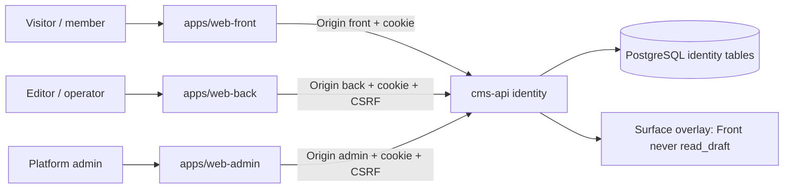
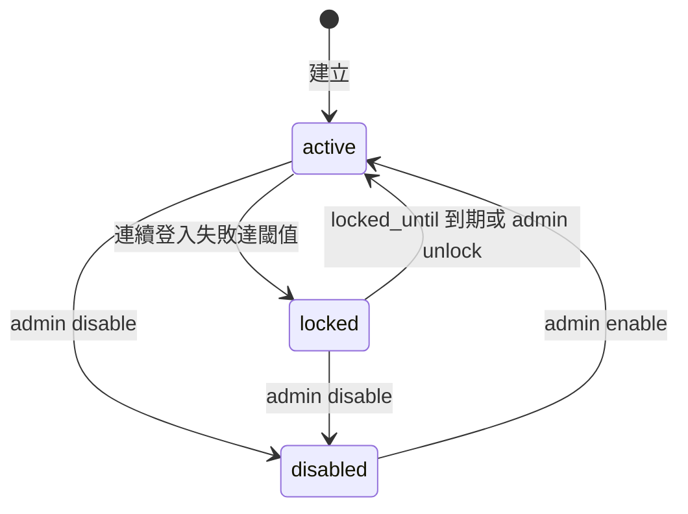
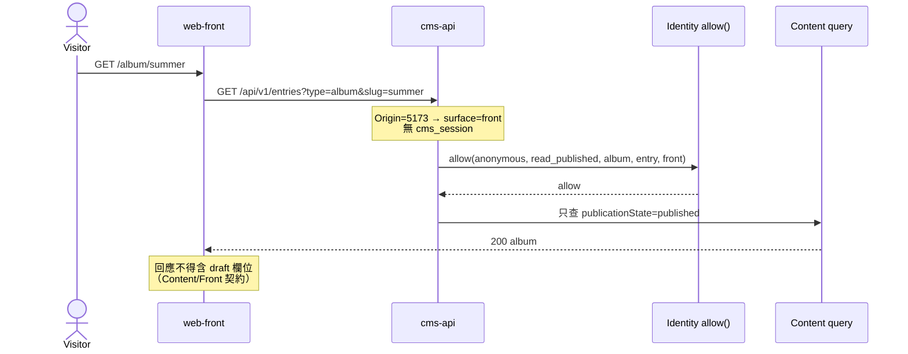
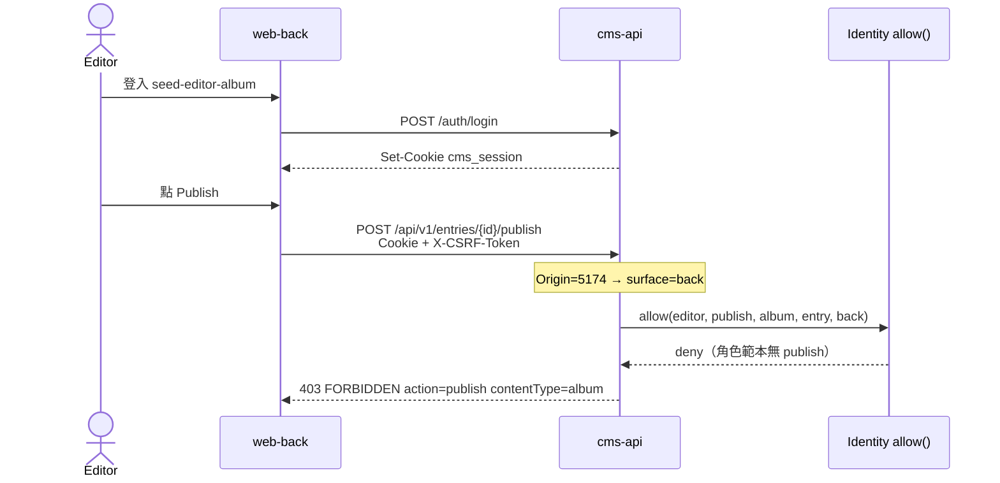
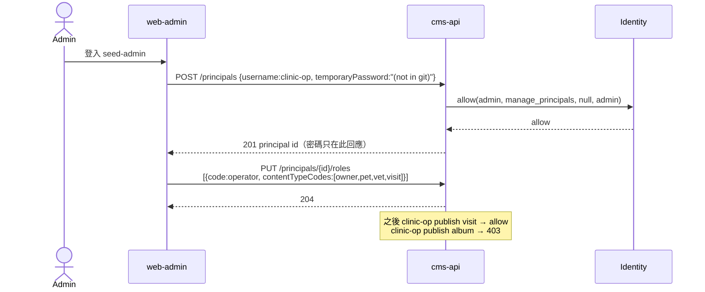
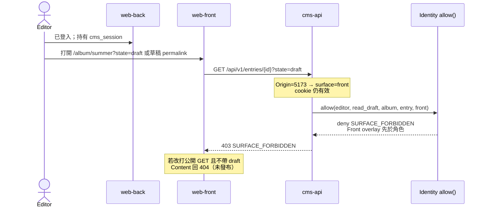

# Kernel Identity — 帳號、RBAC、三面登入邊界

狀態：Draft v0.1  
日期：2026-09-05  
車道：Identity  
權威檔：`docs/specs/kernel-identity.md`  
凍結總綱：`docs/sdd/00-overview.md`  
證據等級：`Decided` / `Proposed` / `Open`（跨車道邊預設 Open；對端可否決）

---

## 1. Executive summary

同一套 `Principal` / `Role` / `Permission` 服務三個操作面。Kernel 不為相簿、診所、專案各做一套帳號系統，也不把 Back office 與 Admin center 揉成「一個後台兩個 menu」。

| 消費者 | 得到什麼 |
| --- | --- |
| Kernel | 系統表 `cms_principal`、`cms_credential`、`cms_role`、`cms_permission`、`cms_principal_role`、`cms_session`；統一授權函數 `(principal, action, contentType, entry?, surface)`；AUTH 類稽核事件 |
| Front office | 可匿名讀 published；可選 member 登入；**即使 cookie 已登入且該人在 Back 有 `read_draft`，Front audience 也永不回草稿** |
| Back office | 強制登入；editor / operator（及 admin 緊急進入）依類型 allowlist 做事；沒有治理 API |
| Admin center | 強制登入且僅 admin；建帳、授角色、收窄 content type、停用、讀 AUTH 稽核 |
| Demo | 只映射顯示名、種子帳號、類型 allowlist 與 predicate；**禁止第四套權限引擎、禁止 portal 角色、禁止第四個操作面** |

本車道回答總綱未寫死的認證邊界：瀏覽器使用 **httpOnly session cookie**（不是 localStorage bearer）；三個 Vite 不同 port 靠 CORS credentials + Origin→surface 對照；CSRF 用 double-submit。

---

## 2. Scope / non-goals / 路徑所有權

### 2.1 In scope（v1）

- Principal、password credential、session、CSRF、lockout。
- 五個系統角色碼：`anonymous` / `member` / `editor` / `operator` / `admin`。
- 權限元組與評估規則；角色指派可帶 content-type allowlist。
- 三個 app 的登入/登出邊界、Origin→surface、Front 永不兌現 `read_draft`。
- 種子使用者規則（文件只含 username + 角色；密碼不進 Git）。
- 401 vs 403 錯誤形狀；Identity **不用 404 假裝資源不存在**。
- AUTH 稽核事件寫入（登入、登出、授角色、停用、改密）。

### 2.2 Non-goals（v1）

- OAuth / OIDC / SAML / 社交登入 / WebAuthn / 2FA / API key 產品化。
- JWT access+refresh 當瀏覽器主認證。
- Redis / Kafka 作為 session 正確性依賴。
- Impersonation（Admin 模擬其他使用者）。
- 欄位級 ACL、Rego/ABAC、每資源 ACL 表。
- 獨立「飼主 portal」角色或第四個 Vite app。
- Email 驗證、reset mail（總綱不做 email campaign）。v1 改密：已登入自助改密，或 admin 設定臨時密碼。
- 多租戶組織、計費、IdP 連線。
- 內容狀態機、媒體位元組、各面選單 IA（分屬 Content / Media / surfaces）。

### 2.3 路徑所有權

| 路徑 | 權限 |
| --- | --- |
| `docs/specs/kernel-identity.md` | 本車道唯一可寫 |
| `docs/sdd/00-overview.md` | 只讀 |
| 其他 `docs/specs/*` | 只讀；矛盾寫入本檔 Open questions |
| `apps/` `services/` `packages/` | 本輪禁止 |

---

## 3. 必須回答（本車道 Decided）

### 3.1 Session 放哪；不同 port 的 CORS 與 cookie

**Decided：瀏覽器主認證 = 不透明 server-side session，放在 API 主機的 httpOnly cookie `cms_session`。** 瀏覽器不把 access token 放進 localStorage / sessionStorage。

| 項目 | 決定 |
| --- | --- |
| Cookie 名 | `cms_session` |
| Cookie 屬性 | `HttpOnly; Path=/; SameSite=Lax; Secure`（prod / HTTPS）。本機 HTTP：`Secure` 可關 |
| Domain | **不設**（host-only，綁 API host，例如 `localhost` 或 `api.example.com`） |
| 值 | 32 bytes 以上 CSPRNG，Base64url；**只存 SHA-256 hash 於 `cms_session.token_hash`** |
| 壽命 | 絕對 12h；`last_seen_at` 滑動延長，上限 7 天。Logout / disable 立刻 `revoked_at` |
| 測試 / 非瀏覽器 | 允許 `Authorization: Bearer <同一不透明 token>`。有 cookie 時以 cookie 為準。Bearer **不走 CSRF** |
| 不明用 JWT | 不在瀏覽器發 signed JWT。避免 Front bundle 持有可讀 draft 的 token |

三個 Vite app 不同 port（Proposed：Front `5173`、Back `5174`、Admin `5175`；API `8080`）是 **cross-origin、same-site**（同為 `http://localhost`）。因此：

1. Login 由 API `Set-Cookie`（不是由 Vite origin 種 cookie）。
2. 三個 app 以 `fetch(api, { credentials: "include" })` 帶 cookie。
3. API CORS：**禁止** `Allow-Origin: *`；允許清單回顯單一 Origin；`Allow-Credentials: true`。
4. `SameSite=Lax` 足夠覆蓋 localhost 跨 port 的 XHR。若未來 Front 與 API 不同 site（`www.example.com` vs `api.example.com`），改 **`SameSite=None; Secure`**，仍不把 cookie 種在 parent domain 給 Front 靜態主機。
5. CSRF：跨 origin 的 cookie 認證仍要防。v1 = **double-submit**（`cms_csrf` 非 HttpOnly cookie + 請求頭 `X-CSRF-Token`）。JSON POST 會觸發 preflight；另強制檢查 `Origin` 在允許清單。
6. Dev 可用 Vite proxy 把 `/api` 同 origin 化，這是便利、不是契約。**有無 proxy，CSRF 與 cookie 規則不變。**

**Surface 判定（Decided，fail-safe = Front）：**

| 訊號 | 權威性 |
| --- | --- |
| CORS `Origin` 落在 allowlist 的對照表 | **權威**（瀏覽器） |
| 反向代理的 path audience（同 origin `/`、`/back`、`/admin`） | **權威**（prod 同站） |
| 請求頭 `X-CMS-Surface: front\|back\|admin` | **僅當 Origin 缺失**（curl、契約測試、Bearer）。Origin 已對照時 **忽略此頭**，防 Front 偽造 `back` |
| 無法判定 | 視為 `front`（最小權限：草稿不可見） |

Proposed 本機對照：

| Origin | Surface |
| --- | --- |
| `http://localhost:5173` | `front` |
| `http://localhost:5174` | `back` |
| `http://localhost:5175` | `admin` |

環境變數 `CMS_CORS_ORIGINS`、`CMS_SURFACE_ORIGINS`（或同等設定）在實作波注入，不寫死進程式以外的秘密。

### 3.2 總綱 action 清單夠不夠

總綱標準 action（**Decided，名稱凍結，跨 Content 對齊**）：

`read_published`, `read_draft`, `create`, `update`, `publish`, `unpublish`, `delete`, `manage_media`, `manage_types`, `manage_principals`, `read_audit`

本車道 **增列兩個**（Decided，理由綁三個 demo / 總綱狀態機，不是為假想外掛）：

| Action | 為什麼 v1 要 |
| --- | --- |
| `archive` | 總綱狀態機有 archive / restore。`delete` 是軟刪 entry；clinic 的 visit 與 projects 的 issue 需要「下架但不當垃圾刪」。`archive` 涵蓋 archive **與** restore。 |
| `manage_settings` | Admin 要改儲存配額、可見性預設、診所設定入口的系統鍵。若塞進 `manage_types` 或 `manage_principals` 會讓 Back 誤拿到治理權。 |

**明確不增列：**

| 曾考慮 | 不增的原因 |
| --- | --- |
| `request_publish` | 缺 `publish` 的 editor 呼叫 publish → **403**。真正「提交發布」佇列是 Content 工作流，v1 不做。Back 可把按鈕標成「請求發布」但仍打同一 publish API，結果 403。 |
| `preview` | 由 `read_draft` + Back/Admin surface 覆蓋。Preview token 不是 session（見 §9.4）。 |
| `impersonate` | Admin 車道亦不做模擬登入。 |
| `manage_roles` | 摺進 `manage_principals`（改角色指派與角色上的 grant 範本）。 |
| portal / `owner` 角色 action | 用 member + predicate，見 §3.4。 |

`manage_media` **不綁單一 content type**（媒體庫是 kernel 資源）。editor / operator / admin 有此 action；member / anonymous 無。未發布位元組能不能猜 URL 由 Media 擁有；Identity 只保證：未認證或 Front surface 不得因「我在 Back 登入過」而讀未發布媒體的授權捷徑。細節 Open → Media。

### 3.3 五角色 × 三 demo 映射

Kernel **角色碼凍結**。Demo 只改顯示名與類型 allowlist，不改碼、不新增第六個系統角色。

| Kernel 角色 | Album 顯示名（Proposed） | Pet clinic 顯示名（Proposed） | Projects 顯示名（Proposed） | Front | Back | Admin |
| --- | --- | --- | --- | --- | --- | --- |
| `anonymous` | 訪客 | 訪客 | 訪客 | 讀已公開 published | 無（僅登入頁） | 無（僅登入頁） |
| `member` | **本 demo 不使用**（kernel 無感） | 飼主 | 觀察成員（可選；公開里程碑仍可匿名） | 讀 published + **自己的** predicate 資料 | 無 | 無 |
| `editor` | 相簿編輯 | 診所文書 | 專案編輯 | 同 member 的公開讀 | 指定類型 CRUD + preview；**預設無 publish** | 無 |
| `operator` | 相簿營運 | 獸醫 / 診所營運 | 專案經理 | 同公開讀 | 指定類型全套作業（含 publish / unpublish / archive / delete / media） | 無 |
| `admin` | 平台管理者 | 平台管理者 | 平台管理者 | 可進（不當日常編輯） | 可進（不當日常作業） | 全套治理 |

指派規則（Decided）：

- `editor` / `operator` 的 `cms_principal_role.content_type_codes` **必須是顯式 allowlist**（空陣列 = 沒有任何類型，等於不能作業）。這讓「admin 建 operator 只授 petclinic 類型」成為第一類 API，不必發明 `operator-clinic` 角色引擎。
- `admin` 忽略 allowlist（隱含 `*`）。
- `member` 的類型與 predicate 由 **demo 種子寫在 `member` 角色的 permission 列**，不是第六角色。
- `anonymous` 是系統角色、沒有 principal；未登入時用它的 grant。登入者權限 = anonymous grants ∪ 自己角色 grants（加性）。

### 3.4 「飼主看自己的寵物」：member predicate，不是 portal 角色

**Decided：不是 portal 角色，不是第四面。**

飼主是 `member`。Pet / visit 等 entry 必須帶 **當筆即可評估** 的欄位（Proposed 名：`ownerPrincipalId`），predicate：

```yaml
type: fieldEquals
field: ownerPrincipalId
value: $currentPrincipalId
```

v1 predicate **不支援 join**（不寫 `pet.owner.principalId` 鏈）。若 Content 堅持只存 `owner` ref、不 denormalize，標 **Open / kernel gap**，由 Content 補 `principal-ref` 欄位或投影；Identity 不開後門 API。

Front 上飼主可另獲 `create` on `visit` 且 `allowedSurfaces: [front]`（公開預約表單）。此 grant 仍是 member/anonymous 的 permission 列，不是新角色。預設 mutating action 的 `allowedSurfaces = [back, admin]`。

### 3.5 401 vs 403；Front 不用 404 藏授權失敗

**Decided：**

| 情況 | HTTP | `error.code` |
| --- | --- | --- |
| 無 session / Bearer | 401 | `UNAUTHENTICATED` |
| 登入帳密錯、使用者不存在（同一回應） | 401 | `INVALID_CREDENTIALS` |
| Session 過期或已撤銷 | 401 | `SESSION_EXPIRED` |
| 密碼正確但停用 | 403 | `ACCOUNT_DISABLED` |
| 密碼正確但 lockout | 403 | `ACCOUNT_LOCKED` |
| CSRF 失敗 | 403 | `CSRF_FAILED` |
| 已認證，缺 action / 類型 / predicate | 403 | `FORBIDDEN` |
| 已認證，該 surface 不允許此 action（例如 Front 要 `read_draft`） | 403 | `SURFACE_FORBIDDEN` |
| 已認證 member 打 Back API | 403 | `SURFACE_FORBIDDEN` |

Identity **不**把 403 改寫成 404。

**與 Content 的分工（Open 直到 Content 確認，本側建議）：**

- 公開讀 API（Front audience、`read_published` 集合）裡，未發布 ID → Content 查詢層本來就沒這筆 → **404**。這是「未發布不當公開資源」，不是 Identity 藏 403。
- 明確帶 draft 的 API，Front surface → Identity 先擋 **403 `SURFACE_FORBIDDEN`**，即使該人是 admin。
- 已登入 member 讀 **別人的** pet（published 但 predicate 失敗）→ **403 `FORBIDDEN`**，不 404。避免用 404 當授權機制；若 Content 對非公開類型要求 hide，Content 必須在自己規格寫明，Identity 才讓路。

登入失敗訊息一律含糊（不透露「使用者存在」）。Lockout 在驗證密碼成功後才回 `ACCOUNT_LOCKED`，避免對不存在帳號洩漏狀態。

### 3.6 種子使用者：無明文密碼進 Git

文件、YAML 種子、本規格 **只列 username 與角色**。禁止 `admin/admin`、`password`、`Passw0rd!` 出現在 repo。

密碼來源（Decided，優先序）：

1. 每人：`CMS_SEED_PASSWORD_<USERNAME>`（username 大寫，`-` → `_`）。例：`CMS_SEED_PASSWORD_SEED_ADMIN`。
2. 共用：`CMS_SEED_PASSWORD`（僅 `dev` / `test` / `local` profile）。
3. 若皆未設：啟動時 CSPRNG 生成 ≥ 24 字元，寫入 **gitignore** 的 `local/seed-passwords.txt`（mode 0600），log **只打檔案路徑**，不打密碼。`prod` profile 預設 **不種子**；除非 `CMS_SEED_ENABLED=true` 且 (1) 或 (2) 有值，否則啟動失敗。

雜湊：**Argon2id**（Spring Security 支援即可；禁止可逆加密、禁止 SHA-1/MD5）。演算法名存 `cms_credential.algo`。

---

## 4. 資訊架構與資料模型

### 4.1 一個 principal，三個 audience

**Decided：全站一張 principal 表。** 不模仿 WordPress（subscriber vs wp user）或 Ghost（members vs staff）的雙帳號池。能力差在 role + surface overlay，不在第二套 user 表。

### 4.2 Context



### 4.3 系統表

Flyway 管系統表。Demo 不得建 `album_user` 平行表。

#### `cms_principal`

| 欄 | 型別 | 約束 |
| --- | --- | --- |
| `id` | UUID | PK |
| `username` | VARCHAR(32) | unique, 大小寫不敏感；`[a-z0-9._-]{3,32}` |
| `display_name` | VARCHAR(80) | not null |
| `email` | VARCHAR(254) | unique, nullable（v1 不發信，仍可存） |
| `status` | ENUM | `active` / `disabled` / `locked` |
| `failed_login_count` | INT | default 0 |
| `locked_until` | TIMESTAMPTZ | nullable |
| `last_login_at` | TIMESTAMPTZ | nullable |
| `created_at` / `updated_at` | TIMESTAMPTZ |  |
| `deleted_at` | TIMESTAMPTZ | 軟刪；v1 **不做** principal 硬刪（稽核 FK） |

#### `cms_credential`

| 欄 | 型別 | 約束 |
| --- | --- | --- |
| `id` | UUID | PK |
| `principal_id` | UUID | FK, unique for `type=password` in v1 |
| `type` | VARCHAR | v1 僅 `password` |
| `secret_hash` | TEXT | Argon2id 編碼串 |
| `algo` | VARCHAR | 例 `argon2id` |
| `rotated_at` | TIMESTAMPTZ |  |

#### `cms_role`

| 欄 | 型別 | 約束 |
| --- | --- | --- |
| `id` | UUID | PK |
| `code` | VARCHAR | unique；五個系統碼不可刪 |
| `display_name` | VARCHAR | Admin / demo 可改顯示名 |
| `system` | BOOLEAN | `true` 不可刪 |
| `created_at` | TIMESTAMPTZ |  |

#### `cms_principal_role`

| 欄 | 型別 | 約束 |
| --- | --- | --- |
| `principal_id` | UUID | PK 之一 |
| `role_id` | UUID | PK 之一 |
| `content_type_codes` | TEXT[] | `editor`/`operator` 必填顯式清單；`admin` 忽略；`member` 可空（用角色上的 predicate grant） |

一人可多角色；評估時 **聯集**。

#### `cms_permission`

Grant 掛在 **角色** 上，不掛在人上（v1 不做人直接 ACE，避免第四套引擎）。人與類型的收窄走 `cms_principal_role.content_type_codes`。

| 欄 | 型別 | 約束 |
| --- | --- | --- |
| `id` | UUID | PK |
| `role_id` | UUID | FK |
| `action` | VARCHAR | 見 §3.2 |
| `content_type_code` | VARCHAR | nullable = 全域 action（`manage_*`、`read_audit`） |
| `predicate_json` | JSONB | nullable = 任何 entry |
| `allowed_surfaces` | TEXT[] | 預設見 §6.3 |
| `created_at` | TIMESTAMPTZ |  |

#### `cms_session`

| 欄 | 型別 | 約束 |
| --- | --- | --- |
| `id` | UUID | PK |
| `principal_id` | UUID | FK |
| `token_hash` | BYTEA | unique, SHA-256(token) |
| `created_at` / `expires_at` / `last_seen_at` | TIMESTAMPTZ |  |
| `revoked_at` | TIMESTAMPTZ | nullable |
| `created_surface` | VARCHAR | 審計用，不限制後續請求 surface |
| `ip` / `user_agent` | TEXT | 截斷保存 |

**Decided：session 正確性在 Postgres 表，不在 JVM HttpMemory、不用 Redis。** 實作可選 Spring Session JDBC，但表契約以本節為準。

#### `cms_audit_event`（AUTH 類，Proposed 與 Admin 共用一表）

| 欄 | 型別 | 說明 |
| --- | --- | --- |
| `id` | UUID | PK |
| `at` | TIMESTAMPTZ |  |
| `actor_principal_id` | UUID | nullable（匿名登入失敗） |
| `category` | VARCHAR | Identity 寫 `AUTH` |
| `action` | VARCHAR | `LOGIN_SUCCESS` / `LOGIN_FAILURE` / `LOGOUT` / `SESSION_REVOKED` / `PRINCIPAL_CREATED` / `PRINCIPAL_DISABLED` / `ROLE_ASSIGNED` / `PERMISSION_CHANGED` / `PASSWORD_CHANGED` / `PASSWORD_SET_BY_ADMIN` |
| `target_type` / `target_id` | VARCHAR / UUID |  |
| `surface` | VARCHAR |  |
| `outcome` | VARCHAR | `ok` / `denied` |
| `ip` | TEXT |  |
| `detail_json` | JSONB | **禁止**寫密碼、cookie、token 明文 |

表所有權 Open → Admin（讀 UI、保留期限）。Identity 擁有 `category=AUTH` 的欄位語意。

### 4.4 Principal 狀態



Lockout（Decided）：連續 **5** 次 `INVALID_CREDENTIALS`（針對存在的 username）→ `locked` 15 分鐘。成功登入歸零。不存在的 username 同樣走慢路徑與泛化 401，計數器不建列。

### 4.5 授權評估（核心函數）

```
allow(principal | anonymous, action, contentType, entry?, surface) -> allow | deny
```

順序（Decided）：

1. 解析 surface；未知 → `front`。
2. **Surface overlay（硬規則，不查表）：**
   - `front` 永遠 deny `read_draft`、`publish`、`unpublish`、`delete`、`archive`、`manage_types`、`manage_principals`、`manage_settings`、`read_audit`。
   - `front` 的 `create` / `update` 僅當 **該 grant 的 `allowed_surfaces` 含 `front`**。
   - `back` 永遠 deny `manage_types`、`manage_principals`、`manage_settings`、`read_audit`（即使 cookie 是 admin：治理 API 只掛 admin audience。Admin 人要治理，請用 Admin origin）。
   - `admin` 允許治理 action；日常 CRUD 在 admin surface **可以**（緊急覆寫），但 Admin IA 不該把作業當首頁——那是 surface 車道的事。
3. 組 grant 集合：`anonymous` 角色 ∪（若已登入）其 `cms_principal_role` 對應角色的 `cms_permission`。
4. `editor`/`operator`：grant 的 `content_type_code` 必須落在該指派的 allowlist；allowlist 外直接 deny。
5. 匹配 `action`；`content_type_code` 為 null 的全域 action 不吃 allowlist（只看角色，例如 admin 的 `manage_principals`）。
6. 若有 `predicate_json` 且本次有 entry：評估失敗則 deny。無 entry 的 list 查詢：Content 必須把 predicate 推進 query（Open → Content），Identity 提供評估器。
7. 預設 deny。

---

## 5. 角色範本權限矩陣

下表是 **角色範本**（種子寫入 `cms_permission`）。人還要疊 allowlist。`opt` = 僅 demo 種子的 predicate grant。

| Action | anonymous | member | editor | operator | admin |
| --- | --- | --- | --- | --- | --- |
| `read_published` | ✓（種子指定公開類型） | ✓ + opt 自己的 | ✓ | ✓ | ✓ |
| `read_draft` | — | — | ✓ 指定類型 | ✓ 指定類型 | ✓ |
| `create` | opt Front 表單 | opt Front 表單 | ✓ 指定類型 | ✓ 指定類型 | ✓ |
| `update` | — | opt 自己的 | ✓ 指定類型 | ✓ 指定類型 | ✓ |
| `publish` | — | — | —（預設關） | ✓ 指定類型 | ✓ |
| `unpublish` | — | — | — | ✓ | ✓ |
| `delete` | — | — | — | ✓ 軟刪 | ✓ 軟刪；硬刪另見 Content 且僅 admin surface |
| `archive` | — | — | — | ✓ | ✓ |
| `manage_media` | — | — | ✓ | ✓ | ✓ |
| `manage_types` | — | — | — | — | ✓ |
| `manage_principals` | — | — | — | — | ✓ |
| `manage_settings` | — | — | — | — | ✓ |
| `read_audit` | — | — | — | — | ✓ |

`allowed_surfaces` 預設（Decided）：

| Action 類 | 預設 surfaces |
| --- | --- |
| `read_published` | `front`, `back`, `admin` |
| `read_draft` 與所有作業寫入 | `back`, `admin` |
| 治理（types / principals / settings / audit） | `admin` |
| Demo 公開表單 `create` | 種子顯式加 `front` |

---

## 6. API 契約草案

Base path Proposed：`/api/v1`。OpenAPI 為實作波權威；本節是衛星契約。前端不得發明未列欄位。

### 6.1 通用錯誤形狀

```json
{
  "error": {
    "code": "FORBIDDEN",
    "message": "Missing permission publish on content type album",
    "action": "publish",
    "contentType": "album",
    "surface": "back"
  },
  "requestId": "018f..."
}
```

| 欄 | 何時出現 |
| --- | --- |
| `code` | 永遠；穩定機器碼 |
| `message` | 永遠；給人看，不含 stack / SQL |
| `action` / `contentType` / `surface` | 授權失敗時 |
| `requestId` | 永遠 |

HTTP 狀態只允許本規格 §3.5 的對照。**登入與授權失敗不用 404。**

### 6.2 認證資源

#### `POST /api/v1/auth/login`

匿名。Body：

| 欄 | 必填 | 說明 |
| --- | --- | --- |
| `username` | ✓ |  |
| `password` | ✓ |  |
| `surface` | — | 僅審計；真正 audience 仍看 Origin |

成功 200：

- `Set-Cookie: cms_session=...`
- `Set-Cookie: cms_csrf=...`（非 HttpOnly）
- Body：`{ "principal": { "id", "username", "displayName", "status" }, "roles": [ { "code", "contentTypeCodes" } ], "surfaces": { "front": true, "back": true, "admin": false }, "csrfToken": "..." }`

失敗：§3.5。Login 成功 **旋轉 session id**（防 fixation）。`Origin` 不在清單 → 403 `CSRF_FAILED` 或直接 CORS 擋。

不安全方法之後皆須 `X-CSRF-Token` 等於 `cms_csrf`（cookie 認證時）。

#### `POST /api/v1/auth/logout`

已登入 + CSRF。204。撤銷 **當前** session。

#### `GET /api/v1/auth/me`

有 cookie：200（形狀同 login body，不含 csrf 也可再給）。無 session：401 `UNAUTHENTICATED`（Front 可當匿名，不要當成 404）。

#### `GET /api/v1/auth/csrf`

匿名可呼叫。確保 `cms_csrf` cookie。Front 公開 POST（預約）先打這支。200 `{ "csrfToken": "..." }`。

#### `POST /api/v1/auth/password/change`

已登入 + CSRF。Body：`currentPassword`, `newPassword`。規則 Proposed：≥ 12 字、不可等於 username。成功後 **撤銷其他 session**，保留當前或全部重登（Proposed：全撤，回 204，客戶端重登）。

### 6.3 治理資源（僅 admin surface + `manage_principals`）

| 方法 | 路徑 | 說明 |
| --- | --- | --- |
| `GET` | `/api/v1/principals` | 分頁；不含 hash |
| `POST` | `/api/v1/principals` | 建帳；`temporaryPassword` 只在 **回應一次**，不進 audit 明文 |
| `GET` | `/api/v1/principals/{id}` |  |
| `PATCH` | `/api/v1/principals/{id}` | displayName / email / status |
| `POST` | `/api/v1/principals/{id}/disable` | 不可停用「最後一個 active admin」 |
| `POST` | `/api/v1/principals/{id}/unlock` | 清 lockout |
| `PUT` | `/api/v1/principals/{id}/roles` | 覆寫指派：`[{ "code": "operator", "contentTypeCodes": ["owner","pet","vet","visit"] }]` |
| `POST` | `/api/v1/principals/{id}/password` | admin 設臨時密碼；audit `PASSWORD_SET_BY_ADMIN` |
| `GET` | `/api/v1/principals/{id}/effective-permissions` | 展開評估，供 Admin 矩陣 UI |
| `GET` | `/api/v1/roles` | 五系統角色 |
| `GET` | `/api/v1/roles/{code}/permissions` |  |
| `PUT` | `/api/v1/roles/{code}/permissions` | 改範本；不可刪系統角色；高危，必寫 audit |

Back / Front 呼叫以上路徑 → 403 `SURFACE_FORBIDDEN` 或 `FORBIDDEN`，即使 caller 是 admin 但 Origin 是 Front。

### 6.4 內容 / 媒體 API 的掛載點

Identity 不擁有 entry 路徑，但規定所有 kernel 寫入 API 在 handler 前呼叫同一 `allow(...)`。Content / Media 契約必須引用這些 action 名，不得自創 `canEditAlbum`。

Preview token（Content 擁有發行與快照）：Identity 規定 **只在 `back` / `admin` surface 接受**。Front 帶 preview token → 忽略，當匿名 published 讀。Preview token ≠ session，不可當登入。

### 6.5 安全 scheme（OpenAPI 草案）

```yaml
securitySchemes:
  cookieAuth:
    type: apiKey
    in: cookie
    name: cms_session
  bearerAuth:
    type: http
    scheme: bearer
```

瀏覽器三 app：`cookieAuth` + CSRF header。契約測試可用 `bearerAuth` + `X-CMS-Surface`。

---

## 7. 三個 app 的認證邊界

| | `web-front` | `web-back` | `web-admin` |
| --- | --- | --- | --- |
| 誰進來 | 匿名為主；member 可選登入 | editor / operator / admin | **僅** admin |
| 未登入 | 公開頁可用 | 除 `/login` 外路由守衛；API 401 | 同左 |
| 登入入口 | Proposed `/login`（surface 車道擁有 IA） | `/login` | `/login` |
| 登出 | 撤銷 session | 同 | 同 |
| 登入後打其他面 | cookie 會送到 API；**授權仍按該次 Origin** | 同 | 同 |
| 草稿 | 永不 | `read_draft` 允許時 | 允許（緊急） |
| 看見「內容類型 / 使用者 / 審計」 | 否 | **否**（無治理 API） | 是 |
| 公開表單 POST | CSRF + 可匿名；需 grant | 不當作作業入口 | 否 |

**已登入 Back 的人打開 Front 的 draft URL 仍失敗** —— 見 §10 流程 4。原因不是「cookie 無效」，而是 Front surface overlay。

同一 cookie 讓 admin 進 Front 看 published **可以**（總綱：admin 可進 front）。這不是漏洞。

member 登入 Front 後，直接打 Back origin API → 403 `SURFACE_FORBIDDEN`（member 對 back 無作業 grant，且 back 路由也不該放行）。

v1 **不做** SSO 產品語意以外的事：沒有第三套 cookie。三 app 共享 API host cookie 是刻意的；安全邊界在 **surface + RBAC**，不在「再做一個 token 池」。

---

## 8. 對三個 demo 的含義

| Demo | Identity 含義 | kernel 無感？ |
| --- | --- | --- |
| 個人相簿 | anonymous 讀 published `album`/`photo`；`seed-editor-album` 無 publish；`seed-operator-album` 有。member **不使用** | member 在此 demo **kernel 無感** |
| Pet clinic | `seed-member-clinic` + `ownerPrincipalId` predicate 讀自己的 pet/visit；operator allowlist = `owner,pet,vet,visit`（PetType 當 enum 則不是獨立 type）。Front 可選預約 `create` | 需要 Content 提供可 predicate 的欄位，否則 Open gap |
| 專案管理 | anonymous 讀 published `project`/`milestone`；issue 預設不公開除非 Demos 把 `read_published` 授出。operator allowlist = `project,issue,milestone` | 指派 issue = `update`，不新 action |

三個 demo **共用**同一 login API、同一 cookie 名、同一 403 形狀。Demo 規格只許改顯示名與種子 allowlist。

---

## 9. 種子帳號（無密碼）

| username | 角色碼 | content type allowlist（Proposed，Demos 可改名但不可改機制） | 用途 |
| --- | --- | --- | --- |
| `seed-admin` | `admin` | `*` 隱含 | 治理；流程 3 |
| `seed-editor-album` | `editor` | `album`, `photo` | 流程 2：publish 被拒 |
| `seed-operator-album` | `operator` | `album`, `photo` | 相簿作業含發布 |
| `seed-member-clinic` | `member` | （predicate 在 member 角色 grant） | 飼主看自己的寵物 |
| `seed-editor-clinic` | `editor` | `owner`, `pet`, `vet`, `visit` | 文書、無 publish |
| `seed-operator-clinic` | `operator` | `owner`, `pet`, `vet`, `visit` | 流程 3 的對照成品；診所作業 |
| `seed-editor-projects` | `editor` | `project`, `issue`, `milestone` | 專案編輯 |
| `seed-operator-projects` | `operator` | `project`, `issue`, `milestone` | 專案經理 |
| `seed-member-projects` | `member` | 可選；Demos 決定是否需要 | 觀察成員 |

Demo 種子必須把 `seed-member-clinic` 的 `id` 寫進對應 `owner` entry 的 `ownerPrincipalId`（或等價欄）。Identity 不在建 member 時自動開一筆 Owner entry。

---

## 10. 代表性流程

### 10.1 anonymous 讀 published album



若該 album 仍是 draft：Content 公開查詢無列 → 404。Identity 未改寫狀態碼。

### 10.2 editor 發布被拒（缺 publish permission）



驗收：HTTP 403，body.code=`FORBIDDEN`，entry 仍為 draft。不得 401（已登入），不得 404。

### 10.3 admin 建 operator 並只授 petclinic 類型



### 10.4 已登入 back 的人打 front 的 draft URL 仍失敗



Cookie 有效（`GET /auth/me` 在 Front origin 仍 200）。失敗的是 **讀草稿**，不是「被登出」。

---

## 11. 跨車道邊表

| 邊 | 主題 | 本車道登記 | 等級 | 對端仍可否決 |
| --- | --- | --- | --- | --- |
| Content | action 名稱 | 總綱清單 + `archive` + `manage_settings` | Decided 本側 | 是 |
| Content | Front 查詢只出 published | Identity overlay 擋 `read_draft`；公開 list 的 404 由 Content 查詢層 | Open | 是 |
| Content | `createdByPrincipalId` / `ownerPrincipalId` | predicate 只看當筆欄位；需 principal-ref 或 denormalize | Open | 是 |
| Content | Navigation 權限 | 若 nav 是設定 → `manage_settings`；若是 content type → 普通 CRUD | Open | 是 |
| Content | 公開預約 `create` | grant `allowedSurfaces` 含 `front`，不新 action | Open | 是 |
| Content | List 查詢推進 predicate | Identity 提供評估器；SQL/JSON 過濾屬 Content | Open | 是 |
| Media | 誰能 `manage_media` | editor、operator、admin；member/anonymous 否 | Proposed | 是 |
| Media | 未發布位元組 | Front surface 不得因已登入 Back 而放行；具體 404/410 屬 Media | Open | 是 |
| Media | 配額誰改 | `manage_settings` + Admin surface | Proposed | 是 |
| Front | 登入入口、匿名 IA | 本檔規定 cookie / CSRF / `/auth/*`；路由樹屬 Front | Open | 是 |
| Front | bundle 不含 draft | 屬 Front/Content；Identity 保證 API 不因錯誤 surface 漏草稿 | Open | 是 |
| Back | 登入必填、無治理選單 | Back API 拒絕 `manage_*` 治理 action | Open | 是 |
| Back | Preview 不進 Front | Preview token 只在 back/admin audience 有效 | Proposed | 是 |
| Admin | 使用者與矩陣 UI | 消費 §6.3；不另做權限引擎 | Open | 是 |
| Admin | 審計保留多久 | Identity 只定義 AUTH 事件名 | Open | 是 |
| Admin | Impersonation | **v1 不做** | Decided 本側 | 是 |
| Demos | 角色顯示名、allowlist、飼主連結 | §3.3 §8 §9；不可發明第六系統角色 | Proposed | 是 |
| Demos | 種子密碼 | 本檔禁止明文 | Decided | 否（總綱已要求） |

---

## 12. 驗收條件（Given / When / Then）

實作波應對到 JUnit 5 + Testcontainers（或本機 Postgres），**不依賴人工點擊**。以下每條都是測試名候選。

### AUTH-01 匿名讀 published

Given 一筆 `album` `publicationState=published`，且 `anonymous` 有 `read_published` on `album`  
And 請求 Origin = Front，無 cookie  
When `GET /api/v1/entries/{id}`  
Then 200，且 Identity 未拒絕

### AUTH-02 匿名讀 draft 被 Front 擋或公開集不命中

Given 同一 album 為 `draft`  
And Origin = Front，無 cookie  
When `GET /api/v1/entries/{id}?state=draft`  
Then 403 `SURFACE_FORBIDDEN`  
When `GET` 公開 published 集合  
Then 404（Content）；**不是** 200

### AUTH-03 登入失敗不洩漏帳號

Given 無此 username，或密碼錯  
When `POST /auth/login`  
Then 401 `INVALID_CREDENTIALS`，兩種情況 body 形狀相同  
And 無 `Set-Cookie: cms_session`

### AUTH-04 editor 缺 publish

Given `seed-editor-album` 已登入，Origin = Back，CSRF 有效  
And 一筆自己可 `update` 的 draft album  
When `POST /api/v1/entries/{id}/publish`  
Then 403 `FORBIDDEN`，`error.action=publish`，`error.contentType=album`  
And 狀態仍為 draft  
And 寫 AUTH 或 Content 稽核（denied），**不含**密碼

### AUTH-05 operator 類型收窄

Given admin 於 Admin origin 建立 principal，角色 `operator`，`contentTypeCodes=["owner","pet","vet","visit"]`  
When 該 principal 於 Back origin `publish` 一筆 `visit`  
Then 允許（其餘條件滿足時）  
When 該 principal `publish` 一筆 `album`  
Then 403 `FORBIDDEN`

### AUTH-06 Back session 打 Front draft

Given `seed-editor-album` 已登入（cookie 有效）  
When Origin = Front 呼叫 `GET /api/v1/entries/{draftId}?state=draft`  
Then 403 `SURFACE_FORBIDDEN`  
When 同一 cookie Origin = Front 呼叫 `GET /auth/me`  
Then 200（仍登入）  
When Origin = Back 呼叫同一 draft  
Then 200 且可見 draft（該人有 `read_draft`）

### AUTH-07 member 不能進 Back API

Given `seed-member-clinic` 已登入  
When Origin = Back `GET` 任何 entry 作業 API  
Then 403 `SURFACE_FORBIDDEN` 或 `FORBIDDEN`  
And 不得因 404 假裝 API 不存在

### AUTH-08 飼主 predicate

Given pet A 的 `ownerPrincipalId` = `seed-member-clinic`  
And pet B 屬別人，兩者皆 published  
When 該 member、Origin = Front `GET` pet A  
Then 200  
When `GET` pet B  
Then 403 `FORBIDDEN`（不是 404，除非 Content 另立 hide 契約並經合成窗口接受）

### AUTH-09 CSRF

Given 已登入 Back  
When `POST /api/v1/entries` **無** `X-CSRF-Token`（cookie 認證）  
Then 403 `CSRF_FAILED`  
When Bearer 測試 token 無 CSRF 頭  
Then 不因 CSRF 拒絕（仍要 RBAC）

### AUTH-10 CORS 與 cookie

Given Origin = `http://localhost:5174` 在允許清單  
When 預檢 `OPTIONS` 帶 `Access-Control-Request-Headers: X-CSRF-Token`  
Then `Allow-Origin` 回顯該 Origin（不是 `*`），`Allow-Credentials: true`  
When Origin = `http://evil.example`  
Then CORS 失敗，不種 session

### AUTH-11 種子無明文

Given 倉庫工作樹  
When 搜尋種子檔與本規格  
Then 無預設密碼字串  
And 測試用密碼只來自環境或 Testcontainers 測試 class 內臨時值，不進 `docs/`

### AUTH-12 最後一個 admin

Given 系統僅一名 `active` admin  
When 該人 `POST /principals/{self}/disable`  
Then 403，帳號仍 active

### AUTH-13 lockout

Given 某存在帳號連續 5 次密碼錯誤  
When 第 6 次即使用對的密碼  
Then 15 分鐘內 403 `ACCOUNT_LOCKED`  
When 過期後  
Then 可登入，計數歸零

### AUTH-14 治理 API 的 surface

Given `seed-admin` cookie  
When Origin = Front `GET /api/v1/principals`  
Then 403 `SURFACE_FORBIDDEN`  
When Origin = Admin  
Then 200

### AUTH-15 未授權 Front 看不到 draft 欄位

Given anonymous 或 member，Front origin  
When 任何成功 200 的 entry 讀取  
Then body 不得出現未發布 revision 內容（與總綱「未授權的 front 請求看不到 draft」對齊；欄位形狀屬 Content，本條測授權邊界）

---

## 13. Open questions

1. Content 是否提供 `principal-ref` 欄位，或要求 demo denormalize `ownerPrincipalId`？（阻塞飼主 predicate 實作，不阻塞本規格其餘部分。）
2. 公開 list 對「存在但未發布」回 404 是否由 Content 定案？本側同意未發布走 404；**已發布但 predicate 失敗走 403**。
3. `cms_audit_event` 單表 vs AUTH 分表？Proposed 單表 + `category`。
4. Front 公開預約要不要匿名 `create`，或僅 member？Demos / Front 決定；Identity 已留 `allowedSurfaces`。
5. Preview token 的位元組與 TTL 屬 Content；本側只鎖 audience。若 Content 想讓「預覽連結可轉寄給未登入者」，那是 **Open / kernel gap**：v1 Identity **拒絕** Front audience 的 preview，以免草稿進公開面。
6. `manage_media` 要不要按 content type 收窄？Proposed 不收窄。相簿編輯因此能上傳未掛 entry 的檔；靠 Media 配額約束。
7. 本機 port 數字（5173/5174/5175/8080）屬 Proposed，合成或 compose 規格可改，機制不變。
8. 密碼策略細節（zxcvbn、常見密碼表）Proposed 最少長度 12；可在實作波加嚴。
9. member 在 projects demo 是否存在，由 Demos 決定；本側已標可選。

---

## 14. 實作波不該先做的事

1. 先做 OIDC / JWT / Redis session / 微服務拆 Identity。先做 cookie + Postgres session + `allow()`。
2. 先做「飼主 portal」app 或 `owner` 系統角色。
3. 先做 Back+Admin 單 SPA 兩套 menu。
4. 先做人級 ACE、欄位級 ACL、Rego。
5. 先做 impersonation、2FA、passkey、email reset。
6. 把 demo 角色碼寫進 kernel（`ROLE_VET`）。Kernel 只認識五碼。
7. 在 Git 放種子密碼或預設 `admin/admin`。
8. 讓 Front 用 404 統一包裝所有授權失敗。
9. 信任 `X-CMS-Surface` 而忽略 Origin。
10. 為假想外掛預留 `PermissionSpi` / 可插拔 Realm。

---

## 15. 本車道不擁有但仍依賴的不變式

- 內容狀態機（draft / published / archived）屬 Content；Identity 只把 action 對上去。
- Front 預設只讀 published 必須在 **查詢層** 再擋一道（總綱 §8）。Identity overlay 是第二道，不是唯一一道。
- 媒體公開 URL 是否可列舉屬 Media。
- 三面選單與路由樹屬 surface 規格。
- OpenAPI 定稿在實作波與合成窗口；本檔是 Identity 資源的意圖來源。
