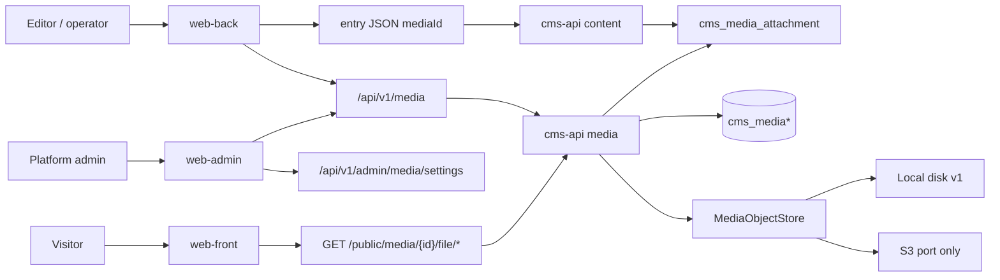
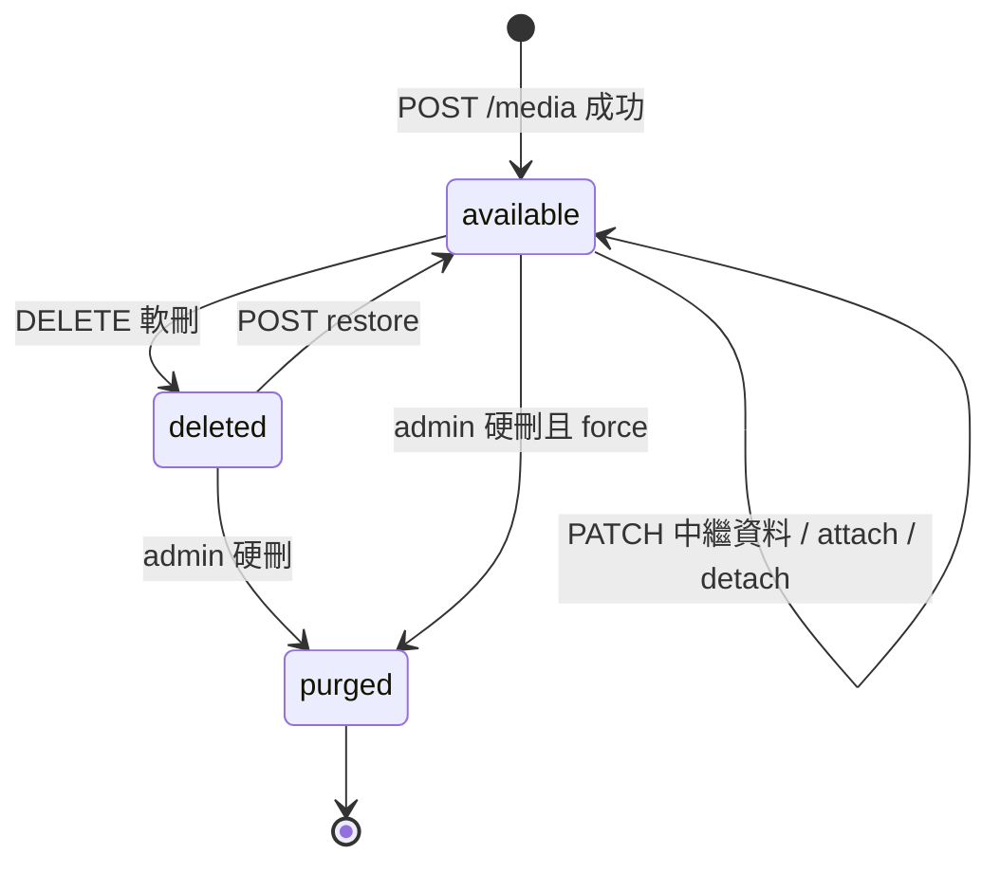
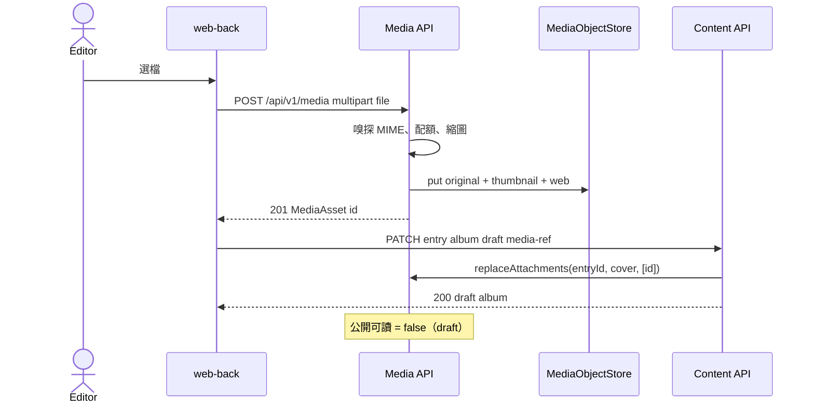
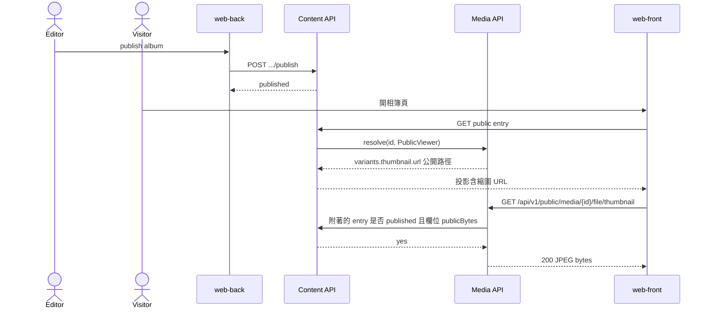
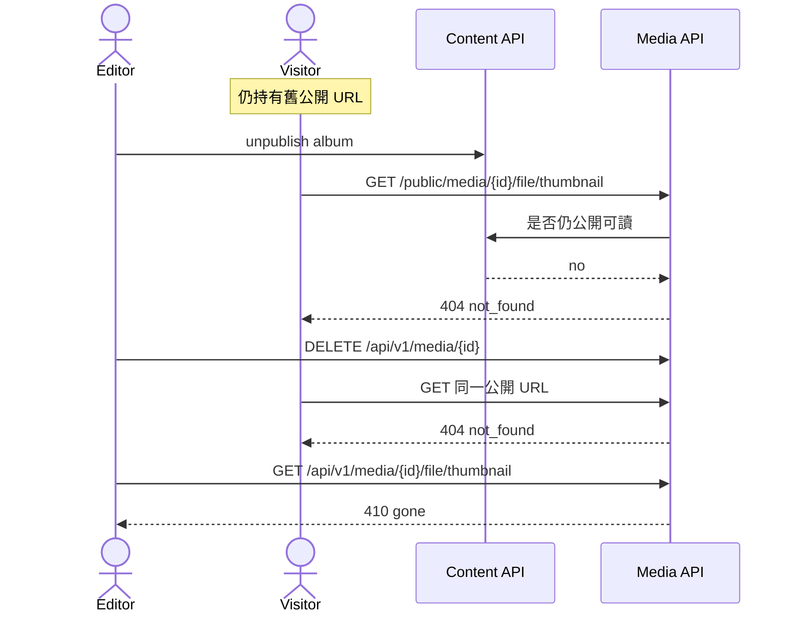

# Kernel Media — 媒體庫與 entry 附著

狀態：Draft v0.1  
日期：2026-09-05  
車道：Media  
權威檔：本文件  
只寫路徑：`docs/specs/kernel-media.md`  
對齊總綱：`docs/sdd/00-overview.md`（只讀，不改切面）

證據等級：

| 等級 | 含義 |
| --- | --- |
| **Decided** | 總綱已凍結，或本車道對自己擁有的契約給出可驗收決定 |
| **Proposed** | 本車道建議，合成窗口可改 |
| **Open** | 要其他車道或實作波才能定。跨車道邊預設 Open |

跨邊標 Decided 時，對端仍可能否決。

---

## 1. Executive summary

本車道給出 **一個** 媒體 kernel：上傳、落地、嗅探、衍生、附著、公開/私有位元組、軟刪、配額。相簿、Pet clinic、專案管理都走同一條 API，不得各做一套 upload。

| 消費者 | 得到什麼 |
| --- | --- |
| **Kernel** | `MediaAsset` 原語、`MediaObjectStore` port、系統表 `cms_media*`、與 entry 的附著索引、依發布狀態計算的公開可讀性 |
| **Front office** | 只透過公開位元組端點讀「已發布且欄位允許公開」的圖；沒有靜態目錄可掃 |
| **Back office** | 獨立 `POST /media`、媒體庫列表、選擇器拿 `mediaId` 再寫入 entry；草稿圖走私有位元組端點 |
| **Admin center** | 配額與硬限制、硬刪、庫用量；不是日常上傳台 |
| **Demo 相簿** | 上傳 → 掛 draft album → publish 後 front 拿縮圖 URL |
| **Demo clinic / projects** | 同一 API 掛封面或附件；就診附件預設不可公開直連 |

Kernel 不知道 album/pet/issue。它只知道檔案、變體、附著、以及「這顆媒體現在能不能給匿名看」。

---

## 2. Scope / non-goals / 路徑所有權

### 2.1 本車道擁有（v1）

- 上傳契約：獨立資源，不嵌在 entry multipart。
- 儲存 port 與本機磁碟 adapter；S3 只留 port。
- MIME allowlist、魔術位元組嗅探、單檔與庫級配額。
- 衍生尺寸 `thumbnail` / `web`（影像同步生成）。
- 與 entry 的 attachment 索引、軟刪/還原、硬刪（admin）。
- 公開 vs 私有位元組通道，以及 unpublish / 軟刪後舊 URL 的 HTTP 行為。
- 系統表：`cms_media`、`cms_media_variant`、`cms_media_attachment`、`cms_media_settings`。總綱列了 `cms_media`；其餘三張是本車道為可驗收契約補的系統表，仍屬 kernel，不是 demo 表。

### 2.2 非目標（v1）

- 病毒掃描、ClamAV、雲端掃描。
- 自研物件儲存、生產 S3 實作、CDN、簽名 URL 當預設公開通道。
- 把 `MEDIA_ROOT` 掛成 Nginx/Vite 靜態目錄。
- GraphQL、外掛、資料夾/媒體分類法、焦點裁切、智慧裁圖。
- 影片/音訊轉碼、HEIC、SVG、無限畫布。
- 分塊/斷點續傳（tus）。
- 依 checksum 去重合併（同一檔共用一個 id）。
- 相簿排序、caption 文案、lightbox IA（Content / Demo / Front）。
- 誰能上傳的角色矩陣（Identity 擁有；本檔只登記需要的 action）。
- 第四個操作面、或把媒體庫做成獨立 SPA。

### 2.3 路徑所有權

| 路徑 | 權限 |
| --- | --- |
| `docs/specs/kernel-media.md` | 本窗口可寫 |
| `docs/sdd/00-overview.md` | 只讀 |
| 其他 `docs/specs/*` | 不寫 |
| `apps/`、`services/`、`packages/` | 本輪禁止 |

本輪不 commit、不 push。

---

## 3. 必須回答（本車道決定）

### 3.1 儲存 — **Decided**

- 執行時位元組走 port `MediaObjectStore`。
- v1 唯一實作：`LocalDiskMediaObjectStore`，根目錄環境變數 `CMS_MEDIA_ROOT`，預設 `./data/media`（Compose 可掛 volume）。
- 物件鍵：`media/{mediaId}/original{ext}`、`media/{mediaId}/thumbnail.jpg`、`media/{mediaId}/web.jpg`。`mediaId` 必須是 UUID，拒絕 `..`。
- PostgreSQL **不**存檔案位元組，只存中繼資料與 object key。
- S3 adapter **只留介面**，v1 不實作、不連真實 bucket、測試不得連網叫 S3。
- 客戶端永遠看不到本機 path 或 bucket key。

### 3.2 上傳形狀 — **Decided：獨立 `POST /media`，再把 id 寫進 entry**

不採用「entry 的 multipart 裡夾檔」。

理由（可驗收）：

1. 相簿一次多張；檔案重試不該綁 entry 儲存。
2. 同一 `mediaId` 可當封面與清單項，clinic/project 也可重用。
3. 草稿相簿尚未建立時仍能先傳檔。
4. 對齊常見 headless CMS 的 library-then-reference，而不是為每個 demo 開後門。

Entry API 只接受 JSON 裡的 `mediaId`。Content 若收到 multipart 檔案欄位，必須 415/422，不得偷偷落地。

### 3.3 公開位元組從哪裡出 — **Decided：API 流，不是靜態目錄，v1 不是簽名 URL**

| 通道 | 用途 |
| --- | --- |
| `GET /api/v1/public/media/{id}/file/{variant}` | Front / 匿名；**每次**做公開可讀檢查 |
| `GET /api/v1/media/{id}/file/{variant}` | Back / Admin / preview；要 session 或 preview 能力 |

未發布 album 的照片：公開通道 **404**（不承認存在），即使 UUID 被猜到。磁碟上沒有可直連的公開 URL。

簽名 URL 留給 S3 port 的未來選項，不當 v1 契約。

### 3.4 衍生 — **Decided**

| variant | 規則 | 誰生成 |
| --- | --- | --- |
| `original` | 嗅探後落地的原檔（影像會剝 EXIF，見 6.3） | 上傳請求內同步 |
| `thumbnail` | 最長邊 ≤ **320** px，JPEG quality ~0.82 | 上傳請求內同步 |
| `web` | 最長邊 ≤ **1600** px，JPEG quality ~0.85 | 上傳請求內同步 |

非光柵影像（v1 的 PDF）：只有 `original`。要 `thumbnail`/`web` → **404** `variant_not_available`（私有通道對授權呼叫；公開通道仍以公開可讀為前提，PDF 預設不公開）。

GIF：保留動畫 `original`；衍生取第一幀 JPEG。

透明 PNG：衍生貼到白色底的 JPEG。已知視覺限制，v1 接受。

### 3.5 病毒掃描 / 嗅探 — **Decided：v1 只做 MIME allowlist + 魔術位元組**

不做病毒掃描。客戶端 `Content-Type` 不可信。先嗅探，再對 allowlist。不一致 → **415**。

### 3.6 配額 — **Decided 預設數字；Admin 可改**

見第 8 節。預設：單檔 **15 MiB**、庫總量 **2 GiB**（含衍生）、總檔數 **10_000**、每 principal **2_000** 檔。

---

## 4. 資訊架構與資料模型

### 4.1 概念



三個操作面共用 kernel。Front 不上傳。Back 上傳與選檔。Admin 治理配額與硬刪，不取代 Back 的日常媒體庫。

### 4.2 `MediaAsset` 狀態 — **Decided**



「公開可讀」不是獨立狀態機，是 **available ∧ 至少一條合格公開附著** 的計算屬性。unpublish 不改 `MediaAsset.status`，只讓公開通道失敗。

### 4.3 系統表（Flyway 遷移，實作波才建）

#### `cms_media`

| 欄 | 型別 | 說明 |
| --- | --- | --- |
| `id` | UUID PK | 客戶端只認這個 id |
| `owner_principal_id` | UUID NOT NULL | 上傳者。Identity 的 principal |
| `title` | TEXT NOT NULL | 預設為原檔名去副檔名，可 PATCH |
| `alt_text` | TEXT NOT NULL DEFAULT '' | 無障礙預設。欄位覆寫是 Content 的事 |
| `original_filename` | TEXT NOT NULL | 僅展示，不當 object key |
| `content_type` | TEXT NOT NULL | **嗅探後**的 MIME |
| `byte_size` | BIGINT NOT NULL | original 位元組 |
| `stored_bytes` | BIGINT NOT NULL | original + 所有衍生，用於配額 |
| `width` | INT NULL | 光柵影像 |
| `height` | INT NULL | 光柵影像 |
| `checksum_sha256` | CHAR(64) NOT NULL | 完整性；v1 **不**用它合併 id |
| `status` | TEXT NOT NULL | `available` \| `deleted` |
| `deleted_at` | TIMESTAMPTZ NULL | 軟刪時間 |
| `created_at` | TIMESTAMPTZ NOT NULL |  |
| `updated_at` | TIMESTAMPTZ NOT NULL |  |

禁止欄：本機 path、bucket、公開布林快取當權威（可當 cache，但位元組請求必須能重算）。

#### `cms_media_variant`

| 欄 | 型別 | 說明 |
| --- | --- | --- |
| `media_id` | UUID | FK `cms_media` |
| `variant` | TEXT | `original` \| `thumbnail` \| `web` |
| `content_type` | TEXT |  |
| `byte_size` | BIGINT |  |
| `width` | INT NULL |  |
| `height` | INT NULL |  |
| `object_key` | TEXT NOT NULL | 只給 store，不進 API |

PK `(media_id, variant)`。

#### `cms_media_attachment`

| 欄 | 型別 | 說明 |
| --- | --- | --- |
| `media_id` | UUID |  |
| `entry_id` | UUID | Content 的 entry id |
| `field_key` | TEXT | 例如 `cover`、`image`、`attachments` |
| `attached_at` | TIMESTAMPTZ |  |

PK `(media_id, entry_id, field_key)`。同一媒體可掛多個 entry。

**誰寫：** entry 寫入路徑成功後，Content 必須呼叫 Media 的 `replaceAttachments(entryId, fieldKey, mediaIds)`。本索引是媒體公開可讀與「使用中」查詢的依據。Content 尚未承諾 → 邊為 **Open**，形狀由本車道登記。

#### `cms_media_settings`（單列）

| 欄 | 預設 | 說明 |
| --- | --- | --- |
| `max_file_bytes` | `15728640` | 15 MiB |
| `max_library_bytes` | `2147483648` | 2 GiB |
| `max_files` | `10000` |  |
| `max_files_per_principal` | `2000` | **Proposed** 隨設定一起做 |
| `updated_at` |  |  |
| `updated_by` | UUID NULL |  |

種子在 Flyway 或啟動時 upsert 單列。Admin 可改；硬上限見第 8 節。

Demo **不得**建 `album_photo_blob` 之類平行表繞過 `cms_media`。

### 4.4 media-ref 欄位形狀（登記給 Content，**Open** 至 Content 接受）

Content 擁有 field 類型。Media 要求至少能表達下列 JSON，否則三個 demo 掛不上檔。

**單值 `media-ref`：**

```json
{ "mediaId": "018f1a2b-3c4d-7e8f-9a0b-1c2d3e4f5a6b" }
```

**多值 `media-ref`：**

```json
{
  "items": [
    { "mediaId": "018f1a2b-3c4d-7e8f-9a0b-1c2d3e4f5a6b" },
    { "mediaId": "018f1a2b-3c4d-7e8f-9a0b-1c2d3e4f5a6c" }
  ]
}
```

| 規則 | 證據 |
| --- | --- |
| 只存 UUID，不存 URL、不存 object key | **Decided**（Media） |
| 陣列順序 = 顯示順序 | 本車道不擁有排序；**Open** 給 Content/Demo |
| caption / 相簿說明 | **不是** media-ref 的欄。Photo/album entry 自己的 string 欄 |
| `altOverride` | **Proposed**：可選字串；缺省用 `MediaAsset.altText` |
| 空值 | JSON `null` 或省略 = 未附著 |

**欄位選項 `publicBytes`（fail-closed）— 本車道 Decided 需要，Content 是否採用為 Open：**

| `publicBytes` | 含義 |
| --- | --- |
| `false`（**預設**） | 即使 entry 已 publish，公開位元組通道仍 404 |
| `true` | entry 為 `published` 且未刪時，該欄列出的 media 可走公開通道 |

相簿封面/照片必須把此選項設 true，否則 Front 沒圖。Clinic 的 visit 附件保持 false。不得靠「Front 不渲染」當安全邊界。

### 4.5 代表流程 sequence

#### 流程 A — Back 上傳 → 掛 draft album



#### 流程 B — publish 後 Front 拿縮圖



#### 流程 C — unpublish / 軟刪後舊 URL



---

## 5. 可見性與位元組通道

### 5.1 公開可讀（Publicly readable）— **Decided 演算法，Open 至 Content port**

一顆 `MediaAsset` 對匿名公開通道可讀，當且僅當：

1. `status == available`（未軟刪）
2. 存在 `cms_media_attachment` 列 `(mediaId, entryId, fieldKey)`
3. 該 `entryId` 的 publication state 為 `published`，且未被內容軟刪
4. 該 `fieldKey` 在內容類型上 `publicBytes == true`
5. 匿名（或當前 Front principal）對該 entry 有 `read_published`（Identity/Content 的 predicate；例如未公開專案）

否則公開通道 **404 `not_found`**。不回 403，避免用狀態碼承認「有這顆檔但你不能看」。這是內容隱藏，不是一般權限對話。

Archived 與 draft 一樣：公開通道 404。

未附著的 orphan 媒體：永遠不公開。Back 有 `manage_media` 仍可在庫裡看到。

### 5.2 私有通道

`GET /api/v1/media/{id}/file/{variant}` 允許當：

- 已認證且具 `manage_media`，或
- 已認證且對**至少一個**附著 entry 的類型具 `read_draft`（或 Content 定義的預覽讀），或
- 請求帶有效 preview 能力，且該能力覆蓋一個附著此媒體的 draft entry（token 形狀 **Open** 給 Content/Identity）

否則：未登入 **401**；已登入無授權 **403**；id 不存在 **404**。

Front 的 bundle 與公開 JSON **不得**嵌入私有路徑 `/api/v1/media/{id}/file/*`。Published 投影只准放 `/api/v1/public/media/...`。此約束登記給 Content/Front，**Open**。

### 5.3 舊 URL 行為 — **Decided**

| 呼叫者 | 媒體事實 | HTTP | `error.code` |
| --- | --- | --- | --- |
| 匿名公開通道 | 從不存在 | 404 | `not_found` |
| 匿名公開通道 | 存在但不可公開讀（draft / unpublish / `publicBytes=false` / 無授權 predicate） | 404 | `not_found` |
| 匿名公開通道 | 軟刪 | 404 | `not_found` |
| 匿名公開通道 | 公開可讀 | 200 | （位元組） |
| 授權私有通道 | `available` 且有權 | 200 | （位元組） |
| 授權私有通道 | 軟刪 | **410** | `gone` |
| 授權私有通道 | 無權但 id 存在 | 403 | `forbidden` |
| 授權私有通道 | id 不存在 | 404 | `not_found` |
| 私有通道無 session | 任意 | 401 | `unauthenticated` |

硬刪後：公開與私有都 **404**（列已不在）。不提供磁碟直連，因此「能不能用直連」的答案是 **不能**。

### 5.4 快取 — **Decided v1**

兩條位元組端點都送：

```
Cache-Control: private, no-store
```

讓 unpublish 測試可決定性失敗舊 URL，也避免共用快取把草稿圖餵給訪客。CDN / 長 max-age / immutable 是後續波，且必須搭配 purge，本輪不做。

ETag 可送（checksum 或 variant 長度），但 `no-store` 下瀏覽器不該當共享快取用。

### 5.5 解析物件（給 Content 嵌入投影）— **Proposed**

Content 的 published JSON 應嵌入 Media 回傳的解析物件，Front 不得自己拼 URL 規則以外的欄位。

公開 viewer：

```json
{
  "mediaId": "018f1a2b-3c4d-7e8f-9a0b-1c2d3e4f5a6b",
  "altText": "Sunset over the harbour",
  "title": "DSC_0001",
  "contentType": "image/jpeg",
  "width": 4000,
  "height": 3000,
  "variants": {
    "thumbnail": {
      "url": "/api/v1/public/media/018f1a2b-3c4d-7e8f-9a0b-1c2d3e4f5a6b/file/thumbnail",
      "width": 320,
      "height": 240,
      "contentType": "image/jpeg",
      "byteSize": 18221
    },
    "web": {
      "url": "/api/v1/public/media/018f1a2b-3c4d-7e8f-9a0b-1c2d3e4f5a6b/file/web",
      "width": 1600,
      "height": 1200,
      "contentType": "image/jpeg",
      "byteSize": 240112
    },
    "original": {
      "url": "/api/v1/public/media/018f1a2b-3c4d-7e8f-9a0b-1c2d3e4f5a6b/file/original",
      "width": 4000,
      "height": 3000,
      "contentType": "image/jpeg",
      "byteSize": 3500211
    }
  }
}
```

Back / preview viewer：同一形狀，但 `url` 改 `/api/v1/media/{id}/file/{variant}`。

Revision 快照 **只存 `mediaId`（與 media-ref JSON）**，不存已解析 URL。讀時再 resolve。登記給 Content，**Open**。

URL 是相對 API 路徑。Host / CORS / cookie 由 Identity 與各 surface 定。

---

## 6. 上傳管線

### 6.1 Allowlist — **Decided**

| 嗅探 MIME | 副檔名（展示用） | 衍生 |
| --- | --- | --- |
| `image/jpeg` | `.jpg` | original + thumbnail + web |
| `image/png` | `.png` | original(png) + jpeg 衍生 |
| `image/webp` | `.webp` | original(webp) + jpeg 衍生 |
| `image/gif` | `.gif` | original(gif) + 第一幀 jpeg 衍生 |
| `application/pdf` | `.pdf` | original only |

**拒絕（415）包括但不限於：** `image/svg+xml`、`text/html`、`application/xml`、`application/javascript`、`application/x-executable`、`application/zip`、`video/*`、`audio/*`、`image/heic`、`image/tiff`。空檔、少於 32 bytes 且不是合法 PDF/影像標頭 → 415。

### 6.2 步驟 — **Decided**

1. 要求 `manage_media`。否則 401/403。
2. Multipart 欄位名 **`file`**（唯一檔案欄）。可選文字欄 `title`、`altText`。
3. 若 `Content-Length` 或實際讀取超過 `max_file_bytes` → **413** `payload_too_large`。Spring 的 max 必須 ≥ 此值。
4. 寫入暫存（不在 `MEDIA_ROOT` 最終鍵下）。
5. 魔術位元組嗅探。與 allowlist 比對。客戶端 MIME 只作日誌。
6. 光柵影像：解碼；像素數 > **40_000_000** → **422** `image_too_large`；解碼失敗 → **415**。
7. 剝 EXIF / GPS（見 6.3），寫 original。
8. 同步生成 thumbnail、web（僅光柵）。
9. 計算 `stored_bytes`，檢查庫總量、總檔數、每 principal 檔數。超過 → 刪暫存、**409** `quota_exceeded`。
10. 同一交易寫 `cms_media` + variants，store put 最終鍵。失敗則補償刪物件，不留下半套列。
11. **201** + `Location: /api/v1/media/{id}`。審計 `media.uploaded`（事件形狀 **Open** 給 Admin/Identity）。

不把「處理中」狀態暴露給客戶端：要嘛 201 available，要嘛錯誤且無 id。

### 6.3 EXIF — **Decided v1 剝除**

寫入 original 與衍生前剝除 EXIF、IPTC、XMP、GPS。相簿 demo 的 EXIF 展示列為 Demo/Open；本 kernel 預設不保存位置隱私資料。若 Demo 堅持保留，標 kernel gap，不得在未改本契約前私存。

### 6.4 並發配額

先樂觀檢查再寫入，提交前再讀合計。競態超額 → 回滾物件與列，回 409。不以 Redis 做正確性。

---

## 7. 衍生細節

| 項目 | 契約 |
| --- | --- |
| 演算法 | 等比縮放，不放大。最長邊超過上限才縮 |
| 色彩 | sRGB JPEG；不保證寬色域 |
| 同步 | v1 在上傳請求內做完。虛擬執行緒上阻擋式 IO 可接受 |
| 失敗 | 任一衍生失敗則整筆上傳失敗，不存「只有 original」的半成品影像（PDF 例外：無衍生） |
| 重新生成 | v1 不提供單獨「重抽縮圖」API。要新尺寸就改規格後再做批次 |
| 實作約束 **Proposed** | 行程內 Java 影像庫；v1 不依賴 ImageMagick/FFmpeg sidecar |

Front lightbox 用 `web`；列表用 `thumbnail`；下載原圖用 `original`（仍受公開可讀約束）。lightbox IA 不歸本車道。

---

## 8. 配額與 Admin 設定

### 8.1 預設與硬上限 — **Decided**

| 鍵 | 預設 | Admin 可設範圍 | 計入 |
| --- | --- | --- | --- |
| `maxFileBytes` | `15 × 1024 × 1024` = **15728640** | 1 MiB … 50 MiB | 單一 original |
| `maxLibraryBytes` | `2 × 1024 × 1024 × 1024` = **2147483648** | 32 MiB … 20 GiB | 所有未硬刪列的 `stored_bytes`（含軟刪，直到 purge） |
| `maxFiles` | **10000** | 10 … 100000 | `cms_media` 列數，含軟刪 |
| `maxFilesPerPrincipal` | **2000** | 1 … `maxFiles` | 該 `owner_principal_id` 的列數，含軟刪 |

軟刪仍占配額，避免「軟刪當無限垃圾桶」。硬刪才釋放。Admin UI 必須顯示「含回收中」。

超標錯誤 409 body：

```json
{
  "error": {
    "code": "quota_exceeded",
    "message": "Media library quota exceeded",
    "details": {
      "limit": "maxLibraryBytes",
      "max": 2147483648,
      "used": 2147400000,
      "attempted": 1500000
    }
  }
}
```

### 8.2 誰能改設定

**Proposed：** `PUT /api/v1/admin/media/settings` 僅 admin 角色（Identity 的 admin）。`manage_media` 的 editor **不能**改配額，否則相簿編輯能把自己的庫上限拉到硬頂。

若 Identity 拒絕「用角色而不是新 action」，本車道建議新增 `manage_media_settings`。在對端接受前此邊 **Open**。

讀用量：`GET /api/v1/admin/media/quota` 與 `GET /api/v1/media/quota`（後者給 Back 顯示「已用／上限」，不含改設定）。

---

## 9. 附著、軟刪、硬刪

### 9.1 Java port（Content 呼叫，不必先當公開 HTTP）— **Proposed**

```
replaceAttachments(entryId, fieldKey, mediaIds[])
  - mediaIds 空 = 該欄全部解除
  - 任一 id 不存在或 status=deleted → 失敗，entry 交易回滾
  - 重複 id 去重但保留第一次出現順序

onEntryDeleted(entryId)
  - 刪該 entry 的 attachment 列，不刪媒體

onEntryRestored(entryId)
  - Content 在還原 entry 時重新 replaceAttachments
```

公開可讀在位元組請求時聯查 attachment + Content publication，而不是相信一個易過期的 `is_public` 欄。unpublish 不必同步改媒體列。

### 9.2 軟刪 — **Decided**

`DELETE /api/v1/media/{id}`：

- 需要 `manage_media`。
- **即使仍被 entry 附著也允許**（避免庫被幽靈 entry 鎖死）。公開通道立刻 404；私有通道 410。
- Entry JSON 仍可握著 mediaId。Content/Back 應顯示缺失媒體，而不是假裝圖還在。UI **Open** 給 Back。
- 預設列表 `GET /media` 不含已軟刪。`?includeDeleted=true` 僅 admin 或 `manage_media` 看回收。

`POST /api/v1/media/{id}/restore`：清 `deleted_at`，`status=available`。公開可讀重新計算。若配額在軟刪期間被別人填滿，還原也可能 409。

### 9.3 硬刪 — **Decided**

`DELETE /api/v1/admin/media/{id}`：

- 僅 admin 治理面。
- 預設要求已軟刪；`?force=true` 才允許從 `available` 直接 purge。
- 刪 variants 物件、刪列、audit `media.purged`。
- 之後所有 URL 404。不可還原。

---

## 10. API 契約草案

Base path：`/api/v1`。OpenAPI 為實作波權威；本節是規格波契約。前端不得發明未列欄位。

錯誤信封 **Proposed**（Identity 可統一全站）：

```json
{
  "error": {
    "code": "unsupported_media_type",
    "message": "File type is not allowed",
    "details": { "sniffed": "image/svg+xml" }
  }
}
```

### 10.1 資源表

| 方法 | 路徑 | 面 | Action | 成功 | 說明 |
| --- | --- | --- | --- | --- | --- |
| POST | `/media` | Back | `manage_media` | 201 | multipart 上傳 |
| GET | `/media` | Back/Admin | `manage_media` | 200 | 庫列表 |
| GET | `/media/{id}` | Back/Admin | 見 5.2 | 200 | 中繼資料 |
| PATCH | `/media/{id}` | Back | `manage_media` | 200 | `title`、`altText` |
| DELETE | `/media/{id}` | Back | `manage_media` | 204 | 軟刪 |
| POST | `/media/{id}/restore` | Back | `manage_media` | 200 | 還原 |
| GET | `/media/{id}/file/{variant}` | Back/Admin | 見 5.2 | 200 | 私有位元組 |
| GET | `/media/quota` | Back | `manage_media` | 200 | 用量（只讀） |
| GET | `/public/media/{id}` | Front | 公開可讀否則 404 | 200 | 公開中繼資料 |
| GET | `/public/media/{id}/file/{variant}` | Front | 公開可讀否則 404 | 200 | 公開位元組 |
| GET | `/admin/media/quota` | Admin | admin | 200 | 用量 + 設定 |
| GET | `/admin/media/settings` | Admin | admin | 200 | 設定 |
| PUT | `/admin/media/settings` | Admin | admin | 200 | 改配額 |
| DELETE | `/admin/media/{id}` | Admin | admin | 204 | 硬刪 |

沒有 `GET /public/media` 列表。訪客不能枚舉庫。沒有 Front 上傳。

`variant` 路徑參數：`original` \| `thumbnail` \| `web`。其他 → 404。

### 10.2 POST `/media`

Request：`multipart/form-data`

| 欄 | 必填 | 說明 |
| --- | --- | --- |
| `file` | 是 | 單一檔 |
| `title` | 否 | ≤ 200 字 |
| `altText` | 否 | ≤ 500 字 |

Response 201 `application/json`：`MediaAsset`（含對當前 principal 的私有 variant URL）。

### 10.3 `MediaAsset` JSON

| 欄 | 型別 | 說明 |
| --- | --- | --- |
| `id` | uuid |  |
| `ownerPrincipalId` | uuid |  |
| `title` | string |  |
| `altText` | string |  |
| `originalFilename` | string |  |
| `contentType` | string | 嗅探結果 |
| `byteSize` | int64 | original |
| `storedBytes` | int64 |  |
| `width` | int \| null |  |
| `height` | int \| null |  |
| `checksumSha256` | string | hex |
| `status` | `available` \| `deleted` |  |
| `publiclyReadable` | boolean | 計算值，給 Back 顯示 |
| `variants` | object | 見 5.5；缺的 variant 省略 |
| `createdAt` | date-time | UTC |
| `updatedAt` | date-time | UTC |
| `deletedAt` | date-time \| null |  |

禁止輸出：`objectKey`、絕對磁碟路徑、內部 port 名。

### 10.4 GET `/media` 查詢

| 參數 | 預設 | 說明 |
| --- | --- | --- |
| `page` | 0 | ≥ 0 |
| `size` | 50 | 1…100 |
| `q` |  | title 或 originalFilename **contains**，大小寫不敏感。不是全站搜尋引擎 |
| `owner` |  | `me` 或 principal uuid |
| `contentType` |  | 精確 MIME 或 `image/*` |
| `includeDeleted` | false |  |
| `attachedToEntry` |  | uuid，媒體選擇器「已掛在此 entry」 |

排序：**Decided** `createdAt DESC`。沒有自訂 sort API。相簿照片順序是 entry 欄位的事。

Response **Proposed**：

```json
{ "items": [], "page": 0, "size": 50, "total": 0 }
```

### 10.5 PATCH `/media/{id}`

可寫：`title`、`altText`。不可寫：id、owner、bytes、checksum、status。換檔 = 新 POST，再改 entry 的 mediaId。

### 10.6 位元組回應標頭

```
Content-Type: <variant content type>
Content-Length: <n>
Content-Disposition: inline; filename="<sanitized original or mediaId-variant.ext>"
X-Content-Type-Options: nosniff
Cache-Control: private, no-store
```

不送 `Content-Disposition: attachment` 當預設（相簿要能 ``）。檔名消毒：只留 `[A-Za-z0-9._-]`，其餘 `_`。

不實作 HTTP Range（v1）。

### 10.7 錯誤碼彙總

| HTTP | `error.code` | 何時 |
| --- | --- | --- |
| 400 | `invalid_multipart` | 沒有 `file` 或缺 multipart |
| 401 | `unauthenticated` | 私有端點無 session |
| 403 | `forbidden` | 有 session 但無 action |
| 404 | `not_found` | 隱藏或不存在 |
| 404 | `variant_not_available` | PDF 要 thumbnail 等（僅授權呼叫看得到此 code；公開通道一律 `not_found`） |
| 409 | `quota_exceeded` | 配額 |
| 410 | `gone` | 授權者讀已軟刪位元組/中繼資料 |
| 413 | `payload_too_large` | 超單檔 |
| 415 | `unsupported_media_type` | allowlist / 嗅探失敗 |
| 422 | `image_too_large` | 像素炸彈 |
| 422 | `invalid_media_ref` | 附著時 id 無效或已刪 |
| 422 | `invalid_settings` | 配額超出硬範圍 |

GET 中繼資料對授權者、已軟刪： **410** + JSON，不是位元組。

### 10.8 權限 action 登記（Identity 擁有定義，本表為需求）

總綱已有 `manage_media`。本車道 **不**新增 public-bytes action。

| Action | Media 含義 | 建議角色（**Open** 給 Identity / Demos） |
| --- | --- | --- |
| `manage_media` | 上傳、PATCH、列表、軟刪、還原、讀私有位元組、讀自己的 quota | editor、operator、admin |
| `read_draft` | 若媒體附著在該類型的 draft entry，可讀私有位元組（預覽） | editor、operator、admin |
| `read_published` | 不直接授權媒體庫；經由公開可讀演算法 | anonymous、member、… |
| （無新 action） | 公開位元組 | 計算屬性 |
| admin 角色 | 設定、硬刪、`includeDeleted` 全庫 | admin |

Anonymous **沒有** `manage_media`。Member 預設不能上傳。Clinic 飼主看自己寵物的圖：走 **已認證**私有通道或帶 predicate 的 entry 投影，**不要**把病歷附件的 `publicBytes` 打開。此映射 **Open** 給 Identity/Demos。

### 10.9 Store port（S3 只留這個）— **Decided**

```
MediaObjectStore
  put(objectKey, contentType, bytes)
  open(objectKey) -> stream + contentType + size
  delete(objectKey)
  deleteAllForMedia(mediaId)
```

v1 綁 `LocalDiskMediaObjectStore`。測試可用暫存目錄。禁止第二個「寫死 Files.copy 到另一路徑」的後門。

---

## 11. 三個操作面的 UI 契約鉤子（不擁有 IA）

本車道不寫路由樹。只定必須接上的行為，供 Back/Front/Admin 規格引用。

| 面 | 必須 | 禁止 |
| --- | --- | --- |
| Front | `` / 下載只用公開 URL；破圖時空狀態。未發布深連結 404 頁 | 上傳、媒體庫、草稿 URL、lightbox 發明第二套檔案 API |
| Back | 媒體選擇器：列表 + 上傳 + 回傳 `mediaId`；editor 把 id 寫入 schema 驅動的 media-ref 控件 | 在 entry 表單 multipart 直傳檔案；改配額；硬刪 |
| Admin | 配額表單、用量長條、硬刪確認、審計裡能點到 media id | 日常當相簿編輯器（可緊急看庫，但不是作業面） |

空狀態（登記，IA 細節歸各面）：

- 庫空：Back 顯示「尚未上傳」，主按鈕上傳。
- 公開頁媒體 404：當破圖，不洩漏「這是未發布」。
- 配額滿：上傳控件 409 訊息對到 `quota_exceeded`。
- 權限失敗：Back 無 `manage_media` 時隱藏上傳，API 仍 403。

shadcn：選擇器可用 Dialog + Button；本車道不指定新 CSS 體系。

---

## 12. 對三個 demo 的含義

Kernel 無感類型名。Demo 只註冊欄位與 `publicBytes`。

### 12.1 個人相簿 — 硬依賴

| 用法 | 建議（Demo 可改顯示名，**Open**） |
| --- | --- |
| `album.cover` | 單值 media-ref，`publicBytes: true` |
| `photo.image` | 單值 media-ref，`publicBytes: true` |
| 排序 / caption | Content 欄位，不是媒體庫資料夾 |

代表：Back 上傳 → 得 id → 掛 draft → publish → Front 縮圖公開 URL。Unpublish 後舊縮圖 404。

Admin「可見性預設」：不是每張圖一個獨立公開開關；可見性跟隨 album/photo 的 publish + `publicBytes`。若 Demo 要「庫內單檔公開」，標 kernel gap，v1 不做獨立 `visibility=public` 繞過 entry。

### 12.2 Pet clinic — 封面 / 附件

| 用法 | `publicBytes` |
| --- | --- |
| 診所介紹圖、獸醫頭像（若 Front 要秀） | true |
| `pet.avatar` 僅飼主/作業面 | **false** |
| `visit.attachments`（PDF 病摘、發票） | **false** |

沒有 clinic 專用 upload API。飼主看自己的檔必須帶 session。公開獸醫列表不得把 visit PDF 的 UUID 放進 HTML。

### 12.3 專案管理 — 封面 / 附件

| 用法 | `publicBytes` |
| --- | --- |
| `project.cover`（公開專案頁） | true（仍要專案本身 published 且匿名可讀） |
| `issue.attachments` | false |
| `milestone` 圖（若有） | 僅當 Front 投影需要時 true |

未公開專案的封面：條件 5 失敗，公開通道 404。

### 12.4 三 demo 共享、證明可複用

同一 `POST /media`、同一附著、同一公開演算法。換內容類型不必換上傳骨架。

---

## 13. 跨車道邊表

| 對端 | 本車道登記 | 證據 | 對端仍可能否決 |
| --- | --- | --- | --- |
| **Content** | media-ref JSON：`{mediaId}` / `{items:[{mediaId}]}` | Open | 是 |
| **Content** | 欄位選項 `publicBytes` 預設 false | Open | 是 |
| **Content** | entry 寫入呼叫 `replaceAttachments`；失敗則整筆失敗 | Open | 是 |
| **Content** | 位元組請求時提供 publication + field 選項 + `read_published` predicate | Open | 是 |
| **Content** | revision 只存 mediaId，讀時 resolve | Open | 是 |
| **Content** | published 投影嵌入 5.5 物件；draft 投影用私有 URL | Open | 是 |
| **Content** | entry API 拒絕檔案 multipart | Open | 是 |
| **Identity** | 使用既有 `manage_media` + `read_draft`；不新增 read_media | Open | 是 |
| **Identity** | 公開 404 隱藏 vs 私有 401/403；軟刪授權 410 | Open | 是 |
| **Identity** | 設定/硬刪僅 admin；或新增 `manage_media_settings` | Open | 是 |
| **Identity** | session/CORS 必須讓 Front origin 能 GET 公開位元組（可無 cookie）；私有位元組要帶 cookie | Open | 是 |
| **Front** | 只消費公開 URL；不拼 object key；不把草稿圖打進公開頁 | Open | 是 |
| **Front** | 相對路徑 `/api/v1/public/media/...`，不是靜態 `/media-files/` | Open | 是 |
| **Back** | 選擇器走 GET/POST `/media`，控件只寫 mediaId | Open | 是 |
| **Back** | 軟刪後缺失媒體空狀態 | Open | 是 |
| **Admin** | 配額表單欄位 = 第 8 節四個數字；硬刪確認 | Open | 是 |
| **Admin** | 審計事件：`media.uploaded` `media.updated` `media.soft_deleted` `media.restored` `media.purged` `media.settings_updated` | Open | 是 |
| **Demos** | 相簿 `publicBytes: true`；clinic visit / issue 附件 false | Open | 是 |
| **Demos** | 禁止平行 blob 表與 demo 專用 upload | Open | 是 |
| **Synthesis** | 本檔與 Content 的 attachment port 是實作波阻塞項 | Open | 是 |

本車道不宣稱擁有對方權威狀態。

---

## 14. 驗收條件（Given / When / Then）

實作波應對到 `./gradlew test`（建議 `MediaUploadIT`、`MediaVisibilityIT`、`MediaQuotaIT`）。不依賴人工點擊。

### M-01 獨立上傳

Given 具 `manage_media` 的 editor  
When `POST /api/v1/media` 上傳 200 KiB JPEG  
Then 201，body 有 UUID `id`，磁碟上有 original + thumbnail + web，且尚未附著時 `publiclyReadable=false`

### M-02 拒絕嵌在 entry 的檔案

Given 任何已認證呼叫  
When 對 entry 寫入端點送 `multipart/form-data` 且含檔案欄  
Then Content 不得建立 `cms_media` 列（本驗收在 Content 測；Media 提供「沒有第二條落地入口」的單元保證：除 `POST /media` 外 store.put 不被 controller 呼叫）

### M-03 MIME allowlist

Given editor  
When 上傳 SVG 或把 `.jpg` 副檔名配上 SVG 位元組  
Then 415 `unsupported_media_type`，`cms_media` 無新列，`MEDIA_ROOT` 無殘檔

### M-04 單檔配額

Given `maxFileBytes=15728640`  
When 上傳 16 MiB JPEG  
Then 413 `payload_too_large`

### M-05 庫配額

Given 庫已用 `stored_bytes` 使剩餘 < 新檔 `stored_bytes`  
When 再上傳  
Then 409 `quota_exceeded`，details.limit=`maxLibraryBytes`

### M-06 掛到 draft 後 Front 看不到

Given 媒體已附著於 `publicationState=draft` 且欄位 `publicBytes=true` 的 album  
When 匿名 `GET /api/v1/public/media/{id}/file/thumbnail`  
Then 404 `not_found`  
When 該 editor `GET /api/v1/media/{id}/file/thumbnail`  
Then 200 JPEG

### M-07 publish 後 Front 取得縮圖

Given M-06 的 album 改為 `published`  
When 匿名 GET 同一公開 thumbnail URL  
Then 200，`Content-Type` 為 `image/jpeg`，影像最長邊 ≤ 320

### M-08 unpublish 舊 URL

Given M-07 之後 album unpublish  
When 匿名再 GET 同一公開 URL  
Then 404  
When editor GET 私有 URL  
Then 200（媒體本身未刪）

### M-09 軟刪舊 URL

Given 公開可讀媒體  
When editor `DELETE /api/v1/media/{id}`  
Then 匿名公開 URL 404；editor GET 私有 file 或 GET 中繼資料 410 `gone`

### M-10 無靜態直連

Given 已知 `CMS_MEDIA_ROOT` 與 object key  
When 只透過 HTTP 客戶端（不讀磁碟）請求任意「像靜態檔」的路徑（例如 `/media-files/{id}.jpg`、`/data/media/...`）  
Then 應用不提供 200 圖檔。Compose 驗收：`MEDIA_ROOT` 不在 web-front 的 public dir

### M-11 `publicBytes` fail-closed

Given 媒體附著於 published entry，但該欄 `publicBytes=false`（visit 附件）  
When 匿名 GET 公開 file  
Then 404  
When 具 `read_draft` 或 `manage_media` 的 operator GET 私有 file  
Then 200

### M-12 無 manage_media 不得上傳

Given 僅有 `read_published` 的 anonymous 或 member  
When `POST /api/v1/media`  
Then 401 或 403，無新列

### M-13 硬刪僅 admin

Given editor  
When `DELETE /api/v1/admin/media/{id}`  
Then 403  
Given admin 對已軟刪 id 呼叫同一路徑  
Then 204，之後公開與私有皆 404，磁碟鍵不存在

### M-14 Admin 改配額

Given admin 將 `maxFileBytes` 設為 1 MiB  
When editor 上傳 2 MiB JPEG  
Then 413  
When admin 把 `maxFileBytes` 設為 51 MiB  
Then 422 `invalid_settings`

### M-15 像素炸彈

Given 聲稱 JPEG、解碼後像素 > 40_000_000  
When 上傳  
Then 422 `image_too_large`，無列

### M-16 同步衍生存在

Given 成功的 JPEG 上傳  
When GET 中繼資料  
Then `variants` 含 `original`、`thumbnail`、`web`，且 thumbnail 寬高皆 ≤ 320

### M-17 PDF 無影像衍生

Given 上傳 allowlist 內的 PDF  
When GET `/media/{id}/file/thumbnail`（授權）  
Then 404 `variant_not_available`  
When GET `/media/{id}/file/original`  
Then 200 `application/pdf`

### M-18 無效附著

Given entry PATCH 寫入不存在或已軟刪的 mediaId  
When Content 呼叫 `replaceAttachments`  
Then Media 回失敗，entry 不得以該 ref 成為 published 投影的一部分

### M-19 每 principal 檔數

Given 該 principal 已有 2000 列且設定為預設  
When 再 POST  
Then 409，`details.limit=maxFilesPerPrincipal`

### M-20 未授權 Front 看不到 draft 位元組（總綱品質線）

Given 僅公開 Origin、無 cookie  
When 請求 draft 相簿所掛照片的公開或私有 file URL  
Then 公開 404、私有 401。回應 body 不含 original filename 以外的庫枚舉（公開 404 不帶中繼資料）

---

## 15. Open questions

1. Content 是否接受 `publicBytes` 預設 false？若 Content 不做欄位選項，本車道 **拒絕**「published entry 的所有附著都公開」，否則 clinic 附件會漏。
2. Content 用同步 port 還是 outbox 更新 `cms_media_attachment`？本車道要求同交易。
3. Identity 要不要 `manage_media_settings`？還是 admin 角色足夠？
4. Preview token 怎麼帶到 `GET /media/{id}/file/*`（query、header、cookie）？Media 只要求能力物件，不發明 token 格式。
5. 列表分頁 envelope 是否全站統一？本檔 Proposed `{items,page,size,total}`。
6. 錯誤信封是否 Identity 統一？
7. Demo 相簿要不要 EXIF 只讀展示？與 6.3 衝突時以隱私為先，需人決。
8. `maxFilesPerPrincipal` 是否留到 v1.1？本檔 Proposed 要做，因個人相簿否則一人可吃光 2 GiB 前先塞滿 10000 張小圖。
9. 多值 media-ref 要用 `items[]` 還是裸 UUID 陣列？本檔選物件陣列以便日後加 `altOverride` 而不破欄位。
10. 公開專案但 issue 附件誤標 `publicBytes: true` 時，只有 Demo/Content 審查能救。Kernel 無法知「這是 issue」。Synthesis 應把欄位選項審查列入 demo 驗收。
11. 本機 path 在測試與 Compose 的確切預設值是否跟服務工作目錄走，實作波可定，不影響 HTTP 契約。

衝突策略：只停在本檔，把矛盾留在本節與邊表。不改總綱、不改他車道檔。

---

## 16. 實作波不該先做的事

1. 實作 S3 adapter 或連真實雲端。
2. 病毒掃描、外部消毒服務。
3. 非同步衍生佇列、Kafka、Redis thumbnail worker。
4. CDN、簽名 URL、長 `max-age`、immutable 快取。
5. 把 `MEDIA_ROOT` 掛進 Nginx / Vite `public/`。
6. tus / 分塊 / 斷點續傳。
7. 影片轉碼、HEIC、SVG、PDF 光柵縮圖。
8. 媒體庫資料夾、標籤、收藏；避免與 album 內容類型混成第二套相簿。
9. checksum 去重共用 id（刪一條會打到另一 entry）。
10. 在 entry 或 Front 表單再開一條 upload 後門。
11. GraphQL 媒體端點。
12. 第四個操作面或「媒體中心」SPA。
13. 為假想外掛做 `MediaStorageSpi` 以外的第三層抽象。一個 port、一個本機實作足夠。
14. 在本規格被 Content/Identity 對齊前，把公開可讀快取成可寫欄並當權威。

實作順序建議（給 Synthesis，非本車道權威）：系統表 Flyway → store + 上傳嗅探 → 衍生 → 配額 → attachment port → 公開/私有位元組 → 與 publish 測試對接。不要先做 Admin UI 硬刪。

---

## 17. 本車道完成定義

- [x] 獨立 worktree `agent/cms-media`
- [x] 只寫 `docs/specs/kernel-media.md`
- [x] 九塊衛星規格齊全
- [x] 必須回答項都有 **Decided** 答案
- [x] 代表流程含上傳、publish 縮圖、unpublish/軟刪舊 URL
- [x] 未改總綱、未寫應用程式碼、未 push
