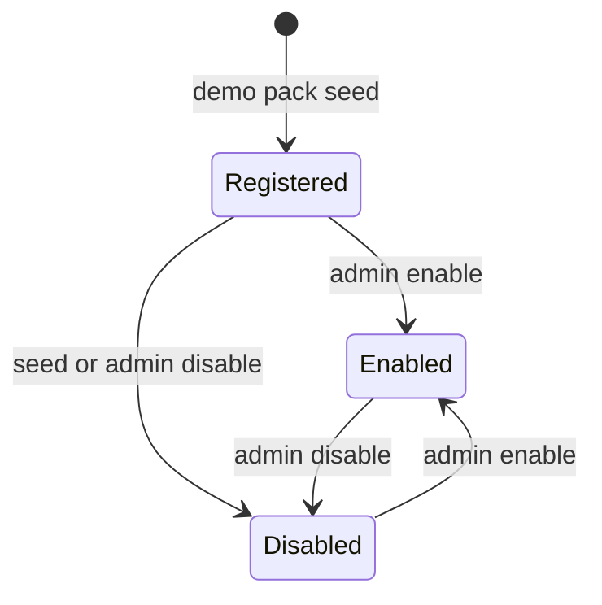
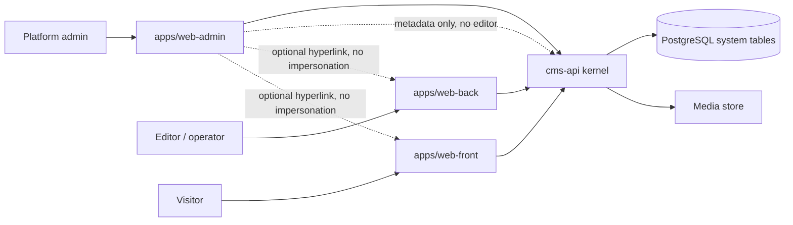
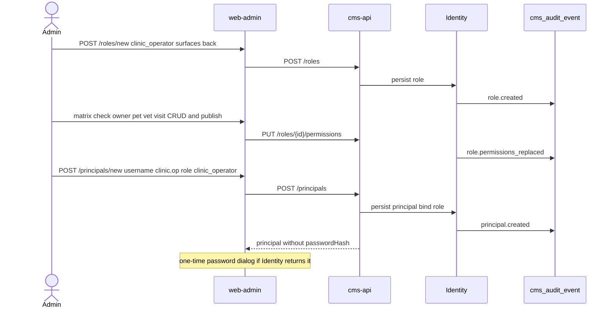
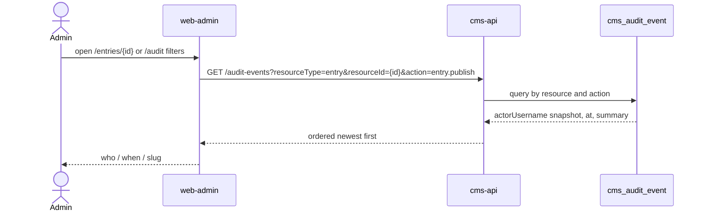
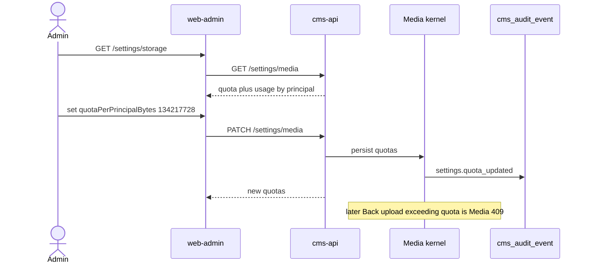
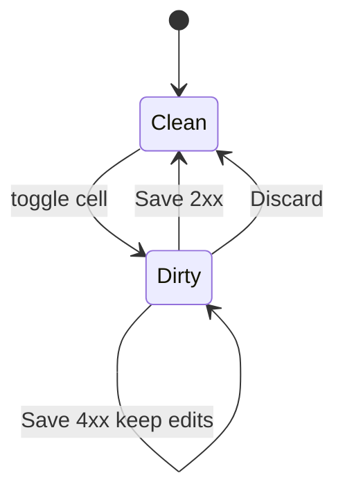

# Admin center — 治理面規格

狀態：Draft v0.1  
日期：2026-09-05  
車道：Admin（`apps/web-admin` IA owner）  
權威檔：本文件（只覆蓋治理面 IA / 路由 / 治理 API 使用方式）  
凍結總綱：`docs/sdd/00-overview.md`  
證據等級：

| 標記 | 含義 |
| --- | --- |
| **Decided** | 總綱已凍結，或本車道對 Admin UI / 治理流程給出可驗收契約 |
| **Proposed** | 本車道建議，合成窗口可改 |
| **Open** | 要 Content / Identity / Media / Demos / 實作波才能定 |

跨車道邊預設 **Open**。本檔標 **Decided** 的跨邊欄位，對端仍可能否決。

本車道不擁有日常 entry 編輯（Back）、公開渲染（Front）、內容原語、RBAC 引擎、媒體位元組。本車道擁有：治理資訊架構、`web-admin` 路由、類型登錄 **UI**、權限矩陣 **UI**、使用者治理、審計查詢、媒體配額與系統設定畫面。

---

## 1. Executive summary

Admin center 是**改系統的地方**，不是第三個內容編輯器，也不是 Front/Back 的皮膚切換。

| 層 | 這車道給它什麼 |
| --- | --- |
| Kernel | 把「類型啟停、角色矩陣、principal 治理、審計讀取、配額/保留期限、緊急覆寫」收成穩定的治理操作；不把 schema designer、impersonation、日常 CRUD 放進 kernel 寫入路徑。 |
| 操作面 | 獨立應用 `apps/web-admin`：自己的 shell、路由、空狀態、403。三面可共享 `packages/ui` 原語，**不得**共享「一個後台、兩個 menu」的 layout。 |
| Demo | 證明換 pack 不必重做治理台：相簿調的是 **kernel 配額 / 類型預設可見性**；clinic 調的是 **角色 × 類型矩陣**；projects 調的是 **成員與可見性預設**。Demo 專屬營業規則（班表最佳化、看板欄位）不進 Admin settings。 |

v1 一句話：**種子定義類型，Admin 只讀 schema 並啟停；矩陣授權；審計可查；危險操作有閘門；不做扮演。**

---

## 2. Scope / non-goals / 路徑所有權

### 2.1 In scope（v1）

- `apps/web-admin` 的資訊架構、路由樹、登入後 shell、空狀態、權限失敗、危險確認對話框。
- 內容類型登錄 **UI**：列表、唯讀欄位表、啟停、pack 批次啟停、類型級預設可見性與 surface 暴露。
- 角色與權限矩陣 **UI**（含系統角色 vs 自訂角色）。
- Principal 列表 / 建立 / 停用 / 指派角色（密碼雜湊與 session 不在本車道實作）。
- 審計查詢 UI（篩選、分頁、詳情；不可改寫事件）。
- 媒體配額與儲存設定 UI（後端仍是 Media）。
- 緊急治理：用 **metadata 檢視器** 查 entry、看誰發布、強制 unpublish / archive / 硬刪。不是編輯器。
- 治理操作對應的 API **使用契約草案**（資源、欄位、錯誤碼、action）。權威 OpenAPI 在實作波由 kernel 產出；本檔不得讓前端發明未記載欄位。

### 2.2 Non-goals（v1）

- 日常寫文章、上傳相簿排序、看診、搬 issue 卡（Back）。
- 公開 gallery / 里程碑頁 / 預約表單渲染（Front）。
- 熱新增內容類型、熱新增/改型/刪欄位的 schema designer。
- Impersonation / 「以某使用者檢視 Front/Back」。
- 把 Back 與 Admin 合成單一 SPA。
- GraphQL、外掛市場、完整 i18n、SSO、審批流、即時協同、全站搜尋。
- 生產物件儲存；S3 只顯示「介面存在、v1 未啟用」。
- 審計事件的人工刪除、稽核倉儲（WORM / SIEM）。
- Demo 專屬設定面板（診所班表規則、相簿浮水印、Jira 式工作流）。

### 2.3 路徑所有權

| 路徑 | 權限 |
| --- | --- |
| `docs/specs/surface-admin.md` | 本車道只寫 |
| `apps/web-admin/**` | 本車道擁有 IA；本輪不寫程式 |
| `packages/ui` | 共享原語；Admin **不得**把 Back shell 當治理 shell |
| `docs/sdd/00-overview.md` | 只讀 |
| 其他 `docs/specs/*` | 只讀；衝突寫進 Open questions |

**Decided（產品邊界，總綱已凍）：** 三個 Vite 應用。Admin 不是 Back 的 menu group。

**Decided（本車道 UI）：** `web-admin` 使用獨立 `AdminShell`。可 import `packages/ui` 的 Button / Table / Sidebar **primitive** / Dialog；不可 import `BackShell`、不可做 `mode=admin|editor` 切換。

---

## 3. 本車道必須拍板的 v1 決策

### 3.1 類型登錄：種子 + 啟停，不是熱新增

**Decided（Admin UI 契約）：** v1 **不是** Strapi Content-Type Builder。內容類型與欄位由 **demo pack 種子**寫入 `cms_content_type` / `cms_field`（系統表本身用 Flyway）。Admin：

| 可做 | 不可做 |
| --- | --- |
| 列出已登錄類型（含停用） | 建立新類型 |
| 唯讀檢視欄位 schema | 新增 / 改型 / 刪 / 重排欄位 |
| 啟用 / 停用單一類型 | 刪除類型（含 cascade） |
| 依 pack 批次啟停 | 把類型改名（slug 不可變） |
| 設定 `defaultVisibility`、`surfaces` | 把某個 demo 做成平行資料表 |

理由：總綱已規定「系統表用遷移、demo 類型用種子」。熱 schema 會逼 Content 做 runtime 欄位演進、既有 entry backfill、表單生成與 typed read model 同步，這不是 v1 可驗收切面。Kernel **擁有** registry 資料；Admin **操作**啟停，不擁有 schema 寫入。

若 Content 後日把 `POST /content-types` 列為 v1，對端可否決本節，Admin 再升級。**本車道建議 Content 不要這麼做。** `web-admin` v1 **不得出現「新增類型」按鈕**。

停用語意（**Proposed**，Content / Front / Back 可否決）：

- `enabled=false`：Front 當該類型不存在（列表隱藏；直連 URL **404**，不洩漏草稿）。
- Back：導航隱藏該類型；`create` / `update` / `publish` 回 **409 `TYPE_DISABLED`**（讓作業者知道去找治理面，而不是裝成 404）。
- 既有 entry **不刪**；重新啟用後 Front 依發布狀態恢復。
- Admin 永遠看得到停用類型。

### 3.2 權限矩陣 UI

**Decided（IA）：** 角色為一等公民。授權畫面是 **Directus 式矩陣**（列 = 內容類型，欄 = action），外加一組 **非類型綁定的 kernel action**。儲存是顯式 Save，不是每格 autosave。

細節見 §4.4 / §5.2。Predicate、action 名稱的權威在 Identity（跨邊 **Open**）。

### 3.3 審計

**Decided（本車道查詢契約）：** 記治理與發布結果事件；保留預設 90 天；Admin 只能查、不能改。見 §7。

### 3.4 危險操作

**Decided：** 刪類型 v1 禁止；硬刪媒體 / 硬刪 entry 要確認字串；禁止降權自己、禁止停用自己、禁止移除最後一位 admin。見 §8。

### 3.5 模擬 Front/Back

**Decided：** v1 **不做 impersonation**。「Admin 可進 Front / 可進 Back」是指 **同一 principal 的 surface 權限**，不是「變成某位 editor」。Header 可放「開啟 Front / Back」外連（可能要重新登入，視 Identity 的 cookie 域而定，**Open**）。不提供 `POST /impersonate`；探測該路徑必須 **404 `IMPERSONATION_NOT_SUPPORTED`**（或純 404）。Identity 若需要扮演才能測 predicate，對端可否決；本車道 v1 仍不做 UI。

### 3.6 緊急覆寫不是作業面

**Decided：** Admin 有 **Entry inspector**（metadata + 發布史 + 強制狀態變更 + 硬刪），**沒有** schema 驅動的欄位編輯器、沒有媒體選擇器、沒有 preview token 發行。Preview 是 Back 的產品。

---

## 4. 資訊架構

### 4.1 應用殼層

**Proposed（部署）：**

| App | 本機 |
| --- | --- |
| `apps/web-front` | `http://localhost:5173` |
| `apps/web-back` | `http://localhost:5174` |
| `apps/web-admin` | `http://localhost:5175` |
| `services/cms-api` | `http://localhost:8080` |

Cookie / CORS / CSRF 由 Identity 定（**Open**）。Admin 不假設三個 port 單點登入。

**Decided（誰能進）：** 除 `/login` 外，所有路由要求已認證且具備 Admin surface。非 admin 已登入者看到 **403 頁**，不渲染治理導航資料（類型列表、使用者 email 等）。anonymous → 重導 `/login?next=`。

Shell 結構（shadcn）：

- 左 **Sidebar**：§4.3 導航。
- 頂 **Header**：產品名「Admin center」、目前 principal、開啟 Front、開啟 Back、登出。
- 主區：麵包屑 + 頁標題 + 主操作。
- 不放「內容 / 媒體庫 / 看板」等作業入口。

**Decided（UI kit）：** 只用 shadcn/ui + Tailwind。本面主要 primitive：`Sidebar`, `Table`, `Badge`, `Switch`, `Dialog`, `AlertDialog`, `Form`, `Input`, `Select`, `Tabs`, `Card`, `Button`, `Checkbox`, `Progress`, `Pagination`, `Breadcrumb`, `Alert`, `Tooltip`, `DropdownMenu`, `Sheet`, `Separator`。禁止第二套 CSS 體系。

### 4.2 路由樹

Base path：`/` 屬於 `web-admin`（獨立 origin/port）。**Proposed** 不使用 `/admin` 前綴（那會像「同一個站的子目錄後台」）。

| 路徑 | 畫面 | 主要 action |
| --- | --- | --- |
| `/login` | 登入 | Identity 登入；無 admin surface 也允許提交，成功後再 403 |
| `/` | Overview | `read_audit`（小窗）+ 讀類型/配額摘要 |
| `/types` | 類型列表 | `manage_types` 讀；寫啟停要同一 action |
| `/types/:slug` | 類型詳情（唯讀 schema + 開關） | `manage_types` |
| `/roles` | 角色列表 | `manage_principals` |
| `/roles/new` | 建立角色 | `manage_principals` |
| `/roles/:id` | 角色詳情 + 權限矩陣 | `manage_principals` |
| `/principals` | 使用者列表 | `manage_principals` |
| `/principals/new` | 建立使用者 | `manage_principals` |
| `/principals/:id` | 使用者詳情 / 角色 / 停用 | `manage_principals` |
| `/audit` | 審計查詢 | `read_audit` |
| `/audit/:id` | 事件詳情 | `read_audit` |
| `/media` | 媒體治理（用量、硬刪，不是每日媒體庫） | `manage_media` + 硬刪見 §8 |
| `/media/:id` | 媒體 metadata + 硬刪 | 同上 |
| `/settings` | 系統設定索引 | `manage_settings`（**Proposed** 新 action） |
| `/settings/storage` | 配額與後端 | 同上 / `manage_media` |
| `/settings/audit` | 保留期限 | `manage_settings` |
| `/settings/security` | session 等 **唯讀** 指標 | 讀；寫入屬 Identity **Open** |
| `/entries` | 緊急 entry 索引（metadata） | 見 §6.6 |
| `/entries/:id` | Entry inspector | 同上 |
| `/403` | 權限失敗 | — |
| `/404` | 找不到 | — |

沒有：`/editor`, `/preview`, `/kanban`, `/gallery`, `/impersonate`, `/types/new`, `/types/:slug/fields/new`。

### 4.3 導航資訊架構（Admin ≠ Back）

**Decided：** Back 使用者 **看不到**「內容類型 / 角色矩陣 / 審計 / 系統設定」選單——那是 Back 規格的隔離義務。本車道對應義務：Admin **不放**「我的草稿 / 發布佇列 / 就診時間線 / 看板」。

Admin 主選單（順序固定）：

1. Overview  
2. Content types  
3. Roles & access  
4. Principals  
5. Audit  
6. Media & storage  
7. Settings  

Entry inspector **不進主選單**。從 Audit 的 resource link、Overview 的搜尋框、或 Settings 底下「Emergency entry lookup」進入，避免治理面長成內容後台。

### 4.4 畫面契約

#### Overview

- Pack 狀態卡：`album` / `petclinic` / `projects` → 已啟用類型數 / 總數。
- 配額條：global used / quota；≥80% 警告。
- 最近 10 筆審計（publish、角色變更、啟停、硬刪）。
- Principal 計數：admin / operator / editor / member。
- 警示：僅剩 1 位 admin、種子 pack 未載入（零類型）。
- 空狀態：無類型 → 「尚未載入 demo pack 種子。治理台可用，Front/Back 不會出現內容。」CTA 指向 `/types`（不能在 UI 裡「一鍵建立類型」）。

#### Content types

列表欄：pack、slug、display name、enabled、entryCount、publishedCount、surfaces、updatedAt。  
篩選：pack、enabled。  
列操作：Switch 啟停（先開確認 Dialog）。

詳情：

- 唯讀欄位表：`name`, `kind`, `required`, `repeatable`, `enumValues`, `refTarget`, `media` 約束。`kind` 由 Content 權威回傳；Admin 不發明新 kind。
- Switch：`enabled`。
- `defaultVisibility`：`listed` | `unlisted`（**Proposed** 名稱，Content 可改）。
- `surfaces`：`front`, `back` 核取。Admin 不是內容 surface。
- **沒有**「Add field」。

停用確認文案（測試可抓）：`停用後，Front 將隱藏此類型的已發布內容；資料不會刪除。目前 published = {n}。`

Pack 批次：列表頂部「Enable pack / Disable pack」。部分啟用顯示 `mixed`。

#### Roles & access（矩陣 IA）

角色列表：slug、display name、system badge、principalCount、surfaces。  
系統角色（總綱）：`anonymous`, `member`, `editor`, `operator`, `admin` — 不可刪、slug 不可改。可 **Clone** 成自訂角色（**Proposed**）。

角色詳情分三塊：

1. **Identity**：display name、description、`surfaces[]`（front/back/admin）。`anonymous` 的 surfaces 只有 front 且不可改。`admin` 預設三面，不可拿掉 `admin` surface。
2. **Matrix**（主畫面）：

   列分組：按 pack 摺疊（album / petclinic / projects / 未分組）。  
   欄（類型綁定，對齊總綱 action）：

   `read_published` | `read_draft` | `create` | `update` | `publish` | `unpublish` | `delete`

   另有 kernel 列（`contentType = null`）：

   `manage_media` | `manage_types` | `manage_principals` | `read_audit` | `manage_settings`（**Proposed**）

   儲存格：Checkbox。停用類型的列仍可授權（以便啟用後立即生效），但列視覺 dim。  
   **Proposed：** 每列右側 `predicate`：`none` | `own`。v1 不做任意 CEL/SQL predicate。Identity 可否決。

3. **Principals with this role**：連到使用者詳情。

矩陣 **Save** 是 `PUT` 整份 grants，不是 PATCH 單格，避免漏網。未存離開 → Dialog。

`operator` 系統角色 **預設零內容類型**（**Proposed**）。Clinic operator 的代表流程是：Clone 或新建 `clinic_operator`，再勾 `owner/pet/vet/visit`。不要讓「operator」自動擁有全部 demo。

#### Principals

列表：username、display name、status、roles、lastLoginAt。搜尋 username/displayName（v1 不含全文）。  
建立：username、displayName、email（可選）、`roleIds[]`。**不在 Git 寫密碼。** 建立成功後若 Identity 回一次性密碼，Dialog 顯示一次，關閉即不再能讀（**Open**，Identity 權威）。  
詳情：指派角色、停用/啟用、觸發密碼重設。  
禁止：在 UI 看到 `passwordHash`；把自己從 admin 移除；停用自己。

#### Audit

篩選：時間範圍、actorId、action、resourceType、resourceId、outcome。  
**Proposed：** 單次查詢時間窗最長 31 天，避免全表掃；可換頁向後。  
表格：at、actorUsername（snapshot）、action、resourceType、resourceId、outcome。  
詳情：before/after **摘要**（slug、state、role 名），不是完整 PII dump、不是密碼。  
空狀態：「這個時間窗沒有事件。」  
不可：刪除、編輯、手動 insert。

#### Media & storage

- Global quota progress。
- Per-principal usage 表（相簿 demo 的硬需求落在 **kernel 配額**，不是 album 專用設定頁）。
- 後端：`local` 唯讀；`s3` 標「port only, unused」。
- 硬刪入口：搜尋 media id → 確認 → 硬刪。這不是 Back 的媒體選擇器。

預設數字（**Proposed**，Media 可改但須寫進其規格）：

| 鍵 | v1 預設 |
| --- | --- |
| `quotaGlobalBytes` | 1073741824（1 GiB） |
| `quotaPerPrincipalBytes` | 268435456（256 MiB） |
| `maxUploadBytes` | 20971520（20 MiB） |

調低配額低於目前用量：**允許**；既有檔保留；新上傳由 Media 拒絕。Admin 顯示警告。

#### Settings

| 頁 | 寫入 | 備註 |
| --- | --- | --- |
| Storage | quota / max upload | Media 權威 |
| Audit retention | `30 \| 90 \| 365` 天 | 預設 90 |
| Security | 唯讀 session TTL、CORS origins | Identity |
| Navigation | v1 顯示「待 Content 決定 nav 是設定還是內容」 | **Open**，不假裝可編 |

**Decided（demo 設定政策）：** kernel settings **不成長 demo 專屬鍵**。診所班表、相簿浮水印、專案工作流欄位若需要，由 Demos 做成 content type（Back 編）或標 kernel gap。Admin 只啟停該類型。總綱裡 Admin 欄的「診所設定 / 班表規則」在 v1 **降級**：班表規則不是 kernel 設定；診所公開介紹是 Front/Back 的內容，不是治理鍵。

#### Entry inspector（緊急）

搜尋：id、slug、type。  
結果列：type、slug、state、updatedAt、publishedAt。**不含** body/markdown/照片牆。  
詳情：狀態、revision 計數（數字即可）、**發布史**（來自審計 `entry.publish` / `unpublish` / `archive` / `restore`）、動作：強制 unpublish、archive、硬刪。  
不發行 preview token。可外連 Back（同一人需自己有 Back 權限）。

### 4.5 空狀態、權限失敗、找不到

| 情況 | HTTP / UI | 行為 |
| --- | --- | --- |
| 未登入 | 302 → `/login` | `next` 只接受相對路徑 |
| 已登入非 admin | 403 頁 | 文案：「Admin center 只給平台治理。日常編輯請用 Back office。」可放 Back URL 純連結。不列出類型。 |
| admin 缺細項 action | 隱藏對應 nav + 該路由 403 | 例如無 `read_audit` 看不到 Audit |
| API 401 | 清 session → login | Identity 形狀 **Open** |
| API 403 | Toast + 保持頁 | 不把 403 裝成 404（治理面要讓 admin 知道被拒） |
| 類型 slug 不存在 | 404 頁 | — |
| 零類型 | Overview / Types 空狀態 | 見上 |
| 零審計 | 空表，不是錯誤 | — |
| 危險操作缺確認 | 400 `CONFIRMATION_REQUIRED` | Dialog 未填 `DELETE` |

Front 用 404 藏草稿；**Admin 不用 404 藏治理資源**，除非資源真的不存在。

---

## 5. 資料模型（治理面視圖）

本車道不擁有表。下列是 UI / 契約要綁的欄位。表名來自總綱。

### 5.1 類型

| 欄位 | 來源 | Admin 寫入 v1 |
| --- | --- | --- |
| `slug` | Content | 否（種子） |
| `displayName` | Content | 否 |
| `description` | Content | 否 |
| `pack` | Content / Demos：`album` \| `petclinic` \| `projects` \| null | 否 |
| `enabled` | Content | **是** |
| `defaultVisibility` | Content | **是**（Proposed 枚舉） |
| `surfaces` | Content | **是** `front`/`back` |
| `fields[]` | Content | 否 |
| `entryCount` / `publishedCount` | Content 聚合 | 否 |

類型生命週期（v1 無 Deleted）：



### 5.2 角色與授權

權限元組對齊總綱：**Decided（形狀，引擎屬 Identity）**  
`(principal, action, contentType?, predicate?)`

| 欄位 | 說明 |
| --- | --- |
| `role.slug` | 穩定鍵 |
| `role.system` | 系統角色不可刪 |
| `role.surfaces[]` | 哪些操作面可進 |
| `grant.action` | 見下 |
| `grant.contentType` | slug 或 null |
| `grant.predicate` | `none` \| `own`（Proposed） |

UI 需要 Identity 提供「角色矩陣讀寫」；Admin 不在瀏覽器拼 principal×permission。

### 5.3 Principal

| 欄位 | 備註 |
| --- | --- |
| `id`, `username`, `displayName`, `email` | email 可空 |
| `status` | `active` \| `disabled` |
| `roleIds[]` | 可多角色 |
| `lastLoginAt` | 可空 |
| `passwordHash` | **永不**進 Admin JSON |

種子帳號：文件只寫 username 與角色（例如 `admin` → `admin`）。密碼來自環境變數或啟動生成（Identity，**Open**）。本檔不放明文密碼。

### 5.4 審計事件

| 欄位 | 說明 |
| --- | --- |
| `id`, `at` | UUID / timestamptz |
| `actorPrincipalId` | 可空（anonymous 失敗登入） |
| `actorUsername` | snapshot，帳號改名後仍可讀 |
| `action` | 穩定點分隔字串 |
| `resourceType` | `content_type` \| `entry` \| `media` \| `principal` \| `role` \| `settings` \| `session` |
| `resourceId` | 可空 |
| `resourceSlug` | snapshot |
| `outcome` | `success` \| `denied` \| `failure` |
| `summary` | 短 JSON：state 前後、quota 前後。不含 secret |

### 5.5 設定

| 鍵 | 擁有 | Admin |
| --- | --- | --- |
| `media.backend` | Media | 讀 |
| `media.quotaGlobalBytes` | Media | 寫 |
| `media.quotaPerPrincipalBytes` | Media | 寫 |
| `media.maxUploadBytes` | Media | 寫 Proposed |
| `audit.retentionDays` | 本車道定義需求；實作歸 kernel | 寫 `30\|90\|365` |
| `security.*` | Identity | 讀 |

沒有 `clinic.hours`、`album.watermark`、`projects.workflow`。

---

## 6. 上下文與代表流程

### 6.1 系統上下文



### 6.2 流程 A — 啟停某個 demo 內容類型

代表：停用 `photo`（相簿仍在、單張類型從 Front 消失）。

```mermaid
sequenceDiagram
  actor Admin
  participant UI as web-admin
  participant API as cms-api
  participant CT as Content registry
  participant AUD as cms_audit_event
  Admin->>UI: GET /types/photo
  UI->>API: GET /content-types/photo
  API-->>UI: schema read-only plus enabled true
  Admin->>UI: toggle enabled false, confirm
  UI->>API: PATCH /content-types/photo
  API->>CT: set enabled false, keep fields and entries
  CT->>AUD: content_type.disabled
  API-->>UI: enabled false, publishedCount N
  Note over API: Front lists hide photo; direct URL 404
  Note over API: Back writes get 409 TYPE_DISABLED
```

**驗收錨點：** 停用後資料仍在 `cms_entry`；Admin 詳情仍能打開 schema。

### 6.3 流程 B — 建 operator 並授 clinic 類型



**驗收錨點：** 該 principal 不能進 `/types`（Admin 403）；不能 `publish` `album`（Back/API 拒）；能在 Back 建 `visit`（Identity/Back 測，本面只保證矩陣寫入）。

### 6.4 流程 C — 查誰發布了某 entry



Entry inspector 也列出同一資料，避免只會用審計進階篩選的人才能回答。

### 6.5 流程 D — 調相簿儲存配額

相簿沒有獨立「Album quota」頁。Admin 改的是 **kernel per-principal / global quota**（相簿 demo 最容易打滿）。



### 6.6 緊急覆寫（非日常）

Admin 對已發布且有害的 entry：inspector → 確認 → `force-unpublish` 或 `hard-delete`。寫審計。不打開 markdown 編輯器「改一點就上線」。

---

## 7. 審計：記什麼、留多久、怎麼查

### 7.1 必須記錄（成功與被拒都記 `outcome`）

| action | resourceType | 為什麼在 Admin 要看得到 |
| --- | --- | --- |
| `session.login_success` / `session.login_failure` / `session.logout` | session | 誰碰了治理面 |
| `principal.created` / `updated` / `disabled` / `enabled` | principal | 使用者治理 |
| `principal.roles_replaced` | principal | 授權 |
| `principal.password_reset_requested` | principal | 不含新密碼 |
| `role.created` / `updated` / `deleted` | role | 角色 |
| `role.permissions_replaced` | role | 矩陣 Save |
| `content_type.enabled` / `disabled` / `updated` | content_type | 啟停與可見性 |
| `entry.publish` / `unpublish` / `archive` / `restore` | entry | 「誰發布了」 |
| `entry.force_unpublish` / `entry.hard_deleted` | entry | 緊急覆寫 |
| `media.hard_deleted` | media | 危險 |
| `settings.quota_updated` / `settings.retention_updated` | settings | 配額 / 保留 |

**v1 不記：** GET、草稿 autosave、衍生圖生成、靜態 404。那些會把審計變成 access log。

寫入方是各 kernel（Identity/Content/Media）。**Open：** 哪份 kernel 規格擁有 `cms_audit_event` 的寫 API。Admin 擁有讀 UI。本車道 **Proposed：** Identity 提供統一 append；各模組呼叫。合成可改。

### 7.2 保留

| 項 | v1 |
| --- | --- |
| 預設 | 90 天 |
| Admin 可選 | 30 / 90 / 365 |
| 到期 | 背景工作刪 `at < now - retention`；**無 UI 單筆刪除** |
| 改 retention | 本身寫 `settings.retention_updated` |

**Proposed：** 縮短 retention 不立即真空掃；下一次 purge job 生效。不提供「立刻清空」。

### 7.3 查詢

`GET /audit-events` 必備 query：

- `from`, `to`（ISO-8601；**Proposed** 缺省 to=now、from=to-24h；跨度 >31d → 422）
- `actorId`
- `action`（精確匹配）
- `resourceType`, `resourceId`
- `outcome`
- `page`, `size`（size 最大 100）

排序：`at DESC, id DESC`。  
**Decided：** 無 `PATCH/DELETE /audit-events`（405 `AUDIT_IMMUTABLE`）。  
CSV export：**Proposed** 非 v1 必做。

硬刪之後事件仍在，靠 `resourceSlug` snapshot 與 `summary` 回答「刪過什麼」。

---

## 8. 危險操作

| 操作 | v1 | 閘門 | 失敗碼 |
| --- | --- | --- | --- |
| 刪除內容類型 | **禁止** | UI 無按鈕；`DELETE /content-types/{slug}` → 409 | `TYPE_DELETE_NOT_IN_V1` |
| 變更欄位 schema | **禁止** | 無編輯控件；寫入 → 409 | `TYPE_SCHEMA_IMMUTABLE` |
| 停用類型 | 允許 | Dialog 顯示 publishedCount；需按確認 | — |
| 硬刪媒體 | 允許 | 輸入字面 `DELETE` + slug/id；Checkbox「不可恢復」 | `CONFIRMATION_REQUIRED` |
| 硬刪 entry | 允許（緊急） | 同上 | 同上 |
| 軟刪 | 不是 Admin 日常；Back / 狀態機 | — | — |
| 降權自己（移除自己的 admin 角色） | **禁止** | 即使還有其他 admin | `SELF_DEMOTION_FORBIDDEN` |
| 停用自己 | **禁止** | — | `SELF_DISABLE_FORBIDDEN` |
| 移除最後一位 admin | **禁止** | 含停用最後 admin principal、刪其 admin 角色 | `LAST_ADMIN_FORBIDDEN` |
| 刪系統角色 | **禁止** | — | `SYSTEM_ROLE_IMMUTABLE` |
| Impersonation | **禁止** | 無路由 | `IMPERSONATION_NOT_SUPPORTED` |
| 改自己的角色集合 | **禁止** 透過「把自己從任意角色拿掉 admin」 | 其他欄位（displayName）可改 | 見上 |

確認契約（**Decided** 給 UI 與 API 測試）：

- Header 或 body：`confirmPhrase` 必須等於 `DELETE`。
- 另傳 `confirmId` 等於目標 id 或 slug。
- 缺一 → 400，不執行。
- 成功 → 201/204 + 審計 `outcome=success`。

硬刪是總綱允許的 admin 例外；Back 只有軟刪。硬刪後 Front 404；舊媒體 URL 行為由 Media 定（**Open**；Admin 只保證治理面不再列出該 id）。

---

## 9. API / UI 契約草案

Admin **消費 kernel REST**，不另開第四個後端。下列路徑是 **Proposed 前綴** `/api/v1`；精確路徑由擁有車道寫進 OpenAPI。本車道鎖定：**欄位集合、錯誤、action、禁止的操作。** 前端不得添加未記載欄位。

### 9.1 權限 action

總綱已有：`read_published`, `read_draft`, `create`, `update`, `publish`, `unpublish`, `delete`, `manage_media`, `manage_types`, `manage_principals`, `read_audit`。

| Action | 本車道用法 | 證據 |
| --- | --- | --- |
| `manage_types` | 讀 schema、啟停、defaultVisibility、surfaces | **Decided** 需要 |
| `manage_principals` | 使用者與角色矩陣 | **Decided** 需要 |
| `read_audit` | 審計查詢 | **Decided** 需要 |
| `manage_media` | 用量、硬刪媒體 | **Decided** 需要；是否全域 **Open** Media/Identity |
| `delete` | 軟刪語意屬 Content；Admin 緊急硬刪不夠用 | **Proposed** 增 `hard_delete` 或 admin 角色隱含 |
| `manage_settings` | 配額、retention | **Proposed** 新增；若 Identity 拒絕，v1 暫綁 `manage_media`+`read_audit` |
| `publish` / `unpublish` | 矩陣欄；Admin 緊急 force-unpublish **Proposed** 需要跨類型 unpublish，不經 Back 編輯器 | **Open** Identity/Content |

Admin 系統角色：上述治理 action 全開，外加三面 surface。**不因此在 Admin UI 畫出 entry 編輯器。**

### 9.2 資源與欄位

#### Content types

```
GET    /api/v1/content-types
GET    /api/v1/content-types/{slug}
PATCH  /api/v1/content-types/{slug}
```

`PATCH` body（僅這些可寫欄位）：

```json
{
  "enabled": true,
  "defaultVisibility": "listed",
  "surfaces": ["front", "back"]
}
```

讀取含 `fields[]`、`pack`、`entryCount`、`publishedCount`。  
禁止：`POST /content-types`、`DELETE /content-types/{slug}`、`POST .../fields`（Admin 客戶端不呼叫；呼叫則 409 如上）。

#### Roles

```
GET    /api/v1/roles
POST   /api/v1/roles
GET    /api/v1/roles/{id}
PATCH  /api/v1/roles/{id}
PUT    /api/v1/roles/{id}/permissions
DELETE /api/v1/roles/{id}
```

`PUT .../permissions` body：

```json
{
  "grants": [
    { "action": "read_published", "contentType": "owner", "predicate": "none" },
    { "action": "manage_media", "contentType": null, "predicate": "none" }
  ]
}
```

這是整份替換。空陣列 = 該角色無授權（`anonymous` 至少應有各 **enabled + front** 類型的 `read_published`，由種子保證；Admin 若存成空，**Proposed** Identity 拒絕 422 `ANONYMOUS_READ_REQUIRED`——**Open**）。

#### Principals

```
GET    /api/v1/principals
POST   /api/v1/principals
GET    /api/v1/principals/{id}
PATCH  /api/v1/principals/{id}
PUT    /api/v1/principals/{id}/roles
POST   /api/v1/principals/{id}/password-reset
```

`POST` 請求：`username`, `displayName`, `email?`, `roleIds`.  
`POST` 回應：principal 公開欄位；**可選** `initialPasswordOnce`（只此一次）。永不回 `passwordHash`。  
`PUT .../roles` 受 §8 閘門約束。

#### Audit

```
GET    /api/v1/audit-events
GET    /api/v1/audit-events/{id}
```

無寫入。

#### Settings / usage

```
GET    /api/v1/settings/media
PATCH  /api/v1/settings/media
GET    /api/v1/settings/media/usage
PATCH  /api/v1/settings/audit
GET    /api/v1/settings/security
```

`PATCH /settings/media`：`quotaGlobalBytes`, `quotaPerPrincipalBytes`, `maxUploadBytes?`（皆非負整數，byte）。  
`usage`：`globalUsedBytes`, `globalQuotaBytes`, `byPrincipal[{ principalId, username, usedBytes, quotaBytes }]`。

#### Media hard delete

```
GET    /api/v1/media/{id}
DELETE /api/v1/media/{id}?mode=hard
```

`mode=hard` 僅 Admin；缺確認欄位 400。Back 的軟刪不走此 query。**Open** Media 的精確動詞。

#### Governance entries

**Open** 路徑名稱。本車道需要的投影（**Decided 欄位，路徑 Proposed**）：

```
GET /api/v1/entries?projection=governance&q=&type=&state=
GET /api/v1/entries/{id}?projection=governance
POST /api/v1/entries/{id}/force-unpublish
POST /api/v1/entries/{id}/archive
POST /api/v1/entries/{id}/hard-delete
```

Governance JSON **不得**包含 field payload（caption、markdown、media 陣列）。只要：`id`, `slug`, `type`, `state`, `createdAt`, `updatedAt`, `publishedAt`, `revisionCount`。發布者從審計來，不複製一份易漂移的 `publishedBy` 欄——若 Content 已有 revision.actor，可 **Proposed** 附 `lastPublish` `{ at, actorUsername }`。

### 9.3 錯誤形狀（Proposed，Identity 權威）

```json
{
  "error": {
    "code": "SELF_DEMOTION_FORBIDDEN",
    "message": "You cannot remove your own admin role.",
    "details": {}
  }
}
```

| HTTP | 何時 |
| --- | --- |
| 401 | 未認證 |
| 403 | 已認證但缺 action / 非 admin surface |
| 404 | 資源不存在；impersonate 路由不存在 |
| 405 | 改審計 |
| 409 | 危險閘門、類型不可刪、schema 不可變、最後 admin、類型停用後的寫入 |
| 422 | 驗證、retention 非法、查詢窗過長、配額非整數 |
| 400 | 缺 `DELETE` 確認 |

治理面 **不**把 403 改寫成 404。

### 9.4 UI 狀態機（矩陣 Save）



---

## 10. 對三個 demo 的含義

Admin 對內容業務規則 **kernel 無感**。它只看見 pack 標籤與類型 slug。

| Demo | Admin 要提供的 | 明確不是 Admin 的 |
| --- | --- | --- |
| 個人相簿 | 啟停 `album`/`photo`；`defaultVisibility`；**kernel 儲存配額**（全球 + per principal）；使用者；審計誰發布了相簿 | 上傳排序、caption、封面挑選、lightbox、EXIF。沒有「Album settings」專頁 |
| Pet clinic | 啟停 `owner`/`pet`/`vet`/`visit`；**建 `clinic_operator` 並授這四個類型**；使用者 | 就診 CRUD、時間線、班表最佳化、電子病歷。班表規則 **不是** kernel setting；若 Demos 需要「診所簡介」，用 content type 在 Back 編 |
| 專案管理 | 啟停 `project`/`issue`/`milestone`；組織成員 = principals + 角色；專案 **類型級** 預設可見性 | 看板、指派、Gantt。issue 狀態是 Content field/enum，不是 Admin 工作流設計器 |

三個 demo 共用同一組畫面：Types / Roles / Principals / Audit / Storage。換 pack 種子不必改 Admin IA。這就是「可重複使用的 CMS kernel」在治理面的證明。

若 Demos 把 clinic 班表寫進 Admin settings，本車道 **拒絕**（標 kernel gap，不要後門 API）。

---

## 11. 跨車道邊表

| 邊 | 本車道登記 | 狀態 | 對端仍可能否決 |
| --- | --- | --- | --- |
| Content | 類型啟停、`defaultVisibility`、`surfaces`、停用後 Front 404 / Back 409、governance projection 無 field payload、v1 無熱 schema / 無刪類型 | 啟停 UI **Decided**；語意與路徑 **Open** | 是 |
| Content | Navigation 是否為 Admin 可編設定 | **Open** | 是 |
| Content | `pack` 欄位是否存在於類型列 | **Proposed** | 是 |
| Identity | 使用者與角色 UI；矩陣 `PUT` 整份 grants；`predicate=none\|own`；系統角色清單；surface 陣列；一次性密碼；session/CORS/CSRF；401/403 形狀 | UI **Decided**；引擎 **Open** | 是 |
| Identity | 新增 `manage_settings`、`hard_delete`；禁止 impersonate；self-demotion / last-admin | **Proposed** / 閘門 **Decided**（本面） | 是 |
| Identity | admin 進 Front/Back 是同一 cookie 還是分面重登 | **Open** | 是 |
| Media | 配額鍵與預設值、usage by principal、硬刪確認、後端 `local` 唯讀、軟刪是否佔配額 | 需求 **Decided**；數字與 URL **Open** | 是 |
| Media | `manage_media` 全域 vs 分類型 | **Open** | 是 |
| Front | 停用類型 = 公開不存在（404）；Admin 外連 Front 不帶 draft token | **Proposed** | 是 |
| Back | 停用類型 = 作業面 409；Back 無「內容類型」選單；Admin 無編輯器 / 無 preview 發行 | **Proposed** | 是 |
| Demos | 設定幾乎都不是 demo 專屬；配額是 kernel；clinic 班表不是 Admin；pack slug 與類型名 | **Decided** 政策 | Demos 可改顯示名，不可要求後門 API |
| Synthesis | 本檔與他車道衝突時以總綱三面分離為準 | — | — |

---

## 12. 驗收條件（Given / When / Then）

實作波應對到 API 測試（JUnit + Testcontainers）與 `apps/web-admin` 的 Vitest + Testing Library。不必本輪寫測試碼。

### A. 非治理角色進不了 Admin

**Given** 已認證 principal 僅有 `editor` 角色  
**When** `GET https://web-admin/types` 或 `GET /api/v1/content-types` 帶該 session  
**Then** UI 為 403 頁且不含類型表格；API 403 `FORBIDDEN`。不得 200 空列表假裝沒有類型。

### B. 啟停類型

**Given** 種子已登錄 `photo` 且 `enabled=true`，存在至少 1 筆 published `photo`  
**When** admin `PATCH /content-types/photo` `{ "enabled": false }`  
**Then** 200 且 `enabled=false`；審計有 `content_type.disabled`；entry 列仍在；Front 以該 slug 讀公開列表不再含它（Front 契約）；Back 對該類型 `POST` 得 409 `TYPE_DISABLED`。  
**When** 再 `enabled=true`  
**Then** Front 恢復已發布項。

### C. 禁止熱新增 / 刪類型

**Given** admin 已登入  
**When** UI 打開 `/types`  
**Then** 沒有「New type」控件。  
**When** `POST /api/v1/content-types` 或 `DELETE /api/v1/content-types/album`  
**Then** 404 或 409 `TYPE_DELETE_NOT_IN_V1` / `TYPE_SCHEMA_IMMUTABLE`（由 Content 定精確碼，但不得 201）。

### D. 建 clinic operator

**Given** 類型 `owner`,`pet`,`vet`,`visit` 已登錄；`album` 已登錄  
**When** admin 建立角色 `clinic_operator`（surfaces=`["back"]`），`PUT` grants 僅 clinic 四類型的 `read_draft,create,update,publish,unpublish,delete`（及必要的 `read_published`），再建立 principal `clinic.op` 只綁此角色  
**Then** 該 principal：Admin `/` → 403；對 `visit` 的被允許 action 由 Identity 判定為允許；對 `album` 的 `create`/`publish` 拒絕。回應無 `passwordHash`。審計含 `role.created`、`role.permissions_replaced`、`principal.created`。

### E. 查誰發布

**Given** principal `editor.a` 已成功 publish entry `E`  
**When** admin 打開 `/entries/E` 或審計篩選 `resourceType=entry&resourceId=E&action=entry.publish`  
**Then** 至少一列：actor 對應 `editor.a`（username snapshot）、時間、resourceSlug。治理 JSON 不含 entry 的 markdown/caption。

### F. 調配額

**Given** 預設 `quotaPerPrincipalBytes=268435456`  
**When** admin `PATCH /settings/media` `{ "quotaPerPrincipalBytes": 134217728 }`  
**Then** 200；審計 `settings.quota_updated` summary 含舊新值；`GET usage` 反映新 quota。後續超額上傳由 Media 拒絕（本面不測位元組寫入，只測設定寫入）。

### G. 硬刪閘門

**Given** media `M` 存在  
**When** `DELETE /media/M?mode=hard` 不含 `confirmPhrase=DELETE`  
**Then** 400 `CONFIRMATION_REQUIRED`，媒體仍在。  
**When** 帶正確確認  
**Then** 成功；審計 `media.hard_deleted`；之後 GET 該 id 404。

### H. 降權自己 / 最後 admin

**Given** 目前 session 是 principal `A` 且 `A` 是唯一 admin  
**When** `PUT /principals/A/roles` 去掉 admin，或 `PATCH` `status=disabled`  
**Then** 409 `LAST_ADMIN_FORBIDDEN` 或 `SELF_DEMOTION_FORBIDDEN` / `SELF_DISABLE_FORBIDDEN`（唯一 admin 時兩者皆可接受，但不得 200）。  
**Given** 另有 admin `B`  
**When** `A` 拿掉自己的 admin 角色  
**Then** 仍 409 `SELF_DEMOTION_FORBIDDEN`；須由 `B` 操作。

### I. 無 impersonation

**Given** 任意認證  
**When** `POST /api/v1/principals/{id}/impersonate` 或瀏覽 `/impersonate`  
**Then** 404（或 404 `IMPERSONATION_NOT_SUPPORTED`）。Admin header 的 Front/Back 連結不帶被扮演者 id。

### J. 審計不可變

**Given** 任一審計 id  
**When** `DELETE` 或 `PATCH /audit-events/{id}`  
**Then** 405 `AUDIT_IMMUTABLE`。

### K. 矩陣顯式儲存

**Given** 角色詳情頁改了一個 checkbox 未 Save  
**When** 導向其他路由  
**Then** UI 攔截（Dialog）。  
**When** Save  
**Then** 一次 `PUT /roles/{id}/permissions` 送出完整 grants。

### L. 空種子

**Given** 資料庫無 content types  
**When** admin 打開 Overview  
**Then** 空狀態文案出現，應用不崩潰；Types 表為空列表而非 500。

---

## 13. Open questions

1. Content 是否提供 `pack` 與 `publishedCount`？沒有則 Admin 用 Demos 靜態表對 slug 分組（易漂移）。  
2. `defaultVisibility` 的枚舉名（`listed/unlisted` vs `public/unlisted`）與 Front 列表行為。  
3. 停用類型時 Back 409 vs 404；本車道建議 409。  
4. Identity：`manage_settings` / `hard_delete` 是否新增；`predicate=own` 是否 v1。  
5. 建立 principal 的密碼傳遞（一次性回應 vs 外部 IdP vs 啟動列印到 log）。本車道拒絕 Git 明文。  
6. 三個 Vite port 的 cookie 域、CSRF header 名稱、CORS allowlist。  
7. Media：軟刪是否佔配額；硬刪後舊 URL 410 vs 404；usage API 路徑。  
8. `manage_media` 能否只授相簿而不授 clinic 附件。  
9. Governance projection 路徑與 Content 列表 API 如何避免 Back 誤拿到 admin-only 動作。  
10. 審計擁有者（Identity vs 獨立 kernel 模組）與登入失敗是否含 IP（個資）。  
11. Navigation 設定頁是否存在。  
12. 系統角色 `operator` 預設零類型 vs 種子綁定某個 demo（本車道建議零類型）。  
13. 強制 unpublish 是否重用 `unpublish` action 還是獨立 `force_unpublish`。  
14. Demos 若堅持「診所設定」在 Admin：合成窗口必須選（本車道投否決，改 content type）。

衝突策略：停在本檔，不改他人規格。以總綱「三面分離、種子類型、硬刪只在 admin」為準。

---

## 14. 實作波不該先做的事

1. **不要先做 schema designer**（拖欄位、熱新增 collection）。先種子 + 啟停。  
2. **不要先做 impersonation / 共用後台 layout。**  
3. **不要先做 Admin 裡的通用 entry 編輯器**（那會把治理面做回 wp-admin）。  
4. **不要先接 S3 當正確性依賴**；配額 UI 對 local disk 即可。  
5. **不要先做 GraphQL、外掛、i18n、SSO、郵件邀請、審批流、SIEM。**  
6. **不要先做審計即時 websocket 或全庫 CSV dump。**  
7. **不要先做欄位級 ACL、工作流設計器、班表最佳化。**  
8. **不要先把三個 app 合成一個 Vite 專案用路由切面。**  
9. **不要在沒有 Given/When/Then 的情況下做「儀表板美化」。** Overview 小卡夠用。  
10. **不要把 demo 專屬鍵寫進 `cms_setting` 當成捷徑。**

實作順序建議（非本輪）：Identity session → 類型 PATCH enabled → 角色矩陣 PUT → principal CRUD 閘門 → 審計 GET → 配額 PATCH → 硬刪確認 → inspector。每步都要有拒絕案例。

---

## 15. 本車道完成定義

- 本檔存在且非空：`docs/specs/surface-admin.md`。  
- 含 executive summary、scope、IA + ≥2 Mermaid、API/UI 契約、demo 含義、跨邊表、GWT 驗收、Open questions、實作波不要先做的事。  
- 已回答：類型登錄 v1、矩陣 IA、審計、危險操作、不做扮演。  
- 未寫應用程式碼、未改總綱、未改其他車道檔、未 commit / push。
