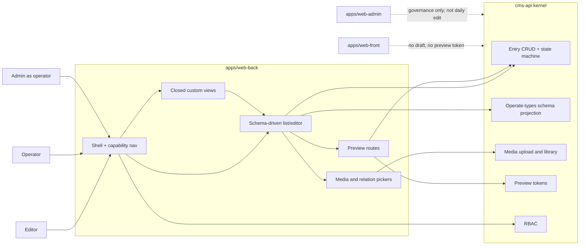
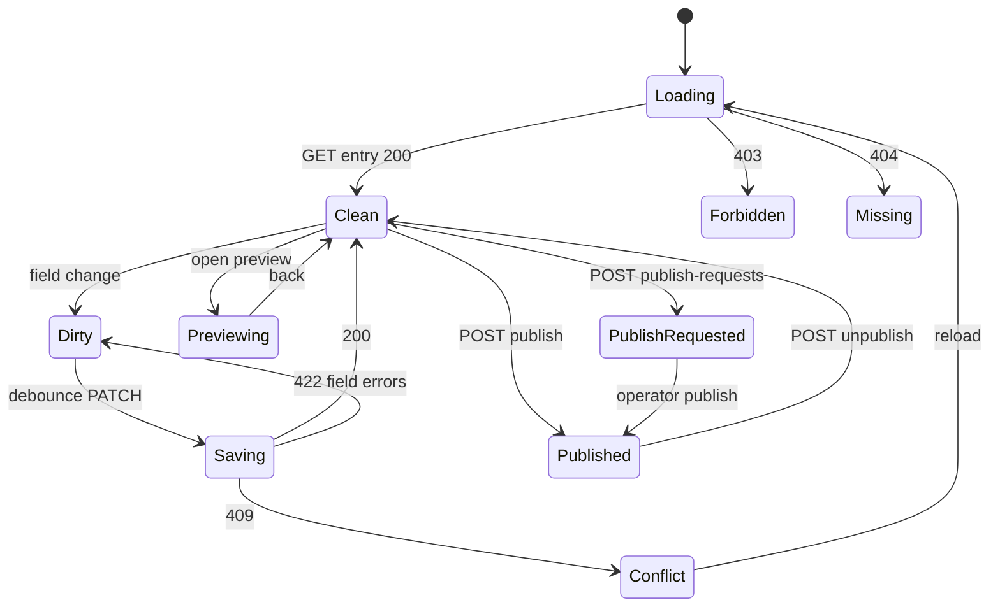
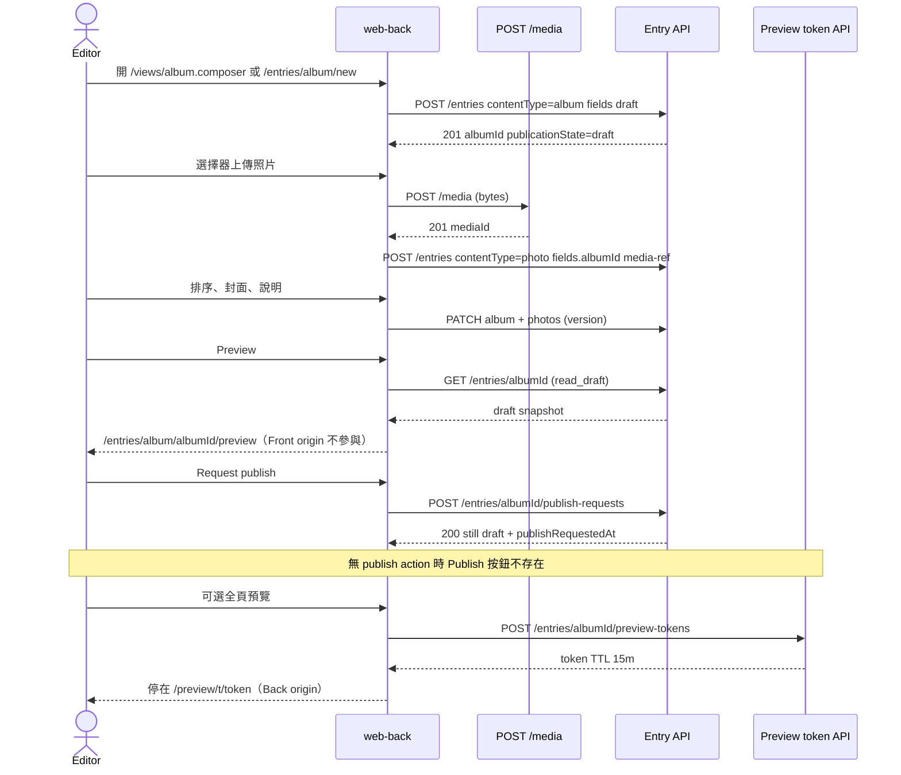
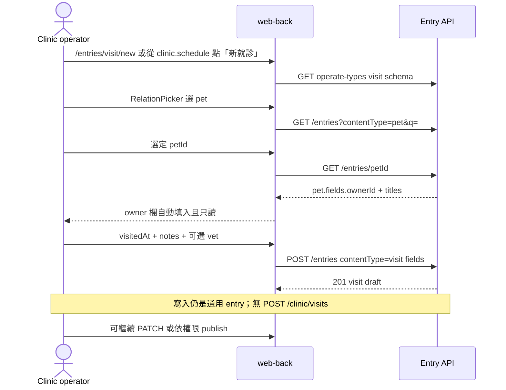
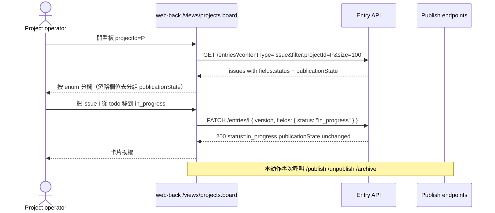

# Surface: Back office（作業面）

狀態：Draft v0.1  
日期：2026-09-05  
窗口：Back / Wave 2  
權威文件：本檔（只覆蓋 `apps/web-back` 的資訊架構、路由、編輯/preview/publish UI 契約）  
凍結總綱：[`docs/sdd/00-overview.md`](../sdd/00-overview.md)  
本輪只寫規格，不寫應用程式碼。

證據等級：

| 等級 | 含義 |
| --- | --- |
| **Decided** | 總綱已凍結，或本車道給出可驗收的 UI/路由契約 |
| **Proposed** | 本車道建議，合成窗口可改 |
| **Open** | 要 Content / Identity / Media / Demos / 實作波才能定 |

跨車道邊預設 **Open**。本檔標 Decided 的跨邊欄位，對端仍可能否決。

---

## 1. Executive summary

Back office 是編輯、獸醫、專案成員的**日常工作台**，不是系統設定台，也不是公開站。它證明：換一套內容類型與權限，不必重寫作業面骨架。

| 受眾 | 本車道給什麼 |
| --- | --- |
| **Kernel** | 作業面只消費通用 entry / media / preview-token / 權限 action；不要求按 demo 開後門 API。寫入永遠走 entry API。需要的是「可作業類型 + 欄位 schema」投影、欄位過濾、preview 快照、可選的 publish-request 旗標。 |
| **操作面** | `apps/web-back` 的殼、路由、導航隔離、schema 驅動的列表/篩選/表單、媒體選擇器、preview、提交發布。與 `web-front`、`web-admin` 分應用、分路由、分選單。 |
| **Demo** | 預設用通用編輯器。v1 只允許三張閉集自訂視圖：相簿編排、就診時間線、issue 看板。自訂視圖是 **web-back composition**，不是獨立 bounded context。 |

一句話：Back 把 content type registry 變成工作台；Admin 才把 registry 變成治理台。

---

## 2. Scope / non-goals / 路徑所有權

### 2.1 In scope（v1）

- `apps/web-back` 資訊架構、路由樹、殼層導航、空狀態、權限失敗行為。
- 通用 entry 列表、篩選、分頁、title contains 搜尋、建立/編輯表單如何由欄位 schema 驅動。
- Preview（in-app 與 token 全頁）以及如何不洩漏到 Front。
- Publish 與 Request publish 的按鈕顯隱、API 使用方式、失敗 UX。
- 媒體庫入口與表單內媒體選擇器（不擁有儲存）。
- 關係選擇器（ref → 目標 entry）。
- v1 閉集自訂視圖的 UI 契約與寫入約束。
- 本面使用的 OpenAPI tag `back` 資源草案（欄位不得與總綱衝突；權威仍以實作波 OpenAPI 為準）。

### 2.2 Non-goals（v1）

- 類型登錄、欄位熱新增、角色矩陣、使用者目錄、審計查詢、儲存配額、系統設定（Admin）。
- Front 主題、公開路由、SEO、訪客預約表單（Front）。
- RBAC 引擎、session/CSRF 實作、密碼哈希（Identity）。
- 內容狀態機原語、revision 儲存、系統表 DDL（Content）。
- 上傳位元組、衍生圖、公開 URL 策略（Media）。
- 把 Back 與 Admin 合成「一個後台、兩個 menu」。
- GraphQL、即時協同編輯、全站搜尋引擎、通知 inbox、排程發布、impersonation。
- 第四個操作面、按 demo 分三個 back 應用、按 demo 開專用 write API。

### 2.3 路徑所有權

| 路徑 | 本窗口 |
| --- | --- |
| `docs/specs/surface-back.md` | **只寫（權威）** |
| `apps/web-back/**`（實作波） | 本車道 IA 約束未來實作；本輪不創建 |
| `packages/ui` 中作業元件（實作波） | 可複用；不在本輪新增 |
| `docs/sdd/00-overview.md` | 只讀 |
| 其他 `docs/specs/*` | 只讀；衝突寫入 Open questions |

本輪 git 只應出現本文件的新增（外加既有 `docs/`、`README.md`、`AGENTS.md`）。不要 commit / push，除非使用者要求。

---

## 3. 必須回答的問題（本車道裁定）

### 3.1 通用 entry editor：schema 驅動到什麼程度

**Decided（本車道 UI）：** CRUD 的列表、篩選、表單、詳情檢查器 **全部**由 content type 的欄位 schema 驅動。Demo 不得為 `owner` / `album` / `issue` 各寫一套平行表單框架。

驅動範圍：

| 由 schema 決定 | 不由 schema 決定 |
| --- | --- |
| 欄位順序、必填、widget、校驗提示 | 應用殼、登入、導航生成規則 |
| 列表預設欄（`listable`） | 自訂視圖排版（看板、時間線、相簿編排） |
| 篩選器是否出現（`filterable`） | Preview 渲染選用哪套展示元件 |
| title 用於 `q=`（欄位 `role=title`） | 權限按鈕顯隱（由 action 決定） |
| ref / media-ref 開哪種子選擇器 | 發布狀態機本身（Content） |

**Decided（本車道）：** 每個可作業類型必須有且僅有一個 `role=title` 的 string 欄位，供列表標題與 `q` 搜尋。若 Content 用別的名字，Back 只認 role，不認死欄位名 `title`。

Widget 對欄位類型的綁定（欄位類型權威在 Content；下表是 Back 的消費契約，跨邊 **Open**）：

| 欄位類型（請求 Content） | Back widget | v1 備註 |
| --- | --- | --- |
| `string` | Input | slug 用同一 widget；不另做 SEO 面板 |
| `text` | Textarea | |
| `markdown` | Textarea | v1 不做 WYSIWYG |
| `integer` | Input number | |
| `boolean` | Checkbox | |
| `date` | Calendar + Popover | |
| `datetime` | 日期 + 時間 | clinic visit 硬依賴 |
| `enum` | Select；看板欄綁定此類型 | **不是** publication state |
| `ref` / `ref[]` | RelationPicker | 搜目標類型 title contains |
| `media-ref` / `media-ref[]` | MediaPicker | 見 §6.5 |
| `principal-ref` | PrincipalPicker | 指派用；類型本身 **Open**（見跨邊） |

未知欄位類型：表單渲染為只讀 JSON 警示，禁止靜默丟欄。驗收：schema fixture 含未登記類型時，畫面出現不可編輯佔位，保存不 strip 該鍵（除非 Content 規定未知鍵非法）。

### 3.2 哪些 demo 需要自訂視圖；composition 還是專用 query

**Decided（本車道）：** v1 自訂視圖是閉集，註冊在 `web-back` 的 **compile-time view registry**（前端組合），不是 kernel 外掛、不是 Admin 可熱插的模組。

| `viewKey` | Demo | 目的 | 讀 | 寫 |
| --- | --- | --- | --- | --- |
| `album.composer` | 個人相簿 | 封面、照片順序、說明，一次看完一本 album | 通用 `GET entries?contentType=photo&filter.albumId=` + album 本體 | `PATCH` album 與各 photo entry；上傳走 `POST /media` |
| `clinic.schedule` | Pet clinic | 某日/某週就診時間線 | 通用 `GET entries?contentType=visit&filter.visitedAtFrom/To=` | 新建/改 visit 仍 `POST/PATCH /entries` |
| `projects.board` | 專案管理 | 一專案的 issue 看板 | 通用 `GET entries?contentType=issue&filter.projectId=`，**前端按 enum 分組** | 挪卡 = `PATCH` 該 issue 的 **enum 欄位**，禁止碰 publication state |

**Decided（本車道）：** 自訂視圖預設是 **front-end composition**。只有當通用列表在關聯展示上不可接受時，才請求 Content 提供 **只讀 projection**。寫入路徑仍由 kernel entry API 擁有。

v1 明確 **不** 做的專用 write API 例子（禁止）：

- `POST /clinic/visits`
- `PATCH /issues/{id}/move`
- `PUT /albums/{id}/photos:reorder` 作為唯一寫入手段

Reorder 的合法寫法：對每個 photo `PATCH fields.sortIndex`，或對 album `PATCH fields.photoIds`（有序 `ref[]`）。兩種擇一由 Content/Demos 定；Back 兩種都能綁，但 UI 只實作 Demos 選定的那一種。

何時升級為只讀 projection（**Open** 向 Content，本車道登記需求）：

1. 時間線需要 pet/owner **顯示名** 且 N+1 不可接受 → `include=refTitles` 或 `GET /projections/clinic/schedule?date=`。
2. 看板需要跨頁全量卡片且 offset 分頁會切欄 → 允許 `size` 到 100；超過再談 projection。v1 demo 資料量必須能用 `size<=100` 裝完單一專案。

**不是自訂視圖：** 「我指派的 issue」「待發布草稿」——用列表篩選解決，不新開 `viewKey`。

### 3.3 看板狀態：enum field，不是 publication state

**Decided（本車道 UI 契約）：** 看板欄 = `issue` 上名為約定 `status` 的 **enum 欄位**（顯示名可由 Demos 改）。`publicationState` 只表示 draft / published / archived，**禁止**拿來當看板欄。

正交例子（驗收必須覆蓋）：

| 卡片 | `publicationState` | `fields.status` | Front 公開頁 | Back 看板 |
| --- | --- | --- | --- | --- |
| A | `published` | `todo` | 可見（若 Front 要展示 published issue） | 在 To do 欄 |
| B | `draft` | `done` | 不可見 | 在 Done 欄 |
| C | `archived` | `in_progress` | 不可見 | 預設看板過濾掉 archived；篩選可打開 |

挪卡：

- UI：拖放 **或** 每張卡上的 Select（無障礙與測試不依賴 DnD）。
- API：`PATCH /api/v1/entries/{id}` body 只改 `fields.status`（加 `version`）。
- 不得呼叫 `/publish`、`/unpublish`、`/archive`。

建議 enum（**Proposed**，Demos 可改 label，不得改「這是 field 不是 publication state」）：`todo | in_progress | blocked | done`。

跨 Content：**Open**（對端仍可否決欄位 slug；不可否決本面「欄 ≠ 發布狀態」的產品規則，除非總綱改狀態機）。

### 3.4 Preview：token + Back 獨立路由；不洩漏到 Front

**Decided（本車道）：**

1. Preview 是 Back 能力（Admin 緊急覆寫另見 Admin 規格；本面不連過去）。
2. Front 應用 v1 **沒有** `/preview` 路由，也 **沒有** `?preview=` 查詢參數契約。
3. 草稿 JSON 只經由帶 `read_draft` 的 session 或 **preview token** 取得；token 端點不屬於 public tag。
4. 兩種 UX，同一資料來源：

| 模式 | 路由 | 資料 | 用途 |
| --- | --- | --- | --- |
| 編輯器內預覽 | `/entries/:type/:id/preview` | session 下 `GET /entries/{id}`（含 draft） | 邊改邊看 |
| 全頁 token 預覽 | `/preview/t/:token` | `GET /api/v1/preview/{token}` | 去殼查看；可把 Back 源 URL 給另一位已登入且同樣有權的 operator |

**Proposed（token 規則，Identity/Content 可改數值，不可改「不掛在 Front」）：**

- `POST /api/v1/entries/{id}/preview-tokens` 需要對該 entry 的 `read_draft`。
- 回傳 `{ "token": "<opaque>", "expiresAt": "<iso>", "entryId": "<uuid>" }`。
- TTL 15 分鐘；單 entry；不可拿 token 列目錄、不可 mint 別人的 entry。
- Audience 僅 Back（及若 Admin 自建 preview，由 Admin 另登）。Front origin 呼叫 preview 端點必須失敗。
- Token 不是媒體位元組的長期簽名；草稿媒體 URL 仍受 Media 的未發布規則約束。

**如何保證不洩漏到 Front（可驗收）：**

| 層 | 規則 |
| --- | --- |
| 應用邊界 | 三個 Vite app。`web-front` bundle 不得包含 draft client、不得引用 `preview-tokens`。 |
| 路由 | `web-back` 獨有 `/preview/t/:token` 與 `/entries/.../preview`。 |
| API | 查詢層強制：public 只讀 `published`（Content 擁有）。Back 用另一組 tag。 |
| Token | `aud=preview` + origin allowlist。過期 410。 |
| 元件複用 | 可在 `packages/ui` 放展示元件，**只接受呼叫方已取回的 DTO**。Front 頁面自己打 public API；Back preview 把 draft DTO 灌進去。禁止 Front 頁面去讀 token。 |
| 媒體 | 未發布 album 的照片不可被猜 URL（Media；本面只要求選擇器與 preview 使用 API 回傳的 URL，不拼接公開靜態路徑）。 |

**Proposed：** 編輯器內預覽不強制 mint token（已有 session）。全頁預覽才 mint，避免每次按 Preview 都寫一筆 token 表。

### 3.5 列表頁：分頁、publication state、title contains

**Decided（本車道 UX）：**

| 能力 | v1 契約 |
| --- | --- |
| 分頁 | Offset：`page` 從 1、`size` 預設 20、最大 100。無無限滾動。 |
| 排序 | 預設 `updatedAt desc`。可改 `updatedAt` / `createdAt` / `title`。 |
| 發布狀態篩選 | 多選 `publicationState=draft,published,archived`。預設 `draft,published`（不含 archived、不含軟刪）。 |
| 搜尋 | 僅 title contains（大小寫不敏感）。**無**全文引擎、無 body 搜尋。參數名 `q`。 |
| 空 `q` | 不加 title 約束。 |
| 關係篩選 | 自訂視圖可傳 `filter.<fieldSlug>=<entryId>`。通用列表 v1 可只暴露 schema 標了 `filterable` 的 enum/ref。 |
| 待發布 | 若 Content 接受 `publishRequested` 旗標，列表可篩 `publishRequested=true`。否則用 `q` + draft 人工找。 |

列表列預設：title、publicationState badge、updatedAt；加上 `listable` 欄位。列不得發明 schema 沒有的欄。

### 3.6 與 Admin 的導航隔離

**Decided（本車道）：** Back 使用者（含碰巧有 admin 角色、但正在用 Back 的人）**看不到**內容類型、角色、使用者、審計、系統設定、儲存配額選單，也 **沒有**「打開 Admin」導航項。

導航只從下面生成：

1. 目前 principal 對之具有 `read_draft | create | update` 之一的內容類型（顯示名為 registry `label`）。
2. 自訂視圖：其 `primaryContentType` 對使用者可 `read_draft` 時才出現。
3. 若具有 `manage_media`，或至少一種類型具有 media-ref 且使用者可 `update` → 「媒體庫」。
4. 帳戶區：顯示名、角色 label、登出。可選外部連結「查看已發布站點」（Front origin，新分頁）。**零條** Admin origin 連結。

若 admin 角色進入 Back 但沒有任何可作業類型：Home 顯示空狀態「沒有可作業的內容類型」，**不**把類型登錄 UI 嵌進來。

`manage_types`、`manage_principals`、`read_audit` 在 Back **不產生任何導航資訊架構**。

---

## 4. 資訊架構

### 4.1 應用與來源

**Proposed（Identity 可改 port，不可把三面合成一 app）：**

| App | 本機 origin | 誰進來 |
| --- | --- | --- |
| `apps/web-front` | `http://localhost:5173` | anonymous / member |
| `apps/web-back` | `http://localhost:5174` | editor / operator / admin（作業時） |
| `apps/web-admin` | `http://localhost:5175` | admin（治理時） |
| `services/cms-api` | `http://localhost:8080` | 三面 |

Cookie/CORS 由 Identity 擁有。Back 假設：credentialed fetch、CSRF header、未認證一律送到本 app 的 `/sign-in`。

**Decided：** `member` 與 `anonymous` **不能**使用 Back。Clinic 飼主看自己的預約走 Front。Identity 若否決，在合成時改本句。

### 4.2 路由樹

**Proposed（路徑 slug 合成可改；資源形狀 Decided）：**

| 路徑 | 頁 | 未授權 |
| --- | --- | --- |
| `/sign-in` | 登入（Back 自己的殼，文案「作業台」） | 公開 |
| `/` | Home：可作業類型卡 + 最近草稿 + 註冊小工具 | 需登入 |
| `/entries/:type` | 通用列表 | 需對該 type `read_draft`（或僅 `create` 則空列表 + CTA） |
| `/entries/:type/new` | 通用建立表單 | `create` |
| `/entries/:type/:id` | 通用編輯 | `read_draft`；無 `update` 則只讀 |
| `/entries/:type/:id/preview` | 編輯器內預覽 | `read_draft` |
| `/views/:viewKey` | 閉集自訂視圖 | 視圖對應 type 的 `read_draft` |
| `/media` | 媒體庫 | `manage_media` 或可 update 含 media-ref 的類型 |
| `/media/:id` | 媒體詳情（檔名、引用該檔的 entry 列表若 API 提供） | 同上 |
| `/preview/t/:token` | 全頁 preview | 有效 token；過期 410 |
| `/forbidden` | 403 頁 | 已登入 |
| `/not-found` | 404 頁 | 已登入 |

不存在的路由（驗收：導航與路由表都沒有）：

- `/types`、`/content-types`、`/roles`、`/users`、`/audit`、`/settings`、`/admin`

未知 `:type` 或未知 `viewKey` → `/not-found`，不回退到 Admin。

深層連結：登入後回到 `returnTo`（必須是 Back 同源相對路徑，拒絕 `//` 與 Front/Admin origin）。

### 4.3 殼層與導航模型

```
+------------------------------------------------------------------+
|  Back office          [類型快速切換]     顯示名  角色  登出        |
+------------------+-----------------------------------------------+
| Home             |  面包屑：類型 / 標題                           |
| --- 內容 --------- |  [draft]  Preview  Request publish  Publish   |
| Albums           |-----------------------------------------------|
| Photos           |  主區：列表 | 表單 | 自訂視圖                    |
| Owners           |                                               |
| ...（權限過濾）    |                                               |
| --- 視圖 --------- |                                               |
| 相簿編排          |                                               |
| 就診行程          |                                               |
| Issue 看板        |                                               |
| --- 媒體 --------- |                                               |
| 媒體庫            |                                               |
+------------------+-----------------------------------------------+
```

類型快速切換（Command/Combobox）：只列出可作業類型。這不是 Admin 的類型登錄。

侧欄分組標簽「內容 / 視圖 / 媒體」是殼層文案，不是內容類型。

### 4.4 Home

**Proposed：**

- 「可作業類型」卡：來自 operate-types 投影，點進 `/entries/:type`。
- 「最近更新」：跨類型 `GET /entries?size=10`（僅權限內）。
- 「待我發布」：operator 且 API 支援 `publishRequested=true` 時顯示。
- Demo 小工具（有類型才掛）：今日 visit 數入口 → `clinic.schedule`；某專案看板入口 → `projects.board`。

無分析圖表、無 RBAC 摘要、無審計時間線。

### 4.5 通用列表

工具列：`q` 搜尋框、publication state 多選、建立按鈕（無 `create` 則隱藏）、分頁。

列操作：開編輯。批量操作 v1 不做。

空狀態：

| Given | Then |
| --- | --- |
| 有 `create` | CTA「建立第一條」→ `/entries/:type/new` |
| 無 `create` | 文案「沒有可檢視的條目」，無 CTA |
| 篩選結果為空 | 「沒有符合篩選的條目」，可清除篩選 |

### 4.6 通用編輯器

三欄（窄屏改為表單 + Sheet 檢查器）：

1. **表單：** schema 順序渲染 widget；debounce **Proposed 1s** 的 `PATCH`（建立成功後才 autosave）。
2. **檢查器：** `id`、contentType、publicationState、`version`、createdAt、updatedAt、publishRequestedAt（若有）、最後發布 revision 時間（若 API 給）。
3. **動作列：** 見 §4.7。

離開未儲存變更：Browser `beforeunload` + in-app 確認。

`version` 衝突：409 → 提示重新載入，不靜默覆蓋。欄位名 **Open** 向 Content（本面假設 JSON 頂層 `version` integer）。

軟刪：動作「移到回收」需 `delete`；二次確認。硬刪控件 **不存在**。Archive 若 Content 提供 transition：按鈕「封存」，成功後狀態 badge 變 `archived`。Archive 所需 action **Open** 向 Identity（本面暫映射為需要 `delete` 或明確的 archive 權限；無權限則隱藏）。

### 4.7 發布動作顯隱

| 權限 | 狀態 | 可見按鈕 |
| --- | --- | --- |
| `update` 無 `publish` | draft | Request publish、Preview |
| `publish` | draft | Publish、Preview；可同時有 Request（不必） |
| `unpublish` | published | Unpublish、Preview |
| `update` | published | 編輯欄位；保存改的是已發布 entry 的草稿語義 **Open** 向 Content（見 Open questions：v1 是原地改 published 還是強制衍生 draft） |
| 無 `update` | 任何 | 只讀 + Preview（若有 `read_draft`） |

**Proposed（Content 缺口）：** Request publish **不是**新的 publication state。`POST /entries/{id}/publish-requests`：

- 要求對該 entry `update`，且當前為 `draft`。
- 寫 `publishRequestedAt`、audit `publish_requested`。
- 狀態仍為 `draft`。
- 有 `publish` 的人列表可篩、可 Publish（成功後清旗標）或拒絕（**Proposed：** 拒絕 = 清旗標 + audit，不做 inbox）。

總綱 out of scope 含通知 inbox，故請求者看不到站內信；只在自己的條目檢查器看到「已請求發布」。

編輯者對 `/publish` 的直接呼叫：API 403；UI 不提供按鈕。

### 4.8 媒體選擇器與媒體庫

**Decided（入口 UX，儲存歸 Media）：**

- 表單上的 media-ref 以縮圖 +「選擇」打開 **Dialog**（shadcn Dialog），不離開編輯器。
- Dialog 兩個 Tab：資料庫 | 上傳。
- 資料庫：分頁縮圖、檔名 contains。點選後把 **media id** 寫回欄位；entry 尚未 PATCH 前只存在表單狀態。
- 上傳：`POST /api/v1/media` 得 id，再選中。不把 multipart 嵌進 entry（本面對齊「先媒體、再掛 entry」；若 Media 否決，改 widget 但不改「選擇器在 Back」）。
- `/media` 整頁庫：同一套網格，無「掛到當前 entry」的上下文。
- 相簿編排視圖允許一次多檔上傳，並為每檔建立/更新 `photo` entry。

未發布媒體的預覽縮圖必須走需授權的 URL；Back 不得把草稿圖寫成 Front 可匿名 GET 的路徑。

### 4.9 關係選擇器

Dialog：目標 `contentType` 來自欄位 schema。`q` title contains，列表可含 draft（呼叫者要有目標類型 `read_draft`）。選中寫入目標 entry id。

Visit 表單額外規則（**Proposed**，Demos/Content 可改實作細節）：

- 必填 `pet`。
- 選 pet 後，若 pet 帶 `owner` ref，自動填 owner 且只讀（仍提交該 id）。
- 若 API 不展開 owner，則 owner 必選手選，保存時若 Content 做一致性校驗，422 顯示在欄位上。

### 4.10 空狀態與權限失敗（產品級）

| HTTP / 情況 | Back UX |
| --- | --- |
| 未登入打任何作業路由 | 302 到 `/sign-in?returnTo=` |
| 401（session 過期） | 同登入；丟掉草稿前先 warn（若未存檔） |
| 403 | `/forbidden`。文案「沒有權限做這件事」。不提示去 Admin 開權限。 |
| 404 | `/not-found`。對已授權使用者可區分 403/404（作業面需要「這條被刪了」）。 |
| 409 | Toast + 保留本地，提供「載入服務器版本」。 |
| 422 | 欄位級錯誤；RFC 7807 `errors[].field`。 |
| 410 preview | 「預覽連結已過期」+ 回編輯器（若 session 仍能 `read_draft`）。 |
| 無任何可作業類型 | Home 空狀態，僅登出。 |

Front 用 404 藏草稿；Back **不用** 404 藏同一租戶內無權限的 entry（那是 403）。跨邊 Identity **Open** 僅限錯誤形狀欄位名。

### 4.11 shadcn/ui 元件（禁止第二套 UI kit）

殼與通用頁：`Sidebar`、`Button`、`Input`、`Textarea`、`Select`、`Checkbox`、`Table`、`Dialog`、`Sheet`、`DropdownMenu`、`Badge`、`Tabs`、`Card`、`Form`、`Toast`/`Sonner`、`Command`、`Calendar`、`Popover`、`Breadcrumb`、`Pagination`、`Avatar`、`Separator`、`Tooltip`、`ScrollArea`、`AlertDialog`。

看板：**Proposed** 用 Card 列 + 每卡 Select；拖放若做，僅允許 `@dnd-kit` 疊在同一套 Tailwind 上。禁止另引 CSS 框架、禁止自研 design token 體系。

---

## 5. 資料流與 Mermaid

### 5.1 操作面上下文



### 5.2 編輯器 UI 狀態



### 5.3 Sequence：相簿 draft → preview → 請求發布



### 5.4 Sequence：登記 visit（pet + owner）



### 5.5 Sequence：看板挪卡（enum，非發布狀態）



---

## 6. API / UI 契約草案

權威最終是 OpenAPI。下表是 Back **需要消費** 的形狀。未記載的欄位，前端不得發明。跨邊未鎖定前全部視為 **Open**（對端可改路徑，但不要拆掉本面列的能力）。

Base path：**Proposed** `/api/v1`。Content-Type `application/json`。錯誤：**Proposed** RFC 7807 `application/problem+json`。

### 6.1 權限 action（本面消費，不定義引擎）

| Action | Back 用途 |
| --- | --- |
| `read_draft` | 列表/編輯/preview |
| `create` | New |
| `update` | PATCH、Request publish、autosave |
| `publish` | Publish 按鈕 |
| `unpublish` | Unpublish 按鈕 |
| `delete` | 軟刪；暫亦用於 Archive 顯隱（Open） |
| `manage_media` | 媒體庫全權 |
| `read_published` | Back 不依賴它來藏草稿；作業列表以 draft 權限為準 |
| `manage_types` | **不使用** |
| `manage_principals` | **不使用**（指派見 assignable 缺口） |
| `read_audit` | **不使用** |

Preview mint：視為 `read_draft` 的一部分，不新增 action（**Proposed**）。

### 6.2 身份與殼

| 方法 | 路徑 | 用途 | 失敗 |
| --- | --- | --- | --- |
| GET | `/me` | 顯示名、角色、可做的 surface=`back` | 401 |
| POST | `/session` 或 Identity 指定的 login | `/sign-in` 提交 | 401 不洩漏使用者是否存在的細節（Identity） |
| POST | `/session/logout` | 登出 | |
| GET | `/me/content-types` | 可作業類型 + **完整欄位 schema**（widget 用） | 401；空陣列不是 403 |

`/me/content-types` 不得等於 Admin 的類型登錄 API：無建立欄位、無刪類型。若類型被 Admin 停用，從本列表消失（**Open** 向 Admin/Content：停用語義）。

登入頁不得嵌入 Admin 設定。種子帳號只引用 Identity 的 username/角色；本檔不寫密碼。

### 6.3 Entry

| 方法 | 路徑 | Back 需要的查詢/身體 | 權限 |
| --- | --- | --- | --- |
| GET | `/entries` | `contentType` 必填（Home 最近除外可省略）、`page`、`size`、`q`、`publicationState`、`sort`、`publishRequested`、`filter.<field>` | `read_draft` |
| POST | `/entries` | `{ contentType, fields }` → 201 `draft` | `create` |
| GET | `/entries/{id}` | 含 fields、state、version、ref 顯示名可選 `include=refTitles` | `read_draft` |
| PATCH | `/entries/{id}` | `{ version, fields }` 部分更新 | `update` |
| POST | `/entries/{id}/publish` | `{ version }` | `publish` |
| POST | `/entries/{id}/unpublish` | `{ version }` | `unpublish` |
| POST | `/entries/{id}/archive` | `{ version }` | Open |
| POST | `/entries/{id}/restore` | `{ version }` | Open |
| POST | `/entries/{id}/delete` | 軟刪 | `delete` |
| POST | `/entries/{id}/publish-requests` | 見 §4.7 | `update` |
| POST | `/entries/{id}/preview-tokens` | | `read_draft` |
| GET | `/preview/{token}` | 快照：entry + 解析後的媒體 URL + ref titles | 有效 token |

列表項最小欄位（**Proposed**）：

```json
{
  "id": "uuid",
  "contentType": "issue",
  "title": "Fix boarding UI",
  "publicationState": "draft",
  "fields": { "status": "todo", "projectId": "uuid" },
  "publishRequestedAt": null,
  "version": 3,
  "updatedAt": "2026-09-05T00:00:00Z"
}
```

Front 公開列表形狀本面不使用。Back 客戶端禁止呼叫 public tag。

### 6.4 只讀 projection（可選）

| 方法 | 路徑 | 何時需要 |
| --- | --- | --- |
| GET | `/projections/clinic/schedule?date=` | visit 日視圖在通用 filter 不足時 |
| GET | `/projections/projects/board?projectId=` | 僅當單一專案 issue > 100 且分頁破壞看板 |

v1 demo **先不依賴**這兩條。有的話 Back 可改讀；沒有則 composition。寫入仍禁止走 projection。

### 6.5 Media（選擇器）

| 方法 | 路徑 | 用途 |
| --- | --- | --- |
| GET | `/media` | `page`、`size`、`q` 檔名 contains |
| POST | `/media` | 上傳；回 id、mime、thumbnailUrl（授權） |
| GET | `/media/{id}` | 詳情 |
| POST | `/entries/{id}/attachments` | 若 Media 用 attachment 表；否則 media id 只活在 entry fields |

本面不規定磁盤路徑、S3、衍生尺寸數值。

### 6.6 Assignable principals（缺口）

看板「指派」需要搜人，但不能給 Back `manage_principals`。

**Open 向 Identity：** `GET /principals/assignable?contentType=issue&q=` 回 `{ id, displayName }[]`，僅含對該類型有作業權限的人。失敗應為 403（無 `update` 該類型）而非打開使用者治理清單。

若 Identity 拒絕新端點：Demos 把 assignee 做成 string 顯示名，失去真正指派。本面不退讓為「把 Admin 使用者頁嵌進 Back」。

### 6.7 錯誤形狀（Proposed）

```json
{
  "type": "https://cms.local/problems/validation",
  "title": "Validation failed",
  "status": 422,
  "detail": "pet is required",
  "errors": [{ "field": "fields.petId", "code": "required", "message": "必填" }]
}
```

| status | 何時 |
| --- | --- |
| 401 | 無 session |
| 403 | 缺 action（含 editor 呼叫 publish） |
| 404 | entry 不存在或已硬刪 |
| 409 | version |
| 410 | preview token 過期/撤銷 |
| 413 | 上傳過大（選擇器顯示 Media 的訊息） |
| 415 | MIME 不在 allowlist |
| 422 | schema 校驗、ref 不一致 |

### 6.8 View registry（前端，非 kernel 資源）

**Decided：** 不把視圖登錄進資料庫，避免外掛抽象。

```text
viewKey            path                      primaryContentType
album.composer     /views/album.composer     album
clinic.schedule    /views/clinic.schedule    visit
projects.board     /views/projects.board     issue
```

未知 key → 404。Demo 若新增第四個視圖，須改本規格與合成，不得在實作波私加。

---

## 7. 對三個 demo 的含義

Kernel 對「相簿/寵物/issue」無感。含義全部是 **類型包 + 視圖註冊 + 權限**。下表類型名是對 Demos 的建議 slug，Demos 可改顯示名。

### 7.1 個人相簿

| 項 | 含義 |
| --- | --- |
| 通用面 | `album`、`photo` 列表/表單足夠做 caption、封面 media-ref、album ref |
| 自訂視圖 | **要** `album.composer`：上傳、排序、封面、說明 |
| Preview | 預覽一本 album 的草稿牆；Front 同源路由不參與 |
| 發布 | 編輯者 Request publish；有 `publish` 的人發 album（photo 隨 album 還是獨立 publish **Open** 向 Content/Demos） |
| 媒體 | 選擇器 + 多檔上傳是本 demo 硬依賴 |
| 不在 Back | 公開 lightbox、訪客留言 |

代表流程見 §5.3，對應驗收 AC-ALBUM-01。

### 7.2 Pet clinic

| 項 | 含義 |
| --- | --- |
| 通用面 | `owner`、`pet`、`vet`、`visit` CRUD |
| 自訂視圖 | **要** `clinic.schedule`（作業面大於展示面的證明） |
| 關聯 | visit 表單用 RelationPicker；寫入仍是 ref id |
| 飼主 | **不進 Back**；member 看自己的預約在 Front |
| 班表規則、診所設定 | Admin，不在本面 |
| 不在 Back | 排班最佳化、完整電子病歷、計費 |

代表流程見 §5.4，對應驗收 AC-CLINIC-01。

### 7.3 專案管理

| 項 | 含義 |
| --- | --- |
| 通用面 | `project`、`milestone`、`issue` CRUD |
| 自訂視圖 | **要** `projects.board` |
| 工作項狀態 | **enum field**；與 publication state 正交 |
| 指派 | PrincipalPicker + assignable API（Open） |
| 公開進度 | Front 只讀 published；Back 看板可含 draft |
| 不在 Back | Gantt、即時多人拖卡、把看板做成獨立微服務 |

代表流程見 §5.5，對應驗收 AC-BOARD-01。

### 7.4 三 demo 共享的骨架（可複用證明）

同一套：登入殼、能力導航、schema 表單、列表篩選、preview token 流程、媒體選擇器、403/空狀態。換類型包只多註冊最多一張自訂視圖，不換權限模型。

---

## 8. 跨車道邊表

| 邊 | 本車道登記 | 證據 | 對端仍可否決 |
| --- | --- | --- | --- |
| **Content** | 可作業類型 + 欄位 schema 投影；`role=title`；listable/filterable；`q` title contains；offset 分頁；`filter.<field>`；`include=refTitles`；preview 快照形狀；`version` 樂觀鎖；publish-request 旗標非新狀態；看板用 enum 而非 publicationState；自訂視圖只讀 projection 可選 | 需求 **Open**；UI 規則 **Decided** | 是（路徑/欄位名）；否決「欄≠發布狀態」需總綱級理由 |
| **Identity** | editor：CRUD+preview，publish 可關；operator：該 demo 作業類型全套含 publish；member/anonymous：禁止進 Back；admin 可進但不給治理選單；preview token audience；CSRF/CORS/port；`GET /principals/assignable`；403 vs 401 | **Open** | 是 |
| **Media** | 選擇器：先 `POST /media` 再寫 entry；Dialog 不離頁；草稿縮圖需授權 URL；檔名 contains 列表 | **Open** | 是（若改成嵌在 entry 的 multipart，widget 跟著改） |
| **Front** | 零條草稿路由；禁止 `?preview=`；展示元件可共享但 DTO 由呼叫方注入；Back 可外部連結「查看已發布站點」 | 本面 **Decided** 不洩漏；Front 路由 **Open** | Front 不得以「方便預覽」把 token 接到公開 app |
| **Admin** | **沒有**導航連過去。類型登錄/帳號/審計/配額不出現。Admin 日常寫內容應使用 Back，而不是在 Admin 做第二套編輯器（本面建議，Admin **Open**） | **Decided** 隔離 | Admin 可做緊急覆寫，但不得要求 Back 開治理選單 |
| **Demos** | 閉集三視圖；類型 slug 建議；visit 自動填 owner；issue.status enum；album 排序欄位二選一；種子角色必須能走三條代表流程 | **Open** | 是（顯示名、欄位數）；不可把第四視圖當 v1 預設 |

---

## 9. 驗收條件（Given / When / Then）

實作波應對到 Vitest + Testing Library（導航、按鈕顯隱、表單 schema fixture）以及 API 契約測試。不依賴人工點擊 e2e 也可先紅綠下列行為。

### AC-NAV-01 沒有內容類型選單

- **Given** 已登入 editor 或 operator（甚至 admin 角色但 session 的 surface 是 Back）
- **When** 渲染殼層導航
- **Then** 不出現「內容類型」「角色」「使用者」「審計」「系統設定」「儲存配額」「Admin」連結
- **And** 侧欄類型項僅來自 `/me/content-types`

### AC-NAV-02 無權限類型不出現

- **Given** 使用者只有 `album`/`photo` 的 `update`
- **When** 打開 Home
- **Then** 無 `visit`、`issue` 導航，直接打 `/entries/visit` 得 403 頁

### AC-AUTH-01 member 進不了 Back

- **Given** member session
- **When** GET Back `/` 或 `/entries/album`
- **Then** 401/403，不渲染作業列表

### AC-FORM-01 schema 驅動

- **Given** 測試 fixture 類型 `widget_probe` 含 string、enum、ref、media-ref 各一
- **When** 打開 `/entries/widget_probe/new`
- **Then** 出現對應 Input、Select、RelationPicker 入口、MediaPicker 入口
- **And** 畫面沒有寫死「Album title」之類 demo 文案

### AC-LIST-01 篩選與搜尋

- **Given** 同類型 3 筆 draft、2 筆 published、1 筆 archived；其中 title 含 `Sunset`
- **When** 預設打開列表
- **Then** 請求 `publicationState` 不含 archived，且看不到那 1 筆
- **When** `q=Sunset` 且狀態含 draft
- **Then** 只回 title contains `Sunset` 的子集
- **And** `page=1&size=20` 被送出

### AC-PUB-01 editor 不能直接 publish

- **Given** editor 對 `album` 有 `create`/`update`/`read_draft` 無 `publish`
- **When** 打開該 album 編輯器
- **Then** 無 Publish 按鈕，有 Request publish 與 Preview
- **When** 客戶端仍 POST `/publish`
- **Then** 403

### AC-PREV-01 預覽不進 Front

- **Given** draft album
- **When** 使用者按 Preview
- **Then** 停在 `web-back` 路由 `/entries/album/:id/preview` 或 `/preview/t/:token`
- **And** 網絡紀錄不含 Front origin，且不含 public entries API
- **When** token TTL 過期
- **Then** 410 頁，Front 公開 URL 仍 404/隱藏

### AC-ALBUM-01 上傳編排請求發布

- **Given** editor 已登入 Back
- **When** 建立 album draft、上傳兩張圖掛成 photo、排序、開 preview、Request publish
- **Then** album 仍為 `draft` 且 `publishRequestedAt` 有值（或等價 audit）
- **And** Front 匿名仍不可見

### AC-CLINIC-01 登記 visit

- **Given** 已存在 published 或 draft 的 owner O 與 pet P（P.ref owner=O），operator 有 visit `create`
- **When** 新建 visit 只選 P、填 datetime
- **Then** POST `/entries` `contentType=visit` 且 fields 含 petId 與 ownerId
- **And** 不存在 `POST /clinic/visits`

### AC-BOARD-01 挪卡改 enum

- **Given** issue `publicationState=published` 且 `fields.status=todo`
- **When** 在 `/views/projects.board` 把該卡改到 `in_progress`（Select 或拖放）
- **Then** 唯一寫入是 `PATCH /entries/{id}`，body 含 `status=in_progress`
- **And** `publicationState` 仍為 `published`
- **And** 零次 publish/unpublish

### AC-BOARD-02 草稿也可在看板

- **Given** issue `publicationState=draft` `status=done`
- **When** 打開看板（預設篩選含 draft）
- **Then** 卡片在 Done 欄
- **And** Front 公開進度頁仍不可見該 issue（本條與 Front 對測）

### AC-MEDIA-01 選擇器不離頁

- **Given** 編輯器開著未儲存變更
- **When** 打開 MediaPicker 上傳並選一檔
- **Then** 路由仍為 `/entries/:type/:id`，Dialog 關閉後 media id 在表單中
- **And** 未保存前 GET entry 可仍無該 id（除非 autosave 已成功）

### AC-ISO-01 禁止治理 API

- **Given** Back 已載入
- **Then** 客戶端模組不呼叫類型登錄、角色矩陣、審計查詢、配額設定端點（契約測試：bundle/API allowlist）

### AC-EMPTY-01 無可作業類型

- **Given** 已認證但 `/me/content-types` 為空
- **When** 打開 `/`
- **Then** 空狀態無「建立內容類型」CTA

---

## 10. Open questions

1. **Published entry 的再編輯：** 保存是原地改 published，還是自動長出新 draft revision？總綱說每次 publish 留快照。Back 暫定：有 `update` 就可 PATCH 已發布欄位，下次 Publish 再打快照；若 Content 要「published 不可原地改」，編輯器需切「建立新草稿」按鈕。
2. **Photo 與 album 的發布粒度：** 發 album 是否級聯發 photo？未發布 album 下的 photo 可否單獨 published？（Media/Content/Demos）
3. **Album 順序：** `photo.sortIndex` 還是 `album.photoIds[]`？
4. **`principal-ref` 是否進入 Content 最小欄位集？** 若否，指派如何做？
5. **`GET /principals/assignable`：** Identity 是否接受，避免 Back 碰到使用者治理 API。
6. **Archive 用哪個 action？** 總綱有 archive 狀態但 action 表無 `archive`。
7. **軟刪列表：** v1 Back 是否提供「回收筒」篩選，還是只在 API 留 `deletedAt`、UI 不做。
8. **Preview 快照 vs 即時 draft：** token 解出來是 mint 當下拷贝，還是讀最新 draft？本面傾向最新 draft + 過期 token。
9. **Operate-types 是否包含停用類型？** Admin 停用後 Back 應消失。
10. **Clinic visit 預設 publicationState：** 作業紀錄是否永遠 draft，只把「飼主可看的預約」publish？Demos 決定；Back 兩種都支援。
11. **看板 WIP 上限、泳道、多人同時拖：** v1 明確不做；若 Demos 寫進範圍，標 kernel gap 而非本面偷偷做 WebSocket。
12. **UI 文案 locale：** 殼層用 zh-Hant 或 en？本面 **Proposed** 殼層 en identifier + zh-Hant 使用者文案；合成可改單一 locale。
13. **同 origin 不同 path 而非不同 port：** 若 Identity 選 ` /front` `/back` `/admin` 同 host，路由表前綴要加 `/back`。本面路徑是 app 內相對路由，不含 host。
14. **Revision 瀏覽：** v1 檢查器只讀「上次發布時間」是否夠，還是要只讀列表。不做 diff UI。
15. **Request publish 是否值得開 Content 欄位：** 若合成砍掉旗標，editor 只能口頭通知——與「代表流程 1」衝突，本面不建議砍。

---

## 11. 實作波不該先做的事

1. **先做三張自訂視圖，卻還沒有 schema 驅動的列表/表單。** 骨架證明失敗。
2. **為 clinic/projects 寫專用 Spring controller。** 視圖再漂亮也是後門。
3. **在 `web-front` 做 `?preview=true`。** 草稿會漏進公開 bundle 與快取。
4. **把 Admin 選單 feature-flag 進 Back。** 違反總綱「不是一個後台兩個 menu」。
5. **看板用 `publicationState` 當欄。** 與公開進度頁纏死，專案 demo 會變成單租戶玩具。
6. **WYSIWYG、即時協同、全文搜尋、通知 inbox、排程發布、impersonation。**
7. **自研 CSS 體系或第二套 UI kit。**
8. **在本輪（規格波）建立 `apps/`、`services/`。**
9. **為假想第四個 demo 做視圖插件 API。** 閉集三視圖寫死即可。
10. **把 member 飼主塞進 Back 當「極窄作業」。** 飼主走 Front；Back 保持員工工作台。

---

## 12. 實作波建議順序（非本輪交付）

僅指導後續，不構成本窗口完成定義。

1. `web-back` 殼：登入、能力導航、403/空狀態、零 Admin 連結。
2. operate-types schema → 通用列表（分頁/狀態/`q`）→ 通用編輯器 widget 全集。
3. MediaPicker + RelationPicker。
4. Preview session 頁 + preview token 頁。
5. Publish / Request publish 顯隱與 403。
6. 最後才掛 `album.composer`、`clinic.schedule`、`projects.board`，且寫入仍只接步驟 2 的 API。

完成定義（本窗口）：本文件存在且非空，覆蓋共享契約九段，並裁定 schema 驅動程度、自訂視圖閉集與 composition 規則、preview 隔離、列表契約、Admin 導航隔離、看板狀態歸屬。
