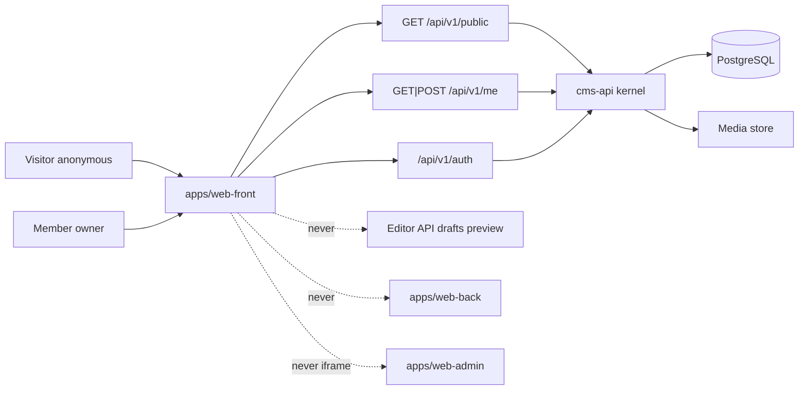
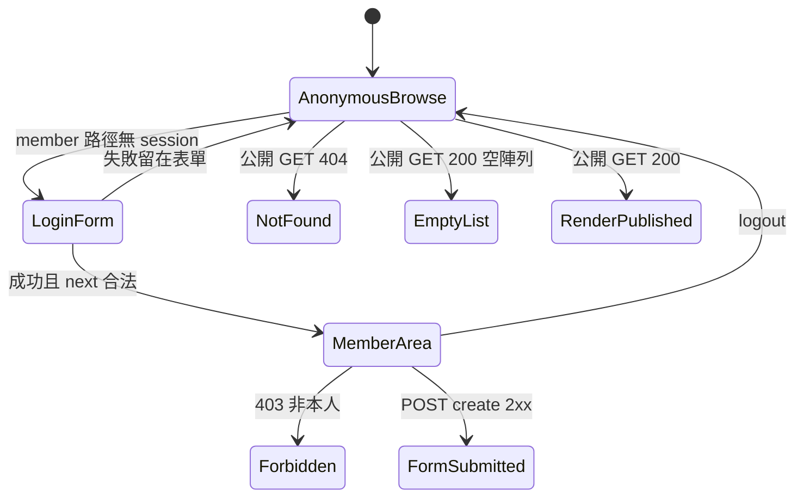
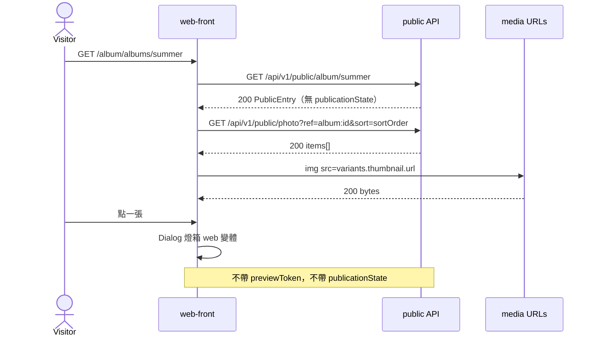
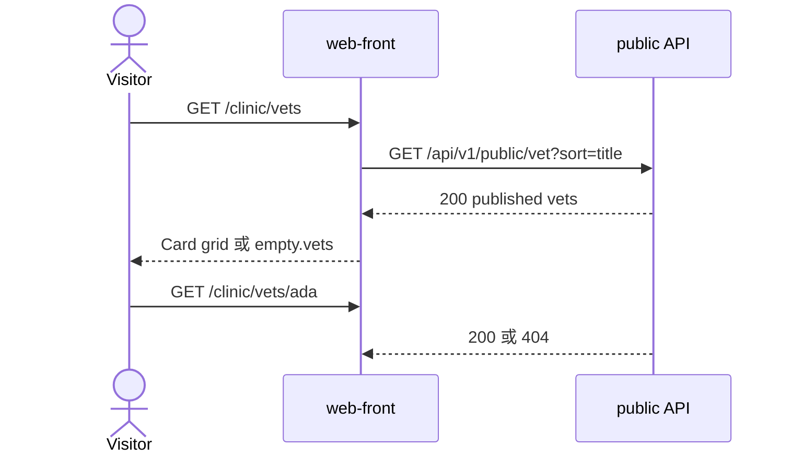
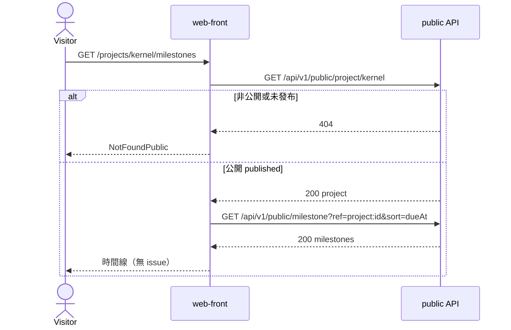
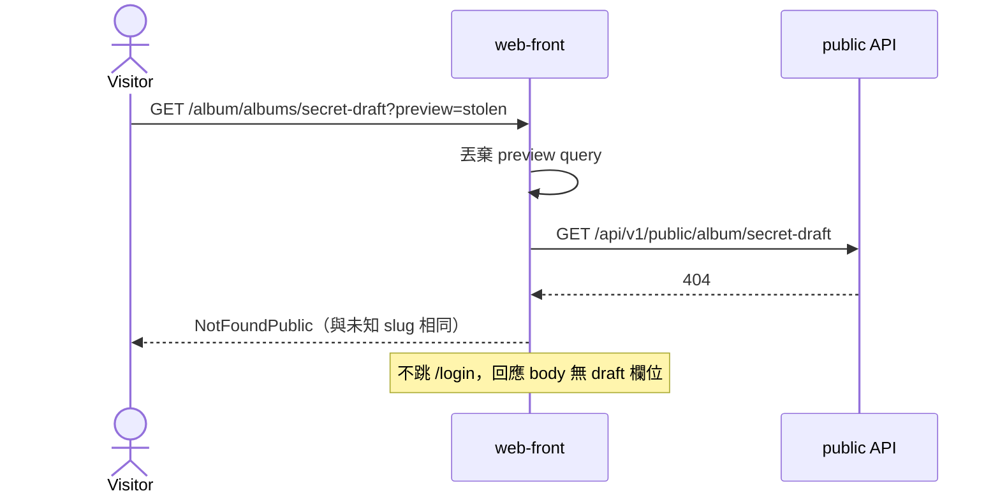
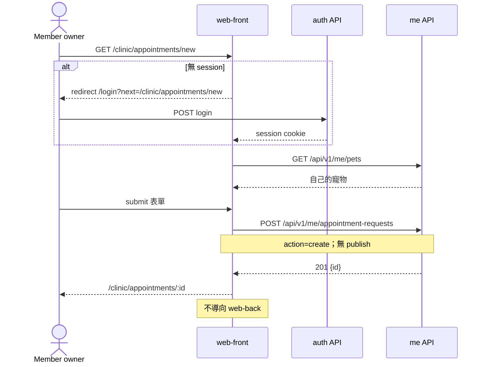

# Front office — 公開操作面規格

狀態：Draft v0.1  
日期：2026-09-05  
車道：Front（`apps/web-front` IA owner）  
權威檔：本文件 `docs/specs/surface-front.md`  
凍結總綱：`docs/sdd/00-overview.md`（只讀，不改切面）  
證據等級：`Decided` / `Proposed` / `Open`（跨車道邊預設 `Open`；標 `Decided` 時對端仍可能否決）

對齊的是能力切面，不是品牌：公開讀取與編輯讀取分成兩套資源（Ghost Content API vs Admin API、WordPress REST 未認證預設 published、Strapi `publicationState=live`）。不複製 wp-admin 工具列、不在公開頁放「編輯這篇」。

---

## 1. Executive summary

Front office 是給**訪客與終端使用者**的公開產品面，不是 Back 的唯讀主題，也不是 Admin 的預覽窗。

| 對象 | 這車道給什麼 |
| --- | --- |
| Kernel | 一個**只讀 published（外加窄的 member 寫入）**的消費契約：公開查詢參數、公開投影欄位、未發布當 404、preview 永不進這個 app。Kernel 仍不認識「相簿」。 |
| 操作面 | `apps/web-front` 的路由樹、共用 layout 骨架、shadcn 元件白名單、空狀態、SEO 最小、member 登入入口。三個 demo **換視圖註冊、不換權限模型**。 |
| Demo | 三個 site mount（`/album`、`/clinic`、`/projects`）的首頁區塊與代表頁。類型欄位、種子、權限矩陣仍歸 Demos / Content / Identity。 |

一句話：訪客在 Front 看到的任何 JSON，都必須是公開投影；草稿只存在 Back / Admin。

---

## 2. Scope / non-goals / 路徑所有權

### 2.1 本輪只寫

`docs/specs/surface-front.md`

### 2.2 In scope（規格；實作波才寫程式）

- `apps/web-front` 路由樹與 site mount。
- 匿名 vs member 哪些頁要登入。
- 公開 API **使用方式**（呼叫哪些資源、帶哪些查詢、禁止哪些欄位）。
- shadcn/ui 元件清單與空狀態、權限失敗、404 行為。
- SEO 最小（SPA document title / meta / robots）。
- 公開預約表單是 Front command 還是連到 Back（本檔選定）。
- 如何驗收「bundle 不含 draft 欄位」。

### 2.3 Non-goals

- 內容類型欄位、entry 狀態機、revision（Content）。
- RBAC 引擎、session 實作、密碼雜湊、種子密碼（Identity）。
- 上傳、衍生圖、儲存後端（Media）。
- Back 的 editor / preview / publish UI；Admin 的類型登錄 / 審計。
- 第四個操作面、把 Back 嵌進 Front、wp-admin bar。
- GraphQL、完整 i18n、全站搜尋、留言、PWA、SSR/Next.js、主題商店。
- 本輪任何 `apps/`、`services/`、`packages/` 程式。

### 2.4 路徑所有權

| 路徑 | 權限 |
| --- | --- |
| `docs/specs/surface-front.md` | 本車道只寫 |
| `docs/sdd/00-overview.md` | 只讀 |
| 其他 `docs/specs/*` | 只讀（可引用，不改） |
| 實作波 `apps/web-front/**` | 本車道擁有 IA；本輪不建 |
| `apps/web-back/**`、`apps/web-admin/**` | 不擁有 |
| `packages/ui` | 可提分割建議；不擁有元件庫本身 |
| `services/cms-api` | 不擁有 |

---

## 3. 必須回答（本車道決策）

### 3.1 `/` 是 demo 選擇器還是單一站？

**Decided：** v1 倉庫形態下，`/` 是 **demo 選擇器**，不是單一產品首頁。三站入口：

| 入口 | 含義 |
| --- | --- |
| `/` | Kernel 展示用選擇器。不是第四個產品，沒有自己的內容類型。 |
| `/album` | 個人相簿公開站 |
| `/clinic` | Pet clinic 公開站 |
| `/projects` | 專案管理公開進度站 |

生產部署可只啟一個 mount，把該站掛在 `/`（選擇器隱藏）。那是 Admin/合成的啟停問題，見 Open questions。v1 種子三站全開，所以選擇器存在。

選擇器是**骨架證明**：「換視圖不換權限模型」。它不是 CMS 內容。

### 3.2 哪些頁靜態讀 published，哪些要 member？

**Decided：**

| 區 | Auth | 讀什麼 |
| --- | --- | --- |
| 選擇器、三站所有陳列頁 | anonymous 即可 | 只讀 published + 公開可見 |
| 相簿全站 | 無 member 區 | 無登入牆 |
| 專案全站 | 無 member 區 | 公開專案與里程碑仍匿名；**不渲染 issue** |
| `/login` | 登入表單 | Identity session |
| `/clinic/me`、`/clinic/appointments/*` | **member**（飼主） | 自己的寵物與預約；不是別人的 draft，也不是 editor API |

Clinic 獸醫列表、診所介紹：**匿名 published**。  
飼主查自己的預約：**member**。  
Projects：**公開仍匿名**（總綱原文）。專案成員作業在 Back，不在 Front。

**Decided：** Front **不做自助註冊**。飼主帳號由 Back/Admin 供給（種子或 operator 建立）。Front 只有登入/登出。

### 3.3 如何保證前端 bundle 不含 draft 欄位？

**Decided（Front 可驗收規則，五層；1 與 4 依賴對端）：**

1. **契約層（Proposed → Content）**  
   公開資源與編輯資源分成兩套 OpenAPI path。公開 schema **沒有** `publicationState`、`revisionId`、`previewToken`、`deletedAt`、編輯備註。不是「同一個 Entry DTO，前端不要顯示」。

2. **客戶端層（Decided，本車道）**  
   `apps/web-front` 只生成 / 只 import 這三組 path：
   - `/api/v1/public/**`
   - `/api/v1/me/**`（member 窄投影）
   - `/api/v1/auth/**`（Identity 給 Front 的登入）  
   **禁止** import 編輯用 `/api/v1/entries`、`/preview`、`/content-types`、`/principals`、`/audit`。

3. **靜態分析層（Decided，本車道）**  
   CI（`npm test` 或 lint）掃描 `apps/web-front` 源碼與 production bundle：不得出現把下列字串當 **請求欄位或 query key** 送出：`publicationState`、`includeDraft`、`includeUnpublished`、`previewToken`、`revisionId`、`read_draft`。  
   註解裡提到這些字（例如本規格的測試說明）不算；測試檔可以 assert 它們不存在於 request。

4. **查詢層（Open → Content，Front 硬依賴）**  
   Kernel 在公開查詢強制 published。前端藏按鈕不算數。Admin 即使誤把 Back cookie 帶到 Front origin，**公開 GET 仍不得回 draft**。

5. **視圖層（Decided，本車道）**  
   Front **不是**通用「把 entry.fields 全印出來」的文件瀏覽器。每個 view pack 有**欄位白名單**；多出來的 JSON key 忽略、不 `JSON.stringify` 進 DOM。這防止 internal 欄位日後漏進公開投影時被陳列。

Preview query（`?preview=`、`?token=`）解析後丟棄，不轉發 API。

### 3.4 shadcn 元件

**Decided：** 只使用 shadcn/ui（Tailwind + Radix），經 `packages/ui` 再 export。禁止第二套 UI kit（MUI / Chakra / Ant Design / Bootstrap / Mantine / 自研 CSS 框架 / 獨立 lightbox 套件）。

骨架**必用**：

| 提示名 | shadcn 元件 | 用途 |
| --- | --- | --- |
| Card | `Card` + Header/Title/Description/Content/Footer | 選擇器、相簿、獸醫、專案、里程碑 |
| Dialog | `Dialog` | 相片燈箱、表單確認、錯誤細節 |
| Navigation | `NavigationMenu` | 站內主導覽 |
| Button | `Button` | 所有 CTA、分頁、登入、送出 |

允許的**同一套**附加 primitive（仍是 shadcn，不是第二 kit）：`DropdownMenu`、`Sheet`（手機選單）、`Breadcrumb`、`Input`、`Label`、`Textarea`、`Select`、`Form`、`Badge`、`Separator`、`Avatar`、`Skeleton`、`Alert`、`AspectRatio`、`ScrollArea`、`Tabs`、`Pagination`、`Sonner`、`Tooltip`。

**Decided：** v1 不做 Carousel / 第三方 masonry 套件。相片牆用 CSS grid。燈箱用 `Dialog`，不要再引 lightbox 庫。

### 3.5 公開表單（預約）是 Front command 還是只讀 + 連到 Back？

**Decided（UX，本車道）：** 預約是 **Front command**，不是「只讀 + 連到 Back」。把訪客送進作業面填獸醫表單，等於把 Front 與 Back 揉回一個後台——總綱禁止。

**Decided（誰能送）：** 表單在 Front，但 **必須 member（飼主）**。匿名只看到 CTA「登入後預約」。v1 不做匿名留言式預約（垃圾與無法做 principal predicate）。

**Proposed（Content / Identity）：** 不新開 clinic 專用後門 API。寫入重用標準 action **`create`**，打在可公開提交的類型上（建議獨立 `appointment_request`，建立後為 draft / 作業佇列；Front **永不呼叫** `publish`）。Operator 在 Back 把請求變成 `visit`。

**Open：**

- 是否需要新 action `submit_public`（本車道建議 **不要**，用 `create` + 類型級權限即可）。
- 類型名是 `appointment_request` 還是直接 `create visit`（本車道建議前者，避免訪客寫入就診紀錄原語）。
- 速率限制、CSRF header 形狀（Identity）。
- 若 Content **拒絕任何公開寫入**，本表單整段降級：Clinic Front 只留介紹 + 獸醫列表 + 靜態「請致電」；該降級必須在合成波明示，不能默默連到 Back。

Member 讀自己的預約走 `/api/v1/me/**`，**不是** `read_draft` 去掃 Back 的草稿。飼主看到的是「自己的請求/行程投影」，不是編輯預覽。此投影的狀態模型 **Open → Content / Identity**（見第 10 節跨車道邊表）。

---

## 4. 資訊架構

### 4.1 應用、origin、與另外兩面的隔離

**Proposed：** 三個 Vite app 不同 port（總綱允許同 origin 不同 path；v1 建議分 app）。

| App | Proposed 本機 origin |
| --- | --- |
| `apps/web-front` | `http://localhost:5173` |
| `apps/web-back` | `http://localhost:5174` |
| `apps/web-admin` | `http://localhost:5175` |
| `services/cms-api` | `http://localhost:8080` |

**Decided：**

- Front **沒有** `/preview`、`/editor`、`/admin`、`/wp-admin`。
- 內容頁 **沒有**「在 Back 編輯」按鈕（即使當前 browser 碰巧有 Back session）。
- 選擇器 footer 可以放 **外部連結**到 Back / Admin origin（scaffold chrome，`rel="noopener"`）。三站內部不放。
- Session cookie 名稱必須可區分 app（**Proposed → Identity**：`cms_front_session` 與 Back 分開）。Front **不依賴「沒帶 cookie」來藏草稿**；公開 API 自己過濾。
- 登入 `next` 只允許 Front 站內、已登記的 member 路徑（見第 4.2 節），防止 open redirect。

CORS / SameSite / CSRF 的位元組級契約：**Open → Identity**。Front 需要：member POST 帶 CSRF；匿名 GET 可不帶認證。

### 4.2 路由樹（權威）

路徑相對 `apps/web-front`。`:slug` 是公開 slug，不是內部 UUID（UUID 可當 Open 備援，但 Front 連結只用 slug）。

| 路徑 | 視圖 | Auth | 空狀態 | robots |
| --- | --- | --- | --- | --- |
| `/` | Demo 選擇器 | anonymous | 若無任何 enabled mount：骨架空狀態（種子不應發生） | `noindex`（scaffold） |
| `/login` | Member 登入 | anonymous；已登入則轉 `next` 或 `/clinic/me` | 憑證錯誤用 Alert，不是空列表 | `noindex` |
| `/logout` | 登出後轉 `/` | any | — | `noindex` |
| `/album` | 相簿站首頁 | anonymous | 無已發布相簿 | `index` |
| `/album/albums` | 相簿列表 | anonymous | 同上 | `index` |
| `/album/albums/:slug` | 單本相簿相片牆 | anonymous | 無照片 / 未發布→404 | `index` if 200 |
| `/album/photos/:slug` | 單張相片 | anonymous | 未發布→404 | `index` if 200 |
| `/clinic` | 診所首頁 | anonymous | 無介紹 entry：仍渲染獸醫 CTA | `index` |
| `/clinic/vets` | 獸醫列表 | anonymous | 無已發布獸醫 | `index` |
| `/clinic/vets/:slug` | 獸醫頁 | anonymous | 未發布→404 | `index` if 200 |
| `/clinic/me` | 飼主：我的寵物與預約 | **member** | 無寵物 / 無預約 | `noindex` |
| `/clinic/appointments/new` | 預約表單 | **member** | 無寵物可選：引導「請聯絡診所」 | `noindex` |
| `/clinic/appointments/:id` | 自己的預約確認 | **member**；非本人 403 | — | `noindex` |
| `/projects` | 公開專案列表 | anonymous | 無公開專案 | `index` |
| `/projects/:slug` | 專案公開頁 | anonymous | 未發布或非公開→404 | `index` if 200 |
| `/projects/:slug/milestones` | 里程碑列表 | anonymous | 無已發布里程碑 | `index` |
| `/projects/:slug/milestones/:mSlug` | 里程碑頁 | anonymous | 未發布→404 | `index` |
| `*` | `NotFoundPublic` | anonymous | 與未發布同一畫面 | `noindex` |

**Decided 不存在的路由：**

- `/album/upload`、`/projects/:slug/board`、`/clinic/visits/new`（作業面）
- `/preview/*`、`?preview=` 有效頁
- `/issues`、任何 issue 詳情（公開面不渲染工作項）
- Front 內嵌 Back iframe

**Member 路由判定是路徑級，不是內容級：**

- 打到 `/clinic/me` 而無 session → **401 流程**（導向 `/login?next=/clinic/me`）。
- 打到 `/album/albums/some-draft-slug` → **404 流程**，**不要**導向登入（避免洩漏「此 slug 有草稿」）。

### 4.3 共用 layout 骨架與視圖註冊

這是「換一套內容類型不必重寫三個操作面骨架」在 Front 的具體化。

```
PublicApp
├── SelectorChrome        僅 `/`
├── AuthChrome            僅 `/login`
└── SiteShell             `/album/*` `/clinic/*` `/projects/*`
    ├── SkipLink
    ├── SiteHeader          NavigationMenu + 可選 member DropdownMenu
    ├── Breadcrumb
    ├── Main / Outlet       view pack 填入
    ├── SiteFooter
    └── Toaster (Sonner)
```

**Decided：** Kernel 不知道 site。Front 有 **view pack registry**（app 內組態，不是內容類型）：

| Mount id | basePath | 讀的公開類型（名稱建議，Demos 可改顯示名） | 自訂視圖 |
| --- | --- | --- | --- |
| `album` | `/album` | `album`, `photo`，（可選）`page` | 相片牆、單張、Dialog 燈箱 |
| `clinic` | `/clinic` | `vet`，（可選）`page`；member：`pet`、預約投影 | 獸醫卡、預約 Form |
| `projects` | `/projects` | `project`, `milestone`，（可選）`page` | 里程碑時間線 |

共用、與 demo 無關的積木（只吃公開投影）：`PublishedCardGrid`、`MarkdownBody`、`MediaFigure`、`MediaLightboxDialog`、`EmptyPublished`、`NotFoundPublic`、`MemberGate`、`PublicFormShell`、`SiteHeader`。

Demo 只註冊：路由表 + 欄位白名單 + 少量自訂排列（masonry grid、vet card、milestone timeline）。**不註冊第二套權限、不註冊第二套 API client。**

### 4.4 頁面 × 權限 action × 資料

Front 用到的標準 action（總綱清單，不擴增除非 Open 被合成接受）：

| 頁 | action | 備註 |
| --- | --- | --- |
| 所有陳列/詳情 | `read_published` | anonymous 即可 |
| `/clinic/me` 讀自己的寵物/預約 | `read_published` + entry predicate，或 member 投影 | **Open** 模型；Front 不呼叫 `read_draft` |
| `POST` 預約 | `create`（建議打在 `appointment_request`） | **Open** 類型名 |
| 其餘 | 不用 | Front 禁止 `read_draft` / `update` / `publish` / `unpublish` / `delete` / `manage_*` / `read_audit` |

### 4.5 空狀態與失敗行為

同一套元件，不同 copy。**Decided：** 未發布、軟刪、未知 slug、非公開專案，Front 畫面**完全相同**（`NotFoundPublic`），不寫「已下架」或「權限不足」。

| 情況 | HTTP（API） | Front UI | 是否登入牆 |
| --- | --- | --- | --- |
| 列表 0 筆 published | 200 empty | `EmptyPublished` | 否 |
| 詳情不在公開集合 | 404 | `NotFoundPublic` | 否 |
| 公開 GET 5xx | 5xx | `Alert` + 重試 Button | 否 |
| Member 路由無 session | 401 | 轉 `/login?next=` | 是 |
| 登入密碼錯 | 401 | 表單 `Alert`，留在 `/login` | 已在登入頁 |
| Member 讀別人的預約 | 403 | 專用「沒有權限」`Alert`，**不是** 404 假藏（Identity：權限失敗不要用 404 藏，除非 Content 要求 hide。此處資源在 member 集合內，用 403） | 否 |
| 預約驗證失敗 | 422 | 欄位錯誤 | 否 |
| 預約過快 | 429 | toast / Alert | 否 |

列表空與 404 必須能用 Testing Library 從 role/text 區分（一個是「還沒有內容」，一個是「沒有這個頁面」）。

**Copy（zh-Hant，v1 單一 locale，無 i18n 框架）：**

| id | 標題 | 說明 |
| --- | --- | --- |
| `empty.albums` | 還沒有公開相簿 | 發布後會出現在這裡。 |
| `empty.photos` | 這本相簿還沒有照片 | — |
| `empty.vets` | 目前沒有可顯示的獸醫 | — |
| `empty.projects` | 還沒有公開專案 | — |
| `empty.milestones` | 這個專案還沒有公開里程碑 | — |
| `empty.me.pets` | 尚未登記寵物 | 請聯絡診所。 |
| `empty.me.appointments` | 沒有預約 | Button：預約 |
| `empty.appointments.noPet` | 無法預約 | 帳號下沒有寵物。 |
| `notfound` | 找不到這個頁面 | 可能不存在，或尚未公開。 |
| `forbidden` | 沒有權限 | 這不是你的資料。 |
| `selector.lead` | CMS kernel demos | 同一套公開面骨架，三個視圖包。 |

### 4.6 SEO 最小（v1 SPA）

總綱禁止 Next.js 綁死。**Decided：** v1 SEO = Vite SPA + 文件級 meta，不做 SSR。

每個 200 內容頁：

- `document.title` = `{pageTitle} · {siteTitle}`
- `meta name="description"` 來自公開 `summary`，沒有則省略
- `link rel="canonical"` 為 Front origin + 路徑（不含 query）
- Open Graph：`og:title`、`og:description`、`og:image`（僅公開媒體 `web` 或 `thumbnail` URL）
- `html lang`：v1 `zh-Hant`（單一 locale）

`robots`：

- 選擇器、登入、member、404：`noindex,nofollow`
- 其餘 200：`index,follow`

靜態 `public/robots.txt`：Allow 三站陳列路徑；Disallow `/login`、`/logout`、`/clinic/me`、`/clinic/appointments`。

**Proposed 不做（v1）：** sitemap.xml、JSON-LD、Open Graph 除圖以外的 video、SSR prerender。需要時合成波再開。

**Decided：** 不得把 draft title 寫進 `<title>`（因為根本拿不到）。

### 4.7 各 demo 首頁區塊（登記給 Demos；不擁有類型定義）

Front 只定 **slot**。Demos 填哪種 entry。

**Album `/album`**

1. `Hero` — 站名 + 一句 intro（`page` slug=`home` 或硬編碼 chrome + 第一個設定）。
2. `AlbumGrid` — published `album` Card（封面、標題、摘要）。
3. `LatestPhotos`（可選）— 最近 published `photo` 橫向 ScrollArea。

**Clinic `/clinic`**

1. `IntroMarkdown` — 診所介紹。
2. `VetGrid` — published `vet` Card。
3. `AppointmentCta` — 未登入：Button 去 `/login?next=/clinic/appointments/new`；已登入：去表單。

**Projects `/projects`**

1. `IntroMarkdown`
2. `ProjectGrid` — 公開 published `project` Card（可顯示里程碑計數**若**公開投影提供；沒有則只顯示標題摘要）。
3. 不放看板、不放 issue 列表。

---

## 5. 圖

### 5.1 Context：Front 碰得到與碰不到的



### 5.2 頁面權限狀態



### 5.3 Sequence：訪客逛相簿



### 5.4 Sequence：訪客看獸醫列表



### 5.5 Sequence：訪客看公開里程碑



### 5.6 Sequence：訪客打開未發布 URL



### 5.7 Sequence：飼主在 Front 送預約（command）



---

## 6. UI 契約（shadcn）

### 6.1 畫面 × 元件

| 畫面 | Card | Dialog | NavigationMenu | Button | 其他允許 |
| --- | --- | --- | --- | --- | --- |
| Demo 選擇器 | 三張 demo Card | 否 | 否（SelectorChrome） | 進入該站 | Badge「公開面」 |
| 相簿列表 / 專案列表 / 獸醫列表 | 每筆一 Card | 否 | 是 | 開詳情 | Skeleton、Pagination |
| 相片牆 | 可選 | **是（燈箱）** | 是 | 關燈箱 / 上一張下一張 | AspectRatio、ScrollArea |
| 單張相片 | 否 | 可再放大 | 是 | 回相簿 | Markdown/caption |
| 診所首頁 | 獸醫精選 | 否 | 是 | 預約 CTA | MarkdownBody |
| 登入 | Card 包表單 | 否 | 否 | 送出 | Form、Input、Label、Alert |
| 預約表單 | Card | 確認 Dialog 可選 | 是 | 送出 | Form、Select（寵物/獸醫）、Textarea |
| Member `/me` | 寵物/預約 Card | 否 | 是 + member DropdownMenu | 去預約 | EmptyPublished |
| 404 | 否 | 否 | 視是否在 SiteShell | 回該站首頁 | Alert 不用；專用 NotFound |
| 403 | 否 | 否 | 是 | 回 `/clinic/me` | Alert |

**Member DropdownMenu：** 顯示顯示名（Identity 給的 public display，不是角色矩陣）、連結「我的預約」、登出。不顯示「內容類型」「使用者」「審計」。

**手機：** `Sheet` 裝同一份導覽，不另做一套 IA。

### 6.2 燈箱規則

- 只載入公開 `variants.web.url`。
- 鍵盤關閉由 Radix Dialog 提供。
- 上一張 / 下一張只在**當前相簿已載入的 published 列表**內移動，不額外要 draft。
- 不可把 media UUID 猜成 Front 路由以外的 bytes URL 寫進頁面。

### 6.3 導覽來源

**Proposed → Content：** `GET /api/v1/public/navigation?siteKey=album|clinic|projects`

```json
{
  "siteKey": "album",
  "items": [
    { "label": "首頁", "href": "/album" },
    { "label": "相簿", "href": "/album/albums" }
  ]
}
```

**Decided（Front）：** `href` 必須落在該 mount 的 `basePath` 下，否則丟棄（防開到 Back）。Navigation 資源是內容還是設定：**Open → Content**。若公開導覽為空，view pack 使用上表硬編碼 fallback（仍是 Front 骨架，不是第四套選單產品）。

Clinic member 連結（「我的寵物」）由 SiteHeader 依 session **加在 fallback/公開 nav 之後**，不要求匿名導覽裡出現 `/clinic/me`。

---

## 7. 公開 API 使用契約（Front 消費方）

OpenAPI 是權威。本節是 **Front 將呼叫的草案**。路徑字面 **Proposed → Content**；查詢參數名稱本車道**登記**。欄位若未進 OpenAPI，Front 不得發明。

### 7.1 資源

| 方法 | Proposed path | 誰 | 用途 |
| --- | --- | --- | --- |
| GET | `/api/v1/public/navigation?siteKey=` | anonymous | 站內 nav |
| GET | `/api/v1/public/{contentType}` | anonymous | 列表 |
| GET | `/api/v1/public/{contentType}/{slug}` | anonymous | 詳情 |
| GET | `/api/v1/auth/session` | cookie | 是否 member |
| POST | `/api/v1/auth/login` | anonymous | Front member 登入 |
| POST | `/api/v1/auth/logout` | session | 登出 |
| GET | `/api/v1/me/pets` | member | 自己的寵物 |
| GET | `/api/v1/me/appointments` | member | 自己的預約投影 |
| GET | `/api/v1/me/appointments/{id}` | member | 單筆；非本人 403 |
| POST | `/api/v1/me/appointment-requests` | member | Front command |

媒體：**不**自組 `/api/v1/media/{id}`。只用公開 entry 裡的 `PublicMediaRef.variants.*.url`（**Open → Media** 實際 URL 形態：API 流 / 靜態 / 簽名）。

### 7.2 公開列表查詢參數（登記給 Content）

| 參數 | 必填 | 含義 | Front 用法 |
| --- | --- | --- | --- |
| `contentType` | 若 path 未含 type 則必填 | 類型 key | 每個列表 |
| `slug` | 詳情 | 公開 slug | 詳情；列表不用 |
| `page` | 否，預設 1 | 1-based | 列表 |
| `pageSize` | 否 | 預設：相片 24，卡片 12；**max 50** | 列表 |
| `sort` | 否 | 允許值由 view 白名單 | 相片 `sortOrder`；相簿/專案 `-publishedAt`；里程碑 `dueAt`；獸醫 `title` |
| `ref` | 否 | 關聯過濾 `field:entryId` 或 Content 等價語法 | `photo` 依 album；`milestone` 依 project |
| `siteKey` | 僅 navigation | mount id | nav |

**Decided Front 永不送：** `publicationState`、`includeDraft`、`includeUnpublished`、`previewToken`、`revisionId`、`q` 全站搜（v1 不做搜尋引擎；相簿內篩選若要做，等合成）、`fields` sparse fieldset（v1 由伺服器決定公開投影，避免客戶端點名到內部欄位）。

**Decided：** 公開 GET 不靠前端再 filter `state===published`。若 payload 意外含內部 key，視圖白名單仍不渲染。

### 7.3 公開投影欄位（Proposed → Content；Front 白名單消費）

Front 需要的**最小**公開物件。Content 可加欄，Front 忽略未登記者。

```text
PublicEntry
  id            uuid
  contentType   string
  slug          string
  title         string
  summary       string?
  publishedAt   datetime
  cover         PublicMediaRef?
  body          string?          // markdown；僅 intro/單頁
  fields        object           // 僅公開欄；見各 view 白名單
  refs          PublicRef[]      // 已發布的關聯摘要，不含未發布目標

PublicRef
  field         string
  contentType   string
  slug          string
  title         string

PublicMediaRef
  id            uuid             // 給 key；Front 不拿去打編輯 API
  alt           string?
  variants.thumbnail.url|width|height
  variants.web.url|width|height

PublicPage
  items[]       PublicEntry
  page          int
  pageSize      int
  total         int
```

**禁止出現在公開 schema / member 投影（Proposed，Content 否決權）：**  
`publicationState`、`revisionId`、`previewToken`、`deletedAt`、`createdBy`、`updatedBy`、`internalNotes`、workflow 私有欄。

`id` 可留（關聯 `ref=` 需要）。不要把編輯用 UUID 列表頁當公開 IA；連結仍用 slug。

### 7.4 各 view 欄位白名單（名稱 Proposed → Demos）

| View | 可讀 fields / 投影 |
| --- | --- |
| Album card / detail | `title`, `summary`, `cover`, `publishedAt` |
| Photo card / detail / lightbox | `caption`, `sortOrder`, album `PublicRef`, `cover`/`media` |
| Vet card / detail | `title`（名）、`specialty`、`bio`、`cover` |
| Project card / detail | `title`, `summary`, `cover`, `publishedAt`；可選 `milestoneCount` 若投影提供 |
| Milestone | `title`, `summary`/`body`, `dueAt`, `status`（僅當 Demos 標為公開 enum） |
| Issue | **無。不請求 `contentType=issue`。** |
| Me pets | Identity/Demos 決定；Front 只顯示名、種類、自己的 id |
| Appointment request POST | `petId`, `preferredAt`, `reason`, `vetSlug?` |
| Me appointments | `id`, `preferredAt`/`scheduledAt`, `statusLabel`, `petName`, `vetTitle?` |

### 7.5 錯誤形狀（Proposed → Identity；Front 對照）

```text
{ "code": "NOT_FOUND" | "UNAUTHENTICATED" | "FORBIDDEN" | "VALIDATION" | "RATE_LIMITED" | "INTERNAL",
  "message": string,
  "details": [ { "field": string, "issue": string } ] }
```

| API | Front |
| --- | --- |
| 404 公開詳情 | `NotFoundPublic` |
| 401 對 **member path** 或 POST /me | 登入牆 |
| 401 對 **公開 GET** | 當成失敗 Alert（不應發生）；**仍不**把內容頁變登入牆 |
| 403 member 資源 | `forbidden` Alert |
| 422 | 表單欄位 |
| 429 | toast |
| 5xx | Alert + 重試 |

未發布用 404 而非 403：這是「不在公開集合」，不是「你權限不夠看這篇 published」。與 Identity「不要用 404 藏權限失敗」相容——前提是 Content 公開 endpoint 對 draft 回 404。若 Content 對 draft 回 403，Front 仍渲染 `NotFoundPublic`（內容路由例外），以免洩漏。**Open：** API 狀態碼最終以 Content + Identity 為準；Front 內容路由的 UX 固定為 NotFound。

### 7.6 預約 POST 契約（草案）

```text
POST /api/v1/me/appointment-requests
Cookie: cms_front_session
X-CSRF-Token: <Identity>

{
  "petId": "uuid",
  "preferredAt": "2026-09-12T10:00:00+08:00",
  "reason": "string, max 500",
  "vetSlug": "ada" | null
}
```

201 回 `{ "id": "uuid" }`。Front 轉 `/clinic/appointments/{id}`。  
**不**送 `publicationState`、**不**呼叫 publish。

---

## 8. 對三個 demo 的含義

| Demo | Front 含義 | Kernel 無感的部分 |
| --- | --- | --- |
| 個人相簿 | 證明媒體庫 + 公開陳列。全匿名。封面與燈箱只走公開衍生圖。無登入、無表單。 | 排序演算法、EXIF、人臉；類型欄位歸 Demos |
| Pet clinic | 證明作業面大於展示面：**展示**只有介紹與獸醫；**飼主**窄入口在 Front；**就診 CRUD** 在 Back。預約 command 證明 Front 可寫入而不變成 Back。 | 班表最佳化、完整病歷、PetType 是否獨立類型 |
| 專案管理 | 證明公開進度頁與內部看板分離。Front 只有 project + milestone。Issue 狀態機是 Back 的事。 | Gantt、指派、看板欄 |

換 demo = 換 view pack 註冊 + 公開類型 key，不是換 RBAC 引擎，不是換 Card/Dialog/Navigation/Button 骨架。

---

## 9. 代表性流程（規格級）

### 9.1 訪客逛相簿

1. `/` 選「個人相簿」Card → `/album`。
2. 見 `AlbumGrid`。點一本 → `/album/albums/:slug` 相片牆。
3. 點一張 → Dialog 燈箱或 `/album/photos/:slug`。
4. 全程無登入。Network 只有 `/api/v1/public/*` 與媒體 URL。

### 9.2 訪客看 pet clinic 獸醫列表

1. `/clinic/vets` 列 published vets。
2. 點 `/clinic/vets/:slug` 看 bio。
3. CTA 預約：未登入去 login；不把人送到 `web-back`。

### 9.3 訪客看專案公開里程碑

1. `/projects` 只列公開 published 專案。
2. `/projects/:slug/milestones` 時間線。
3. 沒有 issue、沒有看板、沒有「加入專案」。

### 9.4 訪客打開未發布 URL

1. 知道或猜到 draft slug（或帶 `?preview=`）。
2. Front 丟棄 preview，打公開 GET，得 404。
3. 畫面 = 未知路徑。無 draft JSON，無登入暗示。

---

## 10. 跨車道邊表

跨邊預設 Open。本車道可登記需求；對端未寫進其權威檔前不算雙方 Decided。

| 對端 | 本車道登記 | 證據 | 對端仍可否決 |
| --- | --- | --- | --- |
| Content | 公開 path 前綴 `/api/v1/public/{contentType}`；查詢 `page` `pageSize` `sort` `ref`；伺服器強制 published；draft 對公開 GET 回 404；公開投影無 draft 欄位；navigation 讀取 | 查詢參數 = 本車道登記；schema/狀態碼 = Open | 是 |
| Content | 公開寫入重用 `create`，不要 clinic 後門；建議類型 `appointment_request` | Proposed | 是 |
| Content | Member `/api/v1/me/*` 為飼主投影，不是 `read_draft` | Open（可能改成 published+visibility predicate） | 是 |
| Content | Navigation 是內容類型還是設定 | Open | 是 |
| Identity | Front 獨立 cookie 名；CORS；CSRF on POST；`/api/v1/auth/*`；member 角色可進 Front clinic me；anonymous 只有 `read_published`；登入失敗 401、member 跨人 403、內容未公開不要 401 | 入口 IA = Decided；協定 = Open | 是 |
| Identity | 飼主 = member + owner predicate，不是第四套角色引擎、不是 portal 產品 | Proposed | 是 |
| Identity | v1 Front 無自助註冊、無 OAuth、無 password reset 頁 | Proposed | 是 |
| Media | 公開頁只吃 `PublicMediaRef.variants`；未發布相簿的 bytes 不可被猜 URL 掃到；縮圖/web 變體 | Open（傳遞方式：API 流 / 靜態 / 簽名） | 是 |
| Media | 燈箱 IA 歸 Front；上傳歸 Back | Decided 本側 | — |
| Back | Preview 只在 Back；Front 無編輯捷徑、無 iframe | Decided 本側 | Back 不可把 preview 鏈到 Front origin |
| Admin | 類型啟停是否隱藏 Front mount；選擇器 noindex | Open | 是 |
| Demos | 類型顯示名、種子 slug、首頁 intro 用哪種 entry、預約欄位、milestone `status` 是否公開 | 首頁 slot = 本車道登記；類型定義 = 不擁有 | 是 |
| Demos | 公開面不渲染 `issue`、`owner` 列表、上傳 UI | Decided 本側 | 是 |
| Synthesis | 單 mount 掛 `/` 的部署形態；公開寫入若被拒如何降級 | Open | 是 |

---

## 11. 驗收條件（Given / When / Then）

實作波應對到 `apps/web-front` 的 `npm test` / lint / typecheck / build，以及 API 契約測試。不依賴人工點擊。

### AC-01 選擇器不是單一站

Given 三個 mount 皆啟用  
When 訪客開啟 `/`  
Then 看見三張 Card（相簿、診所、專案），分別連到 `/album`、`/clinic`、`/projects`  
And 選擇器 `noindex`

### AC-02 相簿匿名逛

Given 至少一本 published album 含 published photos  
When 訪客不登入走 `/album` → 相簿 → 相片牆 → 燈箱  
Then 畫面有標題與公開圖  
And 所有 XHR 的 URL path 以 `/api/v1/public/` 或 Media 公開 URL 開頭  
And 無 `/api/v1/entries`、無 `previewToken` query

### AC-03 相簿空狀態

Given 0 本 published album  
When 訪客開啟 `/album/albums`  
Then 看見 `empty.albums`，不是 404，不是登入牆

### AC-04 獸醫列表

Given 若干 published `vet`、至少一名 draft vet  
When 訪客開啟 `/clinic/vets`  
Then 只看見 published  
And draft 的 slug 不在 DOM

### AC-05 公開里程碑

Given 專案 A 公開且 published，含 published milestone；專案 B 僅內部  
When 訪客開啟 `/projects`  
Then 只有 A  
When 訪客開啟 B 的公開 URL  
Then `NotFoundPublic`

### AC-06 不渲染 issue

Given 某公開專案下有 published issues  
When 訪客開啟該專案 Front 頁  
Then 不請求 `contentType=issue`  
And DOM 無 issue 標題列表 / 看板

### AC-07 未發布 URL

Given album slug `secret` 為 draft 或 archived  
When 訪客開啟 `/album/albums/secret` 以及 `/album/albums/secret?preview=abc`  
Then 兩個 URL 都渲染與 `/no-such-page` 相同的 `NotFoundPublic`  
And 公開 GET 回應 body 不含該 album 的 title 或 fields  
And 不導向 `/login`

### AC-08 Bundle 不含 draft 欄位

Given `apps/web-front` production build  
When 跑靜態掃描（單元測試或 lint）  
Then source（測試除外）與 bundle 不把 `publicationState`、`includeDraft`、`previewToken`、`read_draft` 當作 API 請求鍵  
And web-front 模組依賴不含 `apps/web-back`、`apps/web-admin`、編輯 OpenAPI client

### AC-09 公開投影型別

Given TypeScript `PublicEntry`  
When 編譯 web-front  
Then 存取 `entry.publicationState` 或 `entry.previewToken` 造成 typecheck 失敗

### AC-10 Member 飼主牆

Given 未登入  
When 開啟 `/clinic/me` 或 `/clinic/appointments/new`  
Then 被送到 `/login?next=` 且 next 為原路徑  
Given 登入為飼主  
When 再開  
Then 200 渲染自己的資料

### AC-11 別人的預約

Given 飼主 A 的預約 id  
When 飼主 B 開啟 `/clinic/appointments/{id}`  
Then 403 UI（`forbidden`），不是該預約內容，也不是 NotFound 假藏

### AC-12 預約是 Front command

Given 已登入飼主且至少一隻寵物  
When 在 `/clinic/appointments/new` 送出合法表單  
Then `POST /api/v1/me/appointment-requests`（或 Content 最終等同的 me/public create）  
And 成功後留在 Front 確認頁  
And **不** navigation 到 `web-back` origin  
And 請求 body 無 `publish` / `publicationState`

### AC-13 登入 next 允許清單

Given `/login?next=https://evil.example/steal` 或 `next=//evil` 或 `next=http://localhost:5174/entries`  
When 登入成功  
Then 忽略 next，改去 `/clinic/me` 或 `/`  
And 不到 Back origin

### AC-14 shadcn 唯一 kit

Given `apps/web-front` package.json 與 import  
When 檢查 UI 依賴  
Then 有 shadcn/Radix/Tailwind 路徑（經 `packages/ui`）  
And 無 MUI/Chakra/antd/bootstrap/mantine  
And 相片燈箱來自 `Dialog` 而非獨立 lightbox 套件

### AC-15 未授權看不到 draft（產品級總綱）

Given anonymous  
When 以 Front client 或直接打公開 API 讀 draft slug  
Then 無 draft payload  
And Front UI 為 NotFound 或空列表

### AC-16 已登入 Back 的人打 Front draft URL 仍失敗

Given 使用者在 Back 有 `read_draft` 且 browser 可能帶某種 cookie  
When 同一使用者在 Front 開 draft slug  
Then 仍 404 / NotFound  
And Front 未呼叫編輯 API  
（Identity 必須讓 Front cookie 與 Back 分離 **或** 公開 API 忽略 elevated 角色。兩邊任一成立即可；**兩者都做**為防禦縱深，Proposed。）

### AC-17 SEO 最小

Given 一本 published album  
When 開啟其 Front URL  
Then `document.title` 含公開 title  
And canonical 不含 `?preview=`  
Given 404 頁  
Then `robots` 含 `noindex`

### AC-18 只使用白名單元件的骨架頁可渲染

Given 選擇器與任一 demo 首頁  
When Testing Library render（實作波）  
Then 找得到 Navigation 或選擇器 CTA Button，以及至少一組 Card  
And 空資料時找得到 empty 文案

---

## 12. Open questions

1. Content 公開集合的 URL 風格：`/api/v1/public/{type}` vs `/api/v1/public/entries?contentType=`？Front 兩種都能適配，偏好前者。
2. 飼主「自己的預約」是 `visibility=owner` 的 published，還是獨立 `/me` read model？Front 需要**非他人草稿**的窄讀；不要 `read_draft`。
3. 公開 `create` 是否被允許。若否，預約表單降級為靜態聯絡，**仍不得**連到 Back。
4. Navigation 資源歸誰？空 nav 時 Front fallback 已 Decided。
5. Media 公開 URL 是簽名限時還是永久 path？Front 只消費 payload 給的字串；快取/過期行為要 Media 寫清。
6. 單一 demo 部署時 `/` 是否 302 到該站？誰啟停 mount（Admin 類型啟停 vs Front 組態）？
7. `page` 內容類型是否存在，還是各 demo 用自己的 intro entry？影響首頁 slot 資料來源，不影響路由。
8. Identity：localhost 跨 port cookie 共享。必須獨立 cookie 名或 path，否則 AC-16 只剩 API 過濾。
9. Member 顯示名、session 過期後 Front 是否靜默變匿名（內容頁）vs 踢回登入（member 路徑）——本車道建議：內容頁繼續匿名 published；member 路徑 401。
10. 里程碑 `status` 是否公開。若 Demos 認為會洩漏內部流程，Front 白名單刪掉 `status`，只留 title/dueAt/summary。
11. 公開列表是否要 `q=` title contains。v1 Front **不做搜尋框**；參數先不登記為必做。
12. 本車道建議不新增 `submit_public` action。若 Identity 認為 anonymous create 以後需要，再擴；v1 member `create` 足夠。

衝突處理：對端規格若把 Front 做成「帶 preview 的同一 SPA」或「從公開頁進 editor」，本檔否決。停在本檔，不改對方檔。

---

## 13. 實作波不該先做的事

1. 不要先寫 `apps/web-front` 程式——本輪只交規格。
2. 不要用 Next.js / Remix / SSR 當 v1 Front。
3. 不要把 `web-front` 與 `web-back` 做成一個 app 兩套 layout。
4. 不要對 Front 生成完整 kernel OpenAPI client。
5. 不要做通用 published 欄位表（那是 Back 的 list/detail）。
6. 不要做主題自訂器、區塊編輯器、GraphQL、留言、站內搜尋、i18n framework、PWA、分析像素。
7. 不要做自助註冊、OAuth、impersonation、Front 預覽 token。
8. 不要引入第二套 UI kit 或獨立 lightbox/masonry/carousel 庫。
9. 不要為假想第四個 demo 預留 plugin API；view pack registry 三個 mount 寫死 + 一個可選的「只啟一個則掛根路徑」即可。
10. 不要在公開頁加「Edit in back office」。
11. 不要把 issue 看板「唯讀化」冒充公開進度頁。
12. 不要用前端 filter 假裝 RBAC。

---

## 14. 實作波對應指令（記載，本輪不跑 app 測試）

規格完成後的實作波至少：

```text
apps/web-front: npm test && npm run lint && npm run typecheck && npm run build
```

必須包含：路由表測試、空狀態 / 404 / 403 文案、AC-08 bundle/源碼掃描、PublicEntry 型別（AC-09）、MSW 或契約測試證明 draft slug → 404 畫面。  
e2e 可後補；本車道驗收以單元/元件/契約為主。
