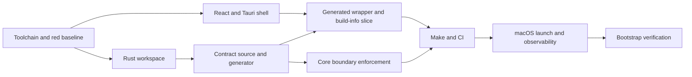

# N00 Implementation Plan

## 1. 目標與非目標

交付一個可重現的 Tauri 2、React 19、TypeScript 與 Rust workspace
骨架，具備單一 CI gate、Rust-to-TypeScript contract generation、core
dependency boundary，以及 `get_build_info` 的完整垂直切片。

本節點不建立 SQLite product schema、不解析 Markdown、不讀取 workspace、
不實作 annotation，也不加入 release signing、notarization 或非 v1 功能。

## 2. 現況盤點

### Repository

| Fact | Evidence | Result |
|---|---|---|
| Dedicated repository | `git remote -v` | `fallrising/flowshot` |
| Clean committed baseline | `git status -sb` at `5b2c3aa` | clean `main` |
| SPEC hash | `sha256sum SPEC.md` | `dd7929…29b2e` |
| N00 hash | `sha256sum docs/nodes/N00-foundation-ci-contracts.md` | `0ccff5…632dc6` |
| SDD integrity | `python3 scripts/sdd.py verify` | passed |
| Competing writer | task ownership inspection | none |

### Toolchain facts

| Tool/fact | Observed result | Gate |
|---|---|---|
| Host | Debian Linux x86_64, kernel 6.1 | supported development host, not v1 release target |
| Rust | `rustc/cargo 1.83.0`, stable toolchain | present; update/pin decision required |
| Node/npm | not found | blocking T03 and full CI |
| Tauri CLI | not found | blocking T03 smoke |
| Linux Tauri system libraries | `pkg-config` and WebKit/GTK development packages unavailable | blocking local Tauri build |
| macOS 13+ launch | current host is not macOS | blocking final N00 verification, not documentation/scaffold planning |

No legacy repository has been supplied to this checkout. N00 therefore uses the
SDD contracts and structure directly; no legacy command surface will be copied.

## 3. 架構與資料流

```text
React UI
  → generated typed invoke wrapper
  → Tauri get_build_info command
  → crates/core contract DTO
  → BuildInfoDto response
```

Rust workspace members:

- `crates/core`: pure contracts and domain primitives.
- `crates/db`: empty DB adapter boundary; no product schema in N00.
- `crates/xtask`: deterministic contract generation and repository checks.
- `src-tauri`: Tauri adapter and command registration.

The frontend owns presentation only. Generated TypeScript is written under
`src/generated/contracts/` and is never edited manually.

Errors use the shared `AppErrorDto` shape. The first command does not require
filesystem, DB, clock, or network access. Build metadata is injected at compile
time by the adapter/build process and returned through the shared DTO.

## 4. Contract Freeze Plan

| Command/Type | Source file | Test | Compatibility |
|---|---|---|---|
| `CommandContract` | `crates/core/src/contracts/mod.rs` | Rust compile/unit | foundation API |
| `EmptyRequest` | `crates/core/src/contracts/common.rs` | serialization golden | object request |
| `BuildInfoDto` | `crates/core/src/contracts/build_info.rs` | serialization golden | additive fields only after freeze |
| `AppErrorDto` | `crates/core/src/contracts/error.rs` | enum/golden | stable error codes |
| `get_build_info` descriptor | `crates/core/src/contracts/build_info.rs` | manifest snapshot | command name frozen |

`contracts/locks/N00.json` begins with `status=planned` because N00 bootstraps
the Rust authority and generator. T04 replaces null source/generator fields,
sets `status=frozen`, and records the actual source hash only after the source
and golden test exist. No downstream implementation may consume the planned
lock as if it were frozen.

## 5. Data/Migration

N00 creates no SQLite database, migration, table, or repository behavior.
`crates/db` is a compilable boundary placeholder only. Rollback is file-level;
there is no persistent user data to migrate.

## 6. Test-first Plan

The initial red evidence is environmental and structural:

- no `Cargo.toml`;
- no `package.json`;
- no `make ci`;
- no contract generator or generated files;
- no Tauri command;
- Node/Tauri prerequisites absent.

Each task records its own red command before implementation. The node test plan
maps every BDD to an executable oracle. Contract determinism is tested by two
isolated generations and byte comparison. Boundary tests inject forbidden
dependencies into a disposable fixture rather than modifying committed source.

## 7. Task DAG



## 8. Ownership

| Task | Allowed paths | Forbidden paths |
|---|---|---|
| T01 | `docs/tasks/N00/**` | production source |
| T02 | `Cargo.toml`, `Cargo.lock`, `crates/{core,db,xtask}/**` | frontend, product schema |
| T03 | frontend root config, `src/**`, `src-tauri/**` | product features |
| T04 | core contracts, xtask, generated contracts, N00 lock | handwritten generated output |
| T05 | build-info adapter/UI/tests | DB, workspace functionality |
| T06 | xtask boundary checks and fixtures | dependency contracts |
| T07 | `Makefile`, package scripts, `.github/**` | product features |
| T08 | build-info adapter log, Mac launch probe, Make/CI | contract or product behavior |
| T09 | README, N00 verification/metrics/graph | SPEC behavior changes |

One writer owns the branch. No implementation file is shared with another
active task or agent.

## 9. 風險

| Risk | Evidence | Mitigation | Gate |
|---|---|---|---|
| Missing Node/npm | preflight command lookup | install/pin an LTS toolchain before T03 | T01 |
| Linux lacks Tauri libraries | `pkg-config` absent | install required packages or use a prepared dev container | T01/T03 |
| macOS launch cannot run locally | Linux host | macOS Actions build plus target-Mac launch evidence | T08 |
| N00 bootstraps its own lock generator | source does not exist before code | planned lock, then explicit freeze in T04 | T04 |
| Contract generator becomes nondeterministic | generated headers/build paths | source-relative ordering, fixed formatting, isolated double-run test | T04 |
| Core imports adapter dependencies | workspace growth | metadata allow-list/deny-list check in `xtask` | T06 |
| CI diverges from local Make targets | duplicated commands | CI invokes `make ci`; Makefile owns the command sequence | T07 |

## 10. Spec Defects

| ID | Missing/ambiguous fact | Authority owner | Resolution |
|---|---|---|---|
| SD-N00-001 | A frozen lock requires Rust source, but START-HERE requires a lock before production source exists | execution governance | create an explicitly non-frozen planned lock; freeze it in T04 before vertical-slice implementation |
| SD-N00-002 | Target macOS launch is a pre-code fact gate, but the assigned host is Linux and the app does not exist yet | N00 verification | treat local host/tool checks as the implementation gate; require macOS build/launch evidence before N00 can be `done` |
| SD-N00-003 | “Rust stable” and “Node LTS” do not pin reproducible versions | N00 implementation plan | select supported versions during T01, record them in toolchain/lock files, and keep upgrades explicit |

These resolutions do not change product behavior. If implementation reveals a
different observable contract, the affected task stops and the authority
documents are revised before continuing.

## 11. Rollback

Each task is an isolated commit. Before N00 stores user data, rollback is
performed by reverting the failing task commit. Generated files are regenerated
from the previous Rust source; they are never repaired manually.

## 12. 完成檢查

- [ ] Toolchain prerequisites are installed and recorded.
- [ ] Rust and frontend workspaces compile from a clean checkout.
- [ ] Contract source is frozen and generated output is deterministic.
- [ ] `get_build_info` works through Rust, Tauri, and the typed frontend wrapper.
- [ ] Core dependency boundary negative test passes.
- [ ] `make bootstrap && make ci` passes from a clean checkout.
- [ ] macOS 13+ minimal-window launch evidence exists.
- [ ] N00 verification report and G2 outcome are committed.
