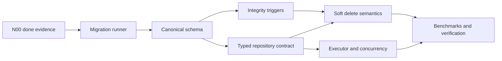

# N01 Implementation Plan

## 1. 目標與非目標

交付 `SPEC.md` §9 的 SQLite v1 canonical schema、不可跳版且可驗證
checksum 的 up-only migration runner、typed repository boundary、soft-delete
語義，以及不阻塞 Tauri async runtime 的 bounded DB executor。

N01 不加入 Tauri product command、不讀寫 workspace、不實作 anchor
演算法、tag UI、永久 purge、down migration、雲端同步或備份產品功能。
破壞性 migration 也不在第一版 migration set 內。

## 2. Readiness 與現況

| Fact | Evidence | Result |
|---|---|---|
| N00 dependency | `docs/graph.yaml` | `blocked`; N01 不得進入 implementation |
| DB crate | `crates/db/src/lib.rs` | 只有 `DbAdapter` marker |
| SQLite dependency | `crates/db/Cargo.toml` | 尚未加入 |
| N01 lock | `contracts/locks/N01.json` | planned；source 尚不存在 |
| Canonical DDL | `SPEC.md` §9.2 | 11 tables、7 declared indexes |
| Required invariants | `SPEC.md` §3、§9.3–9.5 | hard-delete、comment depth、system pin、tombstone |
| Runtime boundary | `SPEC.md` §9.1 | single write actor、bounded reads、injectable clock/ID |

本計畫是 dependency-safe preparation。所有 production task 在 N00 `done`
前維持 blocked；不得以計畫或 mock 取代依賴證據。

## 3. Architecture

```text
Tauri app-data path
  → DbRuntime
      → single bounded write actor
      → bounded read connection pool
          → typed repositories
              → rusqlite transaction / query
                  → migrated SQLite database
```

- `crates/db` 是唯一允許依賴 `rusqlite` 或包含 product SQL 的 crate。
- SQL row type、`rusqlite::Connection` 與 transaction handle不得跨出 DB
  crate。
- clock 與 UUIDv7 generator 由 `DbRuntime` 建構時注入；production adapter
  提供 system implementations，tests 提供 deterministic implementations。
- writes 只透過單一 actor thread 接受 bounded request；read connections
  數量有明確上限。Tauri async code只能把 blocking 工作交給此 boundary。
- repository methods 使用 typed IDs、UTC epoch milliseconds 與 explicit
  expected version/revision；不接受 raw table/column/SQL string。

## 4. Migration Design

1. 開啟 connection 後立即套用並驗證四個 mandatory PRAGMA。
2. 以 idempotent bootstrap 建立 `schema_migrations` metadata table。
3. migration registry 以 source order 嵌入連續 `version + SQL + SHA-256`。
4. 啟動時拒絕：
   - duplicate 或 gap version；
   - database version 高於 application；
   - 已套用 version 的 checksum 不符；
   - transaction 中任一 DDL/trigger 失敗。
5. 每個 pending migration 在單一 transaction 套用，成功後同 transaction
   寫入 checksum 與 injected `applied_at`。
6. latest database 再次執行只讀 metadata，不重跑 DDL、不更新 timestamps。
7. 第一個 migration 建立完整 canonical schema、indexes、triggers 與
   system `pin` tag。v1 沒有 destructive migration，因此不觸發 backup
   policy；未來 destructive migration 必須先另行設計 backup gate。

## 5. Schema 與 Invariant Mapping

| Authority | Implementation | Primary oracle |
|---|---|---|
| §9.2 tables/checks/indexes | versioned migration SQL | sqlite catalog snapshot + invalid row tests |
| hard delete ban | `BEFORE DELETE` triggers | direct raw `DELETE` rejected, rows unchanged |
| comment parent | insert/update triggers | missing/cross-annotation/depth-two rejected |
| system tag protection | update/delete triggers | `pin` cannot rename/delete |
| system pin binding | annotation-tag trigger | `pin` rejected for annotations |
| annotation shape | table `CHECK` constraints | document/range matrix tests |
| foreign keys | per-connection PRAGMA | invalid references rejected on every connection kind |
| soft delete | repository transactions | shared timestamp and preserved replies |
| row version | conditional repository updates | stale expected version returns `CONFLICT` |
| document revision | conditional transaction update | stale revision rolls back full batch |

`documents`、`annotations`、`comments` 不宣告 cascading hard delete。
Tag join rows可依 SPEC 對 tag hard delete cascade，但 system tags先由 trigger
阻擋。Workspace/root detach 與 missing document只更新狀態。

## 6. Repository Contract Freeze

`contracts/locks/N01.json` 先以 `planned` 建立，command surface 為空。T04
完成 public repository types 後才可：

- 確認 lock 中的 source file list；
- 計算 path-and-bytes SHA-256；
- 將 status 改為 `frozen`；
- 設定 `frozen_at`；
- 以 drift test保護 source hash。

最低凍結 surface：

- typed `WorkspaceId`、`RootId`、`DocumentId`、`AnnotationId`、
  `CommentId`、`TagId`；
- `RowVersion`、`DocumentRevision` 與 UTC millisecond newtype；
- repository-facing create/read/mutation inputs and records；
- typed DB error category，包括 validation、conflict、migration、busy 與
  internal，但不得把 body 或完整 anchor 放入訊息；
- transaction runner boundary。

N01 不產生 TypeScript，也不增加 Tauri command。

## 7. Transaction Policy

- create、mutation、soft delete、tag binding 與 migration一律使用 explicit
  transaction。
- annotation/comment mutable update以
  `WHERE id = ? AND row_version = ?` 寫入並遞增 version；零列先區分
  not-found 與 conflict。
- document model commit以 expected revision更新並遞增 revision。
- app state compare-and-set使用 `expected_updated_at`，不虛構 schema 未定義
  的 version 欄位。
- idempotent desired-set 與 tag merge不得為 no-op 額外遞增 token。
- actor關閉、queue full、busy timeout與 migration failure回傳結構化錯誤；
  rollback 後不得留下部分資料。

## 8. Test Data 與 Performance

- In-memory factory用於 deterministic schema/invariant/repository tests。
- Tempfile factory用於 WAL、multi-connection、busy與restart tests。
- seed helper使用固定 clock/ID產生 10,000 annotations 與 10,000
  bindings，不經 UI。
- release benchmark記錄 architecture、CPU、OS、SQLite/rusqlite version、
  row count與 duration；`< 1 s` 是 acceptance，不以 CI debug timing代替。
- query plan snapshots覆蓋 active document annotations、comment thread、
  tag reverse lookup與recent documents。

## 9. Task DAG



| Task | Single outcome |
|---|---|
| T01 | deterministic migration registry upgrades blank/latest/tampered DBs |
| T02 | canonical tables, indexes, PRAGMAs, factories and catalog tests |
| T03 | all §9.3 and annotation-shape invariants reject invalid raw SQL |
| T04 | typed repository API is frozen and raw SQL cannot escape DB crate |
| T05 | annotation/comment tombstone transactions match §9.4 |
| T06 | bounded actor/read pool and optimistic concurrency are deterministic |
| T07 | app-data wiring, query plans, 10k release benchmark and node evidence |

## 10. File Ownership

Production work stays within the N01 node card:

- `crates/db/**` owns SQL, migrations, rows, repositories and executor；
- `crates/core/src/contracts/N01*` is reserved only if a pure cross-node type
  cannot remain in DB without violating INV-8；
- `src-tauri/src/db*` owns platform app-data/runtime construction；
- `contracts/locks/N01.json` owns the repository contract freeze；
- `docs/tasks/N01/**` and `docs/verification/N01.md` own evidence。

Generated `Cargo.lock` must change when N01 adds direct dependencies, but the
node allowed-path list currently omits it; see SD-N01-001.

## 11. Risks and Spec Defects

| ID | Issue | Resolution gate |
|---|---|---|
| SD-N01-001 | N01 must add `rusqlite`/UUID/Unicode dependencies, but node allowed paths omit root `Cargo.lock` | amend node governance before T01 production edit; do not hand-edit or omit lockfile |
| SD-N01-002 | “typed repository” breadth is not method-by-method specified | expose only methods required to prove canonical schema, tombstone and concurrency primitives; later nodes add feature-specific methods |
| SD-N01-003 | Rust libraries for NFKC + default case folding are not selected | T01 records exact dependency/API evidence before tag normalization code |
| SD-N01-004 | 10k `<1 s` hardware class is unspecified | record target hardware and keep result blocked if no controlled release measurement exists |
| SD-N01-005 | `TransactionRunner` example uses a generic closure and is not intended as a trait object | keep it compile-time/generic; do not add dynamic abstraction without a caller |
| SD-N01-006 | Node completion requires graph status and append-only G2 outcome, but allowed paths omit `docs/graph.yaml` and `docs/metrics/node-outcomes.jsonl` | amend node governance before T07 closure; never bypass the append-only rule |

## 12. Rollback

Migration code is up-only. During N01 development disposable test databases may
be deleted, but a user database is never downgraded. A code rollback after a
migration has reached real user data requires forward repair or a compatible
binary, not a down migration. Every task remains a small revertible commit
before release evidence.

## 13. Exit Criteria

- [ ] N00 dependency is `done` with executed evidence.
- [ ] Node allowed-path defect for `Cargo.lock` is resolved.
- [ ] Migration registry rejects gaps, tampering and database-ahead state.
- [ ] Canonical schema, indexes, PRAGMAs and all triggers have executable tests.
- [ ] Repository contract lock is frozen with zero drift.
- [ ] Soft-delete and optimistic concurrency scenarios pass transactionally.
- [ ] No product SQL or `rusqlite` dependency exists outside `crates/db`.
- [ ] Tempfile WAL and bounded executor tests pass.
- [ ] 10k release benchmark passes with hardware record.
- [ ] Tauri uses platform app-data path and does no blocking query on async threads.
- [ ] `make ci`, N01 verification and G2 outcome pass.
