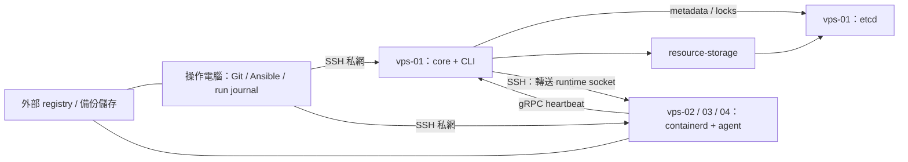

# SDD：4 台 VPS 的 Eru 部署與重建實驗

- 日期：2026-09-21
- 階段：設計完成；2026-09-22 已完成 Debian 適配部署、三台 worker 功能驗證及一次帶 nginx 的四台同版本重複 apply（V05）。M1 尚有驗收缺口，重建管理未完成，見 [部署結果](DEPLOYMENT-RESULT-2026-09-22.md)。
- 上游基線：quickstart `023412becd4202b5b8c5d992552310512a2d6790`。
- 環境更新：4 台 Debian 13 VPS 與 Tailscale 已確認；原文 Ubuntu／容量配置保留為初始設計。安裝使用 ckc sudo，既有 runtime 保留，每 worker 註冊 2 CPU／2 GiB RAM／10 GiB storage。provider reimage 尚未取得，見 [實機盤點](LIVE-2026-09-22.md)。

## 1. 目的與結論

以現有 4 台 VPS 驗證「用一份版本化 inventory 建立 Eru cluster，部署一個真正會用到的無狀態服務，並能重建回相同的服務行為」。**4 台足夠驗證功能、排程與重建；是否符合效能及可用性要求，必須量測。**

交付的 MVP 是可重跑的操作流程、版本化範例與證據，不要求先做 Web UI。成功標準不是安裝成功一次，而是乾淨重建 3 次皆能通過相同驗收，且每一步可以辨識失敗位置。

SDD 的 MUST 是後續實作要求，不代表已具備功能。本文的資源、延遲、RTO 與 RPO 數字皆是本案候選門檻，不是上游保證。

## 2. Eru 的用途與能力邊界

Eru core 是 gRPC 資源排程器。quickstart 使用 Ansible 安裝 etcd、core、資源 plugins、CLI 與 worker runtime；agent 回報 node／workload 狀態。Eru pod 是節點分組，並非 Kubernetes Pod。工作負載規格描述 app 與 entrypoint，部署參數提供 image、位置與資源。參見 [上游說明](https://github.com/projecteru2/quickstart/tree/023412becd4202b5b8c5d992552310512a2d6790)。

| 場景 | 怎麼使用 | MVP 判斷 |
| --- | --- | --- |
| 小型內部 HTTP API／Webhook | OCI image + CPU／memory 配額，部署到指定 worker；用私網 HTTP 探測 | 首選。先 nginx，再換成一個既有的無狀態 API |
| 批次處理、轉檔、OCR worker | 輸入與結果放外部儲存，容器消費工作；工作 ID 做冪等與 retry | 適合第二條情境；先小檔，OCR／編譯容量需另測 |
| 分支測試與短期 demo | 每次 run 唯一 appname、明確 TTL、完成後移除並回收資源 | 適合；TTL 清理屬本案 wrapper，非 quickstart 既有功能 |
| 非容器化工具 | `node_process` 的 OCI bundle 經 oras 解開，交 systemd 執行 | 第二階段可把第 4 台冷重建為 process node |
| VM／較強隔離 sandbox | `node_cocoon` 對接既有 cocoon 安裝 | 延後；需 /dev/kvm、nested virtualization 與額外元件 |
| GPU 任務 | 具 GPU 的主機與 resource-gpu plugin | 一般 VPS 不假設有 GPU；本案關閉此 plugin |
| DB／持久佇列 | 節點磁碟上的 volume + 應用備份還原 | 不列首輪；etcd 與 storage 配額不能取代資料複寫 |

MVP 不承諾 Kubernetes 生態相容、Ingress controller、跨節點 overlay network、分散式儲存、多租戶隔離，或節點故障後自動補足副本。core 的 WAL 恢復分配／部署交易，與維持應用 desired replicas 是不同能力；實驗先以人工或一次性 wrapper 重建遺失副本。[core 基線](https://github.com/projecteru2/core/tree/e19ceb7e09d95bedea3eb0c25bec9308101fecc5)

同節點的 containerd restart policy 可處理部分 process exit；主機消失時能否在別台重建，另做故障實驗。容器裡允許執行的內容限可信應用，不能把 root SSH 管理的叢集視為不可信程式的安全沙箱。

## 3. 4 台主機配置

### 3.1 Profile A：先證明基本流程

| 主機 | 範例私網 IP | 角色 | 初始預算 |
| --- | --- | --- | --- |
| vps-01 | 10.77.0.11 | etcd0、core、CLI、resource-storage | 2 vCPU／4 GB／40 GB |
| vps-02 | 10.77.0.12 | containerd、agent；worker-2 | 2 vCPU／4 GB／40 GB |
| vps-03 | 10.77.0.13 | containerd、agent；worker-3 | 2 vCPU／4 GB／40 GB |
| vps-04 | 10.77.0.14 | containerd、agent；worker-4 | 2 vCPU／4 GB／40 GB |

Ansible runner 使用操作電腦或外部 CI runner，不佔第 5 台 VPS。它必須在重建 4 台主機後仍能取得 private inventory、金鑰、版本鎖與備份。

控制機不承載應用，避免初次容量試驗影響 etcd。每台 worker 先限制實驗工作負載總和 ≤ 1 vCPU／1 GB RAM／10 GB storage；預留系統、image 解壓與回收空間。每個 nginx 為 1 CPU／256 MB／1 GB，因此基礎測試每節點先 1 個。

`node_containerd_storage: 10G` 可設定註冊容量；CPU／memory 的同等預留在上游 node role 尚未提供直接 inventory 變數，初期由部署預算限制，後續 adapter 使用已核對的 `node set`／註冊參數實作並比對。不要假設設定一個不存在的 YAML key 便能保留資源。

若只有每台 1 GB RAM，先縮到單機 smoke 並量測，不接受為此 4 機設計的通過證據。跨區域 VPS 先量測 etcd peer RTT、封包遺失與磁碟延遲；候選門檻 peer RTT p95 < 20 ms、fsync p99 < 10 ms。未達則只做功能驗證，調整拓撲後再談 quorum 可用性。

### 3.2 Profile B：同 4 台驗證 etcd quorum

| 主機 | 角色差異 |
| --- | --- |
| vps-01 | etcd0 + core |
| vps-02 | etcd1 + worker-2 |
| vps-03 | etcd2 + worker-3 |
| vps-04 | worker-4，供重裝／故障實驗 |

3 個 etcd 投票成員需要 2 票，可失去 1 個成員；4 成員仍只容忍失去 1 個，MVP 不採用 4 etcd。混跑的 vps-02／03 必須保留 etcd CPU／RAM／IO 餘裕，初期每台最多一個小型測試工作負載。

**Profile B 不是完整 HA**：core 仍只有 vps-01。測 etcd 容錯時停止 vps-02 的 etcd 服務；若停止整台 vps-01，core 也會消失，不能把排程中斷解讀為 etcd quorum 失效。

A → B 採可丟棄實驗叢集的冷重建。修改 inventory 然後 `make up` 不等於線上 etcd 擴容。未來若需要不停機加入成員，另行實作 member add／learner／promote 與 `existing` 啟動模式。[etcd 成員管理](https://etcd.io/docs/v3.6/op-guide/runtime-configuration/)

第二個 core 延後：上游雖可列多 core，node role 只授權 `core_host` 的公鑰，agent 初始位址也指向它。需補多 key 授權／輪換、所有 core 的私網可達位址、client discovery 與 bootstrap 故障測試，才接受為 core HA。

## 4. 網路與存取

同供應商私網或 WireGuard mesh 是共同前置條件。範例 IP 並非真實 VPS 資料。所有 inventory hostname 必須可由 runner、core、agent 與 etcd peer 解析／到達；僅設定 `ansible_host` 別名不足以修正上游渲染出的 runtime 位址。

| 連線 | 來源 → 目的 | 規則 |
| --- | --- | --- |
| TCP 22 | runner → 4 VPS；core → workers | 只允許管理來源，使用 SSH key |
| TCP 5001 | runner／agents → core | 僅私網信任成員；上游預設無 core auth |
| TCP 2379 | core／plugins／備份操作端 → etcd | 僅私網允許清單；模板預設 HTTP |
| TCP 2380 | etcd members 彼此 | 僅該 3 成員 |
| UDP 51820（若選用） | WireGuard peers | 供應商 firewall 允許受控 peer |
| TCP 80（HTTP demo） | 指定私網探測端 → worker | host network 驗證時限私網，先確認 port 空閒 |
| TCP 443 出站 | runner／VPS → GitHub、registry、備份儲存 | 安裝與拉 image；另按 OS 設定允許 apt／DNS／NTP |
| TCP 12345 | agent 本機 | 保持 loopback |

管理面服務可能 bind 到 `0.0.0.0`，所以 firewall 必須先於 quickstart；WireGuard 的存在不會自動關閉公網 listener。bootstrap 後從叢集外實測 2379／2380／5001 不可達。containerd 使用 Unix socket 經 SSH 轉送，不需要公開 Docker TCP API。[模板與配置來源](SOURCES.md)

CNI 預設是每台獨立 bridge + host-local IPAM + NAT；不是跨主機網路。範例為 worker-2／3／4 分配 10.66.2.0/24、10.66.3.0/24、10.66.4.0/24，但**不同 subnet 不會自動建立路由**。

HTTP 分兩次驗收：第一輪 `--network eru`，在 workload 所在 worker 對 `workload get` 回報的容器 IP 發 HTTP request；第二輪清掉第一輪 app 後，以 `--network host` 固定部署到 worker-2，從管理私網 request `10.77.0.12:80`。同 worker 的同一 host port 只允許一個實例。不要將 spec 的 `publish` 當成已建立 DNAT 或公網 ingress 的證據；目前 conflist 未配置 portmap。

若真實 API 需要公網入口，後續增加私網 reverse proxy upstream、TLS／DNS 與 health check，測試不健康副本移出路由。此工作是選配，不是 quickstart 自帶。本輪無需購入域名或負載平衡器。

## 5. 狀態、所有權與版本

| 狀態 | 真正來源 | 重建策略 |
| --- | --- | --- |
| 希望部署的內容 | Git：app spec、image digest、placement／resource 參數 | 從版本化 manifest 重播 |
| VPS 與網路身分 | 私有 inventory：provider ID、角色、私網 IP、OS、host fingerprint、generation | 重灌後核對主機身分；generation +1 |
| 叢集 metadata | etcd 的 core／storage plugin 等 keyspace | 冷重建全丟棄；保留型恢復需完整快照 |
| runtime 容器／image／CNI | worker 本機 | 不作權威資料；冷重建重新拉 image、建容器 |
| 業務資料 | 外部 object store／DB，或明確 host volume | 另有應用一致性備份；不能只備份 etcd |
| SSH、WireGuard、provider token | 私有加密 secret store | 可恢復或可輪換；不靠唯一控制 VPS 保存 |
| 操作與驗收證據 | 外部私有 run journal／artifact store | 每 run 保存、去識別後才提交摘要 |

固定 quickstart commit、各 binary 版本與 SHA256、Ansible/Python 版本、Ubuntu image ID／架構，以及 workload image digest。上游版本 tag pin 仍未鎖 apt package、release bytes 或 registry tag，`upstream.lock.json` 因此只記錄已核對基線；M0 必須補 artifact checksum 與 image digest 才能宣稱可重現。

每次操作產生 `run_id`，記錄 `cluster_id`、generation、Git SHA、inventory hash（不含 secret）、plan hash、operation、目標 provider ID、開始／結束時間、階段、結果與 evidence 路徑。命令參數及 log 先遮蔽 credential。操作記錄放在 4 台之外。

## 6. 可重複管理方式

### 6.1 分層

1. **Host lifecycle**：provider 重灌 API／既有 OneVPS adapter，管理 OS、SSH、WireGuard、firewall、磁碟。供應商無 API 時先使用有紀錄的 console 重灌，仍可重跑；不能宣稱完全自動。
2. **Cluster lifecycle**：固定 commit 的 quickstart + 最小 Ansible overlays。管理 etcd／core／runtime／node registration。
3. **Workload lifecycle**：eru-cli，管理部署、檢查、替換、移除與配額。與既有 OneFleet 的 owner 必須互斥。
4. **一次性操作器**：薄 CLI 組合以上步驟、計畫、鎖與 journal，結束即退出。先 CLI，不做常駐 scheduler 或 UI。

### 6.2 CLI 契約與實作進度

以下是完整目標契約。2026-09-22 已提供 [scripts/labctl.py 的有限操作](OPERATOR.md)：plan／execute／status／reconcile，支援 smoke、同版本 reapply 與指定 smoke run 清理；rebuild-node 僅能計畫。下表的 bootstrap、desired-state apply、重灌與備份還原仍未實作。

| 命令 | 語意 | 重試契約 |
| --- | --- | --- |
| `labctl plan --operation ...` | 讀 inventory、版本、角色與現況，列出 affected hosts／資料／步驟 | 唯讀；不靠 Ansible check mode 冒充完整預覽 |
| `labctl bootstrap` | 前置條件通過後，建立基礎設施與空叢集 | 不允許默默格式化既有磁碟 |
| `labctl apply` | 對照 spec／digest／實際 workload 做有界限的差異部署 | 先 read-after-timeout，再決定 create；不能每次累加副本 |
| `labctl verify --suite smoke` | lifecycle、HTTP、資源核對，輸出 evidence | 清理本 run 建立的資源，不碰別的 app |
| `labctl reset --scope workloads` | 只刪本實驗 app，metadata／OS 保留，再重播 | 使用明確 ID／owner label，不全群刪除 |
| `labctl rebuild-node --node ...` | 下線／搬移工作負載、移除 node、重裝 OS、重註冊、驗證 | 只對通過角色檢查的單一 worker；etcd/core 轉專用流程 |
| `labctl rebuild-cluster --mode fresh` | 停止寫入、清理／重灌 4 台、建立空 etcd、重播 apps | 切新 generation，不還原舊 etcd metadata |
| `labctl backup`／`restore-control` | 全 keyspace 快照及控制面還原流程 | 不能視為應用 volume 還原 |

有破壞性的操作 MUST 綁定 plan hash、inventory hash、cluster generation 與操作者明確指定的 scope；不接受「預設所有主機」。同一 cluster 同時只允許一個操作者進行 mutation，鎖與 journal 在叢集外。apply 前重讀主機身分與角色；inventory 或版本漂移就重新計畫。

操作狀態：`planned → preflighted → quiesced → rebuilding → registered → verified → complete`。任何失敗記錄 `failed_at`，保留實際結果；不得回報成功或自動接著清理其他節點。恢復執行由上一階段的實際資源核對開始，不盲目重放有副作用的命令。OS 已重灌後沒有「取消即可回復」，rollback 是從舊版本基線重建或從備份還原。

### 6.3 四種操作不能混用

| 模式 | 保留 | 移除／重建 | 適用 |
| --- | --- | --- | --- |
| 應用重建 | OS、node、etcd、keys | 指定 app 的容器與可丟棄資料 | 日常部署驗證 |
| worker 元件清理重裝（預設） | OS、SSH／Tailscale、既有 runtime、core／etcd 與 node 身分 | 指定 worker 的 ERU 專用檔案與本機狀態 | 日常可控重建；目前完成計畫／audit，執行器待實作 |
| 單 worker OS 重装（後備） | 健康控制面與其他 workers | 被選定 worker 的 OS、runtime、註冊紀錄 | 主機替換、乾淨化 |
| 全群冷重建 | Git、外部 secrets／備份／run journal | 4 VPS 的實驗環境、全新 etcd、全部實驗 workload | 3 次可重現性驗收；Profile A → B |

2026-09-22 依 owner 偏好調整：日常預設採自控的 ERU 元件清理重裝，不再以供應商 API 為前置依賴；OS 狀態無法可信恢復時，由 owner 在 provider 控制台重灌。第一版只針對空的 worker-4，以路徑白名單、ownership／SHA256、quarantine、journal 管理，保留既有 OS、runtime、keys、firewall、core／etcd。不可整體刪除 containerd roots、prune 或 flush firewall。具體清單與未完成的執行契約見 [自控重裝](CONTROLLED-REINSTALL.md)。元件重裝的三次成功另立驗收，不能替代原 V06／V08 的 OS 重灌或全群 fresh。

## 7. 重裝與恢復的不變條件

- `make up` 可重跑，但 `node add` 遇到 exists 不更新 endpoint／capacity，也不處理重灌後的陳舊 workload。重建前必須移除舊工作負載與註冊，或以核對過的 node set 更新僅變動的設定。
- `node down` 是禁止排程（Bypass），不會搬走既有 workload。計畫性重裝要在其他節點部署替代實例、確認 HTTP、切流量，再移除舊 workload。
- 失聯 worker 必須先從 provider 或網路層確定隔離，才可 dissociate metadata；否則舊機回來可能與替代實例同時寫資料。
- etcd 尚有 quorum 時的單成員替換走 member remove／add learner／promote，逐一驗證；失去 quorum 走 disaster restore。兩者不共用「清空目錄再 make up」。
- core key 由 quickstart 建立。core 重灌後須恢復金鑰，或把新公鑰加到所有 workers 並撤掉舊公鑰；重跑 lineinfile 只會加 key，不會自動撤銷舊 key。
- etcd snapshot 必須包含所有 prefix：不只 core `/eru`，還包括 resource-storage、啟用中的其他 plugin 與鎖／協調狀態。只清 `/eru` 會留下 plugin 舊紀錄。
- 控制面快照還原後須對帳 metadata 與 runtime。若 workers 已全重灌，優先選 fresh + app manifest 重播；直接還原舊 metadata 不會讓已消失的容器復活。
- 本輪不把 `node resource --fix` 作萬用修復：先保留差異、查明 stale record，再執行有界限修復。

完整步驟見 [RUNBOOK](RUNBOOK.md)。

## 8. MVP 驗收與證據

最新驗收狀態見 [部署報告](DEPLOYMENT-RESULT-2026-09-22.md) 及 [M2 開發紀錄](M2-2026-09-22.md)；表格描述完整通過條件。測試資料皆可丟棄，故障注入只在本專案實驗主機。

| ID | 實驗 | 通過條件 |
| --- | --- | --- |
| V01 | 空白 Ubuntu → Profile A | 3 workers 為 up，etcd health 成功，core CLI 可讀；目標 ≤ 30 分鐘，不含 provider 排隊時間並另記總時間 |
| V02 | 每 worker 跑上游 verify | cache/deploy/get/exec/logs/stop/start/remove 全成功；人工 HTTP 補驗，不能只看 verified 字樣 |
| V03 | 私網 HTTP 與 CNI | bridge 在本機可達；host network 從管理端可達；對公網管理埠探測失敗 |
| V04 | 資源及排程 | 部署超過已知可用 memory／storage 被拒；失敗與 remove 後配額無殘留；逐節點記錄，不能把 count=3 當保證分散 |
| V05 | 重跑同一個 cluster apply | 不重複 node／pod、不丟 workload；Ansible changed 值可非零，以狀態與 service restart 紀錄判定 |
| V06 | worker-4 計畫性重裝 | 先下線／清空，再重灌、註冊及 smoke；其他節點連續 HTTP 無失敗；不需 SSH 進去手改修復 |
| V07 | worker 非計畫失聯 | 記錄偵測時間（候選 ≤ 180 秒），先 fence 再移除 stale metadata，人工在健康 worker 重建；不要求自動補副本 |
| V08 | 全群 fresh 重建 3 次 | 同版本與 manifest 每次皆 V01–V04 成功，無舊 node／workload／plugin 容量殘留；各次 RTO ≤ 30 分鐘為候選目標 |
| V09 | Profile B 單一 etcd 服務故障 | 停 vps-02 的 etcd，存活 2 成員 health／新寫入及新部署仍成功；恢復後 3 成員一致 |
| V10 | 控制面備份／還原 | 暫停 mutation、保留 workers，外部取得快照；隔離舊控制面後恢復，對帳 node／workload／plugin 並通過 HTTP；候選 RTO ≤ 30 分鐘 |
| V11 | 24 小時小流量運行 | 1 req/s 私網探測，排除明確故障演練時間後成功率 ≥ 99%；無 OOM、etcd alarm、磁碟使用 > 80% |

備份候選排程每 15 分鐘一次、保留最近 24 小時加 7 份日備份，故 metadata RPO 目標 15 分鐘；V10 的一致性演練另外停止寫入。無業務 volume 的本輪只能宣稱控制 metadata 的 RPO。Run evidence 包含實際版本／資源、命令 exit code、HTTP 結果、journal 摘要、重建耗時與前後資源差異。

## 9. 分階段實作與決策

| 階段 | 工作 | 出口 |
| --- | --- | --- |
| M0：環境與版本 | 盤點 4 VPS 的規格／既有資料／region／私網、provider reimage 能力；補 checksums、image digest、runner lock | 私有 inventory、來源可取得、preflight 與 reimage plan 可審閱 |
| M1：Profile A | host bootstrap、quickstart、逐節點 nginx lifecycle + HTTP、資源拒絕測試 | V01–V05 |
| M2：可重建操作器 | plan／journal／cluster lock、應用重建、worker reimage、fresh rebuild | V06–V08；連續 3 次成功 |
| M3：恢復 | Profile B 冷重建、備份／還原 overlay、quorum 演練、24h soak | V09–V11；單獨記錄 core 仍單點 |
| M4：用途證明 | 換入一個真實無狀態 API 或 job worker | 有人反覆使用，才考慮 ingress／多 core／OneFleet adapter |

Go：M2 通過且一個真實應用部署／重建明顯減少手工操作，再投入 M3／M4。No-Go：無法維持私網邊界、上游 release 組合不相容、3 次冷重建不能收斂，或只有單機需求且 Ansible + Compose 已足夠。遇到 No-Go 保留 evidence，停止擴建控制台。

這是延續既有 fleet ownership 的評估專案：OneVPS 管 host、OneFleet 管 application ownership，Eru 僅以候選 execution backend 接入；當前只在 lab 獨占其節點與 workload。不要在兩套系統同時啟動 reconcile。

## 10. 尚待取得的環境資料

1. 每台 vCPU／RAM／disk、CPU 架構、Ubuntu 版本、region、是否有私網。
2. 是否為可重灌測試機，或還有服務／volume 需要先遷出；無需公開 IP 或 credential。
3. provider 是否有可重試的 reimage API／cloud-init，重灌時 IP 與 attached volume 是否保留。
4. 第一個真實工作負載是 API、batch 還是 OCR；有無持久資料、可接受的停機時間。

上述資料決定實際部署配置，不阻礙目前文件設計。M0 完成前不能把候選配置視為已通過 VPS 相容性驗證。
