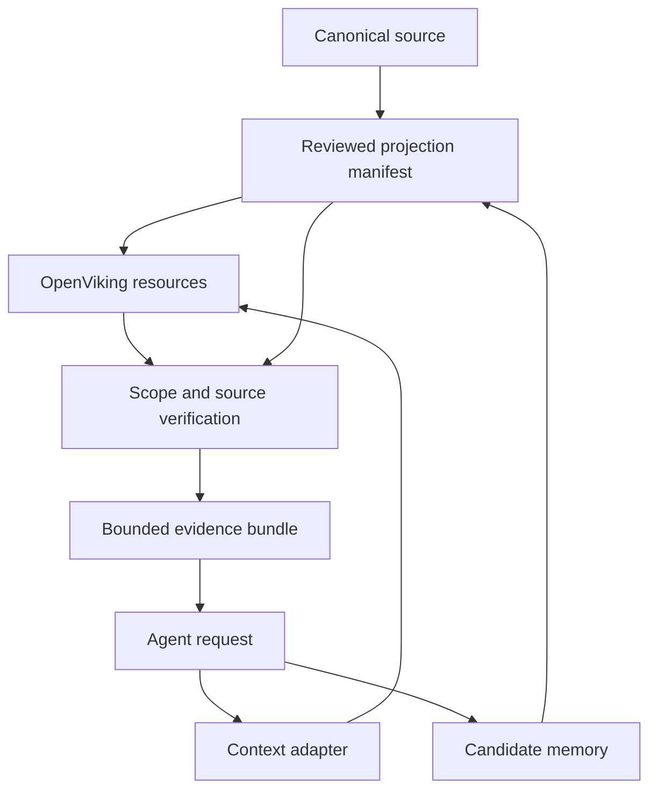

# Shared Context Pilot — SDD

Status: Implemented offline contract experiment; live gates pending. 2026-10-04.

## 問題與成功條件

多 agent 重複讀取同一份 context，session 結束又重新整理，容易把摘要誤當原話、舊設定誤當當前決策。共享層應提供有來源、有範圍、有預算的 evidence bundle，讓不同 harness 可消費相同知識版本。

P0 成功是固定合成文件可 seed、scoped find、L2 回讀、checksum 核對並輸出有界 bundle。離線驗收只能證明 adapter 語意；真正 server 與模型路徑有獨立 gate。

## Ownership

| 層 | 責任 | 本次 |
| --- | --- | --- |
| Canonical source | 原始文件、版本、審閱決定 | fixture 模擬；無正式 corpus 同步 |
| Ingestion/compiler | 解析、去識別化、candidate 產生 | 沿用既有平台能力；本 lab 只 seed 合成文件 |
| OpenViking | resource、summary、vector、memory storage/retrieval | 外部服務，固定 v0.4.23 |
| Context adapter | scope、evidence allowlist、hash、輸出預算 | 本次實作 |
| Agent runtime | tool execution、sandbox、approval | 既有 agent-platform；未接線 |

最後的 candidate/review 閉環是後續設計；P0 無 memory 寫回。manifest 是受信任的控制端 artifact；本程式不是多租戶 gateway。能修改程式或 manifest 的人能改 allowlist，不能把它當 server ACL 的替代品。

## 契約

- `scope` 只允許明確 `viking://resources/<project>` 或 `viking://user/<user>/resources/<project>`；不接受全域、alias、percent encoding、traversal 或多層任意路徑。
- `find` 固定 `context_type=resource, level=2, limit=1..20, include_provenance=true`；先核對 URI，再讀取內容，不使用 response preview 生成答案。
- Manifest 欄位：`file, source_uri, source_revision, sha256, claim_type, state`。P0 都是 `synthetic_source_fact`；核准狀態為 `approved`，人工維護。
- L2 的 SHA-256 必須等於 manifest。這驗證版本與完整性，不證明來源主張為真；來源／approval 輸入本身須受信任。
- Bundle 帶 URI、原來源、revision、hash、claim type、state 與全文。完整 compact JSON＋newline 受 `max_bytes` 限制，整筆放不下即略去。這是 UTF-8 byte cap，**不是模型 token cap**；正式 adapter 須按目標模型 tokenizer 預留 system/tool/output 預算。
- 無命中回空 entries；越界、candidate、hash 不符、錯誤 envelope、超量 response 整次失敗，CLI exit 2，不回部分 bundle。
- HTTP timeout 有上限、response 1 MiB、拒絕 redirect、不帶任意租戶 headers；key 只從 0600 regular file 讀取。transport 診斷不回顯 server body/key。
- Seed 先 read：404 才 create；已存在且相同則略過。建立後核對 processing status 與全文；不重試未知寫入結果，不覆寫既有不同內容。多文件並非原子交易，失敗前可能已有文件落庫；重跑先對帳。
- 相同 key 的兩個 CLI process 能證明相同身份跨 session 存取；不能用此宣稱跨 user 隔離。

## 分享與權限設計

正式方案：account = trust domain；user = 穩定身份；project = scope＋明確 ACL。Shared resources 預設 account 共享且 ACL 預設停用；啟用後 root 仍給 `user:* = manage`，必須另建 restricted project root。`peer_id` 不是 tenant；不同 agent 名稱也不自動隔離。

上游 ACL 更新不是強一致。正式 adapter 需在權限撤銷時先禁用入口、失效 cache/bundles、等索引及讀取驗證完成；高敏感資料先維持獨立 account/store。Server credentials 放控制端，不變更 sandbox `net=none` 或既有 broker policy。

## Lifecycle 與 failure model

後續採 `captured → candidate → reviewed → published → superseded/revoked`；錯誤摘要不能直接回寫 canonical。Projection key 使用 source revision＋processing/model config；升級 embedding dimension/model 時建立新 index generation、重跑 golden queries 後切換，保留原 corpus 可重建。

刪除／撤銷須涵蓋原投影、vectors、L0/L1、derived memory、bundle/cache、snapshot/backup retention；寫 tombstone 防止下次重匯入。OpenViking snapshot 只保存明確 commit 的文件範圍，不回滾 ACL／向量；備份需包含 account/user registry、config、密钥獨立保管及還原實測。

## 驗收與演進

| Gate | Oracle | 狀態 |
| --- | --- | --- |
| P0-offline | provenance、byte budget、越界、candidate、mutation、replay/error 測試＋demo | 本次執行，見 evidence |
| P0-live | v0.4.23 seed 後 find 可見、回讀 hash、兩個独立 client 一致、index lag 可診斷 | 待核准 provider 與實機 |
| P1-isolation | account/user/restricted ACL 跨界零洩漏，撤銷後 preview/read/cache 都拒絕 | 未實作 |
| P1-quality | 30 題固定 corpus：recall@k、citation correctness、過期率、p95、token／費用 | 未執行 |
| P2-memory | 明確 opt-in 的 session memory candidate；原話與 inference 分離、人審 promotion | 未實作 |
| P3-platform | broker adapter、模型預算、restore/delete、upgrade/rollback | 未接線 |

P0 完成不構成部署或後續階段授權。先用合成 corpus，再逐批選定可釋出投影；不把私有原文或全量 session 當預設輸入。
