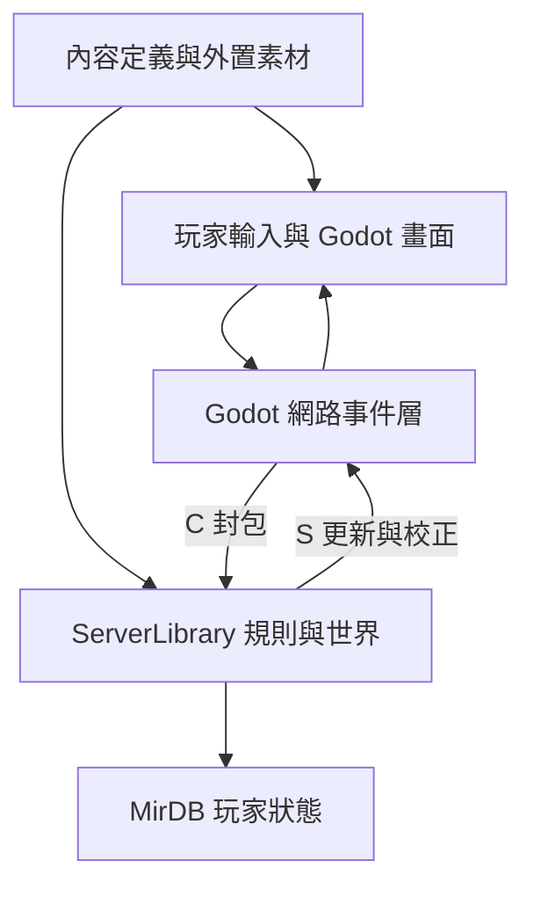

# 從 Zircon-Godot 學習遊戲工程

## 1. 先回答「這個專案可以幫我入門嗎」

可以，因為它把玩家操作、封包、伺服器規則、持久化與畫面放在同一個可追索的程式庫中。對已有後端經驗的人，最有效的切入點是追一個操作的完整因果鏈，而不是先學完所有渲染與遊戲數學。

但「有完整遊戲領域模型」不等於「clone 就能玩」，也不等於「所有功能已完成」。上游 README 宣稱登入、選角、進世界、移動、戰鬥、NPC、背包等已整合；本研究在程式碼中確認相應入口，但沒有運行其遊戲環境。Godot 客戶端仍在追平舊客戶端。[E01、E02]

## 2. 血緣與成熟度

上游 README 將自身定位為 `Suprcode/Zircon` 的 fork；其同步政策說明 Windows 舊客戶端與 Godot 新客戶端已大幅分歧，因此採選擇性移植。這支持「以既有 C# 遊戲實作為參考的現代客戶端重建」，不能據此推導官方原版源碼、商業授權或生產穩定性。[E01、E02]

固定 tree 中未找到根目錄 `LICENSE` 或 `COPYING`；能看到第三方字型的授權檔。這是檔案觀察，不是全 repo 的法律結論。本實驗只交付原創分析與來源連結，不把外部程式和素材放入 newclear。日後若要散布 fork、素材或安裝包，先補清楚各部分的權利來源。[E00]

| 層次 | 已取得的證據 | 不能推導的結論 |
| --- | --- | --- |
| 遊戲領域廣度 | 地圖、角色、怪物、物品、技能、任務、交易等入口 | 所有系統都可用或平衡良好 |
| Godot 重建 | 實際場景、網路事件、地圖與图库讀取器 | 已和舊版完全一致 |
| 工程驗證 | 專項檢查、審計文件、BotRunner | 完整 Godot E2E、容量或安全驗證 |
| 本研究 | 固定版本原始碼追蹤與文件交叉核對 | 本地成功登入、跨平台可用、商業營運能力 |

## 3. 系統拆分：誰擁有真實狀態

| 模組 | 真正責任 | 閱讀入口 |
| --- | --- | --- |
| `ServerCore` | headless host：載設定、啟動環境、處理結束 | `Program.cs`、專案檔 [E03] |
| `ServerLibrary` | 世界、角色、戰鬥規則、連線階段、持久化調度 | `SEnvir`、`SConnection`、`PlayerObject` [E04] |
| `LibraryCore` | 共用型別、封包序列化、TCP 基類、MirDB | `Network`、`MirDB` [E05、E06] |
| `GodotClient` | 輸入、畫面、預測／校正、UI、資源載入 | `NetworkManager`、`ServerConnection`、`GameScene` [E07] |
| `Client`、`RenderingCore` | Windows 舊實作與行為參考 | 不將它們的修改直接等同 Godot 修復 [E02] |
| 工具與內容 | 編輯／轉換、專項 checks、bot | 不和遊戲伺服器混成單一建置目標 [E09] |

`ServerCore` 和 Windows `Server` 是不同宿主，不是兩套戰鬥核心。初學時先建置 headless 路徑，避免同時承擔 Windows 編輯器／渲染依賴。[E03]

## 4. 一步移動就是最小教材

1. `GameScene` 依輸入與負重等條件決定移動，送出 `C.Move(Direction, Distance)`，同時維護預測與等待回包的狀態。
2. Godot `NetworkManager._Process` 同步輪詢 TCP，累積半包，解析後放進連線接收隊列；再呼叫 `Connection.Process()`。這和共用 `BaseConnection` 的非同步接收路徑不同。
3. 伺服器 `SConnection.Process(C.Move)` 檢查連線是否進入 Game、方向是否有效，再交給 `PlayerObject.Move`。
4. `Move` 檢查動作時間、可否移動、距離、坐騎與每個格子。拒絕時可回送 `S.UserLocation`；成功移動會更新世界位置並通知相關客戶端。
5. Godot 透過 `UserLocationEvent`、`ObjectMoveEvent` 更新本地與其他角色的表現。

因此「畫面已移動」與「伺服器接受移動」是兩件事。第一個測試應同時觀察兩邊座標；再故意撞牆或送不合法距離，確認校正，而不是只錄一段流暢畫面。[E04、E05、E07]

## 5. 協定值得借鑒，也有相容性成本

這是有 frame 的 TCP 二進位協定：4 bytes 總長度、2 bytes 封包 ID、反射序列化的 payload。ID 由共用 assembly 內 Packet 直接子類的排序決定；屬性由 `GetProperties()` 走訪。因此新增／改名 packet、改 enum 或屬性，都可能影響另一端，不能只看某個 class 能編譯。[E05]

**版本差異需以程式碼為準。** 早期讀到的 `docs/NETWORKING.md` 說沒有封包上限；本次固定版本的 `Packet.ReceivePacket` 已拒絕小於 6 bytes、大於 64 MiB 的長度，以及不存在的 ID。8 KiB 是接收 buffer，並非封包上限。這個檢查也不代表巢狀 collection count、解碼成本、協定版本與所有惡意輸入都驗證完畢。

本地實驗先讓 client/server 共用同一 SHA。新增自有協定前，先設計顯式 schema/version、golden bytes 與雙端測試；這些是我們的後續設計要求，不是宣稱上游已具備。共用 TCP path 沒有自動提供 TLS；資料庫加密和網路傳輸是不同邊界。[E05]

## 6. 遊戲迴圈如何接到熟悉的後端概念

`SEnvir.EnvirLoop` 接納新連線、處理封包、處理玩家，再以約 1 ms 的工作視窗輪流處理其他 active objects，另有定時存檔與世界工作。它不是「每 1 ms 完整更新所有怪物」的固定 tick。正常 gameplay 狀態主要在既有環境迴圈中修改，但 socket、載入、日誌、commit 等仍有其他執行緒。[E04]

| 後端已有經驗 | 遊戲中的對應 | 新增的注意事項 |
| --- | --- | --- |
| API request validation | 封包階段、角色狀態、動作冷卻檢查 | 每個 frame 的時序也影響結果 |
| 資料 owner／transaction | 世界狀態 owner 與事件迴圈 | 不要在 gameplay handler 睡眠或任意另開執行緒修改角色 |
| 讀模型／前端快取 | 客戶端世界投影與預測 | 需要容許校正，不能把動畫當成權威 |
| schema migration | System.db、Users.db 與共用 enum | 引用身份和顯示索引要一起驗證 |
| 可觀測性 | packet、座標、動作與畫面的關聯證據 | 錯一幀／一個資源 index 可能比 HTTP error 更難看見 |

## 7. 資料庫與內容並不是一回事

`System.db` 放共用內容定義，`Users.db` 放玩家狀態，使用專案自有 MirDB；不要因為副檔名 `.db` 就假設是 SQLite。`Session` 透過反射發現型別、維護 collection 與關係，保存時有 `.TMP` 與 `.gz` 路徑；`SEnvir.Save` 先準備物件，再以背景 commit 落盤。存在備份程式碼不等於已完成故障恢復驗證。[E06]

Godot `DatabaseLoader` 先找 `MIR3_EI_ROOT/Data/System.db`，再找預設與專案相對候選路徑，載入 `Globals` 定義表。部分收到的物品資料需要依定義索引完成反序列化；因此 TCP 連得上，仍可能因內容版本／缺資料而進不了世界。[E07]

`DBObject.Index` 的持久身份與 collection 的位置不能混用。改物品前先辨識：是「物品定義」、某玩家持有的「實例」，還是地圖上的「掉落呈現」。首次練習避免直接改存檔格式。

## 8. 圖像錯誤常是資料契約錯誤

Godot `MapReader` 讀取地圖尺寸、半解析度背景、格子遮擋與圖像索引；部分索引讀取加一、繪製再減一。`ZlReader` 解碼圖庫與快取 texture，`LibraryCache` 解析 Windows 路徑並處理檔名大小寫。這些是跨平台移植中容易「能編譯但畫錯」的邊界。[E08]

技能動畫又多了起手、彈道、命中、地面效果與延遲。上游魔法審計以旧 client 為參考，逐項核對資源檔、起始幀、幀數與目標；這種差異矩陣可借鑒。但文件中的覆蓋結論只代表當次審計，不能替代本次 runtime 驗收。[E09]

## 9. 值得帶走的工程方法

- **保留規則核心、替换表現層**：先保持協定與資料一致，才能定位移植偏差。
- **一次追一個垂直切片**：輸入 → 封包 → 規則 → 回包 → 畫面 → 存檔，每段都留一個可觀察結果。
- **把內容當成有版本的依賴**：source SHA、System.db、地圖、圖庫共同決定實驗結果。
- **用參考實作做差異驗證**：比較具體行為，不把整個歷史客戶端直接 merge 到 Godot。
- **最小變更再回歸**：先改一個怪物既有攻擊參數或單個顯示行為，避免第一次就設計新職業／新協定。

第一個修改題推薦選一個已載入的怪物，追到 `MonsterInfo.AI` 選用的 class，在理解父類後修改單一既有攻擊參數。`OmaMage` 是短小的參考，但需讀其 `SkeletonAxeThrower` 父類；不假定這隻怪物一定存在於使用者提供的地圖。完成前後對照後再決定是否提上游 PR。[E04]

來源代號與完整固定版本連結見[來源與驗證](evidence.md)。我們自己的執行計畫見 [SDD](sdd/README.md)。
