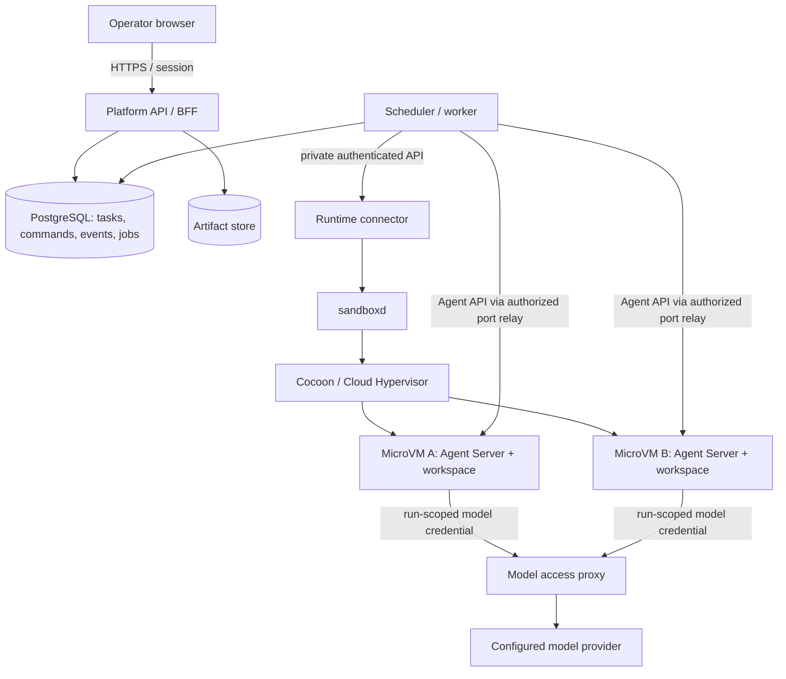
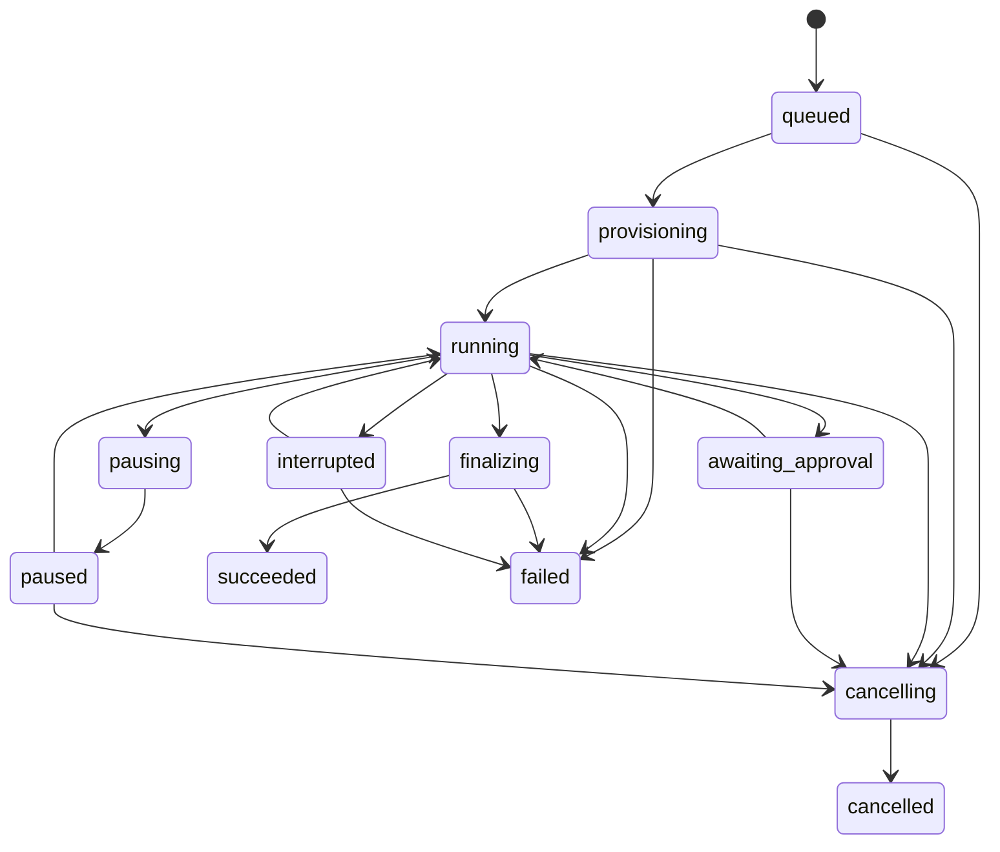

# Agent Platform — Software Design Document

- Version：0.1.0
- Date：2026-09-21
- Status：Draft / documentation-only；所有實作里程碑均未開始
- Repository：`fallrising/newclear`
- Component：`platform/agent-platform`
- Language：繁體中文，保留必要協定與程式識別字
- Product reference：OpenHands Agent Canvas
- Runtime direction：OpenHands Software Agent SDK／Agent Server + Cocoon sandbox

本文件定義預計實作的契約，不是現成功能說明。`MUST` 為此平台的驗收要求；上游已提供的能力與尚待驗證的整合，分別在 [研究紀錄](docs/reference-selection.md) 與第 16 節列明。本次工作只交付設計與項目入口。

## 1. 問題、目標與決策

使用者希望在自己的伺服器上同時執行多個 agent，從單一 Web UI 派任務、觀察進度、介入工作並取得成果。Cocoon 提供 VM 執行環境，sandbox 提供環境 API；兩者不直接提供上述完整產品流程。LLM gateway 的 key／用量介面也不擁有任務與對話。

平台必須回答：哪個任務由哪個 agent 執行、在哪個環境、改了哪些檔案、目前等待什麼、消耗多少資源，以及使用者關掉瀏覽器或服務重啟後如何繼續。

**ADR-001：選 OpenHands Agent Canvas 作為唯一主產品範本。** 它的工作台、backend 概念與 agent server 分層最符合本題；OpenClaw、Dify 作為比較對象。星數與來源日期見研究紀錄，不把「熱門」解讀成市占或品質保證。

**ADR-002：參考產品流程，自建最小控制面；agent loop 優先重用 pinned OpenHands SDK／Server。** 不 fork 整套 Canvas、不重新寫通用推理框架。M0 驗證 SDK 契約後產生 adapter fixture；若嵌入 Canvas 元件更合適，以後另寫 ADR，不默默引入整個上游服務圖。

**ADR-003：一個 active run attempt 對應一個 MicroVM。** 同一 agent profile 可以產生多個實例。VM 是環境隔離單位；agent 是程式；任務與對話是平台資料，三者不可互相替代。

**ADR-004：第一版單節點、單 operator、可並行多任務。** 不先做多租戶 SaaS 或 Kubernetes。控制面用 PostgreSQL 同時保存狀態與 durable queue，初期不增加 Redis、Kafka 或另一套自動化排程服務。

## 2. 範圍與現有專案關係

本次 owner 要求在 newclear 新增 agent 平台並先寫 SDD，構成對 2026-09-05 portfolio freeze 的此項目、此階段例外。沒有因此宣布所有舊 agent 項目復工，或把後續部署標成已授權且完成。

| 元件 | 既有責任 | 本項目邊界 |
| --- | --- | --- |
| `platform/fanzloud` | personal BYOS、Codex Cloud 控制流程 | 是相鄰既有實作；不搬移或擴寫其 runtime，不共用憑證目錄。新平台聚焦自行管理的 MicroVM 與標準 agent backend |
| `products/kith` | 人類與 agent 同房對話 | 不以 room message 當排程佇列；未來可接公開 API，非 MVP 依賴 |
| `gateways/pokercase` | 模型流量 gateway | 不增加任務／VM 控制功能；後續只經明確 provider adapter 整合 |
| `specs/fleet` | 部署生命週期公開契約 | 可供未來 deployment adapter 參考，不在本平台重做主機 provisioning |
| Cocoon／sandbox | VM、預熱池與 guest 操作 | 外部 runtime 服務；平台不重寫 hypervisor 或直接操作任意主機 shell |

### 2.1 MVP（M0–M4）

- 單一 Linux/KVM 節點，單 operator 登入，平台容量預設最多 4 個同時執行的 run。
- Web：概覽、任務列表、任務工作台、agent profile、runtime／用量設定。
- 手動任務、持續對話、獨立 workspace、日誌、diff、成果下載、取消、受控暫停／恢復與審批。
- OpenHands backend；實際版本與工具清單由 M0 鎖定。
- SQL durable queue、事件重播、worker restart reconcile、環境清理與容量限制。
- 模型使用官方 API 或管理員設定的 API-compatible endpoint；MVP 不需要 consumer subscription 登入整合。
- 結果預設保留在平台。GitHub push／PR 是獨立、明確授權的 export 動作。

### 2.2 後續（不阻擋 MVP）

- M5：ACP-compatible agent adapter、GitHub webhook、UTC 排程；各自有 contract test。
- M6：多節點 placement、runtime pool 管理、團隊登入／RBAC、VM checkpoint／fork。
- 之後再評估 planner → worker → reviewer 等協作流程；並行執行本身不代表 agent 自動協作。

### 2.3 非目標

MVP 不做視覺化 DAG 編輯器、RAG／知識庫產品、手機／桌面 computer-use、模型訓練／推論服務、任意第三方 agent 一鍵相容、跨節點 live migration、SaaS 計費、平台代管公開註冊、VM 主機安裝自動化或自動 merge／部署成果。

## 3. 使用者故事與成功條件

| ID | 使用者故事 | Given / When / Then |
| --- | --- | --- |
| US-01 | 建立程式工作 | Given 已設定唯讀 repository access 與 model profile；When 選定 base SHA 並送出任務；Then 取得穩定 task ID，進入 queue，不依賴分頁存活 |
| US-02 | 同時處理多個工作 | Given 容量為 4；When 提交 5 個任務；Then 4 個取得獨立 sandbox，第 5 個排隊；不覆蓋彼此 workspace |
| US-03 | 查看與介入 | Given 任務執行中；When 打開工作台；Then 可看到持久化對話／工具事件／輸出，送入後續訊息或取消 |
| US-04 | 關閉瀏覽器後繼續 | Given 工作已開始；When 關閉再開啟 UI；Then 以事件 cursor 重播，任務不重跑、不丟失已確認事件 |
| US-05 | 核准特定操作 | Given 有待審批動作；When operator 核准該 action digest；Then 只執行一次匹配動作，不能被後續修改借用 |
| US-06 | 檢查成果 | Given run 完成；When 打開結果；Then 顯示 base SHA、diff、測試結果／未跑原因與 artifact，不自動修改遠端 branch |
| US-07 | 故障恢復 | Given worker 在執行中重啟；When lease 重新取得；Then 先核對既有 VM 與 conversation，能重接才續跑，狀態不明則顯示 `interrupted` |
| US-08 | 控制成本與資源 | Given run 設定預算／時間／RAM；When 到達門檻；Then 停止新模型／工具 admission，顯示原因並進行有界收尾 |

MVP 完成的最小展示：同一 Web UI 同時觀察至少兩個真實隔離 sandbox 的 fake-model agent 任務；真實 provider 另跑一次 opt-in smoke。fake 測試不等於真實模型品質或生產可用性。

## 4. 領域定義

| 實體 | 定義 |
| --- | --- |
| Project | repository 與存取／環境政策；不直接持有執行中的 shell |
| AgentProfile | backend、模型引用、工具政策、預算與版本的不可變 revision |
| Task | operator 的工作目標；可有多個歷史 run，但 MVP 每 task 只允許一個非終態 run |
| Run | 一次嘗試，包含固定輸入／base SHA／profile revision、執行與結果 |
| Attempt | 同一 run 的可定位實際 backend instance；自動 recovery 不新增另一份計費執行 |
| Conversation | backend 對話 ID 與持久化狀態；不是 WebSocket connection |
| Sandbox | VM handle、node、lease、實際狀態；不以 task status 推斷 VM 已刪除 |
| Event | 平台標準化、可重播的事實；不是觸發命令 |
| Command | 使用者或排程器發出的意圖，有 command ID、版本條件與執行結果 |
| Approval | 特定 run／action／generation 的一次性決策 |
| Artifact | 已封存、具 hash／大小／媒體類型的 diff、報告或檔案 |

「暫停 agent」是停止新動作並等目前操作收尾；「休眠 VM」是保存記憶體與磁碟後停機。MVP 只要求前者，後者屬 M6。暫停中的 sandbox 仍占容量；UI 必須說明。

## 5. Web UI 與主要流程

### 5.1 資訊架構

| 頁面 | 主要內容 | 主要操作 |
| --- | --- | --- |
| Overview | 執行／排隊／等待審批／失敗數量、節點容量、今日用量 | 開啟需處理的 task、新建 task |
| Tasks | 依 project／狀態篩選、最近活動、run 次數 | 建立、搜尋、取消、重試 |
| Task workspace | 左：task/run；中：對話／活動；右：Files／Diff／Terminal output／Artifacts | 送訊息、審批、暫停／繼續、取消、下載、授權 export |
| Agent profiles | backend、模型、工具、資源與預算的 revision | 新增、複製、停用；不改寫 run 已固定的 revision |
| Runtime | 節點是否可用、CPU/RAM reservations、sandbox 實際狀態、清理失敗 | drain、新任務暫停 admission、重試清理 |
| Settings / Usage | operator session、secret references、model endpoint、逐 run 用量 | 輪替 credential、設定限制、檢查 estimated/final 用量 |

每頁提供 loading／empty／unavailable／permission-denied 狀態。能力未支援時禁用操作並說明原因。終端輸出與 agent 狀態分開：命令退出碼 0 不表示 task 已成功。MVP 不提供直接寫入 shell 的互動終端；人工介入透過訊息、審批與暫停後的後續任務，避免兩個 writer 同時修改 workspace。

未受信任的 Markdown 使用安全 renderer；HTML、diff、artifact 與 preview 不可在控制面 origin 任意執行腳本。MVP 不內嵌任意 Web preview；未來 preview 使用隔離 origin 與短效權杖。

### 5.2 主要流程

1. Operator 選擇 project → 輸入目標 → 選 profile／資源／預算；branch 先解析成 base commit SHA，保存在 run input。
2. API 同一 transaction 建立 task、run、queue job 與 `run.queued` 事件；回 `202`。
3. Worker 取得 lease 與容量 reservation，向 runtime connector 申請 sandbox。
4. Connector 確認 VM 可用、載入唯讀 clone credential、checkout base SHA；啟動獨立 Agent Server 與 conversation。
5. Worker 傳送 prompt，消費 backend events，轉成平台事件後落盤，再通知 UI。
6. 工具審批、模型額度與執行時間都在平台／受控 adapter 的 admission 層處理；不依賴 prompt 自律。
7. Agent 結束後保存 diff／結果／usage，完成必要 artifact upload；再標記 run terminal。
8. 清理 sandbox 與撤銷 run credential；清理未確認前仍占資源 reservation，Runtime 頁面可追蹤。

## 6. 架構與責任



圖中的 OpenHands ↔ sandbox port relay 是**目標整合**，M0 必須證明 REST／WebSocket、reconnect、cancel、憑證傳遞與 readiness 都可行。沒有把 sandbox 的 MCP server 當作完整 Agent Server。

| 模組 | 責任 | 不擁有 |
| --- | --- | --- |
| Web | 任務視圖、互動、事件重播 | provider／sandbox root keys、排程權威 |
| API / BFF | 身分驗證、輸入驗證、命令、權限、讀取 projection | 任意 host exec、長時間 agent loop |
| Scheduler / worker | admission、lease、run lifecycle、backend adapter、事件匯入、恢復 | hypervisor 實作、模型推理 |
| Runtime connector | 固定模板 catalog、run→sandbox mapping、idempotent 操作、容量與 cleanup 核對 | 接受瀏覽器任意映像、路徑或 shell |
| Agent Server | agent loop、工具與 conversation serialization | 平台帳號、跨任務排程、GitHub export 權限 |
| Model access proxy | run token 驗證、model allowlist、請求預算 reservation、usage 歸屬 | 複雜多供應商 routing／SaaS 帳務 |
| Export worker | 獨立受控的 patch／GitHub export | agent sandbox 的任意指令執行 |

### 6.1 技術選擇（設計方向，非已安裝版本）

- Web：React + TypeScript + Vite；query cache 管 server state，SSE 管事件增量。
- API／worker／connector：Python + FastAPI，便於接 OpenHands 與 sandbox Python SDK；獨立程序／權限，即使共用 package。
- Persistence：PostgreSQL、SQL migrations；durable job 用 `FOR UPDATE SKIP LOCKED` 與明確 lease。
- Artifacts：MVP 可使用不在 Web root 的本機目錄，加 authenticated download API；保留 S3-compatible adapter 邊界。
- Run runtime：Linux/KVM、Cocoon、sandboxd、固定 digest 的 guest template；Agent Server 在 guest 中以非 root 執行。
- Deployment：控制面容器／服務與 host-level sandboxd 分離；不把 `/dev/kvm` 或 Docker socket 暴露給 Web／agent。
- Exact versions、lockfiles、image digests、SDK schema hash 與 release compatibility matrix 在 M0 產出並於 M1 固定，不使用 `latest` 當可重現部署契約。

### 6.2 為什麼不直接把 Canvas 接到所有 VM

Canvas 是參考 UI，平台需要自己的持久 task/run identity、queue、授權、成本歸屬與清理責任。瀏覽器直接持有各 backend root keys 無法提供本設計的控制邊界。所有 runtime 請求由 server-side adapter 發起，Web 使用平台 session。

## 7. Adapter 契約與能力協商

以下是**本平台內部介面**，不是宣稱上游有同名 endpoint。

```text
AgentBackend:
  capabilities() -> {protocol_revision, event_replay, durable_resume,
                     pause, cancel, approval, usage, terminal_output}
  create(run_context, operation_id) -> backend_conversation_ref
  send_message(ref, message, command_id)
  events(ref, backend_cursor) -> normalized event stream
  inspect(ref) -> observed_state + cursor
  pause / resume / cancel(ref, command_id)
  decide(ref, action_digest, decision, command_id)
  export_state(ref) -> serialized conversation reference

SandboxProvider:
  capabilities() -> {templates, tiers, lease_renewal, port_relay,
                     checkpoint, fork, hibernate}
  allocate(run_id, generation, operation_id, template_digest, tier)
  inspect(handle)
  renew(handle, deadline, operation_id)  # optional; unsupported in MVP until verified
  connect_agent(handle, service_id) -> private authorized transport
  release(handle, operation_id)
```

Adapter 只能使用 M0 fixture 覆蓋的上游契約；不解析 CLI 的人類可讀輸出當核心協定。`unsupported_capability` 不可悄悄降級成 host shell。ACP adapter 是 M5 項目；Codex／Claude Code 等不能只因 Canvas README 提及就列為本平台已支援。

Runtime connector 維持持久 operation ledger；sandboxd 若不提供 allocation idempotency，必須以 connector serial admission、run tag／handle journal 與 crash reconcile 補足。失聯且無法判斷 allocate 是否成功時停止自動重試，先對帳，不能無限重複建立 VM。

## 8. 資料模型與持久化

所有時間以 UTC 保存；識別字為不可猜測 ID。以下為 logical schema，實作 migrations 需覆蓋約束及索引。

| Table | 關鍵欄位與約束 |
| --- | --- |
| `operators`, `sessions` | 單一 bootstrap operator；session token hash、expires_at、revoked_at；無預設密碼、無公開註冊 |
| `projects` | id、name、canonical_repo、clone_secret_ref、policy_revision |
| `agent_profile_revisions` | profile_id、revision、backend、model_ref、tool_policy、limits、template_digest；UNIQUE(profile_id, revision) |
| `tasks` | id、project_id、title、created_by、created_at、archived_at |
| `runs` | id、task_id、attempt_no、base_sha、profile_revision、state、state_version、generation、backend_ref、sandbox_id、deadline、reason；UNIQUE(task_id, attempt_no)；partial unique 每 task 一個非終態 run |
| `jobs` | id、run_id、kind、available_at、lease_owner、lease_until、generation、attempts；UNIQUE(run_id, kind, generation) |
| `commands` | id、run_id、kind、payload_hash、expected_version、status、result；同 operator/route/idempotency_key 唯一 |
| `run_events` | run_id、seq、event_id、source、source_event_id、type、payload、created_at；PK(run_id, seq)，UNIQUE(run_id, source, source_event_id) |
| `run_messages` | id、run_id、role、content、command_id、backend_message_id；UNIQUE(run_id, command_id) |
| `approvals` | id、run_id、generation、action_digest、summary、expires_at、decision、decided_by；決策 compare-and-set |
| `sandbox_bindings` | id、run_id、node_id、provider_handle、generation、desired_state、observed_state、lease_deadline、last_seen、cleanup_state |
| `resource_reservations` | sandbox_id UNIQUE、cpu、memory_bytes、disk_bytes、released_at；cleanup 確認後才歸還 |
| `artifacts` | id、run_id、kind、object_key、sha256、size、mime、base_sha、head_sha、created_at |
| `usage_entries` | run_id、provider_request_id UNIQUE、input_tokens、output_tokens、amount_decimal、currency、price_revision、status（reserved/estimated/final/unknown） |
| `export_operations` | id、run_id、artifact_hash、target_repo、branch、approval_id、state、remote_ref；idempotency key 唯一 |
| `audit_events` | actor、action、target、request_id、decision、created_at；不存 credential |

`run_events.seq` 由每 run counter 在 transaction 中分配，不用 COUNT；UI 只依 seq 排序。先 commit event，再通知 live consumers。重播事件只更新 projection，不能再次送 prompt、執行工具、付款或建立 PR。

Backend cursor／平台 seq 是不同 namespace。Adapter 必須持久化 source cursor 與 source_event_id；無穩定 replay ID 時標示 event gap，不能產生假的完整歷史。大量 terminal output 先寫 bounded blob，再讓 event 引用 offset/hash；不要把無上限輸出塞入單一 SQL row。

## 9. 狀態機、並行與恢復

### 9.1 Run 狀態



表為完整補充：`pausing` 可 cancel；任何 active state 發生無法核對的斷線可轉 `interrupted`，保留 `interrupted_from`；`interrupted` 可 cancel。`interrupted` 只在確認同一 backend instance 仍可安全恢復後回原狀態，不能自動另建第二份 agent。`finalizing` 是有界成果保存階段，cancel 回 `409 finalizing`，避免把已完成工作誤判成取消。

`succeeded/failed/cancelled` 為不可重開終態；重試建立新的 run／attempt，舊事件與成果不變。Agent 報告完成後必須封存結果才 `succeeded`。程式工作以 profile 指定的驗證命令結果作判準；未設定驗證只能標記「agent reported completion / 未驗證」，不能標示 tests passed。

### 9.2 Lease 與 fencing

- Worker lease：預設 30 秒、每 10 秒續租；每次取得 ownership 增加 generation。平台與 connector 的 mutation 都比對 generation；舊 worker 的 late event 可作歷史觀測，不可推進 current state。
- 在 DB transaction 同時 reserve node RAM/CPU/disk 與 active-run slot；release 以 sandbox 確認終止為條件，不能只看 worker lease 到期。
- VM 內既有長命令不會因 DB fencing 自動停止。Worker 失聯時，connector 必須核對／停止舊實例後才允許 replacement；無法確認就 quarantine 該 binding，保留容量。
- 不宣稱任意 tool effect exactly-once。平台命令、prompt admission、export 使用 operation ID；對無 idempotency 的 backend，送出結果不明時 inspect／reconcile，仍不明則等待 operator，不盲目重送。
- Run TTL、sandbox lease、worker lease 分開。Sandbox lease 必須覆蓋 run deadline + 2 分鐘收尾。已讀到的 sandbox claim 支援 `ttl_seconds`（預設 5 分鐘、上限 24 小時），但沒有據此確認一般 lease renewal；因此 MVP 在 allocate 時一次申請足額 TTL，不依賴 `renew`。未來只有 capability 與實測通過才啟用 renewal；期限不足就提前取消／封存，不能讓 VM 在任務仍顯示 running 時被回收。

### 9.3 故障處理

| 情況 | 必要行為 |
| --- | --- |
| API／worker 重啟 | 從 DB 恢復 queue，inspect 既有 sandbox/conversation，依 cursor 接續；不重新送初始 prompt |
| Agent Server 重啟 | 只在 durable state 與工具執行狀態一致時 resume；否則 interrupted，保留 workspace 供下載／另開 run |
| Node 不可達 | observed 狀態標 unknown，保留 reservations；不假裝已刪除、不立即在另一節點重跑 |
| DB 不可用 | 拒絕新任務／新審批；worker 停新 admission；已在 guest 執行的操作由有界 deadline 與 connector 收尾 |
| Model 429／5xx | 有界 backoff；串流已產生內容但結果不明，不在無支援 idempotency 時自動重送整個 turn |
| Artifact upload 失敗 | 留在 finalizing 重試最多 2 分鐘；失敗標 `artifact_persist_failed` 並保留 sandbox 進 recovery queue |
| Cleanup 失敗 | 終態 run 保留 cleanup_pending，retry／告警；容量不提前釋放 |
| Cancel timeout | 顯示 cancelling，connector 停 backend；15 秒未止則要求停止 VM。node 不可達時保持 unknown／cancelling |

## 10. HTTP、事件與互動契約

以下是**新平台的 v1 API 設計**；M1 產生 OpenAPI，不對外暴露 sandbox root API。

| Method / path | 語意 |
| --- | --- |
| `POST /api/v1/session`、`DELETE /api/v1/session` | 登入／登出；HttpOnly session cookie |
| `GET/POST /api/v1/projects` | 列出／建立 project |
| `GET/POST /api/v1/agent-profiles` | 列出 profile／新增 revision |
| `POST /api/v1/tasks` | 原子建立 task + 第一個 queued run；回 202 與 Location |
| `GET /api/v1/tasks`、`GET /api/v1/tasks/{id}` | cursor pagination 與 detail |
| `POST /api/v1/tasks/{id}/runs` | 明確建立 retry／新的 attempt；active run 存在回 409 |
| `GET /api/v1/runs/{id}` | state、state_version、capabilities、結果與 cleanup 状態 |
| `POST /api/v1/runs/{id}/messages` | 有序提交訊息；active turn 時入 inbox，下個 safe boundary 消費 |
| `POST /api/v1/runs/{id}/actions` | pause／resume／cancel；回 command ID 與 pending result |
| `POST /api/v1/approvals/{id}/decision` | approve／deny；綁 action digest + generation；逾期／已決策回 409 |
| `GET /api/v1/runs/{id}/events?after_seq=N` | durable SSE replay → live；支援 Last-Event-ID |
| `GET /api/v1/runs/{id}/artifacts` | list，download 另驗證 session 與 object ownership |
| `POST /api/v1/runs/{id}/exports` | 授權範圍內將固定 artifact 匯出到明確 GitHub repo／branch；M4 |
| `GET /api/v1/runtime`、`GET /api/v1/usage` | 實際容量與逐 run 用量；不得回傳秘密值 |

所有 mutation 要求 CSRF protection；建立／action／message／export 另要求 `Idempotency-Key`。同 key 同 payload 回相同結果；不同 payload 回 `409 idempotency_conflict`。狀態 mutation 帶 `expected_state_version`，不符回 `409 state_conflict`。無效輸入 422、容量政策上限 429、暫時無 runtime 503；排隊中容量不足是正常狀態，不當成已啟動。

SSE envelope：

```json
{
  "event_id": "evt_example",
  "run_id": "run_example",
  "seq": 42,
  "type": "tool.completed",
  "created_at": "2026-09-21T00:00:00Z",
  "payload": {"tool_call_id": "tool_example", "exit_code": 0}
}
```

事件型別至少包括 run.state_changed、message.created、tool.started/completed、approval.requested/decided、artifact.created、usage.updated、runtime.cleanup_pending。Live stream 是通知；DB 是事實來源。讀取重播時記錄 high-water mark，再持續讀取大於最後 seq 的已提交列，不以不可靠的 in-memory pubsub 當唯一接縫；客户端對 event_id 去重。Cursor 早於保留窗回 410，UI 重新載入 snapshot 並顯示歷史已封存。

## 11. 安全、憑證與權限

### 11.1 MVP 邊界

MVP 單 operator，不以 workspace ID 欄位宣稱已具備多租戶隔離。建立 operator 透過本機一次性 bootstrap，密碼以成熟 password-hashing library 保存；session cookie 為 HttpOnly/Secure/SameSite，登出即撤銷。Web/API 使用 HTTPS，內部 runtime API 僅 private network／loopback 可達。

Repo 內容、agent 輸出、工具回傳一律視為資料，不得修改平台 policy、node 設定、credential scope 或 export 授權。Guest 不掛載 host home、Docker socket、其他任務目錄、控制面資料庫或 provider master key。

### 11.2 模型與 GitHub

- Provider master key 只存在 control-side secret store。Guest 使用短效、run-scoped proxy token；只可調用 allowlisted model 與 endpoint。Token 不記錄在事件、artifact、URL query 或一般 access log。
- Proxy 對每 request 先 reserve 可計算上界，再 settle；沒有可信價格／token 上界時，禁用「硬金額上限」選項，改提供 request/token/time 上限並明示成本只是估算。未知帳單狀態不視為零。
- Repository checkout credential 為唯讀、repo-scoped、短效。可寫 GitHub credential 只給 export worker；agent 不可自行 push 或建立 PR。
- Export 綁定 run、artifact hash、target repo、branch 與 approval。Base SHA 漂移／衝突需重新檢查；不強制 push、不自動 merge。遠端結果不明時先查 branch／PR marker，不盲目重建。

### 11.3 工具與網路

工具按能力分成 workspace read/write、bounded exec、network access、external mutation。Workspace 內一般編輯與測試可在設定政策內自動執行；額外 network 或 external mutation 須經 deterministic policy／approval。無法可靠分類的任意 shell 不得宣稱能逐條阻止外部副作用：MVP 以 guest 網路 allowlist、沒有 write credential 與 VM 隔離落實邊界。

Guest 出站只經受控 egress/proxy；阻擋 metadata、loopback、控制面與未允許的私網位址，處理 DNS 解析與 redirect 後的目的地檢查。Package registry 與 model proxy 為明確 allowlist。平台不保證防住所有 guest exploit；M0/M3 必須驗證設定實際生效。

Approval 內容保存 normalized action、參數 hash、有效期限與 policy revision。核准後參數變更或 generation 改變需重新審批。Cancel／deny 可撤銷尚未送出的動作；已發生的外部副作用不承諾 rollback。

## 12. 容量、預算與觀測

以下為初始**驗收目標與預設政策**，不是量測結果。

| 項目 | 初始政策／目標 |
| --- | --- |
| Run concurrency | 預設 4；測試至少證明 2 個真實 MicroVM 同時工作與第 5 個排隊 |
| 驗收主機 | Linux/KVM，建議至少 8 vCPU、32 GiB RAM、SSD；測試必須記錄實際規格，不能以此保證任意 workload |
| Run tier | 依 sandbox catalog 選擇，如 2 CPU / 1 GiB 或 4 CPU / 4 GiB；編譯工作按實測提高，不把小 tier 當通用配置 |
| Host reserve | 至少保留 4 GiB 與主機 RAM 的 20% 二者較大值；預熱池同樣計入 admission |
| Run deadline | 預設 30 分鐘，可設定最長 2 小時；暫停／審批仍受 deadline 限制 |
| Agent turns | 預設最多 100 次模型請求，與時間／token／成本上限先到先停 |
| Control API | 測試負載下非串流讀 API p95 < 500 ms，不含上游 provider latency |
| UI 事件 | DB commit 到連線中瀏覽器顯示 p95 < 1 秒 |
| Terminal output | 單 tool 最大 10 MiB，超過截斷並標記；run 日誌上限 100 MiB |
| Artifacts | 單 artifact 100 MiB、每 run 1 GiB；超過拒絕並回清楚原因 |
| Retention | 事件／artifact 預設 30 天；active／interrupted recovery 工作不由一般 GC 刪除；audit 預設 90 天 |

Capacity 計算使用 configured reservations 與 observed 使用量中較保守的結果。CPU 可設明確超賣政策，RAM 初版不超賣；VM、golden template 與 warm pool 都占資源。UI 分別顯示 queue wait、provision、agent execution 與 cleanup 時間，不能用上游 warm-claim 毫秒數宣稱整體任務已就緒。

Metrics：active/queued runs、queue age、provision latency、lease loss、event lag、approval wait、token／estimated cost、sandbox count、cleanup pending、resource reservation drift。Logs 綁 request_id/task_id/run_id/command_id，禁止以 prompt全文或 secret 作 metric label。

## 13. 部署與維運

### 13.1 單節點

1. Operator 在受控 Linux/KVM host 安裝經鎖定的 Cocoon／sandboxd／模板，驗證 guest boot 與 egress。
2. 啟動 PostgreSQL、API、worker、connector、model proxy 與 artifact storage；各自使用最小權限。
3. TLS reverse proxy 只公開 Web/API；DB、sandboxd、Agent Server、connector 不開放公網。
4. Bootstrap operator、註冊固定 template/profile、執行兩任務 smoke，再開放正式工作。

MVP 不使用 Kubernetes；日後多節點保留相同 API 與 run identity，增加 node inventory／placement，不重寫 UI。Host provisioning 與 agent task scheduling 維持不同權限。

### 13.2 升級、備份與清理

- 升級前 drain 新 admission，完成／取消 active runs，保存 artifacts 與 DB；以版本化 migration 更新控制面。
- Cocoon snapshot、guest image 與 OpenHands conversation serialization 分別有版本；沒有證據前不跨版本 resume。sandbox 上游部署文件有舊 state 不直接重用的限制，因此初版採 drain + fresh runtime state 的升級方式。
- 備份 DB、artifact store 與加密 secret metadata；master key 另管。Backup restore 必須測試，DB 備份不是 running VM 備份。
- Cleanup 以 sandbox_binding 對帳，未知 VM 不任意刪除；僅平台明確擁有且符合終態／retention 規則的資源可回收。
- 重啟與 node loss 的診斷頁提供 observed 時間、最後 cursor、lease deadline、cleanup reason；不提供直接 root terminal。

## 14. 不變量與驗收對照

| ID | 不變量 | 必要驗收 |
| --- | --- | --- |
| INV-01 | 每 active attempt 恰好一個受平台追蹤的 sandbox；不同 run workspace 不互通 | AT-02 |
| INV-02 | 事件先持久化再對外發布；replay 不執行命令 | AT-03 |
| INV-03 | 同 task 至多一個非終態 run；duplicate create 不重複 admission | AT-01、AT-04 |
| INV-04 | 失去 lease 的 worker 不能推進狀態或建立 replacement；舊 VM 未確認終止仍占容量 | AT-04、AT-05 |
| INV-05 | Approval 只能授權相同 run/generation/action digest 一次 | AT-06 |
| INV-06 | UI／guest 無 provider master key、sandbox root key、GitHub write credential | AT-07 |
| INV-07 | 取消要有 backend 或 VM 終止證據；node unknown 不可顯示 cancelled | AT-08 |
| INV-08 | succeeded 前必要成果已保存；retry 不改寫舊 run | AT-09 |
| INV-09 | UI 功能由 adapter capability gate，unsupported 不走 host fallback | AT-10 |
| INV-10 | 限制在 admission 層落實，unknown usage 不當作 zero cost | AT-11 |
| INV-11 | 遠端 export 需要獨立授權，綁固定成果與 target，重送不重複建立 | AT-12 |
| INV-12 | GC 只清理已確認 ownership 的資源；retention 不刪 active recovery state | AT-13 |

| Test ID | 方法與通過條件 | Gate |
| --- | --- | --- |
| AT-01 | API/Postgres integration：相同 idempotency key 重送得到同 task/run；不同 payload 409；並行建立符合 unique constraints | M1 |
| AT-02 | 真實 KVM：兩個 run 各寫同名檔案但內容不同，不能讀對方；容量 4 下第五個 queued；cleanup 才歸還 slot | M2 |
| AT-03 | fake backend + browser E2E：產生 100 events，斷線重連 seq 無重複呈現／無缺口；副作用計數不增加 | M2 |
| AT-04 | fault injection：在 allocate 前後、prompt ACK 前後、event commit 前後 kill worker；無第二個 VM／prompt；不明狀態正確 interrupted | M3 |
| AT-05 | node partition + stale worker：舊 generation mutation 拒絕；未確認 VM 消失前不釋放 reservations／不重派 | M3 |
| AT-06 | approval replay、修改參數、逾期、兩人／兩分頁競爭；只有一次合法決策成功，其他 409 | M3 |
| AT-07 | canary secrets、跨 workspace 存取、metadata/private-network 連線、artifact XSS；未洩露且阻擋有效 | M3 |
| AT-08 | cancel 長命令、cancel provisioning、node 不可達：狀態與 observed reality 一致，timeout 不假成功 | M3 |
| AT-09 | artifact store 失敗、測試非零、agent 無驗證宣稱成功：UI 呈現真實結果，無虛構 tests passed | M4 |
| AT-10 | backend 缺 pause／resume／approval capability；UI 正確 disable，API 回 unsupported，沒有任意 exec fallback | M2 |
| AT-11 | 並行模型請求 reservation／settlement、未知价格、429 與預算截止；不再 admission 新請求且用量標示正確 | M3 |
| AT-12 | fake GitHub：export 重送／遠端成功後斷線／base drift；只有一個預期 branch/PR，未授權不寫入；live 僅測試 repo opt-in | M4 |
| AT-13 | DB/artifact restore、stale binding cleanup、retention expiry；可恢復結果，陌生 VM／active state 不被回收 | M4 |

M0/M1 建立 fake model、fake AgentBackend、fake SandboxProvider 與 fake GitHub；真實 KVM/provider smoke 是獨立證據，記錄版本／環境／輸入／結果。文件階段只檢查鏈接、ID 對照、狀態與 diff，不宣稱上述測試已通過。

## 15. 里程碑與交付

| Milestone | 交付 | 完成條件 | 目前狀態 |
| --- | --- | --- | --- |
| SDD | 本文件、來源比較、項目入口與 portfolio 邊界 | 文件一致、來源可追溯、尚未實作標示清楚 | Draft |
| M0 | OpenHands × Cocoon 相容性 spike、版本／schema fixtures、最小 guest template | REST/WS relay、readiness、cancel、serialized resume、TTL/cleanup 與 egress 實測；給每項 pass/unsupported/fail | Not started |
| M1 | API/Postgres/schema、operator login、queue、fake adapters、UI 骨架、根目錄 path-scoped CI | AT-01、登入／建立任務／讀取事件垂直切片 | Not started |
| M2 | 真實 sandbox adapter + OpenHands adapter、並行工作台／events／diff | AT-02/03/10，至少兩個真實 VM 並行 | Not started |
| M3 | lease/recovery、approval、cancel、egress、budget、audit | AT-04/05/06/07/08/11，restart/partition 故障注入 | Not started |
| M4 | 結果封存、explicit GitHub export、backup/GC、單節點部署手冊 | AT-09/12/13、完整 fake E2E + opt-in live smoke；MVP gate | Not started |
| M5 | 一個 ACP adapter、UTC schedules／GitHub webhook | capability contract、delivery dedupe、overlap policy、run history | Deferred |
| M6 | 多節點／RBAC／checkpoint-fork | tenant boundary、placement/recovery、checkpoint compatibility tests | Deferred |

M0 若無法在隔離 guest 可靠執行 Agent Server，可評估外部 agent loop + sandbox tools 的替代方案，但需更新 ADR、資料與故障契約；不得以 host 上直接跑 agent 作為悄悄 fallback。M0 未解的 hard gate 不靠 mock 的通過宣告完成。

M5 若啟用自動化，automation 定義具版本；webhook delivery ID 與 `(schedule_id, scheduled_at)` 唯一；預設同 automation 不重疊執行、missed schedule 最多補一次。自動化只建立 run，不能繞過批准範圍／預算。第一版不同時引入上游 automation scheduler 與本平台 scheduler 造成雙重權威。

## 16. 待驗證項與主要風險

| ID | 不確定性 | 處理／關卡 |
| --- | --- | --- |
| R-01 | OpenHands Agent Server 的 REST/WS、session key 與 sandbox port relay 未整合 | M0 真實 round-trip、長連線與 reconnect fixture；未通過不能 M2 |
| R-02 | 不同 SDK 版本的 serialization/replay/pause/approval 行為可能改變 | 固定 revision/schema；缺必需能力需 ADR 調整，不捏造支援 |
| R-03 | sandbox allocation／lease renewal／清理語意有版本差異 | M0 檢驗；connector ledger/reconcile；結果不明 fail closed |
| R-04 | 多任務 RAM／I/O、warm pool 實際成本 | M2 真實併發量測；RAM reservation 不超賣，拒絕超容量 |
| R-05 | 上游 AGPL server 與本 repo MIT 有不同授權 | 本次只寫文件；部署保留各自 LICENSE/notices，任何修改／重新分發另記錄來源與該版本要求，不假定 HTTP 邊界可取消義務 |
| R-06 | fanzloud 與新平台產品題目相近 | 本項目 scope 固定為自管 VM；不要求遷移既有使用者，後續有重複功能先寫取捨 ADR |
| R-07 | 中斷工具的外部副作用無法通用回滾 | 預設無 write credential、受控 egress、export 獨立；uncertain effect 人工處理 |
| R-08 | DB/worker lease 不會自動停止 guest 程序 | connector stop/inspect 與 quarantine；失聯時不重新並行派送 |

設計暫定：single operator、single node、coding-first、OpenHands backend、Cocoon isolation。未決部署主機、模型供應商與預算不阻擋 SDD；它們是 M0/M1 配置輸入，不以猜測的真實帳號或 credentials 填入。

## 17. 文件與實作管理

- 本 SDD 為本項目的設計基準；研究紀錄說明觀察與選擇，不能用上游 roadmap 覆蓋本地驗收。
- 實作時以 milestone 切片交付，記錄 change、tests、evidence、limitations；任何相容性失敗先更新 ADR／capability matrix。
- 本目錄未包含 runtime code，因此此次不新增假 CI 或 dependency manifest。M1 開始實作時，遵守 newclear 的 [monorepo CI](../../docs/specs/monorepo-ci.md) 設定 root path-scoped workflow。
- 不把日期、版本 pin、延遲目標或文件存在當作功能完成證據。下一步固定為最早未完成的 M0。

## 18. 來源

完整 URL、研究時間、GitHub 指標與 pinned revision 見 [範本研究](docs/reference-selection.md)。核心證據是 OpenHands Canvas architecture／SDK、Cocoon README、sandbox deployment／HTTP API；本平台的資料模型、API、狀態機、限制與 milestone 是本 SDD 的設計決策，並非上游功能保證。
