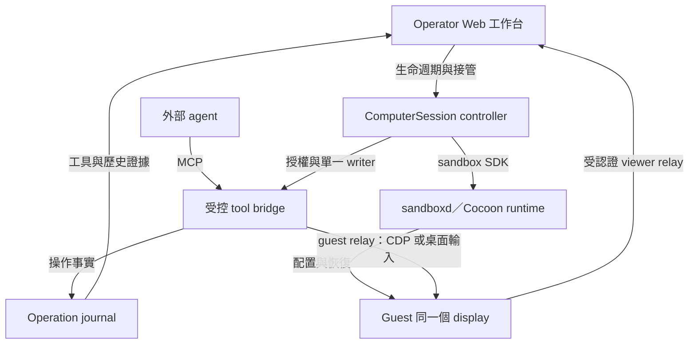

# Agent Computer — Cocoon 可見桌面實驗

- Revision：AC-design-0.3，2026-10-03。
- Status：**Proposed / documentation only**。本次未建映像、未啟動 VM、未連接模型、未做實機驗收。
- Scope：`fallrising/newclear/platform/agent-platform` 的獨立 AC 實驗；[SDD §2.4](../SDD.md#24-agent-computer-實驗acproposed) 是範圍入口。
- Goal：做出 CocoonBox 參考畫面的功能效果，不以「成功開 VM」或 headless browser smoke 代替 Agent Computer。

## 1. 目標畫面與完成定義

Owner 提供的參考畫面包含 VM／連線管理、中央的 Linux 桌面與瀏覽器、右側外部 Claude Code 的對話與工具紀錄。畫面標示外部 client 透過 MCP 控制 box，並可見 `browser_snapshot`、`browser_click`、`screenshot` 等動作。這只是產品參考：不能從截圖證明其 VM 所在主機、底層串流協定、模型版本，或每個動作都是純視覺操作；也未確認 CocoonBox 原版 UI／專用 bridge 的公開來源。本文件不公開原始截圖或其中的個人環境資訊。

**完整展示目標：** operator 在一個工作台中選取真實 Cocoon sandbox，看到 1280×800 的可見桌面；外部 agent 接到同一個 sandbox，用自然語言完成瀏覽器任務與原生 GUI 任務；operator 能觀察每一步並取得控制權；離線、保存、休眠、恢復、分支與銷毀各有清楚結果。

| 區域 | 目標行為 | 不能冒充完成的替代物 |
| --- | --- | --- |
| 左側 Computer／Session | 顯示 computer ID、實際 VM 狀態、連線、控制者、期限；提供 Save now、Hibernate、Restore、Release | 只有靜態狀態卡或將聊天結束當成 VM 刪除 |
| 中央 Agent Computer | 同一個可見 Linux 桌面、Chromium、文字編輯器；預設觀看，接管後才能輸入 | headless 瀏覽器截圖輪播或另一個未被 agent 操作的桌面 |
| 右側 Agent | 外部 MCP client 的對話／工具活動與 computer ID 可對應；每步可回看 | 只顯示「完成」文字，沒有工具與結果證據 |
| 工作結果 | 搜尋、選定結果、播放／全螢幕；以及鍵鼠操作原生編輯器並保存檔案 | 只點播放鍵、只看影片標題、以 shell 寫檔冒充 GUI |

第一版可用 Web 工作台整合；外部 CLI 的訊息依 §4.4 由官方 NDJSON 輸出投影，也可先用有同一 session 標識的相鄰 client 面板驗證。**最終截圖效果 gate 仍須交付整合工作台**，不能把兩個互不對應的視窗列為完整完成。原生 macOS 外殼、品牌像素復刻、音訊串流、GPU／4K 解碼效能、多租戶與手機 computer-use 不在本次範圍。

### 1.1 追加截圖的功能證據

以下依 2026-10-03 提供的淺色／深色畫面整理。「可見」只代表 UI／工具紀錄呈現該資訊，並非我們已測過原產品；「設計」是本實驗要交付的行為。產品可理解為**可管理的遠端電腦、agent 接入與人類工作台**三部分。

| 截圖可見的證據 | 可合理確認的功能 | 尚不能確認的能力 |
| --- | --- | --- |
| 中央標示 `Agent Computer`、1280×800、`view only`；Linux 桌面包含瀏覽器或 terminal | 給人觀看的 agent 桌面區域，當時是唯讀模式 | 不是另一台「人類專屬 VM」的證據；靜態圖片不證明串流協定、幀率或低延遲 |
| 右側標示 Claude Code 在 Mac 上透過 MCP 驅動 box，並呈現終端介面 | 此次示範採外部 agent＋遠端工具；Mac 外殼與 Linux guest 是不同角色 | 無法從外觀判斷內嵌 PTY、事件轉換或其他實作；§4.4 NDJSON 是我們的選擇 |
| `browser_snapshot` 回傳頁面與元素 ref，`browser_click` 使用 ref；另有輸入後按 Enter 的紀錄 | 有結構化瀏覽器操作路徑，可直接指定元素 | 不能說所有步驟都靠模型看圖找座標，或單憑工具名認定採 Playwright |
| `computer_act` 的 `launch_app` 啟動 `xfce4-terminal`，並回傳結果與桌面截圖 | 有原生程式啟動路徑，控制範圍超過網頁內容 | 啟動程式不等於已驗證原生 GUI 鍵鼠、通用 shell、sudo 或安裝軟體；畫圖軟體只被提議安裝 |
| 工具紀錄有 `screenshot` 與 `max_edge: 800`；桌面標示 1280×800 | 工具圖片與人類 viewer 可有不同顯示尺寸 | 不能把預覽寬高當原生輸入座標；縮圖規則仍需實測 |
| 加號選單分 `Agent in the box` 與 `Local agent`，後者列 Claude Code／Codex／Cursor | UI 提供兩種 agent 放置方式與多種 client 選項 | 每一選項都能正常工作、模型標籤代表已驗證模型、所有 client 都原生具有相同 computer-use 介面 |
| Agent 清單有歷史列、狀態點與 `Hide earlier` | 可選取／查看多筆 agent 連線或 session | 清單長度不代表 VM 數量、同時工作的 agent 數量，或已實作自動協作 |
| `RUNNING`／`live`、Ensure／Hibernate、Save now／保存時間、啟動進度與停用的升級按鈕 | 有資源狀態、連線狀態、保存與啟動流程的 UI | 保存是否包含 RAM、是否自動保存、休眠後的資源回收與升級行為皆未由截圖證明 |
| 右側 `End`；頂部有手形等圖示；中央仍是 `view only` | 能看到結束入口與可能的控制切換入口 | 手形圖示不能證明接管已完成；End 是否保留 VM 須由產品契約明定 |

**即時畫面與歷史證據要分開讀。** 淺色圖的中央影片頁與右側 click 結果指向不同影片網址，歷史 snapshot 仍是搜尋頁；可能是不同時間點或頁面切換，不能僅據此判定原產品同步故障。中央又可見廣告／遮擋，`全屏播放` 出現在輸入處，沒有相應完成證據。因此截圖不證明指定影片已播放、已進全螢幕或以 4K 傳輸。

### 1.2 我們要交付的操作流程

本表是 **Proposed**。第一輪一台 computer、一個 active writer、一種經驗證的外部 client；清單可保留歷史 session。Guest 內執行 agent、Codex／Cursor adapter 與多 agent 協作均不列為第一輪完成條件。

| 使用者行為 | 工作台應有的結果 | 對應驗收 |
| --- | --- | --- |
| 開啟／連回 computer | 分別顯示 VM 狀態、viewer 連線、agent session 與控制者；啟動中顯示真實進度，未知／不支援的按鈕附原因 | AC-AT-01／07／12 |
| 連接外部 agent、送出文字指令 | 清楚標示 agent 執行位置、實際 client／model 識別或 unknown、綁定 computer；文字指令不自動取得 viewer 鍵鼠控制權 | AC-AT-03／12 |
| 查看搜尋、點擊與截圖 | 中央是目前桌面；右側保留當時的工具、目標與結果。歷史卡片顯示擷取時間及 session，不自動覆蓋中央 live view | AC-AT-02／12 |
| 說「點第一個」 | 對照最新頁面與對話中所指清單，確認目標名稱／URL；兩種順序不一致時先釐清，不只照舊 ref 點擊 | AC-AT-03／05 |
| 要求開 terminal 或操作 editor | 區分程式啟動、畫面可見與後續鍵鼠動作；啟動回覆成功不等於 GUI 任務成功 | AC-AT-04 |
| 按接管／交還 | 顯示控制權轉換；依 §4.2 停止 agent 寫入後，人類才能操作同一桌面；交還後重新觀測 | AC-AT-06 |
| 按 End／關閉 agent 面板 | End 結束 agent session 並撤銷工具權；僅關閉面板則視為 viewer disconnect，不默默終止 agent。兩者均不等於刪除 VM，須明示仍占資源 | AC-AT-07／10 |
| 保存、休眠、恢復或銷毀 | 顯示各自操作進度與結果；最後保存時間只在收到成功證據後更新，保存失敗保留舊時間並標示失敗 | AC-AT-08／09／10 |

`End` 的保留 VM 語意是我們的設計，不是原產品已證實行為。End 與暫停分開：舊 agent 授權不能再使用；之後如要續聊，須重新建立授權並核對同一 computer。若在途操作未知，仍停在 §4.2 的轉換狀態，不因 UI 已關閉而宣告安全收尾。VM 的保留均受原 deadline 限制。

### 1.3 Computer use 的責任分層

MCP 是 client 與工具間的協定；實際畫面來自 guest 的 capture／display service，鍵鼠或元素操作由 guest adapter 執行。Agent 負責讀取回傳內容並決定下一步。因而「CLI 可連 MCP」、「模型能理解圖片」、「工具能操作這台電腦」是三個要分別驗證的能力。圖中的自訂 `cocoonbox` 呼叫不能證明 Codex／Claude Code 開箱即提供這個 Linux 桌面。

同樣地，**sandbox 決定環境邊界，不能替模型保證任務成功**。開源元件可以提供桌面擷取、鍵鼠、程式啟動與觀看；接入 agent 後能嘗試跨網頁及原生軟體的多步任務。能否正確辨認廣告、處理彈窗、選對對象、恢復中斷並驗證成果，仍須逐項測量，不能由一次工具成功推導無人值守可靠性。

## 2. 既有基礎與真正缺口

盤點基準是 `newclear@bc869d6d03feb19b9a2b92d0e6f982afba8ff233`。下表的「已驗收」只引用原紀錄的範圍，不是本次重跑結果。

| 項目 | 已有證據／觀察 | AC 尚需完成 |
| --- | --- | --- |
| VM 執行與隔離 | [KVM-VALIDATION](KVM-VALIDATION.md)：Cocoon 0.6.7、sandboxd 0.1.12，固定單節點、none lane、4 vCPU／4 GiB；boot、relay、隔離、TTL、release | desktop image、顯示／輸入、同 session 身分與復原的獨立驗收 |
| Coding 工作台 | [SDD §15](../SDD.md#15-里程碑與交付)：M0–M2 passed；M3 部分完成，M4 未開始 | Agent Computer 視圖與控制契約；不改寫既有里程碑 |
| 真實 VM 與模型 | [HANDOFF](HANDOFF.md) 開頭的 2026-09-27 紀錄：真實 VM＋固定 FILE／TEXT fixture；[HTTPS provider](M3-HTTPS-PROVIDER.md) 的本機 TLS mock 成功 | 真實 MCP client／模型對自然語言與畫面的行為驗收；mock 通過不等於模型能力 |
| 模型通道 | [M3-GUEST-MODEL](M3-GUEST-MODEL.md) 限文字及 terminal／finish／think，未支援 multimodal | AC 先用 VM 外的 agent；日後接回現有 proxy 須另設影像與工具契約 |
| 瀏覽器上游 | pinned [browser 文件][browser] 有 headless Chromium、guest loopback CDP 9222、ProxyPort／DialPort | headed Chromium、桌面觀看及統一控制 bridge；不能直接當作桌面映像 |
| MCP 上游 | pinned [MCP 文件][mcp] 與 [工具註冊][tools] 有 VM／exec／檔案／checkpoint 等工具，沒有上述 browser／desktop 工具 | browser structured control 與 screenshot／keyboard／mouse 的受控封裝 |

9 月 24 日的 EACCES／舊 journal 停止點已由後來的 HANDOFF 與 HTTPS 文件更新；不把舊 `CONTINUATION-STATE.md` 的歷史狀態當成本次新阻塞。這也不授權清掉新的未知 allocation：新實驗仍須按既有對帳規則處理。

## 3. 擬議架構與責任

以下是 **本實驗的設計**，不是上游現成的 CocoonBox 安裝拓撲。



**Runtime** 負責 VM、資源、快照與回收；**ComputerSession controller** 擁有 sandbox handle、生命週期與持久身分；**tool bridge** 將 browser／desktop 動作限定到該 session；**viewer** 顯示相同 display；**外部 agent** 負責模型推理。SDK 上游服務與本平台保持獨立，不重寫 hypervisor，不把 host shell 當 fallback。

桌面映像候選是 Ubuntu＋虛擬 X11 display（例如 Xvfb）＋輕量 window manager＋headed Chromium＋文字編輯器。觀看通道候選是 VNC／noVNC，實作前固定版本與認證方式；本文件不是宣稱上游已內建這一組 desktop flavor。顯示不需要物理螢幕，但不據此承諾 GPU、影片流暢度或音訊。

部署候選是專用 Linux/KVM worker。若放在 hypervisor 管理的 Linux VM 內，必須針對該 nested-KVM 拓撲重新驗證 `/dev/kvm`、cgroup、vsock 與快照能力；舊的 bare-metal M0 不替新環境背書。不把桌面服務直接裝進虛擬化宿主機，也不為此變更主機權限。

### 3.1 開源元件的採用邊界

2026-10-03 核對下列官方 repository 文件；來源固定於 §10 的 commit。以下是功能與程式碼授權標示的盤點，**沒有在 Cocoon 上安裝或驗證相容性**。Cocoon runtime、桌面 payload、agent loop、工作台可分別選型，無須為了觀看桌面同時更換四層。

| 候選 | 官方文件提供的能力 | 採用判斷與缺口 |
| --- | --- | --- |
| [Cua Driver][cua-driver]／[Cua 授權邊界][cua-license] | Driver 提供 capture／input 與 stdio MCP；Driver、SDK 等採 MIT；Spaces app／部分串流與服務採 FSL-1.1-MIT | Driver 可列 guest adapter 候選，需驗證 Linux display 與 MCP profile；不能把完整 Spaces 當成全 MIT 產品。可選 perception 模型另有授權，第一輪不引入 |
| [Rivet Sandbox Agent][rivet-readme]／[Computer Use][rivet-desktop] | Apache-2.0；agent HTTP／SSE 統一介面，以及 Xvfb／Openbox 桌面、截圖、鍵鼠、啟動程式、錄影、WebRTC 與 React viewer 接線 | 優先研究桌面模組與 viewer 的可重用邊界；它本身不提供 VM 隔離。完整 agent server 的 guest 內執行模式不直接替換外部 client 方案；仍需自有 MCP bridge、權限與事件關聯 |
| [E2B Desktop][e2b-desktop] | Apache-2.0；桌面模板與範例含程式啟動、截圖、鍵鼠、整桌面／單視窗串流；SDK 已移到 E2B monorepo | 可參考 desktop payload 與工具介面；預設 quickstart 使用 E2B API key，不能當作已可直接接 Cocoon 的 adapter 或已驗證自架方案 |
| [Agent Infra AIO Sandbox][aio-sandbox] | Apache-2.0；一個 Docker 環境整合 browser、VNC、CDP／MCP、shell、檔案、VSCode／Jupyter | 適合參考同環境服務組裝；容器本身不等於 MicroVM 隔離，browser MCP 也不能替代原生 GUI 驗收。第一輪不載入無需求的 IDE／Notebook 服務 |

**AC-1 選型方向：保留 Cocoon＋自有 controller，優先比較簡單 VNC／noVNC 與 Rivet 的桌面方案，Cua Driver 作控制能力候選。** 初始預設仍為可經現有受控 relay 傳送的 viewer；Rivet 的 WebRTC 文件另列 UDP media ports，僅轉送 HTTP／WebSocket signaling 不代表媒體已可穿越 none lane／vsock。須先證明支援的傳輸路徑與授權邊界；不為採用它改成公開端口或寬鬆網路。MCP bridge 也不把候選 server 的任意 process／filesystem API 全部轉交 agent。

AC-1 的比較產物至少包含：固定版本／依賴授權、需要哪些 guest 程序、同 display 的 capture／input／viewer 身分、只讀 viewer 與接管能否在 server 強制執行、none-lane 傳輸、斷線與恢復後重綁、實際資源需求。未通過者標 unsupported／待補，不只按 UI 接近程度選擇；CocoonBox 原版 UI／bridge 的公開來源仍未確認。

## 4. 最小控制契約

### 4.1 身分與三條通道

每個 `ComputerSession` 保存固定 `computer_id`、sandbox binding／generation、image digest、`display_id`、Chromium instance／profile identity、policy revision、deadline。client 不得傳任意 host、port、路徑或另一個 sandbox ID 替換綁定。

1. **觀看**：短效、session-scoped viewer 憑證，只讀。畫面附 computer／display 身分、frame sequence、擷取時間；斷線顯示 stale，不把舊畫面當 live。
2. **瀏覽器工具**：由 bridge 經 `ProxyPort`／`DialPort` 連到該 guest 的 loopback CDP；browser snapshot／click 用結構化頁面資訊。上游 [browser 文件][browser] 說明 preview URL 的 Host 重寫與 CDP 不相容，不能把任意 preview URL 填成 CDP endpoint。
3. **桌面工具**：screenshot、pointer move／click、scroll、key、text input；固定 display，不接受任意 shell。這才驗證非 DOM 的視窗與原生程式操作。

程式啟動第一輪可由桌面選單／鍵鼠完成。若另加 `launch_app` 便利工具，必須用 server-side app ID 對應固定 executable／argv allowlist，不接受任意命令；啟動後另取畫面確認視窗出現。它仍須通過同一 writer／epoch／journal，且原生 GUI 驗收關閉這類捷徑。

瀏覽器控制、桌面 screenshot 與 viewer 必須對應同一個 Chromium／display。Chrome 未 ready、CDP 斷線或 handle 不明時返回明確錯誤，**不能開本機瀏覽器、另一個 headless instance 或新的 VM 頂替**。原生 GUI 驗收 profile 關閉 shell／檔案寫入與 CDP 改頁工具，避免繞過待測行為。

截圖回傳原始寬高、輸出寬高及 frame ID；縮放後的座標必須依明確轉換映射到實際 display。過期 frame、display resize、越界座標、stale page element ref 皆拒絕並要求重新觀測，不靠無界盲點擊修復。文字輸入與剪貼簿分開授權，預設不共享 operator 剪貼簿。

### 4.2 單一輸入者與人工接管

所有寫入入口共用 `control_epoch` 與輸入 ownership：`agent`、`operator` 或 `none`。結構化 browser click、桌面鍵鼠和 viewer 的遠端鍵鼠都是寫入；不能只在 UI 禁用按鈕，卻讓原始 CDP 或 VNC input 繞過檢查。

接管時先停止新 agent 動作，排空或確認當前 input 收尾，再增加 epoch、撤銷舊 token、移交控制。回覆未知的在途動作保持 `control_transition_unknown`，不得同時放行第二個 writer。人交還控制後，agent 先取新 snapshot／frame，舊 epoch 的佇列動作一律失效。

記錄 `operation_id`、動作摘要／參數 hash、epoch、before／after frame references 與 `completed / failed / unknown`。唯讀重取可重試；點擊、輸入、送出表單的 ACK 遺失不得自動重送。事件重播只更新畫面與歷史，不再執行工具。單靠 fencing 不會撤銷已送到應用程式的副作用。

### 4.3 外部 client 與模型邊界

第一個可驗收 client 以外部 Claude Code／MCP client 為方向，實作前固定其版本、工具 manifest 與允許權限。模型認證留在 operator 的受控環境，不複製到 guest；預設開發仍用 mock，不因本文件自動使用現有登入或付費額度。

外部 CLI 自己可能仍有本機 shell／檔案能力；**有 VM 不代表該 CLI 的所有行為都被隔離**。AC profile 必須限制本機工具，只授權指定的 bridge；不能停用的能力需明列並另經 owner 接受。原生 GUI 的視覺模型 adapter 與 Claude Code 的一般 browser MCP 能力分別驗收，不把名稱相同當成原生 computer-use protocol 已相容。

### 4.4 Agent 事件的實際接入方案（待實作）

**選用外部 Claude Code 的官方 print-mode 輸出，不假設它有可被工作台訂閱的 HTTP API。** 2026-10-02 查閱的 [headless 文件][claude-headless] 確認 `-p --output-format stream-json --verbose --include-partial-messages` 可輸出逐行 JSON 事件，並以 `result` 訊息回傳結果與 session metadata；[CLI reference][claude-cli] 另列出 `--resume`、`--tools` 與 `--strict-mcp-config`。此處只核對官方介面，**本輪沒有執行 CLI／模型，尚未選定或驗收 client binary 版本**。AC-1 必須記錄 `claude --version`、`--help`、實際事件 fixture 與 parser schema hash；缺少必要介面就停，不改抓 TUI 畫面冒充協定。

| 邊界 | 本實驗擬議實作與約束 |
| --- | --- |
| Launcher → CLI | Mac／controller 的受控 launcher 以固定 executable 與 argv 啟動子程序，分開讀 stdout NDJSON 與 stderr；一個 turn 一個受控程序。模型認證留在該外部環境，不能送入 guest。續接須明確使用原 `session_id`，不得用「最近一個對話」猜測；每次仍重新核對 computer binding、epoch、lease 與 operator 新指令。 |
| CLI → event adapter | 只投影可顯示的 user／assistant text、tool-use／tool-result 與 result；streaming text delta 是暫態顯示，完整訊息到達時取代暫態文字，避免重複追加。無法識別的事件保存受限診斷，不推論成功；沒有 final result 的程序退出標 `interrupted`。不輸出 thinking block、憑證、完整 provider payload 或任意 stderr。 |
| Bridge → operation journal | 工具 admission 時先持久化 `operation_id`、computer binding、epoch、參數 hash，再派送到 guest；bridge 的 started／completed／failed／unknown 才是操作事實，CLI 的「完成」文字不能覆寫它。每個工具結果回傳 `operation_id`。 |
| 兩種事件的關聯 | 自有 event envelope 固定 `computer_id`、`binding_generation`、`agent_session_id`、`source`、`source_event_id`、`seq`、`kind`、`operation_id`（可空）。CLI 的 `tool_use_id` 先和其 tool result 配對，再從結果中的 `operation_id` 關聯 journal；不假設 MCP request ID 等於 CLI tool-use ID，也不靠時間或同名工具猜配。未取得結果的呼叫顯示 `uncorrelated`，仍可獨立查看同一 computer 的 journal。 |
| Adapter → 工作台 | launcher 經私網、session-scoped 認證通道送到自有 controller；controller 驗證來源與 binding 後配置單調 `seq`，持久化脫敏事件，再以 SSE 投影至右側。這些 ingestion／SSE 端點是待實作的本專案介面，不是 Claude Code 或 sandboxd 現有 API。operator 輸入由 launcher 記錄，不從模型回覆反推。 |
| 重接／接管 | 以持久 cursor 重播「顯示事件」，不得重新執行模型或工具。來源 UUID 存在時用它去重，否則用持久的 producer generation＋offset；buffer 溢位或遺失就記 `event_gap`。接管先在 bridge 撤權，再停止／中斷 launcher 程序；殺程序不是 guest 動作已停止的證據，仍須按 §4.2 對帳。 |

CLI profile 使用 `--tools ""` 限制一般 built-in 工具，以及 `--strict-mcp-config` 載入唯一受控 bridge；依 pinned help 核對可能保留的終止工具。`--allowedTools` 是免詢問授權，不是「其他工具皆不存在」的保證，不能單獨拿它當隔離。profile 必須另外排除本機 Chrome integration、任意 hooks／plugins／自動載入的專案設定；不能達到時 AC-1 阻塞，不使用 bypass-permissions。工具的最後授權仍在 bridge，不在模型 prompt。

**AC-AT-12 補充驗收：** 用離線合成 NDJSON 測試 parser、重複 delta／完整訊息、未知事件、錯誤 session、event gap 與重連；fixture 測試不啟動 CLI。後續 opt-in 真 client 驗收須把至少一次 browser 操作及一次 desktop 操作的 tool result 關聯到 journal `operation_id`。對話、工具結果、同一桌面與 box 狀態須在同一工作台出現；斷流不冒充持續運作，也不自動重新派送。

工具證據卡由 journal 補齊 `observed_at`、`browser_target_id`／`snapshot_id` 或 `frame_id`、安全的目標摘要，以及相同 binding／operation 關聯。原始 URL 可能含秘密，公開事件不保留敏感 query。中央 live view 與歷史卡片各有時間／新鮮度；切換歷史事件不得把舊圖標成 live。無法關聯時明示 unknown，不靠相近時間猜配。AC-AT-12 要注入「工具結果延遲抵達，但桌面已換頁」的 fixture，驗證兩者不混淆。

### 4.5 Screenshot、輸入、逾時與錯誤契約（設計基準）

MCP wire baseline 選用固定的 [2025-06-18 tools specification][mcp-wire]；這不是宣稱它是最新 revision。實作時保存 initialize 協商版本、client／server 版本及工具 schema hash；不支援下列 image／result 契約時停止，不靜默降級成純文字。`computer_screenshot`、`computer_pointer`、`computer_key`、`computer_text`、`computer_operation_status` 是**本 bridge 擬議工具名稱**，不是聲稱 sandbox-mcp 已提供它們。

| 契約 | 要求 |
| --- | --- |
| 圖像內容 | `computer_screenshot` 回傳 MCP image content：`type: image`、`mimeType: image/png`、`data: <base64 PNG>`，不是 URL 或 data-URI；metadata 放 `structuredContent`，並在 text content 放相同 metadata 的 JSON，供 client 明確讀取。原始 base64 不寫進公開 log。 |
| 必要 metadata | `computer_id`、`binding_generation`、`display_id`、`display_revision`、`frame_id`、`captured_at`（UTC）、`input_seq`、`control_epoch`、`native_width`、`native_height`、`image_width`、`image_height`、`sha256`。hash 是實際回傳 PNG bytes 的 SHA-256；授權取自 server binding，不信任 client 自報 metadata。 |
| E1 display profile | 原生與輸出皆為 1280×800、device scale 1、原點左上、x 向右／y 向下、整數像素、無裁切。pointer 範圍為 `0 <= x < 1280`、`0 <= y < 800`。不暗中縮圖、裁圖或 clamp 越界座標；PNG 超過實驗 profile 的 5 MiB 上限就回 `IMAGE_TOO_LARGE`。日後縮放需新 profile，明列轉換並重驗收。 |
| 輸入前置 | pointer／key／text 都攜帶最新 `frame_id` 與 `control_epoch`；bridge 核對仍是該 binding／display revision、觀測後沒有其他 writer input、frame 未超過 30 秒，再於單 writer 臨界區派送。resize／restore／接管會使既有 frame 失效。過期回 `STALE_FRAME`，重取畫面後由 agent 重新判斷，而非自動重送原動作。 |
| 元素 ref | browser ref 與 `snapshot_id`、browser target、document revision、binding generation 綁定。navigation、target 關閉或新的控制權使舊 ref 失效；用過的 ref 不跨下一次寫入沿用，先重新 snapshot。無法確認目標還一致時回 `STALE_REF`，不能 fallback 成猜座標。 |
| 鍵盤／文字 | `computer_key` 只接受版本化 allowlist 中的鍵與有限組合，保證 finally 釋放按鍵；`computer_text` 是有大小上限的 Unicode 鍵盤輸入，不接受 shell、檔案路徑寫入或 DOM script。中文輸入／IME 相容性另驗，E2 先用固定 ASCII fixture。operator 系統剪貼簿不共享。 |

上述 frame 檢查只能拒絕可觀測的過期狀態，**不保證消除擷取到 input 注入之間的 TOCTOU**：網頁 timer／外部視窗仍可能自行變動。涉及外部提交時仍需明確確認；高風險動作不能只靠 frame age 放行。viewer CSS 縮放由 viewer input adapter 轉回原生像素後，也必須通過同一組 frame／epoch 檢查。

以下數字是本實驗的可調設計預設，不是上游 SLA；client 只可縮短，不能延長 server 上限。有效期限取「呼叫期限、工具上限、剩餘 lease」最小值；等待使用 monotonic clock，恢復時再核對持久化 UTC deadline。

| 類型 | 初始 server 上限 | 到期處理 |
| --- | --- | --- |
| Relay 連線／screenshot | 各 5 秒 | 唯讀操作可重新觀測；連線失敗不另建 browser／VM。 |
| Browser snapshot／operation status | 10 秒 | 回明確錯誤，UI 不將上一次內容標 live。 |
| Pointer／key／text | 5 秒 | 送出前失敗可證明 `not_started`；已派送卻無 ACK 則 `unknown`，不得重試。 |
| Browser navigation／結構化動作 | 30 秒 | timeout 不等於網站沒收到動作；保留 operation journal 並重新觀測。 |
| Pause／takeover drain | 5 秒 | admission 先關閉；不能確認在途 input 結束時進 `control_transition_unknown`，不放行新 writer。 |
| Checkpoint／hibernate／restore／release | 120 秒 | ACK 遺失只查詢 operation／runtime 狀態；沒有停止／清理證據不標完成，不延長 lease。 |

格式錯誤、未知工具等使用 MCP／JSON-RPC protocol error；已識別工具的授權、過期、relay、guest 與執行失敗使用 `isError: true` 的 tool result。應用層錯誤結構為 `error_code`、安全的 `message`、`operation_id`（尚未 admission 可空）、`execution_state`（`not_started / completed / unknown`）、`retryable`、`next_action`。不要把自訂字串當成新的 MCP 數值錯誤碼。

| `error_code` | 必要語意 |
| --- | --- |
| `FORBIDDEN`／`STALE_BINDING`／`STALE_CONTROL_EPOCH` | 拒絕後不得降權重試或改 target；重新授權／綁定，舊 writer 保持失效。 |
| `STALE_FRAME`／`STALE_REF`／`OUT_OF_BOUNDS`／`IMAGE_TOO_LARGE` | 本次 input 未派送；要求重新觀測或修正 profile，不盲點擊。 |
| `TARGET_UNAVAILABLE`／`DEADLINE_EXCEEDED`／`LEASE_EXPIRED` | 區分未派送與派送後未知；lease 到期關閉所有新操作，cleanup 另行對帳。 |
| `EXTERNAL_EFFECT_UNKNOWN`／`CONTROL_TRANSITION_UNKNOWN`／`RELEASE_UNKNOWN` | `retryable: false`；保持阻塞，查 journal／runtime／外部 fixture，由 operator 確認結果。不得靠換新 operation ID 繞過 unknown gate。 |

同一 operation 的重複查詢只回既存結果，不再次執行；對外部網站不宣稱 exactly-once。範例為「表單可能已送出、ACK 遺失」的 tool result，下面兩份 metadata 必須相同：

```json
{
  "isError": true,
  "content": [{"type": "text", "text": "{\"error_code\":\"EXTERNAL_EFFECT_UNKNOWN\",\"message\":\"Submission acknowledgement missing; reconcile before another write.\",\"operation_id\":\"op-fixture-17\",\"execution_state\":\"unknown\",\"retryable\":false,\"next_action\":\"reconcile_then_operator_decision\"}"}],
  "structuredContent": {
    "error_code": "EXTERNAL_EFFECT_UNKNOWN",
    "message": "Submission acknowledgement missing; reconcile before another write.",
    "operation_id": "op-fixture-17",
    "execution_state": "unknown",
    "retryable": false,
    "next_action": "reconcile_then_operator_decision"
  }
}
```

**AC-AT-10／11 補充驗收：** 合成測試涵蓋 1280×800 四角、越界、PNG 大小限制、30 秒 stale、resize、old epoch／ref、relay 在 admission 前後斷線、guest crash、TTL 到期與 ACK 遺失。fixture server 用 submission counter 證明未知結果沒有重送。這些目前都是驗收設計；本輪只檢查文件與 JSON 範例，沒有執行 guest 或 browser 測試。

## 5. 生命週期：電腦不等於聊天 session

上游 [sandbox-mcp][mcp] 在 MCP client 斷線／server 退出時會釋放其 session 配置的 sandbox。**原樣使用這項退出政策，不符合保留桌面的產品目標。** AC controller 必須獨立持有 claim；MCP client 只拿可撤銷的連線授權。這是待實作差異，不是宣稱目前已支援永久桌面。

| 操作 | 擬議行為 | 驗收所需證據 |
| --- | --- | --- |
| Disconnect | 關閉該 client 工具 admission；保留同一 computer／VM 到既定 deadline；顯示仍占資源 | 重接得到原 binding 與文件，不重新 allocate／重送初始任務 |
| Save now / Checkpoint | 先阻止新輸入，確認安全邊界，再保存版本化快照並返回 checkpoint ID | 綁 source computer、image/runtime compatibility、時間與結果；未知結果先對帳 |
| Hibernate | 經 capability gate 保存 VM 狀態再停機；成功後才顯示 hibernated／歸還可證明釋放的資源 | VM 已停止、checkpoint 可定位；失敗仍保留 cleanup／state unknown |
| Restore | 從同一受支援狀態恢復；輪替控制憑證，重新建立 viewer／CDP，先觀測再允許輸入 | 文件／視窗恢復，舊連線與舊 epoch 不再可寫；不重播點擊 |
| Branch checkpoint | 新 computer ID 與獨立可寫磁碟；parent 保持原狀 | 原與分支寫同名檔案互不覆蓋，token／journal 身分不共用 |
| Release | 獨立確認的破壞性銷毀；撤銷 tools／viewer，再核對 VM、claim、runtime dir／cgroup／relay 清理 | 停止與資源消失證據完整；unknown 不標已釋放 |

Agent pause 只代表不再接收新動作，不等於 VM hibernate。Web 網頁的 timers／網路請求也不一定隨 agent pause 停止。

快照可包含 cookie、登入狀態、未保存文件與記憶體秘密。第一輪只用 synthetic fixture 與未登入瀏覽器；快照與影片證據存私有目錄，權限／保留／刪除策略需列入 profile。分支前重新綁定控制身分，不能把原 computer 的操作權複製給 child。

VM 回復只能回復 VM 內狀態，不能撤回外部網站已完成的交易、發文或表單。網站登入／網路連線過期後重新驗證，不承諾跨版本快照、既有 TCP session 或無限續租。初始設計採單 computer、有界 deadline（不超過既有兩小時實驗窗口），恢復／休眠不自動重設期限；實際支援的 TTL 由下一階段的 pinned runtime 驗證。

## 6. 網路、安全與版本閘

### 6.1 優先保留 none lane

pinned [egress 文件][egress] 提供 guest loopback proxy → vsock → host-side policy 的 none-lane 出站。沒有 NIC 不等於不能存取獲准的網站；瀏覽器必須明確配置代理並驗證實際流量，不假設它必然繼承 shell 的 proxy 環境。

同一文件指出 guarded `net=egress` lane 拒絕 hibernate／fork／checkpoint／promote（409），避免 restore 後重新鎖 NIC 前的暴露窗口。因此 AC 初選 **none lane＋受控 proxy**，不為了上網靜默切到 NIC lane；實作使用不同 revision 時必須重新核對此能力矩陣。

先把 deterministic fixture 放在 guest 內，用 guest loopback 服務。真實網站是另行 opt-in 的 allowlist：YouTube 相關頁面／媒體目的地由實際網路觀察收斂，未批准的目的地保持拒絕，不能用 `*` 或全面私網放行求通。CONNECT 是目的地 tunnel 授權，不等於能限制其內所有 HTTP 方法或業務副作用。

### 6.2 不擴大的邊界

CDP、VNC、desktop input、sandboxd 不公開到 Internet；入口經受認證的私網／loopback relay。Viewer 與控制面使用隔離 origin／明確訊息 allowlist，guest 頁面或任意 Markdown 不可在控制面 origin 執行。對話或工具文字不能改 node policy、端口 mapping 或 export 授權。

不掛 operator home、瀏覽器 profile、Docker socket、DB、其他 VM 的目錄或 provider master key。guest 的應用帳號與控制服務帳號分離，服務只得到固定 display／loopback 能力；不給通用 root API。Prompt injection、惡意頁面與模型誤判仍是風險，VM 隔離不能替代工具權限與外部副作用控制。

### 6.3 版本與能力登錄

| 層 | 此次可引用的基準 | 實作前必須固定／驗證 |
| --- | --- | --- |
| 現有 coding adapter | KVM 文件中的 Cocoon 0.6.7／sandboxd 0.1.12／OpenHands 1.49.2 | 保留原 lane 與驗收；不能原地升級活躍環境 |
| 新 browser／lifecycle 研究 | `cocoonstack/sandbox@90230c072781a387114bff4bf37f9907d285702b` | Cocoon、sandboxd、silkd、SDK 必須是相容的一組；tag／commit／binary SHA／協定 |
| Desktop image | 新方案，尚無已驗收 digest | OS、display／WM、Chromium、editor、viewer／input service、image digest |
| MCP / client | 外部 client＋受控 bridge，尚未實測 | client／bridge／browser adapter 版本、工具 schema hash、連線退出政策 |
| Checkpoint | 僅限待驗證的 AC profile | runtime／image／lane／host topology compatibility；不通過就禁用 |

文中 `browser:24.04` 只代表上游 flavor 名稱，不是不可變映像 pin。下一階段需解析並記錄 image digest；不使用 `latest` 或文件存在作為驗收。

## 7. 分階段交付與停止點

| 階段 | 交付與依賴 | 階段邊界 |
| --- | --- | --- |
| AC-0 文件 | 本文＋README＋SDD 邊界；功能目標、資料／控制／生命週期與驗收 | **本次僅至 Draft PR**，實機測試全部 Not run |
| AC-1 相容性設計與前置 | 釘版本、目標主機／資源、工具 manifest、CDP／viewer 身分與 mock 契約；讀現行 runtime 能力 | 另行授權；不借用舊版本的測試通過假定新 lane 可用 |
| AC-2 Guest 與 adapter | 構建 desktop image、同一 headed browser／display、viewer、desktop tools、受控 port relay | 另立實作切片；component／unit checks 不算完整 E2E |
| AC-3 工作台與接管 | 三區工作台、外部 client 接線、單 writer、connection/VM 狀態分離、工具與畫面紀錄 | 依 AC-2；mock 與 live 標籤明確，不用靜態 UI 宣告 parity |
| AC-4 生命週期與最終驗收 | checkpoint／hibernate／restore／branch／release、故障場景、安全負向案例、真實 client 展示 | 完成開發後，一輪明確授權的完整 E2E；失敗保留證據並修復，不隱藏失敗 |
| 後續平台整合 | 視結果設計 ComputerSession 與 task/run、artifact、排程及多模態 provider 的 adapter | 非本次授權，不將 AC 局部成功等同 M3／M4／M6 完成 |

遵循目前「先完成開發，最後做完整端到端驗收」的工作節奏。本次不執行 browser E2E、KVM smoke、實機長任務或模型呼叫；後續中間切片可做單元／契約／元件檢查，完整 E2E 需另行確認主機與外部帳號授權。每個階段輸出版本、diff、已跑／未跑檢查、限制與下一個具體入口。

## 8. 最終驗收表（目前全部 Not run）

| ID | 方法與可觀察通過條件 | 必留證據 |
| --- | --- | --- |
| AC-AT-01 真實 guest | 顯示實際 computer／VM 身分；在 guest 開頁面，operator 本機瀏覽器不被啟動／操作；失去 relay 不 fallback | binding、process／browser identity、negative case |
| AC-AT-02 同一桌面 | viewer、desktop screenshot、CDP 指向同一 display／Chromium；切頁／改視窗三方同步可觀察 | frame IDs、同頁 nonce、browser target ID、時間序列 |
| AC-AT-03 結構化網頁 | 真實 client 按自然語言在 guest fixture 搜尋、選指定元素、填表；stale ref 拒絕後重取 | 脫敏工具紀錄、fixture server 最終狀態；不是 shell curl 代跑 |
| AC-AT-04 原生 GUI | 以 screenshot＋鍵鼠開編輯器、輸入指定內容、使用保存對話框；關閉 shell／檔案寫入與 CDP 捷徑 | 畫面／input trace、產出檔 hash／內容，由獨立 verifier 讀回 |
| AC-AT-05 影片效果 | guest 瀏覽器搜尋／選定目標、開始播放、切全螢幕；兩次觀測證明目標播放時間推進，且不是只播放廣告 | URL／title、播放時間、fullscreen state、不同時點畫面；不承諾 4K |
| AC-AT-06 接管 | 預設 viewer input 被 server 拒絕；operator 接管時舊 epoch 的 agent browser／desktop 寫入均拒絕 | admission／epoch 紀錄、在途未知時停在 transition、交還後新 snapshot |
| AC-AT-07 斷線 | 關閉 MCP client 再連回仍是原 VM／未丟文件；到期則明確不可恢復，不默默新建 | 原 binding、期限、allocate 計數、重新授權紀錄 |
| AC-AT-08 保存與休眠 | 保存、休眠後 VM 確實停止；恢復視窗與未保存內容、重新接 CDP/viewer；舊 token 拒絕 | checkpoint ID、相容性、停止／恢復證據、舊憑證負向測試 |
| AC-AT-09 分支隔離 | 從保存點分支，parent／child 同名文件不同內容，跨 session 工具與 viewer token 被拒 | 兩組 binding／hash、parent 不變、token 隔離 |
| AC-AT-10 清理與故障 | release 後 VM／claim／資源／relay 清零；重複 release 不另作用；未知 allocation／ACK 不重複配置或輸入 | 獨立 stop proof、operation journal、unknown／超時場景 |
| AC-AT-11 網路與內容 | 未批准站點、metadata／私網被阻擋；惡意頁面不能更改 bridge target／policy；resize／越界座標被拒 | proxy denial、跨 session／stale revision 拒絕、無秘密公開輸出 |
| AC-AT-12 整合工作台 | 一個工作台具 computer 管理、live desktop、可對應的 agent 對話／工具紀錄；每個 disabled／unknown 有原因 | 實際全畫面錄影、狀態轉換、§4.4 事件／operation 關聯與 replay fixture、owner 逐項核對 |

AC-AT-05 先以可控制的 guest 影片 fixture 做穩定驗證；真實 YouTube 搜尋／播放是額外、明確允許的展示段。網站阻擋、廣告、登入或網路政策不滿足時記 blocked／not run，不能繞過，也不能宣稱 YouTube 展示已通過。**只有真實外部 client、可見桌面、非 DOM GUI、生命週期與整合工作台均有證據，才能稱為功能等價展示完成。** 文件審閱通過不代表這些 gate passed。

## 9. 證據與接手方式

每輪驗收至少記錄：source commit／image digest／runtime 與 MCP 版本、host topology（公開版本只用代稱）、model/client 的實際識別、工具 profile／policy digest、computer IDs、case IDs、輸入與預期、actual result、frame／log／artifact hashes、清理結果。明確分開 `fixture-only`、`real-client`、`real-model` 與 `external-web`；任一 skipped／unknown 不計為 passed。

原始錄影、頁面內容、對話與 checkpoint 預設私有。公開 evidence 只放已檢查的 synthetic 資料、摘要與 hash，不附 token、cookie、私人主機位置或帶帳號的畫面。缺少證據時不以模型自己的文字報告成功；保存檔案、播放狀態與 VM 清理各由獨立觀測核對。

接手入口是先讀 [SDD](../SDD.md)、本文、[KVM 主機文件](KVM-HOST.md) 與 [HANDOFF 最新段落](HANDOFF.md)，再核對新任務所授權的階段。AC-1 開始前須具體確認目標 worker、pinned runtime 組合、viewer／MCP 工具版本、期限與外部 client 使用範圍。這些是實作輸入，不阻止本次文件交付，也不授權自動開始下一階段。

## 10. 可追溯來源

本地現況以第 2 節所列 repository 文件為準；上游觀察固定於 `90230c072781a387114bff4bf37f9907d285702b`，不是「latest」保證。Xvfb／window manager／VNC／noVNC 是本方案的候選組裝，不聲稱是參考截圖的實際實作；具體套件版本與安全設定留到 AC-1 釘選。

[browser]: https://github.com/cocoonstack/sandbox/blob/90230c072781a387114bff4bf37f9907d285702b/docs/browser.md
[mcp]: https://github.com/cocoonstack/sandbox/blob/90230c072781a387114bff4bf37f9907d285702b/docs/mcp.md
[tools]: https://github.com/cocoonstack/sandbox/blob/90230c072781a387114bff4bf37f9907d285702b/mcp/tools.go
[egress]: https://github.com/cocoonstack/sandbox/blob/90230c072781a387114bff4bf37f9907d285702b/docs/egress.md

補充介面來源查閱日：2026-10-02。CLI 文件是當日官方說明、沒有不可變版本標記；client binary 仍待 AC-1 釘選。MCP wire 使用下列固定 revision；§4.4／4.5 的 launcher、事件投影、工具名稱、timeout 與錯誤字串均為本專案設計，不是上游已實作承諾。

[claude-headless]: https://code.claude.com/docs/en/headless
[claude-cli]: https://code.claude.com/docs/en/cli-reference
[mcp-wire]: https://modelcontextprotocol.io/specification/2025-06-18/server/tools

開源候選查閱日：2026-10-03。以下 commit 是研究快照，不是已選定的部署版本；採用前仍需固定 binary／image 與 transitive dependencies。Rivet、E2B 的根目錄 LICENSE 同時核對為 Apache-2.0；Cua 依子目錄授權，不能只看根目錄。

[cua-driver]: https://github.com/trycua/cua/blob/379085c5e267451db8d52989f47bd9fb85ab38ef/libs/cua-driver/README.md
[cua-license]: https://github.com/trycua/cua/blob/379085c5e267451db8d52989f47bd9fb85ab38ef/LICENSING.md
[rivet-readme]: https://github.com/rivet-dev/sandbox-agent/blob/bbc195cc3fb5a1dd9cb05d8437442768c511e17e/README.md
[rivet-desktop]: https://github.com/rivet-dev/sandbox-agent/blob/bbc195cc3fb5a1dd9cb05d8437442768c511e17e/docs/computer-use.mdx
[e2b-desktop]: https://github.com/e2b-dev/desktop/blob/1ff98a36306989d155ce5eceab2a2d38c9a8d6d2/README.md
[aio-sandbox]: https://github.com/agent-infra/sandbox/blob/7f1afaf8d82bd30531a19caeb1a24dfebbc97d8c/README.md
