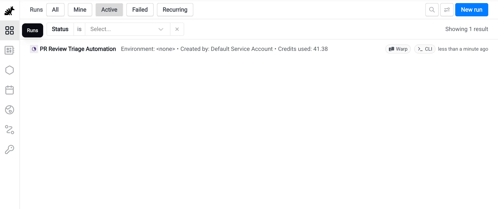
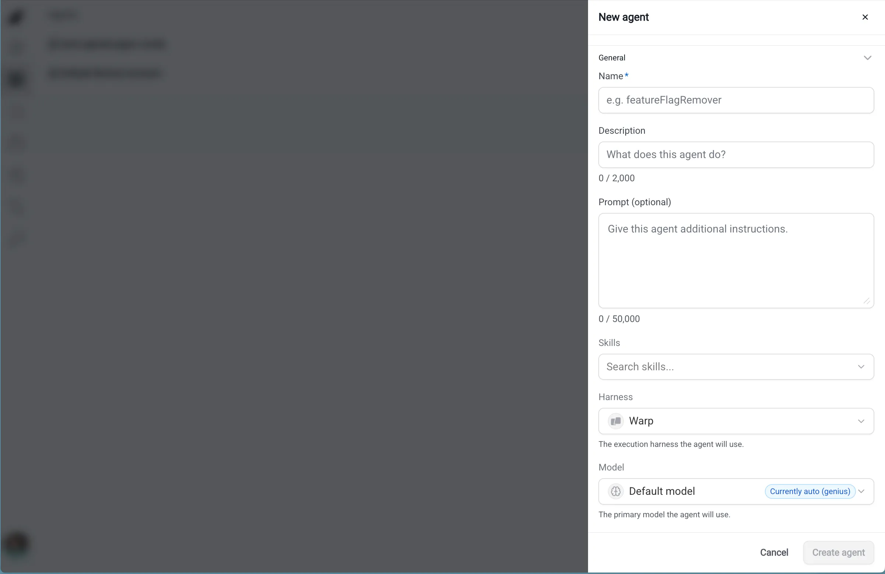
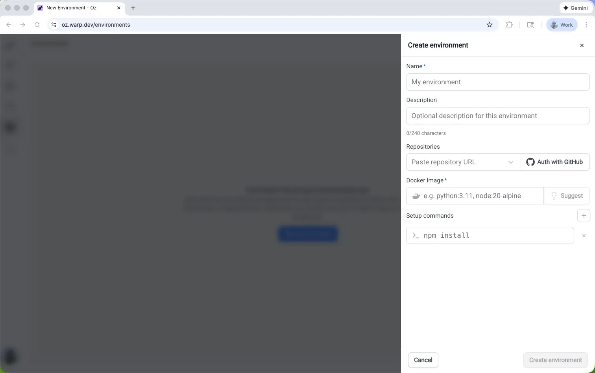
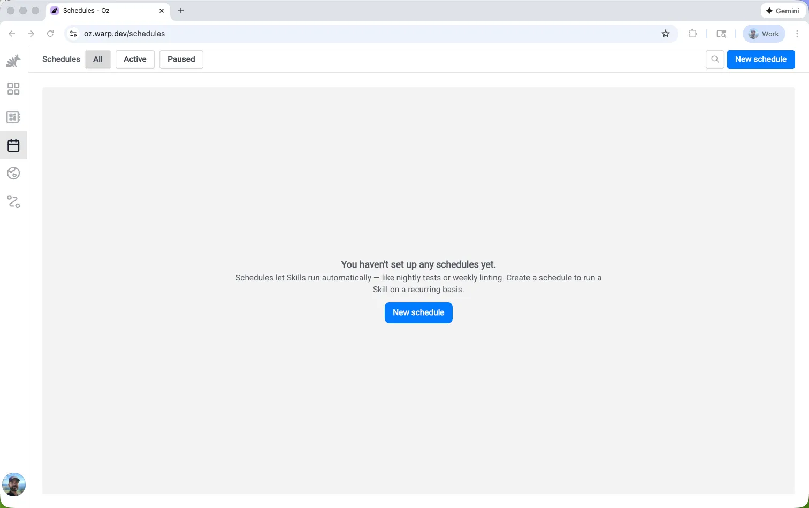
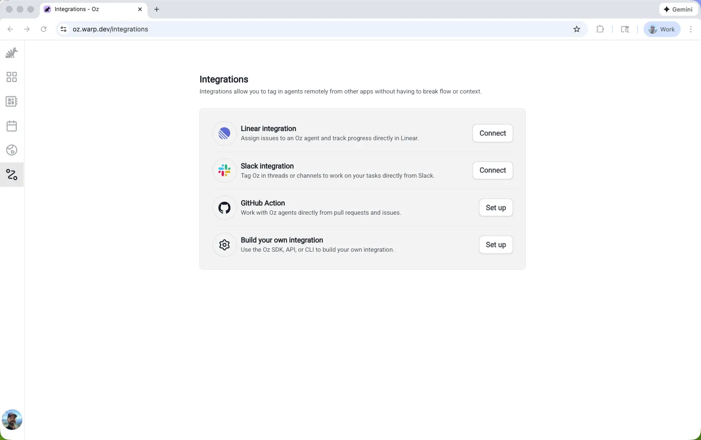

# Warp Oz 圖文功能手冊與 Agent Platform 設計對照

- 文件性質：繁體中文補充研究；官方英文資料的摘要、介面解說與本地設計分析，非官方逐字翻譯。
- 查核日：2026-10-04（Asia/Singapore）。引用的主要 Warp 文件標示更新於 2026-09-24；網址內容可能繼續更新。
- 本平台比較基準：`newclear` main `267b12d78b3304d12bb589639650628b22987e95`。下文的本地狀態是該快照文件記錄，不代表重新執行驗收。
- 定位：補充 [OpenHands 主範本研究](../../reference-selection.md)，不改 [SDD](../../../SDD.md) 的 ADR、milestone 或驗收狀態。
- 證據：官方文件與五張原始截圖；未登入 Warp、購買方案、建立 cloud run 或驗證自架相容性。

## 1. 產品介紹：它提供什麼

Warp 於 2026-02-10 發表 Oz，定位是把程式開發 Agent 的執行、管理與協作搬到雲端。平台提供環境、排程、程式介面、工作紀錄與人工接手能力，適用於平行開發、例行維護、Issue 分流及故障處理。[S01]

名稱正在轉換：查核日文件已將 Oz 改稱 **Automation Platform**，並說明既有 Agent、整合、API key 與排程繼續有效；`oz` CLI 和網頁介面預計保留舊名稱至 2026-10-06。這是當日公告，不是已驗證改名完成。[S02]

下列術語分開理解，能避免把「模型」、「Agent」與「執行中的機器」混成同一個物件：

| 術語 | 繁體中文解說 |
| --- | --- |
| Agent | 可重用的工作設定與身分，可帶指示、技能及權限 |
| Harness | 實際執行 Agent loop 的工具，例如 Warp Agent、Claude Code、Codex |
| Model | Harness 使用的語言模型；選 Harness 與選模型是不同設定 |
| Skill | 存在 repository 的可重用工作指示，可用版本控制管理 |
| Environment | 工作所需的 repository、容器映像與初始化設定 |
| Run | 一次執行及其狀態、對話、輸出和使用量 |
| Schedule / Integration | 決定何時、由什麼事件啟動一次執行 |

術語依官方 Agent、Harness、API、環境與排程文件整理。[S04][S05][S06][S07][S11]

## 2. 五個主要畫面與操作

圖片皆為官方文件公開截圖，原始檔已保存於此 repository；不依賴外站圖片熱連結。原始網址、取得日期及 hash 見 [素材清單](assets.json)，權利與版本說明見 [images/README.md](images/README.md)。

### 2.1 Runs：查看誰在做什麼

*圖 1：官方 Runs 清單。示範資料包含 PR review triage 任務、CLI 來源和 credits；數字是示範紀錄，不是定價。來源：[Oz web app][S03]。*

上方可切換 All、Mine、Active、Failed、Recurring。單筆 Run 可查看狀態、環境、建立者、來源及用量；點入後查看 transcript、artifacts 與 metadata。[S03]

追查問題時，從該 Run 的完整工作階段閱讀 prompt、計畫、執行指令、日誌與成果。分享連結可讓獲授權的人查看或協作；環境仍存活時可以追加指示。Fork to local 可把對話帶回本機，但遠端新建的程式碼 branch 可能仍須自行 clone，不能把它理解成完整 VM 自動搬遷。[S09]

**使用例：** 每天找出失敗的文件更新任務，先看失敗步驟與產出的 patch，再決定重試或人工接手；「列表顯示成功」仍須搭配成果驗證。

### 2.2 New agent：保存可重用的工作角色

*圖 2：官方建立 Agent 表單。來源：[Oz web app][S03]。*

| 畫面欄位 | 要設定的內容 |
| --- | --- |
| Name / Description | 工作角色的名稱與用途 |
| Prompt | 固定指示、輸入需求與完成條件 |
| Skills | 此角色要使用的技能 |
| Harness | 執行工具 |
| Model | 執行時使用的模型 |

目前文件還說明 Agent 可帶環境與 secrets 等預設值；圖中沒有展示所有設定。一次 Run 的 prompt 補上當次任務的具體上下文。[S03]

Harness 可選 Warp Agent、Claude Code 或 Codex；不同 Harness 共用平台的環境、觸發及觀測入口。第三方 Harness 需要 Build 以上方案，使用者提供相應供應商憑證；推論向供應商帳戶計費，Warp 另計 sandbox compute 與適用的平台用量。不能只因選單有 Codex 就推論某種訂閱登入一定可用。[S05]

**使用例：** 建立「文件同步」Agent，固定要求比對程式變更、修正文件並提出 PR；每次執行只指定要處理的 revision 或 Issue。

### 2.3 Environments：把工作環境準備完整

*圖 3：官方環境建立表單。來源：[Configuring environments][S06]。*

環境組合包含一個或多個 repository、可用的 Docker image，以及啟動前執行的 setup commands。可先設定所需語言工具鏈，再執行依賴安裝；多 repo 可提供跨前後端修改的上下文。映像與依賴應固定版本，初始化命令應可重跑。[S06]

**畫面版本差異：** 圖中的 placeholder 提到 `node:20-alpine`，但查核日文件明確要求 glibc，並說 Alpine／musl 不受支援；實作時以目前文件為準，不照抄這個舊範例。[S06]

**使用例：** 將 API 與 Web repo 放進同一開發環境，使 Agent 能同時閱讀契約與呼叫端。這只是 Warp 的功能示例；本平台是否允許多 repo、如何固定 SHA 與授權，仍依本地契約決定。

### 2.4 Schedules：固定頻率啟動新的工作

*圖 4：官方排程頁面的空清單；此圖沒有展示建立表單或成功執行紀錄。來源：[Oz web app][S03]。*

排程使用固定 prompt 或 Skill，搭配執行環境、頻率與可選的 Agent。常見用途是依賴維護、Issue 分流、文件更新及定期報告。[S07]

每次排程建立 **fresh session**，留下獨立任務及歷史；雲端排程不依賴本機保持開機。這裡的獨立性指新的 Agent 工作階段，不能延伸解讀成外部資料庫、repository 或其他儲存必定沒有持久狀態。[S07][S08]

可在網頁管理啟用／暫停、執行歷史及 Run now。若讓自動化開 PR，還需選擇執行身分：Quick run 與 cloud agent 的 GitHub 作者歸屬不同，後者需要相應團隊授權。[S08]

**使用例：** 每週以相同規則檢查文件，但每次保留獨立 Run、結果與錯誤紀錄，供逐次驗收。

### 2.5 Integrations：讓事件變成任務入口

*圖 5：官方整合入口截圖，顯示 Linear、Slack、GitHub Action 與自訂整合；新文件的 GitHub mention 流程不等於圖中的 GitHub Action 設定。來源：[Oz web app][S03]。*

官方整合支援從 Slack／Linear 的對話或 Issue 觸發工作；GitHub 可在 Issue、PR、review comment 提及 `@warp-agent`，另有 GitHub Actions 的 CI 入口。[S10]

自訂入口可使用 REST API 或 Python／TypeScript SDK。API 的 Run 有 ID、狀態、時間與 session link 等資料，適合讓既有系統提交任務，再讀取進度與結果；模型、環境、Skill、MCP 等是執行配置。[S11]

**使用例：** CI 失敗後送入限定範圍的修復任務，將 Run 連結附回原 Issue，讓人能看到工具活動與驗證結果。這是可組合流程示例，不代表所有 CI 失敗都應自動修復或合併。

## 3. 跨畫面的能力與限制

| 能力 | 官方文件描述 | 使用時要分清的邊界 |
| --- | --- | --- |
| 多 Agent 編排 | 父 Agent 分派工作給直接子 Agent；子 Agent 可用不同 Harness，並有各自的執行紀錄 | 查核日只有一層父子，子 Agent 不再建立孫 Agent；不是無限遞迴樹 [S12] |
| 平行工作模式 | 文件介紹 supervisor/worker、fan-out/fan-in、critic、DAG、swarm 等協作方式 | 模式文件不等於提供可任意拖拉的視覺 DAG 編輯器 [S12] |
| MCP 與 Secrets | Agent 可接外部服務與設定有範圍的執行憑證 | 外部工具的可用性與授權仍須配置 [S04] |
| 手機／瀏覽器入口 | 可從網頁管理與檢視 Run | 頁面可在手機打開，不等於所有桌面功能都已實測等效 [S03] |
| 自架 worker | Managed 模式由 Warp 派工；Unmanaged 模式由自己的 CI／腳本啟動 | 查核日自架功能限定 Enterprise [S13] |

Managed worker 可使用 Docker、Kubernetes Job 或直接主機執行；Unmanaged 則由自己的系統呼叫 CLI。自架執行仍需要連接 Warp 後端，不能視為整個控制面離線自管；工作階段及 LLM prompt 中的程式碼上下文仍可能經過其控制平面。若評估自架，要把「執行在哪裡」與「資料／推論經過哪裡」分開驗證。[S13]

## 4. 對照本平台：可重用哪些設計

下表是本文件的分析，依前述固定 main 快照及相連本地文件整理。**既有文件記錄不等於本次重跑測試；候選方向不等於實作授權。**

| Warp 參考點 | 本平台快照中的對應／狀態 | 可借鏡的設計與必守邊界 |
| --- | --- | --- |
| Runs 搜尋與追蹤 | [任務搜尋、篩選及連結](../../TASK-SEARCH.md)已有文件與驗收紀錄 | 後續可評估觸發來源與 profile 篩選；保留 latest attempt、游標與 session 驗證語意 |
| 可重用 Agent 設定 | [SDD §4、§8](../../../SDD.md)定義不可變 AgentProfile revision | 區分設定與 Run；重用 profile 時仍固定 revision，不回改歷史輸入 |
| Harness 與 Model 分離 | [SDD §7](../../../SDD.md)有 backend capability；ACP 屬 M5 Deferred | 工具適配與模型供應商是兩個契約；未支援的 pause／approval 不可悄悄降級 |
| 工作環境配置 | [M2](../../M2.md)與 [SDD §6](../../../SDD.md)記錄固定 repository bundle／MicroVM 方向 | 學習環境表單，但映像與初始化仍經受控 catalog，不直接開放任意 host shell |
| 新工作階段的排程 | [SDD §15](../../../SDD.md)已規劃 UTC schedules、dedupe、overlap policy；M5 Deferred | 每次觸發建立獨立 Run；沿用唯一 admission、版本化配置及用量政策 |
| 事件與 API 觸發 | [外部 task source SDD](../../sdd-external-task-source.md)與 M5 webhook 規劃 | 驗證來源與 delivery ID；trigger 只送意圖，不擁有 VM 操作或驗收權 |
| 可追溯成果 | [安全 diff 下載](../../M3-RESULT-DOWNLOAD.md)已有文件與驗收紀錄；完整 M4 依快照 SDD 尚未完成 | 保留 base SHA、結果 hash、驗證狀態；下載成果與授權 Git export 分開 |
| 人工介入 | [審批](../../M3-APPROVAL.md)、[暫停](../../M3-PAUSE.md)、[取消](../../M3-CANCEL.md)有既有切片文件 | UI 可集中呈現待處理操作；仍須遵守 action digest、generation 與實際停止證據 |
| 父子 Run | [SDD §2.2](../../../SDD.md)把 planner/worker/reviewer 留待後續評估 | 可先設計關聯與各自結果，避免以父任務完成推論所有子任務或 sandbox 已收尾 |
| 每次執行的用量 | [M3 model proxy](../../M3-MODEL-PROXY.md)與[單人 mock 驗收](../../M3-SINGLE-OPERATOR.md)記錄現有邊界 | 模型、運算、等待與清理分開呈現；unknown 不顯示為零或已結算帳單 |

這份參考不替換 OpenHands／Cocoon 的現有選型。Warp 的 SaaS 團隊身分、自架 worker、Skill 與模型路由是不同層次的產品能力；本平台目前的單 operator 與權限契約仍是比較基準。

## 5. 後續設計評估清單

以下是候選切片及驗收問題，沒有建立新的開發承諾或改變既有 milestone 順序：

| 候選方向 | 建議先回答的問題 | 後續真正實作時的驗收例 |
| --- | --- | --- |
| 更完整的 Run 詳情 | 能否在一頁連起輸入 revision、來源、事件、成果與用量？ | 重新整理／重播不重送 prompt；失敗與未知驗證仍可查閱 |
| Profile／環境選擇體驗 | 操作者是否理解 backend、model、template 與 secret reference 的差異？ | 新版本只影響新 Run；歷史仍還原原本固定設定 |
| M5 自動化入口 | 排程、webhook 與手動操作是否都走同一 admission？ | 重複 delivery 只建立一個有效 Run；overlap／missed schedule 有明確結果 |
| Agent adapter | 哪些 pause、cancel、approval、事件重播能力真正可用？ | 明確 capability matrix；不支援時 UI 與 API 一致拒絕 |
| 多 Agent 關聯 | 父子任務的失敗、取消、預算及資源清理如何分攤？ | 一個子任務失聯不造成重複派送，也不虛構整體成功 |

評估者可先讀既有 SDD 與各切片證據，再將一個候選拆成獨立設計／驗收工作；不直接把商業平台的選單翻譯成已完成需求。

## 6. 來源與維護

| ID | 官方英文資料 | 本文使用範圍 |
| --- | --- | --- |
| S01 | [Introducing Oz: the orchestration platform for cloud agents][S01] | 發表時間與產品定位 |
| S02 | [Cloud agents overview][S02] | 名稱變更與平台概念 |
| S03 | [Oz web app for cloud agents][S03] | 五個畫面、表單及網頁操作 |
| S04 | [Cloud agent accounts][S04] | Agent 身分、Skills、MCP 與 Secrets |
| S05 | [Harnesses in the Automation Platform][S05] | Warp／Claude Code／Codex、方案與計費分層 |
| S06 | [Configuring cloud agent environments][S06] | repository、映像、初始化與 glibc 要求 |
| S07 | [Scheduled Agents][S07] | 例行工作、獨立工作階段 |
| S08 | [Scheduled Agents quickstart][S08] | 雲端觸發、Run now 與 PR 作者身分 |
| S09 | [Cloud agent session sharing][S09] | transcript、人工接手與本機 fork 邊界 |
| S10 | [Integrations Overview][S10] | Slack、Linear、GitHub、CI 入口 |
| S11 | [Oz API & SDK reference][S11] | Run 識別及可程式化配置 |
| S12 | [Multi-agent orchestration][S12] | 父子執行、協作模式及一層限制 |
| S13 | [Self-hosting overview][S13] | Enterprise、managed／unmanaged 與控制面依賴 |

更新時重新確認名稱、方案、Harness 認證方式及功能限制；不要沿用過期截圖中的 placeholder 當執行命令。若替換圖片，同時更新 assets.json 的來源、日期、尺寸、bytes 與 SHA-256，並保留第三方權利說明。本文只保存必要的評論用截圖與原創摘要，沒有鏡像上游整套文件。

[S01]: https://www.warp.dev/blog/oz-orchestration-platform-cloud-agents
[S02]: https://docs.warp.dev/platform/
[S03]: https://docs.warp.dev/platform/oz-web-app/
[S04]: https://docs.warp.dev/platform/agents/
[S05]: https://docs.warp.dev/platform/harnesses/
[S06]: https://docs.warp.dev/platform/environments/configuring-environments/
[S07]: https://docs.warp.dev/platform/triggers/scheduled-agents/
[S08]: https://docs.warp.dev/platform/triggers/scheduled-agents-quickstart/
[S09]: https://docs.warp.dev/platform/viewing-cloud-agent-runs/
[S10]: https://docs.warp.dev/platform/integrations/
[S11]: https://docs.warp.dev/reference/api-and-sdk/
[S12]: https://docs.warp.dev/platform/orchestration/
[S13]: https://docs.warp.dev/platform/self-hosting/
