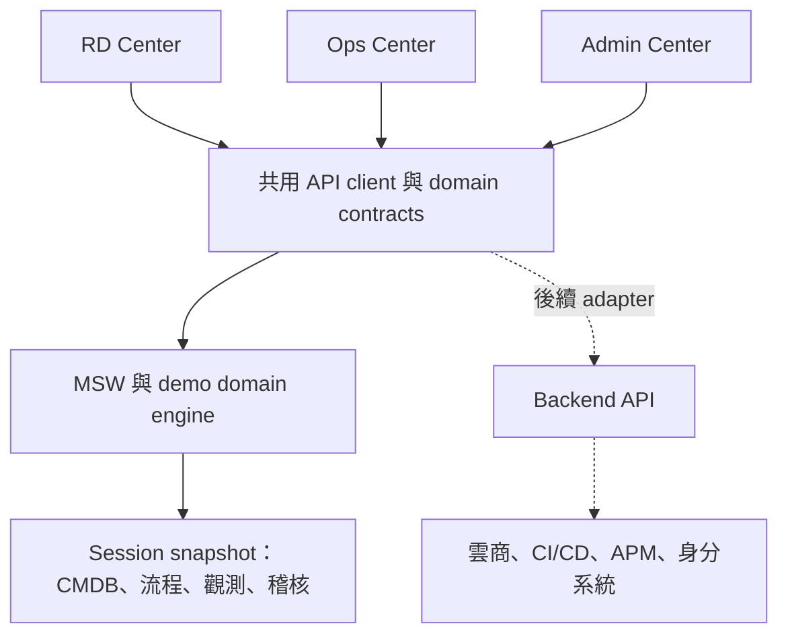

# dim-gate — Software Design Document

版本：0.1 · 日期：2026-09-20 · 狀態：待實作的設計基線

使用者已確認：項目名稱 `dim-gate`；React + shadcn/ui；AWS／Aliyun／自建機房；CMDB 核心；RD、Ops、Admin 三中心；第一版有狀態 Mock；單企業多團隊；端到端發布與故障恢復展示。具體技術與行為決策由本 SDD 定義，後續變更以 PR 追蹤。

## 1. 問題與成果

平台的目標使用者很難從模組清單理解「資源、應用、發布與告警」如何連起來。dim-gate 讓使用者在相同資料上切換角色、提出請求、看到審批與交付，並從告警追溯資源和最近發布。

第一版交付物是一個可在瀏覽器中探索、可按腳本重現的前端產品。完成演示後，觀眾應能說明：三中心的分工、應用在哪些資源上運作、誰能批准變更、故障如何定位、回滾後有哪些記錄。

**成功標準不是頁面數量，而是一條可完成、有拒絕與失敗分支、跨中心狀態一致的業務流程。** 驗收與量測條件見 [07](docs/sdd/07-delivery-validation.md)。

## 2. 範圍與交付層級

| 層級 | 第一版交付承諾 |
| --- | --- |
| 完整互動主線 | 基本目錄／權限配置、資源納管、環境申請、Ops 審批、模擬交付、CI/CD 發布、觀測異常、影響定位、回滾、稽核 |
| 可探索的配套能力 | 三來源 inventory、CMDB 關係與資料品質、容量概覽、日誌與 trace 詳情、整合狀態、作業紀錄 |
| 後續擴充 | 真實後端／SSO、雲端同步與執行器、K8s 控制、任意工作流設計、FinOps 帳單、ITSM SLA、排班、密鑰管理、跨企業租戶 |

配套能力需要可篩選、可下鑽的真實前端互動；不以空白頁或成功 toast 偽装完成。未支援的操作不提供假按鈕。完整模組深度與階段见 [01](docs/sdd/01-product-ux.md)。

不開發後端 control plane；不向真實雲商發送命令；不在前端保存雲憑證；不宣稱前端 RBAC 或角色切換構成正式安全邊界。Mock 與 future live integration 必須可清楚辨識。

## 3. 組織與使用者

單一企業包含業務線與團隊；專案隸屬一個團隊，應用隸屬一個專案。每個應用可有 dev／staging／prod 的環境實例。環境實例可部署到不同 provider 的資源；一個環境不強制綁定單一 provider。

RD 負責獲授權專案的應用交付；Ops 負責獲授權資源池與環境的運行及審批；平台 Admin 負責目錄、模型、組織與 policy。Admin 不因管理平台而自動獲得 prod 發布權。角色與 resource scope 是兩個不同維度，詳見 [04](docs/sdd/04-permissions-admin.md)。

## 4. 架構

三中心是同一 SPA 中的不同工作區，共用 App Shell、資料實體與查詢快取。CMDB 儲存配置身分和關係；APM 儲存／呈現時間序列與事件，僅以 CI、application、environment ID 关联，不能把 metrics 塞成 CMDB 欄位。

MSW 提供與未來 API 同形的 HTTP contract；domain engine 負責授權、狀態轉移與原子更新；React 元件不直接寫 snapshot。第一版每個瀏覽器分頁各有獨立示範 session，同分頁切換身分共享資料，刷新可延續；不承諾多使用者協同。

## 5. 不變量

| ID | 必須維持的條件 |
| --- | --- |
| INV-01 | 相同應用、環境、CI、請求、發布與 incident 在三中心使用相同 ID，跨頁連結可定位同一筆資料。 |
| INV-02 | 每次寫入先驗身分、action 與資源 scope，再驗 version／狀態；失敗不產生部分 domain 寫入。 |
| INV-03 | 每個成功 command 同時寫 domain 變更、事件、稽核與 idempotency 結果；重試不能重複 provision 或 release。 |
| INV-04 | Pipeline build 成功不等於部署成功；只有通過 health gate 的 release 更新環境 activeReleaseId。 |
| INV-05 | CMDB 統一欄位不抹去 provider 原生身分；共享資源與多對多依賴不能被壓成一棵業務樹。 |
| INV-06 | 未授權的清單、detail、graph、search、aggregate、audit 都不暴露 scope 外的資料或總數。 |
| INV-07 | 演示標記常駐；模擬批准、部署、監控與恢復不表示外部系統真的發生變更。 |
| INV-08 | 時序、ID 生成與 fault scenario 可重現；reset 清除舊 timer、cache、snapshot，不能留下幽靈事件。 |

## 6. 展示主線

1. Admin 查看角色 scope、配置服務目錄，Ops 查看並納管三類資源。
2. RD 以 `checkout-api` 的 staging 環境申請為例，選模板與 provider，提交後等待審批。
3. Ops 核對容量與影響，批准並交付；RD 看見環境、資源關聯與工作紀錄。
4. RD 執行 build/test/package/deploy/verify；可從 pipeline 進入 release 與 CMDB。
5. 演示控制台注入「發布後延遲升高」；APM 顯示對應 metrics、trace、log 與 incident。
6. Ops 從 incident 找到相關 CI、依賴應用與最近變更，完成告警認領與診斷。
7. RD 選擇已成功的歷史版本回滾；成功健康檢查後更新 active release，再由恢復觀測樣本使 incident 進入 resolved。
8. RD、Ops 及 Admin 的授權 audit 視圖透過各操作的 correlationId 與 entity references 追蹤完整因果鏈。演示者可以 reset 重來。

為使首次環境交付後也能演示回滾，主線會先發布一個穩定版本，再發布問題版本；不能憑空預置新環境的成功發布歷史。完整步驟與故障分支见 [03](docs/sdd/03-workflows.md)。

## 7. 技術與非功能目標

React／TypeScript SPA，Vite 構建；shadcn/ui 元件搭配 Tailwind CSS。採 client-side routing，無 SEO／SSR 要求。桌面優先，繁體中文介面與英文識別字；可鍵盤操作，明暗主題與密度切換。

預設 seed：1 企業、2 業務線、3 團隊、4 專案、6 應用、12 環境、60 CI，AWS／Aliyun／on-prem 各 20。另有 5,000 CI 的 synthetic benchmark dataset，不冒充真實資產規模。查詢分頁預設 25、最大 100；拓撲首屏最多 100 nodes／200 edges，明示截斷與逐步展開。

APM 至少展示 request rate、error rate、p95 latency、trace waterfall 與 log correlation。示範資料有固定時間基準，無資料不可顯示為零。性能、可用性、可存取性均是待驗收目標，不是本次文檔的實測成果。

## 8. Repository 與文件治理

canonical path：`platform/dim-gate/`。本項目獨立於 `platform/fanzloud`、`platform/prism`、`specs/fleet` 與 `apps/cloudform`；未來整合只透過明確 API 契約，不引用 sibling 私有實作。既有 portfolio 歷史盤點不重寫；此次新項目的明確授權記錄於本設計。

本次交付僅 Markdown 與 root README 索引。M0 才建立 package manifest、lockfile、source 與本 component 的 root CI。不得把文檔完成寫成產品完成。

閱讀順序：本文件 → [01 產品與 UX](docs/sdd/01-product-ux.md) → [02 CMDB](docs/sdd/02-cmdb-model.md) → [03 流程](docs/sdd/03-workflows.md) → [04 權限](docs/sdd/04-permissions-admin.md) → [05 前端](docs/sdd/05-frontend-architecture.md) → [06 API／Mock](docs/sdd/06-api-mock.md) → [07 交付與驗收](docs/sdd/07-delivery-validation.md) → [08 決策與來源](docs/sdd/08-decisions-sources.md)。

本總綱的不變量優先；專題規格定義細節；如兩者衝突，先修正文件再實作，不能由開發者默默選一份。外部參考是技術依據，不覆蓋已選定的產品行為。
