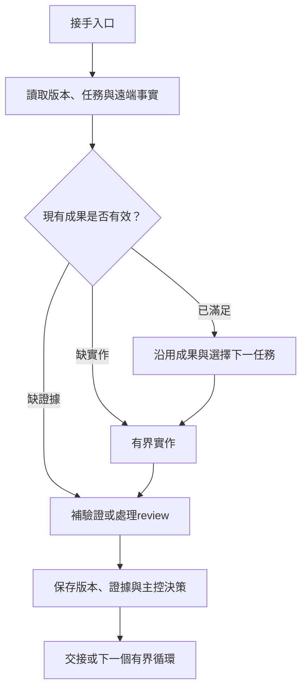

# dim-gate 開發恢復協定

Protocol version：1 · 試點：dim-gate · 配套入口：[DEVELOPMENT_PROMPT](../DEVELOPMENT_PROMPT.md)

本協定定義如何接手和保存開發工作。它是可人工或由 agent 執行的流程，不是 scheduler、distributed lock service 或已實作的自動 orchestrator。產品仍依 SDD；本次新增文件不代表 M0 已完成。

## 1. 狀態與規則的權威

| 資料 | 負責的事 | 不負責的事 |
| --- | --- | --- |
| SDD 與專題規格 | 產品行為、domain 不變量、AC、里程碑 exit gate | 不記每次 agent 的執行位置 |
| AGENTS + 本協定 | 角色、操作範圍、恢復／驗收／交接規則 | 不改產品需求、不自動授權外部操作 |
| DEVELOPMENT_PROMPT | 啟動與讀取順序、預設本輪任務 | 不硬編碼最新進度或已完成 commit |
| root `.team/PLAN.md` 的 program/variant 區塊 | 任務狀態、依賴、主控接受決策、resume pointer | 不能靠寫一句 DONE 取代 Git／測試事實 |
| `.team/tasks/T-###.md` | 不變的任務目標、scope、inputs、DoD／gates | 不讓 worker 擴張到其他任務 |
| `.team/reports/` | attempt、實作 refs、執行證據、限制 | worker 報告不等於主控接受 |
| commits／PR／CI | 實際版本、diff、整合與檢查事實 | 不保證描述文字全部正確 |
| [STATUS](STATUS.md) | 給人閱讀的摘要與 canonical records 連結 | 不是第二份任務狀態帳本 |

PLAN 的任務狀態只由主控更新。spec 衝突依 SDD 優先級處理；執行規則衝突按使用者指示、執行環境強制規則與適用 AGENTS 核對。Git／測試事實與 PLAN 不符時，標記 reconciliation discrepancy 並修正過期的判定，不能修改測試標準來配合進度。

不另加可獨立修改同一欄位的 state.json／資料庫。未來若需要機器格式，須以明確遷移決策指定權威及生成方向。

## 2. 工作身分與最小紀錄

工作身分是 `(project_id=dim-gate, variant_id, task_id)`，不是 model/session 名稱。`task_id` 沿用 kernel `T-###`；同主線由主控分配未使用序號。model、attempt、worktree 可以變，同一需求的任務身分不因此改變。

| 紀錄 | 必須保存的內容 |
| --- | --- |
| Program/variant | protocol_version、variant_id、target_repo/ref、lineage、milestone、ledger_revision |
| Run | run_id、主控角色、owner、起始時間／最後 checkpoint、授權摘要、來源 commit、模型路由、預算及terminal state |
| Task | kernel 必需欄位，另加 project/variant、AC IDs、dependencies、spec/input refs、base commit、worktree/branch、attempt |
| Result | implementation commit／local diff狀態、native commands、outcomes、tested commit、tool/runtime/lockfile refs、review ref |
| Decision | 主控 ACCEPT／REWORK／REASSIGN、理由、評估的task revision／commit、證據連結 |
| Resume | continuation ref、未完成工作、阻塞及解除條件、下一個操作、remote durability、integration state |

不得在 report 中只寫「測試通過」或「繼續做前端」。下一步要能操作，例如「checkout某branch，先檢查PR的schema review finding，再重跑某command」。尚無 task 時，允許下一步是依能力盤點拆第一份 task，不能虛造 agent、branch 或測試結果。

`input_refs` 保存會影響任務的規格、契約、程式檔案版本／hash及AC，而非每次main變動都強制全量重做。可額外計算 fingerprint，但hash相同不能取代scope／驗收檢查。任務開始後改DoD或scope必須新增task revision與決策，不能覆寫過去報告所引用的版本。

## 3. kernel contract 相容與角色

本試點根據 kernel commit `7cddad13f965d579b218579609c7f64e1ecf35b2` 的以下文件設計：

- [Development prompt workflow](https://github.com/fallrising/kernel/blob/7cddad13f965d579b218579609c7f64e1ecf35b2/agents/prompts/dev/README.md)
- [Orchestrator loop](https://github.com/fallrising/kernel/blob/7cddad13f965d579b218579609c7f64e1ecf35b2/agents/prompts/dev/orchestrator-loop.md)
- [Task/report contract](https://github.com/fallrising/kernel/blob/7cddad13f965d579b218579609c7f64e1ecf35b2/agents/codex-team-superpowers/docs/specs/initial-plugin.md)
- [Team setup](https://github.com/fallrising/kernel/blob/7cddad13f965d579b218579609c7f64e1ecf35b2/agents/codex-team-superpowers/docs/codex-team-setup.md)

kernel 定義協作機制，dim-gate 定義本項目任務範圍與採用方式。使用更新來源時先比較相關規範，記錄source revision；不能因其他項目規格或歷史機器路徑出現在kernel，就自動套到此項目。

| 角色 | 責任與界限 |
| --- | --- |
| Orchestrator | 唯一PLAN writer；拆任務、分配model/paths、驗收、整合、取得已授權的Git結果 |
| Worker | 單一task、隔離worktree、scope內修改及focused verification；不遞迴委派、不自驗收、不push/merge |
| Reviewer | 未參與該實作，唯讀審查指定commit diff與需求；不直接修改被審查程式 |

偏好Codex主控、Claude reviewer，其他已配置工具作worker；具體model slug必須實查。替代route先明示、在現有授權範圍內執行；無工具不冒稱有多模型。模型被更換不代表task自動失效，也不表示原有證據可省略。

Task沿用kernel的必需欄位：ROLE/AGENT/ID/Goal/Why/Inputs to read first/Scope (may touch)/Out of scope (must not touch)/Definition of done/Verify with/Budget。DoD至少一個未勾選的驗收項。不要只拷貝欄位卻不填可執行命令。

Report首個非空行為 `STATUS: DONE`、`STATUS: PARTIAL` 或 `STATUS: BLOCKED`；包含 Summary、Verification、Documentation、Risks and Follow-ups。驗證項使用 `- <evidence> — passed|failed|skipped`。DONE至少一個passed且不得有failed/skipped；本協定的run terminal states不要塞進worker STATUS欄位。

使用來源checkout的 `scripts/teamctl.py validate-task <path>`／`validate-report <path>`，不複製private validator進public repo。每個attempt保留獨立report檔；至少包含task ID及attempt編號，使用當前validator允許的路徑。若需canonical `T-###.md`，保留舊attempt後再更新當前檔，不能丟棄失敗證據。

## 4. 啟動與 reconciliation 算法

1. **定位**：取得repo、role、variant與target。使用者指定branch/PR優先；否則讀main的PLAN，再查看它指向的continuation refs及相關open PR。分支不存在或同一variant有多個未說明的候選時，先比對commit lineage／task與session；不能猜測最晚更新者就是正解。
2. **保護現場**：檢查remote/status/worktrees；記錄未提交修改的owner與path，不reset、clean或checkout覆蓋它們。不能判斷所有權時開隔離worktree或提出具體阻塞。
3. **固定上下文**：記錄prompt/protocol、SDD及kernel版本；task/report以branch選定版本為準。讀既有task與acceptance evidence，不僅讀STATUS。
4. **核對實體**：分支／commit是否存在、PR是否open/merged/closed、CI是否針對指定head、review是否適用目前diff、target是否已含成果。確認後才更新PLAN中的觀察結果。
5. **核對有效性**：inputs／AC改變或code/config/lockfile改變時，辨識受影響證據；已被修改的內容不能沿用舊passed。純進度文檔commit可引用更早tested code，但需明示覆蓋範圍。
6. **選工作**：先恢復未完成task／review correction；否則跳過仍有效的accepted任務，選deps已滿足的ready task。沒有證據則驗證，沒有實作才開發。主控可以修正過期ledger，不重寫已通過的程式。
7. **建立run**：確認沒有其他live owner，記錄run/owner/route/budget/branch與第一個可驗收結果，更新checkpoint後派工。
8. **執行與保存**：task→diff/gates→decision→整合review→checkpoint；達本輪目標或明確terminal state時交接。



此算法要求可重入的判斷，不承諾LLM每次產生相同程式。分支建立、PR建立、commit/push回覆遺失時，先查remote的實際結果再重試，不能直接重做相同外部操作。

main可能尚未包含進行中分支的PLAN。新implementation分支使用可辨識前綴 `agent/dim-gate/<variant>/...`（既有branch保留），PR body加入 `Project: dim-gate`、`Variant: ...`、`Tasks: ...`；可在有可恢復checkpoint時開draft PR。新session除了main pointer，也查這些open PR與remote branch，取其對應PLAN。沒有必要為了記錄尚未合併工作而直接改main。

## 5. 狀態與驗收

Task orchestration states：`READY → RUNNING → IN_REVIEW → ACCEPTED`。REWORK回RUNNING並增加attempt；缺前置條件轉BLOCKED；被新需求替代轉SUPERSEDED並指向replacement。已ACCEPTED的成果如因spec/code改變失效，新增invalidation decision後回READY或BLOCKED，不刪舊接受歷史。

「worker DONE」「主控 ACCEPTED」「PR MERGED」是不同維度。PLAN保存workflow state；integration依GitHub事實另記 `NOT_OPENED / OPEN / MERGED / CLOSED_UNMERGED / LOCAL_ONLY`，不能以PR存在推斷驗收成功。

Run terminal states：DONE（本輪限定交付gate全通過）、OWNER_DECISION_REQUIRED、BLOCKED、BUDGET_EXHAUSTED。三次主控循環內未完成也要交付可恢復checkpoint；不得降低驗收以製造DONE。獨立review缺失、required check跳過或CI未完成時，不得宣稱相應最終gate已過。

Milestone是否完成依SDD全部exit gate及主控接受決策；是否進入main另外展示。產品v0.1只有M0–M5與整合regression都滿足才算完成。預設本輪在最早未驗收milestone內工作，必要時可先交付部分slice的PR但標示partial。

## 6. 保存順序與證據綁定

每個task attempt結束、主控接受／退回、integration、預計中斷或交接前建立checkpoint。大段logs、screenshots、video放artifact，不大量塞進repo；保留必要摘要、run URL及可重跑方法。Artifact過期後無法檢查的證據不能被當成永久可用。

建議順序：

1. Worker完成scope內diff与測試，主控檢查並整合；worktree內未提交結果只算local WIP。
2. 主控建立implementation commit A，記錄spec/input refs、tool/runtime/lockfile版本與驗證命令；對A驗證，review指出明確A或其diff base。
3. 建立evidence/checkpoint commit B，寫入指向A的report、decision、PLAN與STATUS。B不需要寫自己的SHA，避免自我引用循環；其版本可由Git取得。
4. Push已授權的branch，查remote確實指向預期commit；建立或沿用PR。不能只因push命令返回0就假設push到對的repo/ref。
5. 遠端CI若存在required gate，等待結束；若失敗保存失敗證據並修復。PR或CI連結出現較晚時，以另一次metadata-only checkpoint或PR描述記錄，不為取得「最後一個SHA」無限追加commit。

證據必須有 `tested_commit`；branch名稱是可變指標，不能作唯一定位。若最後PR head包含純進度文件變更，可沿用A的程式驗證，但要核對相關product/tests/config/lockfile/workflow paths沒有改，並檢查新文件。若有code/gate變更則重驗，不能仍標A覆蓋全head。

`.team/PLAN.md` 的接受事件寫 `evaluated_implementation_commit`、`report_ref`、`review_ref`及理由。pr_head／merged_commit可在下一輪reconcile時更新，`last_observed_*`必帶觀察時間，不宣稱它永遠是remote最新狀態。

無commit權限時保存diff／report到已授權位置；無push權限時標 `LOCAL_ONLY`、實際路徑與恢復方法。只有程式與必要checkpoint都可從遠端取得，才稱「可跨機器恢復」。不承諾能找回從未保存的記憶體／聊天／未提交內容。

## 7. 單主控與并行邊界

試點採每variant一個主控、多個bounded worker；PLAN不是分散式鎖。owner、run_id及heartbeat只是可見協調資料，不構成原子互斥，也不能以逾時就殺掉另一個agent或刪worktree。

接手有active owner的variant前，查看可用session/PR/branch活動並確認前一run已終止或有明確交接；無法判斷時先唯讀對帳，記錄所有權阻塞，不競寫同分支。兩位使用者要同時實驗應分不同variant。

每次保存前核對remote ref／ledger_revision；變動表示必須重新讀取並整合。正常push被non-fast-forward拒絕時不force；`ledger_revision`只幫忙發現衝突，不宣稱compare-and-swap服務已實作。多個獨立分支的PLAN修改合併仍需人工／主控語義核對。

Worker不得commit/push；若工具本身會自動commit，派工前關閉該行為或選擇符合policy的路由。主控可以在worker worktree檢查後建立commit，再整合。每個worker輸入只包含需要的spec與task上下文，不反覆傳整個private kernel。

## 8. 分叉、接續與重新整合

每個variant記錄 `variant_id, parent_variant, fork_commit, spec_revision, target_ref, reason`。target可以是main或明確的父開發分支；預設mainline以main為整合目標。fork在獨立branch保留自身PLAN section，不覆寫mainline進度。身分是variant+task，不依賴task filename在全宇宙唯一。

- 一個accepted但尚未merged的milestone，可以作後續stacked branch的base，但要明確記錄parent PR與固定依賴commit，PR base指向父branch，不宣稱依賴已在main。使用者只要求單PR時不擴張。
- 父branch更新／rebase／squash後，重新對帳依賴diff與測試。禁止單靠commit ancestry認定squash後的成果不存在；結合PR merge record、patch/content與gate確認。
- 實驗改變產品行為時，在該variant保存SDD/decision差異；不能把另一variant的accepted直接標為自己的。
- 獨立fork可能重用T-###。重新整合時檢查工作key及檔案衝突；必要時分配新本地task ID並保留origin task key映射，不覆寫另一份task/report。
- 回合併目標後重跑必要integration gates，保留兩邊的decision lineage；不能直接將兩份「完成」清單相加。

## 9. 最小handoff格式

以下欄位放在PLAN的program/variant resume block；缺少資料使用明確的`none / unknown / not-started`及原因，不填虛構SHA或URL。

```yaml
project_id: dim-gate
variant_id: mainline
protocol_version: 1
run_id: none
terminal_state: not-started
target_ref: main
continuation_ref: none
milestone: M0
task_id: none
implementation_commit: none
spec_revision: <實際讀取的規格commit>
evidence_refs: []
integration_state: NOT_OPENED
remote_durability: <程式與checkpoint是否均已推送>
blockers: []
next_action: <一個可以操作的下一步>
```

格式展示不是初始進度權威，真正當前值見[PLAN](../../../.team/PLAN.md)。主控交接前同步STATUS的摘要與連結，不複製所有task細節到STATUS。

## 10. 本試點的驗證方式

文件引入階段檢查路徑、狀態权威、kernel contract及下表桌面推演；這不是已跑過agent resume的宣稱。M0起在真實任務中保存至少一次跨session接手、一個重複啟動、一次spec/evidence失效檢查的紀錄；branch variant整合在首次實際分叉時驗證。不為文檔PR建立一套未使用的workflow engine。

| 情境 | 預期恢復行為 |
| --- | --- |
| 新clone只有文件基線 | 認定M0未實作；preflight、拆bounded task，不跑不存在的package scripts |
| 已有open PR，STATUS仍舊 | 讀該PR branch的PLAN及證據，沿用任務／PR，不重新初始化項目 |
| push／create PR回覆丟失 | 查remote/PR是否已存在，確認實際head後才重試 |
| code已提交但report缺失 | 取得commit，補驗證／review／報告，不把「有commit」當accepted |
| report passed但code/AC改變 | 標記證據失效，列受影響範圍並重驗，不沿用舊綠燈 |
| reviewer/model不可用 | 揭露替代路由或阻塞，保留task ID與已完成diff；不假造獨立review |
| 另一主控仍在運作 | 唯讀對帳或明確分variant；不爭寫PLAN、不強推 |
| fork／squash後重新接手 | 依lineage與內容/PR事實對帳，保留spec差異，再跑integration gates |
