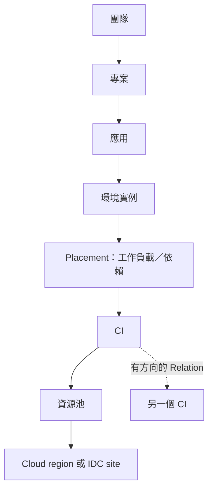

# 02 — CMDB 與領域資料模型

## 1. 模型原則

CMDB 是配置項身分、責任與關係的共用核心。Resource CI、應用、環境、provider location 各有獨立實體；三中心不各自存一套 CMDB。Inventory、topology、application detail 使用相同 store projection。

所有可變 entity 具 `id: string`、`version: integer >= 1`、`createdAt/updatedAt: ISO-8601 UTC`。ID opaque、不可重用。組織內唯一性檢查使用 normalized key，不以顯示名稱辨識。所有 references 必須存在、同 org 且符合可連結的 kind／scope。

## 2. 實體與欄位

以下欄位為 v0.1 domain contract；`?` 為 optional，除此之外都必填。collection 值無資料用空陣列，未知量測用 null。base fields 不在每列重複。enum 字串皆為 API canonical values，UI 另做繁體中文映射。

| Entity | 專用欄位與約束 |
| --- | --- |
| Organization | `name`；seed 只有 `org-demo` |
| BusinessUnit | `orgId, name` |
| Team | `orgId, businessUnitId, name` |
| Project | `orgId, teamId, name, slug`；slug org 內唯一 |
| User | `orgId, displayName, teamIds: ID[], enabled: boolean` |
| Application | `orgId, projectId, ownerTeamId, name, slug, tier: critical/standard, description, repositoryUrl?`；ownerTeamId 與 project.teamId 相同 |
| Environment | `orgId, applicationId, name, stage: dev/staging/prod, status: provisioning/ready/failed/retired, activeReleaseId: ID\|null`；同 app 的 name 唯一 |
| ResourcePool | `orgId, name, provider, locationId, accountId?, scopeProjectIds, cpuCapacity, memoryCapacityMiB, provisionDefaults`；used／reserved 由 allocation 推導 |
| ProviderAccount | `orgId, provider: aws/aliyun, displayName, externalAccountRef, connectionState: demo/connected/error`；不含 secret |
| Location | `orgId, provider, region?, zone?, site?, rack?`；cloud 必有 region，onprem 必有 site |
| CI | 見下一節的標準型別 |
| Placement | `orgId, applicationId, environmentId, ciId, role: workload/dependency`；同三元組唯一；app 必與環境所屬相同 |
| Relation | `orgId, sourceCiId, targetCiId, type, source: manual/discovered/template, confidence: verified/inferred`；方向有語義，禁止重複及自迴圈 |
| CatalogItem | `orgId, name, description, revision, status: draft/published/disabled, allowedProjectIds, template`；已發布 revision immutable |
| Request | `orgId, requesterId, applicationId, environmentName, stage, catalogItemId, catalogRevision, templateSnapshot, provider, poolId, cpu, memoryMiB, purpose, state, approval?, environmentId?, latestJobId?, correlationId` |
| ProvisionJob | `orgId, requestId, attempt, state: queued/running/succeeded/failed/cancelled, plannedCiIds, failureCode?, startedAt?, completedAt?, correlationId` |
| PipelineRun | `orgId, applicationId, environmentId, revision, artifactDigest?, stages, state, releaseId?, triggeredBy, retryOfRunId?, correlationId, failureCode?`；stage 保留 startedAt/completedAt |
| Release | `orgId, applicationId, environmentId, artifactDigest, kind: deploy/rollback, state, previousReleaseId: ID\|null, targetReleaseId?, pipelineRunId?, createdBy, correlationId, health: pending/healthy/unhealthy, approval?, reason?, failureCode?, startedAt?, completedAt?` |
| Artifact | `orgId, applicationId, digest, revision, recipe: demo-web-v1, filename`；package 成功後建立的 immutable 模擬 registry 記錄；digest 明示 synthetic |
| Incident | `orgId, applicationId, environmentId, affectedCiIds, severity: critical/warning, state, ruleKey, episode, assigneeId?, relatedReleaseId?, evidence, recoverySamples, correlationId` |
| AuditEvent | `id, orgId, actorId, action, entityType, entityId, scopeSnapshot, outcome, diffSummary, reason?, requestId, correlationId, occurredAt`；append-only，無 mutable version |

其他配置：`RoleAssignment(userId, role, scopeType, scopeId, stages?)`、`NavigationItem(routeKey, label, group, order, enabled)`、`ModelField(kind, key, label, valueType, required=false, hidden=false, constraints)`、`Integration(kind, displayName, poolIds, endpointLabel, state, lastSyncAt, fieldMappings, lastTestResult?)`。四者都帶 orgId 與 base fields；Integration 僅顯示 demo metadata。NavigationItem 的 required action 取自固定 route registry，不能由配置覆寫。

`template` 固定形狀：`{allowedProviders, allowedStages, allowedPoolIds, defaults:{cpu,memoryMiB}, limits:{maxCpu,maxMemoryMiB}, requiresApproval:true, resourceKind:"compute", bootstrapProfile:"web-service"}`。first version 不接受任意 executable template 或 script。

## 3. CI 型別

```ts
type Provider = 'aws' | 'aliyun' | 'onprem';
type CIKind = 'compute' | 'cluster' | 'database' | 'cache' |
  'queue' | 'load_balancer' | 'network' | 'storage';
type Lifecycle = 'planned' | 'active' | 'retired';
type Health = 'healthy' | 'degraded' | 'unhealthy' | 'unknown';

interface CI {
  id: string;
  orgId: string;
  version: number;
  createdAt: string;
  updatedAt: string;
  name: string;
  kind: CIKind;
  provider: Provider;
  externalId: string;
  accountId?: string; // cloud required; onprem absent
  locationId: string;
  poolId: string;
  ownerTeamId: string;
  visibilityProjectIds: string[];
  lifecycle: Lifecycle;
  health: Health;
  tags: Record<string, string>;
  attributes: Record<string, unknown>; // validated by provider + kind schema
  customFields: Record<string, unknown>; // validated by ModelField
  source: 'manual' | 'discovered' | 'provisioned';
  observedAt: string | null;
}
```

`health` 為 observation projection，不能在 owner/tag form 修改；`lifecycle` 是管理生命週期。v0.1 頁面只允許新 CI 納管為 active、修改 metadata／relations；retire 保留資料模型，後續階段才開放有影響檢查的操作。

cloud canonical key：`orgId + provider + accountId + region + kind + externalId`；on-prem：`orgId + onprem + site + kind + externalId`。cloud region 從 Location 取得，location/account/provider 必须一致。更新名稱不改 canonical key；第一版禁止直接修改已建立 CI 的 key 欄位。

| 類型／來源 | `attributes` 必需或可選欄位 | 展示例子 |
| --- | --- | --- |
| AWS compute | 必需 `instanceType, vpcId, subnetId, cpu, memoryMiB`；可選 `privateIp, imageId` | demo EC2 instance；不假裝 ARN 對所有類型都是必需 |
| Aliyun compute | 必需 `instanceType, vpcId, vSwitchId, cpu, memoryMiB`；可選 `privateIp, imageId` | demo ECS instance |
| on-prem compute | 必需 `assetTag, serialRef, hypervisor: baremetal/kvm/vmware, cpu, memoryMiB`；可選 `hostCiId, managementIp` | IDC rack／虛擬機資訊 |
| cluster | `orchestrator: kubernetes, versionLabel`；capacity 由 pool 顯示 | EKS／ACK／自建 K8s 的來源差異保留 |
| database／cache／queue | `engine, versionLabel, endpointLabel` | PostgreSQL／Redis／Kafka 的 synthetic endpoint |
| network | `cidr` | 示例地址使用保留範圍 |
| load_balancer | `scheme: internal/public, endpointLabel` | 只顯示 `example.invalid` |
| storage | `storageClass, capacityGiB` | 不模擬三家價格等價性 |

所有 provider 的 CI 均需 externalId；雲商原生 extras 可放 `attributes.native`，不能覆寫固定欄位。非 compute 類型沿用共用 Location／account 資訊。欄位 schema 由 M0 Zod 定義；未知 extra 可以顯示但不能直接進入 form execution。

每個 pool 的 provisionDefaults 固定提供該 provider 的必填 compute attributes（cloud 的 demo instanceType/vpc/subnet 或 vSwitch、IDC 的 hypervisor/site identity）；CPU/memory 取 request 規格，externalId/assetTag/serialRef 以 plannedCiId 決定。它們都是示例 mapping，不作雲商可部署規格校驗。job 重試不得生成不同外部身分。

## 4. 關係、共享資源與影響



業務歸屬是樹，技術依賴是圖。共享 Redis 可被多個 application/environment 的 placement 指向，CI 仍只存一筆。`visibilityProjectIds` 必須覆蓋所有合法 placement 的 project；不能以關係連線替 RD 自動擴權。

| Relation type | 方向 | 影響分析含義 |
| --- | --- | --- |
| `runs_on` | workload compute → cluster／compute host | target 異常可能影響 source |
| `depends_on` | consumer CI → dependency CI | 反向尋找 consumers |
| `connects_to` | endpoint → network | 只顯示連通上下文，不預設傳播故障 |

查 impact：从 affected CI 沿 `runs_on/depends_on` 的反向邊 BFS，visited 去重，最大 3 hops；收集沿途 placements 得到可能受影響的 apps/environments。遇深度／數量／權限限制回傳 flags，不宣稱圖已完整。拓撲中的所有節點、邊與 aggregate 都先按 scope 過濾；沒有權限的節點不以名字或隱藏數量提示。

`depends_on` 允許非自迴圈的依賴 cycle，算法必須終止；`runs_on` 禁止 containment cycle。手動與 inferred edge 視覺區分；編輯只能作用於 manual edge。不能自動推斷某 CI 告警代表全部應用故障，impact 是診斷線索。

## 5. 資料品質與容量

- orphan：active CI 沒有 placement，也沒有有效 Relation；stale：`observedAt` 未知或落後 demo clock 超過 24h；missing owner 在寫入時拒絕，匯入 fixture 可有 `owner-missing` 異常樣本但須獨立 quarantine，不混入有效 CI store。
- pool used CPU／memory = active compute CI 中的相應數值之和；reserved = 所有 queued/running provision jobs 仍持有的 reservation，加上明確標示的 scenario reservation；available = capacity − used − reserved。資源清單、容量卡與審批必須讀同一投影。scenario reservation 只用於容量不足演示，由 guide 清除或 reset。
- 手動納管 active compute 同樣需在 transaction 檢查 pool available；不可使 capacity 變負。visibilityProjectIds 的變更不得排除既有 placement 所屬 project；owner／可見專案改動仍需 policy 驗證。
- placement 不重複計算 shared CI 資源；CPU 非負整數，memory 以 MiB 整數表示。v0.1 不允許超賣，quota 不足拒絕批准。不同 pool 不合併可用量。
- 删除實體不在 v0.1 主線；停用 catalog／撤銷 role assignment 不刪歷史 request、snapshot 或 audit。
- 自訂 field 初版只能新增 optional 欄位；key 唯一且不能碰保留欄位。存在資料後禁止改 key/type、強制 required 或刪除，只可隱藏顯示及調整 label。

## 6. Fixture 契約

M1 的 inventory 基線延續到 M4 seed `dim-gate-m4-v1`，基準時間 `2026-09-20T09:00:00Z`，scenario engine 推進 demo clock。M4 不預填任何成功發布或 incident；snapshot schemaVersion 與 seedVersion 分開記錄，舊 milestone seed 不可靜默沿用，須保留原存檔並進入明確 reset／memory recovery。

| 種子資料 | 固定定位與用途 |
| --- | --- |
| `org-demo` | 虛構公司 Dim Commerce |
| `team-commerce`、`team-platform`、`team-data` | 三團隊，分布於兩業務線；platform 為 Ops 管理團隊 |
| `project-store` | checkout 與 storefront；另 3 個專案用於 scope 負向案例 |
| `app-checkout` | `checkout-api`；主線新建 staging 環境，既有 dev／prod |
| `app-storefront` 等 5 個 app | 用於共享依賴、跨團隊與 aggregate 檢查；每個既有 2 環境 |
| `pool-aws-sg`、`pool-aliyun-sg`、`pool-idc-sg` | AWS、Aliyun、IDC 各一 pool；固定基線有足夠主線容量 |
| `ci-aws-checkout-01`、`ci-aliyun-worker-01`、`ci-idc-redis-01` | 分別展示 cloud compute、另一雲 compute、共享依賴；60 CI 各來源 20 |
| `catalog-web` | 可申請三來源 compute 的服務模板；可選 dev/staging/prod；需審批 |
| `user-rd-commerce`、`user-rd-data`、`user-ops`、`user-admin` | 正常 RD、scope 外 RD、Ops、Admin；seed 不能用單一 superuser 跑完 |

主線新資料使用 deterministic prefix + session sequence：`req-0001`、`env-0001`、`job-0001` 等。baseline 只包含 12 個既有環境；checkout staging 尚不存在。主線新增環境後 aggregate 應為 13，不維持假固定數字。

Fixture 需含健康／unknown／stale、零匹配 filter、跨團隊共享依賴、無回滾目標及 scope 外實體。`capacity-exhausted`、`provision-failure`、`build-failure`、`health-failure`、`post-release-latency`、`rollback-failure` 為明確 scenario，禁止隨機故障。

M4 的 observation buckets／traces／logs／recoveries、scope projection、Guide 與通知 DTO 詳見 [M4 integration contract](../M4-INTEGRATION-CONTRACT.md)；time-series 不存入 CMDB attributes。


## W2 integration delta

W2 snapshot version2 adds ResourceObject, ResourceBinding, ResourceQuota, ChangeRequest and ChangeExecution with shared canonical IDs. Bindings reuse one Placement per app/env/CI; legacy Placement grants no access. Redis quotaMiB and Kafka topics/partitions/KiB-per-second are distinct from physical CPU/memory and unknown observed usage. Parent/kind/namespace/externalRef uniqueness and stable planned IDs survive retry. See [W2 integration contract](../W2-INTEGRATION-CONTRACT.md) for exact types, operations, policy, support matrix and owners. Current validation/acceptance is recorded separately in [STATUS](../STATUS.md).


## W3 實作前契約

W3 契約新增 pipeline-definitions、service-configs、traffic-policies 三類列表／詳情／版本化 command 與 application delivery-options；完整路徑和 typed bodies 見合約。讀 scope 外404、action403、invalid422、stale/base/lock409、storage507；目前授權先於 replay。OpenAPI、runtime manifest、Mock、typed client 與行為測試在同 PR 一致交付。 行為細節與 owner 以 [W3 contract revision3](../W3-INTEGRATION-CONTRACT.md) 為準；這是實作前規格，尚不是通過驗收的宣稱。
