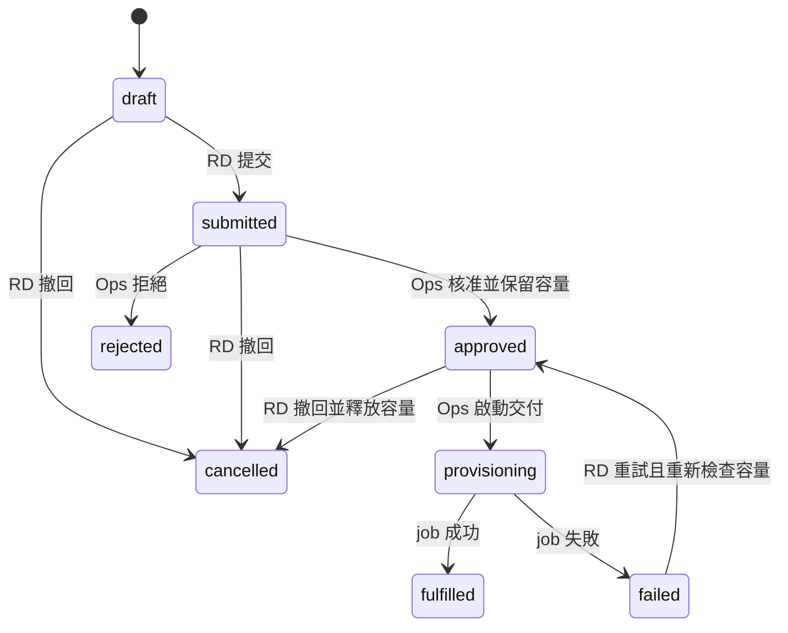
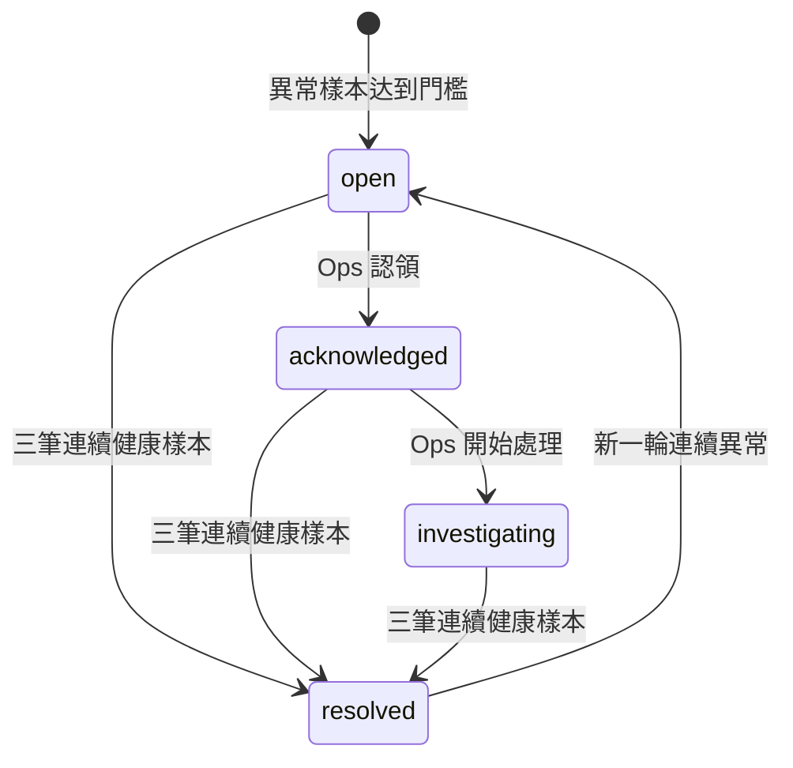

# 03 — 業務流程、狀態機與一致性

## 1. Command 與時間

所有 command 走 [06 API](06-api-mock.md)，handler 依次執行：authentication／scope → payload validation → idempotency lookup → expectedVersion → state preconditions → 計算新 snapshot → 持久化原子交換 → 發布 change notification。未通過前置條件不能修改 domain state；拒絕結果可另記安全稽核，但不能偽裝成功 command。

domain engine 的時間只由可注入的 demo clock 決定。UI 執行「啟動」之後，scheduler 每秒推進一個 logical tick；畫面可播放，但狀態演算不依賴隨機數。刷新時恢復未完成 job，以存檔的 stepIndex／dueTick 繼續，不依離線真實時間自行完成。測試可直接 advance ticks。

## 2. 環境申請與交付

| Command／transition | 前置條件 | 原子寫入與畫面結果 |
| --- | --- | --- |
| create draft | 可見 published catalog revision；app 屬於 RD project scope | 固定 templateSnapshot／revision、計算 request scope，state=draft |
| edit draft | 只有 requester，version 相符 | 可改 environmentName、規格、用途；provider／pool 改動重新驗 template；app／catalog 不可換，需另建草稿 |
| submit | schema 合法、pool/template 允許、環境名稱未被使用 | state=submitted，鎖住 app+environmentName 的申請名額，建立 audit |
| approve | Ops 同時有 project 與 pool scope；非 requester；容量足夠 | state=approved、approval(actor/time/reason)、queued job 與 reservation 一起建立 |
| reject | submitted；Ops 審批權；非 requester；非空理由 | state=rejected，釋放申請名額；不能自動建立環境 |
| cancel | requester；draft/submitted/approved | state=cancelled，queued job 標記 cancelled，釋放 reservation／申請名額；不允許取消已 running job |
| provision | approved；Ops project+pool scope；job queued | state=provisioning、job=running、environment=provisioning；planned CI IDs 尚不列入 active inventory |
| job success | job running；reservation 有效 | 新建 active CI、placement、environment ready；reservation 轉為 used；job succeeded；request fulfilled |
| job failure | job running | request failed、environment failed、job failed；釋放 reservation；不創建 active CI／placement，保留 failure reason 與 log |
| retry failed | requester 仍有 scope；原 approval 有效；模板 snapshot 合法；容量足夠 | attempt+1、新 queued job／reservation、request approved；重用同環境 ID 與既定 CI IDs，不另建第二份資產 |

approve 時 quota 與 reservation 必須在同一 transaction 檢查／寫入，不能兩張同時批准的請求都看到舊 available。submitted request 本身不佔容量。failed request 持有環境名稱；rejected/cancelled 釋放。`fulfilled` 是終態，不能再點 provision；重放同一 command 回傳原結果。v0.1 approval 沒有自動過期，failed request 的參數不能改，原 snapshot approval 可用於 retry；新 job 仍需目前有權的 Ops 明確啟動，不能由舊 approver 身分自動執行。

v0.1 provisioning 是 all-or-nothing 的模擬，不模仿跨雲部分建立後的補償系統。真實 adapter 未來需新增 partial/compensating 等契約，不能把這裡的原子性承諾套到外部雲 API。

job 的固定步驟：validate → allocate → configure → register → verify，每步 1 tick。`provision-failure` 在 configure 失敗，保留可讀 log。正常總計 5 ticks；顯示為演示時間而非真實交付 SLA。

## 3. CI/CD 與发布

PipelineRun.state：`queued | running | awaiting_approval | succeeded | failed | cancelled`。Stage.state：`queued | running | succeeded | failed | cancelled | skipped`；stage 固定 `build/test/package/deploy/verify`。

Release.state：`pending_approval | queued | deploying | verifying | succeeded | failed | rejected | cancelled`。PipelineRun 與 Release 分開，build/test/package 失敗時尚無 release；package 成功生成穩定 artifactDigest，才建立 Release。

| 操作 | 規則與結果 |
| --- | --- |
| trigger pipeline | app/environment ready、RD project/stage scope；同環境無非終態 pipeline/release；建立 queued run 並取得環境操作鎖 |
| build/test/package | 每階段 1 tick，成功 artifact 以 source revision + fixture build recipe 決定，不用隨機 digest |
| deploy dev/staging | 建立 queued release；持有 lock，進 deploying → verifying |
| deploy prod | 建立 pending_approval release，run=awaiting_approval；Ops 非 initiator 核准後才 queued；rejected 使 run failed 並釋放 lock |
| health gate success | release succeeded，環境 activeReleaseId 改成新 release；run succeeded，保留 previousReleaseId，釋放 lock |
| health gate failure | release failed、run failed；activeReleaseId 保持先前成功 release；記錄候選版本失敗；釋放 lock |
| cancel pipeline | queued/running 的 pre-deploy 階段或 awaiting_approval；取消 pending release，未開始 stages skipped，釋放 lock；deploying/verifying 不支援取消 |
| retry pipeline | failed/cancelled run；新 runId 與 correlationId、retryOfRunId 指向原 run，重新取得 lock，不能覆寫原失敗歷史 |

pipeline terminal state 才釋放環境鎖；同環境再次 trigger／rollback 回 409 `ENVIRONMENT_BUSY`。prod approver 與 initiator 必須不同 userId；角色切換不改原 initiator。核准時重新檢查 scope 與 version。pending approval 第一版無自動過期；可由 initiator 取消或 Ops 拒絕。

demo deployment 在 candidate slot 執行，health gate 成功才切換 active。failed candidate 不等於穩定服務已經中斷。`post-release-latency` 則發生在一個已成功上線的 release 之後，表達健康檢查沒有捕捉到的後續退化。

## 4. 回滾

回滾是新建 `kind=rollback` 的 Release，不是修改歷史列。targetReleaseId 必須指向同 environment 中 state=succeeded 且 artifact 不同於當前 active artifact 的歷史 release。目標 digest 必須仍在 demo artifact registry；沒有可用 target 時按鈕 disabled 並有理由。

1. RD 選歷史 target、填 reason；handler 再驗 scope、version、ready 環境與操作鎖。
2. 新 release 記錄 previousReleaseId=當前 active、targetReleaseId=選擇目標；dev/staging 直接 queued，prod 走同一 Ops approval。
3. deploying → verifying → succeeded／failed。成功使 activeReleaseId 指向**新 rollback release**，effective artifactDigest 與 target 相同；失敗保持原 active。
4. 成功後寫 observation recovery event，但 incident 要在 3 個連續健康的一分鐘 sample、每 60 ticks 一筆（1 tick = 1 秒）後才 resolved；不能在按下回滾時就關告警。
5. 回滾失敗保留 incident、原因和重新操作入口；下一次 retry 使用新 release ID 及新的 idempotency key。

## 5. APM 與 incident

Incident.state：`open | acknowledged | investigating | resolved`。created observation 累積連續 3 個 1-minute bucket 的 p95>500ms 或 errorRate>5% 才建立 incident；數值只是演示規則，非生產建議。正常主線 scenario 一次注入足量異常 buckets 並附 sample window，不能把三次瞬間 UI 更新說成三分鐘實測。

- metrics／trace／log 共享 applicationId、environmentId、time window；帶 releaseId 的樣本才直接連結該 release，否則顯示未知。
- 同一 environment + ruleKey 在非 resolved 期間只更新同一 incident；新增 evidence，不重複建立。resolved 後新異常重開同一 incident，新增 episode 與 audit。
- acknowledge 設 assignee=current Ops；investigate 只允許 assignee 或同 scope Ops 接手並附理由。RD 有 read，不能關閉 incident。
- incident evidence 包含 threshold、sample window、trace/log refs、affected CI、related release；observed fact 與 suspected relation 分開。
- post-release-latency 明示推進 180 個 demo ticks，經同一 scheduler 注入三個連續一分鐘窗口；不使用早於相關 release 的假歷史樣本。回滾恢復按成功 health gate 後的第 60／120／180 tick 產生；active release 改變或新異常會取消過期恢復排程。
- normal healthy samples 為 p95=120ms、errorRate=0.2%、rate=80 req/s；異常示例 p95=900ms、errorRate=8%、rate=80 req/s。label 與 unit 固定，time window 的歷史錯誤不因恢復被抹除。
- v0.1 不提供無證據的手動「恢復」按鈕。導覽的「恢復樣本」明示為 scenario 控制，適用於無法回滾的分支；它仍經 observation engine。

## 6. 三來源主線的演示腳本

| 步驟 | Persona／動作 | 可觀察結果 |
| --- | --- | --- |
| 1 | Admin 檢查 catalog-web、scope；將導航 label 改為示例值並儲存 | 目前 persona 的導航立即更新，audit 可見；權限未隨 label 變更 |
| 2 | Ops 篩選三 provider，查看共享 Redis 與 workload 拓撲 | 三來源皆有資料，點 CI 可見來源欄位；可額外手動納管一筆 |
| 3 | RD Commerce 申請 checkout staging，預設 AWS pool | 新 submitted request；切 Ops 看同 requestId |
| 4 | Ops 批准並交付 | reserved 上升後歸零、used 上升；environment ready、placement 存在 |
| 5 | RD 發布 `demo-stable-001` | pipeline 與 release 成功，active artifact 穩定 |
| 6 | RD 發布 `demo-latency-002`，再由 guide 注入 post-release-latency | 新 active release；incident 與 metrics／trace／log 一致 |
| 7 | Ops 認領並查 CMDB impact、recent release | consumer/dependency 可定位，不宣稱自動判定根因 |
| 8 | RD 回滾至 stable，等待 health gate 與恢复樣本 | active 指向新 rollback release；incident 隨證據 resolved |
| 9 | 查看 audit／reset | 因果鏈完整；reset 復原基線，舊 timer 不再產生事件 |

同一腳本 reset 後改選 Aliyun、IDC pool 必須能完成，不只 AWS 頁面可用。prod approval 用第二個獨立 scenario 驗證，主線 staging 保持流暢。

## 7. 稽核與一致性

一個申請與其所有 job attempts 使用同 correlationId；pipeline 及所屬 release 共用自己的 correlationId；incident 指向 relatedReleaseId，回滾保有新的 correlationId 並可追 previous/target release。不能宣稱整個永續應用只有一個 correlationId；UI 要沿 entity references 重建整條因果鏈。

所有成功 mutation 都產生 audit，包括 role assignment、menu、catalog、CI、request、release、incident。拒絕／衝突的寫入可產生 outcome=denied/conflict 的 audit，不修改原 entity version。Audit 無任意 payload、token 或完整 log，diffSummary 只記安全的欄位差異。

store commit 後發出單一 revision notification；TanStack Query 對影響的 resource family invalidation 後重新讀取。頁面上不能靠手工調整某張卡的數字模仿完成。角色切換要取消舊 requests、清 query cache，再按新 scope 讀取；reset 同時清資料、cache、timer 與 scenario faults。
