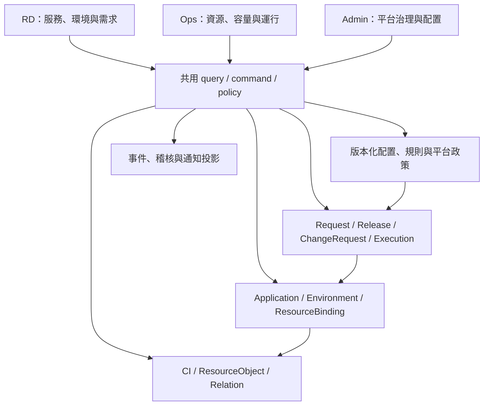

# 09 — 三工作區與共用領域設計

版本：WS-SDD revision 1 · 2026-09-22 · 狀態：W1 已驗收合併；W2 已驗收合併（PR36）；W3 合約固定、實作尚未完成，固定證據見 [STATUS](../STATUS.md)；W3–W5 尚未實作。

## 1. 目標、基線與閱讀順序

RD 是公司的業務系統工程師；Ops 是資源與服務運行的維運人員；Admin 是本平台的開發及管理者。三者是同一平台的工作視角，不是三套產品、資料庫或彼此同步的資源副本。共用後端領域與規則，頁面按任務組織；同一使用者可獲授權進入多個工作區。

M0–M5 的 v0.1 已有三中心、CMDB、環境申請、Pipeline／Release、觀測與治理。W1 之前的入口是「示範身分」，首頁以共用概覽組件組成；W1 已拆開工作區與 Demo 身分入口並使用角色首頁投影。新設計解決入口難找、首頁差異不足，以及「有某 kind 的 CI」不等於「已有完整專業管理面板」的缺口。

閱讀：[RD](10-rd-workspace.md)、[Ops](11-ops-workspace.md)、[Admin](12-admin-workspace.md) → [能力對照](13-capability-map.md) → [交付與驗收](14-workspace-delivery.md)。09 定義共用語義與新增需求；10–12 定義角色視圖；13 定義能力覆蓋與深度；14 是新驗收 ID 的唯一來源。

本組文件是 v0.1 之後的設計擴充。01–08、現有 schema／OpenAPI 仍定義已交付行為；總綱 INV-01～08 持續優先。下文「新增／目標」不是現行 wire contract，不能僅修改前端就向不存在的 endpoint 發送請求。各增量實作時同 PR 更新受影響的 01–07、schema、OpenAPI、Mock 與測試；未明示改動的既有狀態機與 API 保持原契約。

## 2. 新需求的單一來源

| ID | 需求 |
| --- | --- |
| REQ-WS-01 | 工作區入口醒目；選工作區與切 Demo 身分分開；導航與首頁符合角色任務。 |
| REQ-WS-02 | 業務服務、資源、子資源、綁定與依賴使用共用身分及權限投影。 |
| REQ-WS-03 | RD 從服務／環境管理資源需求、交付配置、運行配置、監控與告警。 |
| REQ-WS-04 | Ops 從資源池／叢集／產品管理容量、維護、共享影響與基礎設施變更。 |
| REQ-WS-05 | RD 申請中心與 Ops 審批中心投影同一工作單、決策、執行及稽核。 |
| REQ-WS-06 | Admin 治理入口、使用者、授權、平台功能灰度、整合路由與通知，不隱含業務執行權。 |
| REQ-WS-07 | CI/CD、服務配置、流量策略有版本、批准、執行與健康驗證，灰度失敗可追蹤。 |
| REQ-WS-08 | 服務監控／告警配置與平台告警運行面板共享規則、事件及受控通知投影。 |
| REQ-WS-09 | 擴充保留 v0.1 既有 ID、歷史與工作流程；新 schema 有明確存檔升級／復原路徑。 |
| REQ-WS-10 | 能力清單標出完整 Mock、唯讀、後續整合；不以空頁或外部產品名稱冒充實作。 |

## 3. 工作區、上下文與導航

頂部常駐「RD 業務研發／Ops 維運／Admin 平台管理」工作區選擇器、目前工作區名稱與 Demo 標記。一般切換只列出目前使用者有 grant 的工作區；不因點選而更換 userId 或授權。單一工作區時仍顯示名稱，不把唯一入口藏進頭像。Demo 另有清楚標示的「體驗其他角色」，選 seed persona 後再進其首頁；production 不提供此機制。

- RD 上下文：project → application（UI 稱「服務」）→ environment。Ops：provider → pool／cluster，可加服務影響篩選。Admin：organization → 配置類型。stage 與 provider 是不同維度。
- 左側只顯示目前工作區的分組導航；多角色使用者不把三套清單混成一個長列表。搜尋可跨獲授權領域，结果附服務／環境／資源類型及目標工作區。
- 工作區切換保留合法 scope；不合法的 app/env/pool 清除並說明。中心首頁導向各自 `/rd`、`/ops`、`/admin`；保留所有已公開深連結。
- identity 變更清 cache 並丟棄舊 epoch response；workspace 變更不改 domain 狀態，查詢仍鍵入 identity/policyVersion 與完整 filters。返回列表保留合法篩選與分頁。
- 有 read action 的跨中心 detail 可沿用既有診斷深連結，呈現返回來源與唯讀原因；這不授予目標中心清單或寫入權。選單停用不撤銷 API 權限。
- 禁止／不存在／空資料／載入失敗／stale 明確區分。狀態數、待辦數、搜尋結果先授權再計算；未知不是 0。所有操作遵守鍵盤、focus、明暗與窄螢幕契約。

## 4. 一份領域，三種投影

| 實體 | 既有或新增 | 單一責任及必要關係 |
| --- | --- | --- |
| Organization／Team／Project／Application／Environment | 沿用 | Application 是本輪的業務「服務」，不用另建 Service 副本；一個 Application 多環境。更細部署單元留待有實例需求再擴充。 |
| CI／ResourcePool／ProviderAccount／Location | 沿用 | 被管理資源及來源身分；cluster/database/cache/queue/network 等 kind 不等於專業控制面已實作。 |
| Placement／Relation | 沿用 | Placement 表達 app/env 使用 CI；Relation 表達 CI 間技術依賴。共享資源不複製、不因綁定而轉移 owner。 |
| ResourceObject | 新增，W2 | CI 內可獨立管理的邏輯物件：namespace、database、cache allocation、Kafka topic 等。帶 id/orgId/version、parentCiId、kind、externalRef、name、namespace?、lifecycle、observedAt 與 kind-specific spec。canonical key = parentCiId + kind + namespace（無則空值）+ externalRef；顯示名稱不是 key。 |
| ResourceBinding | 新增，W2 | applicationId、environmentId、ciId、resourceObjectId?、placementId、purpose、accessProfileRef、state、requestRef；三方 org 必須一致。綁定指向一個授權消費關係，不存帳密。唯一性為 env + CI/object + purpose。 |
| Request／ProvisionJob／PipelineRun／Release／Artifact | 沿用 | 現有環境交付與發布領域仍是其原狀態的唯一 owner；不重寫已驗收歷史。 |
| ChangeRequest／ChangeExecution | 新增，W2 起 | 有型別的資源／配置變更與執行嘗試。使用不可變 target refs、spec snapshot、審批決策、版本及 correlation，詳見第 5 節。 |
| WorkItem projection | 新增讀模型 | `{sourceType, sourceId, actionRequired, stateLabel, targetRefs, requester, dataAsOf}`；sourceType 為 request/release/change。每個來源一列，不持久化第二份業務狀態。 |
| PipelineDefinition／ServiceConfig／TrafficPolicy | 新增，W3 | app/env 範圍內版本化期望配置。PipelineDefinition 與一次 PipelineRun 分離；TrafficPolicy 與實際 Release 分離。 |
| MonitorPolicy／AlertRule／SLOPolicy／Silence | 新增，W4 | 監控設定、告警規則、服務目標與有期限抑制；以 app/env/CI/object references 關聯，不把 time-series 寫入 CMDB。 |
| PlatformFeaturePolicy／PlatformRoute／NotificationPolicy | 新增，W5 | 平台功能可用性、已註冊整合入口路由與平台通知政策；不控制業務流量或提升角色權限。 |

ResourceBinding 與 Placement 不各自保存互相競爭的「是否已連接」：W2 的 domain command 原子建立／移除 Binding，並維護同 app/env/CI 的唯一 Placement 投影；多個 topic 綁定同 queue CI 仍只有一個 Placement。既有 Placement 不強迫補造不存在的子資源／access grant，標示 legacy read-only association，待明確綁定操作才建立 Binding。刪除最後 Binding 時只可移除其建立且無其他引用的 Placement；既有手動關聯保留。

W2 的 ResourceObject.lifecycle 為 active/retired（本階段不開 retire command），ResourceBinding.state 為 active/released（本階段不開 release command）。執行成功才建立 active object/binding；待批准／進行中需求保留在 ChangeRequest，不先寫一筆假 active Binding。purpose 固定為 runtime/producer/consumer；accessProfileRef 必須是 catalog 允許且符合 purpose 的安全 profile。

W2 kind-specific spec 限定：cache_allocation 的 quotaMiB 為正整數；kafka_topic 的 partitions、retentionHours、throughputKiBPerSecond 為正整數，均受 catalog revision 明定上下限。單一 quota 由 ResourceObject 持有，多個 Binding 引用同 object 不重複配額。Redis resize 只改 allocation 配額，不改實體 instance 大小；若 allocation 有多個 consumers，依同一共享影響規則核對全部 project/stage。Kafka topic create 成功原子建立 object 與申請者的 producer/consumer Binding；額外 Binding 走 resource.bind。parent CI.kind/engine、object kind、app/env/placement、profile 全須相容，不容許跨 org 或任意 parent 指向。

ResourceObject 的 read 不由可見 parent CI 自動推出；Binding 不讓 RD 看到同資源的其他服務、topic、schema 或秘密。Ops 可見 parent pool 的物理資訊，但服務名稱、變更 payload、應用影響清單仍需 project/stage read；看不到全部影響時顯示「影響範圍未完整授權」，不得洩漏隱藏數量或允許宣稱影響已核對。

### 4.1 具體例子：共享 Redis 與 Kafka

`checkout-api/staging`、另一個服務都依賴 `ci-idc-redis-01`：Ops 看一個 Redis CI 的容量、版本、維護及其獲授權 consumers；RD 看自己的 Binding、配置版本、quota、健康與申請。物理用量只計一次；租用配額另外統計，不能把每份 quota 當實際 memory usage。

Kafka cluster 是 queue CI，`orders-events` 是 ResourceObject，producer／consumer 是不同 purpose 的 Binding。RD 申請自己的 topic／消費綁定；Ops 審查 partitions、retention、配额與 ACL profile。調整 cluster 不等於單一 topic 變更；同名 topic 在不同 cluster 不共用 ID。

## 5. 共用工作單、批准與執行

RD 的「我的／團隊申請」與 Ops 的「待我處理／全部可見」是 WorkItem 的不同篩選。業務申請、prod release approval 與新增 ChangeRequest 保留原 sourceType/sourceId；detail 與 command 分派到領域 owner。不得複製 request 成 opsTicket 或以列表狀態回寫來源。

新增 ChangeRequest 最小欄位：base fields、requesterId、kind、applicationId?/environmentId?、poolId、targetRefs、specSnapshot、targetVersions、riskClass、reason、state、approval?、latestExecutionId?、correlationId。W2 僅開放 resource.bind、resource.resize、kafka.topic.create 三種 kind；每種用 discriminated schema 驗證，不接受任意 JSON/script。specSnapshot 保存 catalogRevision 及明確執行參數，不引用可變草稿。

| 狀態／轉移 | 執行者與規則 |
| --- | --- |
| draft → submitted | requester，驗 current scope、catalog revision 與完整 spec；freeze snapshot；此時不表示已配置資源。 |
| submitted → approved / rejected | 不同 requester 的 Ops，具所有目標 pool 及受影響 project/stage 的相應授權；決策理由必填。批准時原子檢查／保留 quota；拒絕不建立 Execution。 |
| draft/submitted/approved → cancelled | requester；approved 只限尚未啟動，原子釋放 reservation。running 不能直接取消。 |
| approved → executing | 有 scope 的 Ops 啟動新 ChangeExecution，重驗 targetVersions、policy、容量與執行鎖；已變動回409，不把旧批准套到新內容。 |
| executing → succeeded / failed | domain executor；成功才更新 Binding/目標配置；失敗保留原 active version、歷史與診斷，釋放 reservation/lock。 |
| failed → submitted | requester 明確重新送審，spec 不變可重用內容但需新決策；改 spec 則複製成新 draft，原單保留。 |

ChangeExecution = changeId、attempt、state（queued/running/succeeded/failed）、targetRefs、plannedObjectIds、stepResults、failureCode?、startedAt/completedAt、correlationId；不可假裝任意外部失敗能自動回滾。Mock 選定能力用原子成功／失敗；真實 partial failure、reconciliation 與補償由未來 integration SDD 定義。

以上是新增變更流程；現有 Request 的 provisioning/fulfilled 及 retry、Release 的 pending_approval/verifying 等不改名、不照此重寫。WorkItem 顯示可用共通詞，但須顯示原始領域狀態。批准、執行、服務健康是三件事；批准不能直接顯示「資源可用」。

## 6. 權限與變更不變量

既有 [04](04-permissions-admin.md) 全數保留。新增 action 目標如下；皆在 backend/domain evaluator 驗證，選單、工作區、feature flag、relation 都不是 grant。

| 新 action family | 最小 scope 與分工 |
| --- | --- |
| binding.read、resourceObject.read | RD 限明確 app/env 綁定及 project/stage；Ops 限 pool，加上服務 payload 需 project/stage；Admin 僅治理 metadata。 |
| change.create/submit/cancel | RD 限 project/stage 與 requester；只可申請 catalog 允許的 pool/object/profile。Ops 基建維護另以其 pool 建單，不取得 RD 權限。 |
| change.approve/execute、resource.manage | Ops pool；涉及 consumers 還需全部受影響 project/stage，缺授權則交由合格 reviewer，不放行、不洩漏清單。禁止自批。 |
| pipelineDefinition.write、serviceConfig.write、trafficPolicy.write | RD project/stage；prod activation 必須不同且具 scope 的 Ops 批准；pool-wide topology/ACL 不屬於此權限。 |
| monitorPolicy.write、alertRule.write | RD project/stage 的服務規則；Ops pool 的基礎設施規則分別授權。抑制共享基礎設施規則不是 RD 的權限。 |
| platformFeature.write、platformRoute.write、notificationPolicy.write | Admin org，僅平台對象；新增使用者管理沿用 access.write 的 self/last-admin 防護。 |

所有新 command 沿用 expectedVersion、Idempotency-Key、當前 policy、原子 audit/event/receipt；取得 active revision 需通過指定驗證。RD 只拿安全 endpoint label／access profile reference；密鑰、連線密碼、實際 IP、真實雲帳戶不入 fixture 或 browser store。

## 7. API 與前端邊界

W1 已依 [integration contract](../W1-INTEGRATION-CONTRACT.md) 擴充既有 `/dashboard?center=` DTO/query，OpenAPI 與 Mock 同步。W2 已依 [W2 contract](../W2-INTEGRATION-CONTRACT.md) 實作 `/resource-objects`、`/bindings`、`/work-items`、`/changes`、`/changes/{id}/approve`、`/changes/{id}/execute` 等 typed endpoints；精確 operation、DTO 與狀態碼以 [OpenAPI](../openapi.json) 為準。`/pipeline-definitions`、`/service-configs`、`/traffic-policies`、`/monitor-policies`、`/alert-rules`、`/admin/platform-features`、`/admin/platform-routes`、`/admin/notification-policies` 仍是後續目標。均放既有 API base 下，不為 RD/Ops 複製 CRUD。

Read 使用既有 ApiResult/Page、scope 先行及上限；WorkspaceHome 是 discriminated union（rd/ops/admin），每個卡片含 dataAsOf、source refs 與合法下鑽條件。commands 回既有 CommandReceipt；async 回 operationId，不能只有 toast。錯誤沿用401/403/404/409/422/429/503/507；配置驗證增加可定位的 fieldErrors，不把一般 version conflict 轉成自動覆蓋。

React 僅透過 API client/query/mutation；domain feature 共用 schema、selector、policy、command，工作區層只組裝投影。不要建立 rdRedisStore／opsRedisStore 或三套各自的 mock handler。Route registry 固定 capability/action；導航配置只能引用已註冊 route key。

W2 歷史本機驗證 checkpoint（2026-09-23；後已由 PR36 驗收合併，詳見 STATUS）：產品 `4a69e07` 通過321項原生測試、77/77 Chromium、2/2隔離；最終修正 `bf3f168` 通過8/8 Firefox／WebKit、實際版面／鍵盤檢查及3/3效能。獨立review關閉F01–04；仍須最終PR head CI、主控接受與實際合併，**尚未宣稱 W2 ACCEPTED/MERGED**。完整AC與歷史失敗以 [STATUS](../STATUS.md)、[W2驗證報告](../../../../.team/reports/dim-gate-w2-validation.md) 和PLAN為準。W3–W5、後續／待釐清能力尚未實作。
