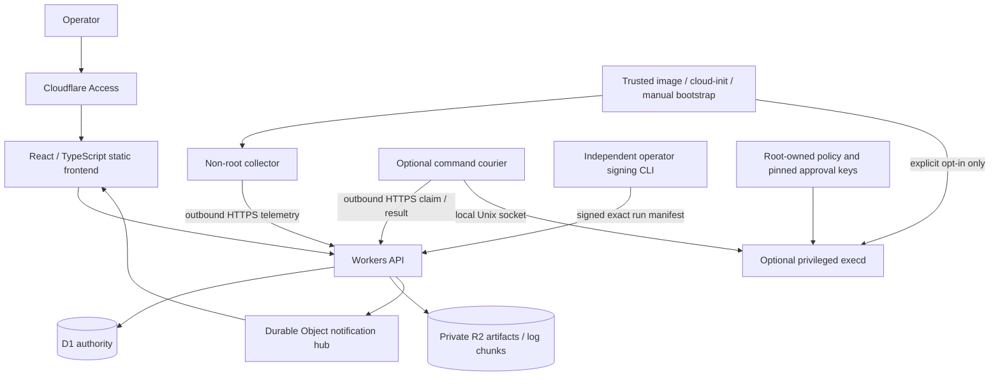

# Edge Ops — Software Design Document

版本：0.1 draft · 日期：2026-09-27 · 狀態：設計提案，尚未實作。

## 1. 結論與理由

建立 Cloudflare-native 的小型主機觀測與受控作業平台，不建立另一套泛用雲平台。第一條可驗收通道是：**安裝非 root Agent → 安全註冊 → 指標持久化 → 面板可見 → 斷線明確顯示 → 恢復後有限補報**。後續增加日誌、經批准的 typed job，最後接上首次初始化與 image 管線。

CF-Server-Monitor 的固定來源明示監控-only、沒有 WebSSH 或命令下發；它提供需求參考，不提供本專案控制能力的安全保證。[S01](docs/SOURCES.md#s01) 加入操作之後，Worker 被入侵所造成的風險已不同，因此不能沿用「單向探針所以不會控制主機」的宣稱。

## 2. 使用者與價值

主要使用者是管理約 10 台自有 VPS／VM 的 operator；10 台是容量驗收起點，不是硬限制。先支援 Linux/systemd、amd64/arm64；其他 Linux init 系統、OpenWrt、NAS、macOS、Windows 都是後續獨立相容性項目。Proxmox 宿主、儲存設備與管理網關預設只讀，不是首批操作目標。

使用者需要回答：哪台機器健康惡化、資料是否新鮮、相關日誌是什麼、誰批准了哪項操作、到底有沒有執行、初始化卡在哪一步、控制面失效時主機是否仍安全。

## 3. 範圍與優先级

| 階段 | 價值 | 能力 | 明確排除 |
| --- | --- | --- | --- |
| P0 | 看得見並信任資料狀態 | 註冊／撤銷、指標、健康面板、歷史、離線／恢復告警、成本量測 | logs、host mutation、初始化 |
| P1a | 從異常走到證據 | 選定日誌、cursor／截斷、受限讀取與稽核 | 任意檔案瀏覽、無界全文搜尋 |
| P1b | 經核准執行有限作業 | recipe、artifact、獨立簽署、JobRun、執行器、取消／不確定狀態 | WebSSH、任意未批准 shell、全機自動修復 |
| P2 | 空機走到可重複驗收 | cloud-init/bootstrap、版本化初始化、重啟恢復、可選 Packer image | 自動重灌既有主機、替代雲商／Proxmox control plane |

優先級是依價值與安全依賴分層，不是按照開發工時刪除需求。上游的 GPU、地圖、線路測試、到期提醒、多語、NAS 支援可進後續 backlog，但不阻擋這條主線。

## 4. 架構

瀏覽器與 Agent 是不同身分；監控與操作是不同能力。D1 擁有 durable job state；DO 只提供可重建的即時提示。R2 存大物件，不把每行 log 塞進 D1。Agent 沒有公網入站 listener，使用 egress HTTPS；Tailscale 可留作獨立 break-glass 維運路徑，不作本專案必要依賴。

Cloudflare 上運行的是控制面，不是 OS image builder、長時間 shell 或 VM runtime。image build／bootstrap 在另行授權的 CI、雲平台或目標 VM 執行。

## 5. 三塊與共用契約

- 前端：[01-frontend](docs/sdd/01-frontend.md)。React + TypeScript + Vite；Worker Static Assets 部署方向，先有 fixture/demo mode，不能隱性降級假資料。
- 後端：[02-backend](docs/sdd/02-backend.md)。TypeScript Workers、D1、SQLite-backed DO、R2；不以常駐 VPS 作控制面依賴。
- Agent：[03-agent](docs/sdd/03-agent.md)。Go daemon 與分離的 optional executor；不含 LLM、不解讀自然語言、不自選工具。
- 共用：[05-contracts-and-security](docs/sdd/05-contracts-and-security.md)。M0 將本文模型落為版本化 OpenAPI／JSON Schema，三線使用同一組正反 fixtures。

精確依賴版本在 M0 以可重現 build／支援狀態鎖定，不在沒有安裝測試時捏造 lockfile。Cloudflare 實作集中在 adapters：IdentityVerifier、NodeRepository、TelemetryStore、JobStore、ArtifactStore、LiveNotifier、NotificationChannel；抽象只為隔離已有邊界，不先建立泛用 plugin framework。

## 6. 與現有平台的責任

| 元件 | 已讀來源揭示的責任 | Edge Ops 對接方式 |
| --- | --- | --- |
| `platform/dim-gate` | CMDB／三工作區 demo 前端 | 未來 adapter 以 external_ci_id、resource_ref 串接；不另造全企業 CMDB |
| `platform/agent-platform` | LLM task／Cocoon sandbox lifecycle | 僅觀測其宿主；不管理模型 turn 或 guest 任務 |
| `specs/fleet`／OneFleet | workload catalog／應用生命週期 | 可提供主機健康引用；不啟停其工作負載 |
| OneVPS | PORTFOLIO 定義的 privileged host authority | external 模式下不直接變更主機；adapter 的 delegated job 另定契約 |

來源與讀取範圍見 [R01–R05](docs/SOURCES.md#repository-evidence)。沒有在本次審計 private kernel 實作，也沒有宣稱上述 adapter 已存在。

每台 node 的 `host_authority` 初始為 `external` 或 `none`，不是可由一般後台任意改成 `edge-ops` 的開關。Standalone 模式需 owner 批准、主機本地安裝 executor 與政策，並確認沒有其他 host reconciler 競爭同一設定。改換 authority 屬獨立遷移，有排空與交接證據。

## 7. 不可妥協的不變量

I-01：collector 沒有執行通用 job 的能力，遠端回應不允許 shell、命令、動態 plugin 或改寫信任根。

I-02：所有變更綁定 workspace、node、enrollment generation、固定 artifact／參數、權限、有效期與核准；不能用全 fleet 共用 SECRET 當控制授權。

I-03：root execution 是信任過的高風險程式，不因有 systemd sandbox 或簽章就成為不可信程式的安全沙盒。

I-04：job 投遞可重複，但副作用是否发生需靠本地 durable journal／postcondition 對帳；不承諾 exactly-once。

I-05：資料過期、失聯、unknown、部分資料丟失均可見；不可用 0 冒充 unsupported 或把 lease timeout 冒充停止。

I-06：metric、log、artifact、job output、audit 有不同保留期、配額與權限；監控權不能推導出日誌或操作權。

I-07：主機原文日誌與 secrets 不進公開 repository；資料上雲須選擇範圍及告知風險，masking 不是零外洩保證。

## 8. 設計決策摘要

ADR-01：監控是可独立部署的最小產品；管理能力為 opt-in，不做強制 root 全能 Agent。

ADR-02：D1 是 job authority，DO 為通知投影；先不用 Queues／Workflows 疊第二套狀態機。未來引入 at-least-once queue 時仍須 dedupe。[S06](docs/SOURCES.md#s06)

ADR-03：普通主機用已驗證官方 OS image + 最小 cloud-init 起步；Packer golden image 是加速與重現手段，不是第一台監控接入的前提。

ADR-04：P1b 起，主機驗證來自獨立信任域的 operator approval signature；私鑰不交給 Worker，也不依賴同源 Web UI 生成可信簽名。

ADR-05：先有 bounded host/time log browsing，不宣稱替代 Loki／Elasticsearch／完整 APM。高流量／高基數觀測未來以 adapter 導出專用系統。

## 9. 可驗收與未解項

里程碑、驗收 ID、故障注入與平行工作切分見 [06-delivery-and-acceptance](docs/sdd/06-delivery-and-acceptance.md)。容量及費用推演見 [07-capacity-and-operations](docs/sdd/07-capacity-and-operations.md)。

仍須在後續 gate 得到證據：D1 CAS 與審計原子性、Go/Workers 簽章相容、DO 休眠／重新驗權、目標 Cloudflare 套餐與實際成本、systemd 隔離配置、斷電時本地 journal、各 OS image 的 first-boot 特性、instance identity 真偽驗證。未解項不由 Agent 臨場猜測成安全預設。
