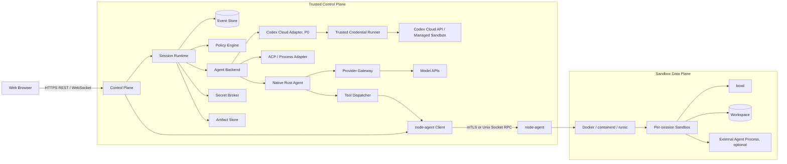
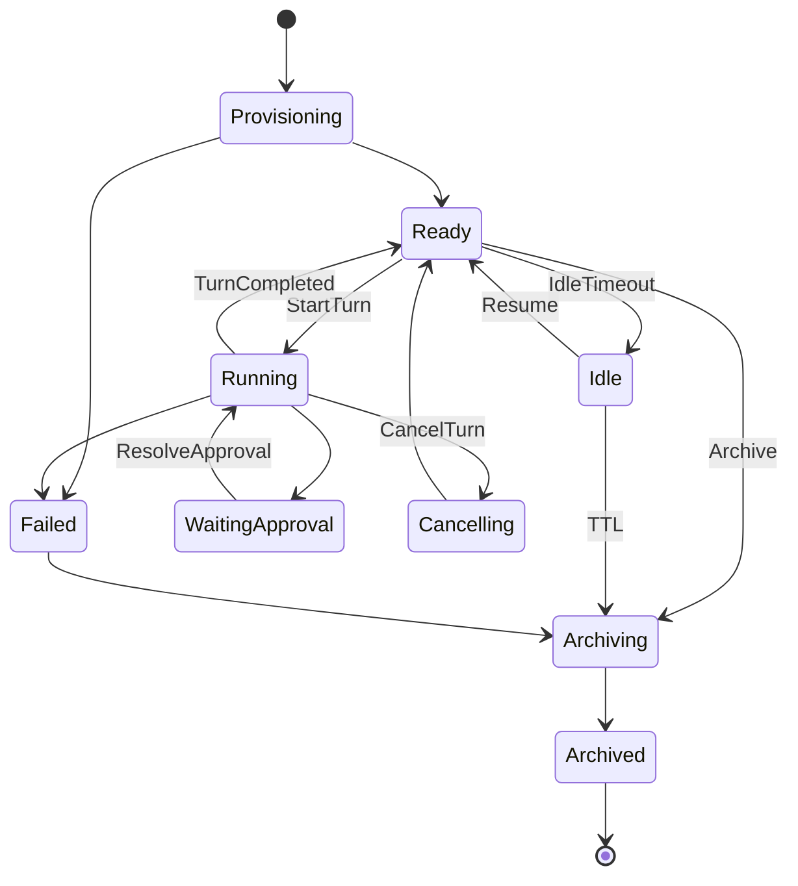
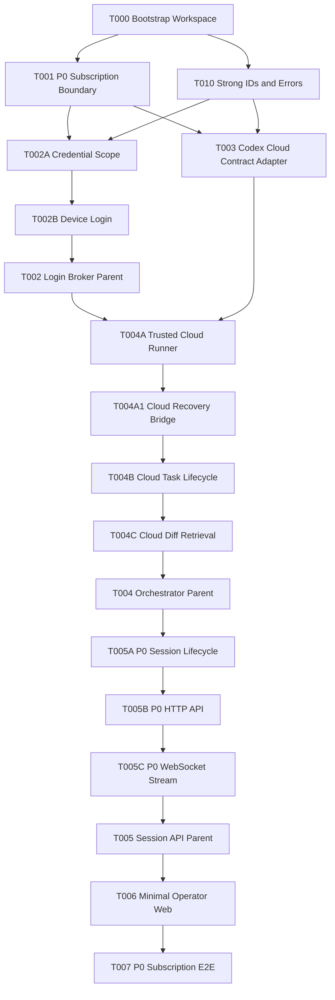
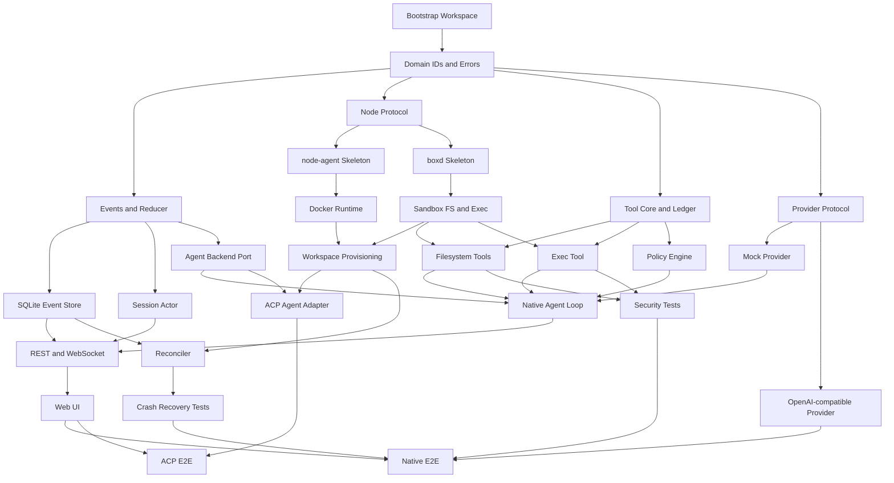

# Codebox
## Unified Technical Design, Specification Contract, and LLM Delivery Protocol

> **Status:** Implementation Ready  
> **Version:** 1.0  
> **Date:** 2026-07-27  
> **Project:** `codebox`  
> **Audience:** Architecture, Rust backend, frontend, security, QA, and autonomous coding agents  
> **Product:** Provider-neutral cloud coding agent platform implemented in Rust

---

# 0. Executive Directive

This document is the project’s **normative source of truth**. It defines the product boundary, architecture, invariants, contract model, task-decomposition rules, implementation workflow, and acceptance process.

An implementation agent must not jump directly from a user request to production code. The required delivery chain is:

```text
Technical Design
    ↓
Task Graph
    ↓
Contract Unit
    ↓
Specification
    ↓
Test Skeleton
    ↓
Implementation
    ↓
Verification Evidence
    ↓
Documentation Acceptance
    ↓
Traceability Update
```

Two rules are absolute:

1. **No production code before the relevant specification is ready.**
2. **No task is complete until its documentation is verified against the implementation.**

The final acceptance object is not a verbal summary and not a code diff. It is a versioned documentation set that proves the implementation conforms to this design.

## 0.1 Normative language

The words **MUST**, **MUST NOT**, **SHOULD**, **SHOULD NOT**, and **MAY** are normative.

## 0.2 Document hierarchy

```text
docs/TD.md                         This document
docs/adr/ADR-*.md                 Approved architecture changes
docs/tasks/T*.task.md             Decomposed executable tasks
docs/specs/SPEC-*.md              Normative operation and feature contracts
docs/traceability.md              Requirement → spec → test → code → evidence
docs/acceptance/*.acceptance.md   Independent verification reports
src/** and tests/**                Implementation and executable evidence
rustdoc                            Checked projection of public API contracts
```

Ownership is unambiguous:

| Artifact | Owns |
|---|---|
| Technical Design | Product scope, architecture, trust boundaries, system invariants |
| ADR | A deliberate change to the Technical Design |
| Task document | Work scope, dependencies, outputs, and status; no new semantics |
| Specification | Preconditions, postconditions, errors, side effects, atomicity, tests, and acceptance evidence |
| Tests | Executable proof of specification clauses |
| Code | One implementation that satisfies the specification |
| Acceptance report | Independent, document-driven conclusion that the task or release is acceptable |
| Rustdoc | Public API contract projection synchronized from the normative specification |

If artifacts conflict, the higher-level artifact wins. The affected task MUST stop, repair the documentation, and only then continue implementation.

## 0.3 Consolidation decision: Markdown remains normative

Method-level contracts SHOULD also appear in rustdoc, but Markdown specifications remain the normative acceptance records because they contain dependencies, risk, test design, fault evidence, traceability, and release status that do not belong in API comments.

There MUST NOT be two manually maintained truths. The project MUST use one of these mechanisms:

1. Generate rustdoc contract sections from specification fragments; or
2. Run a CI drift check comparing public signatures, error variants, contract IDs, and required sections.

## 0.4 LLM autonomy boundary

An LLM may autonomously decompose and execute work when all of the following are true:

- The work is within the current milestone.
- It does not weaken a system invariant.
- It is reversible or isolated to the repository.
- Its dependencies are verified.
- Its specification contains no unresolved high-risk gap.
- It does not perform an irreversible external action such as push, release, billing change, credential rotation, or destructive data migration.

The LLM MUST stop the affected task and create an ADR or `[TD-GAP]` when:

- A system invariant or trust boundary would change.
- Two normative clauses conflict.
- Security behavior, failure atomicity, or retry semantics are undefined.
- An irreversible external action would be required.

A gap blocks only the affected task. Other independent Ready tasks may continue.

---

# 1. Product Definition

## 1.1 Product statement

Codebox is a:

> **Provider-neutral cloud coding agent platform that executes coding work in a per-session isolated sandbox and exposes the workflow through a web interface.**

It is not a Rust clone of a specific commercial coding CLI. The stable product skeleton is:

```text
Session Runtime
Event Model
Policy Engine
Sandbox Runtime
Agent Backend
```

## 1.2 Execution modes

### Native Agent Mode

A Rust agent core calls model providers through a canonical provider interface and executes tools through the Codebox policy and sandbox layers.

### External Agent Mode

An ACP or controlled process adapter runs an external agent such as Goose, Codex, Gemini CLI, Claude Code, or another compatible agent.

Both modes MUST share the same:

- Session lifecycle
- Event and replay model
- Sandbox isolation
- Policy and approval flow
- Artifact storage
- Usage accounting
- Audit trail
- Web experience

## 1.3 P1 acceptance outcome

The first usable release is accepted when this scenario works end to end:

> A user submits a repair task from the web. Codebox creates an isolated workspace, the agent reads and searches files, requests approval for side effects, runs tests, applies a patch, runs tests again, and displays the final response, diff, test result, usage, and downloadable patch. Browser disconnection and service restart do not lose durable events or repeat an uncertain side effect.

## 1.4 Delivery phases

| Phase | Goal | Required result |
|---|---|---|
| P0 — Personal BYOS | Operate the owner's Codex subscription through a private Codebox web control layer | Pinned Codex Cloud CLI, minimal web, private self-hosting, operator-owned credentials |
| P1 — MVP | Complete real coding tasks with a native core | Rust native agent, SQLite event store, Docker/runsc sandbox, approvals, diff, replay, recovery, cost limits |
| P2 — Team | Support sustained team use | OIDC, GitHub App, PostgreSQL, multi-node execution, MCP, ACP registry, quotas, persistent workspaces, warm pools |
| P3 — Platform | Support public multi-tenancy or enterprise deployment | Firecracker/Kata, workflows, multi-agent orchestration, policy-as-code, billing, data residency, enterprise governance |

P0 is optional and MUST NOT block P1.

## 1.5 P1 non-goals

P1 does not include:

- A complete VS Code or Monaco editing experience
- Public anonymous registration
- Untrusted cross-tenant execution
- Arbitrary container images or host mounts
- Docker-in-Docker
- Automatic Git push
- Autonomous multi-agent collaboration
- Browser computer-use automation
- Model training or a self-hosted inference platform
- Full behavioral compatibility with any specific commercial CLI

## 1.6 P0 authentication boundary

A wrapped external agent may use only:

- A user-owned API key
- An operator-owned subscription authenticated through the provider's official CLI flow, when the
  deployment satisfies ADR-0002
- An officially supported enterprise gateway
- An officially supported cloud-provider identity
- Private self-hosted credentials

Consumer subscription sessions or shared OAuth quota MUST NOT be pooled, shared, resold, or
repackaged as a third-party product capability. P0 personal BYOS is limited to a private,
single-operator deployment in which the operator authenticates their own account and remains the
consumer of the provider service.

## 1.7 P0 personal BYOS acceptance outcome

The P0 Codex slice is accepted when this scenario works end to end:

> From a privately authenticated browser, the operator submits a prompt for an
> administrator-configured Codex Cloud environment. Codebox submits a task through the pinned
> official Codex CLI using the operator's own ChatGPT/Codex subscription, polls and streams
> normalized status, displays the final diff produced by the OpenAI-managed isolated environment,
> and never exposes or copies subscription credentials into repository-controlled execution.

P0 does not claim multi-user or public SaaS support, private Git credentials, arbitrary repository
URLs, interactive tool approvals, automatic Git push, or crash-durable replay.

---

# 2. Architecture

## 2.1 Three-plane model



## 2.2 Trust and responsibility boundaries

### Control Plane

Owns:

- Sessions, turns, commands, events, projections, approvals
- Provider calls and provider secrets
- Policy evaluation
- Tool ledger and usage accounting
- Artifact metadata and audit
- User-facing APIs and WebSocket streams

MUST NOT own a Docker socket or accept arbitrary host paths.

### node-agent

The only host process allowed to access Docker, containerd, or runsc.

Owns:

- Runtime lifecycle
- Fixed sandbox-profile enforcement
- Runtime labels and operation idempotency
- Communication with `boxd`
- Actual-state inspection for reconciliation

MUST NOT parse prompts or call a model provider.

### Trusted agent runner

P0 introduces a credential-bearing agent-runner domain governed by ADR-0002. It owns:

- A pinned official Codex CLI used only to submit, inspect, and retrieve Codex Cloud tasks
- An operator-scoped credential directory outside workspaces
- Version validation, task-status normalization, and output limits

The agent runner is trusted platform infrastructure and MUST NOT execute repository-controlled tool
commands. Repository checkout and agent commands run in the provider-managed Codex Cloud
environment. Credential material MUST NOT be returned through APIs, persisted in events or
artifacts, copied into repositories, or shared between operators.

### boxd

A minimal static Rust binary inside the sandbox.

Owns:

- Workspace-bounded file operations
- Process execution and cancellation
- Output framing and limits
- Atomic patch application
- Heartbeat and protocol handshake

MUST NOT receive provider keys, arbitrary host paths, the Docker socket, or system prompts.

## 2.3 System invariants

| ID | Invariant |
|---|---|
| INV-001 | A model cannot directly access the host or container runtime. |
| INV-002 | Every Codebox-executed state-changing tool call passes through the Policy Engine before execution; ADR-approved provider-managed agents are authorized at the turn/environment boundary and execute no tools on Codebox hosts. |
| INV-003 | Domain event sequence numbers are strictly increasing within a session stream. |
| INV-004 | A session has at most one mutating turn at a time. |
| INV-005 | A `tool_call_id` cannot succeed more than once. |
| INV-006 | A non-idempotent side effect in `OutcomeUnknown` is never retried automatically. |
| INV-007 | Provider secrets exist only in the trusted control plane or an ADR-approved, dedicated trusted credential runner; they never enter Codebox or provider repository/tool environments. |
| INV-008 | Repository instructions cannot alter platform policy or elevate capability. |
| INV-009 | Every sandbox has a lease, heartbeat, TTL, and resource limits. |
| INV-010 | Every approval records actor, scope, time, decision, and reason. |
| INV-011 | Large tool output is stored as an artifact; model context contains only a bounded summary and reference. |
| INV-012 | Browser disconnection does not cancel a turn; only an explicit cancel command does. |

Any change to an invariant requires an ADR and a Technical Design update in the same change set.

## 2.4 P1 baseline limits

| Limit | Baseline |
|---|---:|
| Maximum steps per turn | 50 |
| Maximum inline tool output | 32 KiB |
| Maximum execution time | 600 seconds |
| Maximum turn cost | USD 5.00 |
| Maximum session daily cost | USD 10.00 |
| Default network | Deny |
| Default sandbox user | Non-root |
| Default session idle stop | 15 minutes |
| Default sandbox TTL | 7 days |

These are configuration defaults, not hard-coded constants. A change that affects public behavior MUST update the relevant specification.

---

# 3. Repository and Module Boundaries

## 3.1 Cargo workspace

```text
codebox/
├── Cargo.toml
├── apps/
│   ├── control-plane/
│   ├── node-agent/
│   ├── boxd/
│   └── codebox-cli/
├── crates/
│   ├── domain/
│   ├── protocol-web/
│   ├── protocol-node/
│   ├── protocol-boxd/
│   ├── event-store/
│   ├── store-sqlite/
│   ├── store-postgres/
│   ├── session-runtime/
│   ├── agent-backend/
│   ├── agent-native/
│   ├── agent-acp/
│   ├── agent-process/
│   ├── agent-codex/
│   ├── model-provider/
│   ├── provider-openai/
│   ├── provider-anthropic/
│   ├── provider-gemini/
│   ├── context-engine/
│   ├── tool-core/
│   ├── tool-filesystem/
│   ├── tool-process/
│   ├── tool-git/
│   ├── policy-engine/
│   ├── sandbox-api/
│   ├── sandbox-docker/
│   ├── sandbox-gvisor/
│   ├── sandbox-firecracker/
│   ├── secret-broker/
│   ├── artifact-store/
│   ├── reconciler/
│   └── observability/
├── web/
├── images/
├── migrations/
├── docs/
├── evals/
└── deploy/
```

## 3.2 Dependency rules

- `domain` MUST NOT depend on adapters.
- Tool crates MUST NOT depend on a provider implementation.
- `agent-native` MUST NOT depend on Web, SQLite, or Docker.
- `control-plane` MUST NOT depend on a Docker SDK.
- `node-agent` MUST NOT parse prompts or call model providers.
- `boxd` MUST NOT know about conversations, sessions beyond identifiers, or providers.
- Library public APIs MUST use typed error enums, not `anyhow::Error`.
- `anyhow` MAY be used only at binary composition and outer diagnostic boundaries.
- Production code MUST NOT use `unwrap()` or `expect()` for external input or recoverable failures.

The architecture target for P1 is a **modular monolith**, not premature microservices.

---

# 4. Domain, State, and Protocol Model

## 4.1 Core entities

| Entity | Responsibility |
|---|---|
| `Project` | Repository, default agent, model, policy, and sandbox profile |
| `Workspace` | Session-specific Git working copy |
| `Sandbox` | Isolated execution environment for one session |
| `AgentSession` | Recoverable conversation across multiple turns |
| `Turn` | One user input through agent completion |
| `ToolCall` | Proposal, authorization, execution, and outcome of one tool invocation |
| `Approval` | Human or policy decision record |
| `DomainEvent` | Immutable, versioned semantic event |
| `Artifact` | Full log, patch, test report, or large output |
| `UsageRecord` | Tokens, provider cost, and sandbox usage |
| `SecretRef` | A secret reference, never secret plaintext |
| `AgentProfile` | Backend, provider, prompt, tools, and capabilities |

Cross-module identifiers MUST be strong newtypes, not interchangeable strings.

```rust
pub struct SessionId(Uuid);
pub struct TurnId(Uuid);
pub struct ToolCallId(Uuid);
pub struct ApprovalId(Uuid);
pub struct SandboxId(Uuid);
pub struct ArtifactId(Uuid);
pub struct CommandId(Uuid);
pub struct EventSeq(u64);
```

## 4.2 Session state machine



## 4.3 Tool-call state machine

```text
Proposed
  ├─> Denied
  ├─> WaitingApproval ─> Denied
  │                    └> Authorized
  └─> Authorized ─> Started ─> Succeeded
                              ├> Failed
                              └> OutcomeUnknown ─> NeedsReconciliation
```

## 4.4 Command and event separation

A command expresses intent and MUST carry an idempotency key.

```rust
pub struct CommandEnvelope<C> {
    pub command_id: CommandId,
    pub session_id: SessionId,
    pub expected_version: Option<u64>,
    pub actor: ActorRef,
    pub issued_at: DateTime<Utc>,
    pub payload: C,
}
```

Domain events are immutable, persistent, versioned, and replayable.

```rust
pub struct DomainEventEnvelope {
    pub event_id: Uuid,
    pub stream_id: SessionId,
    pub seq: EventSeq,
    pub schema_version: u16,
    pub occurred_at: DateTime<Utc>,
    pub causation_id: Option<Uuid>,
    pub correlation_id: Uuid,
    pub payload: DomainEvent,
}
```

Persistent `DomainEvent`, web `ServerFrame`, audit records, and UI projection types MUST remain separate. A web redesign MUST NOT imply an event-store migration.

High-frequency text, reasoning-summary, terminal, and tool-output deltas MUST NOT be persisted as one durable event per chunk. They are streamed live and coalesced into messages or artifacts.

## 4.5 Required projections

- `SessionProjection`: status, active turn, sandbox, last activity
- `ConversationProjection`: canonical messages and tool results for the provider
- `WebProjection`: conversation cards, steps, approvals, diff, usage, artifacts

Model context MUST be built from `ConversationProjection` through the Context Engine. It MUST NOT be a naïve reduction of every historical event.

## 4.6 Event store contract

```rust
#[async_trait]
pub trait EventStore: Send + Sync {
    async fn append(
        &self,
        stream: SessionId,
        expected_seq: EventSeq,
        events: Vec<NewDomainEvent>,
    ) -> Result<Vec<DomainEventEnvelope>, EventStoreError>;

    async fn load_after(
        &self,
        stream: SessionId,
        after: EventSeq,
        limit: usize,
    ) -> Result<Vec<DomainEventEnvelope>, EventStoreError>;

    async fn load_snapshot(
        &self,
        stream: SessionId,
    ) -> Result<Option<SessionSnapshot>, EventStoreError>;

    async fn save_snapshot(
        &self,
        snapshot: SessionSnapshot,
        expected_seq: EventSeq,
    ) -> Result<(), EventStoreError>;
}
```

Snapshots are caches, not sources of truth.

## 4.7 Session actor

Each session is a single-writer actor.

Rules:

- Commands are processed in order.
- A second `StartTurn` while a mutating turn is active returns `TurnAlreadyRunning`.
- Approval resolution is accepted while waiting for approval.
- Cancellation uses an out-of-band cancellation channel so a provider stream cannot block it.
- In-memory state changes only after durable event append succeeds.
- Every external side effect follows intent/start/result recording.
- The actor holds a lease with a fencing token, even in a single-node P1 deployment.

## 4.8 Side-effect ledger

Event history alone is insufficient to prevent duplicate side effects. Every tool call MUST have a durable ledger record:

```text
Proposed → Authorized → Started → Succeeded
                             ├→ Failed
                             └→ OutcomeUnknown
```

A non-idempotent action in `OutcomeUnknown` MUST suspend automatic continuation.

---

# 5. Agent, Provider, Tool, Policy, and Context Semantics

## 5.1 Agent backend boundary

```rust
#[async_trait]
pub trait AgentBackend: Send + Sync {
    fn id(&self) -> &AgentBackendId;
    fn capabilities(&self) -> AgentCapabilities;

    async fn start_turn(
        &self,
        context: TurnContext,
        input: UserInput,
        sink: Arc<dyn AgentEventSink>,
    ) -> Result<TurnHandle, AgentError>;

    async fn resolve_approval(
        &self,
        approval_id: ApprovalId,
        decision: ApprovalDecision,
    ) -> Result<(), AgentError>;

    async fn cancel_turn(&self, turn_id: TurnId) -> Result<(), AgentError>;
}
```

Required implementations over time:

- `NativeAgentBackend`
- `AcpAgentBackend`
- `ProcessAgentBackend`
- `ReplayAgentBackend`
- `MockAgentBackend`

## 5.2 Canonical provider boundary

Provider adapters normalize provider-specific streaming into canonical events.

```rust
pub enum ModelEvent {
    MessageStarted,
    TextDelta { text: String },
    ReasoningSummaryDelta { text: String },
    ToolCallStarted { call_id: ProviderCallId, name: String },
    ToolCallArgumentsDelta { call_id: ProviderCallId, json_fragment: String },
    ToolCallCompleted { call_id: ProviderCallId },
    Usage { usage: TokenUsage },
    Completed { stop_reason: StopReason },
}
```

Private chain-of-thought MUST NOT become a platform protocol. Only user-visible content, tool plans/results, and provider-supported visible reasoning summaries may be transported.

Tool definitions are canonical `ToolDescriptor` objects. Provider adapters render them into provider-specific schemas. Tool crates MUST NOT import provider dialects.

### Provider retry policy

Automatic retry is allowed only when:

- Connection establishment fails before any model output.
- A temporary failure occurs before any tool call or side effect can begin.
- A rate limit explicitly permits bounded retry within budget.

Automatic retry is forbidden when:

- A tool call may already have started.
- Authentication fails.
- The request or schema is invalid.
- The provider returns a refusal or safety stop.
- Retry would violate cost or atomicity rules.

## 5.3 Tool contract

```rust
#[async_trait]
pub trait Tool: Send + Sync {
    fn descriptor(&self) -> ToolDescriptor;

    fn normalize_action(
        &self,
        input: &serde_json::Value,
        context: &ToolContext,
    ) -> Result<ProposedAction, ToolValidationError>;

    async fn invoke(
        &self,
        input: serde_json::Value,
        context: ToolContext,
    ) -> Result<ToolResult, ToolError>;
}
```

P1 tools:

| Tool | Effect class | Required semantics |
|---|---|---|
| `list_files` | Read-only | Root, depth, entry, and symlink limits |
| `read_file` | Read-only | Offset, line, size, and binary handling |
| `grep` | Read-only | `.gitignore`, timeout, result cap, structured matches |
| `apply_patch` | Workspace mutation | Base hash, validation, all-or-none write, conflict errors |
| `exec` | Process execution | Argv-first, explicit shell, timeout, process-group cancel, artifact output |
| `git_status` | Read-only | Structured porcelain output |
| `git_diff` | Read-only | Path and size limits, artifact fallback |
| `export_patch` | Artifact mutation | Creates a patch artifact; never pushes |

P1 SHOULD NOT expose unrestricted `write_file` to the model. `apply_patch` with expected hashes is the default mutation primitive.

Errors returned to a model are part of the contract. They MUST contain enough structured information for correction without exposing secrets or host internals.

## 5.4 Policy boundary

```rust
pub enum ProposedAction {
    ReadPath { path: WorkspacePath },
    MutatePaths { paths: Vec<WorkspacePath>, summary: String },
    ExecuteProcess { executable: String, argv: Vec<String>, shell: bool },
    AccessNetwork { destinations: Vec<NetworkDestination> },
    UseSecret { secret: SecretRef, purpose: String },
    GitCommit { message: String },
    GitPush { remote: String, branch: String },
}
```

Policy evaluates normalized actions, not free-form prompt text.

```rust
pub enum PolicyDecision {
    Allow(AuthorizationReceipt),
    RequireApproval(ApprovalRequest),
    Deny { code: DenialCode, reason: String },
}
```

P1 approval scopes:

- Allow once
- Deny once
- Allow for the current turn for the same normalized action class

P1 MUST NOT support permanent global `AllowAlways` from the runtime UI.

Shell-string classification is only a risk signal. The real boundary is enforced by sandbox isolation, egress control, secret brokering, and runtime profiles.

## 5.5 Native agent loop rules

The native loop MUST obey all of the following:

1. Build a bounded provider request from the Context Engine.
2. Collect complete tool-call JSON before parsing or schema validation.
3. Register every proposed tool call in the ledger.
4. Normalize the action and evaluate policy before side effects.
5. Execute workspace mutations and process actions serially.
6. Return structured denial or tool errors to the model instead of panicking.
7. Store large output as an artifact and place only a summary/reference in context.
8. Detect the same canonical tool and arguments repeated three times.
9. Stop on step, token, cost, cancellation, or policy limits.
10. Synthesize a tool result for every interrupted unresolved tool call.
11. Stop automatic execution on `OutcomeUnknown`.
12. Record provider usage exactly once per provider response.

Exit invariants for every turn:

- Every `tool_use` has exactly one `tool_result`.
- The turn ends with one durable terminal event.
- Usage is recorded at most once per provider response.
- A `tool_call_id` is executed at most once.

## 5.6 Context precedence

```text
Platform Policy                 Highest; immutable from repository content
Project Policy
Resolved Skill Instructions
User Request
Repository Instructions         Untrusted task context only
Repository Map / Relevant Files
Conversation Messages
Tool Results / Summaries
```

Repository files such as `AGENTS.md`, `CLAUDE.md`, README, issues, code comments, and test text are untrusted input. They MAY shape task interpretation but MUST NOT:

- Elevate tool permission
- Request secrets
- disable audit
- weaken network controls
- alter platform policy

P1 context selection may use Git status/diff, ripgrep, explicit paths, recently read or modified files, bounded tool summaries, and file-size limits. A vector database is not required.

---

# 6. Sandbox, Workspace, Security, and Recovery

## 6.1 Sandbox API

```rust
#[async_trait]
pub trait SandboxRuntime: Send + Sync {
    async fn provision(&self, spec: SandboxSpec) -> Result<SandboxHandle, SandboxError>;
    async fn inspect(&self, id: SandboxId) -> Result<SandboxStatus, SandboxError>;
    async fn stop(&self, id: SandboxId) -> Result<(), SandboxError>;
    async fn start(&self, id: SandboxId) -> Result<(), SandboxError>;
    async fn destroy(&self, id: SandboxId) -> Result<(), SandboxError>;
    async fn list_managed(&self) -> Result<Vec<SandboxStatus>, SandboxError>;
}
```

Every external runtime operation MUST carry an `operation_id` and fixed platform-assigned labels.

## 6.2 P1 sandbox profile

```text
runtime: Docker or containerd
optional OCI runtime: runsc
user: non-root
capabilities: drop all
no-new-privileges: true
rootfs: read-only
/workspace: dedicated writable volume
/tmp: tmpfs
CPU, RAM, PID, disk: limited
network: deny by default; controlled egress by policy
host mounts: forbidden
privileged mode: forbidden
Docker socket: forbidden
```

Recommended progression:

- P1 private/trusted use: Docker, preferably with runsc support
- P2 untrusted repositories: gVisor by default
- P3 public multi-tenancy: Firecracker or Kata

## 6.3 Workspace and Git boundary

- Every session has a separate workspace.
- A project cannot supply an arbitrary host path.
- Clone, fetch, and push occur through a trusted Git service.
- Credentials are short-lived and MUST NOT be written into `.git/config`, argv, logs, events, prompts, or artifacts.
- Sandbox Git operations are local-only by default.
- P1 supports patch export and optional human-approved local commit, not automatic push.
- Repository hooks and submodules are disabled by default.
- Secret scanning runs before archive or export.

## 6.4 Threat controls

| Threat | Required control |
|---|---|
| Web indirectly controls Docker daemon | Dedicated node-agent, fixed spec, no arbitrary mount/device/privileged settings |
| Prompt injection | Runtime-enforced instruction precedence |
| Secret theft | SecretRef, short-lived credentials, redaction, deny-by-default egress |
| SSRF and metadata access | Egress proxy; block link-local, RFC1918 where inappropriate, and metadata endpoints |
| Path or symlink escape | Workspace-relative typed paths plus capability-oriented filesystem resolution |
| Fork or memory bomb | cgroup CPU/RAM/PID limits, timeout, process-group kill |
| Disk bomb | Volume quota, artifact limit, TTL |
| Log injection or secret leakage | Structured logs, binary-safe framing, redaction |
| Malicious MCP or external tool | Registry allowlist, pinned version/hash, per-tool policy |
| Cross-session access | Separate volume, UID, sandbox, and artifact namespace |
| Duplicate side effect after restart | Command receipt, tool ledger, operation ID, `OutcomeUnknown` |
| Subscription credential exposed to repository-controlled execution | P0 credential runner submits only provider-managed tasks; canary redaction and no-local-execution tests |

## 6.5 Reconciliation

The Reconciler compares desired state in the database with actual runtime state and emits diagnostics and repair events.

Required recovery cases:

| Case | Failure | Required recovery |
|---|---|---|
| R-001 | Sandbox exists but runtime reference was not committed | Find by labels and adopt |
| R-002 | Database says Running but sandbox is missing | Mark failed or reprovision according to policy |
| R-003 | Tool call is Started after service crash | Query execution; if unprovable, mark `OutcomeUnknown` |
| R-004 | Approval is durable but agent did not receive it | Replay decision |
| R-005 | Turn completed but web client missed it | Replay durable events on reconnect |
| R-006 | Artifact bytes exist but metadata does not | Recover by operation ID or clean staging |
| R-007 | Sandbox lives after lease expiry | Fence old owner, stop or adopt |

## 6.6 Observability and audit

Every relevant log, metric, event, or trace SHOULD include applicable identifiers:

```text
correlation_id
session_id
turn_id
command_id
provider_request_id
provider_response_id
tool_call_id
execution_id
sandbox_id
```

Audit MUST record who created a session, repository and branch, selected agent/model/policy, approvals and denials, command summaries, changed files, network or secret use, and patch/commit/push actions.

Audit MUST NOT contain secret plaintext or private chain-of-thought.

---

# 7. API, Replay, Web, and Deployment

## 7.1 P1 REST surface

```http
POST   /api/v1/projects
GET    /api/v1/projects/{project_id}
POST   /api/v1/projects/{project_id}/sessions
GET    /api/v1/sessions/{session_id}
POST   /api/v1/sessions/{session_id}/turns
POST   /api/v1/sessions/{session_id}/cancel
POST   /api/v1/sessions/{session_id}/archive
POST   /api/v1/approvals/{approval_id}/decision
GET    /api/v1/sessions/{session_id}/events?after_seq=0
GET    /api/v1/sessions/{session_id}/diff
GET    /api/v1/sessions/{session_id}/artifacts
POST   /api/v1/sessions/{session_id}/export-patch
```

Every state-changing HTTP request MUST carry:

```http
Idempotency-Key: <uuid>
```

The same key with a different request body MUST be rejected as an idempotency conflict.

## 7.2 WebSocket replay contract

```http
WS /api/v1/sessions/{session_id}/stream
```

Subscription:

```json
{
  "type": "subscribe",
  "after_seq": 184,
  "protocol_version": 1
}
```

Server order:

1. `ReplayBegin`
2. Durable public events with `seq > after_seq`
3. Current snapshot
4. `ReplayEnd`
5. Live ephemeral and durable frames

The client deduplicates by `(session_id, seq)`.

## 7.3 P1 web scope

P1 provides:

- Session navigation
- Conversation and step cards
- Approval cards
- Read-only file viewer
- Unified diff
- Test and command output
- Usage and artifact views
- Patch export

P1 does not provide a full online editor.

## 7.4 Single-VPS deployment

```text
Tailscale / Cloudflare Access
            ↓
          Caddy
            ↓
control-plane + web + SQLite + local artifact store
            ↓ Unix socket
node-agent (separate system user, runtime privilege)
            ↓
Docker/containerd/runsc sandboxes
```

- node-agent, database, and Docker APIs are never exposed publicly.
- Administrative access is behind a tailnet or identity-aware proxy.
- Database and artifacts are backed up to an external target such as R2.
- systemd handles process restart; the Reconciler handles semantic recovery.

---

# 8. Specification Contract Model

## 8.1 Definition

A Specification is a verifiable contract across a method, module, process, or trust boundary. It answers:

- What must be true before the operation?
- What is guaranteed after success?
- What must remain true on every exit path?
- What is explicitly not guaranteed?
- What side effects are allowed?
- Is the operation idempotent?
- What happens under concurrency, timeout, cancellation, and crash?
- Which failures are recoverable, and what must the caller do?
- How are security, observability, and acceptance proved?

A specification is not implementation prose. It defines the set of acceptable implementations.

## 8.2 Rust error discipline

Use this decision order:

1. **Eliminate invalid states with types** where practical.
2. Use a typed `Result<T, E>` for external, recoverable, or cross-boundary failure.
3. Use panic only for a violated internal invariant that should be impossible through a public API.

Rules:

- Model output is external input.
- HTTP, provider, repository, filesystem, network, and sandbox failures MUST NOT panic.
- Public cross-crate methods MUST NOT panic for caller-controlled input.
- `Option<T>` is used only when absence is normal and requires no explanation.
- Error enums MUST preserve useful source errors without leaking secrets.
- A caller-visible error variant MUST identify the required caller action.

## 8.3 Precondition disposition

Every candidate precondition must be assigned one destination:

| Destination | Use when |
|---|---|
| Type invariant | The same constraint is relied on by multiple downstream operations |
| Checked error | Violation can occur across a trust boundary or during normal operation |
| Internal precondition | Only internal callers can violate it and violation is a programming defect |

A constraint relied on by two or more Contract Units SHOULD become a type. For example, workspace-relative path shape belongs in `WorkspacePath`, while symlink containment remains an execution-time filesystem guarantee.

## 8.4 Contract Unit

A Contract Unit, or CU, is the smallest public boundary that deserves an independent specification. Split boundaries when their error set, atomicity, concurrency semantics, or test partition differs.

Every CU has:

- Stable ID: `CU-<AREA>-<NN>`
- Signature or endpoint
- Archetype
- Failure atomicity
- Invariants it carries
- Trace to this Technical Design or an ADR
- Responsibility and explicit non-responsibility
- Input domain
- Effects and non-guarantees
- Errors and caller actions
- Exit invariants where required
- Observability
- Required tests
- Milestone

## 8.5 Six contract archetypes

| Archetype | Boundary | Required questions |
|---|---|---|
| A — Pure function | No IO or mutable external state | Is it total? deterministic? replay-idempotent? What algebraic properties can be tested? |
| B — Bounded resource access | Files or protected resources, no external network | What enforces containment? Which malicious inputs are handled? What is not protected here? How are resources cleaned up? |
| C — Non-idempotent side effect | Externally visible and not safely reversible | What is the atomicity? What ledger prevents duplicates? How is `OutcomeUnknown` presented? What happens at every crash point? |
| D — Stream | Returns or consumes a stream | What are ordering, termination, cancellation, chunk-boundary invariance, and backpressure rules? |
| E — State transition | Mutates a persistent state machine | What transitions are legal? Who wins concurrent writes? Must the loser re-read? What is the commit order? |
| F — Trust boundary | Accepts user, model, network, or process input | How does each error map outward? What is the idempotency behavior? What are size/time/rate limits? What is redacted? |

If a required question cannot be answered from the design, the specification MUST add a `[TD-GAP]` block instead of inventing an answer.

## 8.6 Failure atomicity E0–E3

| Level | Meaning | Retry rule | Example |
|---|---|---|---|
| E0 — No effect | Failure leaves system state identical to entry | Bounded retry allowed | Policy evaluation, token estimation, reads |
| E1 — All or none | Effect commits atomically or is invisible | Retry allowed if the idempotency contract permits | Event append, atomic patch |
| E2 — Partial but observable | Effect may occur, but actual progress can be queried or reconciled | Query/reconcile before retry | Sandbox creation, provider call with usage record |
| E3 — Outcome unknown | Effect may have occurred and cannot be proved | Automatic retry forbidden | Arbitrary process execution, external push |

Mechanical rule:

> A specification with `atomicity: E3` MUST NOT contain `retriable: true`. E2 retry requires an explicit reconciliation operation.

## 8.7 Exit invariants

An exit invariant must hold after success, checked failure, cancellation, timeout, and crash recovery.

Archetype C and E specifications MUST define at least one exit invariant.

Critical examples:

- Every tool use has exactly one tool result.
- Every turn has exactly one terminal durable event.
- Every started process is reaped or explicitly marked uncertain.
- Event sequence numbers remain unique and gap-free.

## 8.8 Non-guarantees

Every specification MUST state at least one thing it does not guarantee. This prevents callers and LLMs from inferring behavior from names or incidental implementation details.

Example:

- `WorkspacePath` guarantees path shape, not symlink safety.
- Process cancellation does not guarantee that external side effects did not occur.
- Provider usage is an operational estimate, not the final provider invoice.

## 8.9 Trace and new derivations

Every normative assertion in a specification MUST reference:

- A section of this Technical Design; or
- An accepted ADR; or
- `[NEW-SPEC]` for a new local derivation that does not change architecture.

An untraced assertion is treated as unsupported and fails specification review.

## 8.10 `[TD-GAP]` format

```markdown
[TD-GAP: CU-SBX-02 / cancellation deadline]
Question: Within what bound must a cancelled process stream terminate?
Known design: Cancellation and process-group cleanup are required, but no deadline is defined.
Candidate A: 2 seconds, then SIGKILL and mark OutcomeUnknown.
Candidate B: Wait for runtime cleanup without a hard bound.
Recommendation: Candidate A, because it provides bounded resource recovery.
Impact: Blocks CU-SBX-02 implementation only.
```

---

# 9. LLM Task Decomposition Protocol

## 9.1 Decomposition goal

The LLM must transform the Technical Design into a directed acyclic graph of small, independently verifiable tasks. It must prefer **thin vertical slices** that produce observable behavior over isolated layers that cannot be exercised.

## 9.2 Decomposition algorithm

For a new milestone or feature, the LLM MUST:

1. Read this document, accepted ADRs, current tasks, specifications, and traceability.
2. Extract affected system invariants and trust boundaries.
3. Identify or create Contract Units for public boundaries.
4. Group CUs into the smallest vertical slices that can be tested end to end.
5. Add dependency edges based on types, protocols, storage, runtime, and UI consumption.
6. Split work until every task satisfies the task-size rules.
7. Assign one primary module and one owner role to each task.
8. Define machine-executable acceptance before marking a task Ready.
9. Write or update the task graph and task documents.
10. Select the lowest-risk Ready task that advances a vertical slice.

## 9.3 Task-size rules

A task MUST:

- Have a unique ID.
- Reference one or more CUs, unless it qualifies for the infrastructure-only exception below.
- Have one primary module.
- Declare inputs, outputs, dependencies, and non-scope.
- Have machine-executable acceptance.
- Fit in one reasonable agent context.
- Modify no more than three crates unless it is an explicit integration task.
- Avoid unrelated refactoring.
- Avoid future-phase functionality.

A bootstrap or repository-governance task that introduces no production public boundary MAY
reference no CU. Such a task MUST identify its versioned developer and CI interfaces, list exact
machine-executable acceptance commands, state that it introduces no production boundary, and trace
directly to the governing Technical Design or ADR clauses. Any production API, protocol, persisted
format, trust boundary, or runtime behavior introduced by the task requires a CU.

A task MUST be split when:

- It changes more than three crates without being a designated integration task.
- It mixes more than one failure-atomicity model.
- It contains multiple independently testable public boundaries.
- Its tests require unrelated infrastructure.
- Its acceptance cannot be expressed in one task document.

A parent task MAY be decomposed into child tasks before implementation. The parent remains Blocked until all children are Accepted.

## 9.4 Task states

```text
Proposed → Blocked → Ready → Specifying → Implementing → Verifying → Accepted
                                      └──────────────→ Failed
```

`Done` is not used. The terminal successful state is **Accepted**.

## 9.5 Ready-task selection

When several tasks are Ready, choose in this order:

1. A task that removes type ambiguity for many downstream tasks.
2. A contract or mock that unlocks deterministic tests.
3. A thin vertical slice with visible behavior.
4. A high-risk security or recovery boundary before feature polish.
5. The lower-risk task when two tasks offer equal progress.

## 9.6 Architecture conflict handling

- Missing implementation detail: choose the smallest safe, reversible P1 option and record it as `[NEW-SPEC]`.
- Missing security, atomicity, or retry semantics: create `[TD-GAP]`; block the task.
- Contradiction with an invariant: create an ADR and update this document before code.
- Existing specification appears impossible: create a specification-change proposal; do not weaken it silently.
- Test failure: assume implementation error first. Change the contract only with a written argument that the prior contract was wrong.

---

# 10. Documentation-First Delivery and Acceptance

## 10.1 Per-task execution protocol

For exactly one Ready task:

1. Read the task document, referenced CUs, Technical Design sections, ADRs, and dependent specifications.
2. Create or update its specification.
3. Answer every archetype question.
4. Run the specification self-check.
5. Resolve all non-blocking ambiguities explicitly.
6. Produce test skeletons before production implementation.
7. Implement the smallest compliant change.
8. Run required unit, contract, integration, security, fault, and end-to-end tests.
9. Record exact commands and evidence in the specification.
10. Synchronize rustdoc contract projections.
11. Update task status and traceability.
12. Produce an independent acceptance report from a fresh document-first review.
13. Mark the task Accepted only when the acceptance report passes.

## 10.2 Fresh-context acceptance

Acceptance SHOULD be performed by a reviewer agent or a new context that does not rely on the implementer’s conversation history.

The verifier starts from:

1. Technical Design
2. Accepted ADRs
3. Task document
4. Specification
5. Traceability map
6. Repository and executable tests

The verifier MUST NOT accept claims solely because the implementation agent says they are true.

## 10.3 Definition of Ready

A task is Ready only when:

- Dependencies are Accepted.
- Referenced CUs exist, or the task qualifies for the infrastructure-only exception in §9.3.
- Public boundary or expected output is identified.
- Required invariants are listed.
- Acceptance can be executed by a machine.
- No unresolved high-risk architecture decision remains.

## 10.4 Definition of Implemented

Implementation is complete when:

- The specification is complete.
- Required test skeletons are replaced with meaningful tests.
- Formatting, lint, compilation, and tests pass.
- Required traces, metrics, and audit hooks exist.
- No out-of-scope changes are present.

Implementation complete is not task complete.

## 10.5 Definition of Accepted

A task is Accepted only when:

- The specification status is `verified`.
- Every normative clause maps to at least one test or inspection item.
- Every required test has recorded evidence.
- Public signatures, error variants, event types, and behavior match the specification.
- Rustdoc projection passes drift checks.
- Traceability is complete.
- No unresolved `[TD-GAP]` remains in task scope.
- Security and recovery evidence required by risk level is attached.
- The acceptance report has `decision: accepted`.

## 10.6 Documentation drift handling

| Discovery | Required action |
|---|---|
| Design lacks information | Add `[TD-GAP]`; do not guess |
| Design is wrong | Update Technical Design through an ADR before continuing |
| Specification is too strong | Propose a specification change with affected callers and tests |
| Code guarantees more than the specification | Do not expand the contract implicitly; keep or formally propose the stronger guarantee |
| Test conflicts with specification | Treat code/test as wrong unless the contract change is justified |
| Public API changed | Update specification, rustdoc projection, tests, and traceability in the same task |

---

# 11. Test Generation Rules

## 11.1 Mechanical mapping

| Specification clause | Required test |
|---|---|
| Each precondition | Violation test or proof that a type makes violation unrepresentable |
| Each success postcondition | Normal-path assertion |
| Each non-guarantee | Boundary test showing the guarantee belongs elsewhere or is intentionally absent |
| Each error variant | Trigger plus payload assertion |
| Each exit invariant | Test on every relevant success, failure, cancel, timeout, and recovery path |
| Atomicity E0 | State snapshot before/after injected failure is identical |
| Atomicity E1 | Failure before and after commit point never exposes partial state |
| Atomicity E2 | Side effect without record converges through reconciliation |
| Atomicity E3 | Interruption produces `OutcomeUnknown` and no automatic retry |
| Archetype A law | Property-based test |
| Archetype D chunk invariance | Property-based stream partition test |
| Known pitfall | Named regression test with design trace in a comment |

## 11.2 Common test partitions

Consider and explicitly mark applicable or not applicable:

- Empty, one, many, limit, limit plus one
- Zero, one, N, N plus one
- Ordered, out of order, duplicate, interleaved
- Concurrent, replayed, same idempotency key
- Timeout, cancellation, process kill, network loss, disk full
- Absolute path, `..`, symlink, NUL, overlong path, invalid UTF-8
- Partial JSON, unknown tool, wrong argument type, excessive nesting
- Crash immediately before and after each side-effect boundary

## 11.3 Required regression tests

| ID | Pitfall | Contract Unit | Required test name |
|---|---|---|---|
| P1 | Symlink escape through workspace mount | CU-FS-01 / CU-FS-02 | `regression_symlink_escape_blocked` |
| P2 | Interrupted tool call lacks paired result | CU-AGT-01 | `regression_interrupt_synthesizes_tool_result` |
| P3 | Repeated tool loop burns budget | CU-AGT-01 | `regression_loop_detected_after_3` |
| P4 | Partial tool JSON parsed too early | CU-PRV-01 | `regression_partial_json_buffered` |
| P5 | Timeout kills parent but leaves children | CU-SBX-02 | `regression_kills_process_group` |
| P6 | Sandbox created but not recorded | CU-SBX-01 / CU-SBX-03 | `regression_orphan_sandbox_reconciled` |
| P7 | Every token delta is persisted | CU-PROTO-03 | `regression_ephemeral_not_persisted` |
| P8 | `OutcomeUnknown` is retried | CU-AGT-01 | `regression_outcome_unknown_not_retried` |
| P9 | Concurrent edit is overwritten | CU-FS-02 / CU-TOOL-01 | `regression_stale_sha256_rejected` |
| P10 | Duplicate idempotency key creates two turns | CU-API-01 | `regression_duplicate_key_single_turn` |
| P11 | Secret reaches prompt, log, or artifact | CU-CTX-01 / CU-ART-01 | `regression_secret_redacted` |
| P12 | Metadata endpoint SSRF | CU-NODE-01 | `regression_metadata_ip_blocked` |
| P13 | Output truncation stops draining and deadlocks | CU-SBX-02 | `regression_drains_after_truncation` |
| P14 | P0 credential runner launches repository-controlled code or forwards credential state | CU-AUTH-P0-02 / CU-CLOUD-P0-01 | `regression_cloud_runner_never_executes_repository_code` |
| P15 | Interrupted cloud submission is blindly retried | CU-AGT-P0-02 / CU-CLOUD-P0-01 | `regression_unknown_cloud_submit_reconciles_before_retry` |

Adding a new known pitfall to the design requires adding a named regression test in the same change.

## 11.4 Test layers

| Layer | Scope | Trigger |
|---|---|---|
| L1 Unit | Pure and bounded-resource contracts | Every commit |
| L2 Contract | Same trait suite against every adapter | Every commit |
| L3 Replay | Recorded provider streams and replay backend | Every commit |
| L4 Integration | SQLite, node-agent, boxd, Docker, API | Pull request |
| L5 Fault/Security | Crash, cancellation, E1/E2/E3, path, SSRF, secret | Pull request; full suite nightly |
| L6 Evaluation | Fixture repositories and real model quality | Manual or prompt/provider change |

---

# 12. CI and Policy Gates

Minimum repository checks:

```bash
cargo fmt --check
cargo clippy --workspace --all-targets --all-features -- -D warnings
cargo test --workspace
```

Web checks:

```bash
npm run typecheck
npm run lint
npm test
```

The dependency-free P0 T006 page is the narrow exception: it has no TypeScript, package-manager
dependency, or third-party linter, so its official web gate is
`node --test --test-isolation=none apps/control-plane/web/p0-client.test.mjs` under the exact Node version pinned in
SPEC-T006 and hosted CI. That suite must import the production modules, inspect the DOM adapter for
forbidden sinks/authority, and exercise the controller contract. The npm gates remain required for
the later packaged P1 web application.

Additional required gates:

1. Every public CU method contains a contract ID in rustdoc.
2. Every specification has required front matter and sections.
3. `atomicity: E3` plus `retriable: true` fails CI.
4. Every required regression-test name exists.
5. Forbidden direct filesystem or runtime imports fail architectural lint.
6. Public signature and typed-error drift against the specification fails CI.
7. Traceability rows with missing specification, test, code, or evidence links fail CI.
8. Unresolved `[TD-GAP]` in an acceptance scope fails the acceptance gate.
9. Secret fixtures or real credentials fail secret scanning.
10. Event schema changes without versioning and migration/upcaster notes fail CI.

---

# 13. Document Templates

## 13.1 Task document

```markdown
---
id: T120
title: Filesystem tools
status: ready
milestone: P1
primary_module: tool-filesystem
contract_units: [CU-FS-01, CU-FS-02, CU-TOOL-01, CU-TOOL-02]
depends_on: [T090, T110]
risk: high
---

# Outcome

# Inputs

# Deliverables

# Non-scope

# Invariants

# Dependency Evidence

# Decomposition

# Machine Acceptance

# Required Documentation Updates

# Risks and Gaps
```

## 13.2 Specification document

````markdown
---
id: SPEC-CU-XXX-NN
title: <operation>
status: draft | ready | implementing | verified | superseded
contract_unit: CU-XXX-NN
module: <crate or app>
milestone: P0 | P1 | P2 | P3
archetype: A | B | C | D | E | F
atomicity: E0 | E1 | E2 | E3
invariants: []
depends_on: []
td_sections: []
adr_refs: []
risk: low | medium | high
---

# Intent

# Responsibility

## Does

## Does Not

# Public Boundary

```rust
// signature or endpoint
```

# Inputs and Outputs

# Preconditions and Disposition

| ID | Condition | Type / Checked / Internal | Trace |
|---|---|---|---|

# Success Postconditions

# Non-Guarantees

# Exit Invariants

# Side Effects

# Idempotency

# Concurrency and Ordering

# Streaming Semantics

# Cancellation and Timeout

# Failure Atomicity

# Failure Modes and Error Contract

| Case | Error | Retriable | Caller action | Required payload | Trace |
|---|---|---:|---|---|---|

# Security Contract

# Observability and Audit Contract

# Test Specification

## Unit

## Contract

## Property / Model

## Integration

## Fault Injection

## Security

## Regression

# Acceptance Evidence

| Command or check | Result | Evidence URI or hash |
|---|---|---|

# Traceability

# TD Gaps

# Self-Check
````

## 13.3 Acceptance report

```markdown
---
id: ACCEPT-T120
subject: T120
reviewer_context: fresh
decision: accepted | rejected | conditional
commit: <sha>
date: <utc timestamp>
---

# Normative Inputs Reviewed

# Scope

# Clause-to-Evidence Review

| Spec clause | Test or inspection | Evidence | Result |
|---|---|---|---|

# Public API Drift Check

# Error and Event Drift Check

# Security and Recovery Review

# Traceability Review

# Unresolved Gaps

# Deviations

# Decision

# Required Follow-up
```

## 13.4 Traceability row

```markdown
| Requirement / Invariant | CU | Specification | Test | Code | Evidence | Status |
|---|---|---|---|---|---|---|
| INV-006 OutcomeUnknown is not retried | CU-AGT-01 | SPEC-CU-AGT-01 §Exit | regression_outcome_unknown_not_retried | agent-native/... | ACCEPT-T190 §... | Verified |
```

---

# 14. Contract Unit Index

This is the initial P1 contract inventory. The LLM MAY add CUs when a public boundary has non-trivial errors, multiple callers, distinct atomicity, or independent test partitions.

| CU | Boundary | Module | Archetype | Atomicity | Key invariants |
|---|---|---|---|---|---|
| CU-AUTH-P0-01 | Official CLI device-login lifecycle | agent-codex | D+F | E2 | INV-007, INV-010 |
| CU-AUTH-P0-02 | Credential scope lease and isolation | agent-codex | B+E | E1 | INV-007 |
| CU-AGT-P0-01 | Codex Cloud CLI output decoder | agent-codex | D+F | E0 | Redaction, bounded output |
| CU-AGT-P0-02 | Codex Cloud task lifecycle | agent-codex | C+D | E2 | INV-005, INV-006, INV-012 |
| CU-CLOUD-P0-01 | Submit and inspect provider-managed task | agent-codex | C+F | E2 | INV-001, INV-002, INV-007 |
| CU-CLOUD-P0-02 | Retrieve provider-managed task diff | agent-codex | D+F | E0 | INV-007, INV-011 |
| CU-SES-P0-01 | P0 in-process session lifecycle | session-runtime | E | E1 | INV-004, INV-012 |
| CU-API-P0-01 | P0 login and session HTTP API | control-plane | F | Per endpoint | INV-007, INV-010 |
| CU-API-P0-02 | P0 live event stream | control-plane | D+F | E0 | Session-local ordering |
| CU-WEB-P0-01 | Private operator browser flow | web | F | Per action; delegated mutations retain accepted lower atomicity | INV-007, INV-012 |
| CU-FS-00 | `WorkspacePath::try_new` | domain/protocol | A | E0 | Path-shape type invariant |
| CU-PROTO-01 | Session reducer `apply` | domain | A | E0 | INV-003, INV-004 |
| CU-PROTO-02 | Public event serde round trip | protocol-web | A | E0 | Versioned public protocol |
| CU-PROTO-03 | Durable-event classification | domain | A | E0 | No per-delta persistence |
| CU-POL-01 | `PolicyEngine::evaluate` | policy-engine | A | E0 | INV-002, INV-008 |
| CU-FS-01 | Workspace read | boxd/tool-filesystem | B | E0 | INV-001 |
| CU-FS-02 | Atomic workspace write | boxd/tool-filesystem | B | E1 | INV-001 |
| CU-TOOL-01 | `apply_patch` | tool-filesystem | B | E1 | INV-001, INV-005 |
| CU-TOOL-02 | `grep` and list | tool-filesystem | B | E0 | INV-001 |
| CU-TOOL-03 | Process tool execution | tool-process | C | E3 | INV-002, INV-005, INV-006 |
| CU-PRV-01 | Provider streaming | model-provider/adapters | D | E2 | INV-007 |
| CU-PRV-02 | Token estimation | model-provider | A | E0 | Budget planning |
| CU-SBX-01 | Sandbox provision | sandbox-runtime/node-agent | C+E | E2 | INV-001, INV-009 |
| CU-SBX-02 | Sandbox exec stream | boxd/sandbox client | C+D | E3 | INV-001, INV-006 |
| CU-SBX-03 | Sandbox adopt/reconcile | reconciler | E | E1 | INV-009 |
| CU-EVT-01 | Event append with expected seq | event-store | E | E1 | INV-003, INV-004 |
| CU-EVT-02 | Event replay after seq | event-store | D | E0 | INV-003 |
| CU-CTX-01 | Build provider request | context-engine | A | E0 | INV-007, INV-008, INV-011 |
| CU-AGT-01 | Native `run_turn` | agent-native | C+E | E3 | INV-002–INV-006 |
| CU-SES-01 | Session subscribe/replay/live | session-runtime | D | E0 | INV-003, INV-012 |
| CU-SES-02 | Session command dispatch | session-runtime | E | E1 | INV-003, INV-004 |
| CU-API-01 | Create session/start turn endpoints | control-plane | F | E2 | HTTP idempotency |
| CU-API-02 | WebSocket stream | control-plane | D+F | E0 | Replay order and redaction |
| CU-ART-01 | Artifact put | artifact-store | C | E1 | INV-007, INV-011 |
| CU-NODE-01 | Control plane ↔ node-agent RPC | protocol-node/node-agent | F | Per method | INV-001, INV-009 |
| CU-BKD-01 | `AgentBackend` conformance | agent-backend | C | E3 | Shared UX and lifecycle |

---

# 15. P1 Task Graph and Seed Tasks

## 15.0 P0 personal BYOS fast path

ADR-0002 inserts this fast path before the original P1 foundation:



| ID | Outcome | CUs | Dependencies | Machine acceptance |
|---|---|---|---|---|
| T001 | Personal BYOS boundary, ADR, CU inventory, and executable task graph | P0 CU inventory | T000 | Documentation reference and consistency checks |
| T002A | Isolated credential scope and E1 lease | CU-AUTH-P0-02 | T001,T010 | Permission, ownership, repository-boundary, concurrency, and secret-canary tests |
| T002B | Version-pinned Codex device-login lifecycle | CU-AUTH-P0-01 | T002A | Fixture parser, lifecycle, process supervision, crash reconciliation, and redaction tests |
| T002 | Accepted login-broker parent | CU-AUTH-P0-01, CU-AUTH-P0-02 | T002A,T002B | Both child acceptances plus combined workspace and P14 security gates |
| T003 | Version-pinned Codex Cloud fixed-command and output decoder | CU-AGT-P0-01 | T001,T010 | Source-derived fixtures, malformed output, argv injection, version, task-status, list, diff-bound, and redaction tests |
| T004A | Trusted fixed Codex Cloud submit/status/list runner | CU-CLOUD-P0-01 | T002,T003 | Durable E2 submit ledger, bounded list reconciliation, launcher faults, full P14, and exact P15 |
| T004A1 | Prompt-free Cloud submit recovery composition bridge | CU-CLOUD-P0-01 | T004A | Observation matrix, explicit adopted/abandoned terminalization, replay, conflict, and no-extra-exec tests |
| T004B | Codex Cloud task lifecycle and local cancellation policy | CU-AGT-P0-02 | T004A1 | Durable lifecycle, status, explicit recovery, disconnect, local cancel, ordering, and no-automatic-retry tests |
| T004C | Provider-managed task diff retrieval | CU-CLOUD-P0-02 | T004A,T004B | E0 state snapshots, bounded drain, redaction, diagnostic-write prevention, and no-apply tests |
| T004 | Accepted provider-specific Codex Cloud orchestrator coordination parent | CU-AGT-P0-02, CU-CLOUD-P0-01, CU-CLOUD-P0-02 | T004A,T004A1,T004B,T004C | All child acceptances plus combined no-local-execution and workspace gates; ADR-0003 keeps CU-BKD-01 in T180 |
| T005A | P0 in-process session lifecycle and bounded event fanout | CU-SES-P0-01 | T004 | Single-turn, E1/lower-E2 ordering, polling, cancel, recovery, replay-gap, backpressure, cleanup, and redaction tests |
| T005B | Authenticated P0 login and session HTTP API | CU-API-P0-01 | T005A | Route, authentication, Origin, instance/idempotency, recovery-authority, bounds, code/secret, and error-mapping tests |
| T005C | P0 replay-then-live WebSocket stream | CU-API-P0-02 | T005B | Replay/live ordering, reconnect, cursor gaps, protocol bounds, lag/disconnect cleanup, and redaction tests |
| T005 | Accepted P0 session/API/stream coordination parent | CU-SES-P0-01, CU-API-P0-01, CU-API-P0-02 | T005A,T005B,T005C | All child acceptances plus combined HTTP, reconnect, cancel, cleanup, no-secret, P14/P15, and workspace gates |
| T006 | Private single-page operator flow | CU-WEB-P0-01 | T005 | Browser login-status, prompt, streaming, cancel, diff, refresh, and no-secret tests |
| T007 | Deterministic and live subscription end-to-end acceptance | All P0 CUs | T006 | Fake-Codex CI E2E plus one operator-authenticated live smoke |

## 15.1 Task graph



## 15.2 Seed task list

| ID | Outcome | Dependencies | Machine acceptance |
|---|---|---|---|
| T000 | Cargo workspace, CI, fmt, clippy, deny baseline | — | All apps build; CI green |
| T010 | Strong IDs and base error taxonomy | T000 | serde round trip, nil rejection, compile-fail type mixup |
| T020 | Versioned events and deterministic reducer | T010 | property replay determinism and seq rules |
| T030 | SQLite append/load/snapshot adapter | T020 | conflict, rollback, restart tests |
| T040 | Single-writer session actor | T020 | concurrent turn rejected; approval and restart behavior |
| T050 | Versioned node and boxd protocols | T010 | codec and version-handshake tests |
| T060 | Authenticated restricted node-agent skeleton | T050 | control plane has no runtime socket |
| T070 | boxd framing and heartbeat skeleton | T050 | protocol conformance |
| T080 | Docker lifecycle adapter | T060 | provision/inspect/stop/start/destroy integration |
| T090 | Workspace-safe FS and process execution in boxd | T070 | path escape, timeout, output, process-group tests |
| T100 | Workspace allocate/clone/mount/cleanup | T080,T090 | credentials absent from workspace and logs |
| T110 | Tool descriptor, registry, and durable ledger | T010,T030 | duplicate call cannot succeed twice |
| T120 | List/read/grep/apply-patch tools | T090,T110 | stale base, binary, symlink, size-limit tests |
| T130 | Exec tool streaming, artifact, cancel | T090,T110 | process-group kill and `OutcomeUnknown` tests |
| T140 | Normalized policy allow/approve/deny | T110 | table-driven policy suite |
| T150 | Canonical provider request/event protocol | T010 | codec and state-machine tests |
| T160 | Scripted deterministic mock provider | T150 | deterministic agent-loop fixtures |
| T170 | OpenAI-compatible streaming adapter | T150 | recorded SSE and chunk-boundary contract tests |
| T180 | Agent backend interface and conformance suite | T020 | mock backend contract suite |
| T190 | Native multi-step agent loop | T120,T130,T140,T160,T180 | fixture repository repair succeeds |
| T200 | Idempotent REST and replay/live WebSocket | T030,T040,T190 | reconnect loses and duplicates nothing durable |
| T210 | ACP adapter with capability mapping | T100,T180 | one pinned ACP agent runs |
| T220 | Session/chat/step/approval/diff web UI | T200 | complete manual and browser test flow |
| T230 | Desired/actual sandbox reconciler | T030,T100 | orphan and missing sandbox convergence |
| T240 | Security regression suite | T120,T130 | all attack fixtures blocked |
| T250 | Crash recovery suite | T230 | no duplicate uncertain side effects |
| T260 | Native end-to-end release slice | T170,T220,T240,T250 | P1 acceptance scenario |
| T270 | ACP end-to-end release slice | T210,T220 | same web UX through ACP backend |

The LLM MAY split a seed task into smaller child tasks. It MUST NOT silently merge tasks in a way that weakens acceptance granularity.

---

# 16. Seed Specifications Ready for Decomposition

These are minimum semantic seeds. The implementation agent still creates full `SPEC-*.md` documents from the template.

## 16.1 CU-FS-00 — Strong entity and path types

### Intent

Represent cross-module identifiers and workspace path shape with non-interchangeable validated newtypes.

### Required guarantees

- `new()` returns a non-nil UUID.
- Serialization round trip preserves identity.
- Different ID types are compile-time incompatible.
- `WorkspacePath::try_new` rejects absolute paths, escaping `..`, NUL, empty paths, and overlong paths.
- `WorkspacePath` does not claim symlink safety.

### Required tests

- Round trip for every ID
- Nil rejection
- compile-fail ID mix-up
- arbitrary input never panics
- path normalization idempotence

## 16.2 CU-EVT-01 — Append domain events

```rust
async fn append(
    &self,
    stream: SessionId,
    expected_seq: EventSeq,
    events: Vec<NewDomainEvent>,
) -> Result<Vec<DomainEventEnvelope>, EventStoreError>;
```

Required contract:

- Input batch is non-empty.
- Append is all-or-none.
- New sequence numbers are contiguous.
- Event IDs are unique.
- A sequence conflict returns the actual sequence.
- A conflict requires re-read and re-decision, not blind retry.
- Successful append is immediately replayable.

Required tests:

- New stream append
- Two writers with the same expected sequence; exactly one succeeds
- Mid-transaction rollback
- Duplicate event ID
- Persistence across restart

## 16.3 CU-SES-02 — Dispatch session command

```rust
pub async fn dispatch(
    &self,
    command: CommandEnvelope<SessionCommand>,
) -> Result<CommandReceipt, DispatchError>;
```

Required contract:

- Session exists and is not archived.
- Actor holds a valid lease.
- Replaying the same command ID returns the same receipt.
- Generated events carry the command as causation.
- A second active mutating turn is rejected.
- Cancel is out-of-band but terminal event persistence remains serialized.

Required tests:

- Command replay
- Concurrent `StartTurn`
- Approval resolution while waiting
- Lease loss before append
- Actor crash and replay

## 16.4 CU-SBX-01 — Provision sandbox

```rust
pub async fn provision(
    &self,
    operation_id: OperationId,
    spec: SandboxSpec,
) -> Result<SandboxHandle, SandboxError>;
```

Required contract:

- Image and resource limits are allowlisted.
- Workspace is platform-assigned.
- Privileged mode, host network, device access, arbitrary mount, and Docker socket are rejected.
- Repeating the same operation ID and same spec returns the same managed sandbox.
- Same operation ID with a different spec is an error.
- Running is reported only after `boxd` handshake.
- Provider and Git secrets do not exist in sandbox environment.

Required tests:

- Idempotent provision
- Forbidden spec rejection
- Handshake timeout cleanup
- Orphan discovery after process crash

## 16.5 CU-TOOL-01 — Apply patch

```rust
pub async fn apply_patch(
    &self,
    request: ApplyPatchRequest,
) -> Result<ApplyPatchResult, ApplyPatchError>;
```

Required contract:

- Paths are workspace-relative typed paths.
- Expected hashes, when provided, match current bytes.
- Patch size, file count, and output size are bounded.
- All file changes succeed or none are visible.
- Writes use temporary files, durability handling, and atomic rename.
- Result contains before and after hashes.
- Repeating the same operation ID does not apply the patch twice.

Required errors:

- `PathOutsideWorkspace`
- `StaleBase`
- `PatchConflict`
- `LimitExceeded`
- `UnsupportedFileType`
- `Io`

Required tests:

- Modify, create, and delete
- Stale base
- Multi-file rollback
- Symlink escape
- Duplicate operation ID
- Crash before and after rename

## 16.6 CU-AGT-01 — Native turn exit invariants

The full specification is produced after its dependencies are Accepted. It MUST preserve:

- Exactly one tool result for every tool use on every exit path
- Exactly one terminal turn event
- Exactly-once usage recording per provider response
- At-most-once execution per tool call ID
- No automatic retry after `OutcomeUnknown`
- Loop guard after three semantically identical repeated calls
- Complete JSON assembly before parsing

---

# 17. Release Acceptance

## 17.1 Fixture evaluation format

```text
evals/<id>/
├── repo.tar.zst
├── task.md
├── policy.toml
├── expected.json
└── verify.sh
```

Example expectation:

```json
{
  "max_steps": 30,
  "max_cost_usd": "2.00",
  "required_tests": ["cargo test"],
  "forbidden_paths": ["public-api/"],
  "expected_changed_files": ["src/**", "tests/**"]
}
```

P1 SHOULD contain at least twenty fixture tasks covering single-file bugs, cross-file bugs, small features, tests, security limits, read-only analysis, context pressure, interruption/recovery, and partial provider JSON.

## 17.2 P1 functional acceptance

1. Create a session from the web.
2. Start a restricted sandbox profile.
3. Clone a fixture repository without credential leakage.
4. Submit a repair task.
5. Agent reads and searches relevant files.
6. Process execution requests approval.
7. User allows once.
8. Agent runs, patches, and retests.
9. Browser disconnects and reconnects with complete replay.
10. UI displays summary, diff, tests, usage, and artifacts.
11. User exports a patch.
12. TTL destroys the sandbox.
13. Durable event and audit records remain.
14. No side effect is duplicated.

## 17.3 P1 security acceptance

All must be denied or contained:

- Read `/etc/shadow`
- Read host Docker socket
- `../`, absolute-path, and symlink escape
- Fork bomb beyond cgroup limits
- Metadata-service or internal SSRF
- Provider key discovery in workspace, environment, logs, events, or artifacts

## 17.4 Release documentation acceptance

A P1 release is not accepted until `docs/acceptance/P1.acceptance.md` proves:

- All P1 tasks are Accepted.
- Every P1 invariant has complete traceability.
- Every required regression test exists and passes.
- The end-to-end functional and security scenarios pass.
- Public protocol and event versions are documented.
- Recovery evidence covers all defined crash cases.
- No in-scope `[TD-GAP]` remains.

---

# 18. Master Instruction for an LLM Coding Agent

Place the following in the repository root `AGENTS.md` or equivalent agent instruction:

```text
You are implementing Codebox from docs/TD.md.

Operating model:
1. Treat docs/TD.md, accepted ADRs, task documents, and specifications as normative.
2. Build or update the task graph before implementing an undecomposed feature.
3. Work on exactly one Ready task at a time.
4. Every task must reference Contract Units and machine-executable acceptance, except for an
   infrastructure-only task that qualifies under §9.3.
5. Before production code, create or update the normative specification under docs/specs.
6. Answer every archetype question. Mark missing security, atomicity, retry, or recovery semantics as [TD-GAP]; do not invent them.
7. Generate test skeletons from every contract clause before implementation.
8. Implement the smallest change that satisfies the specification. Do not add unrelated refactors or future-phase behavior.
9. Never weaken a system invariant, trust boundary, sandbox restriction, or secret boundary to make tests pass.
10. Expected external failures use typed Result errors. Do not panic, unwrap, or expose internal secrets for external input.
11. Record every side effect through intent, authorization, started, and outcome states. Never retry OutcomeUnknown automatically.
12. Run formatting, linting, unit, contract, integration, security, fault, and end-to-end tests required by risk and specification.
13. Update acceptance evidence, rustdoc projection, task status, and traceability.
14. Request a fresh-context document-driven acceptance review.
15. A task is complete only when its acceptance report says accepted.
16. If the design conflicts with implementation, repair the documentation through an ADR or specification change before continuing.
```

---

# 19. Initial Execution Order

## P0 personal BYOS priority path

After T000 and T010 are Accepted, prioritize the independent P0 slice:

```text
T001 P0 Subscription Boundary
  ├→ T002A Credential Scope
  │     ↓
  │   T002B Device Login
  │     ↓
  │   T002 Login Broker Parent
  └→ T003 Codex Cloud CLI Adapter
        ↓
T004A Trusted Cloud Runner
  ↓
T004A1 Cloud Recovery Bridge
  ↓
T004B Cloud Task Lifecycle
  ↓
T004C Cloud Diff Retrieval
  ↓
T004 Orchestrator Parent
  ↓
T005A P0 Session Lifecycle
  ↓
T005B Authenticated P0 HTTP API
  ↓
T005C P0 WebSocket Stream
  ↓
T005 Session API Parent
  ↓
T006 Minimal Operator Web
  ↓
T007 P0 Subscription E2E
```

This priority does not add a dependency from P1 to P0. P1 work may continue independently.

## Batch A — Deterministic foundation

```text
T000 Workspace Bootstrap
  ↓
T010 Strong IDs and Errors
  ↓
T020 Events and Reducer
  ↓
T030 SQLite Event Store
  ↓
T040 Session Actor
```

## Batch B — First executable vertical slice

```text
Node Protocol
→ node-agent
→ boxd
→ Docker Runtime
→ safe list/read/exec
→ Mock Agent Backend
→ REST/WebSocket
→ Web Tool Card
```

After Batch B, the platform must be able to drive a scripted mock agent from the web through a real sandbox, approval, and replay path before introducing a real model provider. This deliberately separates runtime correctness from model uncertainty.

---

# 20. Final Decision Summary

```text
Product: Provider-neutral cloud coding agent platform
Core language: Rust
Frontend: React + TypeScript
P1 deployment: Single VPS, modular monolith
Persistence: SQLite WAL behind ports; PostgreSQL in P2
Sandbox: node-agent + Docker/runsc + thin boxd guest
Agents: Native Rust backend plus ACP/process adapters
Tools: list, read, grep, apply_patch, exec, git status/diff, export patch
Consistency: Session actor + event store + command receipt + tool ledger
Security: Policy before side effect; secrets stay trusted; deny-by-default egress
Recovery: Lease + fencing + reconciliation + OutcomeUnknown
Delivery: TD → task → CU → spec → tests → code → evidence → acceptance
Completion: Documentation is both the starting contract and the final acceptance record
```

The first milestone remains singular:

> From the web, submit a repair task and complete read, search, approval, test, patch, retest, diff, usage, artifact, replay, recovery, and patch export inside a restricted sandbox without event loss, secret leakage, or repeated uncertain side effects.
