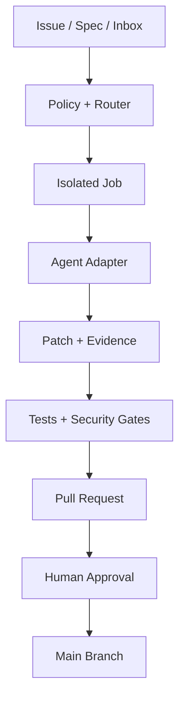

# Personal Engineering Knowledge Compiler — SDD 總綱

狀態：Execution-ready v0.2

目標環境：Hetzner 高配 VPS、GitHub Private Repository、GitHub Actions

核心方法：Spec-Driven Development（先規格、再任務、後實作）

## 1. 願景

建立一套可重複、可審計、可更換模型的軟體與知識生產流水線：

1. 使用者以 Issue、規格文件或 CLI 提交工作。
2. Orchestrator 依任務風險、成本與能力選擇 agent/model。
3. Agent 在隔離工作目錄完成 plan、patch、測試與報告。
4. 所有變更只透過 branch + Pull Request 進入主線。
5. PDF、圖片與舊文件先經本地抽取，再由 AI 轉成資訊、主題知識、pattern、principle 與電子書視圖。

本系統不是「讓多個 AI 同時亂改 repo」，而是可治理的工作流：



## 2. 系統邊界

### In scope

- GitHub Issue/label/workflow dispatch 觸發任務。
- Hetzner VPS 上的 self-hosted runner 與隔離 job container。
- Codex、Cursor Agent、Claude Code、Grok/xAI、OpenCode 的統一 adapter。
- 路由、重試、預算、審核、測試、安全掃描、可觀測性。
- Knowledge Refinery：PDF/圖片抽取、分類、關聯、知識合成、電子書生成。
- SDD 文件、ADR、runbook、task contract 與 `AGENTS.md`。

### Out of scope（第一版）

- 無人工核准的 production deploy。
- Agent 直接 push 到 `main`。
- 任意 public-repo PR 在高權限 runner 執行。
- 多 agent 同時修改同一 worktree。
- 自動發布含前公司機密、個資或憑證的原始資料。
- 一開始就導入 Kubernetes、複雜 message broker 或完整 knowledge graph database。

## 3. 核心原則

1. **Spec is source of intent**：功能先有 `spec.md`、驗收條件及風險等級。
2. **Git is source of truth**：程式、知識 IR、決策與 provenance 都版本化。
3. **AI proposes, deterministic gates decide**：AI 產生候選 patch；schema、測試、政策與人類決定是否接受。
4. **Model aliases, not hard-coded names**：以 `planner_strong`、`builder_fast` 等 alias 路由；實際 provider/model 可替換。
5. **Least privilege**：每個 job 只取得完成任務所需的短期權限。
6. **One writer per branch/worktree**：平行 agent 使用獨立 branch/worktree；整合由 reviewer 完成。
7. **Evidence before conclusion**：PR 必須包含測試、風險、來源與未解問題。
8. **Incremental processing**：內容以 hash/cache 避免重複 OCR、embedding 與 LLM 成本。
9. **Raw ≠ publishable**：原件、抽取資訊、知識與出版物是不同信任層級。

## 4. 建議技術組合

| 能力 | MVP | 後續可升級 |
|---|---|---|
| 控制平面 | GitHub Issues/PR/Actions | GitHub App + webhook service |
| 執行器 | Repo-scoped self-hosted runner | Ephemeral runner/runner scale set |
| 隔離 | rootless Podman 或 Docker container | MicroVM/gVisor |
| 任務佇列 | GitHub Actions concurrency | PostgreSQL/Redis queue |
| Orchestrator | Python CLI + YAML policy | Temporal/Prefect/Dagster |
| Agent 介面 | shell adapter + JSON result contract | SDK-native adapters |
| 原始大檔 | S3-compatible object storage/NAS | versioned object store |
| 知識與索引 | Git Markdown + SQLite FTS/BM25 | pgvector/Qdrant only when needed |
| Secrets | GitHub Environment Secrets + VPS secret files | Vault/SOPS + OIDC |
| Observability | JSONL logs + GitHub job summary | OpenTelemetry + Grafana/Loki |

## 5. 邏輯元件

- **Trigger**：Issue label、manual dispatch、scheduled synthesis、inbox ingest。
- **Spec Validator**：驗證 spec front matter、acceptance criteria、risk、budget。
- **Policy Engine**：判斷允許的 tools、網路、寫入範圍、approval gate。
- **Router**：把角色 alias 映射到 provider/model/agent CLI。
- **Workspace Manager**：建立隔離 worktree/container、鎖定 branch。
- **Agent Adapter**：把統一 Task Contract 轉換成各 CLI/SDK 輸入。
- **Gate Runner**：lint、unit/integration tests、secret/license/SAST scan。
- **PR Publisher**：只提交允許路徑，生成 PR 與 evidence report。
- **Knowledge Compiler**：raw → extraction → information → knowledge → publication。
- **Ledger**：保存 task id、prompt hash、model alias、成本、輸出與 commit SHA。

## 6. Model/Agent 路由策略

下列是角色，而非保證存在的具體型號：

| Alias | 任務 | 建議候選 |
|---|---|---|
| `architect_rare` | 方向、疑難、ADR、重大 trade-off | Claude 高能力模型；額度嚴格限制 |
| `planner_strong` | spec 拆解、跨模組設計 | Codex/Cursor Agent 的強模型 |
| `builder_primary` | repo-aware 實作與測試 | Codex 或 Cursor Agent |
| `builder_economy` | 機械性修改、測試補齊、分類 | OpenCode + 可用的低成本模型 |
| `critic_independent` | 找漏洞、反例、review | 與 builder 不同 provider 的 Grok/Claude/Codex |
| `vision_extract` | 難以 OCR 的圖與架構圖 | 具 vision 能力的模型 |

`Claude fable`、`Grok 4.6 Heavy`、`DeepSeek v4 Flash` 應先視為使用者期望的 alias。落地前由 `doctor` 命令查詢各 CLI/provider 實際暴露的 model ID；不可把未驗證名稱寫死在 workflow。

## 7. Repository 佈局

```text
repo/
├── AGENTS.md
├── README.md
├── specs/
│   ├── active/<feature>/spec.md
│   ├── active/<feature>/plan.md
│   ├── active/<feature>/tasks.md
│   └── archive/
├── docs/
│   ├── sdd/
│   ├── adr/
│   └── runbooks/
├── orchestration/
│   ├── adapters/
│   ├── policies/
│   ├── prompts/
│   └── schemas/
├── knowledge/
│   ├── 00-inbox/
│   ├── 20-extracted/
│   ├── 30-information/
│   ├── 40-knowledge/
│   ├── 50-patterns/
│   ├── 60-principles/
│   └── 70-publications/
├── scripts/
├── tests/
└── .github/workflows/
```

## 8. 完成定義

MVP 完成必須滿足：

- 一個 Issue 能產生已驗證的 spec branch/PR。
- 至少兩個不同 agent adapter 可執行同一 Task Contract。
- Runner job 被隔離，無 host root、無永久 GitHub/API token。
- Agent 無法直接更新 main 或改 workflow/security policy。
- PR 自動附上測試、掃描、成本、來源與 model alias。
- 同一輸入重跑具冪等性；失敗可安全重試。
- 一份文字 PDF 與一份掃描文件可走完整 knowledge pipeline。
- 電子書輸出能從知識來源重新生成，而非複製貼上。

## 9. 文件索引

- `01-ARCHITECTURE.md`：控制面、執行面與安全邊界。
- `02-SDD-WORKFLOW.md`：spec/plan/task/verification 契約。
- `03-MULTI-AGENT-ORCHESTRATION.md`：adapter、router、協作模式。
- `04-KNOWLEDGE-REFINERY.md`：文件到知識與電子書流水線。
- `05-IMPLEMENTATION-PHASES.md`：各階段 deliverables 與驗收。
- `06-SECURITY-OPERATIONS.md`：威脅模型、secret、runner 與維運。
- `07-END-TO-END-EXECUTION.md`：從初始化 repo 到最終 PR 的連續執行與 GitHub checkpoint 契約。
- `08-MASTER-BUILD-PROMPT.md`：可直接啟動完整開發流程的 orchestrator prompt。
- `AGENTS.md`：所有 coding agent 的共同工程規則。
