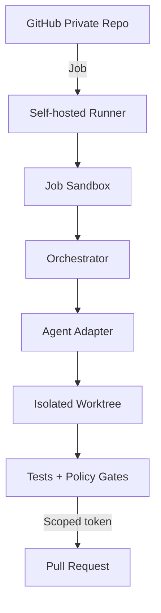
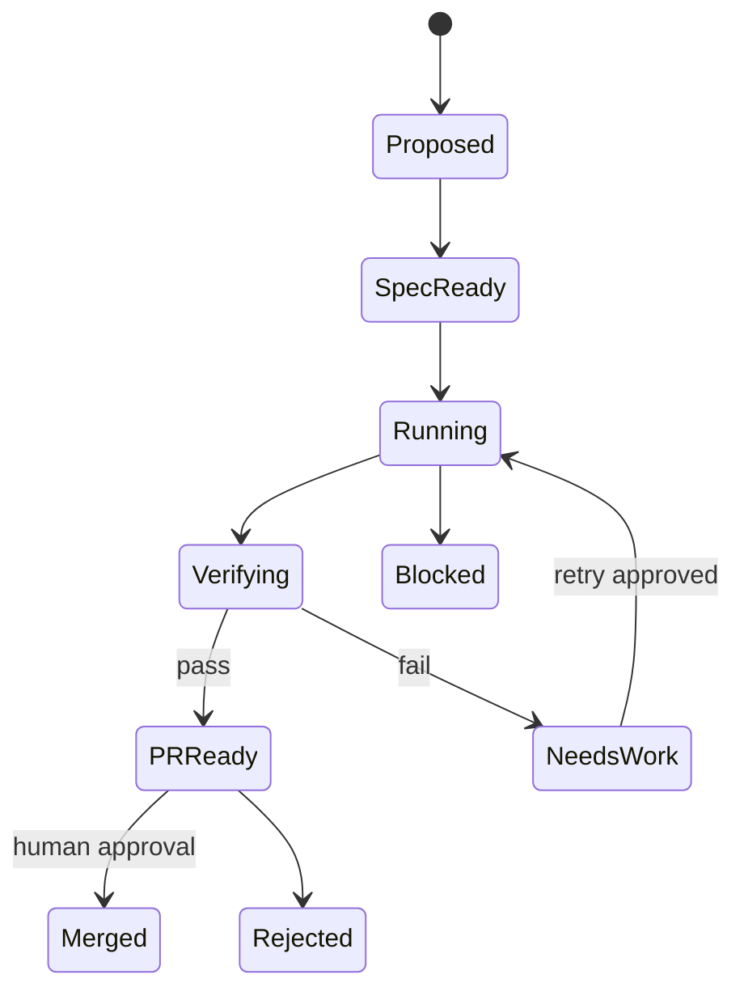

# Architecture

## 1. Deployment model

GitHub 負責意圖、版本、審核與狀態；VPS 負責可信但受隔離的執行。不要讓 GitHub Actions runner 與其他長期服務共用高權限 host context。

推薦先使用單機、repo-scoped runner；每個 job 啟動 disposable container 與新 worktree。Runner service account 不加入 `docker` root-equivalent 群組；若使用 Docker socket，視為 host root 權限並另做風險隔離。優先考慮 rootless Podman。

## 2. Trust zones

| Zone | 內容 | 允許 |
|---|---|---|
| Z0 Control | GitHub settings、branch protection、environment approval | 人工管理 |
| Z1 Runner host | runner binary、sandbox launcher、cache | 僅維運帳號修改 |
| Z2 Job sandbox | checkout、agents、tests | 暫時性寫入、受限網路 |
| Z3 Artifact | logs、patch、reports | 不得包含 secrets/raw sensitive data |
| Z4 Production | deployment credentials/runtime | MVP 不由 coding agent 直接存取 |

## 3. Control flow

1. Issue 必須套用 `agent:ready` 且引用 spec。
2. Workflow 讀取 spec，驗證 schema 與風險級別。
3. Policy Engine 產出 effective permissions。
4. Router 選擇 agent alias，建立 job sandbox。
5. Agent 只能產生 patch 與 evidence；不能自行擴權。
6. Gate Runner 執行 deterministic checks。
7. PR Publisher 使用最小權限 token 建 branch/PR。
8. CODEOWNERS/required reviewers 核准後才可 merge。

## 4. Task state machine

## 5. Persistence

- Git：規格、程式、Markdown 知識、schema、ADR、small reports。
- Object storage/NAS：大型或敏感 raw PDF/image；Git 只存 immutable URI、hash、classification。
- SQLite/PostgreSQL：任務 ledger、usage、cache index。MVP 用 SQLite WAL 並定期備份即可。
- GitHub Actions artifacts：短期測試報告；不得作唯一長期保存。

## 6. Availability and recovery

- Runner 可被刪除重建；bootstrap 以 Ansible 或 idempotent shell 管理。
- 每個 task 由 `task_id + input_commit + spec_hash` 唯一識別。
- Agent output 先落在 worktree；只有 gate pass 才提交。
- SQLite ledger 與配置每日備份；raw object store 開 versioning/lifecycle。
- 支援 `resume`，但不得重用過期 secret；重新取得短期 credential。

