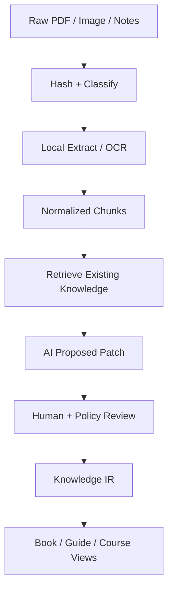

# Knowledge Refinery / Knowledge Compiler

## 1. Pipeline



## 2. Data layers

| Layer | Purpose | LLM required |
|---|---|---|
| Raw | immutable source and hash | no |
| Extracted | text/OCR/layout/metadata | usually no |
| Information | facts, incidents, decisions, evidence | small/medium |
| Knowledge | concepts with explanation and links | yes |
| Pattern | cross-domain reusable solution/trade-off | strong synthesis |
| Principle | higher abstraction/mental model | strong + human review |
| Publication | linear view over knowledge graph | yes, generated |

## 3. Ingestion algorithm

1. Copy input into quarantine; calculate SHA-256 and MIME by content.
2. Deduplicate by hash; never rely only on filename.
3. Malware/secret/PII/confidential scan; restricted files stop before cloud AI.
4. PDF with text layer uses local extraction; scanned pages use OCR.
5. Images use OCR-first; vision only for diagrams, tables, UI context or low-confidence OCR.
6. Normalize text while preserving page/region provenance.
7. Chunk semantically and create local FTS/BM25 index; embeddings optional.
8. Retrieve existing taxonomy/notes before AI proposes destination or merge.
9. Validate front matter, links, taxonomy and provenance.
10. Create a knowledge PR; human approves sensitive or high-level synthesis.

## 4. Storage layout

```text
knowledge/
├── 00-inbox/              # untrusted queue, normally gitignored
├── 10-source-manifests/   # hashes and object-store pointers
├── 20-extracted/          # normalized text, optionally private
├── 30-information/        # facts/experience/incidents
├── 40-knowledge/          # concepts and systems
├── 50-patterns/           # reusable comparisons
├── 60-principles/         # abstractions
├── 70-publications/       # book manifests/generated output
└── 90-meta/               # taxonomy, relations, processing state
```

大型 originals 不直接進一般 Git history。若必須由 Git 管理，先評估 Git LFS、配額、clone 成本及資料權利；預設放 versioned S3-compatible storage，Git 只保存 manifest。

## 5. Knowledge note schema

```yaml
---
id: knowledge-distributed-budget-control
type: knowledge
title: Distributed Budget Control
domains: [ads, distributed-systems]
concepts: [counter, consistency, idempotency]
sources:
  - id: source-2018-001
    pages: [12, 13, 14]
maturity: M3
confidence: medium
data_class: confidential-derived
reviewed_by: human
---
```

正文模板：Context、Observed production behavior、Constraints、Decision、Failure modes、Trade-offs、Generalized pattern、Counterexamples、Related concepts、Source evidence。

## 6. Taxonomy governance

- `taxonomy.yaml` 是允許分類的 canonical list。
- AI 只能提出 `existing destination` 或 `taxonomy proposal`。
- 新分類需 ADR 或人工批准；避免 cache/caching/redis 等漂移。
- relation 使用 typed edges：`depends_on`、`implements`、`contrasts_with`、`example_of`、`derived_from`。
- 每個 conclusion 必須可回溯 source/page/chunk；沒有證據的內容標示 hypothesis。

## 7. Publication as generated view

電子書不是 source of truth。每本書保存 manifest：

```yaml
title: System Design from Production Experience
chapters:
  - source: knowledge/60-principles/minimize-coordination.md
  - source: knowledge/50-patterns/distributed-counter.md
  - source: knowledge/40-knowledge/ads/budget-control.md
```

Build 生成 Markdown/HTML/EPUB/PDF，並記錄來源 commit SHA。手工改動應回寫 knowledge source 或 publication override，不直接改 generated file。

## 8. Privacy gate

過去工作的積累可能包含前雇主 IP、客戶資料、合約、內網地址與 secret。Private repo 不等於有合法上傳權。分類為 restricted 的內容只允許本地處理；AI 輸入先 redact，publication 必須經人工 rights review。

