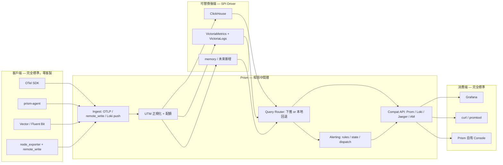

# Prism — SDD 總綱

狀態：Draft v0.1

目標環境：單台至少數台 Linux VPS（基準機型 2 vCPU / 4 GB RAM / 80 GB SSD）

核心方法：Spec-Driven Development（先規格、再任務、後實作）

## 1. 願景

建立一個**自己掌控、但不重造輪子**的可觀測性平台：

1. 業務服務用標準 OTel SDK 上報，不需要為 Prism 寫任何客製程式碼。
2. 主機、容器、日誌檔由 `prism-agent`（或使用者既有的 Vector / otelcol / node_exporter）採集。
3. 所有資料經 Prism 的 Ingest 層正規化成統一遙測模型（UTM），寫入可插拔的存儲後端。
4. Grafana 把 Prism 當成 Prometheus / Loki / Jaeger 三個 datasource 直接使用，開箱可視化。
5. 告警規則用 Prometheus rule YAML 撰寫，路由用 Alertmanager 語義，可從既有系統原樣搬過來。
6. 底層存儲隨時可換：ClickHouse ↔ VictoriaMetrics+VictoriaLogs ↔ 其他，對上層零感知。

這不是「再寫一個 Datadog」，而是一層**可治理的相容中間層**：

## 2. 系統邊界

### In scope（v1）

- OTLP（gRPC + HTTP）接收 metrics / logs / traces。
- Prometheus `remote_write` 接收、Loki push API 接收。
- Prometheus HTTP API v1（instant / range / series / labels / metadata / rules / alerts）對外服務。
- Loki HTTP API v1 子集（query_range / labels / label values / tail）對外服務。
- Jaeger Query API（services / operations / traces / trace by id / dependencies）對外服務。
- Alertmanager API v2 子集（alerts / silences / status）對外服務。
- 告警規則引擎：Prometheus rule YAML 相容，含 `for`、labels、annotations 模板。
- 告警分發：分組、抑制、靜默、重複間隔、多渠道通知、投遞審計與重試。
- 存儲 SPI + 三個參考驅動：`memory`、`clickhouse`、`vmvl`。
- APM 語義：service 列表、RED 指標（預聚合）、慢請求下鑽、trace ↔ log 雙向跳轉、服務依賴圖。
- `prism-agent`：主機指標、檔案日誌、systemd journal、容器日誌、本地 WAL、遠端配置。
- 控制平面：租戶、使用者、API key、主機納管、規則管理、通知渠道、審計日誌。
- 一致性測試套件：驅動級 + 協議級，CI 對所有驅動跑同一份測試。

### Out of scope（v1 明確不做）

- 自研時序資料庫、自研倒排索引、自研列式存儲。
- 自研 PromQL 引擎（直接使用 Apache-2.0 的 `prometheus/promql`）。
- 自有前端 Console 的完整儀表板編輯器（v1 用 Grafana，Console 只做控制平面 CRUD）。
- Continuous profiling、RUM、Session replay、合成撥測。
- 異常檢測 / ML / 自動根因分析。
- Kubernetes operator、水平分片存儲、跨區複製。
- eBPF 自動插樁。

以上全部推遲，但架構不得阻擋它們（見 §3 原則 8）。

### 非目標（永遠不做）

- 不做 Grafana 的替代品。可視化生態不是我們的戰場。
- 不發明新的查詢語言。任何「Prism 專屬 DSL」的提案都必須被拒絕。

## 3. 核心原則

1. **協議即契約**：對外只暴露既有事實標準協議。新增能力若無對應標準協議，優先擴充控制平面 API，而非污染相容 API。
2. **中間層薄，驅動厚**：業務語義（告警狀態機、租戶、配額、關聯）在中間層；效能與存儲細節在驅動。
3. **能力協商而非假設**：驅動宣告自己支援什麼；中間層依宣告決定下推或本地回退。宣告了就必須真的支援（由一致性測試強制）。
4. **不可下推必可回退**：任何查詢在最弱的驅動（只支援 Tier-1 原語）上都必須能算出正確結果，只是慢。功能不得因驅動而缺失。
5. **正確優先於快**：回退路徑先做對，再談下推優化。下推與回退必須產生同一結果（由 differential test 強制）。
6. **授權潔淨**：核心與驅動只依賴 Apache-2.0 / MIT / BSD / MPL-2.0。AGPL 專案只能以獨立行程、透過網路協議使用，絕不 import 其原始碼。
7. **單機優先**：預設形態是一個 `prismd` 行程 + 一個存儲後端，跑在 2C4G VPS 上。分散式是選項，不是前提。
8. **今天不做，但留口子**：v1 不實作的能力，其擴充點（介面、欄位、路由前綴）必須在 v1 就定義好。
9. **監控系統不能拖垮被監控主機**：Agent 有硬性資源上限；平台有寫入配額與基數保護；磁碟水位有熔斷。
10. **自己必須被監控**：`prismd` 與 `prism-agent` 暴露自身指標，且存在不依賴 Prism 自身的外部看門狗。

## 4. 開源選型與授權分析

實作時**只能**依賴下表「可 import」欄位為 ✅ 的專案原始碼。標 ❌ 者僅可作為獨立行程經網路協議互動，或作為協議相容性的參考規格。

| 專案 | 授權 | 可 import | Prism 的用法 |
|---|---|---|---|
| `open-telemetry/opentelemetry-collector` (pdata) | Apache-2.0 | ✅ | OTLP 型別與 unmarshal |
| `open-telemetry/opentelemetry-proto` | Apache-2.0 | ✅ | OTLP protobuf 定義 |
| `prometheus/prometheus` (`promql`, `model/labels`, `storage`, `tsdb/chunkenc`) | Apache-2.0 | ✅ | **PromQL 回退引擎**、label 型別、`storage.Queryable` 介面 |
| `prometheus/alertmanager` (`pkg/labels`, `silence`, `inhibit`, `dispatch`) | Apache-2.0 | ✅ | 告警分組/抑制/靜默的實作參考，可直接複用 |
| `prometheus/common` (model, config) | Apache-2.0 | ✅ | 通用型別 |
| `jaegertracing/jaeger-idl` | Apache-2.0 | ✅ | Jaeger Query API 的回應結構 |
| `ClickHouse/clickhouse-go` | Apache-2.0 | ✅ | ClickHouse 驅動 |
| `VictoriaMetrics` / `VictoriaLogs` | Apache-2.0 | ✅（但不需要） | 以 HTTP 協議使用即可 |
| `vectordotdev/vector` | MPL-2.0 | ⚠️ 不 import | 作為可替換採集器，獨立行程 |
| `grafana/loki` (`logql`, `chunkenc`) | **AGPL-3.0** | ❌ | **禁止 import**。LogQL 子集自行實作；Loki 僅作協議規格參考 |
| `grafana/tempo` | AGPL-3.0 | ❌ | 不使用 |
| `grafana/grafana` | AGPL-3.0 | ❌ | 獨立行程使用，Prism 不嵌入、不修改、不再發佈 |
| `SigNoz/signoz` | 混合（社群版與 `ee/` 授權不同，且歷史上變動過） | ❌ | 僅作功能對標參考；商業化前不得複用其程式碼 |
| `openobserve/openobserve` | AGPL-3.0 | ❌ | 僅作參考 |
| `perses/perses` | Apache-2.0 | ✅ | 未來自有 Console 的圖表元件來源 |

**關鍵風險提示（必須寫進專案 README）**：Loki 的 LogQL 引擎是 AGPL-3.0。Prism 提供 Loki 相容 API 是合法的（協議不受著作權保護），但**實作必須是乾淨室（clean-room）的**：只依據 Loki 的公開 HTTP API 文件與回應格式撰寫，不得閱讀後照抄其 `logql` 套件原始碼。Phase 0 必須產出一份 clean-room 聲明並記錄於 `13-ADR.md`。

## 5. 技術組合

| 能力 | v1 選擇 | 後續可升級 |
|---|---|---|
| 語言 | Go 1.23+ | — |
| 服務端 | 單一 `prismd` binary，`--mode` 決定啟用的角色 | 拆成 ingest / query / ruler / console 多行程 |
| 預設存儲驅動 | ClickHouse 24.x 單節點 | ClickHouse cluster / 分層冷存 S3 |
| 備選存儲驅動 | VictoriaMetrics single + VictoriaLogs single | — |
| 測試存儲驅動 | `memory`（純記憶體，供單元測試與 conformance） | — |
| 控制平面元資料 | PostgreSQL 16 | — |
| 佇列 | 行程內 bounded channel + 本地 WAL | NATS JetStream / Kafka（Phase 6+） |
| 可視化 | Grafana OSS（獨立部署） | 自有 Console + Perses 圖表 |
| PromQL | `prometheus/promql` 引擎 | 加下推優化 |
| LogQL | 自研子集 parser（clean-room） | 擴充語法覆蓋 |
| 配置 | YAML 檔 + 環境變數覆寫 | 控制平面熱更新 |
| 認證 | API key（寫入）+ JWT（Console）+ mTLS（Agent，選配） | OIDC |
| 部署 | docker-compose / systemd | — |

## 6. 邏輯元件

- **Compat Receivers**：OTLP gRPC/HTTP、Prometheus remote_write、Loki push。把外部協議解成 UTM。
- **Normalizer**：資源屬性抽取、語義約定映射、時間單位統一、欄位裁切。
- **Limiter**：租戶級速率、活躍序列數、標籤基數、單體大小限制。
- **Writer**：批次聚合、非同步寫入、重試、背壓與丟棄策略。
- **Storage SPI + Drivers**：可插拔後端，能力宣告 + Tier-1 原語 + Tier-2 下推。
- **Query Router**：解析請求 → 決定下推或回退 → 執行 → 統一回應格式。
- **PromQL Fallback Engine**：`prometheus/promql` + SPI 適配器。
- **LogQL Subset Engine**：自研 parser → `LogQuery` IR → 下推或本地執行。
- **Ruler**：規則載入、週期評估、告警狀態機、`ALERTS` 序列回寫。
- **Dispatcher**：分組、抑制、靜默、去重、重複間隔。
- **Notifier SPI**：webhook / SMTP / Telegram / Lark / DingTalk / Slack。
- **APM Aggregator**：span → RED 預聚合、服務依賴圖、慢請求 top-N。
- **Control Plane**：租戶、身分、主機納管、規則 CRUD、配置下發、審計。
- **Self Telemetry**：`prismd` 與 `prism-agent` 自身指標與健康檢查。

## 7. 成功判準

v1 完成的定義（缺一不可）：

1. 一台 2C4G VPS 上，`docker compose up` 後 5 分鐘內能看到自己的主機指標與日誌。
2. Grafana 新增三個標準 datasource（Prometheus / Loki / Jaeger），URL 指向同一個 `prismd`，全部 health check 通過，儀表板可用。
3. 一份從既有 Prometheus 專案原樣複製的 rule YAML 能被載入並正確觸發、恢復、通知。
4. 把 `storage.driver` 從 `clickhouse` 改成 `vmvl` 並重啟，**所有相容 API 的行為不變**，一致性測試全綠。
5. 一個用標準 OTel SDK 插樁的示範服務，能在 Prism 看到服務列表、RED 曲線、trace 瀑布圖，並從 trace 一鍵跳到同 `trace_id` 的日誌。
6. 殺掉存儲後端 10 分鐘再拉起，Agent 的 WAL 回補資料，無資料遺失（僅延遲）。
