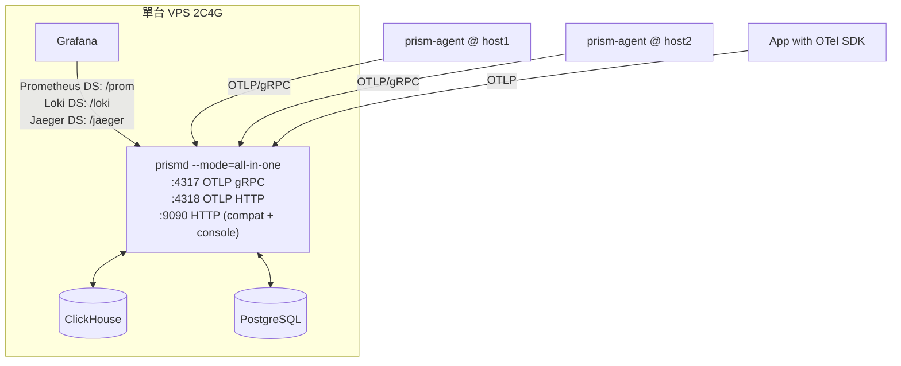
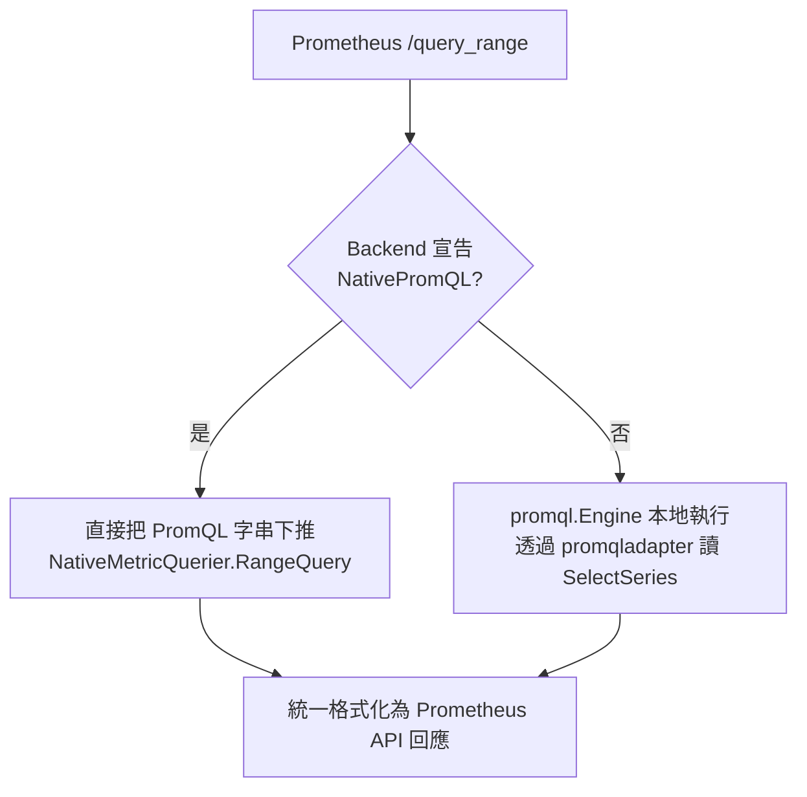

# 01 — 架構

## 1. 分層

嚴格四層，依賴方向單向向下，禁止反向引用。

```
┌──────────────────────────────────────────────────────────────┐
│ L4 相容協議層 (internal/compat)                              │
│    北向：Prometheus API / Loki API / Jaeger API / AM API      │
│    南向：OTLP receiver / remote_write / Loki push             │
│    職責：協議編解碼。不含任何業務邏輯。                        │
├──────────────────────────────────────────────────────────────┤
│ L3 業務語義層 (internal/{ingest,query,alerting,apm,           │
│                          controlplane})                       │
│    職責：正規化、配額、下推決策、告警狀態機、租戶、關聯        │
│    只認識 UTM 與 SPI，不認識任何具體協議或存儲                 │
├──────────────────────────────────────────────────────────────┤
│ L2 抽象層 (pkg/utm, pkg/spi)          ★ 隔離層 / 穩定契約     │
│    UTM：統一遙測模型                                          │
│    SPI：Driver / Backend / *Store / Capabilities              │
│    無外部依賴（除 stdlib 與 prometheus/model/labels）          │
├──────────────────────────────────────────────────────────────┤
│ L1 驅動層 (drivers/*)                                         │
│    memory / clickhouse / vmvl / …                             │
│    只實作 SPI，不 import internal/ 下任何套件                 │
└──────────────────────────────────────────────────────────────┘
```

**依賴規則（CI 強制檢查，見 `10-CONFORMANCE-TESTING.md` §5）**

- `pkg/**` 不得 import `internal/**` 或 `drivers/**`。
- `drivers/**` 不得 import `internal/**`，也不得互相 import。
- `internal/compat/**` 不得 import `drivers/**`。
- `internal/**` 取得後端的唯一途徑是 `spi.Backend` 介面。

這條規則就是「可換底層」的物理保證。任何違反都是設計退化，不是實作細節。

## 2. 為什麼是這個切法

| 類比 | 對應 |
|---|---|
| MySQL wire protocol | 北向相容 API（Prom / Loki / Jaeger） |
| JDBC / `database/sql` driver | `pkg/spi` 的 `Driver` / `Backend` |
| `driver.Queryer` 等可選介面的型別斷言 | Tier-2 下推介面的型別斷言 |
| Trino connector 的 pushdown + coordinator 補算 | 下推判定 + PromQL/LogQL 本地回退引擎 |
| SQL standard vs 方言 | UTM/`LogQuery` IR vs LogSQL / SQL / MetricsQL |

`database/sql` 的設計精髓是：**核心介面極小且必選，能力擴充用可選介面 + 型別斷言**。Prism 完全照抄這個模式，因為它已被證明能容納從 SQLite 到分散式資料庫的全部差異。

## 3. 程序拓撲

### 3.1 v1 預設：All-in-one



### 3.2 未來：分角色（v1 只需保證可拆，不需實作）

`--mode` 可取 `all-in-one`（預設）、`ingest`、`query`、`ruler`、`console`。同一 binary，靠旗標決定啟用哪些 HTTP 路由與背景 goroutine。v1 必須讓 `--mode` 已存在且各角色的啟動函式已分離，即使部署上永遠只用 `all-in-one`。

## 4. 埠與路由總表

單一 HTTP server（預設 `:9090`）掛載全部路由。前綴不得衝突。

| 前綴 | 協議 | 角色 | Grafana datasource 設定 |
|---|---|---|---|
| `/v1/traces`, `/v1/logs`, `/v1/metrics` | OTLP/HTTP（規範強制在根路徑） | ingest | — |
| `/prom/api/v1/*` | Prometheus HTTP API v1 | query | Prometheus type，URL = `http://prismd:9090/prom` |
| `/prom/api/v1/write` | remote_write 接收 | ingest | 客戶端 remote_write URL |
| `/prom/api/v1/read` | remote_read 回應 | query | — |
| `/loki/api/v1/*` | Loki HTTP API | ingest + query | Loki type，URL = `http://prismd:9090` |
| `/jaeger/api/*` | Jaeger Query API | query | Jaeger type，URL = `http://prismd:9090/jaeger` |
| `/alertmanager/api/v2/*` | Alertmanager API v2 | ruler | Alertmanager type |
| `/api/console/v1/*` | Prism 自有控制平面 REST | console | — |
| `/metrics` | Prism 自身指標（Prometheus 格式） | 全部 | — |
| `/-/healthy`, `/-/ready` | 健康檢查 | 全部 | — |

gRPC 另起 `:4317`（OTLP gRPC）。

**路由前綴決策理由**：Prometheus datasource 會把 `/api/v1/query` 接在 base URL 後面，因此 base URL 必須是 `/prom`；Loki datasource 固定用 `/loki/api/v1/...` 全路徑，因此 base URL 是根。自有 API 因此不能佔用 `/api/v1`，改用 `/api/console/v1`。

## 5. Go 模組樹

```
prism/
├── go.mod                          # module github.com/OWNER/prism
├── cmd/
│   ├── prismd/main.go
│   ├── prism-agent/main.go
│   └── prismctl/main.go
├── pkg/                            # ★ 公開穩定契約，語意化版本
│   ├── utm/                        # 統一遙測模型
│   │   ├── resource.go  metric.go  log.go  span.go
│   │   ├── labels.go               # 對 prometheus/model/labels 的薄封裝
│   │   └── time.go                 # 時間單位常數與轉換（唯一權威）
│   └── spi/
│       ├── driver.go               # Driver / Backend / Register
│       ├── capabilities.go
│       ├── metric_store.go  log_store.go  trace_store.go
│       ├── query_ir.go             # LogQuery / TraceQuery / SeriesQuery
│       ├── iterator.go             # SeriesSet / LogIterator / SpanIterator
│       ├── errors.go               # 錯誤分類
│       └── conformance/            # ★ 驅動一致性測試套件（可被外部驅動引用）
│           ├── suite.go  metrics.go  logs.go  traces.go  fixtures.go
├── drivers/
│   ├── memory/
│   ├── clickhouse/
│   │   ├── driver.go  schema.go  write_*.go  query_*.go  migrations/
│   └── vmvl/
├── internal/
│   ├── config/                     # YAML + env 載入與驗證
│   ├── server/                     # HTTP/gRPC server、路由掛載、middleware
│   ├── compat/
│   │   ├── otlp/                   # receiver：gRPC + HTTP
│   │   ├── promapi/                # 北向 API + remote_write/read
│   │   ├── lokiapi/
│   │   ├── jaegerapi/
│   │   └── amapi/
│   ├── ingest/
│   │   ├── normalize/  limits/  batcher/  pipeline.go
│   ├── query/
│   │   ├── router.go               # 下推 or 回退決策
│   │   ├── promqladapter/          # spi.SeriesSet -> storage.Queryable
│   │   ├── logql/                  # clean-room parser -> spi.LogQuery
│   │   └── tracequery/
│   ├── alerting/
│   │   ├── rules/  eval/  state/  dispatch/  silence/  inhibit/  notify/
│   ├── apm/                        # RED 聚合、service map
│   ├── controlplane/
│   │   ├── api/  store/  authn/  authz/  tenancy/  migrations/
│   ├── agentproto/                 # Agent 註冊/心跳/配置下發
│   └── telemetry/                  # 自監控
├── deploy/
│   ├── docker-compose.yml  systemd/  grafana/provisioning/
├── test/
│   ├── e2e/  fixtures/  promqltest/
└── docs/                           # 本 SDD 的副本 + ADR
```

## 6. 主要資料流

### 6.1 寫入

```
外部協議 → compat receiver → utm.* 物件
  → normalize（資源屬性、語義約定、時間單位）
  → limits（租戶配額、基數、大小）
  → batcher（按 signal + tenant 聚批，達 N 筆或 T 毫秒 flush）
  → spi.Backend.Metrics()/Logs()/Traces().Write()
```

背壓：batcher 佇列滿 → receiver 回 `429`（HTTP）/ `RESOURCE_EXHAUSTED`（gRPC），並遞增 `prism_ingest_rejected_total{reason="queue_full"}`。**絕不無界緩衝。**

### 6.2 查詢（下推 vs 回退）



日誌與追蹤走結構化 IR 而非字串下推（理由見 `13-ADR.md` ADR-004）：

```
LogQL 字串 → 自研 parser → spi.LogQuery(IR)
  → 若 Backend 實作 NativeLogQuerier：整個 IR 下推
  → 否則：把 IR 中可下推的部分（時間、標籤選擇器、簡單子串）交給 SearchLogs，
          剩餘（正則、解析階段、聚合）在中間層以串流方式執行
```

### 6.3 告警

```
Ruler 每 interval →（走 §6.2 同一條查詢路徑）
  → 評估結果 → 告警狀態機 → 內部 Alert 事件
  → Dispatcher（靜默 → 抑制 → 分組 → 去重）
  → Notifier（持久化投遞佇列 → 送出 → 重試 → 審計）
同時：ALERTS / ALERTS_FOR_STATE 序列回寫存儲（Prometheus 語義）
```

## 7. 錯誤與可觀測性約定

- 所有 SPI 錯誤必須被歸類為 `spi.ErrClass`（見 `03-STORAGE-SPI.md` §7），中間層依分類決定重試、降級或回錯。
- 每個模組必須發出下列自身指標（名稱固定，供內建告警規則使用）：
  - `prism_ingest_received_total{signal,tenant,protocol}`
  - `prism_ingest_rejected_total{signal,tenant,reason}`
  - `prism_storage_write_duration_seconds{driver,signal}`
  - `prism_storage_query_duration_seconds{driver,signal,path="pushdown|fallback"}`
  - `prism_query_fallback_total{signal,reason}`
  - `prism_rule_eval_duration_seconds{group}` / `prism_rule_eval_failures_total{group}`
  - `prism_notification_sent_total{channel,status}` / `prism_notification_queue_depth`
- 所有 HTTP handler 記錄結構化日誌：`tenant`、`path`、`status`、`duration_ms`、`bytes`、`driver_path`。
- 日誌與指標中禁止出現 API key、密碼、完整 Authorization header。
