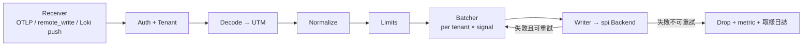

# 05 — Ingest Pipeline

套件：`internal/ingest`。目標：把任意南向協議轉成 UTM 並可靠寫入驅動，且**在任何過載情況下都不拖垮自己或後端**。

## 1. 流水線



每一步的介面統一為：

```go
package ingest

type Stage[T any] interface {
    Process(ctx context.Context, tenant string, items []T) ([]T, error)
}
```

流水線用泛型串接三份實例（`MetricPoint` / `LogRecord` / `Span`），避免三套重複程式碼。

## 2. Receiver

| Receiver | 位置 | 併發模型 |
|---|---|---|
| OTLP gRPC | `internal/compat/otlp/grpc.go` | grpc-go 預設 goroutine per stream，加 `grpc.MaxConcurrentStreams` |
| OTLP HTTP | `internal/compat/otlp/http.go` | net/http |
| remote_write | `internal/compat/promapi/write.go` | net/http |
| Loki push | `internal/compat/lokiapi/push.go` | net/http |

共同要求：

- 請求體大小上限 `ingest.max_request_bytes`（預設 16 MiB），超出回 `413`。
- 支援 gzip、snappy（remote_write 強制）、zstd（選配）。
- 解碼使用物件池（`sync.Pool`）重用 slice，減少 GC 壓力。
- **解碼錯誤不得 panic**：任何 malformed payload 回 `400` 並記錄取樣日誌（每租戶每分鐘最多 10 條）。
- 每個 receiver 在 `defer` 中把佔用的緩衝歸還池。

## 3. Auth 與租戶

`internal/server/middleware/auth.go`：

1. 解析 `Authorization: Bearer <key>`。key 以 `sha256` 存於 Postgres `api_keys`，記憶體 LRU 快取（TTL 60s，容量 10k）。
2. 檢查 key 的 scope 是否含 `write:metrics` / `write:logs` / `write:traces`。
3. 租戶解析依 `02-COMPATIBILITY-CONTRACT.md` §0.1。
4. 若 key 綁定租戶且 header 指定了不同租戶 → `403`（防跨租戶寫入）。
5. 結果放入 `context`：`ingest.TenantFromContext(ctx)`。

## 4. Normalize

見 `04-DATA-MODEL.md` §4。額外要求：

- 正規化必須是**純函數且冪等**：同一輸入永遠得到同一輸出（delta→cumulative 轉換除外，該狀態機獨立成 `normalize/deltaconv`）。
- 正規化過程中的每一次「修改使用者資料」都要遞增對應指標：`prism_ingest_normalized_total{action="truncate|rename|drop|clamp"}`。使用者必須能看見平台動了他的資料。

### 4.1 delta→cumulative 轉換器

```go
type DeltaConverter struct {
    // key = fingerprint(labels + metric)
    // value = 累計值 + 最後更新時間
}
```

- 狀態存 `sync.Map` + 每 30 秒掃描清除超過 `ingest.delta_state_ttl`（預設 5 分鐘）未更新的項目。
- 記憶體上限 `ingest.max_delta_series`（預設 100k），超出時拒絕新序列並告警。
- 行程重啟後狀態遺失 → 第一個點被丟棄（無基準）。這是可接受的損失，必須在文件說明。
- **多副本部署時，同一序列必須路由到同一副本**，否則轉換錯誤。v1 all-in-one 無此問題；分角色部署時需在 ADR 記錄此限制。

## 5. Limits

見 `04-DATA-MODEL.md` §5。實作要點：

```go
type Limiter interface {
    AllowBytes(tenant string, n int) bool          // token bucket
    AllowSeries(tenant, metric string, fp uint64) bool
    ClampRecord(r *utm.LogRecord) LimitAction
}
```

- 每租戶一個 `golang.org/x/time/rate.Limiter`（速率與突發量從控制平面載入，60 秒重新整理一次）。
- 拒絕時回 `429` 並帶 `Retry-After`。
- 限制配置的優先序：租戶覆寫 > 設定檔 > 內建預設。
- **限制永遠只丟資料，不阻塞**。任何 `Limits` 階段的阻塞式等待都是 bug。

## 6. Batcher

```go
type Batcher[T any] struct {
    maxItems   int           // 預設 metrics 10000 / logs 5000 / spans 5000
    maxBytes   int           // 預設 8 MiB
    flushEvery time.Duration // 預設 1s
    queue      chan batch[T] // 有界，容量 = ingest.queue_depth（預設 64）
    workers    int           // 預設 = GOMAXPROCS，最少 2
}
```

- 依 `(tenant, signal)` 分桶累積；任一觸發條件達成即 flush 到 `queue`。
- `queue` 滿 → **立即回傳錯誤給 receiver**（`ErrThrottled`），不阻塞、不擴容。
- worker 從 `queue` 取批次呼叫 `Backend.*.Write()`。
- 優雅關閉：收到 signal 後停止接收新請求 → flush 所有桶 → 等 worker 排空（上限 `shutdown_timeout`，預設 30s）→ 退出。
- 指標：`prism_ingest_batch_size`、`prism_ingest_queue_depth`、`prism_ingest_flush_duration_seconds`。

**丟棄優先序**（佇列壓力下，由 `queue` 分成三條，各自容量）：
1. 最先丟：`severity <= debug` 的日誌
2. 其次丟：`kind=internal` 的 span
3. 最後丟：指標與 `severity >= error` 的日誌

理由：指標是告警的基礎，錯誤日誌是排障的基礎，兩者最不可丟。

## 7. Writer 與可靠性

- 呼叫 `spi` 前套上 `WithRetry`（策略見 `03-STORAGE-SPI.md` §7）。
- 重試耗盡後：遞增 `prism_ingest_dropped_total{signal,reason="write_failed"}`，**不寫本地 WAL**。

**為什麼服務端不做 WAL**：可靠性責任放在 Agent 端（見 `08-AGENT-AND-COLLECTORS.md` §5）。服務端做 WAL 會引入一整套 replay、去重、順序與磁碟管理問題，對單機部署得不償失。標準 OTel SDK 與 Agent 都會在收到 `RESOURCE_EXHAUSTED` / `503` 時自行重試，這是協議層面已經解決的問題。若使用者的客戶端不重試（如 `curl`），那是客戶端的選擇。

此決策記錄於 `13-ADR.md` ADR-006，Phase 6 若需要可加 `ingest.wal.enabled` 選項。

## 8. 冪等與重複

遙測資料採 **at-least-once** 語意，允許重複。各驅動的去重策略：

| 訊號 | 去重 |
|---|---|
| 指標 | `(tenant, fingerprint, ts)` 相同時後寫覆蓋（ClickHouse 用 `ReplacingMergeTree` 或查詢時 `argMax`；VM 原生去重） |
| 日誌 | 不去重。重複日誌行在實務上是可接受的，強制去重的成本遠高於收益 |
| Span | `(tenant, trace_id, span_id)` 相同時後寫覆蓋（同指標策略） |

查詢層必須容忍重複（PromQL 引擎已容忍；日誌顯示重複行）。

## 9. 驗收標準

- I1：`otelcol` 的 `otlpexporter` 指向 Prism，三種訊號都能寫入並查出。
- I2：`prometheus` 設定 `remote_write` 指向 Prism，`up` 指標可查。
- I3：`promtail` / `vector` 的 `loki` sink 指向 Prism，日誌可查。
- I4：以 `k6` 或 `telemetrygen` 持續灌 50k points/s，`prismd` RSS 穩定不超過 `ingest.memory_limit`（預設 1 GiB），無 OOM，佇列滿時正確回 429 而非崩潰。
- I5：後端斷線 10 分鐘再恢復，`prismd` 不 OOM、不 panic、恢復後正常寫入。
- I6：送入含 100k 個不同 `user_id` 標籤的指標，基數保護生效，記憶體不失控，且觸發 `PrismHighCardinalityLabel` 告警。
