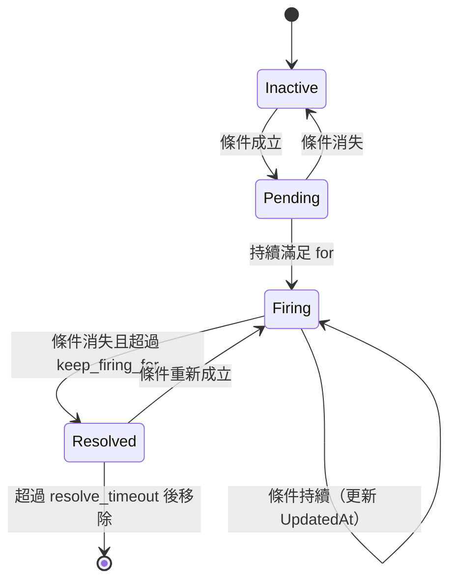

# 07 — 告警：規則、狀態機、分發、通知

套件：`internal/alerting`。設計基準：**與 Prometheus Ruler + Alertmanager 的語義完全一致**，使用者既有的規則與路由設定可原樣搬過來。

`prometheus/alertmanager` 是 Apache-2.0，`silence`、`inhibit`、`dispatch`、`pkg/labels` 可直接 import 複用；`notify` 套件依賴較重，建議自行實作（見 §6）。

## 1. 規則模型

### 1.1 檔案格式（Prometheus rule YAML，完全相容）

```yaml
groups:
  - name: host
    interval: 30s
    limit: 0                 # 該組最大告警數，0 = 無限
    rules:
      - alert: HostDiskAlmostFull
        expr: (1 - node_filesystem_avail_bytes / node_filesystem_size_bytes) > 0.85
        for: 10m
        keep_firing_for: 5m  # 選配，Prometheus 2.42+ 語義
        labels:
          severity: warning
        annotations:
          summary: "{{ $labels.instance }} 磁碟使用率 {{ $value | humanizePercentage }}"
          runbook_url: "https://wiki/runbook/disk"
      - record: job:http_requests:rate5m
        expr: sum by (job) (rate(http_requests_total[5m]))
```

### 1.2 Prism 擴充（可選欄位，Prometheus 會忽略，故仍相容）

```yaml
      - alert: ErrorLogSpike
        prism_log_expr: |                      # 用 LogQL 而非 PromQL
          sum(count_over_time({service="api", level="error"}[5m])) > 100
        for: 5m
        labels: {severity: critical}
```

`prism_log_expr` 與 `expr` 互斥。實作上兩者都走 `internal/query` 的同一條路徑，只是引擎不同。

**擴充原則**：所有 Prism 專屬欄位一律以 `prism_` 前綴，保證檔案仍能通過 `promtool check rules`（未知欄位在 rule 層級會被 promtool 拒絕，因此 Phase 1 需驗證；若 promtool 拒絕，改為把擴充放在 `labels.__prism_log_expr__`）。此相容性須在 Phase 2 實測後於 ADR 定案。

### 1.3 規則來源

兩個來源並存，載入後合併：

1. **檔案**：`rules.path` 指定的目錄，`*.yml` / `*.yaml`，支援 `SIGHUP` 與檔案監看熱重載。
2. **控制平面**：Postgres `rule_groups` / `rules` 表，經 `/api/console/v1/rules` CRUD，每 `rules.db_sync_interval`（預設 30s）同步。

衝突時（同名 group）：檔案優先，並記錄警告。理由：檔案是 GitOps 的載體，不應被 UI 意外覆蓋。

## 2. 評估器

```go
type Group struct {
    Name     string
    Tenant   string
    Interval time.Duration
    Rules    []Rule
    Limit    int
}
```

- 每個 Group 一個 goroutine，`time.Ticker` 驅動。
- **啟動抖動**：首次執行延遲 `hash(groupName) % interval`，避免所有組同時打爆後端。
- 組內規則**依序**評估（Prometheus 語義：後面的規則可以用到前面 recording rule 的結果）。
- 單條規則超時 `rules.eval_timeout`（預設 = interval，最多 30s）。
- 評估失敗：遞增 `prism_rule_eval_failures_total{group,rule}`，**保持告警的前一狀態不變**，連續失敗超過 `rules.max_consecutive_failures`（預設 5）時觸發內建告警 `PrismRuleEvaluationFailing`。

**「保持前一狀態不變」很重要**：後端短暫不可用時，不能讓所有 firing 告警集體 resolved（誤導成「問題解決了」），也不能讓它們集體 firing。

## 3. 告警狀態機



```go
type AlertState uint8
const (
    StateInactive AlertState = iota
    StatePending
    StateFiring
)

type Alert struct {
    Fingerprint  uint64        // labels 的 hash，身分依據
    Labels       labels.Labels // 含 alertname 與規則 labels，已套用模板
    Annotations  labels.Labels // 已套用模板
    State        AlertState
    ActiveAt     time.Time     // 條件首次成立
    FiredAt      time.Time
    ResolvedAt   time.Time
    LastEvalAt   time.Time
    Value        float64
    GeneratorURL string
}
```

- `Fingerprint` = 排序後 labels 的 xxhash64。同一規則產生的不同標籤組合是**不同告警**。
- `resolve_timeout` 預設 5 分鐘：Resolved 後仍保留在記憶體，讓 Alertmanager API 能回報 `endsAt`。
- **`ALERTS` 序列回寫**（Prometheus 語義，讓使用者能對告警歷史做 PromQL 查詢）：
  - `ALERTS{alertname="X", alertstate="pending|firing", ...原 labels} = 1`
  - `ALERTS_FOR_STATE{alertname="X", ...} = <ActiveAt 的 unix 秒>`
  - 每次評估後寫入，值消失即代表告警結束。
- 狀態持久化：每 `rules.state_flush_interval`（預設 60s）把 `ActiveAt` 寫入 Postgres `alert_state` 表，重啟後回載。**沒有這一步，重啟會讓所有 `for: 30m` 的告警重新計時**，這是自建告警系統最常見的缺陷。

## 4. 模板

`annotations` 與 `labels` 的值支援 Go template，可用變數與函式與 Prometheus 一致：

- `{{ $value }}`、`{{ $labels.xxx }}`、`{{ $externalLabels.xxx }}`
- 函式：`humanize`、`humanize1024`、`humanizeDuration`、`humanizePercentage`、`humanizeTimestamp`、`title`、`toUpper`、`toLower`、`match`、`reReplaceAll`、`printf`、`query`（限制見下）
- `query "promql"` 允許但有次數上限（`rules.max_template_queries`，預設 3/次評估），防止模板引發查詢風暴。

模板渲染失敗：使用原始字串並在 annotation 加 `__template_error__`，**不得讓整條規則失敗**。

## 5. Dispatcher（分組、靜默、抑制）

處理順序固定：**Silence → Inhibit → Group → Dedup → Notify**。

### 5.1 設定（Alertmanager 格式，完全相容）

```yaml
route:
  receiver: default
  group_by: ['alertname', 'cluster', 'service']
  group_wait: 30s
  group_interval: 5m
  repeat_interval: 4h
  routes:
    - matchers: ['severity="critical"']
      receiver: oncall
      group_wait: 10s
      repeat_interval: 1h
      continue: false

inhibit_rules:
  - source_matchers: ['alertname="HostDown"']
    target_matchers: ['severity=~"warning|info"']
    equal: ['instance']

receivers:
  - name: default
    webhook_configs:
      - url: http://example/hook
  - name: oncall
    prism_lark_configs:                 # Prism 擴充渠道以 prism_ 前綴
      - webhook_url_file: /etc/prism/secrets/lark_url
        at_all: false
```

### 5.2 行為要求

- `group_wait`：一組第一次有告警時，等這麼久再發，讓同批告警合併。
- `group_interval`：組內有**新**告警加入時，最快多久再發一次。
- `repeat_interval`：組內狀態不變時，多久重發一次提醒。
- resolved 通知：`send_resolved` 預設 `true`。
- **抑制的自我保護**：`inhibit_rules` 的 source 與 target 若能互相匹配（環），載入時直接拒絕並報錯，不得在執行期死鎖。

### 5.3 靜默

- 儲存於 Postgres `silences` 表，記憶體維護活躍集合。
- 匹配器支援 `=`、`!=`、`=~`、`!~`。
- 過期靜默保留 `silences.retention`（預設 5 天）供審計後硬刪。
- 建立靜默必須記錄 `createdBy`（來自 JWT 或 API key 名稱）與 `comment`（強制非空）。

## 6. Notifier SPI

```go
package notify

type Notifier interface {
    Name() string
    // Send 必須是冪等的：同一 DeliveryID 重送不應造成重複副作用（能做到的渠道）。
    Send(ctx context.Context, d Delivery) error
}

type Delivery struct {
    ID          string   // uuid，冪等鍵
    Receiver    string
    GroupKey    string
    GroupLabels labels.Labels
    Status      string   // "firing" | "resolved"
    Alerts      []Alert
    ExternalURL string
    Attempt     int
}

func Register(kind string, f Factory)  // kind 對應 yaml 中的 *_configs 鍵名
```

v1 必做渠道：

| kind | 說明 |
|---|---|
| `webhook_configs` | Alertmanager 相容的 JSON payload（**欄位必須逐一對齊**，讓既有的 webhook 接收端不用改） |
| `email_configs` | SMTP，支援 STARTTLS / TLS，HTML + 純文字雙格式 |
| `prism_telegram_configs` | Bot API |
| `prism_lark_configs` | 飛書自訂機器人（支援加簽） |
| `prism_dingtalk_configs` | 釘釘自訂機器人（支援加簽與關鍵詞） |
| `slack_configs` | Incoming webhook |

Phase 4 可加：`pagerduty_configs`、`opsgenie_configs`、`prism_wecom_configs`。

### 6.1 憑證處理

- 所有 `*_url`、`*_token`、`*_password` 欄位必須支援 `_file` 後綴變體（如 `webhook_url_file`），從檔案讀取。
- 設定檔中的明文憑證在載入後立即包裝成 `secret.String`，其 `String()` / `MarshalJSON()` 一律回傳 `<secret>`。
- `/api/v2/status` 回傳的 `config.original` 必須先做遮罩。

### 6.2 投遞可靠性（自建系統最容易忽略的部分）

通知**必須落庫再發送**，不可只在記憶體裡：

```sql
CREATE TABLE notification_deliveries (
    id            UUID PRIMARY KEY,
    tenant_id     TEXT NOT NULL,
    receiver      TEXT NOT NULL,
    channel_kind  TEXT NOT NULL,
    group_key     TEXT NOT NULL,
    status        TEXT NOT NULL,   -- pending|sent|failed|dead
    payload       JSONB NOT NULL,
    attempt       INT  NOT NULL DEFAULT 0,
    next_retry_at TIMESTAMPTZ,
    last_error    TEXT,
    created_at    TIMESTAMPTZ NOT NULL DEFAULT now(),
    sent_at       TIMESTAMPTZ
);
CREATE INDEX ON notification_deliveries (status, next_retry_at) WHERE status = 'pending';
CREATE INDEX ON notification_deliveries (tenant_id, created_at DESC);
```

- 重試：指數退避 `30s, 1m, 2m, 5m, 10m`，共 5 次，之後標記 `dead`。
- `dead` 觸發內建告警 `PrismNotificationDead`（發往一個**不同**的 receiver，設定於 `notify.deadletter_receiver`）。
- Console 提供投遞記錄查詢與手動重送。
- 指標：`prism_notification_sent_total{channel,status}`、`prism_notification_retry_total`、`prism_notification_dead_total`、`prism_notification_latency_seconds`。

**「通知發不出去而沒人知道」是告警系統唯一的致命故障**。上述機制加上 §8 的 watchdog 是必做項，不可推遲到後續階段。

## 7. 內建規則

`rules.builtin_enabled`（預設 true）時自動載入，租戶無法刪除但可靜默：

| 告警 | 條件 |
|---|---|
| `PrismStorageUnavailable` | `up{job="prism"} == 0` 或 `prism_storage_write_duration_seconds` 連續失敗 |
| `PrismIngestDropping` | `rate(prism_ingest_dropped_total[5m]) > 0` |
| `PrismHighCardinalityLabel` | `prism_ingest_high_cardinality_total` 增長 |
| `PrismRuleEvaluationFailing` | `rate(prism_rule_eval_failures_total[10m]) > 0` |
| `PrismNotificationDead` | `increase(prism_notification_dead_total[15m]) > 0` |
| `PrismDiskPressure` | 存儲後端磁碟 > 85% |
| `PrismAgentDown` | Agent 心跳逾時 > 3 個間隔 |

## 8. Watchdog（外部看門狗）

內建一條永遠 firing 的規則 `PrismWatchdog`，路由到一個獨立 receiver（建議指向外部的 Healthchecks.io / Uptime Kuma / cron + curl）。外部系統若在預期間隔內**沒有**收到它，就代表 Prism 本身掛了。

這是整個系統唯一不能靠自己驗證的部分，必須在 `deploy/` 提供範例設定並在 README 顯著位置說明。

## 9. 驗收標準

- A1：一份取自真實 Prometheus 專案的 rule 檔（含 recording rules 與模板）能無修改載入並正確評估。
- A2：`promtool check rules` 對 Prism 產生的規則檔通過。
- A3：`amtool --alertmanager.url=http://prismd:9090/alertmanager alert query` 與 `silence add/query/expire` 全部可用。
- A4：`for: 5m` 的告警在 `prismd` 重啟後不重新計時（透過 `alert_state` 表驗證）。
- A5：後端故障 3 分鐘期間，既有 firing 告警不變成 resolved。
- A6：webhook 接收端回 500 時，投遞進入重試，5 次後標記 dead 並觸發 `PrismNotificationDead`。
- A7：`HostDown` firing 時，同 instance 的 warning 告警被抑制且在 `/api/v2/alerts` 顯示 `status.state="suppressed"`。
- A8：模板渲染錯誤不影響告警觸發與通知發送。
