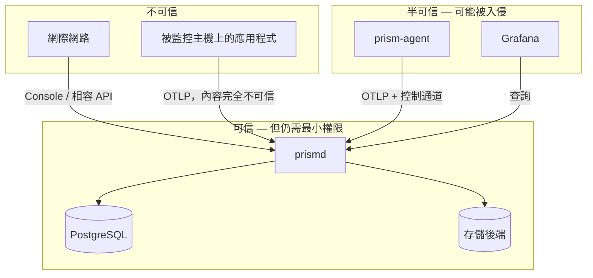

# 21 — 威脅模型與安全設計

範圍：`prismd`、`prism-agent`、控制平面、與存儲後端的通道。不含存儲後端與 Grafana 自身的加固（各有其官方文件，`deploy/` 只提供最小安全預設）。

## 1. 資產與信任邊界

**核心資產**（依價值排序）：

1. 通知渠道憑證（webhook URL、SMTP 密碼、IM token）——洩漏可用於釣魚或騷擾
2. API key 與 JWT 密鑰——洩漏可偽造資料或讀取全部遙測
3. 遙測資料本身——日誌常含個資、內部 URL、堆疊追蹤、有時含憑證
4. 告警規則與靜默——被竄改可讓真實故障靜默無聲
5. Agent 配置——被竄改可把資料導向攻擊者

## 2. 威脅清單與對策

### T1：跨租戶資料洩漏

**攻擊**：租戶 A 透過改 header、猜 UUID、注入 matcher、或利用查詢語言的漏洞讀到租戶 B 的資料。

**對策**（三道防線，見 `09-CONTROL-PLANE.md` §5）：

1. API 層：middleware 解析租戶並注入 context；API key 綁定租戶時，header 指定不同租戶直接 `403`。
2. SQL 層：store 方法簽章強制帶 tenant；CI 靜態檢查無漏網查詢。
3. 存儲層：`WithTenantGuard` 注入 `__tenant__` 並**檢查使用者 matcher 未試圖覆寫**。

**特別注意的注入面**：

- PromQL：`{__tenant__="other"}`——`WithTenantGuard` 必須在**解析後的 matcher 集合**上檢查，不能只做字串比對。子查詢與 `label_replace` 也要覆蓋。
- LogQL：同上；`| __tenant__="other"` 這類 label filter 也要擋。
- `extra_filters[]`（vmvl）：必須確認後端版本支援，否則拒絕啟動（`18` §3.4）。

**測試**：`SEC-01`、`SEC-02`、`SEC-03`。

### T2：憑證洩漏

**攻擊面**：日誌、錯誤訊息、API 回應、`/api/v2/status` 的 config dump、Console UI、審計日誌的 before/after。

**對策**：

- 所有憑證欄位包成 `secret.String`，其 `String()`、`MarshalJSON()`、`MarshalYAML()`、`Format()` 一律回 `<secret>`。**必須覆寫 `Format()`**，否則 `%v` 會繞過 `String()`。
- 設定檔憑證支援 `_file` / `secret://` 引用；控制平面 API **拒絕**明文憑證。
- `audit_log` 的 before/after 在寫入前經過遮罩函式。
- 日誌禁止輸出完整 `Authorization` 標頭；只記錄 `key_prefix`。
- 遮罩函式集中於 `internal/secret`，有專門的測試遍歷所有含憑證的結構體。

**測試**：`SEC-05`、`SEC-06`。額外：一個 golden test 對每個含憑證的型別做 JSON/YAML/`%v`/`%+v`/`%#v` 序列化，斷言不含明文。

### T3：Agent 被入侵後的橫向移動

**攻擊**：攻擊者取得一台被監控主機的 root，拿到 agent 的 API key。

**影響評估**：

- 可以偽造該租戶的任意遙測資料（無法防，這是採集模型的固有限制）
- 可以讀取該租戶的資料——**必須防**：agent 的 API key scope 只給 `write:*` + `agent`，**不給任何 `read:*`**
- 可以修改其他 agent 的配置——**必須防**：`agent` scope 只允許存取**自己的** `agent_id`（路徑參數必須與 key 綁定的 agent 一致）

**對策**：

- Agent key 的 scope 嚴格限制（見 `19` §3）。
- `/agents/{id}/config` 與 `/heartbeat` 檢查 `{id}` 與認證身分一致，否則 `403`。
- 建議每台主機一把 key（`prismctl apikey create --name agent-web-01`），不共用。文件必須說明共用一把 key 的風險。
- Agent 的 `merge` 配置模式：遠端配置不能改 `output`/`wal`/`limits`（`08` §8），且**伺服器端主動剝除**這些欄位（`19` §4），不依賴 agent 自律。

### T4：控制平面被入侵後的資料外洩

**攻擊**：攻擊者取得 admin 權限，把 agent 的 output 指向自己的伺服器。

**對策**：T3 的最後一條——`output.endpoint` 永遠不由遠端配置決定。這是刻意的能力削減：**犧牲「集中改上報位址」的便利，換取入侵後的爆炸半徑**。

### T5：日誌注入與 log forging

**攻擊**：應用程式的日誌內容含換行、ANSI 逃逸序列、或偽造的 JSON 結構，污染 Console/Grafana 的顯示或誤導排障。

**對策**：

- Console UI 顯示日誌時一律當純文字，**不渲染 HTML、不解釋 ANSI**。
- 日誌 Body 中的控制字元（除 `\n`、`\t`）在顯示前替換為 `\xNN` 表示（儲存時保留原始位元組）。
- `| json` 解析失敗不丟棄該行，但加 `__error__` 標記，讓使用者看得出解析狀態。
- 不對日誌內容做任何形式的 eval 或模板渲染。

### T6：查詢型 DoS

**攻擊**：一條 `{job=~".+"} |~ ".*"` 掃 30 天，或 `sum(rate(x[30d]))` 帶 1 秒 step。

**對策**（`06-QUERY-ENGINE.md` §5，全部必做）：

- `max_points`、`max_range`、`max_lookback`、`max_samples`
- 全域與每租戶併發上限
- 每查詢超時 + context 傳遞至驅動
- 回退路徑更嚴格的限制
- selector 必須含非空匹配（LogQL 與 PromQL 皆是）
- `/rules/preview` 受同一組限制約束

### T7：寫入型 DoS 與基數炸彈

**攻擊**：灌入 100 萬個不同 `user_id` 標籤，或單筆 1 GB 的日誌。

**對策**：`04-DATA-MODEL.md` §5 的全部限制 + `05-INGEST-PIPELINE.md` §6 的有界佇列與丟棄優先序。

**關鍵設計**：限制永遠只丟資料，不阻塞（`05` §5）。任何在限制路徑上的阻塞式等待都會把 DoS 放大成全服務故障。

### T8：不可信輸入導致的記憶體耗盡或崩潰

**攻擊**：畸形的 protobuf（宣告巨大陣列長度）、zip bomb 式的 gzip、超深巢狀 JSON、災難性回溯的正則。

**對策**：

- 請求體大小上限 + 解壓後大小上限（`ingest.max_decompressed_bytes`，預設 64 MiB）。解壓時用 `io.LimitReader` 包裹。
- protobuf 解碼用 `pdata`，其本身有防護；額外檢查解出的元素數量。
- JSON 巢狀深度上限 5（`15` §5）。
- **正則一律用 Go 的 `regexp`（RE2），無災難性回溯**。這是選 Go 的一個實質安全好處。但仍須限制正則長度（`limits.max_regex_bytes`，預設 4096）。
- Fuzz 測試覆蓋五個解析入口（`10` §6）。

### T9：認證繞過與憑證暴力破解

**對策**：

- 密碼用 argon2id，參數見 `09` §4。
- 登入失敗限流（`19` §1）。
- 登入失敗不區分「帳號不存在」與「密碼錯誤」。
- API key 比對用 `subtle.ConstantTimeCompare`（雖然比對的是 hash，仍照做）。
- JWT 密鑰長度 < 32 bytes 時**啟動失敗**（不是警告）。
- refresh token rotation + 重用偵測（`19` §1）。
- `auth.allow_anonymous_read` 預設 `true` 是為了單機自用的體驗；**部署文件必須在對外暴露的章節明確要求關閉**，且 `prismd` 在偵測到 `http_listen` 綁定非 loopback 且 `allow_anonymous_read: true` 時，啟動日誌輸出 WARN。

### T10：供應鏈

**對策**：

- `go.mod` 全部 pinned；啟用 `GOFLAGS=-mod=readonly`。
- CI 跑 `govulncheck` 與 `go mod verify`。
- 新增依賴需在 PR 說明必要性、授權、維護狀態。
- 容器映像用 distroless 或 alpine + 非 root 使用者。
- 發佈物提供 sha256 與 sigstore 簽章（Phase 5）。
- Agent 自動升級預設**關閉**；啟用時必須校驗 sha256（`11` §9）。

### T11：告警靜默作為攻擊手段

**攻擊**：入侵者建立一條匹配所有告警的靜默，讓後續動作無聲。

**對策**：

- 靜默必須有 `createdBy`（伺服器填）與非空 `comment`。
- 靜默時長上限（`silences.max_duration`，預設 7 天）。
- 建立/刪除靜默寫入 `audit_log`。
- **內建告警 `PrismBroadSilenceCreated`**：當一條靜默的 matcher 會匹配超過 `silences.broad_threshold`（預設 50）條目前活躍告警時觸發，路由到 `deadletter_receiver`。
- Watchdog 告警（`PrismWatchdog`）**不可被靜默**——dispatcher 對它硬編碼跳過靜默檢查。

最後一條是關鍵：無論攻擊者做什麼，外部看門狗都會在 Prism 停止心跳時察覺。

## 3. 加密與傳輸

| 通道 | v1 要求 | 建議 |
|---|---|---|
| 客戶端 → `prismd` | 可 HTTP（內網）或 HTTPS | 對外暴露必須 TLS；用反向代理終結 |
| `prism-agent` → `prismd` | Bearer token over TLS | mTLS（`agent.output.tls.client_cert`） |
| `prismd` → 存儲後端 | 明文（同機或內網） | ClickHouse `secure=true`；VM/VL 走 TLS |
| `prismd` → PostgreSQL | `sslmode=disable`（同機） | `sslmode=verify-full`（跨機） |
| `prismd` → 通知渠道 | HTTPS，驗證憑證 | — |
| 靜態資料 | 不加密 | 依賴磁碟層加密（LUKS） |

**明確不做**：應用層的欄位級加密。理由是遙測資料需要被查詢與聚合，欄位加密會使其失去價值；正確的做法是在來源端就不要記錄敏感資料（`prism-agent` 的遮罩功能，`08` §4）。

## 4. 資料處理與隱私

- **遮罩在最早的地方做**：`prism-agent` 的 `process.redact` 在資料離開被監控主機前執行。內建樣式：信用卡號、`password=`、`Authorization: Bearer`、`api_key=`、私鑰 PEM 區塊、常見的身分證字號格式。
- 服務端不做二次遮罩（成本高且已來不及——資料已離開來源主機）。
- 保留期是隱私控制的主要手段：預設日誌 14 天。文件必須提醒使用者依自身合規要求調整。
- **無「刪除特定使用者資料」的能力**。遙測系統的資料模型不支援按主體刪除。若使用者有此合規需求，必須從源頭避免記錄可識別資料。這一限制必須在 README 明確聲明。

## 5. 安全預設值檢查表（`prismd` 啟動時檢查並輸出）

| 檢查 | 不通過時 |
|---|---|
| `auth.jwt_secret_file` 存在且 ≥ 32 bytes | **啟動失敗** |
| `http_listen` 非 loopback 且 `allow_anonymous_read: true` | WARN |
| `http_listen` 非 loopback 且無 TLS 且無 `trust_proxy` | WARN |
| `tenancy.mode: single` 且存在多個租戶 | WARN |
| 任何 receiver 的 spec 含疑似明文憑證 | **啟動失敗** |
| `control.auto_upgrade: true` | WARN（含後果說明） |
| 未設定 watchdog receiver | WARN |
| 存在 scope 含 `read:*` 的 agent key | WARN |

WARN 一律同時輸出到啟動日誌與 `/api/console/v1/status` 的 `warnings` 陣列，讓 Console 能顯示。

## 6. 事件回應

`docs/runbooks/security-incident.md` 必須涵蓋：

1. 疑似 API key 洩漏 → 撤銷、輪替、查 `audit_log` 與 `api_keys.last_used_at`
2. 疑似 agent 主機被入侵 → 撤銷該 agent key、檢查該主機的資料是否被偽造、檢查該 key 是否被用於其他來源 IP
3. 疑似 JWT 密鑰洩漏 → 輪替密鑰（使全部 session 失效）、強制改密碼
4. 發現遙測資料含憑證 → 縮短保留期或提前清理特定分區、修 agent 遮罩規則、通知憑證擁有者輪替
5. 發現異常靜默 → 檢查 `audit_log`、刪除、檢查該期間是否有被遮蔽的真實故障

每項都要有可執行的命令，不是原則性描述。
