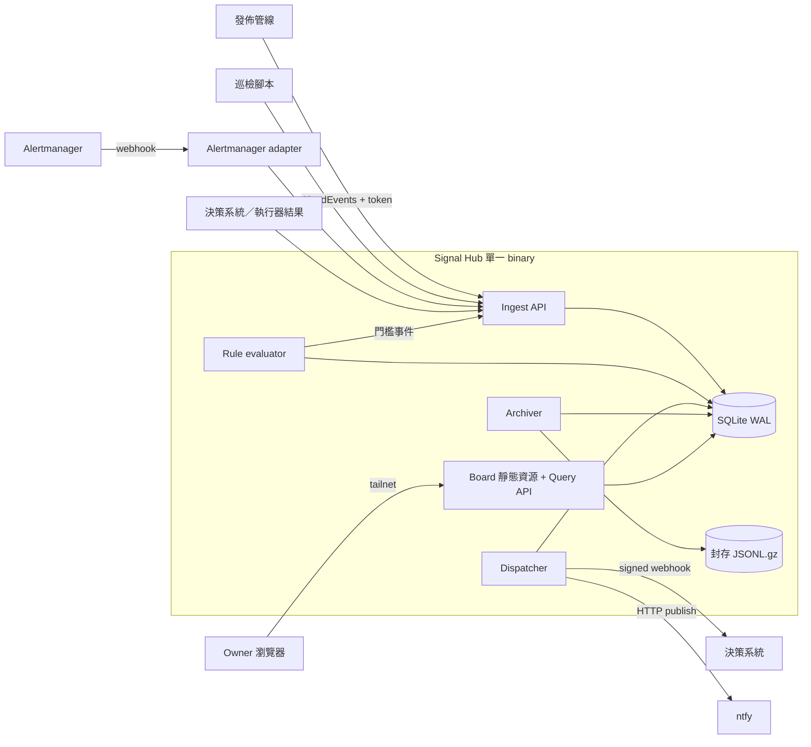

# Signal Hub — Software Design Document

版本：0.1 + M0 契約釐清 · 日期：2026-10-03 · runtime 狀態見 docs/STATUS.md。

## 1. 結論與理由

建立一個**單機、單一 binary** 的個人事件中樞。它只擁有四件事：

1. **事件信封與事件庫**：CloudEvents 1.0，append-only，`source + id` 去重。
2. **規則生成的指標**：版本化規則把事件聚合成時間序列，可回填，可產生門檻事件。
3. **訂閱與投遞**：at-least-once，stable delivery ID，重試、DLQ、手動重放。
4. **看板**：時間線、事件詳情與關聯鏈、指標圖表、來源新鮮度、投遞狀態。

不擴充 edge-ops、dim-gate、hai-taskboard 或 PIF：它們的核心物件、生命週期與權限模型都與「跨來源、可查詢、可訂閱的事件」不同。判斷過程見 knowledge-base `44.05` 筆記。

**第一條可驗收閉環：** 一個生產者用 token 送出事件 → 事件入庫並去重 → 看板時間線可按時段查到 → 一條指標規則畫出圖表 → 一條 ntfy 訂閱送到手機 → 生產者停止上報時看板標示為沉默。

## 2. 使用者與規模

唯一使用者是 owner 本人。「訂閱者」是 owner 自己的系統，不是其他人；外部訂閱不在規劃內。

| 項目 | 設計值 | 性質 |
| --- | --- | --- |
| 事件量 | 每天 ≤ 1000 筆 | owner 給定的上限 |
| 單筆大小 | 平均約 2 KB，`data` 上限 16 KiB | 前者是估算，後者是契約 |
| 熱資料期 | 預設 90 天，可按來源設定 | 提案值，owner 可改 |
| 指標 rollup 保留 | 預設 2 年 | 提案值 |
| 來源數 | 約 5–20 個 | 估算 |

依此推算熱資料約 180 MB，單機 SQLite 足夠。容量不是加佇列或分散式儲存的理由。

## 3. 範圍與階段

| 階段 | 價值 | 能力 | 明確排除 |
| --- | --- | --- | --- |
| M0 | 契約先行 | 事件 JSON Schema、規則與訂閱設定 schema、OpenAPI、正反 fixtures | 任何 runtime |
| M1 | 事件可靠落地 | ingest API、來源 token、去重、事件庫、查詢 API | UI、指標、投遞 |
| M2 | 看得見 | 時間線、事件詳情、關聯鏈、來源新鮮度 | 圖表 |
| M3 | 看得懂趨勢 | 指標規則、rollup、回填、門檻事件、圖表 | 百分位數聚合 |
| M4 | 送得出去 | 訂閱、webhook、ntfy、即時與摘要、重試、DLQ、重放 | Email、Telegram、Slack |
| M5 | 放得久、救得回 | 封存、SQLite 備份、還原演練 | 異地備份的自動化（沿用既有備份工具） |
| M6 | 真實資料 | 發佈、巡檢、Alertmanager 三個生產者 adapter；部署（需另行授權） | 新聞、業務日誌衍生事件（放下一階段） |

決策閉環（決策系統訂閱巡檢失敗 → 策略推薦 → 人選擇 → 執行 → 結果事件）是 M4 之後的下一個專案。中樞一側只需要 M4 的 webhook 與 M2 的關聯鏈檢視，不為它另加能力。

## 4. 架構

- **一個 process，四個背景工作**：ingest（同步）、rule evaluator、dispatcher、archiver（週期性）。全部共用同一個 SQLite 檔。
- **SQLite 是唯一權威。** rollup、投遞狀態、封存清單都在同一個資料庫。封存檔在資料庫外，但由資料庫中的 manifest 記錄。
- **只在 tailnet 內提供服務。** 沒有公網入口。
- **門檻事件走正常 ingest 路徑**，和外部事件一樣可被查詢、訂閱。

## 5. 技術選擇

| 層 | 選擇 | 理由 |
| --- | --- | --- |
| 後端 | Go，單一 binary | 與 onefleet、goku、prism 同語言；週期工作與 HTTP 服務放同一個 process 最簡單 |
| 儲存 | SQLite（WAL 模式） | 量級小；單檔易備份；不需另外維運資料庫 |
| 前端 | React + TypeScript + Vite，建置後以 `go:embed` 內嵌 | 與 dim-gate、edge-ops 一致；部署只有一個檔案 |
| 圖表 | 候選 Apache ECharts | 44.02 已評估；M3 前確認授權與 bundle 大小 |
| 設定 | YAML 檔，放在 private 設定 repo | 規則與訂閱以 git 管版本；AI agent 可以用 PR 修改 |
| 部署 | OneFleet 管理的一個 workload（需另行授權） | 不另建部署機制 |

M0 鎖定實際安裝並驗證過的契約檢查工具版本；Go／前端 runtime 的依賴與 build 在對應實作階段再鎖定。

## 6. 詳細設計

| 文件 | 內容 |
| --- | --- |
| [01 事件模型與 ingest](docs/sdd/01-event-model-and-ingest.md) | CloudEvents 欄位、extension、來源註冊、去重、API |
| [02 儲存、封存與還原](docs/sdd/02-storage-and-retention.md) | schema、熱資料期、封存流程、備份、還原 |
| [03 指標規則](docs/sdd/03-metric-rules.md) | 規則格式、評估、回填、門檻事件 |
| [04 訂閱與投遞](docs/sdd/04-subscriptions-and-delivery.md) | 訂閱模型、投遞狀態機、webhook 簽章、ntfy、決策系統契約 |
| [05 看板與查詢 API](docs/sdd/05-board-and-api.md) | 頁面、查詢、自我觀測 |
| [06 安全、維運與驗收](docs/sdd/06-security-operations-acceptance.md) | 威脅模型、部署邊界、里程碑驗收案例 |

## 7. 設計決策

**ADR-01：採用 CloudEvents 1.0 作事件信封。** 必填 `id`、`source`、`specversion`、`type`，且 `source + id` 唯一，正好是去重鍵。不自訂信封。[S01]

**ADR-02：單機 Go + SQLite，而不是 Cloudflare Workers + D1。** edge-ops 選 Cloudflare，是因為它的控制面必須在被監控主機之外。本專案的週期工作（規則評估、封存、投遞重試）與本機檔案（封存 JSONL）在單一 process 裡最簡單。代價是宿主故障時中樞也停，所以必須有中樞以外的存活檢查，見 06。若日後中樞本身的可用性比簡單更重要，再評估搬遷；事件格式與 API 不因此改變。

**ADR-03：指標由受限的規則格式定義，不開放 SQL。** 受限格式可以驗證、可以版本化、可以安全地由 AI agent 修改，也能翻譯成 LogsQL `stats`，保留日後投影到 VictoriaLogs／vmalert／Grafana 的路徑。[S03][S04]

**ADR-04：規則與訂閱放設定檔，UI 在 MVP 唯讀。** 版本、審查與回滾交給 git，不在中樞內重做一套設定管理。

**ADR-05：投遞是 at-least-once。** 接收端依 delivery ID 去重。不宣稱 exactly-once。沿用 kernel `nats-push-bridge` 規格的 stable delivery ID、HMAC 簽章與 DLQ 模型。

**ADR-06：中樞不理解決策。** 決策系統與執行器的結果只是帶 `correlationid` 的一般事件。中樞只依關聯 ID 把它們串成一條鏈顯示。

**ADR-07：告警收斂交給 Alertmanager。** Alertmanager 已提供 grouping、inhibition、silencing 與 webhook receiver；中樞只接它的 webhook。[S02]

## 8. 非目標

- 多使用者、租戶、對外訂閱
- 原始日誌收集、全文搜尋、trace
- 自動執行任何動作
- 取代 Alertmanager、Grafana 或日誌平台
- 高可用、多副本
