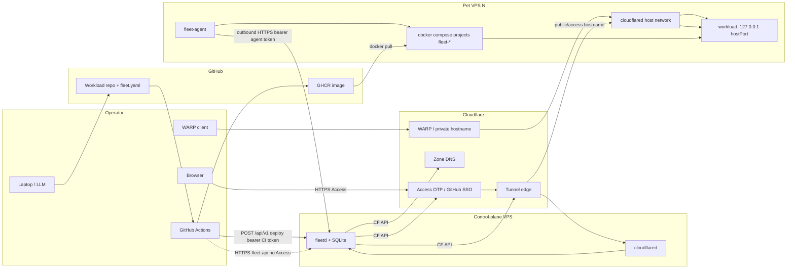
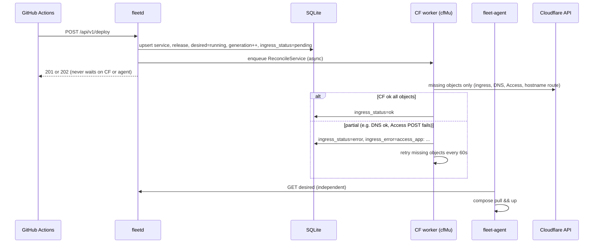

# Fleet Catalog — Software Design Document

| Field | Value |
| --- | --- |
| **Document** | Fleet Catalog SDD (greenfield) |
| **Product** | Fleet Catalog |
| **Repo (suggested)** | `fleet-catalog` |
| **Binaries** | `fleetd` (control plane), `fleet-agent` (node agent) |
| **Author** | Cheng Kung Chiang (@fallrising) |
| **Date** | 2026-09-04 |
| **Status** | Draft (revised 2026-09-04 after review) |
| **Audience** | GitHub / senior engineers implementing Phase 1 MVP |
| **Language** | Go 1.23+, Docker Compose v2, SQLite, Cloudflare Tunnel + Access |
| **Module path** | `github.com/fallrising/fleet-catalog` (replace `OWNER` at repo creation) |

This document is implementation-ready. Protocols, JSON schemas, SQL, file layout, Cloudflare API calls, and GitHub Actions contracts are specified so Phase 1 can be built without guessing.

---

## Overview

Fleet Catalog is a **personal service catalog and thin control plane** for a small fleet of pet VPS hosts. The operator (one human, often with an LLM) writes a small service, compiles it to a container image, pins it to a specific VPS, deploys it with Docker Compose, and **registers** it. The catalog then shows URL, node, version, health, and expose mode, and supports start / stop / redeploy.

The product contract is **`fleet.yaml`**. The runtime unit is **Docker Compose**. Ingress is **Cloudflare** with three expose modes (`public`, `access`, `private`). Orchestration is **agent desired-state reconciliation**: each VPS runs `fleet-agent`, which connects **outbound-only** to `fleetd`, pulls compiled Compose for that node, and makes local reality match desired state.

This is **not** Coolify, Dokploy, Kubernetes, Nomad, Swarm, or a fork of the adjacent `clarkQ` / `vps-hygiene` trees. Those remain neighboring tools. Fleet Catalog owns the catalog, the `fleet.yaml` contract, the agent protocol, and Cloudflare ingress. Workloads (file relay, knowledge pipelines, dashboards, `clarkQ` itself if deployed as an app) only implement `/healthz` and ship a `fleet.yaml`.

---

## Background & Motivation

### Current state

The operator already runs several long-lived Debian/Ubuntu VPS boxes and a growing set of LLM-built one-off services. Adjacent repos in this workspace illustrate the problem, not the solution:

| Adjacent project | What it is | Fleet Catalog relationship |
| --- | --- | --- |
| `/home/ckc/test/grok/vps-hygiene` | Host inventory / health / cleanup scripts (`./vps health`, `./vps inventory`, Docker prune, ports audit). Tuned for Debian/Ubuntu pets. | **Host toolbox, not orchestrator.** Agent should *surface similar disk/mem/load facts* in JSON. Do **not** exec or rewrite those scripts into the agent. Optional later integration. |
| `/home/ckc/test/grok/clarkQ` | Go HTTP queue/cluster (`github.com/fallrising/clarkQ`). Compose + Helm deploy. Own admin UI, WAL, replication. | **Workload, not control bus.** Do not import its packages, do not use its queues for desired-state, heartbeats, or deploy fan-out. A future `fleet.yaml` may *deploy* clarkQ like any other app. |
| `/home/ckc/test/grok/mac-in-docker`, `wotar/secure-mqtt-e2ee`, other one-offs | Compose-shaped services the operator actually runs. | **Workloads** Fleet Catalog will register, start/stop, and put on Cloudflare hostnames. |

Today, deploy is ad-hoc: SSH in, `docker compose up`, maybe a hand-made tunnel hostname, no single table of “what is running where, at which URL, at which git SHA.” `vps-hygiene` can see Docker projects and public binds (`scripts/ports-audit.sh` already warns that services should bind `127.0.0.1`), but it cannot start/stop by catalog contract or drive Cloudflare.

### Pain points

1. **No catalog.** After a few LLM-generated services, the operator cannot answer “what is the API URL, which VPS, which image, is it healthy?”
2. **Ingress is hand-operated.** Cloudflare Tunnel hostnames and Access apps drift from whatever Compose is actually up.
3. **Inbound SSH as control plane is the wrong default.** VPS inbound is default-deny; agents must dial out.
4. **Runtime sprawl risk.** Mixing systemd units, raw `docker run`, and Compose makes LLM-generated deploys non-uniform. One runtime in MVP: Compose.
5. **Public tunnels are a bad origin for large files.** File-relay of multi-GB blobs through Cloudflare Tunnel public hostnames will fail or be painful. That constraint must be in the contract, not discovered in production.

### Why a thin control plane (not Coolify)

The highest-leverage artifact is **`fleet.yaml` + agent protocol + Cloudflare ownership**. PaaS clones optimize for buildpacks, multi-tenant UI, and “git push to random node.” This operator already builds in GitHub Actions and pins a VPS. Owning a 2k-line Go control plane plus a 1k-line agent is less total complexity than adopting (and then fighting) Coolify/Dokploy while still needing a stable LLM-facing contract.

---

## Goals & Non-Goals

### Goals (Phase 1 MVP)

- `fleet.yaml` v1 contract with validator, JSON Schema, and three worked examples (`public` / `access` / `private`).
- `fleetd`: small Go HTTP service + SQLite + server-rendered catalog UI.
- `fleet-agent`: small Go binary (also runnable as a Compose service) per VPS; outbound-only.
- Desired-state semantics: start / stop / deploy / uninstall as specified below.
- Cloudflare Tunnel + Access driven **only** by `fleetd` (not by workloads).
- GitHub Actions: build image → GHCR → `POST` deploy API. `fleetd` does not clone or build.
- One operator, explicit node pin, one instance per service, Compose-only runtime.
- Bootstrap path: first control plane, first agent, first `hello-healthz`.

### Non-goals (not in MVP; not in the first PR stack)

- Autoscaling, bin-packing, or scheduling beyond **explicit `spec.node` pin**.
- Blue/green, canary, multi-replica (`spec.replicas` must be `1` if present).
- Kubernetes / Nomad / Swarm / systemd dual runtime.
- HashiCorp Vault, SOPS as a platform, or a real KMS.
- Prometheus, OpenTelemetry, Grafana (platform metrics). Structured logs + staleness only.
- `clarkQ` as the fleet control bus or event fabric.
- In-app GitHub file browser, gitops pull-controller, or in-cluster builds.
- Multi-tenant RBAC, teams, SSO into `fleetd` itself beyond Cloudflare Access in front of the UI.
- A `fleet` CLI. MVP uses UI + `curl` + GitHub Actions. CLI is Phase 2.
- Database operators, persistent-volume brokers, object-storage brokers.
- Rewriting `vps-hygiene` into the agent; calling those scripts.
- Large-file / video delivery over public Tunnel hostnames.

### Scale assumptions (design to these numbers, not to hypothetical cattle)

| Dimension | MVP target | Implication |
| --- | --- | --- |
| VPS (pets) | 2–10 | SQLite + one `fleetd`; no node HA |
| Services | 5–40 | Catalog page is a single query |
| Operators | 1 | No RBAC matrix; four token *kinds* (`operator`, `ci`, `agent`, `bootstrap`) |
| Deploy frequency | a few per day (≤ ~20) | Not thousands of QPS; image pull dominates |
| Heartbeats | 10 nodes × 4/min ≈ 40/min | Trivial write load |
| Control-plane host | 1 vCPU / 1 GiB RAM small VPS | `fleetd` + SQLite + `cloudflared` |
| API latency | p99 `< 100 ms` excluding CF/Docker | Local SQLite |
| Deploy to healthy | 30–90 s typical (pull-bound) | UI shows `progressing` |
| SQLite growth | `< 50 MiB` for years at this scale | WAL mode, nightly checkpoint optional |
| Host port range | `20000–20999` per node | Avoids `vps-hygiene` known demo ports (`28080–29202`, `25432`, `23000`, `9092`) |

If any of these is exceeded by 10×, revisit SQLite and the single-writer CF reconcile mutex — not before.

---

## Key Decisions

1. **Own the catalog + `fleet.yaml` + agent protocol; do not start from Coolify/Dokploy/k8s.** Those may become *executors* later. The LLM-facing contract and Cloudflare ownership are the product.
2. **Runtime is Docker Compose only.** *Workload* binaries are wrapped in distroless/scratch. The **agent image is not distroless** (Decision 18). No systemd unit installer in v1.
3. **Agents outbound-only; VPS inbound default-deny.** `fleet-agent` and `cloudflared` dial out. No inbound SSH/API required for day-2 deploys.
4. **Control plane is Go + SQLite (`fleetd`).** Matches operator comfort (`clarkQ` is Go) and the scale table. `modernc.org/sqlite` (pure Go, `CGO_ENABLED=0`) so `fleetd` can ship distroless like workloads.
5. **GitHub + GHCR is the build system.** `fleetd` never clones. CI is the only builder.
6. **Cloudflare API is owned by `fleetd`, not by workloads.** Workloads implement `/healthz` and bind `127.0.0.1`. `fleetd` writes tunnel ingress, DNS, and Access apps.
7. **Three expose modes, one overlay vendor in MVP.** `public` / `access` use public hostnames on a Cloudflare zone. `private` uses **Cloudflare WARP-to-Tunnel via private hostname routes** (no public DNS, no RFC1918 CIDR routes in Phase 1). Tailscale is *not* provisioned in MVP (see Alternatives).
8. **Split hostnames for `fleetd` itself.** UI (`FLEET_UI_HOSTNAME`) is Access-gated; agent/CI API (`FLEET_API_HOSTNAME`) is bearer/cookie only. Access OTP cannot be completed by agents or GHA.
9. **Control plane compiles Compose; agent only applies.** Agents do not interpret full `fleet.yaml`. They receive `compose_yaml` + env + health URL. Compilation bugs stay in one place.
10. **Always bind `127.0.0.1:<hostPort>`.** Aligns with `vps-hygiene` ports-audit guidance. Public reachability is Cloudflare’s job, never a `0.0.0.0` publish.
11. **Stop ≠ uninstall.** Stop = `desired_state=stopped` + `compose stop`. Uninstall = tombstone `desired_state=absent` on the wire; SQL row deleted only after agent ack or timeout.
12. **No `fleet` CLI in MVP.** UI + `curl` + GHA. Reduces surface area.
13. **Secrets in Phase 1 are node-local files.** Control-plane ciphertext store is Phase 2. `hello-healthz` needs no secrets.
14. **`clarkQ` is a workload, never the bus.** Using it for heartbeats would couple fleet availability to an application queue with different semantics (consume vs retain, WAL, tenants).
15. **Remotely-managed tunnels (`config_src=cloudflare`), one distinct tunnel per node.** Node tunnels are never the bootstrap `fleet-control` tunnel. `cloudflared` on the node only runs `tunnel run --token`.
16. **Tombstones on the wire, not silent omission.** `GET /api/v1/agent/desired` includes `desired_state=absent` (+ `purge_volumes`) until the owning agent reports the project gone (or 24h timeout). Node-move is a tombstone on the old node plus a live row on the destination.
17. **Protected-hostname allowlist; never PUT the bootstrap tunnel.** Reconcile is `union(catalog rules for that node tunnel ∪ existing rules whose hostname ∈ FLEET_PROTECTED_HOSTNAMES)`. Register never writes empty ingress over a tunnel that already has rules. `FLEET_BOOTSTRAP_TUNNEL_ID` is immutable and not stored as `nodes.tunnel_id`.
18. **Agent image is `docker:27.5.1-cli` + `apk add docker-cli-compose`, not distroless.** Official `*-cli` tags do **not** include Compose v2; install the plugin and assert `docker compose version` in the image build. Apply goes through `ComposeClient` (CLI). Agent process is **root** (docker.sock). `fleetd` remains distroless. Node `cloudflared` is the official distroless image. Token handoff is **path B**: bake `agent-stack.yml` into the agent image; agent writes `cloudflared.env` (0600 root — Compose CLI reads it, **not** the sidecar); then `ComposeClient.UpSidecar` recreates **only** the `cloudflared` service of project `fleet-agent`. `Up`/`Down`/`Stop` of the whole `fleet-agent`/`fleet-control` project still return `ErrProtectedProject`. Never a shell wait-loop.
19. **Every tick reconciles actual Docker state.** Hash/generation equality skips *file writes* only. If desired=running and `Ps` is not running → `Up`; if desired=stopped and a container is running → `Stop`. `--force-recreate` on generation bump (including same image).
20. **Heartbeat is independent of apply/pull.** A dedicated goroutine heartbeats every 15s even during a 5-minute `compose pull`. Apply holds a per-agent lock and processes one service at a time.
21. **`POST /api/v1/deploy` upsert is allowed for `ci` tokens.** One operator; a leaked CI token can create public hostnames; revoke is the mitigation. Pre-creating catalog rows is not required.
22. **Do not register `fleetd` as an agent-managed workload in Phase 1.** No `fleet.yaml` for the control plane; no second Compose project fighting `fleet-control`. An agent *may* run on the control-plane VPS for *other* workloads; it must use a distinct node tunnel.
23. **Private mode stays in Phase 1** as hostname-route + ingress hostname + WARP bootstrap checklist: **remove `100.64.0.0/10` from Split Tunnel Exclude** (private hostnames resolve to CGNAT `100.80.0.0/16`), and **delete `fleet.internal` from Local Domain Fallback** so DNS hits Gateway. **Do not** allocate RFC1918/`10.42.0.0/16` CIDRs until a later phase actually binds those IPs.
24. **Cookie `fleet_op` is a first-class credential on `/api/v1` and `/ui/*`.** Cookie *or* `Authorization: Bearer`. HTML catalog is never served without the cookie (so `fleet-api` cannot leak the UI). `/healthz`, `/version`, `GET/POST /login` are the only unauthenticated HTML/JSON exceptions (`/healthz` and `/version` are JSON).
25. **Phase 1 token rotation is revoke + re-register**, not extra rotate endpoints. Tunnel-token loss uses `POST /api/v1/nodes/{id}/reissue-tunnel-token` (Cloudflare `GET .../cfd_tunnel/{id}/token`). Agent `agent_instance_id` is persisted on disk so a normal restart does not 409.

---

## Proposed Design

### 1. System context



### 2. Components

| Component | Where it runs | Responsibility |
| --- | --- | --- |
| `fleetd` | Control-plane VPS, Compose project `fleet-control` | Catalog, tokens, compile Compose, CF API, UI, desired-state API |
| SQLite | Volume on control-plane VPS | Source of truth for catalog + desired state |
| `fleet-agent` | Every *workload* VPS. Optional on the control-plane VPS for *other* services only | Heartbeat, facts, apply Compose, health probe, report actual |
| `cloudflared` (bootstrap) | Control-plane VPS, Compose project `fleet-control` | Serves `FLEET_UI_HOSTNAME` + `FLEET_API_HOSTNAME` → `127.0.0.1:18765`. Tunnel id = `FLEET_BOOTSTRAP_TUNNEL_ID`. **Never** written by the catalog reconciler. |
| `cloudflared` (node) | Every VPS that runs workloads (including the control-plane VPS if it hosts workloads), Compose project `fleet-agent` | Origin proxy to `127.0.0.1:<hostPort>` on the **per-node** tunnel `fleet-<node_id>` |
| GitHub Actions | GitHub | Build, push GHCR, call deploy API |
| Workload | Compose project `fleet-<name>` | Serve app + `GET spec.expose.healthPath` |

**Phase 1: `fleetd` is not an agent-managed catalog service.** It does not appear as a `desired.services[]` entry, is not compiled to Compose by `fleetd`, and must not be named in the catalog. Operators reach it at `https://<FLEET_UI_HOSTNAME>`. If the control-plane VPS also runs workloads, that box has **two** `cloudflared` processes (bootstrap tunnel + node tunnel) — see Rollout.

### 3. Desired-state semantics

| Operator action | Catalog mutation | Agent action |
| --- | --- | --- |
| **Start** | `desired_state=running` (image unchanged); bump generation | Every tick: if `Ps` not running → `Up` (or `Start` if containers exist) |
| **Stop** | `desired_state=stopped`; bump generation | Every tick: if a container is running → `Stop` (containers + volumes kept) |
| **Deploy** | new `releases` row; `current_release_id`; `desired_state=running`; bump generation; `force_recreate=true` for that generation | write compose/env if hash changed; `Pull`; `Up(..., ForceRecreate=true)` |
| **Redeploy** | bump generation only (same release); `force_recreate=true` | `Up(..., ForceRecreate=true)` even if image tag unchanged |
| **Uninstall** | set `desired_state=absent`, `purge_volumes` as requested; **keep the SQL row**; enqueue CF object deletion | `Down(PurgeVolumes)` ; report `actual_state=absent`. `fleetd` DELETEs the SQL row only after that ack **or** 24h timeout |
| **Node move** | copy enough to `tombstones` (incl. **`host_port`**, `compose_project`, `compose_yaml`, `generation`); allocate a **new** `host_port` on the destination; `UPDATE services.node_id`; bump generations; CF ingress retargets to the new tunnel immediately | Old node’s `GET /desired` UNIONs the tombstone as `absent`; new node sees `running`. Dual-run until old agent acks. Old `host_port` stays in-use until ack/timeout |
| **Node unreachable** | desired unchanged | agent keeps last `desired.json`; does not stop apps; heartbeat still attempts |

Invariant: **actual state is informational**. The agent never writes desired state. Only operator/CI tokens do.

`desired_state` enum on the wire and in SQL: `running` | `stopped` | `absent`.

Generation counters:

- `nodes.desired_generation` — bump when the node’s desired service *set* changes (including tombstones).
- `services.generation` — bump on any desired change for that service (spec, image, start/stop/absent).
- Agent sends `applied_generation` per service in actual reports. UI “progressing” = `desired.generation != applied_generation`, or `actual_state=progressing`, or health not yet healthy.

**Tombstone lifecycle (normative):**

Uninstall (same node) and node-move (old node) are different rows:

| Event | `services` row | `tombstones` row |
| --- | --- | --- |
| **Uninstall** | keep; `desired_state=absent`; `host_port` unchanged | **not** inserted |
| **Node-move** | `node_id` + `host_port` become the destination | inserted for the **old** `(service, node_id)` with the **old** `host_port`, `compose_project`, `compose_yaml`, `generation`, `purge_volumes=0` |

1. Operator `DELETE /api/v1/services/{name}?purge_volumes=false|true` **or** `PUT`/`deploy` that changes `spec.node`.
2. Uninstall: set `services.desired_state='absent'`, bump `generation`; enqueue CF object deletion (public URL dies immediately). Do **not** `DELETE FROM services` yet.
   Node-move: `INSERT` tombstone (copy `host_port`, `compose_project`, `compose_yaml`, `env_file`, `image`, `health_path`, `generation`); allocate a **new** destination `host_port`; `UPDATE services.node_id` + `host_port`; bump generation; CF ingress retargets to the destination tunnel.
3. `GET /api/v1/agent/desired` for a node is the UNION below. Uninstall appears as `absent` from `services`. Node-move appears as `absent` on the **old** node from `tombstones`, and as `running` on the destination from `services`.
4. Agent `Down`; on success reports `actual_state=absent` with that `applied_generation`.
5. Ack: uninstall → `DELETE` the `services` row (cascades `instances`/`releases`). Node-move → `UPDATE tombstones SET acked_at=now` then `DELETE` that tombstone. Host port released **only** here (or step 6).
6. If no ack within **24h**, `fleetd` force-deletes the `services` row (uninstall) or the tombstone (move), logs `tombstone_timeout`, and leaves any leftover Compose project for the operator. Host port released.

**While a name is tombstoning** (`services.desired_state='absent'` **or** an unacked `tombstones` row exists for that name): `POST /api/v1/services` and `POST /api/v1/deploy` return **409** `tombstone_pending`. No `revive` flag in MVP. Operator waits for ack/timeout, then creates again.

**Required store test (PR-2 / PR-3):** move `hello` from node A → B. `GET desired` for A contains `hello` with `desired_state=absent` and the **old** `host_port`; `GET desired` for B contains `hello` with `desired_state=running` and the **new** `host_port`. Allocator on A will not reuse the old port until A acks.

Agents **must not** infer uninstall from “name missing in the array.” A name missing from `desired.services` is a no-op for that name (except directories the agent created that are also listed in `tombstones` — there are no silent omissions). Empty `desired.services` means “this node has no catalog workloads”; it must **not** down `fleet-agent` or `fleet-control`.

### 4. Control-plane compile step

On every desired-state change (except `absent`), `fleetd` renders a Compose file and stores it (and the env file) on the service row. The agent is a dumb applier. Tombstones reuse the last compiled `compose_yaml` only so the agent knows which project file to `Down`.

#### Field mappings (`fleet.yaml` → Compose v2)

| `fleet.yaml` | Compose key | Notes |
| --- | --- | --- |
| (always) | `name:` | `fleet-<metadata.name>` |
| (always) | `services.app` | Single service key `app` |
| `spec.image` | `image` | SHA tag from deploy overlay |
| — | `container_name` | `fleet-<name>-app` |
| — | `restart` | `unless-stopped` |
| — | `env_file` | `[.env]` (merged `spec.env` + optional `secrets.env` on the agent) |
| `spec.expose.port` + allocated `host_port` | `ports` | exactly one: `"127.0.0.1:<hostPort>:<containerPort>"` |
| `metadata.name`, `current_release_id`, `generation` | `labels` | `fleet.catalog/service`, `fleet.catalog/release`, `fleet.catalog/generation` |
| — | `logging` | `json-file`, `max-size: 10m`, `max-file: "3"` |
| `spec.command` | `entrypoint` | k8s-style argv → Compose `entrypoint` list |
| `spec.args` | `command` | k8s-style argv → Compose `command` list |
| `spec.workingDir` | `working_dir` | omitted if empty |
| `spec.user` | `user` | omitted if empty |
| `spec.volumes[].name` / `.mount` | `volumes` + top-level `volumes` | named volume `fleet-<svc>_<vol>` → `mount` |
| `spec.resources.memory` | `deploy.resources.limits.memory` **and** `mem_limit` | Compose v2 honors `mem_limit` without Swarm. Pass the string through (`64M`, `512Mi` both accepted by Compose). |
| `spec.resources.cpus` | `deploy.resources.limits.cpus` **and** `cpus` | string as given (`"0.10"`) |

Renderer **output** validator (run on the YAML before persist):

- every `ports` entry matches `^127\.0\.0\.1:[0-9]+:[0-9]+$`
- no `privileged: true`
- no `network_mode: host` on the workload
- `name` is `fleet-<metadata.name>`
- top-level volume keys are `fleet-<svc>_<vol>` only

`fleet.yaml` `additionalProperties: false` already blocks `privileged` on the input; the output check is defense in depth against renderer bugs.

**No in-container Docker HEALTHCHECK** — distroless/scratch have no `wget`. The agent probes `http://127.0.0.1:<hostPort><healthPath>` from the host namespace. Agent and node-`cloudflared` both use `network_mode: host`.

#### Complete rendered example (Example C — volume + resources + command)

Input: `examples/private-files/fleet.yaml` plus deploy overlay `image=ghcr.io/fallrising/file-relay:cafebabe`, allocated `host_port=20014`. Assume the workload image entrypoint is replaced for illustration:

```yaml
name: fleet-files
services:
  app:
    image: ghcr.io/fallrising/file-relay:cafebabe
    container_name: fleet-files-app
    restart: unless-stopped
    user: "65532:65532"
    working_dir: /data
    entrypoint:
      - /file-relay
    command:
      - --listen
      - :8080
    env_file:
      - .env
    ports:
      - "127.0.0.1:20014:8080"
    volumes:
      - fleet-files_blobs:/data
    mem_limit: 256M
    cpus: "0.50"
    deploy:
      resources:
        limits:
          memory: 256M
          cpus: "0.50"
    labels:
      fleet.catalog/service: files
      fleet.catalog/release: rel_01HZX...
      fleet.catalog/generation: "3"
    logging:
      driver: json-file
      options:
        max-size: "10m"
        max-file: "3"
volumes:
  fleet-files_blobs:
```

This matches Example C plus a deploy overlay. Testdata: `testdata/compose/files.golden.yaml`. Empty `command`/`args`/`user`/`workingDir` are omitted by the renderer, not emitted as null.

### 5. Node layout (on disk)

```text
/var/lib/fleet/
  agent.yaml                 # url, node_id, token path
  agent.token                # 0600, node-scoped
  agent_instance_id          # 0600, UUIDv4 persisted across process restarts
  desired.json               # last successful desired payload (crash recovery)
  tunnel.token               # 0600 root, raw install token (agent copy)
  cloudflared.env            # 0600 root: `TUNNEL_TOKEN=...` (Compose CLI reads this, not cloudflared)
  agent-stack.yml            # copy of baked stack file (optional; default compose file is in the image)
  services/
    <name>/
      docker-compose.yml     # 0640
      .env                   # 0600  (spec.env + optional secrets.env merged)
      secrets.env            # 0600  (Phase 1: operator-placed; agent does not fetch)
      applied.json           # generation, compose+env hash actually applied
```

`agent_instance_id`: generate UUIDv4 on first start if the file is missing; reuse thereafter. `fleetd` 409s only when a heartbeat presents a **different** id while `last_seen_at` is within 60s. A normal container restart with the same volume does **not** need `force-lease`. `POST /api/v1/nodes/{id}/force-lease` is for a hung zombie holding the old id.

Agent Compose (normative file below) mounts `/var/run/docker.sock`, `/var/lib/fleet`, and uses `network_mode: host` for **both** `fleet-agent` and `cloudflared`.

### 6. Agent loop

Two goroutines share a process-wide `applyMu` only around Compose mutations. Heartbeat **never** takes `applyMu`.

```mermaid
sequenceDiagram
  participant HB as heartbeat goroutine
  participant A as apply goroutine
  participant D as fleetd
  participant C as ComposeClient
  participant H as 127.0.0.1:hostPort/healthz

  loop every 15s ±3s, independent
    HB->>D: POST /api/v1/nodes/{id}/heartbeat (facts, disk instance_id)
    alt 409 split-brain
      D-->>HB: agent_lease_held
      HB->>HB: os.Exit(2)
    end
  end

  loop every 15s ±3s
    A->>D: GET /api/v1/agent/desired
    D-->>A: generation + compiled services (incl. absent)
    loop each service (one at a time, applyMu)
      alt desired_state=absent
        A->>C: Down(purge_volumes)
      else files hash mismatch
        A->>A: atomic write compose + .env
      end
      alt desired_state=running
        alt generation bumped or force_recreate
          A->>C: Login (if registry); Pull; Up(forceRecreate=true)
        else Ps not running
          A->>C: Up(forceRecreate=false)
        end
        A->>H: GET health
      else desired_state=stopped
        alt Ps running
          A->>C: Stop
        end
      end
    end
    A->>D: POST /api/v1/agent/actual
  end
```

**Intervals (constants, overridable in `agent.yaml`):**

| Knob | Default | Notes |
| --- | --- | --- |
| Heartbeat | 15s | **Own goroutine.** Never blocked by pull/up |
| Desired fetch / apply | 15s | Own goroutine; one service at a time under `applyMu` |
| Health probe | every apply tick | 2s timeout |
| Consecutive health fails | 3 apply ticks (~45s) | See Health probe |
| Stale node (`fleetd` view) | 60s without heartbeat | UI: `offline` |
| Control plane unreachable | n/a | Keep last `desired.json`; continue local reconcile; retry fetch 15s → 60s cap |
| Image pull timeout | 5 min | Report `actual_state=progressing`, `error=pull_in_progress` while in flight; then `pull_error` on failure. Desired stays running. Heartbeats continue. |
| `docker login` TTL | 12h | Re-login when desired payload `registry.password` changes |

**Crash recovery:** on start, load `agent_instance_id` from disk (create if missing). If `/var/lib/fleet/desired.json` exists, apply it *before* the first successful fetch so a reboot during control-plane outage still brings apps back. Explicit apply covers `desired_state=stopped` (Docker `restart: unless-stopped` would otherwise restart a compose-stopped service after daemon reboot) and `absent`.

**Control-plane unreachable:** do not stop services; do not delete Compose files; log `control_plane_unreachable` at warn.

**Split-brain:** 409 `agent_lease_held` only if `agent_instance_id` **differs** and `last_seen_at` is within 60s. Loser exits 2. Operator `POST /api/v1/nodes/{id}/force-lease` clears the stored id (zombie recovery). Two compose replicas of the agent on one node are a misconfig; we fail loud.

### 7. Host port allocation

Per node, `fleetd` allocates `host_port` from `nodes.host_port_min`–`host_port_max` (default **20000–20999**). Sticky for the life of the service on that node. Unique index on `services(node_id, host_port)`.

**In-use set (allocator, normative):** for node N, a port is taken if it appears in `services.host_port WHERE node_id=N` **OR** `tombstones.host_port WHERE node_id=N AND acked_at IS NULL`. Release only on tombstone/uninstall ack or 24h timeout. Partial unique index `tombstones(node_id, host_port) WHERE acked_at IS NULL` prevents two unacked tombstones from sharing a port.

This range is chosen to miss `vps-hygiene`’s known public/demo binds (`22/80/443`, ojbquay `28080–29202`, `25432`, `23000`, Kafka `9092`). Agents never publish `0.0.0.0`.

On `spec.node` change (move): insert the tombstone **first** (capturing the old `host_port`); then allocate a new port on the destination; then `UPDATE services`. The old origin keeps `127.0.0.1:<oldPort>` until the old agent `Down`s; that port is still in the in-use set. Dual-run window: public/private URL points only at the new host port.

### 8. Node facts (hygiene boundary)

Each heartbeat carries a facts object. Collect in Go from `/proc` and the Docker CLI — **do not** shell out to `/home/ckc/test/grok/vps-hygiene/scripts/healthcheck.sh`. Field names are **inspired by** that script’s human-readable checks (disk %, mem %, load); they are **not** a parseable contract with hygiene output. JSON Schema: `schemas/agent.heartbeat.v1.schema.json`.

```json
{
  "hostname": "vps-hel-1",
  "kernel": "6.1.0-...",
  "uptime_seconds": 123456,
  "ncpu": 4,
  "load1": 0.42,
  "mem_total_mb": 32000,
  "mem_used_mb": 4100,
  "mem_used_pct": 12,
  "swap_total_mb": 0,
  "disk_root_used_pct": 41,
  "disk_root_avail_bytes": 12000000000,
  "inode_root_used_pct": 8,
  "docker_ok": true,
  "docker_running_containers": 7
}
```

Required fact keys: `ncpu`, `load1`, `mem_total_mb`, `mem_used_mb`, `mem_used_pct`, `disk_root_used_pct`, `docker_ok`. Others optional. Agent must not include a `compose_projects` list (that would invite globbing).

UI shows `mem_used_pct`, `disk_root_used_pct`, `load1`/`ncpu` on the node row. Thresholds are display-only in MVP (no paging). Optional Phase 3: call `vps-hygiene` as a documented host cron still, independently of fleet.

### 9. Naming

| Thing | Name |
| --- | --- |
| Product | Fleet Catalog |
| GitHub repo | `fleet-catalog` |
| Control-plane binary | `fleetd` |
| Agent binary | `fleet-agent` |
| CLI | **not in MVP** |
| Compose project for control plane | `fleet-control` |
| Compose project for agent stack | `fleet-agent` (reserved; services cannot be named `agent` or `control`) |
| Workload Compose project | `fleet-<service-name>` |
| Go module | `github.com/fallrising/fleet-catalog` |
| API tokens prefix | `flt_op_`, `flt_ag_`, `flt_ci_`, `flt_bs_` (bootstrap) |
| Default public zone hostnames | `<service>.<FLEET_BASE_DOMAIN>` if `spec.expose.hostname` omitted for public/access |
| Private hostname suffix | `<service>.fleet.internal` |

Reserved service names: `agent`, `control`, `fleetd`, `fleet-agent`, `ui`. Testdata must reject `ui` and `fleet-agent`.

### 10. Configuration (env vars — no aliases)

One name per concept. Implementers must not accept `CF_BASE_DOMAIN` or other aliases.

#### `fleetd`

| Variable | Req | Default | Purpose |
| --- | --- | --- | --- |
| `FLEETD_LISTEN` | no | `127.0.0.1:18765` | Bind address |
| `FLEETD_DB` | no | `/var/lib/fleetd/fleet.db` | SQLite path |
| `FLEETD_BOOTSTRAP_OPERATOR_TOKEN` | first boot | — | Hashed into `tokens` only if no operator row exists; then ignored |
| `FLEETD_BOOTSTRAP_NODE_TOKEN` | no | — | `flt_bs_` with 24h TTL for `POST /nodes/register` |
| `FLEETD_GHCR_PULL_TOKEN` | no | unset | Distributed as desired `registry.password`; omit `registry` if empty |
| `FLEET_BASE_DOMAIN` | if any public/access omits hostname | — | Default public hostname `<name>.<FLEET_BASE_DOMAIN>` |
| `FLEET_ALLOWED_SUFFIXES` | no | `[FLEET_BASE_DOMAIN]` | Allowed public/access hostname suffixes, comma-separated |
| `FLEET_UI_HOSTNAME` | yes | — | e.g. `fleet.example.com` (Access) |
| `FLEET_API_HOSTNAME` | yes | — | e.g. `fleet-api.example.com` (no Access) |
| `FLEET_BOOTSTRAP_TUNNEL_ID` | yes in prod | — | UUID of the manual control-plane tunnel; never PUT |
| `FLEET_BOOTSTRAP_TUNNEL_TOKEN` | yes in prod | — | Install token for the **bootstrap** `cloudflared` in `fleet-control` compose (`TUNNEL_TOKEN`). Not a node tunnel token. |
| `FLEET_PROTECTED_HOSTNAMES` | no | `[FLEET_UI_HOSTNAME, FLEET_API_HOSTNAME]` | Ingress rules that catalog PUTs must preserve. Also a **create/deploy reject list**. |
| `CF_API_TOKEN` | for PR-5+ | — | Cloudflare bearer |
| `CF_ACCOUNT_ID` | for PR-5+ | — | Account |
| `CF_ZONE_ID` | for PR-5+ | — | Zone for public/access DNS |
| `CF_ACCESS_ALLOWED_EMAILS` | for `access` | — | Comma-separated OTP allowlist |
| `CF_ACCESS_SESSION` | no | `24h` | Access session duration |

There is **no** `CF_BASE_DOMAIN`. Default public hostnames use `FLEET_BASE_DOMAIN`. DNS uses `CF_ZONE_ID`.

#### `fleet-agent`

| Variable | Req | Default | Purpose |
| --- | --- | --- | --- |
| `FLEET_URL` | yes | — | `https://<FLEET_API_HOSTNAME>` (never the UI host) |
| `FLEET_NODE_ID` | yes | — | `nodes.id` |
| `FLEET_TOKEN_FILE` | no | `/var/lib/fleet/agent.token` | Agent bearer |
| `FLEET_STATE_DIR` | no | `/var/lib/fleet` | Desired cache, compose files, `agent_instance_id` |
| `FLEET_BOOTSTRAP_TOKEN` | first register | — | `flt_bs_`; ignored once `agent.token` exists |
| `FLEET_INTERVAL` | no | `15s` | Apply loop interval (heartbeat uses the same value, own goroutine) |
| `DOCKER` | no | `docker` | CLI binary for `ComposeClient` |
| `FLEET_AGENT_COMPOSE_FILE` | no | `/usr/local/share/fleet/agent-stack.yml` | Stack file **inside the agent image** (baked from `deploy/fleet-agent/docker-compose.yml`). Used only by `UpSidecar`. |

---

## `fleet.yaml` contract

Highest-leverage artifact. Checked into each **workload** repo as `/fleet.yaml`. CI may overlay `spec.image`. `fleetd` validates on every create/update/deploy.

### JSON Schema (canonical)

Ship as `schemas/fleet.v1.schema.json`. YAML files are parsed then validated against this schema. Go structs in `internal/fleetfile` are generated-by-hand to match (do not introduce a codegen dependency in MVP).

```json
{
  "$schema": "https://json-schema.org/draft/2020-12/schema",
  "$id": "https://fleet.catalog/schemas/fleet.v1.schema.json",
  "title": "Fleet Catalog service contract",
  "type": "object",
  "additionalProperties": false,
  "required": ["apiVersion", "kind", "metadata", "spec"],
  "properties": {
    "apiVersion": { "const": "fleet.catalog/v1" },
    "kind": { "const": "Service" },
    "metadata": {
      "type": "object",
      "additionalProperties": false,
      "required": ["name"],
      "properties": {
        "name": {
          "type": "string",
          "pattern": "^[a-z][a-z0-9-]{0,46}[a-z0-9]$",
          "minLength": 2,
          "maxLength": 48,
          "description": "DNS-1123 label. Unique in the catalog. Becomes Compose project fleet-<name>."
        },
        "description": { "type": "string", "maxLength": 512 },
        "labels": {
          "type": "object",
          "additionalProperties": { "type": "string", "maxLength": 256 },
          "propertyNames": { "pattern": "^[a-z0-9][a-z0-9./-]{0,62}$" }
        }
      }
    },
    "spec": {
      "type": "object",
      "additionalProperties": false,
      "required": ["node", "expose"],
      "properties": {
        "node": {
          "type": "string",
          "pattern": "^[a-z][a-z0-9-]{0,46}[a-z0-9]$",
          "description": "Must match an existing nodes.id. Explicit pin; no scheduling."
        },
        "image": {
          "type": "string",
          "minLength": 1,
          "maxLength": 512,
          "description": "Required at deploy time. Repo copy may omit if CI injects."
        },
        "desiredState": {
          "type": "string",
          "enum": ["running", "stopped"],
          "default": "running"
        },
        "replicas": { "type": "integer", "const": 1 },
        "command": { "type": "array", "items": { "type": "string" }, "maxItems": 32 },
        "args": { "type": "array", "items": { "type": "string" }, "maxItems": 64 },
        "workingDir": { "type": "string", "maxLength": 256 },
        "user": { "type": "string", "maxLength": 64 },
        "expose": {
          "type": "object",
          "additionalProperties": false,
          "required": ["mode", "port"],
          "properties": {
            "mode": { "type": "string", "enum": ["public", "access", "private"] },
            "hostname": {
              "type": "string",
              "maxLength": 253,
              "description": "FQDN for public/access. For private, defaults to <name>.fleet.internal (not a public DNS name)."
            },
            "port": { "type": "integer", "minimum": 1, "maximum": 65535 },
            "healthPath": {
              "type": "string",
              "pattern": "^/.*$",
              "default": "/healthz",
              "maxLength": 128
            }
          }
        },
        "env": {
          "type": "object",
          "additionalProperties": { "type": "string", "maxLength": 4096 },
          "propertyNames": { "pattern": "^[A-Z_][A-Z0-9_]*$" }
        },
        "secrets": {
          "type": "array",
          "items": { "type": "string", "pattern": "^[A-Z_][A-Z0-9_]*$" },
          "maxItems": 64,
          "uniqueItems": true,
          "description": "Env names. Values are NOT in this file. Phase 1: /var/lib/fleet/services/<name>/secrets.env on the node."
        },
        "volumes": {
          "type": "array",
          "maxItems": 8,
          "items": {
            "type": "object",
            "additionalProperties": false,
            "required": ["name", "mount"],
            "properties": {
              "name": { "type": "string", "pattern": "^[a-z][a-z0-9-]{0,30}[a-z0-9]$" },
              "mount": { "type": "string", "pattern": "^/.*$", "maxLength": 256 }
            }
          }
        },
        "resources": {
          "type": "object",
          "additionalProperties": false,
          "properties": {
            "memory": { "type": "string", "pattern": "^[0-9]+[kKmMgG][iI]?[bB]?$" },
            "cpus": { "type": "string", "pattern": "^[0-9]+([.][0-9]+)?$" }
          }
        }
      }
    }
  }
}
```

### Extra validation rules (Go, not expressible cleanly in JSON Schema)

| Rule | Error code |
| --- | --- |
| `metadata.name` not in reserved set `{agent, control, fleetd, fleet-agent, ui}` | `name_reserved` |
| After defaults, `hostname` is **always** a concrete FQDN stored on the row (never `''`). public/access: `spec.expose.hostname` or `<name>.<FLEET_BASE_DOMAIN>`. private: `spec.expose.hostname` or `<name>.fleet.internal` | `hostname_required` if public/access and both spec and `FLEET_BASE_DOMAIN` empty |
| `spec.expose.hostname` for public/access must be under `FLEET_ALLOWED_SUFFIXES` (default `[FLEET_BASE_DOMAIN]`) | `hostname_not_allowed` |
| Materialized hostname must **not** equal `FLEET_UI_HOSTNAME`, `FLEET_API_HOSTNAME`, or any name in `FLEET_PROTECTED_HOSTNAMES` (case-insensitive). Testdata: public service at the UI hostname. | `hostname_protected` |
| `spec.expose.mode=private` ⇒ materialized hostname must end with `.fleet.internal` and must **not** be in `FLEET_ALLOWED_SUFFIXES` | `private_hostname_invalid` |
| `spec.image` required on `POST /deploy` and on create if `desiredState=running` | `image_required` |
| `spec.env` keys must not overlap `spec.secrets` | `env_secret_overlap` |
| `spec.env` values matching `(?i)(-----BEGIN\|sk_live\|ghp_\|github_pat_\|cfut_[A-Za-z0-9]{20,})` rejected | `secret_in_env` |
| `spec.volumes[].name` unique within the file | `volume_name_dup` |
| `spec.node` must exist in `nodes` | `node_not_found` |
| Moving a service to a node that is `offline` is allowed but UI warns | (warning, not error) |
| Large-file caveat: label `fleet.catalog/large-origin: "true"` **forbids** `expose.mode=public` (must be `private` or non-HTTP object storage). Documented constraint, validator-enforced if label present. | `public_large_origin` |

`apiVersion` other than `fleet.catalog/v1` → `400 unsupported_version`.

### Example A — public

```yaml
# examples/hello-healthz/fleet.yaml
apiVersion: fleet.catalog/v1
kind: Service
metadata:
  name: hello
  description: Tiny /healthz + / JSON server
  labels:
    app: hello
    owner: ckc
spec:
  node: vps-hel-1
  image: ghcr.io/fallrising/hello-healthz:REPLACE_SHA
  expose:
    mode: public
    hostname: hello.example.com
    port: 8080
    healthPath: /healthz
  env:
    LOG_LEVEL: info
  resources:
    memory: 64M
    cpus: "0.10"
```

### Example B — access (Cloudflare Access OTP / GitHub SSO)

```yaml
apiVersion: fleet.catalog/v1
kind: Service
metadata:
  name: deck
  description: Streaming deck dashboard (operator-only)
spec:
  node: vps-hel-2
  image: ghcr.io/fallrising/deck:REPLACE_SHA
  expose:
    mode: access
    hostname: deck.example.com
    port: 8080
    healthPath: /healthz
  env:
    LOG_LEVEL: info
  secrets:
    - DECK_SESSION_KEY
```

### Example C — private (no public DNS; WARP-to-Tunnel)

```yaml
apiVersion: fleet.catalog/v1
kind: Service
metadata:
  name: files
  description: File relay origin. Large blobs must not use public Tunnel hostnames.
  labels:
    fleet.catalog/large-origin: "true"
spec:
  node: vps-hel-1
  image: ghcr.io/fallrising/file-relay:REPLACE_SHA
  expose:
    mode: private
    hostname: files.fleet.internal
    port: 8080
    healthPath: /healthz
  command: ["/file-relay"]
  args: ["--listen", ":8080"]
  workingDir: /data
  user: "65532:65532"
  resources:
    memory: 256M
    cpus: "0.50"
  volumes:
    - name: blobs
      mount: /data
  secrets:
    - RELAY_TOKEN
```

### Workload obligations

1. Listen on `spec.expose.port` inside the container (`0.0.0.0:<port>` *inside* the netns is fine; host publish is `127.0.0.1`).
2. `GET spec.expose.healthPath` returns **2xx** with no auth when requested from localhost.
3. Do **not** call Cloudflare APIs.
4. Do **not** publish host ports themselves; Fleet owns the generated Compose.
5. Large file / video: put objects in **R2 (presigned URLs)** or serve only on `private` overlay. Public Tunnel hostnames are a poor fit (request timeouts, no streaming range cache at origin, CF limits). The catalog will not stop you unless the `large-origin` label is set; the constraint is still documented here as a product rule.

---

## Repo / code layout

New GitHub repository `fleet-catalog` (greenfield). Do not nest inside `clarkQ` or `vps-hygiene`.

```text
fleet-catalog/
  README.md
  LICENSE
  Makefile
  go.mod
  go.sum
  Dockerfile.fleetd          # distroless/static
  Dockerfile.agent           # FROM docker:27.5.1-cli + docker-cli-compose (NOT distroless)
  cmd/
    fleetd/
      main.go
    fleet-agent/
      main.go
  internal/
    api/            # HTTP handlers, auth middleware, error envelope
    agentclient/    # (optional) shared DTOs for desired/actual
    agentloop/      # used by cmd/fleet-agent: ticker, apply, probe
    compose/        # render Compose YAML from fleetfile + host_port + image; output validator
    composeclient/  # ComposeClient interface (agent); Docker CLI impl + fake
    cf/             # Cloudflare API client + IngressReconciler interface
    ingress/        # IngressReconciler (noop in PR-3, CF impl in PR-5)
    config/         # env + yaml for fleetd and agent
    db/             # SQLite open, WAL, migrations runner
    db/sql/         # 001_init.sql, 002_....sql
    fleetfile/      # parse + validate fleet.yaml
    model/          # structs matching tables
    store/          # data access
    token/          # generate, hash (SHA-256), prefix
    secretfile/     # merge spec.env with secrets.env (agent side)
    ui/             # html/template + HTMX pages
      templates/
        layout.html
        catalog.html
        node.html
        service.html
      static/
        app.css
    version/
      version.go
  schemas/
    fleet.v1.schema.json
    fleet.v1.yaml           # human-readable field table (same rules)
    agent.desired.v1.schema.json
    agent.actual.v1.schema.json
    agent.heartbeat.v1.schema.json
  examples/
    hello-healthz/
      main.go
      go.mod
      Dockerfile            # distroless/static
      fleet.yaml
      README.md
    access-dashboard/
      fleet.yaml            # example B only (no app code required in MVP)
    private-files/
      fleet.yaml            # example C
  deploy/
    fleet-control/
      docker-compose.yml    # fleetd + cloudflared
      .env.example
    fleet-agent/
      docker-compose.yml    # fleet-agent + cloudflared
      .env.example
  contrib/
    github-actions/
      deploy.yml            # template copied into workload repos
  docs/
    bootstrap.md            # linked from README; keep short, SDD is source of truth
  testdata/
    fleetfile/              # valid + invalid yaml (incl. reserved names `ui`, `fleet-agent`)
    compose/                # golden rendered YAML (hello + files)
    agentloop/              # empty-desired must not down fleet-agent/fleet-control
```

**Makefile targets:** `build`, `test`, `vet`, `image-fleetd`, `image-agent`, `validate-schema` (go test on testdata).

**Dependencies (keep tiny):**

| Dep | Why |
| --- | --- |
| `modernc.org/sqlite` | CGO-free SQLite |
| `gopkg.in/yaml.v3` | fleet.yaml + compose render |
| **not** `golang.org/x/crypto` in MVP | SHA-256 via stdlib `crypto/sha256`. AES-GCM secrets are Phase 2 |
| **not** chi/gin, **not** otel, **not** gorm, **not** cobra in MVP | stdlib `net/http` ServeMux (Go 1.22+ method patterns), `flag` |

Keep the Go module small: standard library HTTP, `yaml.v3`, pure-Go SQLite, single static `fleetd` binary. Do not import `github.com/fallrising/clarkQ`. (clarkQ itself also pulls JWT + OTel; Fleet does not copy that surface.)

### `ComposeClient` (normative, `internal/composeclient`)

The agent never calls `os/exec` outside this interface. Production implementation shells out to `docker` + the Compose v2 plugin (`docker compose …`). Tests use a fake.

```go
package composeclient

type Project string // "fleet-hello"

type UpOpts struct {
    ForceRecreate bool
    Pull          bool // if true, Pull is still invoked separately; Up does not implicit-pull
}

type DownOpts struct {
    PurgeVolumes bool // compose down -v
}

type PsInfo struct {
    Running     bool
    ContainerID string
    Image       string
    Names       []string
}

type ComposeClient interface {
    Login(ctx context.Context, registry, username, password string) error
    Pull(ctx context.Context, project Project, composeFile string) error
    Up(ctx context.Context, project Project, composeFile string, opts UpOpts) error
    Start(ctx context.Context, project Project, composeFile string) error
    Stop(ctx context.Context, project Project, composeFile string) error
    Down(ctx context.Context, project Project, composeFile string, opts DownOpts) error
    Ps(ctx context.Context, project Project, composeFile string) (PsInfo, error)
    // UpSidecar is the only ProtectedProjects carve-out. It starts/recreates
    // service "cloudflared" of project "fleet-agent" using FLEET_AGENT_COMPOSE_FILE
    // and --profile tunnel --no-deps --force-recreate. It must not Down/Stop
    // fleet-agent or fleet-control, and must not Up any other service.
    UpSidecar(ctx context.Context) error
}

// Hard-excluded project names. Up/Start/Stop/Down/Ps on these must return
// ErrProtectedProject. UpSidecar is the only exception (cloudflared service only).
var ProtectedProjects = []Project{"fleet-agent", "fleet-control"}
```

There is **no** `Ls()` on the interface. The agent must not `docker compose ls` or prefix-glob projects. `Ps` is scoped to a project the agent already has a compose file for. `UpSidecar` equivalent CLI (run **inside** the agent container, compose file baked into the image):

```text
docker compose -p fleet-agent -f "$FLEET_AGENT_COMPOSE_FILE" --profile tunnel \
  up -d --no-deps --force-recreate cloudflared
```

`env_file: /var/lib/fleet/cloudflared.env` in that YAML is read by this Compose **client** (root) at container-create time and injected as the sidecar’s environment. Distroless `cloudflared` never opens that file; uid 65532 on the env file is **not** required. Bind-mount paths in the YAML are host paths (Docker daemon view).

### `IngressReconciler` (normative, `internal/ingress`)

PR-3 ships a `noop` implementation so register/deploy/delete do not call Cloudflare. PR-5 swaps in the CF client.

```go
package ingress

type Reconciler interface {
    // EnsureNodeTunnel creates a remotely-managed tunnel named fleet-<nodeID>
    // if the node has no tunnel_id. Never uses FLEET_BOOTSTRAP_TUNNEL_ID.
    // Must not PUT an empty ingress over a tunnel that already has rules.
    EnsureNodeTunnel(ctx context.Context, nodeID string) (tunnelID, tunnelToken string, err error)
    // ReconcileService applies/removes CF objects for one service according
    // to expose_mode and desired_state (absent → delete objects).
    ReconcileService(ctx context.Context, svc ServiceView) error
    // ReconcileTunnel rebuilds ingress for one node tunnel as
    // union(catalog rules ∪ protected hostnames already present).
    ReconcileTunnel(ctx context.Context, tunnelID string) error
    ReissueTunnelToken(ctx context.Context, tunnelID string) (token string, err error)
    EnsureOTPProvider(ctx context.Context) error // retrying; must not block process start
}
```

`noop` returns empty tunnel ids, records `ingress_status=na`, and is the httptest default.

---

## Control plane HTTP API

Base: `https://<FLEET_API_HOSTNAME>` (agents + CI; no Access) and `https://<FLEET_UI_HOSTNAME>` (browser UI + operator, behind Access). Both reverse-proxy to the same `fleetd` process.

All JSON APIs live under `/api/v1`. HTML UI lives at `GET /`, `GET /login`, `GET /nodes/{id}`, `GET /services/{name}`. Mutations used by the catalog page are `POST /api/v1/services/{name}/start|stop|redeploy` (HTMX calls these directly). There is **no** `/ui/*` write API.

### Auth matrix (normative)

Credential on every request except the unauthenticated rows: **`Authorization: Bearer <token>` OR cookie `fleet_op=<operator token>`**. Cookie: `Secure; HttpOnly; SameSite=Lax; Path=/`. If both are present, Bearer wins.

| Path | `FLEET_UI_HOSTNAME` (Access at edge) | `FLEET_API_HOSTNAME` (no Access) | Kinds |
| --- | --- | --- | --- |
| `GET /healthz`, `GET /version` | no app auth | no app auth | — |
| `GET /login`, `POST /login` | Access only, then cookie set | **404** (no HTML on API host) | — |
| `GET /`, `GET /nodes/*`, `GET /services/*` (HTML) | Access + **cookie required** (401 HTML login redirect if missing) | **401 JSON** `unauthorized` — never serve HTML | cookie (operator token) |
| `GET/POST/PUT/DELETE /api/v1/*` (JSON) | cookie or bearer | cookie or bearer | see kind rows below |
| `POST /api/v1/nodes/register` | bearer | bearer | `bootstrap` |
| `POST /api/v1/nodes/{id}/heartbeat` | bearer | bearer | `agent` (node-scoped) |
| `GET /api/v1/agent/desired`, `POST /api/v1/agent/actual` | bearer | bearer | `agent` (node-scoped) |
| `POST /api/v1/deploy` | cookie or bearer | cookie or bearer | `operator`, **`ci`** |
| `POST /api/v1/releases`, `POST /api/v1/services/{name}/deploy` | cookie or bearer | cookie or bearer | `operator`, `ci` |
| `GET /api/v1/services`, `GET /api/v1/releases` | cookie or bearer | cookie or bearer | `operator`, `ci` |
| All other `/api/v1/*` | cookie or bearer | cookie or bearer | `operator` only |

`ci` **cannot** `POST /api/v1/services` (the dedicated create endpoint) but **can** upsert via `POST /api/v1/deploy` (Decision 21). `ci` cannot start/stop/delete/register nodes.

`POST /login` body `{ "token": "flt_op_..." }`; on success `Set-Cookie: fleet_op=...`. Invalid token → 401.

**Bootstrap operator token:** `FLEETD_BOOTSTRAP_OPERATOR_TOKEN` is hashed into `tokens` on first boot **only if** the table has no `kind=operator` row. After that, `fleetd` logs `bootstrap_operator_token_ignored` if the env is still set. Operator **must** unset it from compose env after first start (documented in bootstrap). **Node bootstrap tokens** (`flt_bs_`, including `FLEETD_BOOTSTRAP_NODE_TOKEN`) have a **24h TTL** from `created_at` and are not single-use (several nodes may register in one sitting). They cannot call anything except `POST /api/v1/nodes/register`.

**Phase 1 rotation:** there is no `rotate-token`. To replace an agent token: revoke it (`DELETE /api/v1/tokens/{id}`), place a fresh `flt_bs_` in the agent env, delete `/var/lib/fleet/agent.token`, restart the agent so it re-registers. Re-register of an **existing** node with a valid bootstrap token returns a **new** `agent_token` and does not recreate the tunnel (`409` only if you pass `recreate_tunnel=true`, operator-only, not Phase 1 default). Lost `tunnel.token` file: `POST /api/v1/nodes/{id}/reissue-tunnel-token` (operator) calls `GET /accounts/{account_id}/cfd_tunnel/{tunnel_id}/token` and returns the token once.

Optional: `X-Fleet-Node: vps-hel-1` on agent calls (must match token’s node).

**Agents and GHA never use `FLEET_UI_HOSTNAME`.**

`GET /healthz` JSON includes `"role": "fleetd"` so a scanner can fingerprint it; that is accepted. Do not add extra version/build info on that path beyond `version`.

### Error envelope

```json
{
  "error": {
    "code": "not_found",
    "message": "service hello not found",
    "details": {}
  }
}
```

| HTTP | `code` examples |
| --- | --- |
| 400 | `invalid_json`, `validation_failed`, `hostname_required` |
| 401 | `unauthorized` |
| 403 | `forbidden`, `node_scope_mismatch` |
| 409 | `name_conflict`, `agent_lease_held`, `port_exhausted`, `tombstone_pending` |
| 404 | `not_found` |
| 502 | `compose_compile_failed` (should not happen if validator passed) |

Deploy/create never return `503` because Cloudflare is async. `ingress_status=error` is a catalog field, not an HTTP status. There is no `If-Match` / `412` in Phase 1.

`validation_failed` details: `{ "fields": [{ "path": "spec.node", "code": "node_not_found" }] }`.

### Endpoints

#### Meta (no auth)

```http
GET /healthz
```

```json
{ "status": "ok", "role": "fleetd", "version": "0.1.0", "time": "2026-09-04T00:00:00Z" }
```

`status` is `ok` if SQLite ping succeeds; else 500 `{ "status": "degraded", "error": "sqlite" }`.

```http
GET /version
```

```json
{ "version": "0.1.0", "commit": "abc", "date": "2026-09-04" }
```

#### Tokens (operator)

```http
POST /api/v1/tokens
Authorization: Bearer flt_op_...
Content-Type: application/json

{ "kind": "ci", "name": "gha-hello" }
```

`kind`: `operator` | `ci` | `bootstrap`. (`agent` tokens are only created by register.)

**201**

```json
{
  "id": "tok_01HZX...",
  "kind": "ci",
  "name": "gha-hello",
  "prefix": "flt_ci_9f3a",
  "token": "flt_ci_9f3a...full-secret-once...",
  "created_at": "2026-09-04T00:00:00Z"
}
```

`token` is shown **once**. Store `SHA-256(token)` only.

```http
GET /api/v1/tokens
DELETE /api/v1/tokens/{id}
```

List never returns hashes or full tokens. Delete is revoke (`revoked_at` set; row kept).

#### Nodes

```http
POST /api/v1/nodes/register
Authorization: Bearer flt_bs_...
Content-Type: application/json

{
  "id": "vps-hel-1",
  "display_name": "Hetzner HEL 1",
  "agent_instance_id": "a1b2c3d4-..."
}
```

**201** (token + tunnel token shown once)

```json
{
  "node": {
    "id": "vps-hel-1",
    "display_name": "Hetzner HEL 1",
    "tunnel_id": "c1744f8b-faa1-48a4-9e5c-02ac921467fa",
    "host_port_min": 20000,
    "host_port_max": 20999,
    "created_at": "2026-09-04T00:00:00Z"
  },
  "agent_token": "flt_ag_...",
  "tunnel_token": "eyJ..."
}
```

On register, `fleetd` (idempotent):

1. Reject if `id` is `control` / `fleet-control` (reserved). Node ids are pets (`vps-hel-1`).
2. Call `IngressReconciler.EnsureNodeTunnel(nodeID)`:
   - `POST /accounts/{account_id}/cfd_tunnel` `{ "name": "fleet-<node_id>", "config_src": "cloudflare" }` if no `tunnel_id` stored.
   - **Must not** reuse `FLEET_BOOTSTRAP_TUNNEL_ID`. If the CF name `fleet-<node_id>` already exists, adopt that id rather than creating a duplicate.
   - **Must not** PUT ingress at all during register (empty PUT would wipe a tunnel that already has rules). First workload reconcile writes ingress, always with `warp-routing.enabled: true`.
3. **Do not** allocate RFC1918 CIDRs or call `teamnet/routes` in Phase 1.
4. Issue `agent_token`; return `tunnel_token` from the create response (or `GET /accounts/{account_id}/cfd_tunnel/{id}/token`). Shown once.

`noop` reconciler (PR-3 tests): `tunnel_id=""`, `tunnel_token=""`, still inserts the node and agent token.

Re-register of an existing node with a valid **agent** token rotates nothing (200 with no secrets). Re-register with a valid **bootstrap** token on an existing node: issue a **new** `agent_token`, revoke the previous agent token, **keep** `tunnel_id`. Does not recreate the tunnel.

```http
POST /api/v1/nodes/{id}/heartbeat
Authorization: Bearer flt_ag_...
{
  "agent_instance_id": "a1b2c3d4-...",
  "agent_version": "0.1.0",
  "facts": {
    "hostname": "vps-hel-1",
    "kernel": "6.1.0-...",
    "uptime_seconds": 123456,
    "ncpu": 4,
    "load1": 0.42,
    "mem_total_mb": 32000,
    "mem_used_mb": 4100,
    "mem_used_pct": 12,
    "swap_total_mb": 0,
    "disk_root_used_pct": 41,
    "disk_root_avail_bytes": 12000000000,
    "inode_root_used_pct": 8,
    "docker_ok": true,
    "docker_running_containers": 7
  }
}
```

**200** `{ "ok": true, "server_time": "...", "stale_after_seconds": 60 }`  
**409** `{ "error": { "code": "agent_lease_held", "message": "instance X holds the lease until ..." } }`

```http
GET /api/v1/nodes
GET /api/v1/nodes/{id}
DELETE /api/v1/nodes/{id}    # 409 if any service still pinned here OR unacked tombstones
POST /api/v1/nodes/{id}/force-lease            # operator; clears agent_instance_id
POST /api/v1/nodes/{id}/reissue-tunnel-token   # operator; returns { "tunnel_token": "..." } once
```

List item:

```json
{
  "id": "vps-hel-1",
  "display_name": "Hetzner HEL 1",
  "status": "online",
  "last_seen_at": "2026-09-04T12:00:00Z",
  "facts": { "mem_used_pct": 12, "disk_root_used_pct": 41, "load1": 0.2, "ncpu": 4 },
  "service_count": 3,
  "tunnel_id": "c1744f8b-..."
}
```

`status`: `online` if `now - last_seen_at < 60s`, else `offline`.

#### Services

Create accepts the fleet document as JSON (YAML is CI-side; `fleetd` speaks JSON). The Go struct matches `fleet.yaml`.

```http
POST /api/v1/services
Authorization: Bearer flt_op_...
Content-Type: application/json

{
  "apiVersion": "fleet.catalog/v1",
  "kind": "Service",
  "metadata": { "name": "hello", "description": "..." },
  "spec": {
    "node": "vps-hel-1",
    "image": "ghcr.io/fallrising/hello-healthz:a1b2c3d",
    "expose": { "mode": "public", "hostname": "hello.example.com", "port": 8080, "healthPath": "/healthz" },
    "env": { "LOG_LEVEL": "info" }
  }
}
```

**201** returns the catalog view (below). Side effects: allocate `host_port`, **materialize hostname**, compile compose, `desired_state=running` unless spec says stopped, enqueue `IngressReconciler.ReconcileService` (async). Does **not** wait for the agent or for Cloudflare. HTTP is never 503 on CF failure.

```http
GET    /api/v1/services
GET    /api/v1/services/{name}
PUT    /api/v1/services/{name}          # replace spec (fleet document); node change = move
DELETE /api/v1/services/{name}?purge_volumes=false
POST   /api/v1/services/{name}/start
POST   /api/v1/services/{name}/stop
POST   /api/v1/services/{name}/redeploy
GET    /api/v1/services/{name}/instance
```

`DELETE` returns **202** `{ "name": "hello", "desired_state": "absent", "purge_volumes": false, "generation": N }` and keeps the row until tombstone ack (see Desired-state semantics). A second DELETE is idempotent.

Catalog view object (list and get):

```json
{
  "name": "hello",
  "description": "Tiny /healthz + / JSON server",
  "node": "vps-hel-1",
  "image": "ghcr.io/fallrising/hello-healthz:a1b2c3d",
  "release_id": "rel_01HZX...",
  "git_sha": "a1b2c3d",
  "desired_state": "running",
  "actual_state": "running",
  "health": "healthy",
  "expose_mode": "public",
  "hostname": "hello.example.com",
  "url": "https://hello.example.com",
  "host_port": 20001,
  "container_port": 8080,
  "generation": 7,
  "applied_generation": 7,
  "ingress_status": "ok",
  "ingress_error": "",
  "node_status": "online",
  "updated_at": "2026-09-04T12:00:00Z"
}
```

`url` by mode:

| mode | url |
| --- | --- |
| public | `https://<hostname>` |
| access | `https://<hostname>` (Access interstitial in front) |
| private | `http://<hostname>` (e.g. `http://files.fleet.internal`). WARP + Local Domain Fallback required. **No** `private_ip` / RFC1918 field in Phase 1. |

Instance:

```json
{
  "service": "hello",
  "node": "vps-hel-1",
  "compose_project": "fleet-hello",
  "container_id": "sha256:...",
  "image": "ghcr.io/fallrising/hello-healthz:a1b2c3d",
  "desired_state": "running",
  "actual_state": "running",
  "health": "healthy",
  "health_detail": "200 in 12ms",
  "applied_generation": 7,
  "reported_at": "2026-09-04T12:00:01Z"
}
```

`actual_state`: `running` | `stopped` | `unhealthy` | `missing` | `unknown` | `progressing` | `absent`.

#### Releases + deploy

```http
POST /api/v1/releases
Authorization: Bearer flt_ci_...
{
  "service": "hello",
  "image": "ghcr.io/fallrising/hello-healthz:a1b2c3d",
  "git_sha": "a1b2c3def",
  "git_repo": "OWNER/hello-healthz",
  "source": "github-actions"
}
```

**201**

```json
{
  "id": "rel_01HZX...",
  "service": "hello",
  "image": "ghcr.io/fallrising/hello-healthz:a1b2c3d",
  "git_sha": "a1b2c3def",
  "git_repo": "OWNER/hello-healthz",
  "created_at": "2026-09-04T12:00:00Z"
}
```

Recording a release does **not** change desired state. Deploy does.

```http
POST /api/v1/services/{name}/deploy
Authorization: Bearer flt_ci_...
{
  "release_id": "rel_01HZX...",
  "desired_state": "running"
}
```

Alternative (CI convenience — creates release then deploys):

```http
POST /api/v1/services/{name}/deploy
{
  "image": "ghcr.io/fallrising/hello-healthz:a1b2c3d",
  "git_sha": "a1b2c3def",
  "git_repo": "OWNER/hello-healthz"
}
```

**202**

```json
{
  "service": "hello",
  "release_id": "rel_01HZX...",
  "generation": 8,
  "desired_state": "running",
  "ingress_status": "pending"
}
```

If the service does not exist, CI should `POST /api/v1/services` first (operator, or allow `ci` to create if body includes full fleet document — **MVP: `ci` may create-or-update the service when the deploy body includes `fleet:` document**). Recommended GHA flow: send the parsed `fleet.yaml` plus image:

```http
POST /api/v1/deploy
Authorization: Bearer flt_ci_...
{
  "fleet": { "apiVersion": "fleet.catalog/v1", "kind": "Service", "metadata": { "name": "hello" }, "spec": { "...": "..." } },
  "image": "ghcr.io/fallrising/hello-healthz:a1b2c3d",
  "git_sha": "a1b2c3def",
  "git_repo": "OWNER/hello-healthz"
}
```

This upserts the service (name from `metadata.name`), overlays `image` onto `fleet.spec.image` **then** validates, records a release, sets desired running, bumps generation, enqueues `IngressReconciler.ReconcileService` (async, not on the request path). **This is the CI contract.**

| HTTP | When |
| --- | --- |
| **200** | same `image` already current, `desired_state=running`, no spec change; body `{ "unchanged": true, "generation": N, ... }` |
| **201** | first create + deploy (no prior `services` row) |
| **202** | deploy of an existing service (new release and/or spec change); `ingress_status` typically `pending` |
| **400** | validation failed **after** overlay (placeholder `REPLACE_SHA` is legal `minLength: 1` until overlay; CI must send the real image in `image`) |
| **409** `tombstone_pending` | `services.desired_state='absent'` **or** an unacked `tombstones` row exists for `metadata.name`. No `revive` flag in MVP. Wait for ack/timeout, then POST again. |

`ci` is allowed on this path (Decision 21) except when the name is tombstoning (409). Cloudflare is never awaited; never 503. `POST /api/v1/services` (create) returns the same 409 while a tombstone is in flight.

```http
GET /api/v1/releases?service=hello
```

Keep last **20** releases per service (prune older on insert). Rollback = `POST /services/hello/deploy { "release_id": "<previous>" }`.

#### Agent desired / actual

JSON Schema files: `schemas/agent.desired.v1.schema.json`, `schemas/agent.actual.v1.schema.json`. Go structs in `internal/agentclient` match 1:1.

```http
GET /api/v1/agent/desired
Authorization: Bearer flt_ag_...
```

```json
{
  "node_id": "vps-hel-1",
  "generation": 42,
  "reconcile_after_seconds": 15,
  "registry": {
    "url": "ghcr.io",
    "username": "x-access-token",
    "password": "<ghcr_pull_token>"
  },
  "services": [
    {
      "name": "hello",
      "desired_state": "running",
      "generation": 8,
      "force_recreate": true,
      "purge_volumes": false,
      "compose_project": "fleet-hello",
      "host_port": 20001,
      "compose_yaml": "name: fleet-hello\nservices:\n  app:\n    image: ghcr.io/fallrising/hello-healthz:a1b2c3d\n    ...",
      "env_file": "LOG_LEVEL=info\n",
      "secret_keys": [],
      "image": "ghcr.io/fallrising/hello-healthz:a1b2c3d",
      "health": {
        "url": "http://127.0.0.1:20001/healthz",
        "timeout_ms": 2000
      }
    },
    {
      "name": "files",
      "desired_state": "absent",
      "generation": 9,
      "force_recreate": false,
      "purge_volumes": true,
      "compose_project": "fleet-files",
      "host_port": 20014,
      "compose_yaml": "name: fleet-files\n...",
      "env_file": "",
      "secret_keys": ["RELAY_TOKEN"],
      "image": "ghcr.io/fallrising/file-relay:cafebabe",
      "health": { "url": "http://127.0.0.1:20014/healthz", "timeout_ms": 2000 }
    }
  ]
}
```

**Normative `GET /desired` query** (parameter `:node`). This matches `001_init.sql`: `services` has **no** `compose_project` column (`'fleet-' || name` is computed). `force_recreate` **is** a column on `services` (set `1` on deploy/redeploy, `0` on start/stop). `secret_keys` is **not** a column — Go extracts `fleet_json.spec.secrets` (tombstone rows pass `NULL` → `[]`).

```sql
-- live assignment on this node (running, stopped, or uninstall-absent)
SELECT name,
       desired_state,
       generation,
       force_recreate,
       purge_volumes,
       'fleet-' || name AS compose_project,
       host_port,
       compose_yaml,
       env_file,
       image,
       health_path,
       fleet_json
  FROM services
 WHERE node_id = :node
UNION ALL
-- node-move leftovers (old node). Skip if a services row still exists on this node
-- (uninstall is represented by services.desired_state='absent', not a tombstone).
SELECT t.service,
       'absent',
       t.generation,
       0,
       t.purge_volumes,
       t.compose_project,
       t.host_port,
       t.compose_yaml,
       t.env_file,
       t.image,
       t.health_path,
       NULL
  FROM tombstones t
 WHERE t.node_id = :node
   AND t.acked_at IS NULL
   AND NOT EXISTS (
         SELECT 1 FROM services s
          WHERE s.name = t.service AND s.node_id = t.node_id
       );
```

Render each UNION row as a `desired.services[]` item. `secret_keys` = JSON array of strings from `fleet_json.spec.secrets` when `fleet_json` is non-NULL, else `[]`. For tombstone rows: `desired_state=absent`, `force_recreate=false`, `health.url=http://127.0.0.1:<host_port><health_path>` (agent does not probe `absent`). `compose_yaml` is **copied at tombstone insert** so `Down` still works if `/var/lib/fleet/services/<name>/` was wiped.

**Required API test:** move `hello` A→B; `GET /api/v1/agent/desired` as A’s token contains `hello` absent + old `host_port`; as B’s token contains `hello` running + new `host_port`.

Rules:

- `desired_state`: `running` | `stopped` | `absent`. **Uninstall is never implied by omission.** Empty `services` = this node has zero catalog workloads **and** no unacked tombstones.
- `compose_project` is always `fleet-<name>` (also sent so the agent does not re-derive under a bug).
- `force_recreate` is `services.force_recreate` (INTEGER 0/1). Set `1` on deploy/redeploy; set `0` on start/stop. Tombstones always emit `0`. Not computed from generation alone.
- `purge_volumes` is meaningful only when `desired_state=absent`.
- `registry` may be **omitted** when `FLEETD_GHCR_PULL_TOKEN` is unset (public images only). When present, `username` is always `x-access-token`.
- `health.url` is always `http://127.0.0.1:<host_port><healthPath>`. Agent ignores any other host.
- Healthy HTTP statuses: **any 2xx** (`status/100==2`). There is no `healthy_status` allowlist on the wire.

`registry.password` is `FLEETD_GHCR_PULL_TOKEN`. Never log it. Agent: `docker login ghcr.io -u x-access-token --password-stdin`.

```http
POST /api/v1/agent/actual
Authorization: Bearer flt_ag_...
{
  "node_id": "vps-hel-1",
  "agent_instance_id": "a1b2c3d4-...",
  "services": [
    {
      "name": "hello",
      "applied_generation": 8,
      "actual_state": "running",
      "health": "healthy",
      "health_detail": "200 in 12ms",
      "container_id": "abc123",
      "image": "ghcr.io/fallrising/hello-healthz:a1b2c3d",
      "error": ""
    },
    {
      "name": "files",
      "applied_generation": 9,
      "actual_state": "absent",
      "health": "unknown",
      "health_detail": "",
      "container_id": "",
      "image": "",
      "error": ""
    }
  ]
}
```

**200** `{ "ok": true }`.

`error` enum (empty string if none): `secrets_file_missing` | `pull_error` | `pull_in_progress` | `compose_error` | `health_fail`.

`actual_state` enum: `running` | `stopped` | `unhealthy` | `missing` | `unknown` | `progressing` | `absent`.

There is **no** `orphans_removed` field. The agent does not scan or down unknown projects.

When `fleetd` receives `actual_state=absent` with `applied_generation >=` the relevant generation:

- if `services.desired_state='absent'` and `services.node_id` is this node → `DELETE` the `services` row (cascade instances/releases);
- else if an unacked `tombstones` row matches `(service, node_id)` → delete that tombstone (node-move ack).

Host port is released in the same transaction.

---

## Agent protocol (normative)

### Process

`fleet-agent` flags / env: see **Configuration (env vars)** (no aliases). Env wins over `agent.yaml`.

Bootstrap: if `FLEET_BOOTSTRAP_TOKEN` is set and `agent.token` missing, call register, write `agent.token` and `cloudflared.env` (both `0600` uid 0). Then call `ComposeClient.UpSidecar` (only path that may touch project `fleet-agent`). Do **not** call `Up`/`Down`/`Stop` on `fleet-agent`. The official `cloudflared` image has **no shell** — the agent must not `cat` a token into `cloudflared` via `/bin/sh`. Agent itself does not embed cloudflared. The stack file is **baked into the agent image** at `/usr/local/share/fleet/agent-stack.yml`; it is not mounted from the operator’s git clone.

### Apply algorithm (pseudocode)

Heartbeat runs on a **separate** goroutine (not shown). Apply never calls `ComposeClient.Ls` and never `docker compose ls`.

Hard excludes: `compose_project ∈ {fleet-agent, fleet-control}` → log `protected_project`, skip (even if a catalog bug sent them).

```
on apply tick:
  desired = GET desired
  write atomic desired.json
  actual = []
  for svc in desired.services:          # only these names; never glob
        if svc.compose_project in ProtectedProjects: skip
        dir = state/services/svc.name
        mkdir 0750 dir
        if svc.desired_state == absent:
              ComposeClient.Down(project, file, DownOpts{PurgeVolumes: svc.purge_volumes})
              rmdir dir if down succeeded
              actual.append(name, state=absent, gen=svc.generation)
              continue
        if svc.secret_keys not empty and secrets.env missing:
              actual.append(error=secrets_file_missing, state=missing)
              continue
        env = merge(svc.env_file, secrets.env if present)
        if hash(compose_yaml, env) != applied.json hash:
              write compose.yml.tmp && fsync && rename
              write .env.tmp 0600 && fsync && rename
        ps = ComposeClient.Ps(project, file)
        if svc.desired_state == running:
              if registry present: ComposeClient.Login(url, "x-access-token", password)
              if svc.force_recreate or svc.generation != applied.generation:
                    actual.append(name, state=progressing, error=pull_in_progress, gen=svc.generation)
                    POST actual          # mid-tick, BEFORE Pull, so UI can see progressing
                    ComposeClient.Pull(...)   # 5 min timeout; heartbeats continue
                    ComposeClient.Up(..., UpOpts{ForceRecreate: true})
              else if not ps.Running:
                    ComposeClient.Up(..., UpOpts{ForceRecreate: false})
              write applied.json
              probe health (see below)
        else if svc.desired_state == stopped:
              if ps.Running: ComposeClient.Stop(...)
              actual.append(state=stopped)
        # names on disk not in desired.services: LEAVE THEM. no down.
  POST actual   # final snapshot for this tick
```

**Integration test (required, PR-4):** seed compose projects `fleet-agent`, `fleet-control`, and `fleet-hello`. Serve desired `{ services: [] }`. After reconcile, `fleet-agent` and `fleet-control` still `Ps.Running`; `fleet-hello` is untouched (not in desired, not a tombstone). A second desired with `hello` `desired_state=absent` downs only `fleet-hello`.

`secrets.env` format: `KEY=VALUE` lines, `0600`, not world-readable. Agent never prints values.

### Image pull

- Private GHCR. Token stored on `fleetd` as `FLEETD_GHCR_PULL_TOKEN`, distributed in desired `registry`.
- Agent: `printf '%s' "$password" | docker login ghcr.io -u x-access-token --password-stdin`.
- Username is **always** `x-access-token`.
- Immediately before `Pull`, `POST /api/v1/agent/actual` with that service `actual_state=progressing`, `error=pull_in_progress` (heartbeat still fires; UI must not wait for the end-of-tick POST).
- Pull failures: `actual_state=missing`, `error=pull_error`. Desired stays running; next tick retries.

### Health probe

- HTTP GET `health.url` from host netns. Bind-free; client only.
- **Healthy iff `status/100 == 2`** (any 2xx, including 204).
- Consecutive failures: **3 apply ticks** (~45s) → `health=unhealthy`, `actual_state=unhealthy`, `error=health_fail`.
- Before the third failure, if the container is up and `applied_generation` matches: `health=progressing`, `actual_state=running`.
- Connection refused → if `Ps.Running`, count as a health failure; if not running and desired running, `actual_state=missing`; if desired stopped, `stopped`.
- TLS not used on localhost.

### Uninstall

Only via `desired_state=absent` in the payload (Issue 2). `purge_volumes=false` → `compose down`; `true` → `compose down -v` (named volumes `fleet-<name>_<vol>` deleted). SQL row removal is `fleetd`’s job after ack.

---

## Data model

Engine: SQLite 3, **WAL** mode, `busy_timeout=5000`, `_fk=1`. File: `/var/lib/fleetd/fleet.db` (control plane volume).

Migrations: table `_migrations(id INTEGER PRIMARY KEY, name TEXT NOT NULL, applied_at TEXT NOT NULL)`. On start, apply `internal/db/sql/*.sql` in lexicographic order. No golang-migrate. SQL files are the source of truth.

`001_init.sql`:

```sql
PRAGMA foreign_keys = ON;

CREATE TABLE nodes (
  id                  TEXT PRIMARY KEY,          -- vps-hel-1
  display_name        TEXT NOT NULL DEFAULT '',
  tunnel_id           TEXT NOT NULL DEFAULT '',  -- never FLEET_BOOTSTRAP_TUNNEL_ID
  host_port_min       INTEGER NOT NULL DEFAULT 20000,
  host_port_max       INTEGER NOT NULL DEFAULT 20999,
  agent_token_id      TEXT,                      -- tokens.id; no FK (tokens created after nodes)
  agent_instance_id   TEXT,
  facts_json          TEXT NOT NULL DEFAULT '{}',
  last_seen_at        TEXT,
  last_error          TEXT NOT NULL DEFAULT '',
  desired_generation  INTEGER NOT NULL DEFAULT 0,
  created_at          TEXT NOT NULL,
  updated_at          TEXT NOT NULL
);

CREATE TABLE services (
  name                TEXT PRIMARY KEY,          -- hello
  description         TEXT NOT NULL DEFAULT '',
  labels_json         TEXT NOT NULL DEFAULT '{}',
  node_id             TEXT NOT NULL REFERENCES nodes(id),
  fleet_json          TEXT NOT NULL,             -- canonical fleet document
  image               TEXT NOT NULL DEFAULT '',
  desired_state       TEXT NOT NULL CHECK (desired_state IN ('running','stopped','absent')),
  expose_mode         TEXT NOT NULL CHECK (expose_mode IN ('public','access','private')),
  hostname            TEXT NOT NULL,             -- always materialized; never ''
  container_port      INTEGER NOT NULL,
  host_port           INTEGER NOT NULL,
  health_path         TEXT NOT NULL DEFAULT '/healthz',
  current_release_id  TEXT,                      -- app-enforced; circular with releases.service
  generation          INTEGER NOT NULL DEFAULT 1,
  force_recreate      INTEGER NOT NULL DEFAULT 0, -- 1 after deploy/redeploy; 0 after start/stop
  compose_yaml        TEXT NOT NULL DEFAULT '',
  env_file            TEXT NOT NULL DEFAULT '',
  url                 TEXT NOT NULL DEFAULT '',
  cf_dns_record_id    TEXT NOT NULL DEFAULT '',
  cf_access_app_id    TEXT NOT NULL DEFAULT '',
  cf_access_policy_id TEXT NOT NULL DEFAULT '',
  cf_hostname_route_id TEXT NOT NULL DEFAULT '',
  ingress_status      TEXT NOT NULL DEFAULT 'pending'
                      CHECK (ingress_status IN ('pending','ok','error','drift','na')),
  ingress_error       TEXT NOT NULL DEFAULT '',
  purge_volumes       INTEGER NOT NULL DEFAULT 0,
  created_at          TEXT NOT NULL,
  updated_at          TEXT NOT NULL,
  UNIQUE (node_id, host_port),
  UNIQUE (hostname)
);

CREATE INDEX idx_services_node ON services(node_id);
CREATE INDEX idx_services_release ON services(current_release_id);

CREATE TABLE tombstones (
  service         TEXT NOT NULL,
  node_id         TEXT NOT NULL REFERENCES nodes(id),
  compose_project TEXT NOT NULL,
  host_port       INTEGER NOT NULL,              -- old port; in-use until acked
  compose_yaml    TEXT NOT NULL DEFAULT '',      -- copy at insert; Down without live row
  env_file        TEXT NOT NULL DEFAULT '',
  image           TEXT NOT NULL DEFAULT '',
  health_path     TEXT NOT NULL DEFAULT '/healthz',
  purge_volumes   INTEGER NOT NULL DEFAULT 0,
  generation      INTEGER NOT NULL,
  acked_at        TEXT,
  created_at      TEXT NOT NULL,
  PRIMARY KEY (service, node_id)
);
CREATE UNIQUE INDEX idx_tombstones_port
  ON tombstones(node_id, host_port) WHERE acked_at IS NULL;

CREATE TABLE releases (
  id          TEXT PRIMARY KEY,                  -- rel_<ulid>
  service     TEXT NOT NULL REFERENCES services(name) ON DELETE CASCADE,
  image       TEXT NOT NULL,
  git_sha     TEXT NOT NULL DEFAULT '',
  git_repo    TEXT NOT NULL DEFAULT '',
  source      TEXT NOT NULL DEFAULT 'operator',
  created_at  TEXT NOT NULL
);
CREATE INDEX idx_releases_service_created ON releases(service, created_at DESC);

CREATE TABLE instances (
  service           TEXT PRIMARY KEY REFERENCES services(name) ON DELETE CASCADE,
  node_id           TEXT NOT NULL,
  release_id        TEXT REFERENCES releases(id) ON DELETE SET NULL,
  compose_project   TEXT NOT NULL,
  container_id      TEXT NOT NULL DEFAULT '',
  image             TEXT NOT NULL DEFAULT '',
  actual_state      TEXT NOT NULL DEFAULT 'unknown'
                    CHECK (actual_state IN ('running','stopped','unhealthy','missing','unknown','progressing','absent')),
  health            TEXT NOT NULL DEFAULT 'unknown',
  health_detail     TEXT NOT NULL DEFAULT '',
  applied_generation INTEGER NOT NULL DEFAULT 0,
  error             TEXT NOT NULL DEFAULT '',
  reported_at       TEXT
);

CREATE TABLE tokens (
  id           TEXT PRIMARY KEY,
  kind         TEXT NOT NULL CHECK (kind IN ('operator','agent','ci','bootstrap')),
  node_id      TEXT,                            -- agent only
  name         TEXT NOT NULL DEFAULT '',
  prefix       TEXT NOT NULL,                   -- flt_op_9f3a
  hash         TEXT NOT NULL,                   -- hex sha256
  last_used_at TEXT,
  created_at   TEXT NOT NULL,
  revoked_at   TEXT
);
CREATE UNIQUE INDEX idx_tokens_hash ON tokens(hash);
CREATE INDEX idx_tokens_prefix ON tokens(prefix);

CREATE TABLE audit_events (
  id           INTEGER PRIMARY KEY AUTOINCREMENT,
  at           TEXT NOT NULL,
  actor        TEXT NOT NULL,                   -- token prefix or "agent:vps-hel-1"
  action       TEXT NOT NULL,                   -- deploy, stop, register, ...
  service      TEXT,
  node_id      TEXT,
  detail_json  TEXT NOT NULL DEFAULT '{}'
);
CREATE INDEX idx_audit_at ON audit_events(at DESC);

CREATE TABLE cf_state (
  key   TEXT PRIMARY KEY,                       -- e.g. ingress:<tunnel_id>
  etag  TEXT NOT NULL DEFAULT '',
  json  TEXT NOT NULL DEFAULT '{}',
  updated_at TEXT NOT NULL
);
```

Timestamps: RFC3339 UTC strings. IDs for tokens/releases: ULID prefixed (`tok_`, `rel_`). Node and service IDs/names are human.

**No secrets table in Phase 1.** Phase 2 adds `secrets(service, key, ciphertext, nonce)` with AES-256-GCM and `FLEETD_SECRETS_KEY`.

Prune: after inserting a release, `DELETE FROM releases WHERE service=? AND id NOT IN (SELECT id FROM releases WHERE service=? ORDER BY created_at DESC LIMIT 20)` AND `id` is not `services.current_release_id`. `instances.release_id` is `ON DELETE SET NULL`, so a stale instance pointer cannot block prune. Deleting a `services` row (after uninstall ack) cascades `releases` and `instances`. `tombstones` are deleted explicitly in the same tx.

`hostname` is required and unique; the validator **always** writes a concrete FQDN before INSERT so two private services cannot collide on `''`.

SQLite table order in `001_init.sql`: `nodes`, `services`, `tombstones`, `releases`, `instances`, `tokens`, `audit_events`, `cf_state`. Circular FKs (`current_release_id`, `agent_token_id`) are application-enforced; `releases.service` and `instances.service` are real FKs with `ON DELETE CASCADE`.

---

## Cloudflare integration

### Overlay choice for `private` (MVP)

**MVP private overlay = Cloudflare WARP-to-Tunnel**, not Tailscale.

Why:

- `fleetd` already holds a Cloudflare API token and already creates per-node remotely-managed tunnels for `public`/`access`.
- Agents already run `cloudflared`. A second overlay (Tailscale) would be another identity, another daemon, and another thing `fleetd` cannot provision via the API it owns.
- WARP enrollment for the single operator (laptop + phone) is acceptable ceremony at this scale.
- Tailscale remains a **fine operator-managed side channel** (SSH, escape hatch). Agent may *report* a `tailscale0` IP in facts later; Fleet will not write tailnet ACLs in MVP.

Private mode (Phase 1, Decision 23):

- **No** zone DNS record.
- **No** public hostname on a customer zone.
- **No** `10.42.0.0/16` / teamnet CIDR routes (nothing binds those IPs). Private hostnames use Cloudflare **initial resolved IPs** in CGNAT (`100.80.0.0/16`), which default WARP Split Tunnels **exclude** via `100.64.0.0/10` — see the WARP checklist. Do not invent RFC1918 overlays.
- Tunnel config always includes `"warp-routing": { "enabled": true }` on every PUT of a **node** tunnel.
- Ingress hostname rule `<name>.fleet.internal` → `http://127.0.0.1:<hostPort>`.
- `POST /accounts/{account_id}/zerotrust/routes/hostname` registers the private hostname on that tunnel. Persist `cf_hostname_route_id`.
- Operator reaches it from a WARP-enrolled device. Catalog `url` is `http://<name>.fleet.internal`.
- One-time WARP / Gateway bootstrap (below) is **required** before the first private service is usable. Per-service CF calls do not enroll devices.

### Credentials on `fleetd`

See **Configuration (env vars)** for the single table. Cloudflare-related names are `CF_API_TOKEN`, `CF_ACCOUNT_ID`, `CF_ZONE_ID`, `CF_ACCESS_ALLOWED_EMAILS`, `CF_ACCESS_SESSION`, `FLEET_BOOTSTRAP_TUNNEL_ID`, `FLEET_PROTECTED_HOSTNAMES`. There is **no** `CF_BASE_DOMAIN`.

Token permissions (from the [create-remote-tunnel-api](https://developers.cloudflare.com/cloudflare-one/networks/connectors/cloudflare-tunnel/get-started/create-remote-tunnel-api/) doc; at least one of each group):

- Account: `Cloudflare Tunnel Write` **or** `Cloudflare One Connectors Write` **or** `Cloudflare One Connector: cloudflared Write`
- Zone: `DNS Write`
- Account: `Access: Apps and Policies Write`
- Account: `Cloudflare One Networks Write` (hostname routes)
- Account: `Access: Organizations, Identity Providers, and Groups Write` (OTP provider ensure)

### Idempotent helpers

All CF mutations go through a **single goroutine mutex** `cfMu` (serialize). Rate: at 40 services, a full rebuild is ~1 GET + 1 PUT ingress per tunnel (≤10 tunnels) + 1 DNS per public service. Well under 1200 req / 5 min. Still serialize to avoid lost-update on ingress arrays.

**Invariant:** if `tunnel_id == FLEET_BOOTSTRAP_TUNNEL_ID`, `ReconcileTunnel` is a no-op and logs `skip_bootstrap_tunnel`. Node register never stores that id.

Ingress update algorithm (per **node** tunnel):

1. `GET /accounts/{account_id}/cfd_tunnel/{tunnel_id}/configurations`
2. Build catalog rules from **all catalog services on nodes with this tunnel_id** whose `desired_state` is `running` or `stopped` (keep hostname while stopped so start is instant) and whose mode is `public` | `access` | `private`. Skip `absent`.
3. Each catalog rule: `{ "hostname": "<hostname>", "service": "http://127.0.0.1:<hostPort>", "originRequest": { "connectTimeout": 30, "keepAliveTimeout": 90, "noHappyEyeballs": true } }`
   - `connectTimeout` / `keepAliveTimeout` are **seconds** (Cloudflare originRequest numbers, not nanoseconds).
4. **Preserve** any existing ingress rule whose `hostname` is in `FLEET_PROTECTED_HOSTNAMES` (even if not in the catalog).
5. Append `{ "service": "http_status:404" }` last.
6. PUT body:

```json
{
  "config": {
    "warp-routing": { "enabled": true },
    "ingress": [ "/* catalog + protected rules */", { "service": "http_status:404" } ]
  }
}
```

7. If canonical JSON equals current (ignoring rule order except catch-all last), skip PUT.
8. Persist snapshot in `cf_state`.

**Stopped services keep ingress.** `absent` / uninstall removes the catalog rule (protected rules stay).

Register **must not** PUT empty ingress. A brand-new tunnel has no config; the first `ReconcileTunnel` writes it.

### Per-mode calls

#### `public` — deploy / create / start (ingress already kept on stop)

| Step | API |
| --- | --- |
| 1. Upsert tunnel ingress rule | GET + PUT configurations (above) |
| 2. Upsert DNS | `GET /zones/{zone_id}/dns_records?type=CNAME&name=<hostname>` ; if missing `POST /zones/{zone_id}/dns_records` `{ "type":"CNAME","proxied":true,"name":"<hostname>","content":"<tunnel_id>.cfargotunnel.com","comment":"fleet:<service>" }` ; if present and content wrong, `PUT /zones/{zone_id}/dns_records/{id}` |
| 3. Ensure **no** Access app for this hostname | if `cf_access_app_id` set from a previous mode, `DELETE /accounts/{account_id}/access/apps/{app_id}` and clear columns |

#### `access`

| Step | API |
| --- | --- |
| 1. Ingress | same as public |
| 2. DNS CNAME proxied | same as public |
| 3. Access application | `GET /accounts/{account_id}/access/apps` find `domain == hostname`; else `POST /accounts/{account_id}/access/apps` |
| 4. Policy | `GET /accounts/{account_id}/access/apps/{app_id}/policies`; ensure one Allow policy |

Create app body:

```json
{
  "name": "fleet:deck",
  "type": "self_hosted",
  "domain": "deck.example.com",
  "session_duration": "24h",
  "auto_redirect_to_identity": false,
  "app_launcher_visible": true,
  "destinations": [
    { "type": "public", "uri": "deck.example.com" }
  ]
}
```

If `destinations` is rejected by older API, fall back to `"domain": "deck.example.com"` only (documented dual-path in `internal/cf`).

Create policy body:

```json
{
  "name": "fleet-operator",
  "decision": "allow",
  "include": [
    { "email": { "email": "you@example.com" } }
  ]
}
```

If GitHub IdP is configured, `include` may also have `{ "github": { "identity_provider_id": "<idp>", "name": "<org-or-user>" } }`. MVP: **email OTP**. Operator must enable One-time PIN IdP once (`POST /accounts/{account_id}/access/identity_providers` `{ "type": "onetimepin", "config": {} }`) during bootstrap — `fleetd` calls `EnsureOTPProvider()` in a **background goroutine** on startup. It must **not** block process start or `/healthz`. Failures log `cf_error` and retry every 60s.

Optional origin check (defense in depth, not required for MVP): set `originRequest.access` aud tags on the ingress rule. Phase 2.

#### `private`

| Step | API |
| --- | --- |
| 1. Ingress hostname `<name>.fleet.internal` → `http://127.0.0.1:<hostPort>` plus `warp-routing.enabled=true` | GET + PUT configurations |
| 2. **Do not** create zone DNS |
| 3. Hostname route | `GET /accounts/{account_id}/zerotrust/routes/hostname` ; if missing `POST /accounts/{account_id}/zerotrust/routes/hostname` `{ "hostname": "files.fleet.internal", "tunnel_id": "<id>", "comment": "fleet:files" }`. Store `result.id` in `cf_hostname_route_id`. |
| 4. **Do not** create teamnet CIDR routes |
| 5. No Access app in MVP (WARP enrollment is the gate) |

#### Uninstall / delete

Reverse, still idempotent (404 = success):

1. Remove ingress rule (PUT remaining).
2. Delete DNS record if `cf_dns_record_id` or lookup by name+comment `fleet:<service>`.
3. Delete Access app if any.
4. Delete hostname route if private.
5. Mark `ingress_status=na`.

Do **not** delete the node’s tunnel.

### Cloudflare state machine (one, normative)

`ingress_status`: `pending → ok | error`, plus `drift` when the 5 min ticker repairs, then back to `ok`. `na` is only for the `noop` reconciler (PR-3) or `desired_state=absent` after CF objects are gone.



Rules:

- HTTP deploy/create **always** returns on catalog commit (`201`/`202`/`200`). Never `503`.
- CF reconcile is triggered by the **catalog write**, not by agent health.
- Retry the **missing** CF objects every 60s under `cfMu`, using per-object ids (`cf_dns_record_id`, `cf_access_app_id`, `cf_access_policy_id`, `cf_hostname_route_id`). Do not rebuild objects that already have an id unless drift says so.
- **Do not roll back Compose** if CF fails. **Do not roll back CF** if Compose fails (ingress 502 at origin; instance `missing`/`unhealthy`).
- `EnsureOTPProvider` is the same worker; never blocks `main()`.

### Ingress drift reconcile

Background ticker **5 min**, per node tunnel (skip bootstrap tunnel):

1. GET tunnel configuration; repair ingress (catalog ∪ protected hostnames; `warp-routing.enabled=true`).
2. List DNS records with comment prefix `fleet:`; create/update/delete to match public+access catalog hostnames. **Never** create/update/delete records whose name is in `{FLEET_UI_HOSTNAME, FLEET_API_HOSTNAME} ∪ FLEET_PROTECTED_HOSTNAMES`.
3. List Access apps whose name starts with `fleet:`; delete extras; ensure allow-policy emails match `CF_ACCESS_ALLOWED_EMAILS`.
4. List hostname routes with comment prefix `fleet:`; create/delete to match `private` catalog hostnames.

If any repair happened: `ingress_status=drift` then `ok`. Log `msg=cf_drift_repaired`.

### Large-file caveat (product constraint)

Cloudflare Tunnel public hostnames are a poor origin for multi-GB file/video:

- Edge-to-origin is a long-lived multiplexed connection, not a CDN cache for arbitrary origin ranges.
- Uploads/downloads of large blobs hit timeouts and lack proper object-storage semantics.

**Rule:** file-relay of big blobs uses **R2 presigned URLs** (app-level) or `expose.mode=private` (WARP). Validator rejects `public` when label `fleet.catalog/large-origin=true`. Document in `examples/private-files/`.

---

## GitHub Actions contract

Template: `contrib/github-actions/deploy.yml`, copied into each workload repo.

### Secrets / vars on the workload repo

| Name | Type | Value |
| --- | --- | --- |
| `FLEET_URL` | variable | `https://fleet-api.example.com` |
| `FLEET_CI_TOKEN` | secret | `flt_ci_...` |
| `GITHUB_TOKEN` | built-in | `packages: write` for GHCR |

No Cloudflare token in GHA. No SSH keys. No `fleetd` DB.

### Workflow (normative, copy-pasteable)

`contrib/github-actions/deploy.yml` — also copied into `examples/hello-healthz/.github/workflows/deploy.yml`. ubuntu-latest provides `jq` and `python3`. yq is installed with a pinned action tag; **implementation PR must additionally pin the action to the release commit SHA** (do not leave `@master`).

Validate-after-overlay: `fleetd` applies `image` onto `fleet.spec.image` **before** schema validation. The repo `fleet.yaml` may contain a placeholder image; CI must send the real tag in the JSON `image` field.

`:latest` is pushed as a convenience tag; the catalog **stores only the SHA tag**.

```yaml
# .github/workflows/deploy.yml
name: build-and-deploy
on:
  push:
    branches: [main]
permissions:
  contents: read
  packages: write
env:
  IMAGE: ghcr.io/${{ github.repository }}
jobs:
  deploy:
    runs-on: ubuntu-latest
    steps:
      - uses: actions/checkout@v4

      - uses: docker/login-action@v3
        with:
          registry: ghcr.io
          username: ${{ github.actor }}
          password: ${{ secrets.GITHUB_TOKEN }}

      - id: meta
        run: echo "sha=${GITHUB_SHA::12}" >> "$GITHUB_OUTPUT"

      - uses: docker/setup-buildx-action@v3
      - uses: docker/build-push-action@v6
        with:
          context: .
          push: true
          tags: |
            ${{ env.IMAGE }}:${{ steps.meta.outputs.sha }}
            ${{ env.IMAGE }}:latest

      # Pin this to the git SHA of the v4.44.3 tag when copying
      # (github.com/mikefarah/yq releases). Do not use @master.
      - uses: mikefarah/yq@v4.44.3

      - name: Deploy to Fleet Catalog
        env:
          FLEET_URL: ${{ vars.FLEET_URL }}
          FLEET_CI_TOKEN: ${{ secrets.FLEET_CI_TOKEN }}
          IMAGE_TAG: ${{ env.IMAGE }}:${{ steps.meta.outputs.sha }}
        run: |
          set -euo pipefail
          test -n "$FLEET_URL"
          test -n "$FLEET_CI_TOKEN"
          DOC=$(yq -o=json '.' fleet.yaml)
          BODY=$(jq -n \
            --argjson fleet "$DOC" \
            --arg image "$IMAGE_TAG" \
            --arg sha "$GITHUB_SHA" \
            --arg repo "$GITHUB_REPOSITORY" \
            '{fleet: $fleet, image: $image, git_sha: $sha, git_repo: $repo}')
          HTTP=$(curl -sS -o /tmp/fleet_out -w '%{http_code}' \
            -X POST "$FLEET_URL/api/v1/deploy" \
            -H "Authorization: Bearer $FLEET_CI_TOKEN" \
            -H "Content-Type: application/json" \
            --data-binary "$BODY")
          cat /tmp/fleet_out
          echo
          case "$HTTP" in
            200|201|202) exit 0 ;;
            *) echo "fleet deploy failed HTTP $HTTP"; exit 1 ;;
          esac
```

### Failure behavior

| Failure | Result |
| --- | --- |
| Image build fails | GHA red; catalog unchanged |
| GHCR push fails | GHA red; catalog unchanged |
| `POST /deploy` 4xx/5xx | GHA red; catalog unchanged (transaction: write service+release+generation in one SQLite tx) |
| Deploy 202 but agent pull fails | GHA green (CI did its job); catalog `actual_state=missing`, `error=pull_error`; operator reruns or waits for retry |
| Deploy 202 but CF fails | GHA green; `ingress_status=error`; origin may still be healthy on localhost |

CI does **not** poll until healthy in MVP (keep jobs short). Phase 2: optional wait with timeout.

### GHCR package visibility

Private packages. Grant the pull token (a machine user or PAT) `read:packages` on each image, or use a classic PAT from the owner account stored in `FLEETD_GHCR_PULL_TOKEN`. Document: first push must happen before the agent can pull.

---

## UI

MVP: **Go `html/template` + HTMX** (HTMX via one vendored `htmx.min.js` in `internal/ui/static/`, no npm). No React/Vue/Svelte. Server-rendered so the catalog is one GET.

HTML is served **only** on `FLEET_UI_HOSTNAME` and **only** with cookie `fleet_op`. Same paths on `FLEET_API_HOSTNAME` return 401 JSON (auth matrix).

### Pages

| Route | Auth | Content |
| --- | --- | --- |
| `GET /` | Access (edge) + cookie | Catalog table |
| `GET /nodes/{id}` | same | Node facts, services on node |
| `GET /services/{name}` | same | Spec, releases (last 20), instance, start/stop/redeploy, audit snippet |
| `GET /login` `POST /login` | Access; no cookie yet | Paste operator token → `Set-Cookie: fleet_op` |
| `GET /healthz` | none | JSON |

### Catalog table columns

| Service | URL | Node | Version | Health | Expose | Desired | Actions |
| --- | --- | --- | --- | --- | --- | --- | --- |
| hello | https://hello.example.com | vps-hel-1 (online) | `a1b2c3d` | healthy | public | running | Stop, Redeploy |
| deck | https://deck.example.com | vps-hel-2 | `deadbeef` | healthy | access | running | Stop, Redeploy |
| files | http://files.fleet.internal | vps-hel-1 | `cafebabe` | unhealthy | private | running | Start, Redeploy |

Health cell: `healthy` / `unhealthy` / `unknown` / `offline-node` / `progressing` (generation mismatch). Color via CSS classes, no JS charting.

HTMX: buttons `POST` to `/api/v1/services/{name}/stop` (and `start`, `redeploy`) with cookie credentials (`hx-post`, `hx-target` row). Server returns the row HTML fragment when `Accept` contains `text/html` **or** JSON when `Accept: application/json`. CSRF: SameSite cookie + `Origin` / `Host` check. No `/ui/services/...` write routes.

No live websocket in MVP; `<meta http-equiv="refresh" content="15">` on `/` or HTMX `hx-get="/" hx-trigger="every 15s" hx-select="table"`.

---

## Security

### Threat model (personal pets, 1 operator)

| Threat | Severity | Mitigation |
| --- | --- | --- |
| Stolen **agent token** | **Critical** — token = root on that node (docker.sock) | 0600 file; shown once; TLS via Cloudflare; Phase 1 rotate = revoke + re-register with `flt_bs_`; never in fleet.yaml; never in GHA |
| Stolen **CI token** | High — can upsert any service (Decision 21: `POST /api/v1/deploy` creates public hostnames) | Separate `ci` kind; one token at 1-operator scale; revoke in UI; per-repo tokens in Phase 2 |
| Stolen **operator token** | Critical — full catalog + CF | Access in front of UI; cookie HttpOnly; token hashed at rest |
| Stolen **CF_API_TOKEN** | High — can mutate all tunnels/DNS/Access | Only on fleetd env/volume; not distributed to agents |
| Image supply chain | High | GHCR private; pin tag to git SHA (12 chars), not `latest` in desired state (`:latest` tag may also be pushed but catalog stores the SHA tag) |
| Tunnel ingress drift | Medium | 5 min reconcile; UI `drift`/`error` |
| Split-brain two agents | Medium | instance lease 409 |
| SQLite ransomware / disk loss | High | Document: restic/borg the volume; not built in MVP |
| SSRF via health URL | Low | Health URL is compiled by fleetd to `127.0.0.1:<allocatedPort>`; agent ignores any other host |
| Secret in compose yaml logs | Medium | secrets.env never in compose_yaml; slog redacts `token`, `password`, `authorization` keys |
| Public bind accident | Medium | Renderer hard-codes `127.0.0.1`; validator rejects `0.0.0.0` |
| Access OTP phishing | Medium | Cloudflare-hosted interstitial; operator email allowlist |

### Transport

- Public Internet path is always Cloudflare HTTPS.
- `FLEET_API_HOSTNAME`: proxied CNAME to the **bootstrap** tunnel, **no Access**, WAF rate-limit (dashboard, manual) 60 req/min/IP. Auth = bearer or cookie. HTML catalog is never served here.
- `FLEET_UI_HOSTNAME`: Access OTP, same origin process, cookie required for HTML.
- Node-to-CF: `cloudflared` outbound 7844 TCP/UDP.
- No inbound 80/443 required on VPS (optional; tunnel does not need them).

### Agent token = root

Treat like a node root password:

- Storage: `/var/lib/fleet/agent.token` mode `0600`, directory `0700`.
- Rotation (Phase 1): `DELETE /api/v1/tokens/{id}` then re-register with `FLEET_BOOTSTRAP_TOKEN` after deleting `/var/lib/fleet/agent.token`. No `rotate-token` endpoint.
- Lost tunnel token: `POST /api/v1/nodes/{id}/reissue-tunnel-token` → Cloudflare `GET /accounts/{account_id}/cfd_tunnel/{tunnel_id}/token`.
- Leak response: revoke row; operator `compose stop` catalog workloads (not `fleet-agent` / `fleet-control`) if the node is compromised.

### GHCR

`FLEETD_GHCR_PULL_TOKEN` is read-only. Compromised token can pull private images, not push, not deploy. Still rotate.

### Secret handling

**Phase 1:** `spec.secrets` lists keys. Operator (SSH or out-of-band) writes `/var/lib/fleet/services/<name>/secrets.env`. Agent fails with `secrets_file_missing` if absent. `hello-healthz` has no secrets so GHA path is clean.

**Phase 2:** `POST /api/v1/services/{name}/secrets` `{ "RELAY_TOKEN": "..." }` stored AES-256-GCM with `FLEETD_SECRETS_KEY` (32-byte hex). Sent to agent inside desired payload over TLS. **MVP-grade even then** (key next to DB). Not Vault. Never log values. `slog` replace-attr redaction.

Non-goals: SOPS in git, per-secret IAM, envelope encryption with KMS.

### Control plane auth layered

1. Network: not fully public without auth (UI = Access; API = bearer).
2. Bearer tokens hashed SHA-256.
3. Agent tokens scoped to `node_id`.
4. Cloudflare API from fleetd only.

---

## Observability

Not Prometheus/OTel in MVP (non-goal). Platform self-health only.

### Logs

`log/slog` JSON to stdout.

Required fields: `time`, `level`, `msg`, `service` (when applicable), `node_id`, `generation`, `http_status`, `request_id` (UUIDv4 per HTTP request).

Redact: any attr key matching `(?i)token|password|secret|authorization|cookie`.

Agent messages: `heartbeat_ok`, `desired_applied`, `health_fail`, `control_plane_unreachable`, `secrets_file_missing`, `pull_error`.

`fleetd` messages: `deploy`, `cf_ingress_put`, `cf_error`, `cf_drift_repaired`, `agent_lease_held`, `node_offline` (when a node crosses 60s, logged once until recovery).

### Health endpoints

- `fleetd` `GET /healthz` — sqlite ping.
- `fleet-agent` listens on **`127.0.0.1:19600`** only (`GET /healthz`). Must not bind `0.0.0.0:19600` (would fail `vps-hygiene` ports-audit; `19600` is not in that script’s known-ok regex). Not registered as a catalog service.
- Workloads: `/healthz`.

### Staleness

UI: node `offline` when `last_seen_at` older than 60s. Service health `unknown` if instance `reported_at` older than 90s.

No alertmanager. Operator looks at `/`.

Phase 3: optional `/metrics` Prometheus text (node_offline, deploy_total, cf_errors_total) — out of MVP.

---

## Rollout Plan

### Phase map

| Phase | Name | In first PR stack? |
| --- | --- | --- |
| **0** | Contract + manual: schema, examples, validator library, testdata. Can validate `fleet.yaml` with `go test`. No daemon required to *use* the schema. | Yes — PR-1 |
| **1** | MVP: catalog + SQLite + API + agent reconcile + Cloudflare + GHA template + HTMX UI + hello-healthz | **Yes — this is the PR Plan** |
| **2** | Logs download per service (`docker logs`), one-click rollback button already possible via API but polish, control-plane secret store, `fleet` CLI (`validate`, `deploy`) | No — follow-up |
| **3** | Observability (`/metrics`), ingress drift dashboard, optional vps-hygiene JSON adapter, Tailscale IP display | No — follow-up |

### Bootstrap (Phase 1, empty fleet)

1. **Cloudflare prep (once):** zone in account; API token with permissions above; enable Zero Trust org; add One-time PIN IdP (or let `fleetd` create it in background).
2. **Control-plane VPS:** Docker + Compose. Clone `fleet-catalog`. Copy `deploy/fleet-control/.env.example` → `.env` using the **Configuration** table (`FLEETD_BOOTSTRAP_OPERATOR_TOKEN`, `FLEETD_BOOTSTRAP_NODE_TOKEN`, `CF_API_TOKEN`, `CF_ACCOUNT_ID`, `CF_ZONE_ID`, `FLEET_BASE_DOMAIN`, `FLEET_ALLOWED_SUFFIXES`, `FLEET_UI_HOSTNAME`, `FLEET_API_HOSTNAME`, `FLEET_BOOTSTRAP_TUNNEL_ID`, `FLEET_PROTECTED_HOSTNAMES`, `FLEETD_GHCR_PULL_TOKEN`).
3. **Manual bootstrap tunnel** (chicken-and-egg, name `fleet-control`): create in dashboard or API. Record its UUID as `FLEET_BOOTSTRAP_TUNNEL_ID`. PUT ingress for `FLEET_UI_HOSTNAME` and `FLEET_API_HOSTNAME` → `http://127.0.0.1:18765`. CNAME both. Create Access app for **only** `FLEET_UI_HOSTNAME`. `fleetd` listens `127.0.0.1:18765`. **This tunnel is never a `nodes.tunnel_id` and is never PUT by `fleetd`.**
4. `docker compose -p fleet-control up -d`. `curl -H "Authorization: Bearer flt_op_..." https://<FLEET_API_HOSTNAME>/healthz`. Unset `FLEETD_BOOTSTRAP_OPERATOR_TOKEN` from env after first boot (token is already hashed in SQLite).
5. Log into UI (`/login`), confirm empty catalog. `fleetd` is **not** a catalog row.
6. **First agent** (typically a *different* VPS): copy `deploy/fleet-agent/.env.example`, set `FLEET_URL=https://<FLEET_API_HOSTNAME>`, `FLEET_NODE_ID=vps-hel-1`, `FLEET_BOOTSTRAP_TOKEN`. `docker compose -p fleet-agent up -d fleet-agent` (do **not** pass `--profile tunnel`). Agent registers (creates a **distinct** `fleet-vps-hel-1` tunnel), writes `cloudflared.env` (`0600` root), then `ComposeClient.UpSidecar` recreates only the `cloudflared` service from the **baked** stack file. No second operator compose command.
7. **Control-plane VPS as a workload node (optional):** run a second compose project `fleet-agent` on that box with a node id like `vps-cp-1`. Result: **two cloudflared processes** — bootstrap (`fleet-control`) + node (`fleet-agent`). They must use different tokens/tunnels.
8. **First workload:** `examples/hello-healthz` workflow, `FLEET_URL` / `FLEET_CI_TOKEN`, push `main`. Confirm catalog row URL 200.

`fleetd` compose publishes `127.0.0.1:18765:18765` only.

### WARP / private-mode bootstrap checklist (required before Example C)

Private hostnames are **not** RFC1918. Cloudflare assigns **initial resolved IPs** in CGNAT:

- IPv4: `100.80.0.0/16`
- IPv6: `2606:4700:0cf1:4000::/64`

Default WARP Split Tunnels **Exclude** mode lists `100.64.0.0/10`, which covers `100.80.0.0/16`. Leaving that exclude in place keeps private hostnames off-WARP.

Do this **once** on the Zero Trust org / WARP device profile. `fleetd` does not automate enrollment. Official steps: [Connect a private hostname](https://developers.cloudflare.com/cloudflare-one/networks/connectors/cloudflare-tunnel/private-net/cloudflared/connect-private-hostname/).

1. Enroll the operator laptop (and phone) in **Cloudflare WARP** (Gateway with WARP), team/org matching `CF_ACCOUNT_ID`. Minimum client versions as in that doc (desktop 2025.4.929.0+).
2. **Split Tunnels — Exclude mode (typical default):**
   1. **Remove** `100.64.0.0/10` from the exclude list so `100.80.0.0/16` rides WARP.
   2. Optionally add back unused CGNAT slices so other CGNAT uses stay local, e.g. exclude `100.64.0.0/12`, `100.81.0.0/16`, `100.82.0.0/15`, `100.84.0.0/14`, `100.88.0.0/13`, `100.112.0.0/12` (per Cloudflare’s private-hostname doc). Do **not** re-add `100.80.0.0/16`.
   3. **Include mode** (if that is the profile): add `100.80.0.0/16` and `2606:4700:0cf1:4000::/64`.
3. **Local Domain Fallback:** **delete** `fleet.internal` (and any parent that would catch `*.fleet.internal`) from the LDF list. LDF sends DNS to the *local* resolver; hostname routes need WARP to send `*.fleet.internal` **to Gateway**. Adding a fallback for `fleet.internal` is the wrong knob.
4. Hostname route itself is created by `fleetd` on deploy (`POST .../zerotrust/routes/hostname`). Confirm `warp-routing.enabled=true` on the **node** tunnel after the first private deploy (`ingress_status=ok`).
5. From the WARP device: `curl -sS http://files.fleet.internal/healthz` (after Example C is running).

SSH port-forward to `127.0.0.1:<hostPort>` on the node remains a **manual escape hatch** if WARP is misconfigured. It is not a product fallback mode. Do not document RFC1918 Split Tunnel includes for Phase 1 private.

### Agent image and compose (normative)

`Dockerfile.agent` — **not distroless**. Official `docker:<ver>-cli` is the Docker **client only**; Compose v2 is a separate plugin. Pin one tag and install it. Process runs as **root** (needs `/var/run/docker.sock`); do not `USER` a 10001 account.

```dockerfile
# syntax=docker/dockerfile:1
# build from repo root so deploy/fleet-agent/docker-compose.yml is in context
FROM docker:27.5.1-cli
RUN apk add --no-cache docker-cli-compose \
 && docker compose version
COPY deploy/fleet-agent/docker-compose.yml /usr/local/share/fleet/agent-stack.yml
COPY fleet-agent /usr/local/bin/fleet-agent
ENTRYPOINT ["/usr/local/bin/fleet-agent"]
```

Image test (PR-4): `docker run --rm --entrypoint docker ghcr.io/fallrising/fleet-agent:VERSION compose version` exits 0.

`deploy/fleet-agent/docker-compose.yml` — official `cloudflare/cloudflared` is distroless (`USER 65532`, **no shell**, `ENTRYPOINT ["cloudflared", "--no-autoupdate"]`). Token handoff is **recreate with `env_file`**, not a wait-loop:

```yaml
name: fleet-agent
services:
  fleet-agent:
    image: ghcr.io/fallrising/fleet-agent:VERSION
    network_mode: host
    pid: host
    restart: unless-stopped
    environment:
      FLEET_URL: ${FLEET_URL}
      FLEET_NODE_ID: ${FLEET_NODE_ID}
      FLEET_TOKEN_FILE: /var/lib/fleet/agent.token
      FLEET_STATE_DIR: /var/lib/fleet
      FLEET_BOOTSTRAP_TOKEN: ${FLEET_BOOTSTRAP_TOKEN:-}
      FLEET_AGENT_COMPOSE_FILE: /usr/local/share/fleet/agent-stack.yml
    volumes:
      - /var/run/docker.sock:/var/run/docker.sock
      - /var/lib/fleet:/var/lib/fleet
  cloudflared:
    image: cloudflare/cloudflared:2024.12.2
    user: "65532:65532"
    network_mode: host
    restart: unless-stopped
    profiles: ["tunnel"]
    env_file:
      - /var/lib/fleet/cloudflared.env
    command: ["tunnel", "run"]
```

`env_file` is **not** a volume mount. Compose (the CLI running in the agent container as root) reads `/var/lib/fleet/cloudflared.env` at **create** time and injects `TUNNEL_TOKEN` into the sidecar environment. Distroless `cloudflared` never opens the file; do **not** chown it to 65532.

Handoff (normative, first register and token reissue) — **path B, only path**:

1. Operator starts **only** the agent from the cloned repo: `docker compose -p fleet-agent up -d fleet-agent` (profile `tunnel` is off, so `cloudflared` does not start). This is the last operator compose command on the happy path.
2. Agent registers, writes (all `0600` uid 0):
   - `/var/lib/fleet/agent.token`
   - `/var/lib/fleet/tunnel.token` (agent copy)
   - `/var/lib/fleet/cloudflared.env` containing exactly `TUNNEL_TOKEN=<install token>\n`
3. Agent calls `ComposeClient.UpSidecar()` which runs, **inside the agent container**, using the **baked** file (`FLEET_AGENT_COMPOSE_FILE`, default `/usr/local/share/fleet/agent-stack.yml` — identical to `deploy/fleet-agent/docker-compose.yml`):

```text
docker compose -p fleet-agent -f /usr/local/share/fleet/agent-stack.yml \
  --profile tunnel up -d --no-deps --force-recreate cloudflared
```

   A plain `restart` would not re-read `env_file`. `Up`/`Down`/`Stop` on project `fleet-agent` still return `ErrProtectedProject`.
4. Reissue: rewrite `cloudflared.env` (`0600` uid 0) and call `UpSidecar` again.

`depends_on` is intentionally omitted: the sidecar must not start until the env file exists. The operator git clone is **not** required after step 1; the agent image carries the stack file.

`deploy/fleet-control/docker-compose.yml` (bootstrap tunnel token is **known at up**, so no profile/handoff):

```yaml
name: fleet-control
services:
  fleetd:
    image: ghcr.io/fallrising/fleetd:VERSION
    restart: unless-stopped
    ports:
      - "127.0.0.1:18765:18765"
    env_file:
      - .env
    environment:
      FLEETD_LISTEN: "0.0.0.0:18765"
      FLEETD_DB: /var/lib/fleetd/fleet.db
    volumes:
      - fleetd-data:/var/lib/fleetd
  cloudflared:
    image: cloudflare/cloudflared:2024.12.2
    user: "65532:65532"
    network_mode: host
    restart: unless-stopped
    environment:
      TUNNEL_TOKEN: ${FLEET_BOOTSTRAP_TUNNEL_TOKEN}
    command: ["tunnel", "run"]
volumes:
  fleetd-data:
```

`fleetd` listens `0.0.0.0:18765` **inside** the container; the publish binds **host** `127.0.0.1:18765`. Host-network `cloudflared` origins `http://127.0.0.1:18765` for `FLEET_UI_HOSTNAME` and `FLEET_API_HOSTNAME`. `.env` must include `FLEET_BOOTSTRAP_TUNNEL_ID` (fleetd: never PUT this tunnel) and `FLEET_BOOTSTRAP_TUNNEL_TOKEN` (sidecar only). Do not pass the node tunnel token here.

### Rollback of a bad release

`POST /api/v1/services/hello/deploy { "release_id": "<previous>" }` or UI on the service page (Phase 1 API; button in UI is in scope for the service detail page). Agent pulls the old tag (still in GHCR) and `up -d`. CF hostname unchanged.

If the **image** is broken and health never passes: catalog shows `unhealthy`; operator stops or rolls back. No automatic rollback in MVP.

### Uninstall a service

`DELETE /api/v1/services/hello` → `desired_state=absent` tombstone (202), CF objects deleted async, agent `compose down` on next tick. SQL row drops after ack or 24h. Volumes remain. `?purge_volumes=true` → `down -v`.

### Uninstall fleet from a node

Stop `fleet-agent` compose **by project name** (`docker compose -p fleet-agent down`). Then `DELETE` each catalog service (tombstones). Do **not** glob `fleet-*` (that would hit `fleet-control` on the CP box). Revoke agent token, `DELETE /api/v1/nodes/{id}` after services and tombstones are gone. Leave the CF node tunnel for manual delete.

### Feature flags

None in MVP. Scale does not justify flags. Config is env on `fleetd`.

### Staged rollout of the *product*

Personal: control plane → one agent → hello → remaining nodes → remaining workloads. No percentage rollout.

---

## Risks

| Risk | Severity | Mitigation |
| --- | --- | --- |
| **CF API rate limits** (1200/5 min typical) | Low at 40 services; **Medium** if a bug PUT-loops | Single `cfMu`; skip PUT when canonical JSON matches; 5 min drift ticker not 5s; backoff on 429 |
| **Lost update on tunnel ingress** (GET/modify/PUT) | High if concurrent | Serialize all CF writes; store last snapshot |
| **Split-brain two agents** | High (dueling compose) | `agent_instance_id` lease; 409 loser exits |
| **Compose project name collisions** | Medium (`fleet-hello` vs leftover) | Agent downs **only** projects in `desired.services` (including `absent` tombstones). Hard-exclude `fleet-agent` / `fleet-control`. Never `compose ls` + prefix glob. Empty-desired integration test. |
| **Bootstrap tunnel wiped by ingress PUT** | Critical | `FLEET_BOOTSTRAP_TUNNEL_ID` never stored as `nodes.tunnel_id`; never PUT; protected-hostname union; two-cloudflared on CP VPS |
| **SQLite single-writer** | Low at this QPS; **Medium** if UI + 10 agents + CF retries pile up | WAL; 5s busy timeout; short transactions; no giant blobs in rows (compose yaml is small) |
| **Stale desired on agent** | Medium | `desired.json` crash cache is a feature; uninstall is an `absent` tombstone, not an omission. If fleetd restored from backup older than agent, operator restarts agent to fetch. Optional `desired.epoch` from fleetd boot UUID — Phase 2 |
| **Token leak in GHA logs** | High | `curl` body must not include token; Actions masks `secrets.*`; never `echo $FLEET_CI_TOKEN` |
| **Tunnel ingress drift vs catalog** | Medium | 5 min reconcile; UI column |
| **GHCR pull from agent behind no creds** | High for first-time | Bootstrap checklist includes `FLEETD_GHCR_PULL_TOKEN`; actual error is explicit `pull_error` |
| **Access OTP vs agent/CI** | High if someone points agents at `fleet.example.com` | Separate `fleet-api` hostname; document loudly |
| **Host port exhaustion** (1000 ports/node) | Low (40 services) | 409 `port_exhausted` |
| **cloudflared not on host network** | High (cannot reach 127.0.0.1 publishes of other containers) | Compose for agent stack **requires** `network_mode: host` for cloudflared; integration test |
| **Distroless no wget** | Low | Agent-side HTTP probe only |
| **Large-file on public mode** | Medium product foot-gun | Label + validator; SDD caveat; example C |
| **Control-plane VPS death** | High | SQLite volume backup (operator); agents keep running last desired; no automatic `fleetd` HA in MVP |
| **Register creates CF tunnel but agent never stores token** | Medium | Token shown once in register JSON; agent writes `tunnel.token` before returning success; operator `POST /api/v1/nodes/{id}/reissue-tunnel-token` uses CF GET-token |
| **vps-hygiene `stop-test-stacks` vs `fleet-*`** | Medium | Hygiene scripts currently target ojbquay compose dirs, not `fleet-*`. Do not teach them to `compose down` `fleet-*`. |
| **vps-hygiene `clean-docker.sh --aggressive`** | Medium | That script runs `docker system prune -af --volumes` and **will delete named volumes of stopped `fleet-*` stacks** (`desired_state=stopped` + volumes-retained). Known footgun; do **not** change hygiene. Document in README. Prefer `compose stop` over long-term stopped-with-volumes if the operator runs aggressive prune. |
| **Heartbeat stalled by image pull** | High | Heartbeat goroutine independent of `applyMu` / `Pull` |

---

## Alternatives Considered

### 1. Coolify / Dokploy / Komodo as the whole product

**Idea:** Install Coolify (or Dokploy/Komodo) on the control VPS; let it own builds, Compose, proxy.

| | Coolify et al. | Fleet Catalog |
| --- | --- | --- |
| Time to first deploy | Hours, if you accept their model | Days to write, minutes per subsequent service once built |
| LLM contract | UI-centric, schema not stable | `fleet.yaml` is the product |
| Ingress | Traefik/Caddy + optional CF | CF Tunnel native, three modes, API-owned |
| Inbound | Typically needs 80/443 or SSH | Outbound-only pets |
| Builds | In-cluster or nixpacks | GitHub Actions already |
| Fit at 5–40 services / 1 operator | Over-product | Right-sized |

**Why still build thin control plane:** we need a **stable, file-shaped contract** for LLM-generated services, Cloudflare as the only ingress, and outbound agents. Adopting Coolify still leaves us wrapping it for those three, plus a large Ruby/PHP/Node attack surface on the control VPS. Revisit if Phase 1 exceeds ~8 weeks without a working catalog — then Coolify as *executor* behind the same `fleet.yaml` is the escape hatch (non-goal now).

### 2. Agentless SSH (Kamal / Ansible) vs agent

**Idea:** CI SSHs to the pinned VPS and runs `docker compose`.

Pros: no agent to write; Kamal is known.

Cons:

- Requires inbound SSH or a jump host — contradicts default-deny.
- Secrets for SSH in GitHub; every workload repo gets (or shares) a key that is root.
- Desired-state drift (manual compose on box) is invisible without an agent loop anyway.
- Cloudflare API would still live somewhere; CI would need `CF_API_TOKEN` in every repo or a central applicator — that applicator *is* `fleetd`.

**Decision:** agent outbound. Kamal-style remains a manual escape hatch (`ssh && compose`), not the protocol.

### 3. Tailscale-only vs Cloudflare Access for “internal”

**Tailscale-only internal:** every VPS and the laptop in a tailnet; bind to tailscale0; no Access; public still needs *something* (CF, or Tailscale Funnel).

Pros: MagicDNS, trivial private URLs, great operator UX, ACLs.

Cons: Funnel is weaker than CF Access+WAF for public; two systems if public is still Cloudflare; `fleetd` cannot provision Tailscale hostnames via the CF token it already has; agent would still need a Tailscale sidecar.

**CF Access for internal:** `access` mode is “public DNS + identity gate” — not overlay-only. Fine for operator dashboards. Not equivalent to `private`.

**WARP-to-Tunnel (chosen):** one vendor for public, access, and private; `fleetd` owns the API; WARP is the laptop client. Cost: WARP enrollment. Tailscale display-only in Phase 3.

### 4. Kubernetes (or Nomad / Swarm)

Pros: real scheduler, probes, CRDs that look like `fleet.yaml`.

Cons: control-plane RAM on a 1 GiB box; API surface larger than the product; 2–10 pets do not need reconciliation of ReplicaSets; inbound/CNI/LoadBalancer fights Cloudflare Tunnel; operator and LLM now debug kube instead of Compose.

**Decision:** Compose. k8s remains a possible *future executor* if a workload needs it; the catalog contract can grow an `spec.runtime: kube` later. Not MVP.

### 5. Dual runtime (systemd + Docker)

Rejected by constraint. Workload binaries wrap in distroless/scratch. The agent image is `docker:cli`-class. One apply path (`ComposeClient`).

### 6. `clarkQ` as control bus

`clarkQ` is a capable HTTP FIFO with WAL, tenants, and cluster demos (`/home/ckc/test/grok/clarkQ`). Using it for heartbeats/desired-state would:

- Turn consume semantics (destructive GET) into a poor match for “retain last desired.”
- Couple fleet availability to an application queue.
- Import a second product’s operational model (encryption modes, shard ring) into MVP.

**Decision:** HTTP pull from agents. Deploy clarkQ *as a catalog service* when the operator wants a queue for *workloads*.

### 7. `fleetd` clones GitHub and builds

Rejected. Builds belong in GHA; credentials and builders stay off the pet control plane.

---

## Open Questions

Closed as Key Decisions (do not reopen in Phase 1):

1. ~~Private hostname UX~~ → **Decision 23:** private mode stays in MVP; WARP + Local Domain Fallback checklist; no RFC1918 CIDR routes; no silent `127.0.0.1` fallback mode (SSH port-forward remains a manual escape hatch).
3. ~~CI upsert~~ → **Decision 21:** `ci` may `POST /api/v1/deploy` upsert (can create public hostnames). Dedicated `POST /api/v1/services` stays operator-only.
4. ~~`fleetd` in catalog~~ → **Decision 22:** do **not** register `fleetd` as an agent-managed workload. Optional agent on the CP VPS is for *other* services and uses a distinct tunnel.

Still open (do not block PR-1–PR-3):

2. **GitHub SSO vs email OTP for `access` mode.** OTP is MVP (no GitHub IdP setup). GitHub IdP is a later `fleetd` config flag.
5. **Backup.** Out of MVP; restic on the SQLite volume in Phase 2.
6. **Repo GitHub org/user** (`OWNER`) and production `FLEET_BASE_DOMAIN` — fill at implementation start.

---

## Integration boundaries (adjacent repos)

Do **not** fork or modify these as part of Fleet Catalog implementation (they live in `/home/ckc/test/grok` as sibling context only).

### `vps-hygiene`

- Purpose: host disk/RAM/docker reclaim with dry-run default (`README.md`, `scripts/healthcheck.sh`, `scripts/inventory.sh`, `scripts/ports-audit.sh`).
- Fleet agent **reimplements facts in Go** (disk %, mem %, load, docker_ok). Inspired by `healthcheck.sh`’s human checks; **not** a parseable contract with that script’s stdout.
- Hygiene `stop-test-stacks` is hardcoded toward ojbquay compose dirs — keep it that way. Never add `fleet-*` to its kill list without an explicit allowlist owned by this SDD.
- `scripts/clean-docker.sh --aggressive` runs `docker system prune -af --volumes` and will delete named volumes of *stopped* `fleet-*` stacks. Known footgun; **do not change hygiene**.
- Ports audit already prefers `127.0.0.1`; Fleet renderer complies. Agent `/healthz` binds `127.0.0.1:19600` so it does not show up as a public CHK port.
- Optional later: a catalog button “run hygiene inventory” that SSHs or execs — **not MVP**.

### `clarkQ`

- Purpose: HTTP message queue (`cmd/clarkq`, `internal/queue`, Compose at `clarkQ/deploy/docker-compose.yml`).
- Health today: `GET /health` (not `/healthz`). If clarkQ is registered as a workload, either `spec.expose.healthPath: /health` or a tiny sidecar. **Do not change clarkQ in this project.**
- Do not use clarkQ WAL, cluster ring, or queues for fleet desired-state.
- Future: a `examples/clarkq/fleet.yaml` with `healthPath: /health` as a follow-up, not Phase 1.

### Other one-offs (`mac-in-docker`, `wotar`, dashboards)

Register as workloads with their own `fleet.yaml`. `mac-in-docker` exposes noVNC — that is a **large interactive origin**; prefer `access` or `private`, never unauthenticated `public`.

---

## API / Interface Changes

Greenfield — no existing public API. The interfaces above (`/api/v1/*`, `fleet.yaml`, agent desired/actual) **are** the v1 interface. Breaking changes after Phase 1 require `apiVersion: fleet.catalog/v2` and `/api/v2`. Additive JSON fields are allowed.

---

## Data Model Changes

Greenfield. Migration policy: append-only numbered SQL. Never edit applied files. SQLite file is the entire datastore; backup = copy `fleet.db` after `PRAGMA wal_checkpoint(TRUNCATE)`.

---

## Security & Privacy Considerations

Covered in **Security**. Summary: one operator, no PII beyond emails in Access allowlists (stored in `fleetd` env, not SQLite). Audit log has actor = token prefix, not email. No analytics.

---

## Observability

Covered in **Observability**. Summary: slog JSON, `/healthz`, `last_seen` staleness in UI. No metrics stack in MVP.

---

## References

- Cloudflare Tunnel create + ingress + DNS: [Create a tunnel (API)](https://developers.cloudflare.com/cloudflare-one/networks/connectors/cloudflare-tunnel/get-started/create-remote-tunnel-api/)
- Tunnel token: `GET /accounts/{account_id}/cfd_tunnel/{tunnel_id}/token`
- Tunnel configurations API: `GET/PUT /accounts/{account_id}/cfd_tunnel/{tunnel_id}/configurations` (`warp-routing.enabled`, originRequest timeouts in **seconds**)
- Access apps: `POST /accounts/{account_id}/access/apps`
- OTP IdP: [One-time PIN login](https://developers.cloudflare.com/cloudflare-one/integrations/identity-providers/one-time-pin/)
- Private hostname routes: `POST /accounts/{account_id}/zerotrust/routes/hostname`
- WARP private hostname (Split Tunnel CGNAT + delete Local Domain Fallback): [Connect a private hostname](https://developers.cloudflare.com/cloudflare-one/networks/connectors/cloudflare-tunnel/private-net/cloudflared/connect-private-hostname/)
- Adjacent: `/home/ckc/test/grok/vps-hygiene/README.md`, `/home/ckc/test/grok/clarkQ/README.md`, `clarkQ/deploy/docker-compose.yml`
- Constraint: VPS inbound default-deny; agents outbound; GHCR builds in GitHub Actions

---

## PR Plan

Phase 1 MVP only. Sequential, each PR independently reviewable and mergeable on `main`. Later phases are listed as follow-ups, not PRs in this stack. **Phase 1 is not closed until PR-4’s empty-desired test (Issue 1), tombstones (Issue 2), and protected-hostname / bootstrap-tunnel tests (Issue 3) are green.**

### PR-1 — Repo skeleton, `fleet.yaml` schema, validator

- **Title:** `feat: fleet.yaml v1 schema, validator, and hello-healthz example`
- **Files/components:** `go.mod`, `Makefile`, `schemas/fleet.v1.schema.json`, `schemas/agent.*.v1.schema.json` (desired/actual/heartbeat stubs), `internal/fleetfile/*`, `internal/version/*`, `examples/hello-healthz/**`, `examples/access-dashboard/fleet.yaml`, `examples/private-files/fleet.yaml`, `testdata/fleetfile/**`, `testdata/compose/files.golden.yaml`, `README.md` (stub pointing at SDD)
- **Depends on:** none
- **Changes:** Go module, JSON Schema, parse/validate library with table tests (valid public/access/private; reserved names **including `ui` and `fleet-agent`**; secret-in-env; large-origin+public; **hostname_protected** for UI/API hostnames). `examples/hello-healthz` is a 50-line `net/http` server (`/` and `/healthz`) plus distroless Dockerfile. No HTTP API yet. `go test ./...` green.

### PR-2 — SQLite store, tombstones, migrations

- **Title:** `feat: SQLite data model including tombstones and token hashes`
- **Files:** `internal/db/**`, `internal/db/sql/001_init.sql`, `internal/model/**`, `internal/store/**`, `internal/token/**`, `internal/config/**` (env table: `FLEET_*` / `CF_*` as specified, no aliases)
- **Depends on:** PR-1
- **Changes:** WAL open, migration runner, CRUD for nodes/services/releases/instances/tokens/audit/`tombstones` (columns include `host_port`, `compose_project`, `compose_yaml`). `services.force_recreate INTEGER NOT NULL DEFAULT 0`. Hostname always materialized. Host-port allocator uses `services.host_port ∪ unacked tombstones.host_port`. Release prune-to-20; `instances.release_id ON DELETE SET NULL`. Tombstone insert on DELETE/move; row delete only on ack helper or 24h timeout. Unit tests: move hello A→B does not free A’s old port until ack. No network. `GET /desired` SQL uses `'fleet-' || name AS compose_project` and `fleet_json` (not a `compose_project` column on `services`).

### PR-3 — `fleetd` HTTP API with noop `IngressReconciler` + cookie auth

- **Title:** `feat: fleetd API for catalog, deploy, agent desired/actual, cookie auth`
- **Files:** `cmd/fleetd/main.go`, `internal/api/**`, `internal/compose/**`, `internal/ingress/noop.go`, `internal/ingress/reconciler.go`, `Dockerfile.fleetd`, `deploy/fleet-control/docker-compose.yml` (fleetd only is OK; cloudflared sidecar can wait for PR-7 but the file skeleton with comments belongs here)
- **Depends on:** PR-2
- **Changes:** All `/api/v1` endpoints except live CF. `IngressReconciler` interface; `noop` sets `ingress_status=na`, `EnsureNodeTunnel` returns empty ids, **does not** invent CIDRs. Cookie-or-bearer middleware; HTML 401 without cookie; `/login`. Compose renderer with full field mappings + output validator (`127.0.0.1`, no `privileged`). `GET /desired` = `services UNION unacked tombstones`. `POST /api/v1/deploy` upsert (`200/201/202`) allowed for `ci`; **409 `tombstone_pending`** while absent/unacked. Reject `hostname_protected`. httptest: register → heartbeat → create → deploy → desired (incl. uninstall absent + node-move UNION) → actual ack deletes row. Testdata: UI hostname as `spec.expose.hostname` → 400. **No CF HTTP in this PR.** Full `deploy/fleet-control/docker-compose.yml` from the SDD may land as a skeleton here.

### PR-4 — `fleet-agent` reconcile loop

- **Title:** `feat: fleet-agent ComposeClient reconcile, independent heartbeat, tombstones`
- **Files:** `cmd/fleet-agent/main.go`, `internal/agentloop/**`, `internal/composeclient/**`, `internal/secretfile/**`, `Dockerfile.agent` (`docker:27.5.1-cli` + `docker-cli-compose`, **not** distroless), `deploy/fleet-agent/docker-compose.yml` (agent + profile `tunnel` cloudflared, env_file handoff), facts collectors (`internal/agentloop/facts.go`)
- **Depends on:** PR-3
- **Changes:** `ComposeClient` interface + CLI impl + fake, including **`UpSidecar`** (only carve-out: service `cloudflared` of project `fleet-agent`). `Up`/`Down`/`Stop` of `fleet-agent` still `ErrProtectedProject`. Bake `deploy/fleet-agent/docker-compose.yml` into the image as `/usr/local/share/fleet/agent-stack.yml`. Independent heartbeat goroutine. Disk `agent_instance_id`. Apply: no `Ls`/glob; hard-exclude `fleet-agent`/`fleet-control`; every-tick `Ps` reconcile; `--force-recreate` on generation bump; `absent` → `Down`; **`POST actual` immediately before `Pull`**. After register, write `cloudflared.env` (`0600` root) and `UpSidecar`. Crash cache. GHCR login `x-access-token`. Health: any 2xx, 3-tick consecutive fail. **Required tests:** empty desired does not down `fleet-agent`/`fleet-control`; `UpSidecar` does not `Down` the agent; image build runs `docker compose version`. Fake `ComposeClient` unit tests; live Docker optional.

### PR-5 — Cloudflare Tunnel, DNS, Access, private hostname

- **Title:** `feat: fleetd Cloudflare IngressReconciler (protected hostnames, no CIDR)`
- **Files:** `internal/cf/**` implementing `ingress.Reconciler`; `cf_state`; background OTP + retry worker
- **Depends on:** PR-3 (not blocked on agent)
- **Changes:** Swap noop for CF client. Node register creates **distinct** `fleet-<node_id>` tunnel; **never** PUT `FLEET_BOOTSTRAP_TUNNEL_ID`; never empty-ingress PUT; `warp-routing.enabled=true`; preserve `FLEET_PROTECTED_HOSTNAMES`. Public/access DNS+Access; private hostname routes **without** teamnet CIDR. Per-object retry 60s under `cfMu`; deploy still 202 on catalog commit. Drift ticker covers ingress + DNS + Access policies + hostname routes. `ReissueTunnelToken` via GET token. Tests with a fake CF HTTP API, including “bootstrap tunnel not PUT” and “protected hostname survives catalog-only rebuild”.

### PR-6 — Catalog UI (HTMX)

- **Title:** `feat: server-rendered catalog UI with start/stop/redeploy`
- **Files:** `internal/ui/**`, routes from `cmd/fleetd` (`GET /`, `/login`, `/nodes/{id}`, `/services/{name}`)
- **Depends on:** PR-3. Can merge before PR-5; ingress column will show `na`/`pending` until PR-5. Does **not** block on PR-5.
- **Changes:** Table columns per SDD. HTMX `POST /api/v1/services/{name}/stop|start|redeploy` with cookie (no `/ui` write API). 15s poll. `/login` sets `fleet_op`. Refuse HTML on API-host tests.

### PR-7 — GitHub Actions template, two-cloudflared topology, bootstrap docs

- **Title:** `feat: GHA deploy template, control-plane compose, WARP bootstrap path`
- **Files:** `contrib/github-actions/deploy.yml` (copy-pasteable, yq action pinned), `examples/hello-healthz` workflow, `deploy/fleet-control/**` (add bootstrap `cloudflared`), `deploy/fleet-agent/**` (already from PR-4; fill `.env.example`), `docs/bootstrap.md` (WARP checklist, two-cloudflared, unset bootstrap operator token)
- **Depends on:** PR-4, PR-5, PR-6
- **Changes:** Commit the SDD’s full `deploy/fleet-control/docker-compose.yml` (bootstrap `TUNNEL_TOKEN` env, host-net cloudflared, `127.0.0.1:18765` publish). WARP checklist in `docs/bootstrap.md` must match the CGNAT Split Tunnel + *delete* Local Domain Fallback steps (link Cloudflare private-hostname doc). hello-healthz workflow uses `/api/v1/deploy`. Closes Phase 1 **only if** PR-4 empty-desired + cloudflared handoff + PR-5 protected-hostname tests are present.

### Follow-ups (not this stack)

- **Phase 2:** control-plane secret store (AES-GCM; then `golang.org/x/crypto` is allowed), `docker logs` in UI, `fleet` CLI (`validate`, `deploy`), wait-for-healthy in GHA, backup doc, nicer token rotation.
- **Phase 3:** `/metrics`, drift UI, optional `vps-hygiene` fact comparison, Tailscale IP in node facts, origin Access JWT validation on cloudflared, RFC1918 private-network CIDRs **if** something actually binds them.

Each PR should include tests for the new package and keep `go test ./...` green. Do not dump schema+API+agent+CF+UI in a single PR.
